# 1.  项目启动

授权书

启动会

# 2. 信息收集

客户邮箱

客户网站

邮件模板

# 3. 钓鱼工具部署

## 购买国外 VPS

我目前在 CLOUDCONE 买了一台 vps ，其实也还挺贵的，很低配，大概 120 块一年，后期证明确实停卡的，你也可以在 [搬瓦工](https://www.bwg-cn.net/index.html)（贵）、[vultr](https://www.vultr.com/zh/)（按时间计费）等其他平台买 vps

https://cloudcone.cc/go-buy.html

这台 VPS 我们主要是用来搭建邮件服务器的，其他的工具在国内 VPS 上搭建即可

详情见：[1. 国外VPS购买](https://www.yuque.com/sanqiushu-dsz56/efe3vx/vanlx87krc410r8p)

## 搭建 Gophish 钓鱼平台

Gophish 是钓鱼的核心工具，这个工具你需要搭建在公网上，或者映射到公网上，但不需要一定是国外 VPS

官网：https://getgophish.com/

下载地址：https://github.com/gophish/gophish/releases

上传或者下载到 vps 上某个文件夹下之后解压：

```php
[root@VM-0-3-centos pen_test_tools]# unzip gophish-v0.11.0-linux-64bit.zip
[root@VM-0-3-centos gophish0.11]# ls
config.json  db  gophish  LICENSE  README.md  static  templates  VERSION
```

因为我想要在本地管理 gophish 所以我将配置文件改为`"listen_url": "0.0.0.0:3333"`

```php
{
        "admin_server": {
                "listen_url": "0.0.0.0:3333",
                "use_tls": true,
                "cert_path": "gophish_admin.crt",
                "key_path": "gophish_admin.key"
        },
        "phish_server": {
                "listen_url": "0.0.0.0:80",
                "use_tls": false,
                "cert_path": "example.crt",
                "key_path": "example.key"
        },
        "db_name": "sqlite3",
        "db_path": "gophish.db",
        "migrations_prefix": "db/db_",
        "contact_address": "",
        "logging": {
                "filename": "",
                "level": ""
        }
}
```

使用 `screen -S gophish`新建一个名为 gophish 的后台会话

添加执行权限 `chmod +x gophish`

启动 gophish `.\gophish`

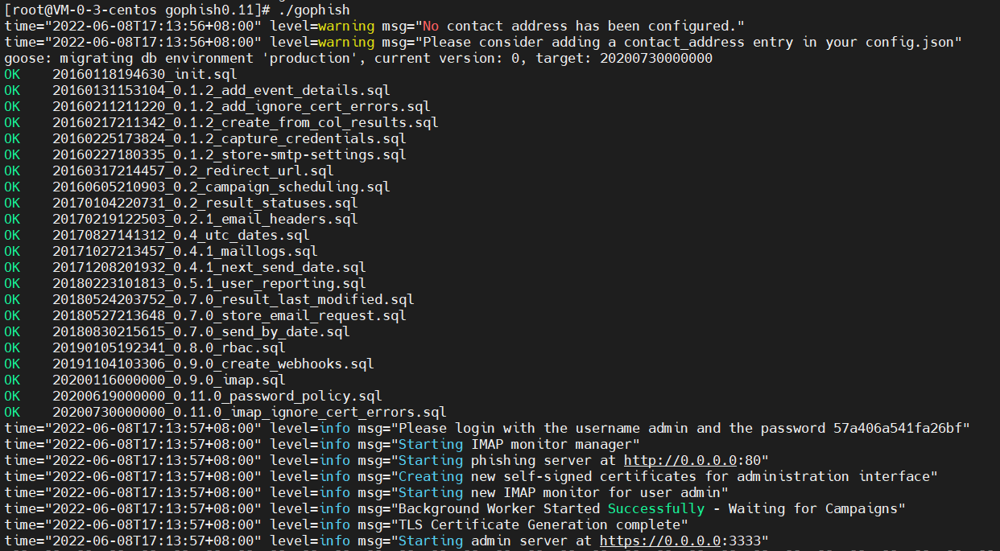

第一次启动时会生成随机的密码，比如我这里是 `57a406a541fa26bf`

访问 `https://121.5.154.138:3333/login?next=%2F` 使用 `admin/57a406a541fa26bf` 登陆系统，然后重置密码

好的，搭建完毕，回到命令行按 `ctl+a+d` 将会话放置到后台即可

详情见 ：[2. 搭建Gophish 钓鱼平台](https://www.yuque.com/sanqiushu-dsz56/efe3vx/bryod2dgtxvmbb1s)

## 购买域名并配置 DNS

我这里随便买了个域名 `0xxxx1.xyz`

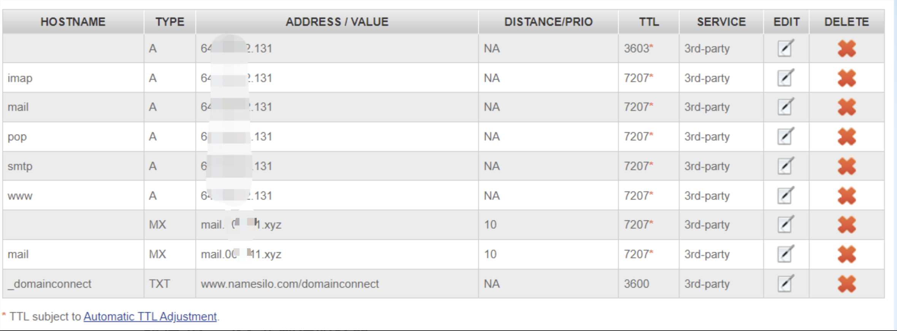

详情见：[3. 购买域名并配置 DNS](https://www.yuque.com/sanqiushu-dsz56/efe3vx/qx7s75yncgbgueax)

## 搭建 iReadMail 邮件服务器

阿里云、腾讯云均禁止使用邮件服务所必须的 25 端口提供邮件服务，因此您不能在 它们的云服务器部署邮件服务器。

需要一台干净的 vps ，没有安装过 MySQL，OpenLDAP，Postfix 等等的工具的 vps。

我是在 `Ubuntu 20.04 LTS (GNU/Linux 5.4.0-29-generic x86_64)` 上搭建的

这是官方文档：[在 Debian 或 Ubuntu 系统上安装 iRedMail](https://docs.iredmail.org/install.iredmail.on.debian.ubuntu-zh_CN.html)

访问[Download the latest iRedMail release](https://www.iredmail.org/download.html)下载最新的版本。

然后按照教程进行安装，安装完成后如下

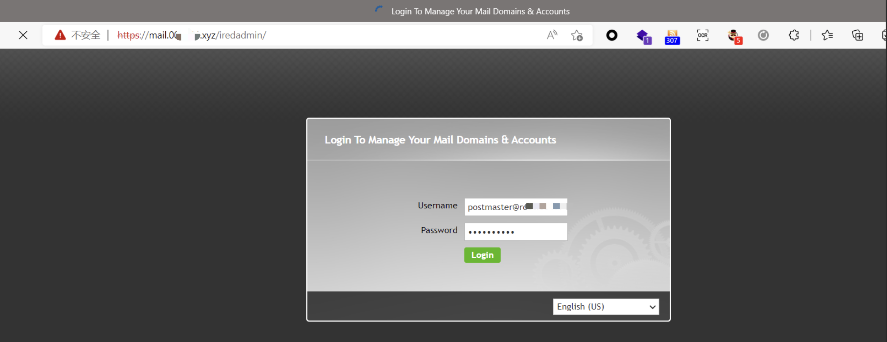

尝试使用第三方工具发送邮件

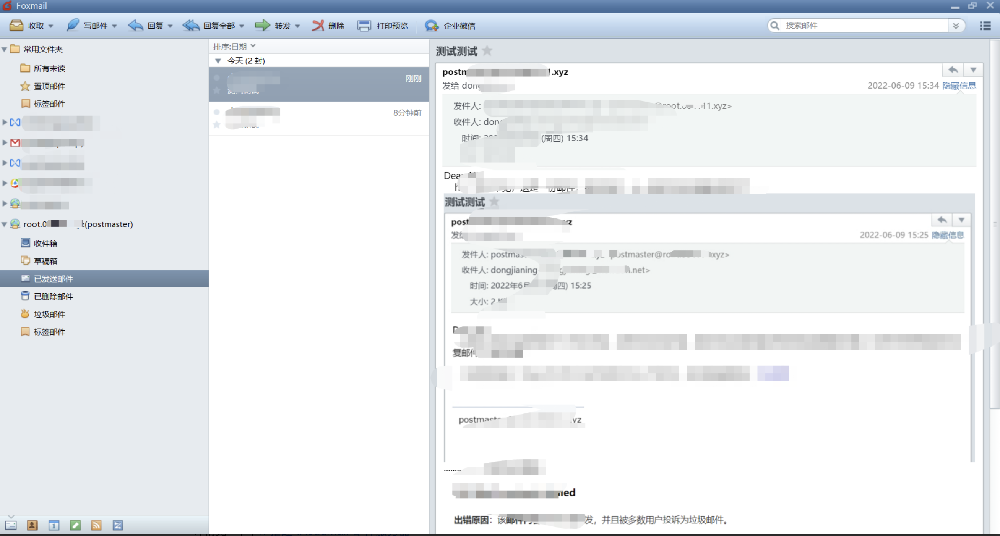

详情见：[4. 搭建 iReadMail 邮件服务器](https://www.yuque.com/sanqiushu-dsz56/efe3vx/nn0tkig3k2lhr54f)

搭建好邮件服务器后测试一下一个邮件会不会被判断为辣鸡邮件：[Newsletters spam test by mail-tester.com](https://www.mail-tester.com/) ， 啊，这

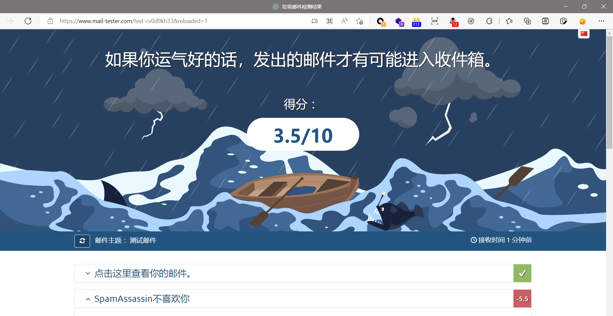

## 页面克隆工具

网页克隆插件 Save page we 或者其他的将网页保存为单页面的工具都行，直接插件市场下载即可

详情见：[5. 网页克隆及去除加密、无法登陆](https://www.yuque.com/sanqiushu-dsz56/efe3vx/hidtlzg9u610v4pf)

# 4. 钓鱼行动部署

本次行动与客户协商，以 vpn 账号作为目标机密。

以下步骤详情见 ：[2. 搭建Gophish 钓鱼平台](https://www.yuque.com/sanqiushu-dsz56/efe3vx/bryod2dgtxvmbb1s)

### 钓鱼页面制作

那么我们需要伪造客户的 vpn 登陆 web 界面

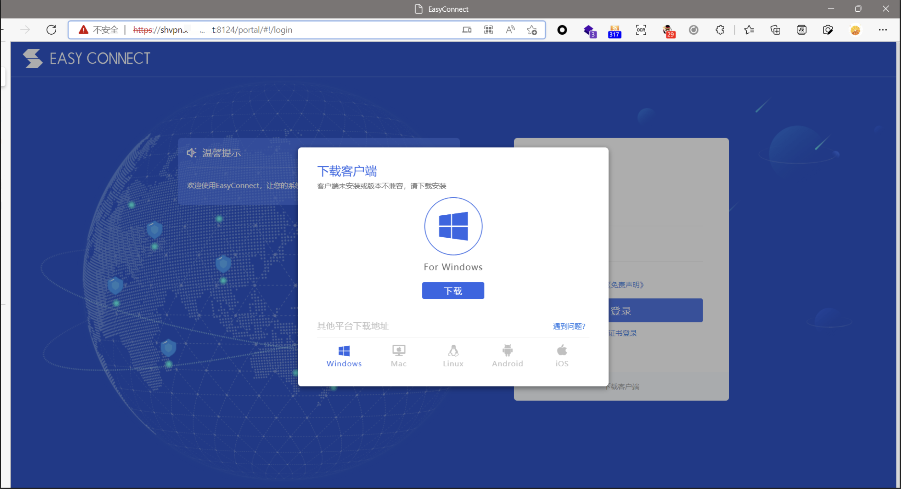

首先使用 Save page we 下载了客户的 web 页面，然后对其前端代码进行修改，去掉了下载客户端的弹框和修改表单格式

```php
<form method="post" ···>
  <input name="aaa" ··· /> 
  ··· 
  <input type="submit" ··· />
</form>
```

导入到 gophish 的 Landing Pages 模块

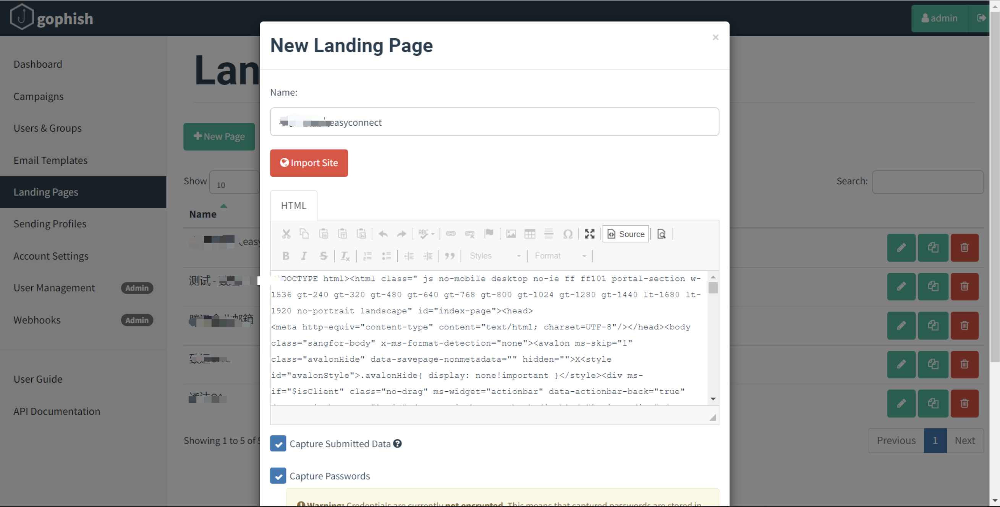

### 钓鱼域名解析

因为客户的域名是 `shvpn.xxxxxi.net` 我们经过考虑，购买了近似域名 `shvpn-xxxxxi.net`将其解析到 gophish 的 ip

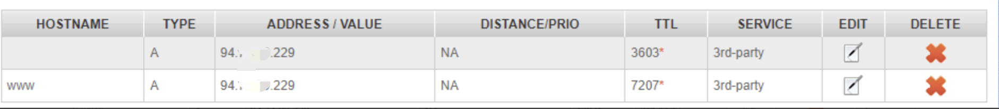

### 制作邮件模板

这个是客户提供了签名，然后简单写了点文案

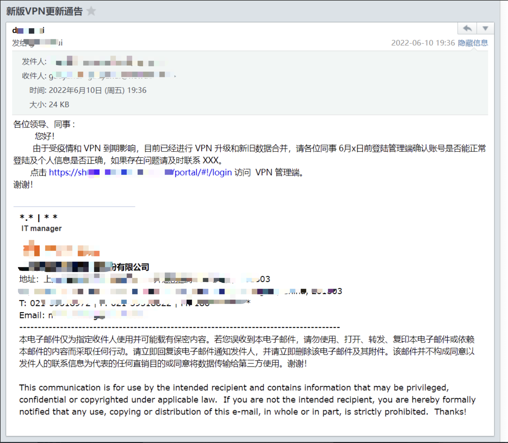

导入到 gophish 的 Email Template

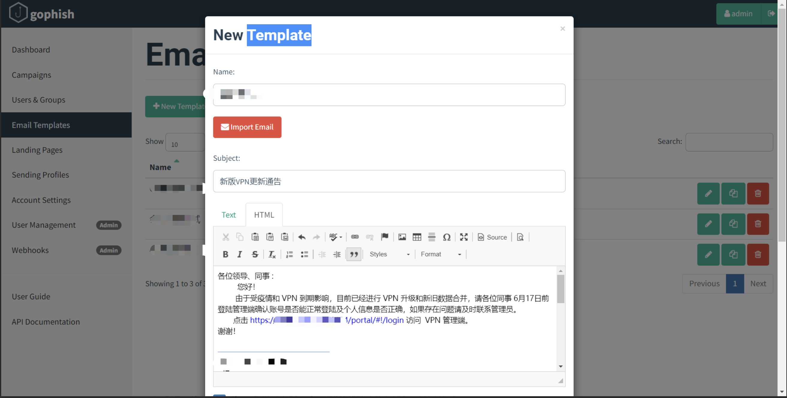

Subject 是指主题。

注意这里有一个大坑，一般情况下使用导入功能就能很完美的使用邮件模板了

我猜的：但是但是但是，Text 和 HTML 不是对应关系，而是并列关系，也就是说，Text 和 HTML 版本都会被发送到对方邮件中，根据对方的版本兼容性来判断使用哪一个

但是但是但是，请在保存后再打开看看，如果发现 Text 格式的乱码了（可能是使用了什么奇奇怪怪的编码格式 3Dutf-8是什么鬼），请将其 Text 删除，只留 HTML 版本的，唉。

### 将客户人员导入用户组

我这里只是演示了导入了我一个人的，可以使用 csv 模板批量导入

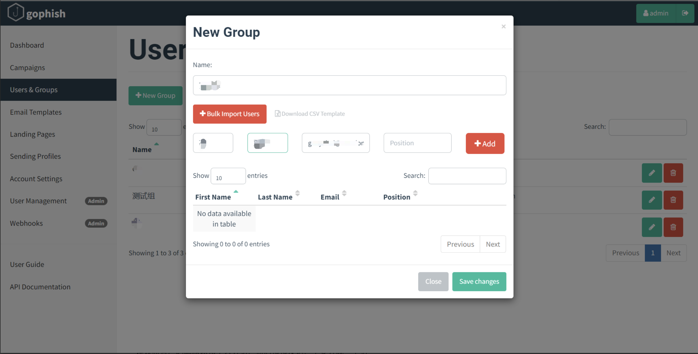

建议将客户的邮箱以10个人分组，然后慢慢发送，不要分成一个组

1. 我先是 400 个人分成一个组，然后直接全发过去，发现腾讯邮箱只接受了 50 封，然后就说频率太快不接受了。艹，但是 gophish 没有停止发送的按钮，gophish 一直重复尝试发送，人都傻了。只能结束这次钓鱼，然后结束钓鱼那个链接就访问不到了。导致浪费了 50 个人。
2. 然后第二次 300 多个人分成一个组，然后慢慢发，一个小时50封，结果发了 30 封，发现说 ip 发送邮件太多，不让发了，然后 gophish 没有停止发送的按钮，gophish 一直重复尝试发送，我吐了，只能再停止钓鱼，又浪费 30 个人。唉
3. 下次就 10 个人一组，老子慢慢发。

### 配置发件邮箱

我们这一次的发件邮箱是客户提供的，我自己虽然也搭建了一个邮箱服务器，但是老是被放到垃圾邮件里去，吐血

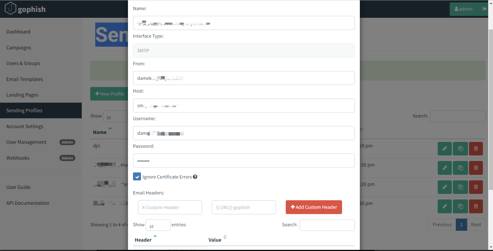

### 配置钓鱼事件

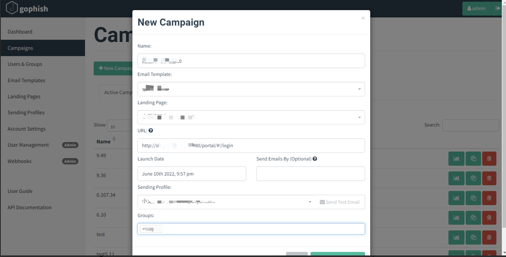

这里只需要注意设置 `Send Emails By(邮件全部发送完成的时间)` 一般情况下，短时间发送大量邮件，会被拒收，所以要慢慢发，我也没研究过频率应该咋算，反正 1 分钟 10 封被封了。

然后注意时间，别把下午当上午了搞个 12:00 am ，系统都直接给你全发了，😂

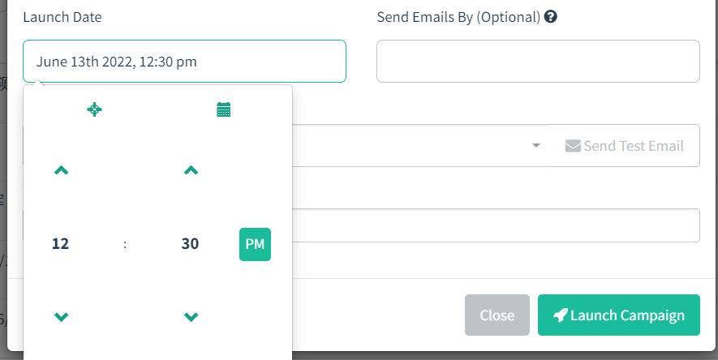

其他参考 [发件频率](https://www.yuque.com/sanqiushu-dsz56/efe3vx/mu9p4z8ruvzkuibe#PzkEg)，目前我测试的发现，腾讯邮箱 1 个小时只能收 50 封邮件（条件之一），所以设置的时候注意`分钟数 = 邮件数 * 1.2` `小时数 = 邮件数 / 50`（但并不保险，还是被封）

所以建议每个组里只放 15 个人，一次发一个组，用半个小时发送完成。

我测试 一组 20 个人，一次发一个组，用半个小时发送完成，本来好好的，发了两次，又拦截了。

如果你只有一个邮箱，那么你只能以一个很慢很慢的速度去发，那么建议就晚上 10 点开始发，等第二天早上了大家一起点开，就不会说有的人收到了，有的人没收到，互相谈论导致暴露。

# 客户侧钓鱼记录

首先收到一封邮件

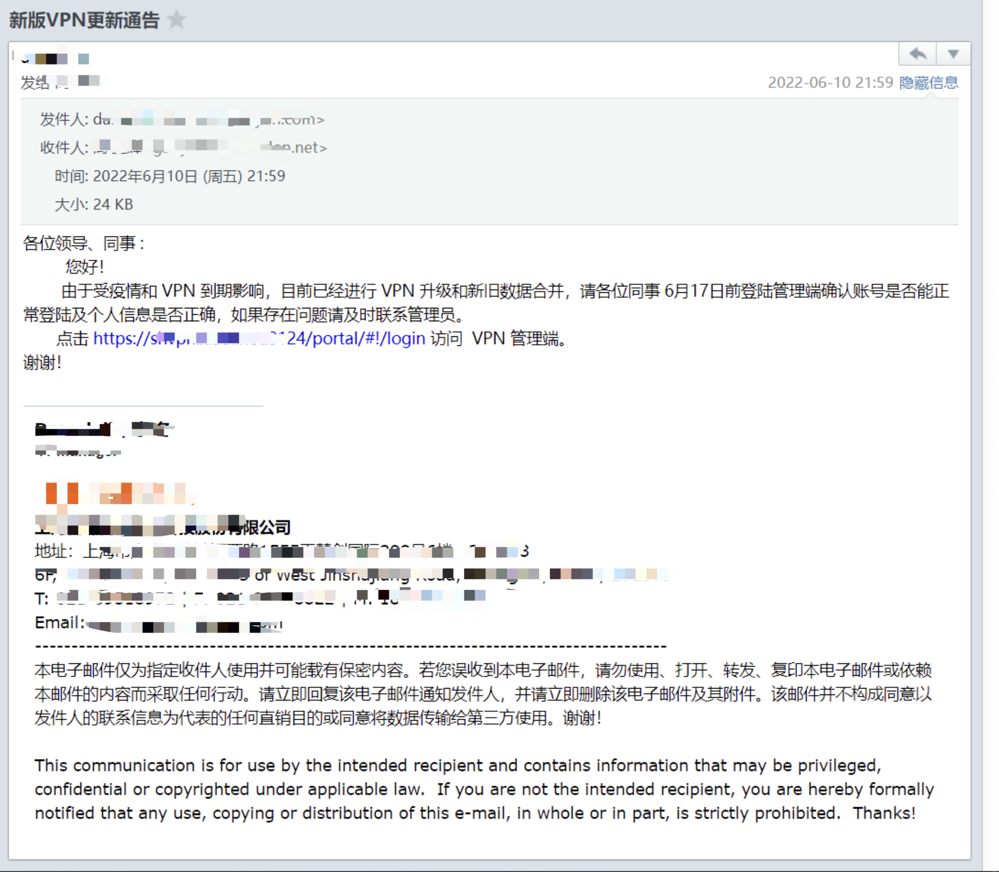

点击链接，跳转到钓鱼网页（这里端口还没有改）

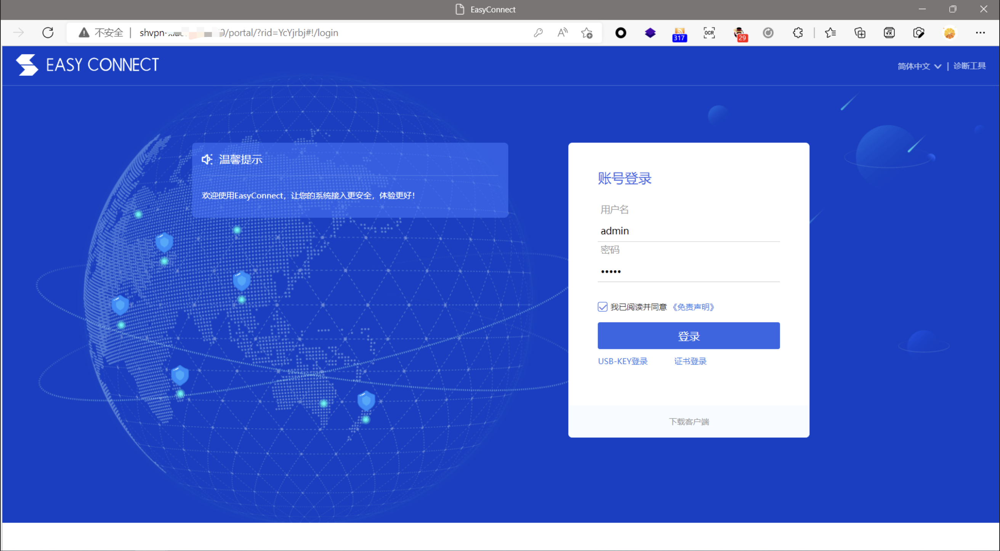

输入密码点击登录，跳转到客户正确的网站。

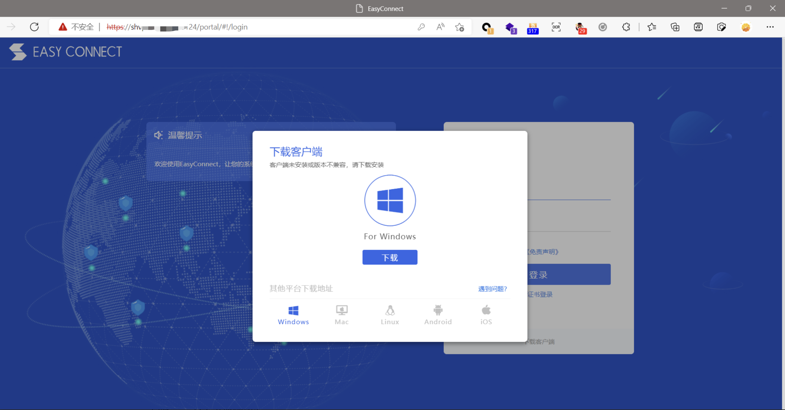

同时，gophish 获取到密码

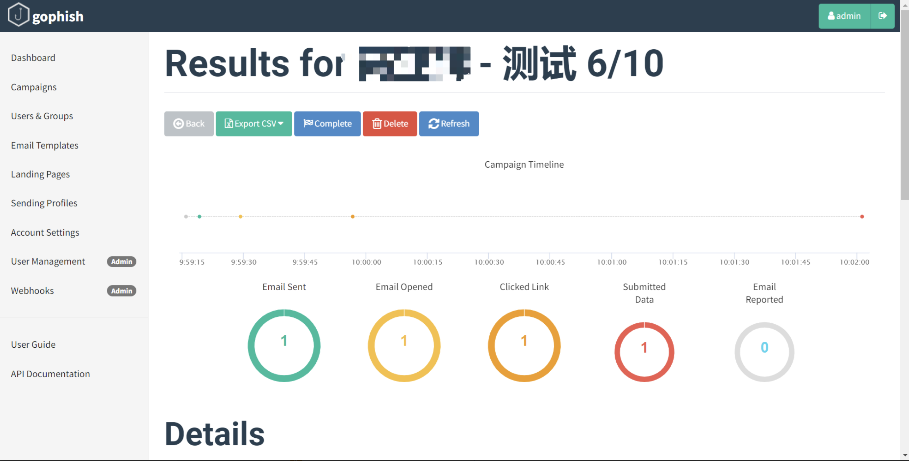

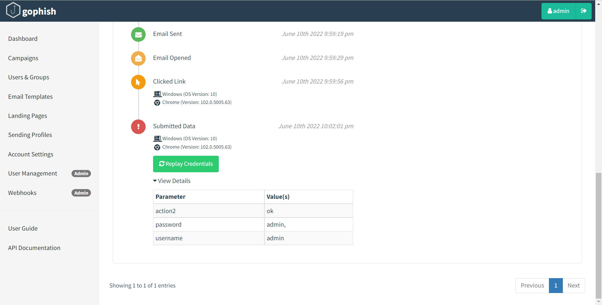

# 其他注意事项

## 收件频率与限制

这里以腾讯邮箱为例

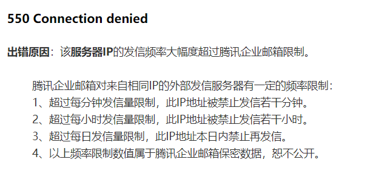

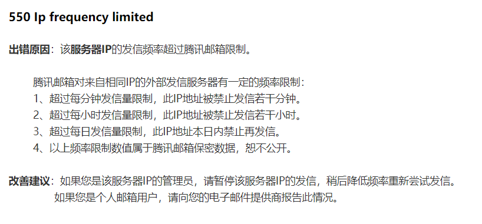

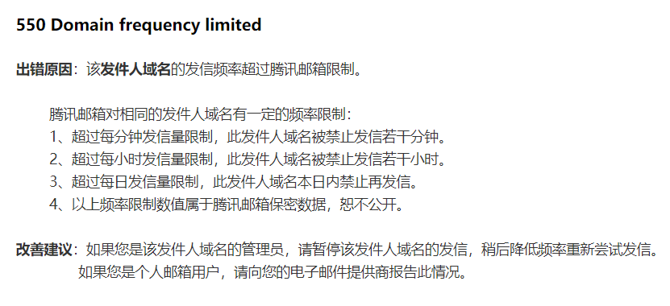

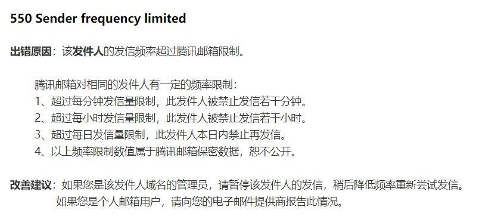

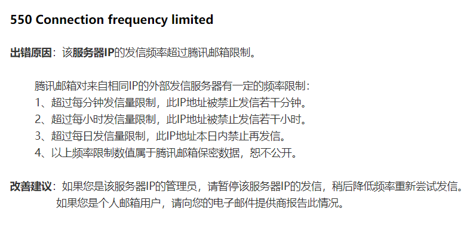

`服务器 IP` 发信频率、`发件人域名`发信频率、`发件人`发信频率，这三点都会影响到腾讯邮箱的拦截策略，所以对应的改进措施就是，使用多个 ip、多个域名、多个发件人来进行钓鱼邮件投递。

下面两条是血泪教训

5  分钟 50 个封掉 454 Transient reject by behaviour spam at Rcpt State(Connection IP address:94.74.99.229)ANTISPAM_BAT[01201311R1568S2430121229, ay29a033018046049]: too frequently sending

 30 分钟 30 个封掉 554 Reject by behaviour spam at Rcpt State(Connection IP address:94.74.99.229)ANTISPAM_BAT[01201311R5368S8830121234, ay29a033018046051]: too frequently sendingCONTINUE

## 发件频率与限制

如果是同域的邮箱，比如你获取了一个客户的邮箱：那么如果发送给一个群组，会视为发送一封邮件（这个 gophish 就做不到了），如果需要考虑这个问题，可以自己写 web 后端进行钓鱼。

如果是不同域的邮箱，我就不知道了。

gophish 发送钓鱼邮件的时候是每人一封发送的，因为每个人都有不同的 `?rid=xxxxxxx`，这样的话就会触发发件策略（自己搭建的邮箱肯定没这限制），但如果是客户提供的邮箱可能需要注意一下。

常用邮箱发送上限

1、[网易邮箱](https://www.zhihu.com/search?q=网易邮箱&search_source=Entity&hybrid_search_source=Entity&hybrid_search_extra={"sourceType"%3A"answer"%2C"sourceId"%3A107362958})： 

企业邮箱：单个用户每天最多只能发送 1000 封邮件。单个邮件最多包含 500 个收件人邮箱地址。

163 VIP 邮箱：每天限制最多能发送 800 封邮件。

163 、 126 、 yeah 的邮箱：一封邮件最多发送给 40 个收件人 , 每天发送限额为 50 封。

2、尚易企业邮箱：

一个 IP 一分钟最多发送 400 个邮件地址。

一封邮件最多 200 个邮件地址。

如果一封邮件包括 200 个收信人地址，一分钟最多不能超过 2 封邮件。

如果一封邮件只有一个收信人地址 , 一分钟发送的邮件不能超过 6 封。

3、QQ 邮箱：

为了防范少数垃圾邮件发送者的过量邮件发送行为， QQ 邮箱根据不同用户类型设置了不同 的发送总数的限制：

2G 的普通用户每天最大发信量是 100 封。

3G 会员、移动 QQ 、 QQ 行及 4G [大肚邮](https://www.zhihu.com/search?q=大肚邮&search_source=Entity&hybrid_search_source=Entity&hybrid_search_extra={"sourceType"%3A"answer"%2C"sourceId"%3A107362958})用户每天最大发信量是 500 封。

Foxmail 免费邮箱每天发送量限制为 50 封 。

4、Gmail 邮箱： 

邮件数量限制为每天 500 封 。

新申请的邮箱 每天发送量限制 50 封 。

5、新浪邮箱： 

企业邮箱试用期用户每天限制 80 封，购买后发信没有限制。

新浪免费邮箱，每天限制发送 50 封 。

6、雅虎免费邮箱：

每小时发送量限制为100封。

每天发送量限制为 200 封。

7、阿里巴巴英文站提高的企业邮箱: 

单个用户每天发送 200 封邮件 。

超过 200 封 / 天可能被系统自动冻结 。

8、HotMail 邮箱： 

每天发送限量限制为 100封 。

每次最多可以将同一封邮件发送给 50 个电子邮件地址。

9、搜狐 免费邮箱：每天发送量限制为 100 封 。

10、GMX 免费邮箱：每天发送量限制为 100 封 。

11、Gawab 免费邮箱：每天发送量限制为 100 封 。

12、AOL 免费邮箱：每天发送限制为 100 封 。

13、中国移动 139 免费邮箱：每天发送限制量为 100 封 。