# 0x01 简介

用户帐户控制（User Account Control，简写作UAC)是微软公司在其Windows Vista及更高版本操作系统中采用的一种控制机制。其原理是通知用户是否对应用程序使用硬盘驱动器和系统文件授权，以达到帮助阻止恶意程序（有时也称为“恶意软件”）损坏系统的效果。

# 0x02 漏洞概述

UAC会话中含有尽可能少的点击操作选项，利用该漏洞很容易就可以提升权限到SYSTEM。

# 0x03 影响版本

cpe：/ o：microsoft：windows_10：-

cpe：/ o：microsoft：windows_10：1607

cpe：/ o：microsoft：windows_10：1709

cpe：/ o：microsoft：windows_10：1803

cpe：/ o：microsoft：windows_10：1809

cpe：/ o：microsoft：windows_10：1903

cpe：/ o：microsoft：windows_7：-：sp1

cpe：/ o：microsoft：windows_8.1：-

cpe：/ o：microsoft：windows_rt_8.1：-

cpe：/ o：microsoft：windows_server_2008：-：sp2

cpe：/ o：microsoft：windows_server_2008：r2：sp1：~~~~ itanium〜

cpe：/ o：microsoft：windows_server_2008：r2：sp1：~~~~ x64〜

cpe：/ o：microsoft：windows_server_2012：-

cpe：/ o：microsoft：windows_server_2012：r2

cpe：/ o：microsoft：windows_server_2016：-

cpe：/ o：microsoft：windows_server_2016：1803

cpe：/ o：microsoft：windows_server_2016：1903

cpe：/ o：microsoft：windows_server_2019：-

# 0x04 环境搭建

Windows 7 sp1 

# 0x05 漏洞复现

新建用户M并添加到User组，切换到用户M

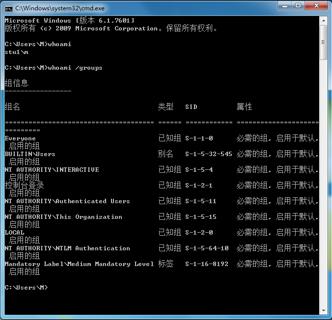

以管理员身份运行hhupd.exe

下载地址：

```http
https://github.com/mai-lang-chai/System-Vulnerability/raw/master/Windows/CVE-2019-1388/hhupd.exe
```

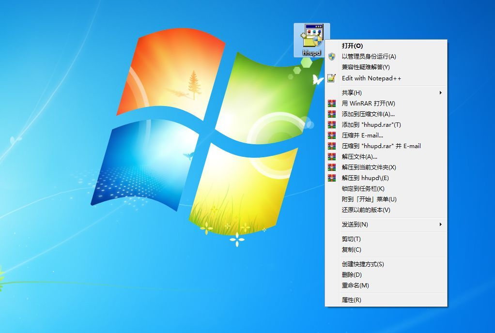


显示详细信息

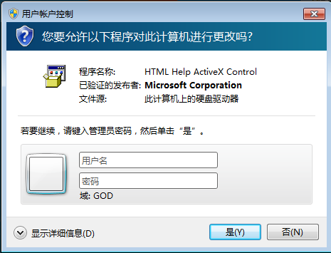


显示有关次发布者的证书信息

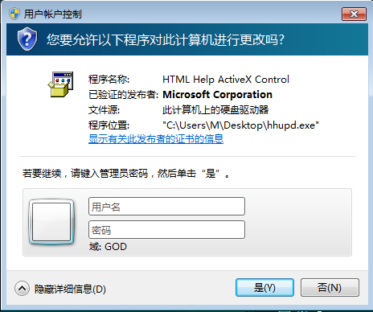


点击颁发者链接，关闭窗口

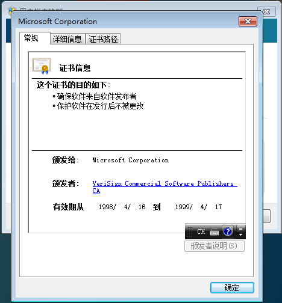


页面另存为

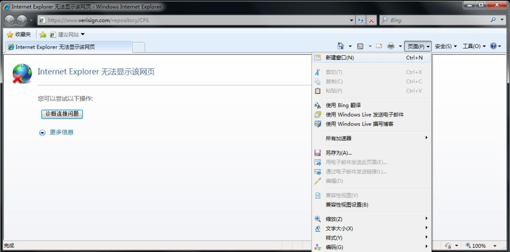


输入System32路径

C:\Windows\System32\*.*

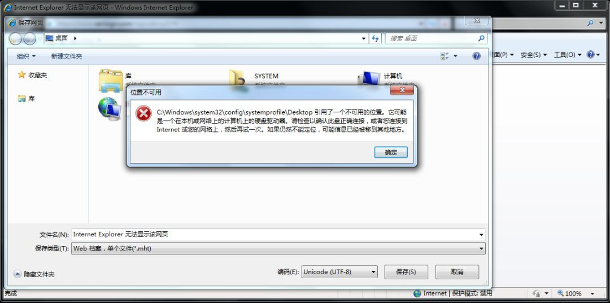


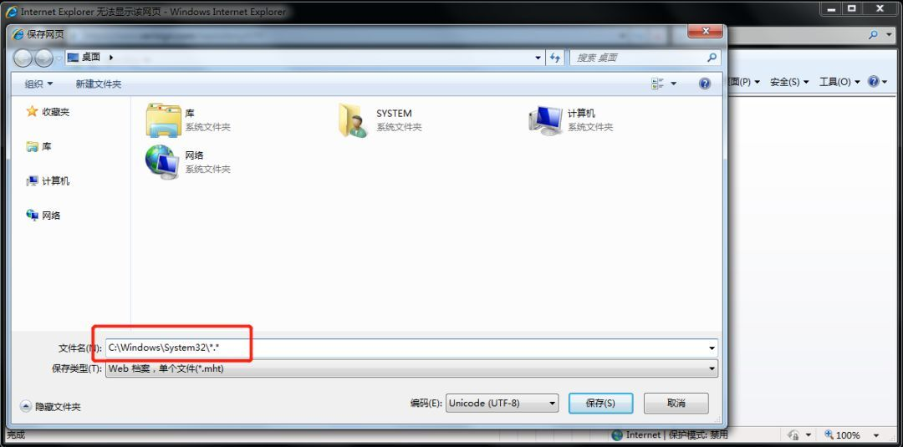


右键打开CMD

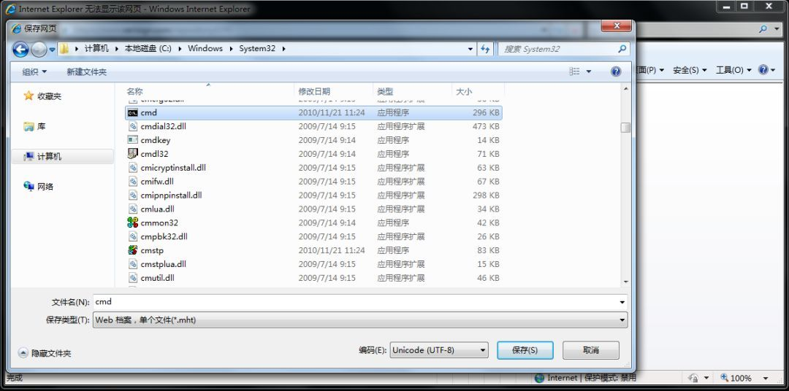


Bingo~

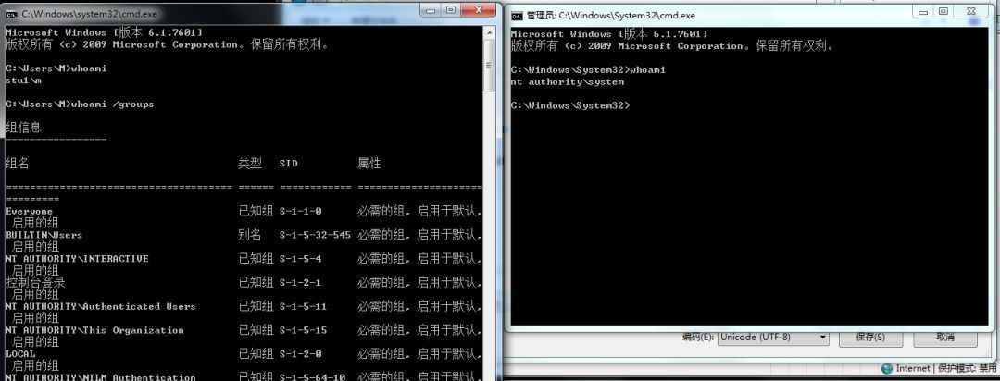


Windows Server 2016复现结果：

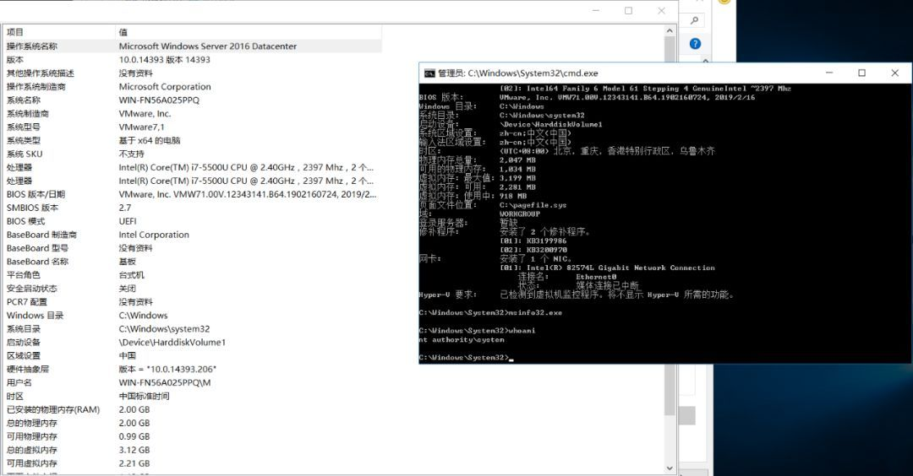


参考链接：

https://www.youtube.com/watch?v=3BQKpPNlTSo 

https://threatpost.com/windows-uac-flaw-privilege-escalation/150463/ 