## 0×00 目录遍历

这个以前也讲过。

拿到环境

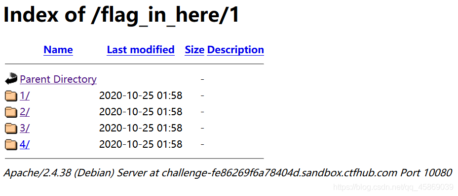

这次是给你了，如果不给你还需要使用工具扫描。

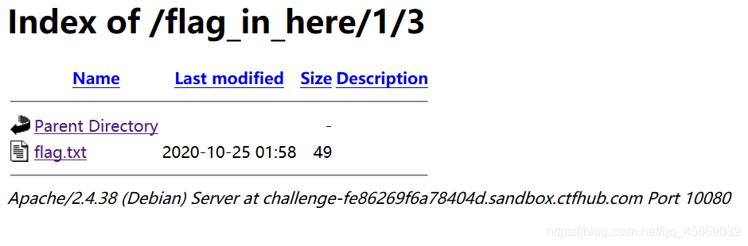

在3文件夹内找到了flag。


## 0×01 PHPINFO

就是得到PHP版本的信息。

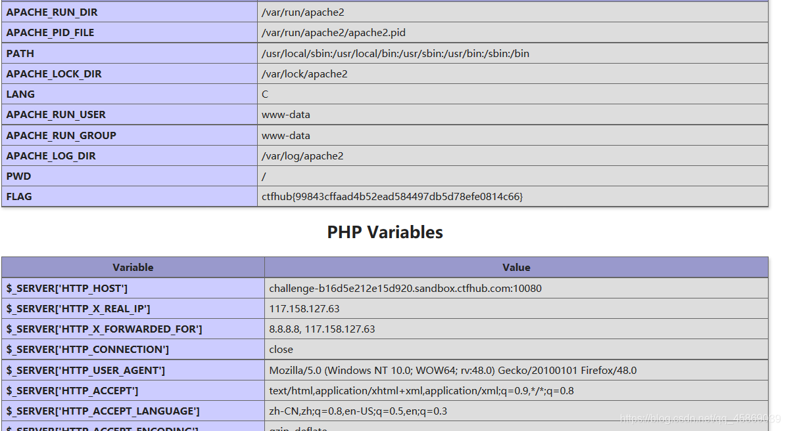

在众多的信息里，寻找到你想要的。


## 0×02 备份文件下载

### 0×01 网站源码

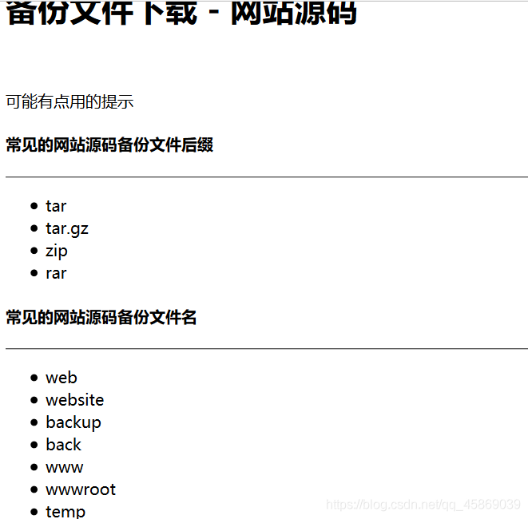

这个需要背会的😒

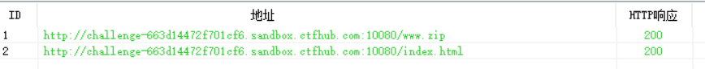

用御剑扫描得出来的。

下载过来，在www.zip里就能得到flag


### 0×02 bak文件

当开发人员在线上环境中对源代码进行了备份操作，并且将备份文件放在了 web 目录下，就会引起网站源码泄露。


dirsearch扫描一下

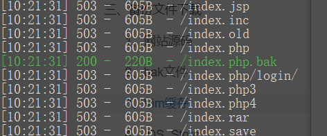

找到了，emmm，竟然还用不同的颜色标出来。

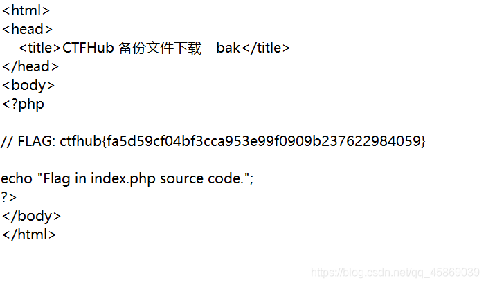

### 0×03 vim缓存

vim应该是Linux里的编辑软件，临时文件是在vim编辑文本时就会创建的文件，如果程序正常退出，临时文件自动删除，如果意外退出就会保留，当vim异常退出后，因为未处理缓存文件，导致可以通过缓存文件恢复原始文件内容。

```php
以 index.php 为例 第一次产生的缓存文件名为 .index.php.swp
第二次意外退出后，文件名为.index.php.swo
第三次产生的缓存文件则为 .index.php.swn
```

注意格式。

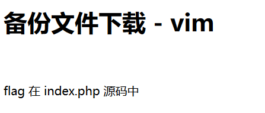

emmm

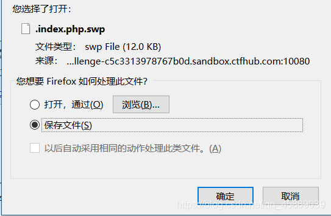

### 0×04.DS_Store

.DS_Store 是 Mac OS 保存文件夹的自定义属性的隐藏文件。通过.DS_Store可以知道这个目录里面所有文件的清单。

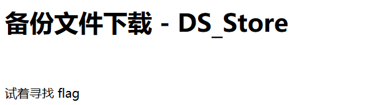

就下载就行了

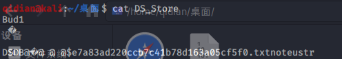

拉进kail

再次访问e7a8…txt

得到flag


## 0×03 Git泄露

这个我以前说过


### 0×00 Log

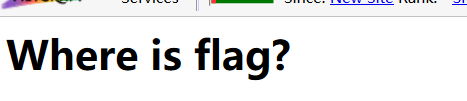

使用dirsearch

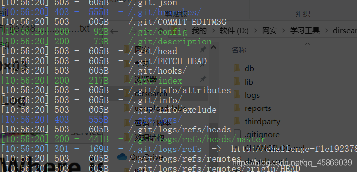

git泄露

再用git hack下载下来

ls -a 列出隐藏文件

git log 查看日志

git diff 查看git的不同

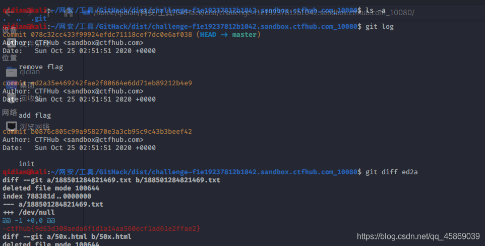

ed2a是add flag的commit的缩写。

### 0×01 Stash

stash命令可用于临时保存和恢复修改，可跨分支。

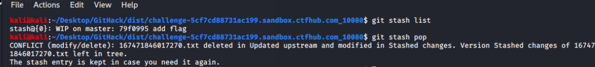

git stash list查看所有保存的记录列表。

git stash pop，从 git 栈中弹出来一个文件，这个文件的内容就是 flag

```php
恢复之前缓存的工作目录，将缓存堆栈中的对应stash删除，并将对应修改应用到当前的工作目录下,默认为第一个stash,即stash@{0}，如果要应用并删除其他stash，命令：git stash pop stash@{$num} ，比如应用并删除第二个：git stash pop stash@{1}）
```

cat 文件名 得到flag

### 0×02 index

同上。


### 0×03 SVN泄露

当开发人员使用 SVN 进行版本控制，对站点自动部署。如果配置不当,可能会将.svn文件夹直接部署到线上环境。这就引起了 SVN 泄露漏洞。

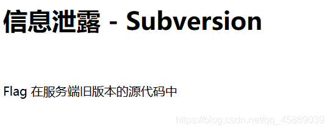SVN泄露所使用的工具https://github.com/kost/dvcs-ripper

安装Perl模块：

```php
sudo apt-get install perl libio-socket-ssl-perl libdbd-sqlite3-perl libclass-dbi-perl libio-all-lwp-perl
```

dvcs-ripper工具用法：`./rip-git.pl -v -u ``http://www.example.com/.svn/`

```php
svn1.6及以前版本会在项目的每个文件夹下都生成一个.svn文件夹，里面包含了所有文件的备份，文件夹名为 .svn/text-base/文件名.svn-base
svn1.7及以后版本则只在项目根目录生成一个.svn文件夹，里面的pristine文件夹里包含了整个项目的所有文件备份
```

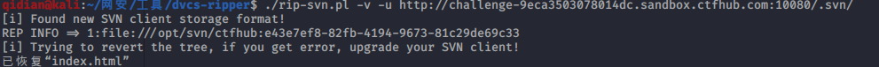

再用ls -al 列出所有文件

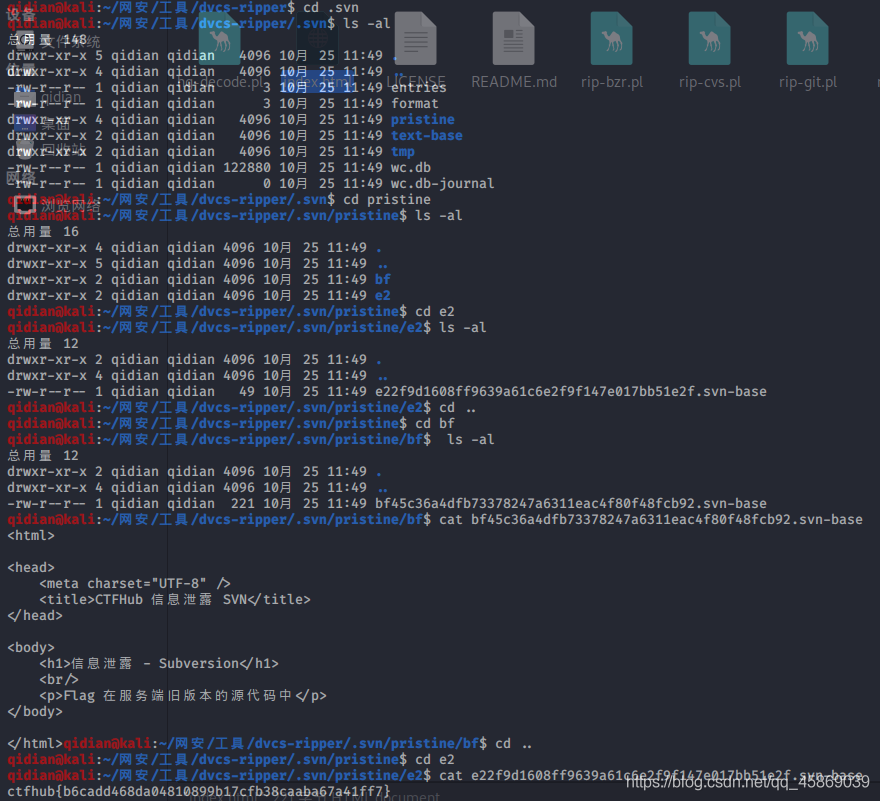

进入各个文件夹找文件，最终找到了flag。


### 0×04 HG泄露

当开发人员使用 Mercurial 进行版本控制，对站点自动部署。如果配置不当,可能会将.hg 文件夹直接部署到线上环境。这就引起了 hg 泄露漏洞。

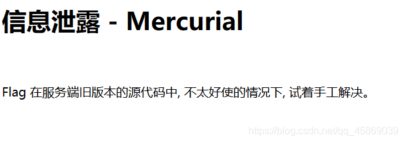

使用和HG同样的工具。

```php
./rip-hg.pl -v -u http://challenge-174262cde51d1bf9.sandbox.ctfhub.com:10080/.hg/
```

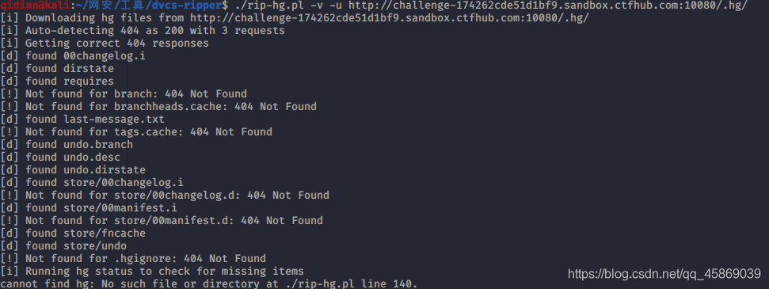

本以为没下载过来呢。

cd .hg进行了

直接grep -r flag *搜索，发现flag的一点轨迹。

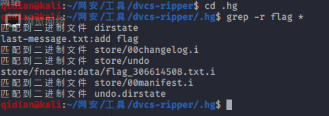

访问flag_306614508.txt就能得到flag。


结束！！！