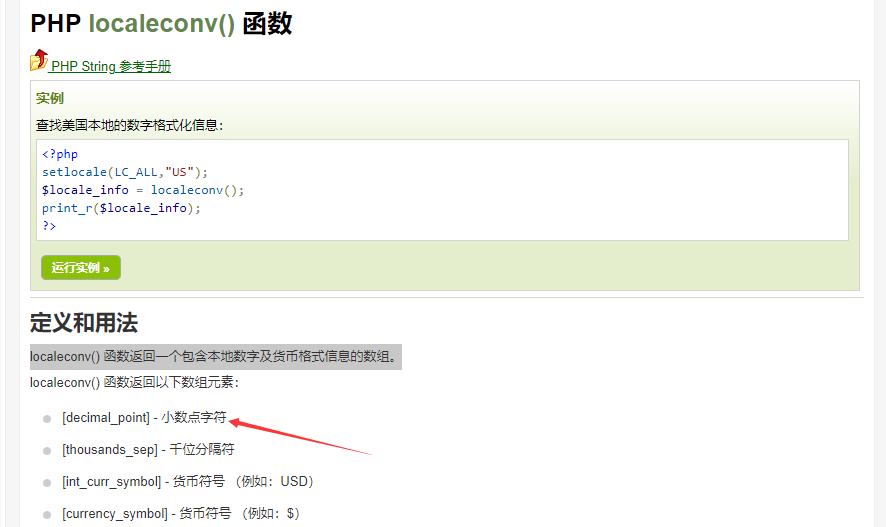
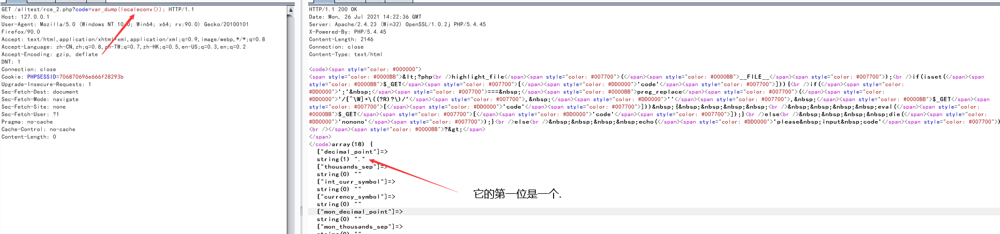
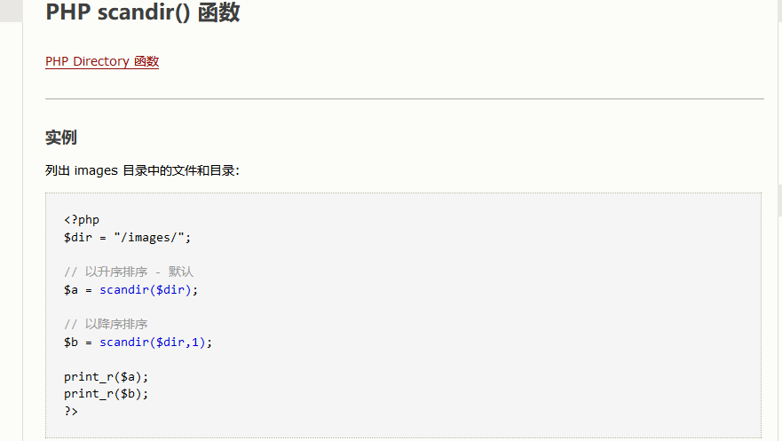
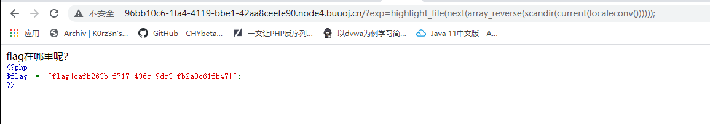

# 无参数rce

无参rce，就是说在无法传入参数的情况下，仅仅依靠传入没有参数的函数套娃就可以达到命令执行的效果，这在ctf中也算是一个比较常见的考点，接下来就来详细总结总结它的利用姿势

## 核心代码

```php
if(';' === preg_replace('/[^\W]+\((?R)?\)/', '', $_GET['code'])) {    
  eval($_GET['code']);
}
```


这段代码的核心就是只允许函数而不允许函数中的参数，就是说传进去的值是一个字符串接一个()，那么这个字符串就会被替换为空，如果替换后只剩下;，那么这段代码就会被eval执行。而且因为这个正则表达式是递归调用的，所以说像a(b(c()));第一次匹配后就还剩下a(b());，第二次匹配后就还剩a();，第三次匹配后就还剩;了，所以说这一串a(b(c()))，就会被eval执行，但相反，像a(b('111'));这种存在参数的就不行，因为无论正则匹配多少次它的参数总是存在的。那假如遇到这种情况，我们就只能使用没有参数的php函数。

## 常用攻击方式总结

### 0x01 getallheaders()+end()或者reset()---需要是Apache中间件

1. **end()和reset()以及current()函数**还有**next()**分别将数组指针指向最后一个单元**或**指回第一个单元以及当前单元和下一单元并以**字符串**的形式返回**其值**（注意只返回值不返回键值对，美妙至极）
2. **常用打法**：先在http报文头部首位或最后一位添加攻击向量（键名无所谓，值为攻击函数），再用eval()/assert()+getallheaders()+end()/reset()函数执行攻击（具体用end()/reset()/current()，写在首位还是末位，根据情况而定，自由测试，php版本不同似乎有影响）
3. 当然也不一定就要eval()执行命令，我们的目的是获取flag，那用readfile()之类的函数直接读取也是一样的，不要死脑筋。


### 0x02 get_defined_vars()+current()+current()/next()/end()/reset()---通用

get_defined_vars()获取的全局变量$_GET $_POST $_FILES $_COOKIE$REQUEST等，它的返回值是一个二维数组，我们利用GET方式传入的参数在第一个数组中。这里我们就需要先将二维数组转换为一维数组，我们可以用到current()函数，这个函数的作用是返回数组中的当前单元值，而它的默认是第一个单元，也就是我们GET方式传入的参数。

这里还有一个专门针对$_FILES下手的方法，可以参考这篇文章：https://skysec.top/2019/03/29/PHP-Parametric-Function-RCE/

**常用攻击payload:(自己根据具体环境调试，用var_dump()或者print_r()函数打印，一步步调试即可)**

- ?exp=eval(next(reset(get_defined_vars())));&fuck=phpinfo();
- ?exp=eval(end(current(get_defined_vars())));&fuck=phpinfo();
- ?fuck=phpinfo();&exp=eval(reset(current(get_defined_vars())));


这就获取到了GET传递的参数数组，再如上利用end()/reset()提取值，利用eval()执行即可


交换位置：


### 0x03 session_id()

这种方法和前面的也差不太多，这种方法简单来说就是把恶意代码写到COOKIE的PHPSESSID中，然后利用session_id()这个函数去读取它，返回一个字符串，然后我们就可以用eval去直接执行了，这里有一点要**注意的就是，如果抓包内没有Cookie:PHPSESSID=xxx字段的话，说明没有开启session，session_id()要开启session才能用，所以说要先执行session_start()**，


执行之后，再次抓包就会出现PHPSESSID字段了，这里我们再试着把PHPSESSID的值取出来：


直接出来就是字符串，那就非常完美，我们就不用去做任何的转换了。

#### 1.session_id()+readfile()等直接读文件

直接构造payload:?exp=readfile(session_id(session_start()));达到任意文件读取的效果：


但这里要注意的是，PHPSESSIID中只能有A-Z a-z 0-9，-，出现其他如单双引号，分号等，就会干扰执行，导致命令执行失败。可以用print_r()/var_dump()打印出来查看


所以说我们要先将恶意代码16进制编码以后再插入进去，而在php中，将16进制转换为字符串的函数为hex2bin

#### 2.session_id()+hex2bin()执行代码

我们要先将恶意代码16进制编码以后再插入进去，再用php中的hex2bin()将16进制转换还原为字符串来执行。


那我们就可以开始构造了，首先把PHPSESSID的值替换成这个，然后在前面把var_dump换成eval就可以成功执行了，如图：


成功出现phpinfo，稳稳当当，这种方法我认为是最好的一种方法，很容易理解，只是记得要将恶意代码先16进制编码一下哦

### 0x04 php函数直接读取文件

上面我们一直在想办法在进行rce，但有的情况下确实无法进行rce时，我们就要想办法直接利用php函数完成对目录以及文件的操作， 接下来我们就来介绍这些函数：

#### 1.localeconv()

官方解释：localeconv() 函数返回一个包含本地数字及货币格式信息的数组。



这个函数其实之前我一直搞不懂它是干什么的，为什么在这里有用，但实践出真知，我们在测试代码中将localeconv()的返回结果输出出来，这里很神奇的事就发生了，它返回的是一个二维数组，而它的第一位居然是一个点.，那按照我们上面讲的，是可以利用current()函数将这个点取出来的，但这个点有什么用呢？点代表的是当前目录！那就很好理解了，我们可以利用这个点完成遍历目录的操作！相当于就是linux中的ls，具体请看下图：




#### 2.scandir()

这个函数很好理解，就是列出目录中的文件和目录



#### 3.current()/pos()

这里首先声明，pos()函数是current()函数的别名，他们俩是完全一样的哈

这个函数我们前面已经用的很多了，它的作用就是输出数组中当前元素的值，只输出值而忽略掉键，默认是数组中的第一个值，如果要移动可以用下列方法进行移动：


#### 4.chdir()

这个函数是用来跳目录的，有时想读的文件不在当前目录下就用这个来切换，因为scandir()会将这个目录下的文件和目录都列出来，那么利用操作数组的函数将内部指针移到我们想要的目录上然后直接用chdir切就好了，如果要向上跳就要构造chdir('..')


#### 5.array_reverse()

将整个数组倒过来，有的时候当我们想读的文件比较靠后时，就可以用这个函数把它倒过来，就可以少用几个next()

#### 6.highlight_file()

打印输出或者返回 filename 文件中语法高亮版本的代码，相当于就是用来读取文件的

#### 7.show_source()

显示文件源码，读文件

## 例题解析——–GXYCTF 2019禁止套娃

这道题首先是一个git源码泄露，我们先用GitHack把源码跑下来，内容如下：

```php
<?php
  include "flag.php";
echo "flag在哪里呢？<br>";
if(isset($_GET['exp'])){
  if (!preg_match('/data:\/\/|filter:\/\/|php:\/\/|phar:\/\//i', $_GET['exp'])) {
    if(';' === preg_replace('/[a-z,_]+\((?R)?\)/', NULL, $_GET['exp'])) {
      if (!preg_match('/et|na|info|dec|bin|hex|oct|pi|log/i', $_GET['exp'])) {
        // echo $_GET['exp'];
        @eval($_GET['exp']);
      }
      else{
        die("还差一点哦！");
      }
    }
    else{
      die("再好好想想！");
    }
  }
  else{
    die("还想读flag，臭弟弟！");
  }
}
  // highlight_file(__FILE__);
  ?>
```

可以看出它是一个有过滤的无参rce，由于它过滤掉了et，导致我们前两种的方法都用不了，而且它也过滤了hex bin，数字也不在匹配范围内，hex2bin()函数会被拦截，第三种方法也不能像我们上面讲的一样先16进制编码了。

所以就只能使用第三种方法session_id()中的直接读取文件以及第四种方法读文件了

### 法一：session_id()结合readfile()读文件


### 法二：直接读文件

首先遍历当前目录：


可以看到flag.php是倒数第二个，那我们就把它反转一下，然后再用一个next()就是flag.php这个文件了


胜利就在眼前，直接highlight_file读取这个文件就拿到flag了：



思路总结

```php
scandir(current(localeconv()))是查看当前目录
加上array_reverse()是将数组反转，即Array([0]=>index.php[1]=>flag.php=>[2].git[3]=>..[4]=>.)
再加上next()表示内部指针指向数组的下一个元素，并输出，即指向flag.php
highlight_file()打印输出或者返回 filename 文件中语法高亮版本的代码
```


