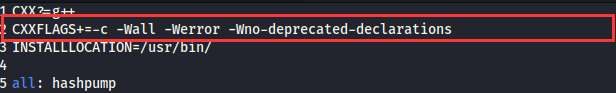
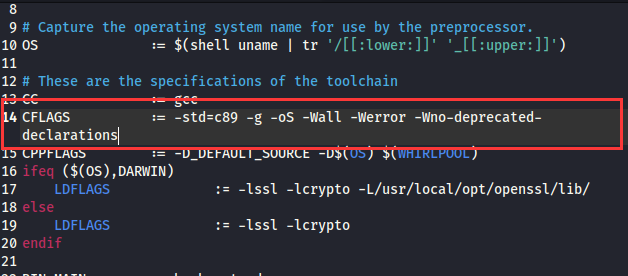
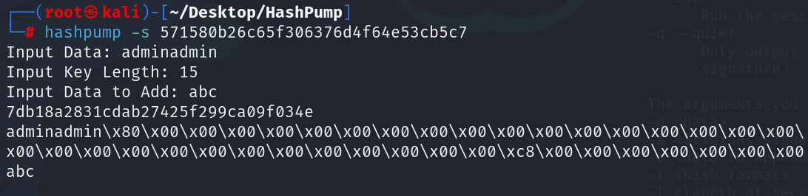
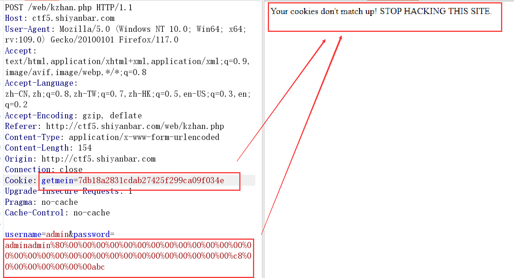
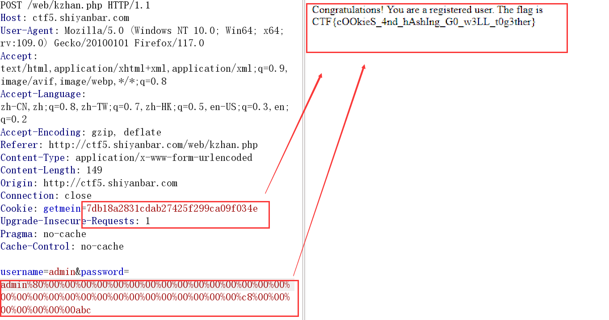
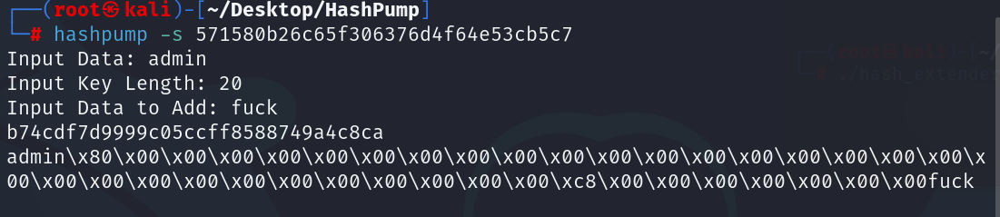
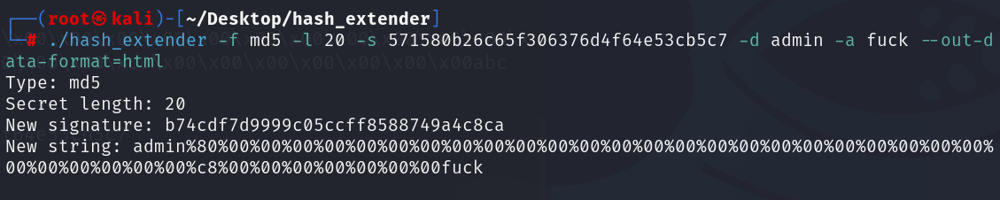
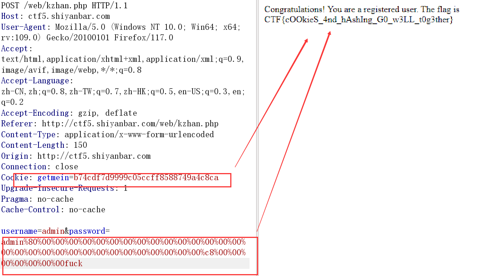

# 0x01 md5数据填充原理

哈希长度拓展攻击的原理有点过于复杂了，这里直接copy其他大佬的描述了。
 长度扩展攻击（length extension attack），是指针对某些允许包含额外信息的加密散列函数的攻击手段。对于满足以下条件的散列函数，都可以作为攻击对象：

① 加密前将待加密的明文按一定规则填充到固定长度（例如512或1024比特）的倍数；

② 按照该固定长度，将明文分块加密，并用前一个块的加密结果，作为下一块加密的初始向量（Initial Vector）。

满足上述要求的散列函数称为Merkle–Damgård散列函数（Merkle–Damgård hash function），下列散列函数都属于Merkle–Damgård散列函数：

```php+HTML
MD4
MD5
RIPEMD-160
SHA-0
SHA-1
SHA-256
SHA-512
WHIRLPOOL
```

对于H(salt+data)形式的加密，在以下条件满足的情况下，攻击者可以通过该方法获取H(salt+一定规则构造的data)：

**① 知道密文的加密算法且该算法满足Merkle–Damgård散列函数特征；**
**② 不知道salt，但知道salt的长度，并可控制data的值；**
**③ 可以得到一个H(salt+data)的值。**

简而言之，你要满足的条件就是：

- **知道salt的长度**
- **知道salt+data的Hash值，并且data是你所知道的明文**

这样你就能填充其他字符来得到一个和该`salt+data`计算出的`hash`值相同的一串字符串，整个过程你是不知道`秘钥salt`的。

# 0x02 工具安装

### 1. hashpump

地址：https://github.com/uf9n1x/HashPump.git

HashPump是一个借助于OpenSSL实现了针对多种散列函数的攻击的工具，支持针对MD5、CRC32、SHA1、SHA256和SHA512等长度扩展攻击。而MD2、SHA224和SHA384算法不受此攻击的影响，因其部分避免了对状态变量的输出，并不输出全部的状态变量。

**安装**

```shell
$ git clone https://github.com/uf9n1x/HashPump.git
$ apt-get install g++ libssl-dev
$ cd HashPump
$ make   //如果make不成功，就修改一下makefile文件，在CFLAGS标志后面添加 -Wno-deprecated-declarations 选项
$ make install
```



使用hashpump

```yaml
# hashpump
Input Signature: 571580b26c65f306376d4f64e53cb5c7
Input Data: admin
Input Key Length: 20
Input Data to Add: ginger
#不须要指定是哪一个hash算法，这是由原理决定的
```

得到

```shell
6f6dbe54ea8977af775a484eb7b23eb1
admin\x80\x00\x00\x00\x00\x00\x00\x00\x00\x00\x00\x00\x00\x00\x00\x00\x00\x00\x00\x00\x00\x00\x00\x00\x00\x00\x00\x00\x00\x00\x00\xc8\x00\x00\x00\x00\x00\x00\x00ginger
```

第一个是新的签名，把它设置到cookies的getmein里。

第二个先把\x替换为%后，post提交

就可以得到flag

### 2. hash_extender

地址：https://github.com/uf9n1x/hash_extender.git

安装

```shell
$ git clone https://github.com/uf9n1x/HashPump.git
$ apt-get install g++ libssl-dev
$ cd HashPump
$ make   //如果make不成功，就修改一下makefile文件，在CFLAGS标志后面添加 -Wno-deprecated-declarations 选项
$ make install
```



搭配使用脚本(如果不给secret长度，可用这个脚本爆破)

```python
    # -*- coding:utf-8 -*-
    from urlparse import urlparse
    from httplib import HTTPConnection
    from urllib import urlencode
    import json
    import time
    import os
    import urllib
    def gao(x, y):
            #print x
            #print y
        url = "http://web.jarvisoj.com:32778/index.php"
        cookie = "role=" + x + "; hsh=" + y
            #print cookie
        build_header = {
                'Cookie': cookie,
                'User-Agent': 'Mozilla/5.0 (Macintosh; Intel Mac OS X 10.11; rv:44.0) Gecko/20100101 Firefox/44.0',
                'Host': 'web.jarvisoj.com:32778',
                'Accept': 'text/html,application/xhtml+xml,application/xml;q=0.9,*/*;q=0.8',
        }
        urlparts = urlparse(url)
        conn = HTTPConnection(urlparts.hostname, urlparts.port or 80)
        conn.request("GET", urlparts.path, '', build_header)
        resp = conn.getresponse()
        body = resp.read()
        return body
    for i in xrange(1000):
        print i
        #secret len = ???
        find_hash = "./hash_extender -d ';\"tseug\":5:s' -s 3a4727d57463f122833d9e732f94e4e0 -f md5  -a ';\"nimda\":5:s' --out-data-format=html -l " + str(i) + " --quiet"
        #print find_hash
        calc_res = os.popen(find_hash).readlines()
        hash_value = calc_res[0][:32]
        attack_padding = calc_res[0][32:]
        attack_padding = urllib.quote(urllib.unquote(attack_padding)[::-1])
        ret = gao(attack_padding, hash_value)
        if "Welcome" in ret:
            print ret
            break
```

**使用示例**：


如果您不确定哈希类型，可以通过省略–format参数让它尝试不同的类型。如果你正在尝试多种算法，我建议使用–table参数：

```shell
┌──(root㉿kali)-[~/Desktop/hash_extender]
└─# ./hash_extender -f md5 -l 20 -s 571580b26c65f306376d4f64e53cb5c7 -d admin -a fuck --out-data-format=html //-f hash方法 -l secret密钥长度 -s 初始hash值 -d 初始计算数据  -a 追加数据 --out-data-format=html  输出的追加数据格式（默认16进制）   
Type: md5
Secret length: 20
New signature: b74cdf7d9999c05ccff8588749a4c8ca
New string: admin%80%00%00%00%00%00%00%00%00%00%00%00%00%00%00%00%00%00%00%00%00%00%00%00%00%00%00%00%00%00%00%c8%00%00%00%00%00%00%00fuck
```

有很多选项可用于格式化输入和输出，包括HTML（使用*％NN*表示法），CString（使用*\ xNN*表示法，以及*\ r*，*\ n*，*\ t*等），hex （例如上面如何指定哈希）等。

默认情况下，我试图选择我认为最合理的选择：

- 输入数据：原始
- 输入哈希：十六进制
- 输出数据：十六进制
- 输出哈希：十六进制

这是帮助页面供参考：

```shell
Ron Bowes
有关许可证信息，请参阅LICENSE.txt。
用法：./ hash_extender < -  data =| --file =>  - 签名= --format =[options] 

INPUT OPTIONS 
-d --data =
      我们要扩展的原始字符串。
--data格式=
      字符串传入的格式为。默认值：raw。
      有效格式：raw，hex，html，cstr 
--file =
      作为指定字符串的替代方法，它将原始字符串
      作为文件读取。
-s --signature =
      原始签名。
--signature格式=
      签名传递的格式为。默认值：十六进制 
      有效格式：raw，hex，html，
cstr -a --append =
      要附加到字符串的数据。默认值：raw。
--append格式=
      有效格式：raw，hex，html，cstr 
-f --format =[必需] 
      签名的hash_type。如果您
      想尝试多个签名，可以多次给出。'all'将
      根据签名的大小选择所选类型，并使用有意义的哈希值。
      有效类型：md4，md5，ripemd160，sha，sha1，sha256，sha512，whirlpool 
-l --secret =
      秘密的长度，如果知道的话。默认值：8. 
-secret-min =
--secret-MAX =
      尝试不同的密钥长度（两个选项都是必需的）
OUTPUT OPTIONS 
--table 
      以表格格式输出字符串。
--out-data-format=
      输出数据格式。
      有效格式：none，raw，hex，html，html-pure，
cstr ，cstr- pure，fancy --out-signature-format =
      输出签名格式。
      有效格式：none，raw，hex，html，html-pure，cstr，cstr-pure，fancy 

OTHER OPTIONS 
-h --help 
      显示用法（this）。
--test 
      运行测试套件。
-q --quiet 
      只输出绝对必要的内容（输出字符串和
      签名）
```

### 3. md5-extension-attack-master

# 0x03 例题

## 1. 例题一：Getmein-md5_hash长度扩展攻击

```php
<?php 

$flag = "XXXXXXXXXXXXXXXXXXXXXXX";
$secret = "XXXXXXXXXXXXXXX"; // This secret is 15 characters long for security!
 
$username = $_POST["username"];
$password = $_POST["password"];
 
if (!empty($_COOKIE["getmein"])) {
    if (urldecode($username) === "admin" && urldecode($password) != "admin") {
        if ($COOKIE["getmein"] === md5($secret . urldecode($username . $password))) {
            echo "Congratulations! You are a registered user.\n";
            die ("The flag is ". $flag);
        }
        else {
            die ("Your cookies don't match up! STOP HACKING THIS SITE.");
        }
    }
    else {
        die ("You are not an admin! LEAVE.");
    }
}
 
setcookie("sample-hash", md5($secret . urldecode("admin" . "admin")), time() + (60 * 60 * 24 * 7));
 
if (empty($_COOKIE["source"])) {
    setcookie("source", 0, time() + (60 * 60 * 24 * 7));
}
else {
    if ($_COOKIE["source"] != 0) {
        echo ""; // This source code is outputted here
    }
}
```

题目思路很简单，你提交的`getmein`的值和`md5($secret+$_POST['username']+$_POST[''passname])`的值一样，并且你提交的`password`不能是`admin`

这里思考方法有两种：

### 思考一

我们已知的有：`初始签名：sample-hash=md5(15位的$secret+'adminadmin')`，`密钥的长度`为15位，那么我们可以通过任意附加的字符串计算得到一个新的`md5`值=`md5($secret+'工具返回的字符串')`，那么这时我们将这个新的hash值赋给getmein,将工具返回的字符串赋给username+password，就可以满足题目要求，得到flag.

初始签名（哈希值）是：md5(15位$secret .+urldecode("admin" + "admin"))=sample-hash=571580b26c65f306376d4f64e53cb5c7

```http
计算初始值时跟的data是：adminadmin
密钥长度：15位
任意添加的附加字符串：abc
得到新的md5值：7db18a2831cdab27425f299ca09f034e
得到附加字符串：adminadmin\x80\x00\x00\x00\x00\x00\x00\x00\x00\x00\x00\x00\x00\x00\x00\x00\x00\x00\x00\x00\x00\x00\x00\x00\x00\x00\x00\x00\x00\x00\x00\xc8\x00\x00\x00\x00\x00\x00\x00abc
url编码：将\x换成%
adminadmin%80%00%00%00%00%00%00%00%00%00%00%00%00%00%00%00%00%00%00%00%00%00%00%00%00%00%00%00%00%00%00%c8%00%00%00%00%00%00%00abc
提交：getmein=7db18a2831cdab27425f299ca09f034e    username=admin    password=adminadmin%80%00%00%00%00%00%00%00%00%00%00%00%00%00%00%00%00%00%00%00%00%00%00%00%00%00%00%00%00%00%00%c8%00%00%00%00%00%00%00abc
```



但是此时去提交，会发现并不会得到flag



回头来思考，我们前面说：`初始签名：sample-hash=md5(15位的$secret+'adminadmin')`，`密钥的长度`为15位，那么我们可以通过任意附加的字符串计算得到一个新的`md5`值=`md5($secret+'工具返回的字符串')`，那么这时我们将这个新的hash值赋给getmein,将工具返回的字符串赋给username+password，是不是发现问题了，赋值错了，工具返回的字符串是username+password的值，却全赋给了password,改一下，将password中的admin去掉一个：就OK了。实际上这是因为，这道题目限定了username必须有：username=admin，在计算md5hash时也一直都是有MD5(15位secret+admin+'xxxx'),因此实际上这道题中应当把username这个已知但不变的值也归到未知的secret中去，是不影响我们做题的，因为secret只需要知道位数



### 思考二

由上面的思考延伸出来，我们知道这道题目实际上不变的secret实际上是由15位的secret+5位的已知字符串’admin‘构成，那么这时再回头来走一遍流程：

我们已知的有：`初始签名：sample-hash=md5(20位的$secret1+'admin')`，`密钥的长度`为20位，那么我们可以通过任意附加的字符串计算得到一个新的`md5`值=`md5($secret1+'工具返回的字符串')`，那么这时我们将这个新的hash值赋给getmein,将工具返回的字符串赋给password，就可以满足题目要求，得到flag.

初始签名（哈希值）是：md5(20位$secret +urldecode("admin"))=sample-hash=571580b26c65f306376d4f64e53cb5c7

```http
计算初始值时跟的data是：admin
密钥长度：20位
任意添加的附加字符串：fuck
得到新的md5值：b74cdf7d9999c05ccff8588749a4c8ca
得到附加字符串：admin\x80\x00\x00\x00\x00\x00\x00\x00\x00\x00\x00\x00\x00\x00\x00\x00\x00\x00\x00\x00\x00\x00\x00\x00\x00\x00\x00\x00\x00\x00\x00\xc8\x00\x00\x00\x00\x00\x00\x00fuck
url编码：将\x换成%
admin%80%00%00%00%00%00%00%00%00%00%00%00%00%00%00%00%00%00%00%00%00%00%00%00%00%00%00%00%00%00%00%c8%00%00%00%00%00%00%00abc
提交：getmein=b74cdf7d9999c05ccff8588749a4c8ca    username=admin    password=admin%80%00%00%00%00%00%00%00%00%00%00%00%00%00%00%00%00%00%00%00%00%00%00%00%00%00%00%00%00%00%00%c8%00%00%00%00%00%00%00fuck
得到flag
```







## 2. 例题二：

