# Stowaway

目前有很多优秀的内网代理工具如frp, nps等，但是有些情况下，我们需要搭建多级网络代理，直达目标内网深处。而目前frp，nps等工具在搭建多级代理时操作过去复杂不便于管理。

而Stowaway工具就是需要解决这一问题。Stowaway是一个利用go语言编写、专为渗透测试工作者制作的多级代理工具，用户可使用此程序将外部流量通过多个节点代理至内网，突破内网访问限制，构造树状节点网络，并轻松实现管理功能。

项目地址：https://github.com/ph4ntonn/Stowaway

towaway一共包含两种角色，分别是：

- admin  代表控制端
- agent  代表被控端

**名词定义**

- 节点: 指admin || agent
- 主动模式: 指当前操作的节点主动连接另一个节点
- 被动模式: 指当前操作的节点监听某个端口，等待另一个节点连接
- 上游: 指当前操作的节点与其父节点之间的流量
- 下游：指当前操作的节点与其所有子节点之间的流量

# 环境说明

测试环境如下

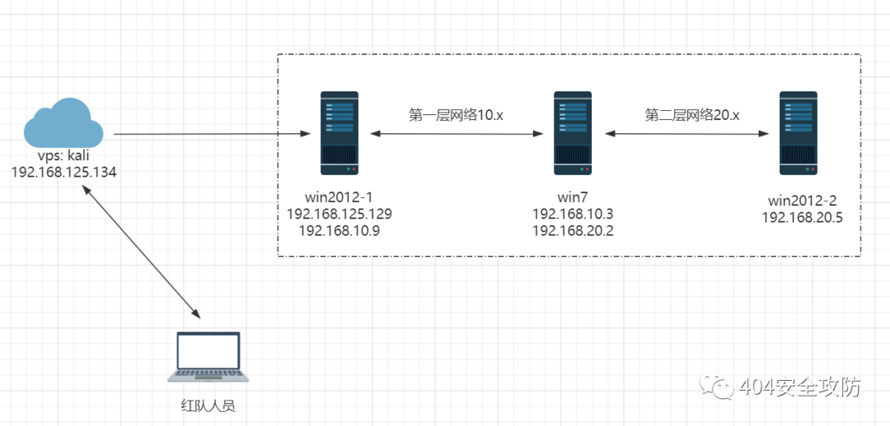

# 代理搭建

admin：

```
参数:
-l 被动模式下的监听地址[ip]:<port>
-s 节点通信加密密钥,所有节点(admin&&agent)必须一致
-c 主动模式下的目标节点地址
--proxy socks5代理服务器地址
--proxyu socks5代理服务器用户名(可选)
--proxyp socks5代理服务器密码(可选)
--down 下游协议类型,默认为裸TCP流量,可选HTTP
```

agent：

```
参数:
-l 被动模式下的监听地址[ip]:<port>
-s 节点通信加密密钥
-c 主动模式下的目标节点地址
--proxy socks5代理服务器地址
--proxyu socks5代理服务器用户名(可选)
--proxyp socks5代理服务器密码(可选)
--reconnect 重连时间间隔（s）
--rehost 端口复用时复用的IP地址
--report 端口复用时复用的端口号
--up 上游协议类型,默认为裸TCP流量,可选HTTP
--down 下游协议类型,默认为裸TCP流量,可选HTTP
--cs 运行平台的shell编码类型，默认为utf-8，可选gbk
```

## **一级代理**

1. 控制端配置

上传控制端到kali，使用被动模式，监听端口8000，并对通信进行加密秘钥为123。等待被控端的连接

```
./linux_x64_admin -l 192.168.125.134:8000 -s 123 
#或者不指定ip默认监听0.0.0.0
./linux_x64_admin -l 8000 -s 123
```

1. 被控端配置

在win2012-1上执行，使用秘钥123连接控制端8000端口，并设置重连间隔时间，当控制端掉线时客户端每隔8s重连控制端

```
windows_x64_agent.exe -c 192.168.125.134:8000 -s 123 --reconnect 8
```

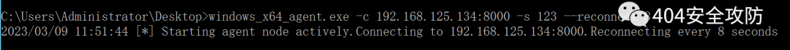

此时客户端与控制端间搭建了一条socks隧道。

### **admin控制端命令**

在admin控制台中，用户可以用tab来补全命令，方向键上下左右来查找历史/移动光标。admin控制台分为两个层级，第一层为main panel，第二层为node panel

**main panel**

输入help查看详细使用参数

```
detail	展示在线节点的详细信息
topo		展示在线节点的父子关系
use			使用某个agent
exit		退出
```

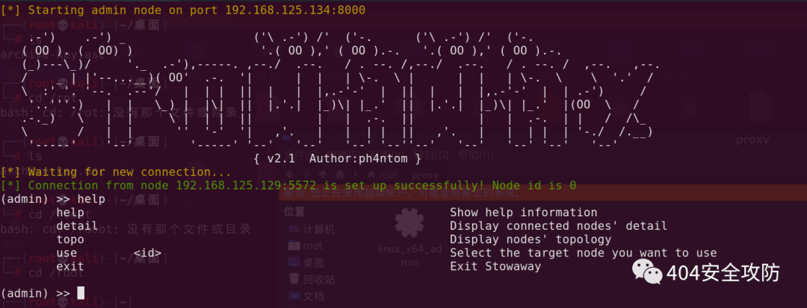

**node panel**

当客户端连接控制端后，使用detail就可以查看到目前有哪些客户端已经连接，使用use 节点，然后会进入这个节点的控制面板

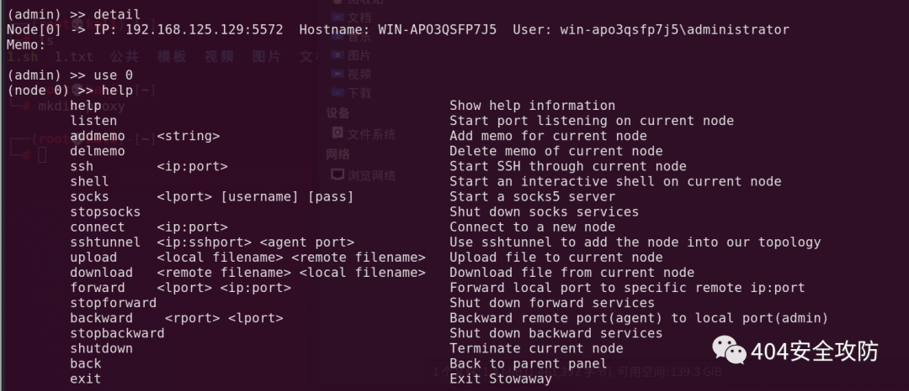

1. 接着我们设置socks5代理端口为7777，连接账号密码为 admin admin，供测试人员进行连接访问代理

```
socks 7777 admin admin
```

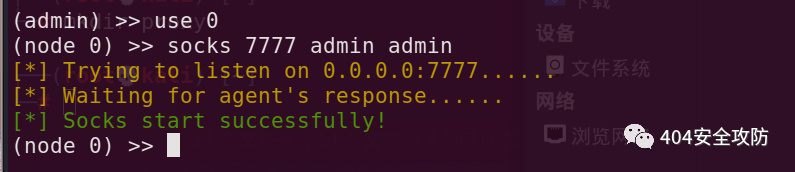

1. 使用proxifier连接控制端

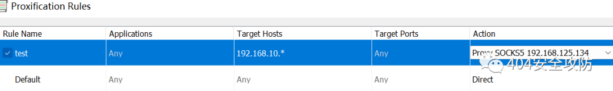

此时成功访问第一层网络10.x

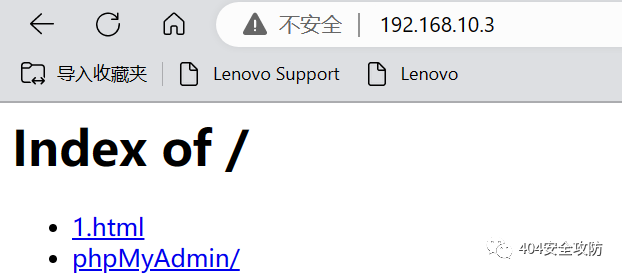

## **二级代理**

在上述代理保持不变的情况下，如下操作

1. 在win2012-1上开启一个监听，监听10000端口

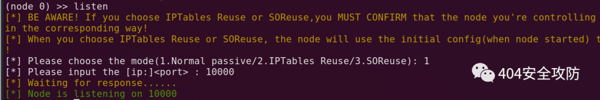

1. win7主动连接win2012-1的10000端口

```
windows_x64_agent.exe -c 192.168.10.9:10000 -s 123 --reconnect 8
```

此时控制端会立即显示新加入的节点

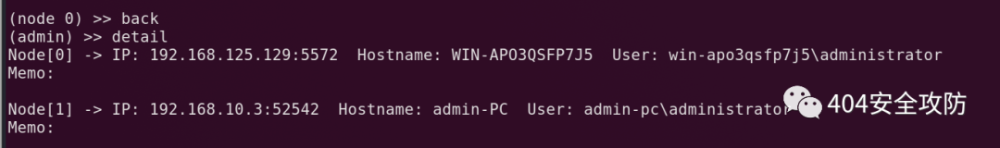

进入新加入的节点 1，添加socks5代理

```
socks 7778 admin admin
```

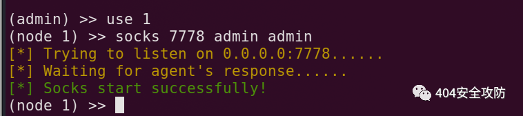

此时proxifier再添加代理服务器和代理规则即可访问第二层网路20.x

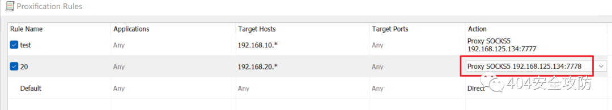

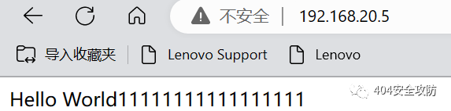

从上可以看出，在进行多级代理搭建时，操作过程非常简单！而且经测试，速度和稳定性还是不错的！


# 利用Stowaway搭建网络代理

yulate哥哥推荐了个操作更简单的代理软件Stowaway https://github.com/ph4ntonn/Stowaway

### 单层代理

服务器端运行：

```
./linux_x64_admin -l 1234 -s 123
```

监听1234端口并且连接key为123

客户端运行：

```
./linux_x64_agent -c Server_ip:1234 -s 123 --reconnect 8
```

意思是用key123连接服务端8000端口，并且掉线时8s重连

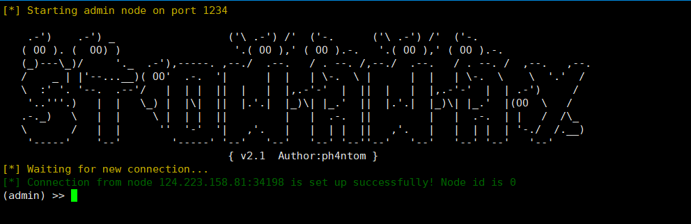

连接成功后在服务器端运行

```
use 0
socks 6666
```

即可在6666端口建立代理

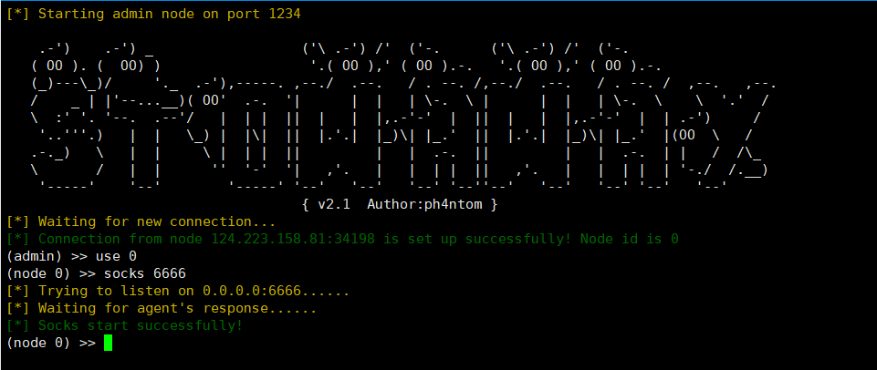

### 多层代理

**控制端**运行：

```
./linux_x64_admin -l 1234 -s 123
```

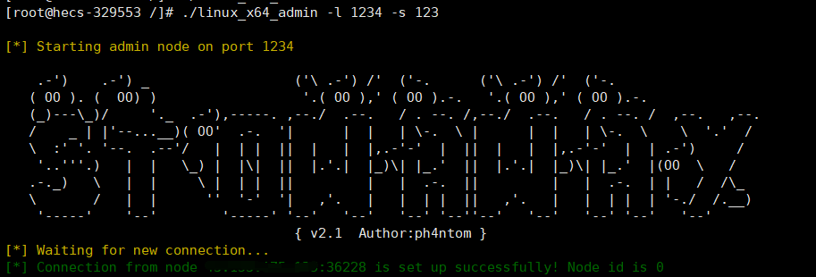

**VPS1**运行：

```
./linux_x64_agent -c 控制端ip:1234 -s 123 --reconnect 8
```

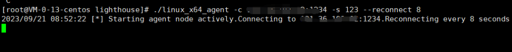

建立连接后在**控制端**运行：

```
use 0
listen
1
1234
```

相当于在**VPS1**上建立了一个监听1234端口的连接

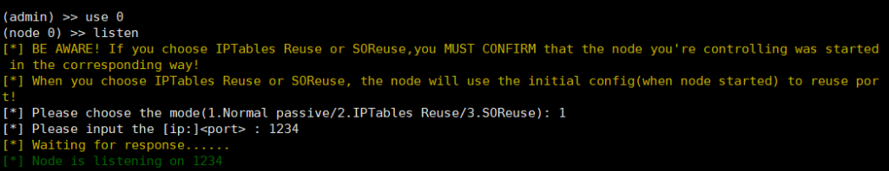

然后用**VPS2**连接VPS1的1234端口

```
./linux_x64_agent -c VPS1:1234 -s 123 --reconnect 8
```

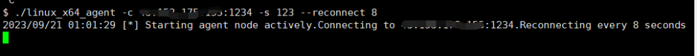

过一会儿会在**控制端**看见新节点node 1加入，这个就是经过VPS1代理的VPS2，选择use 1，socks 6666即可在**控制端**6666端口建立socks5代理

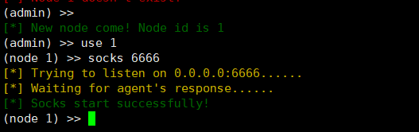

