# 流量分析


## wireshark介绍

Wireshark（前称Ethereal）是一个网络封包分析软件


 网络封包分析软件的功能是撷取网络封包，并尽可能显示出最为详细的网络封包资料。Wireshark 使用 WinPCAP 作为接口，直接与网卡进行数据报文交换


### 捕捉过滤器

数据经过的第一层过滤器， 它用于控制捕捉数据的数量，以避免产生过大的日志文件，用于决定将什么样的信息记录在捕捉结果中，需要在开始捕捉前设置


### 显示过滤器

在 CTF 中基本都是给一个数据包，所以基本都是用显示过滤器来筛选

#### 基本语法


| 语法 | protocol | .    | string1 | .    | string2 | comparison operator | value  | logical operations | other expression |
| ---- | -------- | ---- | ------- | ---- | ------- | ------------------- | ------ | ------------------ | ---------------- |
| 例子 | http     | .    | request | .    | method  | ==                  | "post" | or                 | icmp.type        |


string1和string2是可选的，依据协议过滤时，可直接通过协议来进行过滤，也能依据协议属性值进行过滤


#### 实际使用


打开一个数据包，点击 **表达式** 会看到很多字段

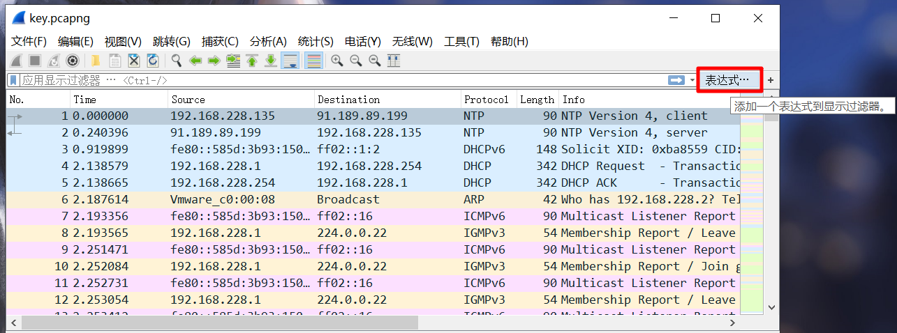


也可以直接输入 http 就会自动过滤


```
 http.request.method==GET 
```

这样就可以过滤用 GET 方式请求的数据


#### 过滤数据


**按照协议过滤：**

snmp || dns || icmp


**按照协议属性值：**


ip.src == 10.230.0.0/16  显示来自10..230网段的封包


tcp.port == 25  显示来源或目的TCP端口号为25的封包


tcp.dstport == 25  显示目的TCP端口号为25的封包


http.request.method == "POST"  显示post请求方式的http封包


http.host == "example.com"   显示请求域名为example.com的http封包


**内容过滤语法：**


tcp contains "http"  显示payload中包含"http"字符串封包


http.request.url contains "online"  显示请求的url包含"online"的http封包


还有个matches来做正则匹配，以后补充


搜索字符串：ctrl+F 选择分组详情、字符串，然后输入想找的查找就可以


右键 -> 追踪 -> TCP流，可以跟踪TCP会话的过程


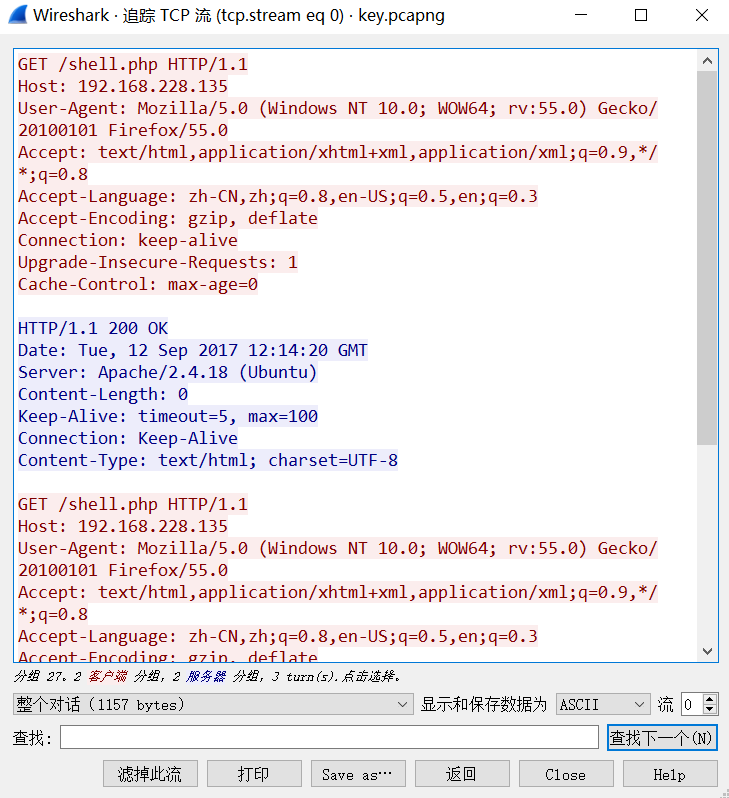


有时候这里会有一些 zip、png、jpg的信息，如果熟悉文件头的话一眼就能看出来，用下面的save as...就可以保存成出来，然后用 winhex 保存成图片或压缩包


### wireshark着色规则


## Tshark


在 wireshark 命令行里的工具

常用参数： -r 设置读取本地文件

-R 


## 键盘流量分析


数据长度为八个字节 

USB流量分为键盘流量和鼠标流量。 

键盘数据包的数据长度为8个字节，击键信息集中在第3个字节 


映射关系 

https://usb.org/sites/default/files/documents/hut1_12v2.pdf


可以用tshark命令可以将 leftover capture data进行提取 

tshark -r 流量包 -T fields -e usb.capdata > usbdata.txt 

提取出来后根据映射关系还原即可

 

状态不好，以后再弄


# wireshark实战


**《wireshark与metasploit实战指南》学习**


## 环境搭建


添加一个 w4sp-lab 用户

```
useradd -m w4sp-lab -s /bin/bash -G sudo -U
```

然后 `passwd w4sp-lab` ，设置好密码之后，使用 w4sp-lab 用户登录

把这个文件拷到虚拟机里面

[📎w4sp-lab.zip](https://cdn.nlark.com/yuque/0/2020/zip/268938/1585643789882-80b56809-6ff0-4dbb-96bb-c62cb0838eb6.zip)


直接用我这个压缩包里的文件，我改好了，用 parrot 反正是安装成功了（虽然不稳定）


然后在文件夹里面：`sudo python w4sp_webapp.py`

等待安装就好了，成功以后有个 setup 点一下就成了下面这样了


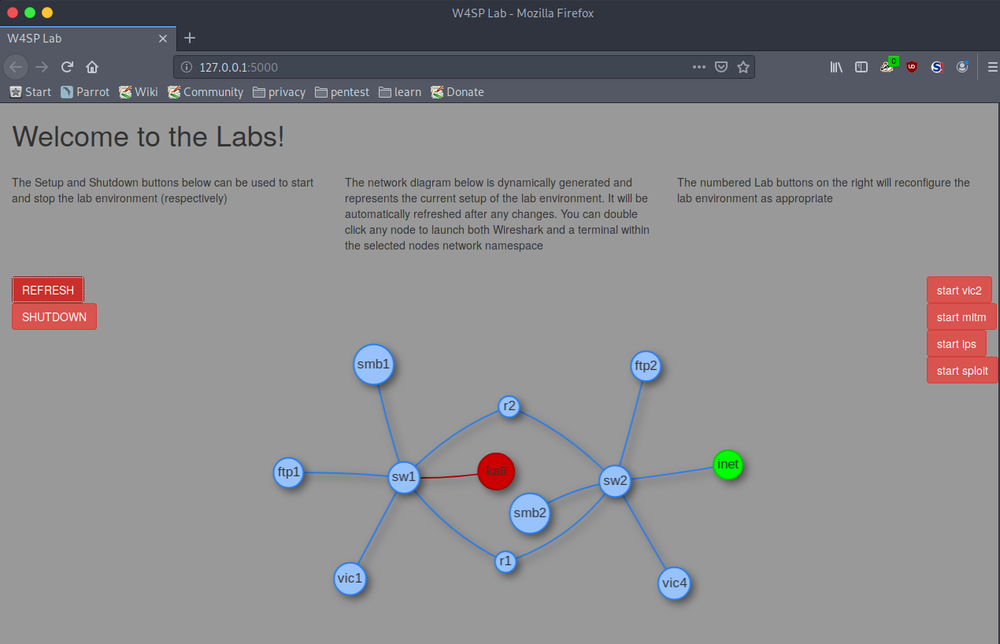


## 中间人攻击


### ARP中间人攻击


首先 sudo python w4sp_webapp.py，把环境拉起来，然后访问 127.0.0.1:5000


在一个新的终端里面打开 msf（命令：msfconsole），使用：`use auxiliary/spoof/arp/arp_poisoning`

补充：打开 msf 的时候加个 sudo，不然待会

You don't have permission to capture on that device (socket: Operation not permitted)


`show options` 看一下需要的参数，我们需要设置 DHOSTS 和 SHOSTS 以及 LOCALSIP（需要用 `show advanced` 查看）


在网络拓扑里面查看一下 我们攻击的目标 vic1 的 IP，`set DHOSTS 192.100.200.167`


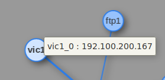


在终端中查看一下我们的网关：`set SHOSTS 192.100.200.1`


把 LOCALSIP 设置为 本机的 ip：`set LOCALSIP 192.100.200.191`


打开 wireshark 抓包看一下

我。。卡死了


重新开一下，同时记录一下各个设备的 ip


| w4sp_lab（本机） | vic1（靶机）    | ftp2（另一网段的ftp） |
| ---------------- | --------------- | --------------------- |
| 192.100.200.191  | 192.100.200.174 | 10.100.200.159        |


sudo setcap 'CAP_NET_RAW+eip CAP_NET_ADMIN+eip' /usr/bin/dumpcap

使用这条命令可以让 dumpcap 无需 root 权限即可使用原生 sockets


抓包，选择 w4sp-lab 那个


同时用 arp-scan -l 可以看到 vic1 的 MAC 地址是 ea:d6:b0:9a:94:10


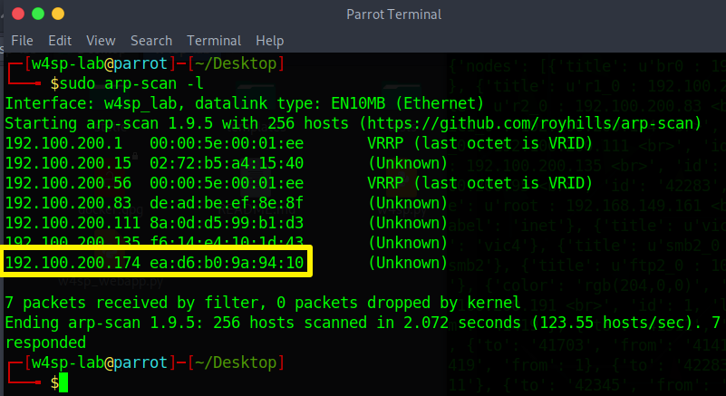


正常的时候 ARP 流量是这样的，只有 vic1 这个机器不断地在询问


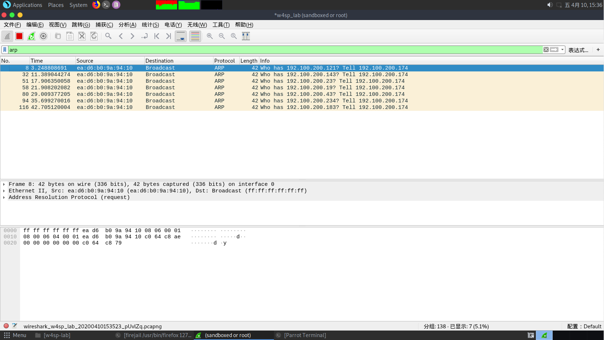


当我们进行 ARP 欺骗之后：


`exploit` 开始攻击（之前的图）


本机开始不断地向 vic1 发送假的信息（可以看到不停发送 arp 信息的就是本机）


同时，vic1 发送给另一个网段的 ftp服务器的信息直接发到了我们这里


针对这种攻击，可以使用 arp -s 添加静态的 arp 表

```
arp -s 192.100.200.1 00:00:5e:00:01:ee
```


### DNS中间人攻击


通过篡改 DNS 流量，使得 DNS 响应把特定主机名解析给攻击者的机器，而不是主机名真正对应的机器

除非系统设置了静态 IP，否则 DNS 服务器的信息，是作为 DHCP 服务器的一个参数一起获得的


DHCP 协议工作步骤：

1、客户端发起一个"Discovery（发现）"广播：有没有 DHCP 服务器？

2、DHCP 服务器向客户端回一个"Offer（供应）"：你准备要这个 IP 嘛？

3、客户端对收到的 IP 地址发送"Request（请求）"：我准备要这个 IP！

4、DHCP 服务器最后回复"Acknowledgment（确认）"：这个 IP 归你了！


除了 IP 地址，DHCP 服务器还会提供其他信息，例如分配的 IP 可以保留多久（租期），同时也提供 DNS 服务器信息

我们打算用 msf 伪造我们的机器位假的 DHCP 和 DNS 服务器提供出去


先伪造 DHCP：

```
sudo msfconsole`，然后 `use auxiliary/server/dhcp
```


分别设置 DNSSERVER、SRVHOST 位本机 IP，NETMASK 设置为 255.255.255.0

`set DNSSERVER 192.100.200.191` 假的 DNS 服务器地址

`set SRVHOST 192.100.200.191` 假的 DHCP 服务器的地址

`set NETMASK 255.255.255.0` 网络掩码


再使用 `use auxiliary/server/fakedns` 来伪造 DNS 服务器


分别攻击参数

`set TARGETACTION FAKE` 对解析的域名采取什么动作，FAKE 表示假冒，如果想测试一下这个模块可以使用 BYPASS（放行）这样会转发给合法的 DNS 服务器

`set TARGETDOMAIN ftp1.labs` 希望解析的域名

`set TARGETHOST 192.100.200.191` 用于解析 DNS 查询的服务器


过一会就会收到每条 DNS 查询信息了


如果不想显示这些东西可以 `jobs -l` 看一下在运行的任务


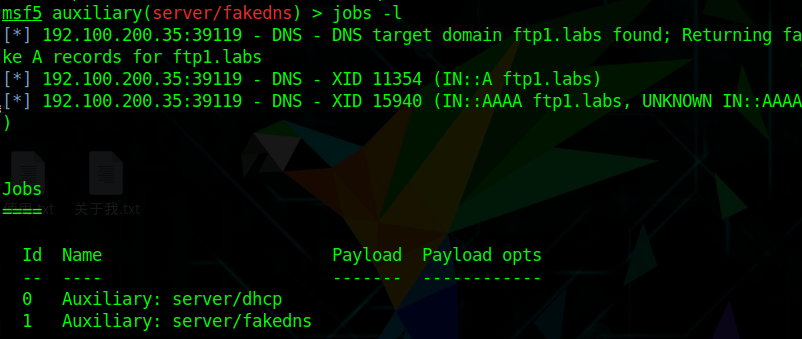


然后 `jobs -k 1`（删掉 id 位 1 的任务）


然后 `exploit -q` 静默运行


可以看到 vic1 向我们的机器查询 ftp1.labs 的地址


我们的机器又告诉他 ftp1.labs 是在 192.100.200.191 也就是本机 ip


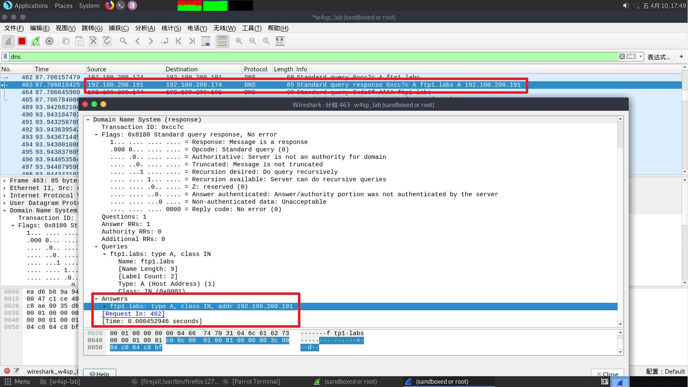


但问题是本机并没有 FTP 服务器，vic1 过来没人搭理他，我们需要再设置一个假的 FTP 服务器来捕获用户的身份信息


`use auxiliary/server/capture/ftp`，甚至不需要什么参数，直接 exploit 就可以了


这样就可以用 wireshark 找到他了


（然而 msf 的终端里也会显示）


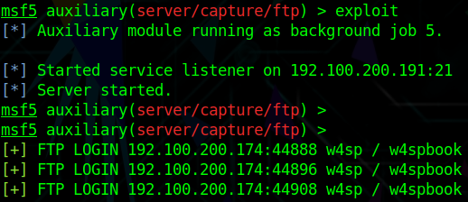


## 攻击相关


### NMAP


| 本机            | 攻击机（ftp1）  |
| --------------- | --------------- |
| 192.100.200.191 | 192.100.200.172 |


使用 nmap 对 ftp1 进行扫描...

实在太卡了，这里就用 kali 扫 DC-5 抓包分析吧

141 是 kali 的 IP，163 是 DC-5 的 IP


#### 全连接方式（-sT）


使用 TCP 连接，与每个端口都进行完整的三次握手

如果目标端口开启：首先 kali 向目标发送 [SYN]，然后目标返回 [SYN,ACK]，kali 再发送 [ACK] 与 [RST,ACK]


如果目标端口未开启：攻击方发起 [SYN] 包，然后攻击方返回 [RST,ACK]


#### 半连接方式（-sS）


SYN 扫描，默认就是这样的

如果端口是开着的，首先 kali 发一个 [SYN]，目标回一个 [SYN,ACK]，kali 再回一个 [RST]


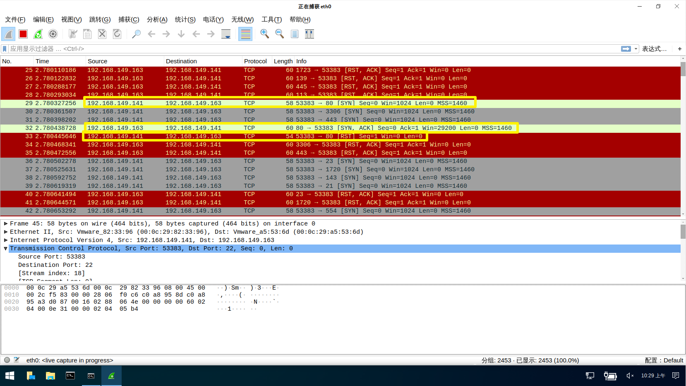


如果是端口没有开，kali 发一个 [SYN]，目标返回一个 [RST,ACK]


#### 秘密扫描TCPFIN（-sN、-sF、-sX）


如果端口存在：kali 发送一个 [FIN]，啥都不返回，Linux 会丢弃这个包，而 Windows 会返回一个 RST 包（可以用来判断系统）


如果不存在：kali 发送一个 [FIN] 包，Linux 与 Windows 都会返回一个 [RST] 包


#### 秘密扫描TCPACK（-sA）


这种方式可以检测目标是否采用了数据包状态检测技术防火墙

发送一个 [ACK]，如果目标主机中回复 [RST] 则证明没有采用防火墙


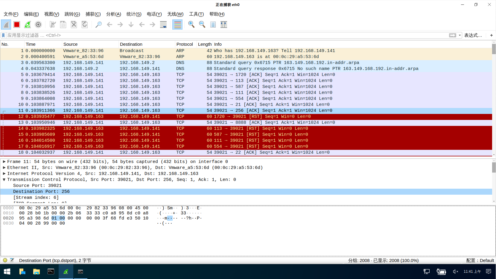


## 漏洞利用


因为涉及到 Metasploitable 这个靶机，先 `docker pull w4sp/labs:sploitable` 拉下来，省的待会点击开启的时候在等，点击那个 start sploit 记录一下靶机的 IP：10.100.200.135


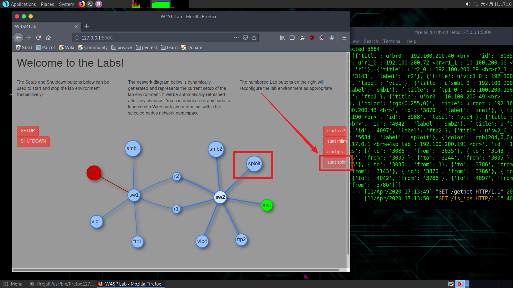


然后启动 msf 进行攻击，使用 VSFTPD 漏洞

```
use exploit/unix/ftp/vsftpd_234_backdoor
```


设置攻击目标 IP，然后开始攻击

```
set RHOST 10.100.200.135
```


有时候建立不起来连接，多试几次


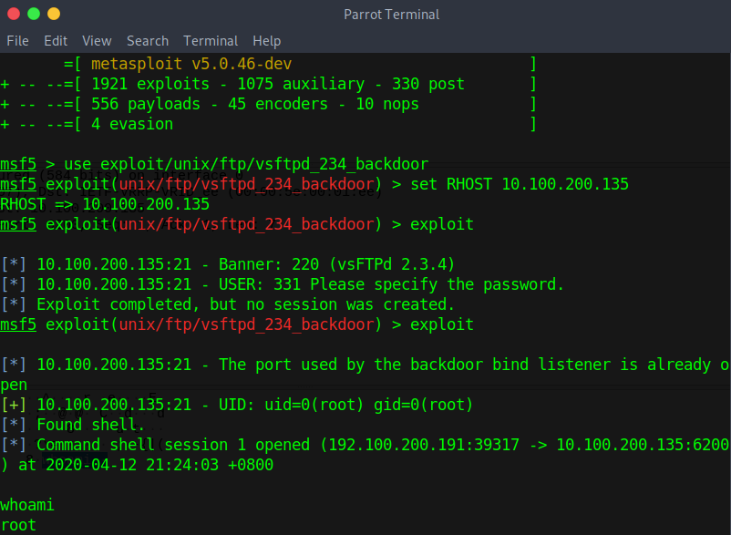


使用过滤器 ip.addr==10.100.200.135 过滤一下，可以看到我们连接后执行的命令和返回的结果


### 从 TCP 流里观察正向 shell

kali：192.100.200.114

metasploitable：10.100.200.156


```
use exploit/multi/misc/java_rmi_server
set RHOST 10.100.200.156
set PAYLOAD java/meterpreter/bind_tcp
```


我们使用 blind_tcp 方式的 meterpreter shell，在第一阶段，meterpreter shell 会在目标机器上监听一个 TCP 端口，等着 msf 连上去，把剩余的 payload 发过去。本质上说，就是我们在目标机器上创建了一个服务程序，然后我们再去连接到这个 shell 上，获得完整的 shell


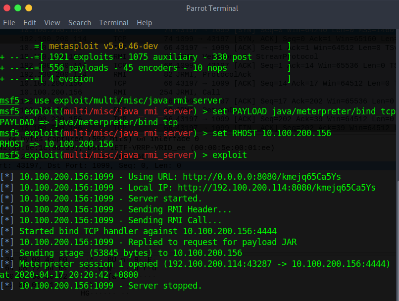


在 wireshark 里查看一下，因为我们攻击的是 1099 端口的 java RMI 服务，所以可以直接过滤一下

tcp.port==1099，然后右键追踪流看一下具体的流量


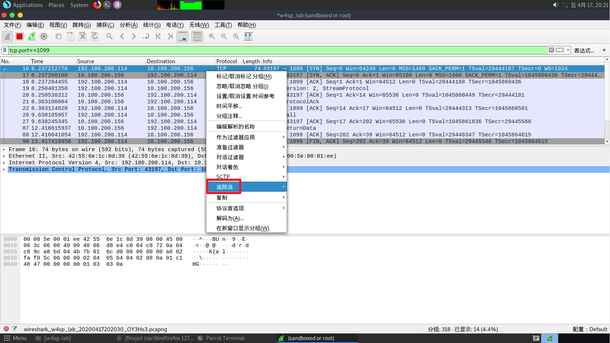


可以看到，在我们本机的 8080 口，下载了一个 .jar 文件


可以过滤一下 8080 端口的流量，追踪流


然而我去过滤 4444 端口的时候，找不到 shell 交流的过程


### 从 TCP 流里观察反向 shell


有点没用...


## 解密 SSL/TLS


要用 浏览器 和 wireshark 同时运行，电脑跑不起来，告辞


## USB 和 wireshark


### Linux 下捕获 USB 流量


linux 内核的 usbmon 模块支持 USB 实时抓包功能，usbmon 能够捕获经过 USB 总线的数据包


sudo modprobe usbmon

lsmod | grep usbmon


这时候打开 wireshark 就会看到


每一个编号对应着一个 usb 设备，可以通过 lsusb 来看一下系统正在用的 USB 设备


这里可以看到 003 后面写着 鼠标(Mouse) 这是 vmware 为虚拟机提供的鼠标输入设备