# 0# 概述

在日常的渗透过程中，不管是前期的外部打点还是后渗透，代理总是绕不开的话题。在前期的外部打点过程中，扫描和渗透测试会不断受到WAF的拦截，需要不停的更换IP进行扫描和渗透测试；而在后期的后渗透过程中，通过Frp和Nps等等工具从入口点出网之后，也需要对接代理进入目标内网进行内网渗透。

本文内容是我个人自己摸索出来的，也有可能别的师傅也有类似的方法哈哈。


# 1# Proxifier介绍

本文我们需要用到一个工具：Proxifier，有不少师傅应该听过它的大名。
Proxifier 是一款代理客户端软件，可以让不支持代理服务器工作的程序变的可行。支持各种操作系统和各代理协议，它的运行模式可以指定端口，指定程序的特点。

Proxifier 的主要用途是在系统级别通过代理服务器强制 Web 请求，从而使来自不支持代理的应用程序的请求通过代理访问其预期网站。

工具下载地址： https://pan.baidu.com/s/1pu_5Wcq1MG5GcN9H4C8-Nw?pwd=sz5v
提取码：sz5v
**注：请各位师傅下载我这里的这个，新版本的汉化版有很多Bug，试过的师傅都知道**

# 2# 操作过程

安装完成后，就可以开始上手配置代理了
总共需要两步：1、配置代理服务器 2、配置代理规则
简单理解：第一步是配置 Proxifier 连上你的代理服务器，第二步是指定对应程序强制走你之前配置好的代理服务器

### 2.1 配置代理服务器

打开安装好的 Proxifier ，点击菜单栏“配置文件”中的“代理服务器”

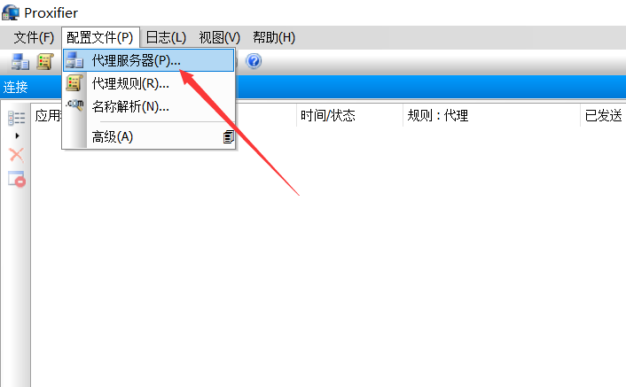

在弹出的窗口中点击“添加”

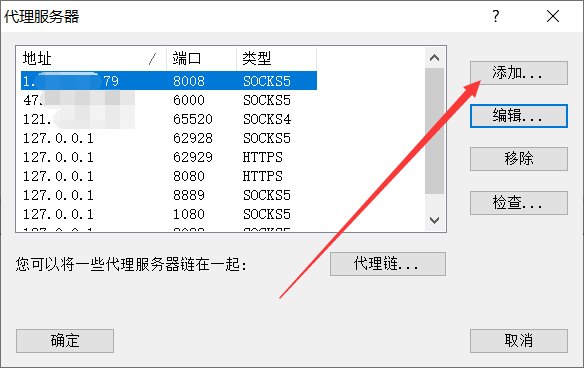

找到代理的服务端的IP和端口（本地代理服务就是 127.0.0.1）并填写和选择对应代理协议，如下图所示：

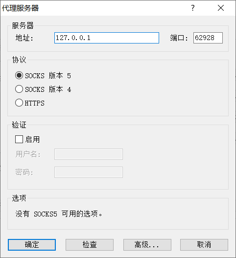

有的师傅到这一步有点蒙圈，我来说一下这里填写的内容在哪找吧：

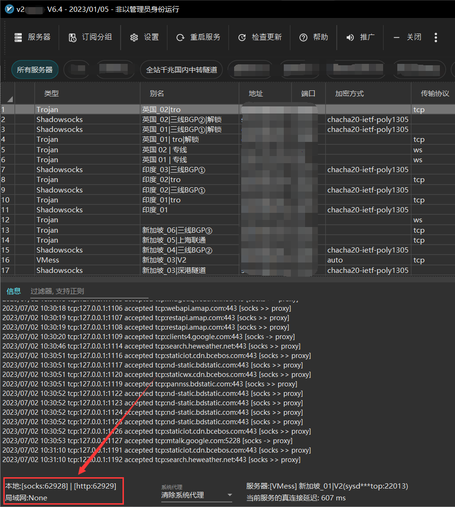

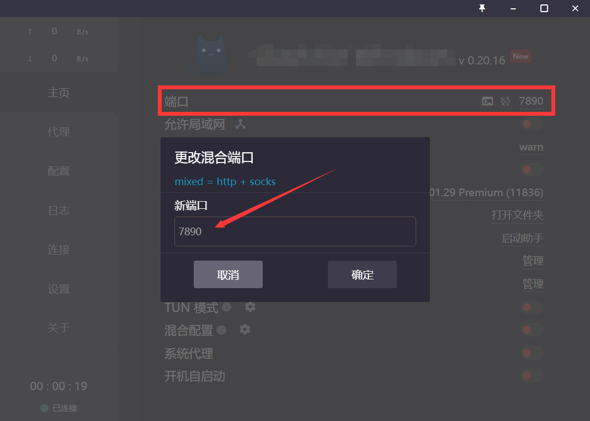

**注：使用本地代理端口，请先测试本地客户端的代理能否可用**
同样类似的，你用啥客户端，就在具体客户端那边找就行了
接下来进行测试，点击下方“检查”按钮

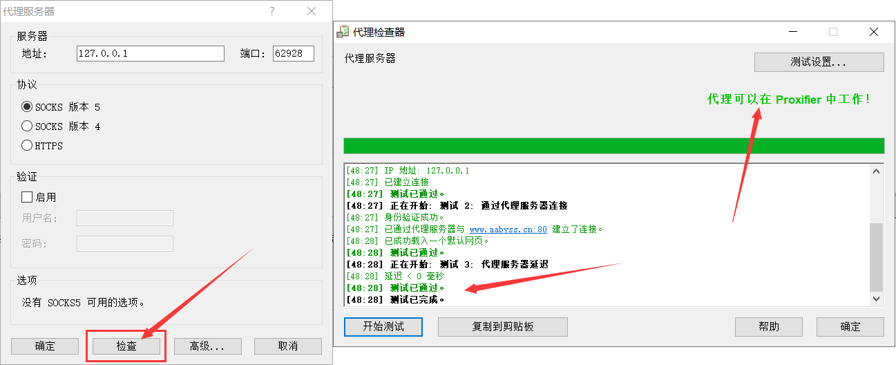

代理测试可用，直接点击“确定”保存即可，然后在列表中能找到你添加的代理服务器

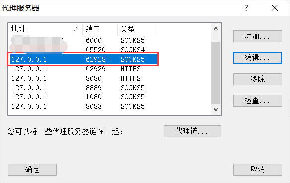

### 2.2 配置代理规则

点击菜单栏“配置文件”中的“代理规则”

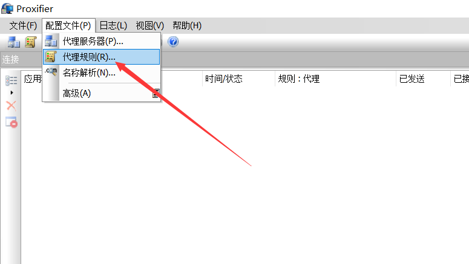

打开“代理规则”列表，点击“添加”按钮

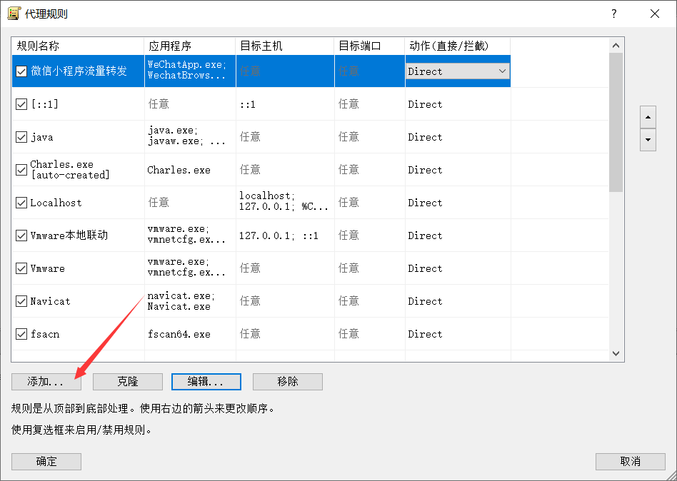

以下，以我将本地所有java运行的工具都走代理作为示例
应用程序处点击“浏览”可以设置指定程序，目标端口处可以设置指定端口（一般不设置）

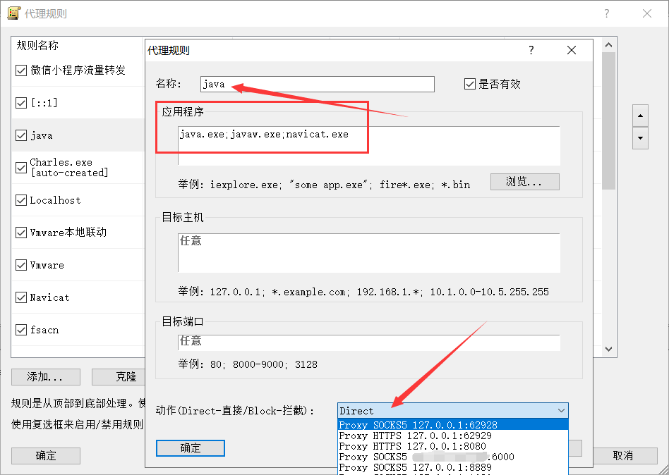

设置完成后点击“确定”即可保存，接下来java进程的程序都可以走代理了

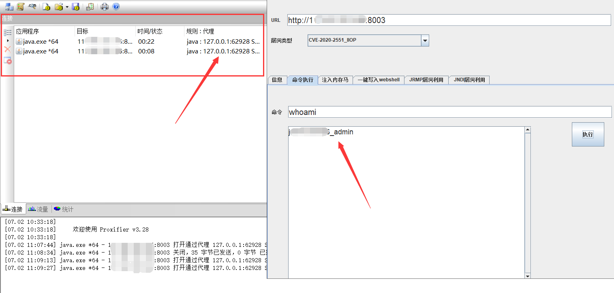

如图所示，直接让Jar工具的流量走代理打出去了

# 3# Proxifier玩转代理

既然了解了 Proxifier 的基本配置，那不是应该骚起来吗~

### 3.0 配置说明

配置其他的之前，要新增一个代理规则，如下：

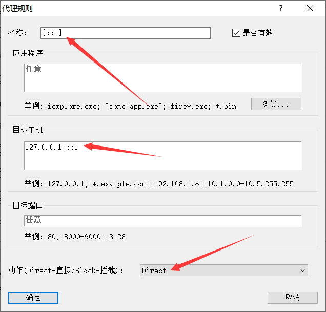

127.0.0.1; ::1

让它 Direct （直接连接，即不走任何代理）即可

说明：
::1是IPv6中的环回地址，将其视为127.0.0.1的IPv6版本
有些进程在本地通讯中会用到这个玩意，必须先让它直连，如果它走代理的话对应的进程会出问题的

由此，这条规则在代理列表里面要处于最高（优先进行），如下：

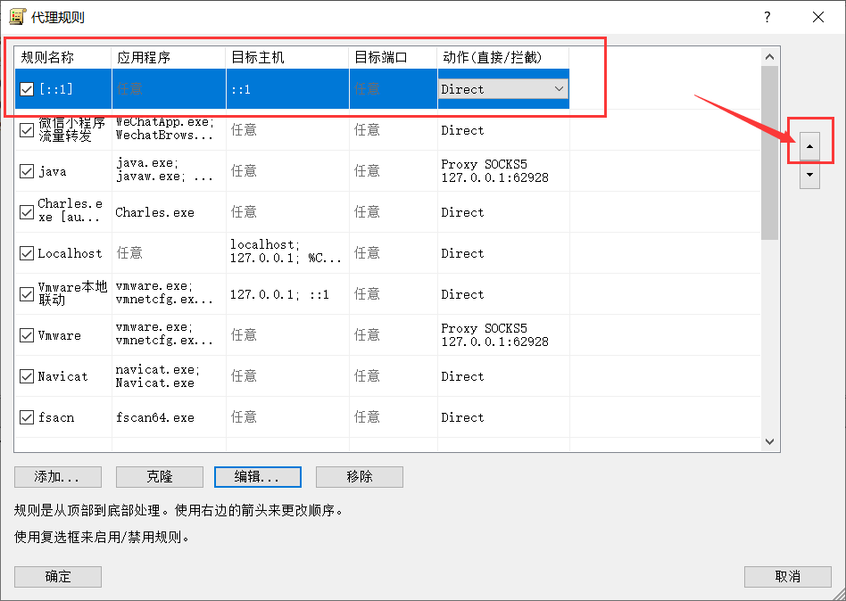

通过右边的按钮，将这条规则调整到第一行（优先执行）

### 3.1 通过Proxifier进行内网渗透

这个在我之前的文章 [2022安恒杯决赛思路](https://blog.zgsec.cn/index.php/archives/68/) 里面提到过，我这里再写一下吧
这里以Frp为例：
下载Frp： [fatedier/frp](https://github.com/fatedier/frp/releases/download/v0.45.0/frp_0.45.0_linux_amd64.tar.gz)

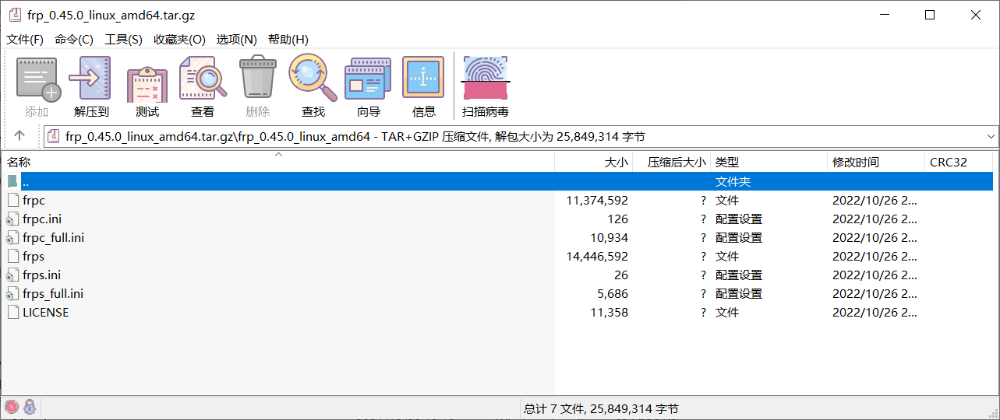

很简单，frpc是客户端，frps是服务端
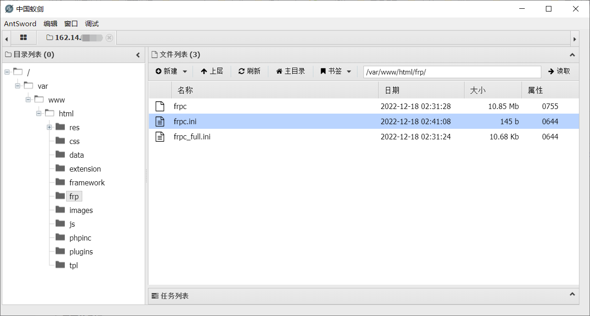

配置frpc.ini:

```plain
# frpc.ini
[common]
server_addr = 自己公网服务器地址
server_port = 7000

[frp]
type = tcp
remote_port = 6000
plugin = socks5    //这一句必须要加，不然代理连不上
```

客户端通过WebShell上传，frps上传到自己的公网服务器上，配置frps.ini:

```plain
# frps.ini
[common]
bind_port = 7000
```

接下来要在自己的公网服务器上开6000和7000这两个端口，并执行命令进行监听：

./frps -c ./frps.ini

再在上线的那台机器上执行命令：

/var/www/html/frp/frpc -c ./frpc.ini

这样就可以成功将内网流量通过公网服务器的6000端口代理出来了，接下来使用 Proxifier 配合Frp对相关进程进行全局代理即可：

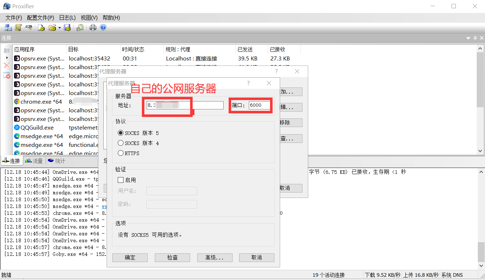

然后直接用工具对内网目标攻击即可（没错，就是你想的那样，工具里面直接填内网IP地址就能打）

### 3.2 通过Proxifier将VM虚拟机代理

很多时候，作为攻击队，我们都需要在纯净的武器库虚拟机中完成自己的渗透（因为蜜罐会尝试获取浏览器Cookie和本地文件，用自己的实体机很快就能被溯源），如何直接让所有的虚拟机都走上代理呢？

**注：本文这个方法，无视任何类型的系统类型和对应配置，只要配置VM网卡出网即可被代理**

如下配置：

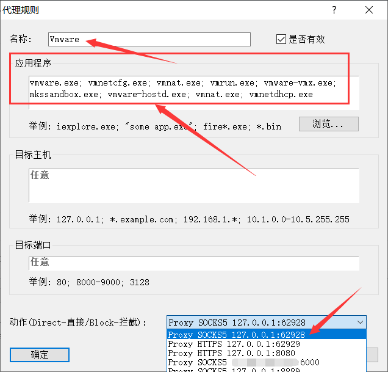

应用程序填写如下：

vmware.exe; vmnetcfg.exe; vmnat.exe; vmrun.exe; vmware-vmx.exe; mkssandbox.exe; vmware-hostd.exe; vmnat.exe; vmnetdhcp.exe

配置完成后，我们来虚拟机里面看看：

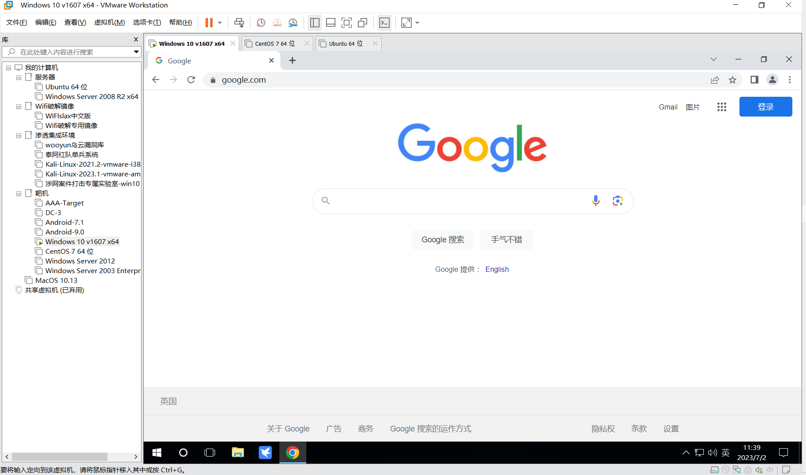

让我们来查看一下虚拟机公网IP地址：

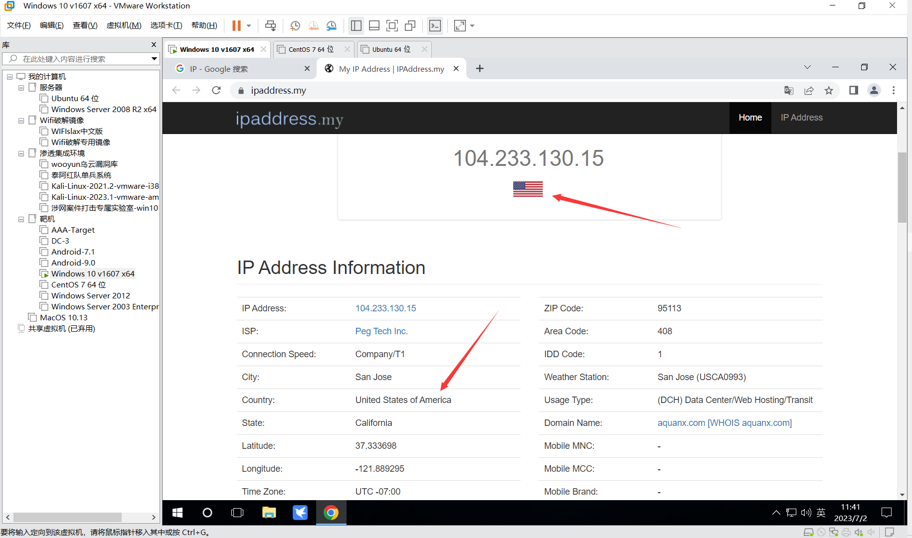

让我们继续来看看Linux的表现：

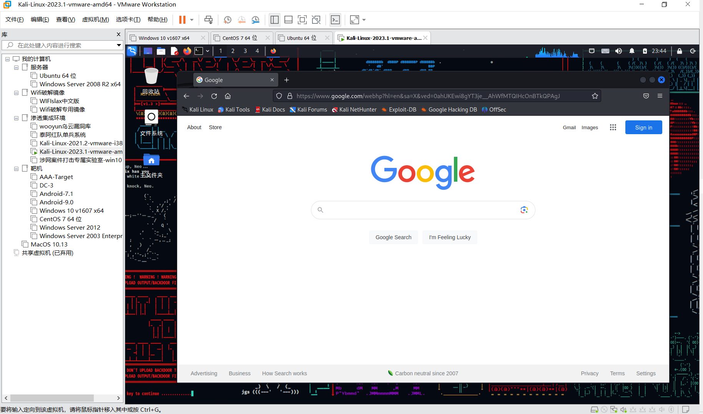

再让我们来查看一下虚拟机公网IP地址：

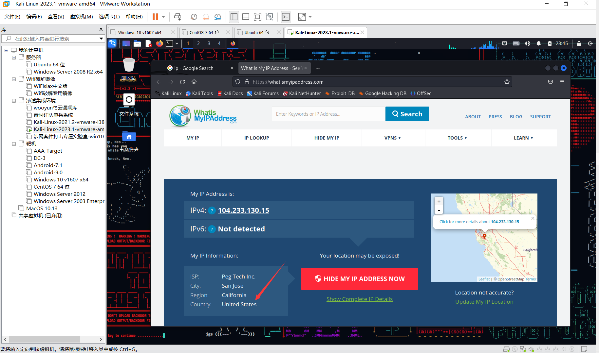

这样整个虚拟机的代理都走上代理，无需在虚拟机中有任何其他配置，就问你骚不骚？

### 3.3 通过Proxifier进行小程序抓包

很多时候，作为攻击队，我们还需要关注目标的小程序和公众号作为突破口，如何对小程序抓包呢？没想到吧哈哈，通过 Proxifier 还能对PC的微信小程序进行抓包~

如下配置：

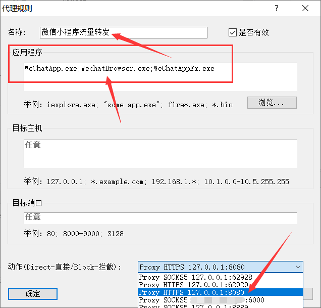

应用程序填写如下：

WeChatApp.exe;WechatBrowser.exe;WeChatAppEx.exe

这里的代理服务器我使用的是 HTTPS://127.0.0.1:8080 这个要看你抓包软件中的配置了，如下：

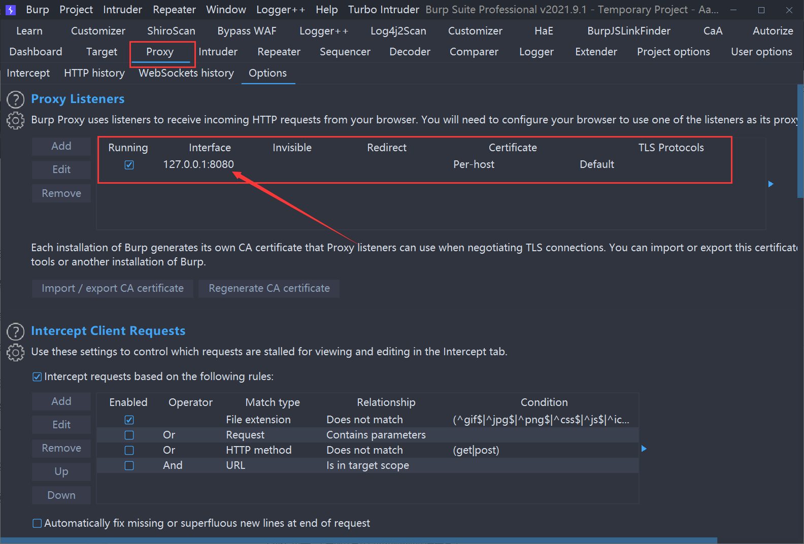

**特别注意：Burp是通过java启动的，那上面配置的java相关的规则要选择** **Direct** **（直接连接，即不走任何代理），否则两者会冲突！！！**

接下来让我们打开微信，试试看吧~
随便找个小程序，然后看Burp中 Proxy 的 HTTP History 有无反应:

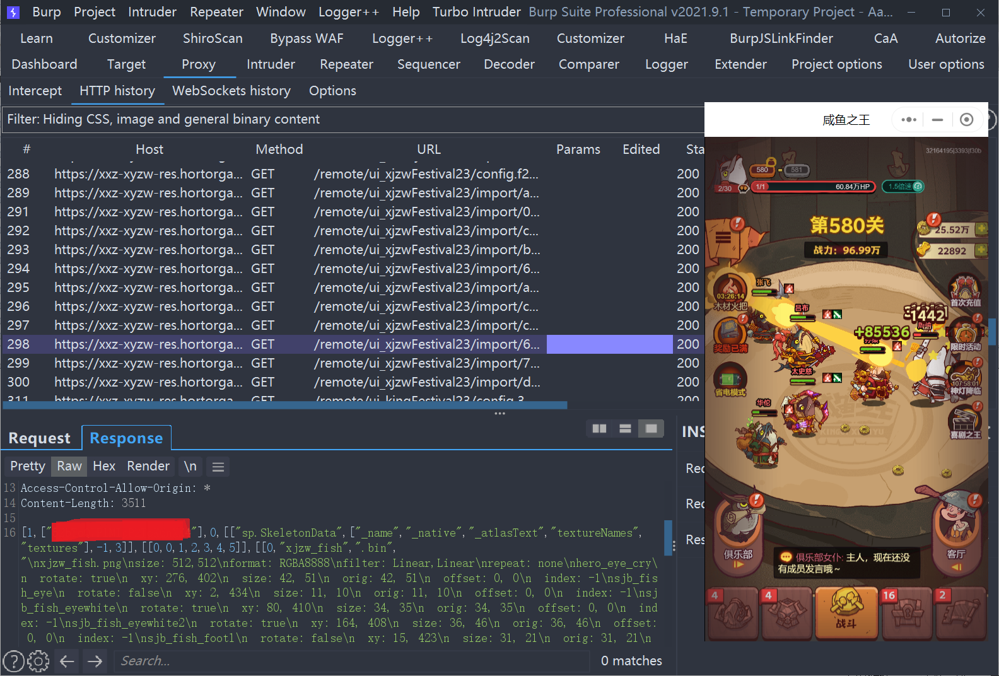

**注：这里Burp中** **Proxy** **的** **Intercept** **要选择将流量放行**

### 3.4 补充

写完这篇文章后，有师傅反馈说按照我文章里面配置好了，但是还是没有代理成功，那可以尝试我这边导入配置文件的方法：

配置文件下载地址： https://pan.baidu.com/s/16FLCGFkMNjk4UFxPr-yu2A?pwd=inr8
提取码: inr8

下载完后请解压出 Default.ppx 文件
然后点击 Proxifier 左上角的“文件”-->“导入配置文件”，选择解压出的 Default.ppx 文件即可导入成功

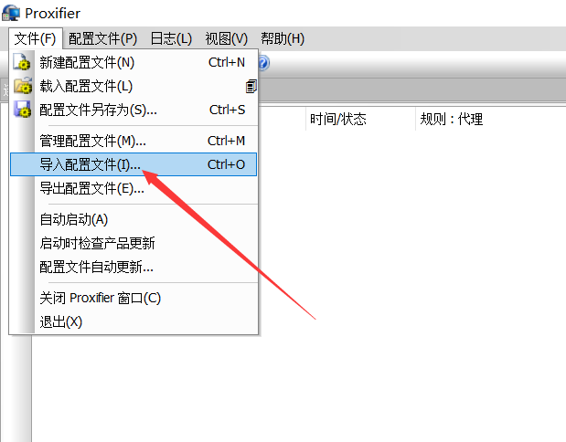

**注：导入成功后，记得要将“代理服务器”里面的地址和端口改成自己客户端的噢~**